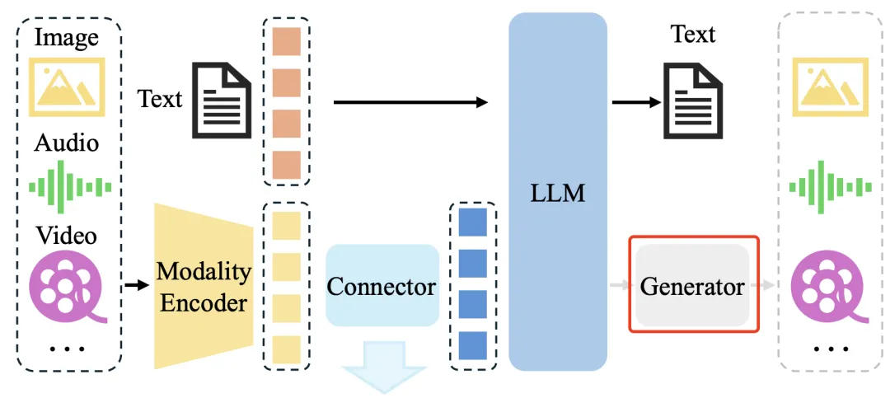
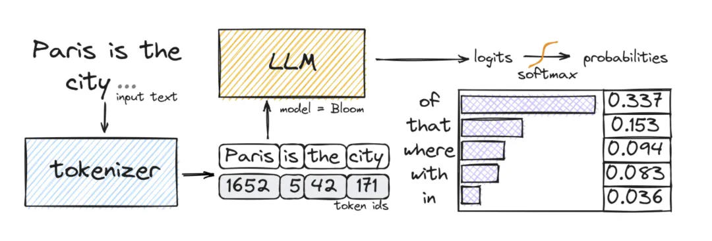
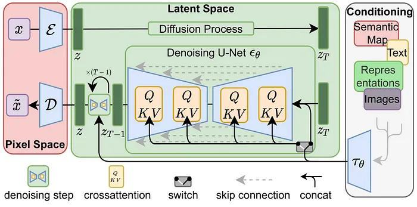
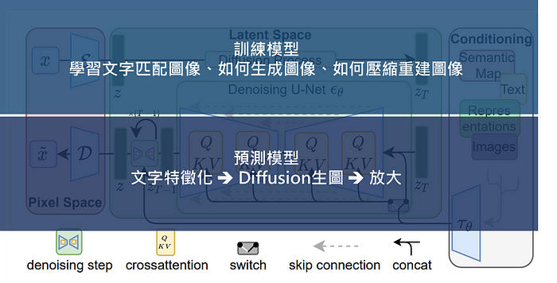
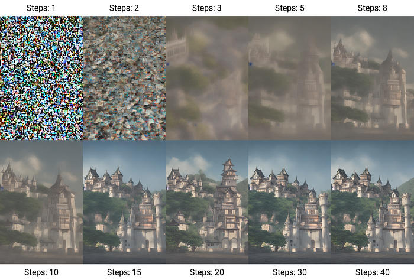
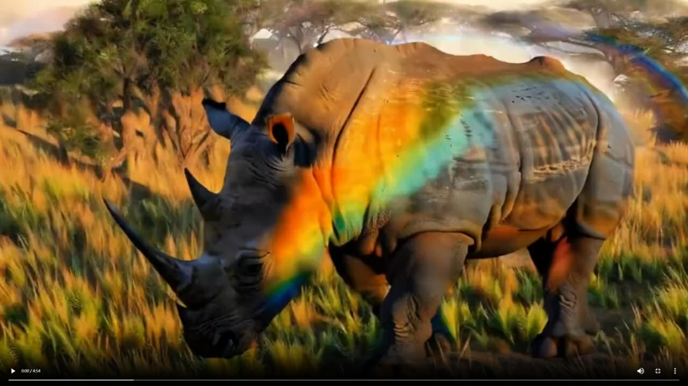

# 多模态-模态生成器
目录
--

*   [1.什么是多模态大模型中的模态生成器？](#1.%E4%BB%80%E4%B9%88%E6%98%AF%E5%A4%9A%E6%A8%A1%E6%80%81%E5%A4%A7%E6%A8%A1%E5%9E%8B%E4%B8%AD%E7%9A%84%E6%A8%A1%E6%80%81%E7%94%9F%E6%88%90%E5%99%A8%EF%BC%9F)
*   [2.多模态模型中文本生成器的过程和原理？](#2.%E5%A4%9A%E6%A8%A1%E6%80%81%E6%A8%A1%E5%9E%8B%E4%B8%AD%E6%96%87%E6%9C%AC%E7%94%9F%E6%88%90%E5%99%A8%E7%9A%84%E8%BF%87%E7%A8%8B%E5%92%8C%E5%8E%9F%E7%90%86%EF%BC%9F)
*   [3.多模态模型中图像生成器使用的扩散模型的组件有哪些？](#3.%E5%A4%9A%E6%A8%A1%E6%80%81%E6%A8%A1%E5%9E%8B%E4%B8%AD%E5%9B%BE%E5%83%8F%E7%94%9F%E6%88%90%E5%99%A8%E4%BD%BF%E7%94%A8%E7%9A%84%E6%89%A9%E6%95%A3%E6%A8%A1%E5%9E%8B%E7%9A%84%E7%BB%84%E4%BB%B6%E6%9C%89%E5%93%AA%E4%BA%9B%EF%BC%9F)
*   [4.Stable-Diffusion模型中，有哪几种不同的sampling方法可以用来生成数据？](#4.Stable-Diffusion%E6%A8%A1%E5%9E%8B%E4%B8%AD%EF%BC%8C%E6%9C%89%E5%93%AA%E5%87%A0%E7%A7%8D%E4%B8%8D%E5%90%8C%E7%9A%84sampling%E6%96%B9%E6%B3%95%E5%8F%AF%E4%BB%A5%E7%94%A8%E6%9D%A5%E7%94%9F%E6%88%90%E6%95%B0%E6%8D%AE%EF%BC%9F)
*   [5.简要介绍视频生成器Zeroscope的工作内容？](#5.%E7%AE%80%E8%A6%81%E4%BB%8B%E7%BB%8D%E8%A7%86%E9%A2%91%E7%94%9F%E6%88%90%E5%99%A8Zeroscope%E7%9A%84%E5%B7%A5%E4%BD%9C%E5%86%85%E5%AE%B9%EF%BC%9F)
*   [6.阐述音频生成器AudioLDM的框架原理？](#6.%E9%98%90%E8%BF%B0%E9%9F%B3%E9%A2%91%E7%94%9F%E6%88%90%E5%99%A8AudioLDM%E7%9A%84%E6%A1%86%E6%9E%B6%E5%8E%9F%E7%90%86%EF%BC%9F)

1.什么是多模态大模型中的模态生成器？
-------------------

在多模态流程的后期，需要根据LLM的输出将其转换回目标任务所需的格式，那么在格式转换完成之后，最后一步就是根据我们任务的最终目的，生成图像、视频或者音频，模态生成器就是来做这个事情。

模态生成器(Modality Generator，简称MG)的任务是产生不同模态的输出。在现有的工作中，通常使用潜在扩散模型（Latent Diffusion Models，LDMs) 实现，例如非常有名的用于图像生成的 Stable Diffusion，以及用于视频合成的 Zeroscope、用于音频生成的 AudioLDM-2 等。

输出投影器映射得到的特征 $H\_x$ 作为去噪过程中的条件输入，用以生成多模态内容。在训练过程中，ground truth首先通过预训练的变分自编码器 $Q$（VAE）转换成潜在特征 $z\_0$。接着，向 $z\_0$ 中加入噪声 $\\epsilon$，得到含噪声的潜在特征 $z\_t$。然后，使用预训练的 U-Net $\\epsilon\_x$ 来计算条件 LDM 损失 $\\mathcal{L}\_{X-gen}$，其公式如下：

$$ \\mathcal{L}_{X-gen} := E_{\\epsilon \\sim \\mathcal{N}(0,1), t} ||\\epsilon - \\epsilon\_X(z\_t, t, H\_x)||\_2^2 $$

这个公式的意思是，对于服从标准正态分布的噪声 $\\epsilon$ 和某个时间步长 $t$，计算实际噪声 $\\epsilon$ 与通过 U-Net 生成的预测噪声 $\\epsilon\_X(z\_t, t, H\_x)$ 之间的均方误差（MSE）。通过最小化这个损失函数 $\\mathcal{L}\_{X-gen}$，可以优化参数 $\\Theta\_X \\rightarrow T$ 和 $\\Theta\_T \\rightarrow X$，从而提高生成内容的准确性和质量。

下图中红框部分即为模态生成器： 

2.多模态模型中文本生成器的过程和原理？
--------------------

Text Generation 是指利用自然语言处理技术，特别是大型语言模型（LLM）来自动产生人类可读的文本。在现代人工智能领域，LLM 已经成为文本生成任务中的核心工具，它们通过学习大量的文本数据来理解语言的结构和语义，从而能够生成连贯、有意义的文本。

LLM 本身就天然支持直接生成文本，这一能力主要得益于其内部的学习机制和训练目标。在生成文本时，LLM 可以采用多种解码策略，其中两种常见的方法是 BPE decoding 和 Beam search。

BPE decoding（Byte Pair Encoding decoding）是一种中间步骤，它将文本分割成子词序列，这样可以更好地处理罕见词汇和未知词汇。在生成文本时，LLM 会根据概率分布预测下一个子词，然后将这些子词拼接起来形成完整的句子。这种方法有助于提高生成文本的多样性和准确性。

Beam search 则是一种搜索算法，用于在生成文本的过程中找到最有可能的序列。与简单的贪婪搜索不同，Beam search 在每一步都会保留多个候选序列，并根据它们的概率进行排序。最终，它会选择概率最高的序列作为输出结果。这种方法可以在保证生成文本质量的同时，减少生成时间。

除了这两种方法，LLM 还可以采用其他解码策略，如 Top-K sampling 和 Top-p (nucleus) sampling，这些策略可以在一定程度上控制生成文本的多样性和创造性。

3.多模态模型中图像生成器使用的扩散模型的组件有哪些？
---------------------------

图像生成是扩散模型应用最为广泛的领域之一。潜在扩散模型（Latent Diffusion Models, LDMs），如 Stable Diffusion，已经成为生成高质量图像的重要工具。这些模型通常首先将图像编码到一个潜在空间中，然后在潜在空间中进行扩散和去噪过程。通过这种方式，LDMs 能够生成分辨率高、细节丰富的图像，并且可以很容易地与其他图像处理技术结合，如风格迁移。

Stable Diffusion 在2022年发表，一种基于Latent Diffusion Models的新兴机器学习技术。它基于扩散过程，利用数学模型将机器学习中的高维度数据降低到低维度空间，并在该空间中进行训练。Stable Diffusion的原理涉及到以下三个组件：

（1）Text Encoder 文字特征化：为了输入文字的内容，我们要先有一个powerful的文字特征萃取器，可以是GPT、BERT等常见的主流Transformer model，总之能把文字特征做得好，就好的是Encoder 。

（2）Diffusion Model 扩散模型：透过降躁过程，将一个潜在空间Latent Space的图像，逐步转回真实图像的技术，里面用到U-Net架构及Attenation技术，来提高模型表现，与传统的Diffusion略有不同。

（3）VAE (Variational Autoencoder)：变分自编码器，负责图像在潜在空间的压缩与重建，压缩后的图像能让模型学得更快更好。

以功能来切，大概可以这样理解:

以模型的学习与训练来看，可以这样理解：

将高维特征压缩到低维，然后在低维空间上进行操作的方法具有泛用性，可以很容易推广到文本、音频、影像等数据。

4.Stable-Diffusion模型中，有哪几种不同的sampling方法可以用来生成数据？
------------------------------------------------

以下是一些常见的sampling方法：

（1）Gaussian sampling：是Stable Diffusion中最常用的一种sampling方法。它通过将高斯噪声添加到数据中来生成新的样本。这种方法可以帮助模型更好地理解数据的分布和特征。

（2）Langevin sampling：一种基于随机梯度下降的sampling方法。它通过将随机噪声添加到梯度中来生成新的样本。这种方法可以帮助模型更好地处理高度非线性的数据。

（3）Metropolis-Hastings sampling：一种Markov Chain Monte Carlo（MCMC）方法，它可以生成一个序列来表示数据的分布。这种方法可以帮助模型更好地理解数据的复杂性和不确定性。

（4）Hamiltonian Monte Carlo sampling：一种MCMC方法，它可以利用动态系统的特性来生成数据样本。这种方法可以帮助模型更好地理解数据中的隐含结构和特征。

（5）Diffusion Process Model：DPM是基于扩散过程的理论原理，通过对数据样本中的噪声进行建模，可以帮助消除数据中的噪声和偏差，提高模型的准确性和泛化能力。

这些方法在Stable Diffusion的参数中都可以调整，其中Sampling step更会影响图片生成的运算时间及效果，原则上会根据采样方法不同而有所差异。

5.简要介绍视频生成器Zeroscope的工作内容？
--------------------------

视频生成是一个更为复杂的任务，因为它不仅要考虑单个帧的质量，还要保证帧间的连贯性。Zeroscope 是一个基于扩散模型的视频合成工具，它通过逐帧生成视频内容并确保相邻帧之间的平滑过渡来实现视频的生成。这种方法可以生成连续、流畅的视频，尽管计算成本较高，但在生成高质量视频内容方面具有巨大潜力。

Zeroscope源于Modelscope，这是一个具有17亿个参数的多级文本到视频扩散模型。它根据文本描述生成视频内容。

Zeroscope完善了这一概念，提供了更高的分辨率，没有Shutterstock水印，并且更接近16：9的纵横逼比。

Zeroscope具有两个组件：Zeroscope\_v2 567w，旨在以576×320像素的分辨率快速创建内容，以探索视频概念。然后可以使用zeroscope\_v2 XL将高质量的视频升级到1024×576的“高清”分辨率。

对于视频生成，该模型需要 7.9 GB 的 VRam，分辨率为 576×320 像素，帧速率为 30 帧/秒，15.3 GB 的 VRam，分辨率为 1024×576 像素，相同帧速率。因此，较小的型号应在许多标准图形卡上运行。

除了24 帧（1024 x 576 分辨率）的9,923 个剪辑和 29,769 个标记帧之外，该模型还根据 ModeScope 的原始权重进行了训练。因此，它创建的输出比 ModelScope 稍好一些。

训练期间的这种噪声引入增强了模型对数据分布的理解。因此，该模型可以生成更多样化的逼真视频，并更有效地解释文本描述中的变体。

6.阐述音频生成器AudioLDM的框架原理？
-----------------------

音频生成也是扩散模型应用的一个重要方向。AudioLDM 系列是一个专门用于生成音频内容的模型，它可以生成包括音乐、语音在内的各种声音效果。与图像和视频生成类似，音频生成也涉及到信号的扩散和去噪过程。AudioLDM系列 通过学习音频信号的分布特性，能够生成听起来自然且具有丰富情感的音频样本。

下图总结了AudioLDM的框架原理：

（1）给定文本输入，使用了两种文本编码器模型来计算文本嵌入:CLAP的文本分支和Flan-T5的文本编码器。CLAP用于与相应音频样本对齐，而Flan-T5则更好地表示文本的语义。

（2）以CLAP和Flan-T5嵌入为输入，GPT2被用于生成N个新的嵌入向量的序列。

（3）GPT2生成的嵌入向量和Flan-T5文本嵌入被用作LDM中的交叉注意力条件，通过反向扩散过程去噪一个随机的潜变量。LDM在反向扩散过程中运行总共T个推理步骤;

（4）去噪的潜变量被传递给VAE解码器，以恢复 Mel spectrogram;

（5）最终获得输出的音频波形。