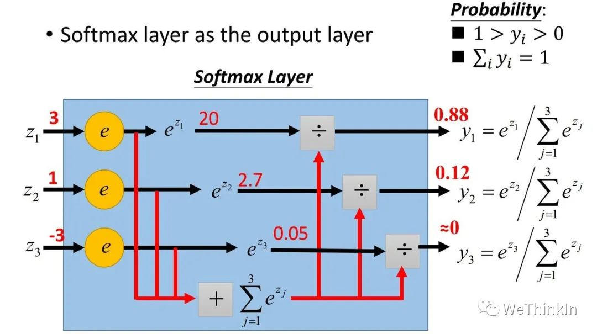
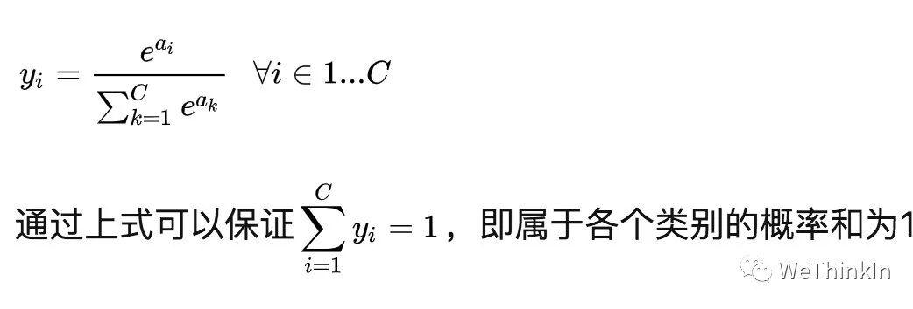
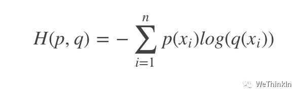
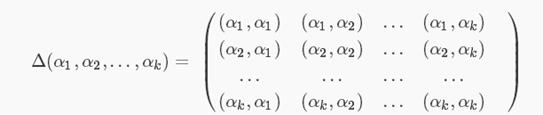
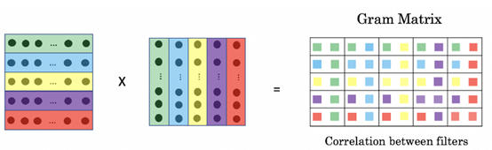
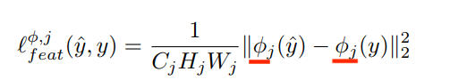
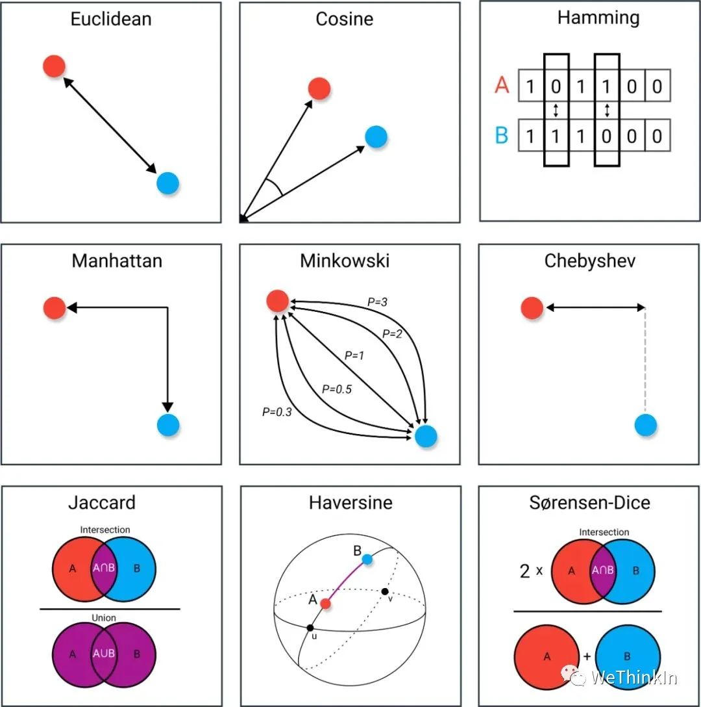

# 损失函数知识点
* * *

created: 2025-01-25T00:41 updated: 2025-01-26T02:20
---------------------------------------------------

目录
--

*   [1.Softmax的定义和作用](#user-content-1.softmax%E7%9A%84%E5%AE%9A%E4%B9%89%E5%92%8C%E4%BD%9C%E7%94%A8)
*   [2.交叉熵定义和作用](#user-content-2.%E4%BA%A4%E5%8F%89%E7%86%B5%E5%AE%9A%E4%B9%89%E5%92%8C%E4%BD%9C%E7%94%A8)
*   [3.格拉姆矩阵的相关概念？](#user-content-3.%E6%A0%BC%E6%8B%89%E5%A7%86%E7%9F%A9%E9%98%B5%E7%9A%84%E7%9B%B8%E5%85%B3%E6%A6%82%E5%BF%B5%EF%BC%9F)
*   [4.感知损失的相关概念?](#user-content-4.%E6%84%9F%E7%9F%A5%E6%8D%9F%E5%A4%B1%E7%9A%84%E7%9B%B8%E5%85%B3%E6%A6%82%E5%BF%B5)
*   [5.KL散度相关概念](#user-content-5.kl%E6%95%A3%E5%BA%A6%E7%9B%B8%E5%85%B3%E6%A6%82%E5%BF%B5)
*   [6.JS散度相关概念](#user-content-6.js%E6%95%A3%E5%BA%A6%E7%9B%B8%E5%85%B3%E6%A6%82%E5%BF%B5)
*   [7.什么是机器学习中的局部最优与全局最优？](#user-content-7.%E4%BB%80%E4%B9%88%E6%98%AF%E6%9C%BA%E5%99%A8%E5%AD%A6%E4%B9%A0%E4%B8%AD%E7%9A%84%E5%B1%80%E9%83%A8%E6%9C%80%E4%BC%98%E4%B8%8E%E5%85%A8%E5%B1%80%E6%9C%80%E4%BC%98%EF%BC%9F)
*   [8.介绍一下机器学习中的目标函数、代价函数和损失函数的概念](#user-content-8.%E4%BB%8B%E7%BB%8D%E4%B8%80%E4%B8%8B%E6%9C%BA%E5%99%A8%E5%AD%A6%E4%B9%A0%E4%B8%AD%E7%9A%84%E7%9B%AE%E6%A0%87%E5%87%BD%E6%95%B0%E3%80%81%E4%BB%A3%E4%BB%B7%E5%87%BD%E6%95%B0%E5%92%8C%E6%8D%9F%E5%A4%B1%E5%87%BD%E6%95%B0%E7%9A%84%E6%A6%82%E5%BF%B5)
*   [9.常用的距离度量方法](#user-content-9.%E5%B8%B8%E7%94%A8%E7%9A%84%E8%B7%9D%E7%A6%BB%E5%BA%A6%E9%87%8F%E6%96%B9%E6%B3%95)
*   [10.KL散度和交叉熵的区别是什么？](#user-content-10.KL%E6%95%A3%E5%BA%A6%E5%92%8C%E4%BA%A4%E5%8F%89%E7%86%B5%E7%9A%84%E5%8C%BA%E5%88%AB%E6%98%AF%E4%BB%80%E4%B9%88%EF%BC%9F)
*   [11.介绍一下总变分损失的概念与作用](#user-content-11.%E4%BB%8B%E7%BB%8D%E4%B8%80%E4%B8%8B%E6%80%BB%E5%8F%98%E5%88%86%E6%8D%9F%E5%A4%B1%E7%9A%84%E6%A6%82%E5%BF%B5%E4%B8%8E%E4%BD%9C%E7%94%A8)
*   [12.机器学习中将余弦相似度作为损失函数有哪些优势？](#user-content-12.%E6%9C%BA%E5%99%A8%E5%AD%A6%E4%B9%A0%E4%B8%AD%E5%B0%86%E4%BD%99%E5%BC%A6%E7%9B%B8%E4%BC%BC%E5%BA%A6%E4%BD%9C%E4%B8%BA%E6%8D%9F%E5%A4%B1%E5%87%BD%E6%95%B0%E6%9C%89%E5%93%AA%E4%BA%9B%E4%BC%98%E5%8A%BF%EF%BC%9F)
*   [13.介绍一下机器学习中的L2损失函数](#user-content-13.%E4%BB%8B%E7%BB%8D%E4%B8%80%E4%B8%8B%E6%9C%BA%E5%99%A8%E5%AD%A6%E4%B9%A0%E4%B8%AD%E7%9A%84L2%E6%8D%9F%E5%A4%B1%E5%87%BD%E6%95%B0)
*   [14.介绍一下机器学习中的MSE损失函数](#user-content-14.%E4%BB%8B%E7%BB%8D%E4%B8%80%E4%B8%8B%E6%9C%BA%E5%99%A8%E5%AD%A6%E4%B9%A0%E4%B8%AD%E7%9A%84MSE%E6%8D%9F%E5%A4%B1%E5%87%BD%E6%95%B0)
*   [15.介绍一下机器学习中的Huber Loss损失函数](#user-content-15.%E4%BB%8B%E7%BB%8D%E4%B8%80%E4%B8%8B%E6%9C%BA%E5%99%A8%E5%AD%A6%E4%B9%A0%E4%B8%AD%E7%9A%84Huber-Loss%E6%8D%9F%E5%A4%B1%E5%87%BD%E6%95%B0)

1.Softmax的定义和作用
---------------

在二分类问题中，我们可以使用sigmoid函数将输出映射到【0，1】区间中，从而得到单个类别的概率。当我们将问题推广到多分类问题时，可以使用Softmax函数，对输出的值映射为概率值。

其定义为：

其中a代表了模型的输出。

2.交叉熵定义和作用
----------

交叉熵（cross entropy）常用于深度学习中的分类任务，其可以表示预测值与ground truth之间的差距。

交叉熵是信息论中的概念。其定义为：

$P$ 代表 $gt$ 的概率分布， $q$ 代表预测值的概率分布。交叉熵从相对熵（KL散度）演变而来， $log$ 代表了信息量， $q$ 越大说明可能性越大，其信息量越少；反之则信息量越大。通过不断的训练优化，逐步减小交叉熵损失函数的值来达到缩小 $p$ 和 $q$ 距离的目的。

3.格拉姆矩阵的相关概念？
-------------

n维欧式空间中任意k个向量之间两两的内积所组成的矩阵，称为这k个向量的格拉姆矩阵(Gram matrix)，这是一个对称矩阵。

其中对角线元素提供了k个不同特征图（a1，a2 ... ，ak）各自的信息，其余元素提供了不同特征图之间的相关信息。既能体现出有哪些特征，又能体现出不同特征间的紧密程度。图像风格迁移领域将其定义为风格特征。

格拉姆矩阵在风格迁移中有广泛的应用，深度学习中经典的风格迁移流程是：

1.  准备基线图像和风格图像。
    
2.  使用特征提取器分别提取基线图像和风格图像的feature map。
    
3.  分别计算两个图像的feature map的格拉姆矩阵，以两个图像的格拉姆矩阵的差异最小化为优化目标，不断调整基线图像，使风格不断接近目标风格图像。
    

4.感知损失的相关概念?
------------

感知损失在图像生成领域中比较常用。其核心是将gt图片卷积得到的高层feature与生成图片卷积得到的高层feature进行回归，从而约束生成图像的高层特征（内容和全局结构）。

上面的公式中，划线部分代表了高层特征，一般使用VGG作为特征提取器。

5.KL散度相关概念
----------

KL散度（Kullback-Leibler divergence），可以以称作相对熵（relative entropy）或信息散度（information divergence）。KL散度的理论意义在于度量两个概率分布之间的差异程度，当KL散度越大的时候，说明两者的差异程度越大；而当KL散度小的时候，则说明两者的差异程度小。如果两者相同的话，则该KL散度应该为0。

接下来我们举一个具体的🌰：

我们设定两个概率分布分别为 $P$ 和 $Q$ ，在设定为连续随机变量的前提下，他们对应的概率密度函数分别为 $p(x)$ 和 $q(x)$ 。如果我们用 $q(x)$ 去近似 $p(x)$ ，则KL散度可以表示为：

$$KL(P||Q) = \\int p(x)\\log \\frac{p(x)}{q(x)}dx $$

从上面的公式可以看出，当且仅当 $P=Q$ 时， $KL(P||Q) = 0$ 。此外我们可以知道KL散度具备非负性，即 $KL(P||Q) >= 0$ 。并且从公式中我们也发现，KL散度不具备对称性，也就是说 $P$ 对于 $Q$ 的KL散度并不等于 $Q$ 对于 $P$ 的KL散度。因此，**KL散度并不是一个度量（metric），即KL散度并非距离**。

我们再来看看离散的情况下用 $q(x)$ 去近似 $p(x)$ 的KL散度的公式：

$$KL(P||Q) = \\sum p(x)\\log \\frac{p(x)}{q(x)} $$

接下来我们对上面的式子进行展开：

$$KL(P||Q) = \\sum p(x)\\log \\frac{p(x)}{q(x)} = -\\sum p(x)\\log(q(x)) + \\sum p(x)\\log(p(x)) = H(P,Q) - H(P)$$

最后得到的第一项称作 $P$ 和 $Q$ 的交叉熵（cross entropy），后面一项就是熵。

在信息论中，熵代表着信息量， $H(P)$ 代表着基于 $P$ 分布自身的编码长度，也就是最优的编码长度（最小字节数）。而 $H(P,Q)$ 则代表着用 $Q$ 的分布去近似 $P$ 分布的信息，自然需要更多的编码长度。并且两个分布差异越大，需要的编码长度越大。所以两个值相减是大于等于0的一个值，代表冗余的编码长度，也就是两个分布差异的程度。所以KL散度在信息论中还可以称为相对熵（relative entropy）。

对深度学习中的生成模型来说，我们希望最小化真实数据分布与生成数据分布之间的KL散度，从而使得生成数据尽可能接近真实数据的分布。在实际场景中，我们是几乎不可能知道真实数据分布 $P\_{data}(x)$ 的，我们使用训练数据形成的生成分布在逼近 $P\_{data}(x)$ 。

6.JS散度相关概念
----------

JS散度全称Jensen-Shannon散度，简称JS散度。在概率统计中，JS散度也与KL散度一样具备了测量两个概率分布相似程度的能力，它的计算方法基于KL散度，继承了KL散度的非负性等，但有一点重要的不同，JS散度具备了对称性。

JS散度的公式如下所示，我们设定两个概率分布为 $P$ 和 $Q$ ，另外我们还设定 $M = 0.5 \\times (P + Q)$ ，KL为KL散度公式。

$$JSD(P||Q) = \\frac{1}{2}KL(P||M) + \\frac{1}{2}KL(Q||M) $$

如果我们把KL散度公式写入展开的话，结果如下所示：

$$JSD(P||Q) = \\int p(x)\\log \\frac{p(x)}{\\frac{p(x) +q(x)}{2}} dx+ \\int q(x)\\log \\frac{q(x)}{\\frac{p(x) +q(x)}{2}}dx$$

深度学习中使用KL散度和JS散度进行度量的时候存在一个问题：

如果两个分布 $P$ ， $Q$ 离得很远，完全没有重叠的时候，那么KL散度值是没有意义的，而JS散度值是一个常数 $\\log2$ 。这对以梯度下降为基础的深度学习算法有很大影响，这意味梯度为0，即梯度消失。

7.什么是机器学习中的局部最优与全局最优？
---------------------

在机器学习中，特别是在训练各种类型的模型时，局部最优和全局最优的概念是理解模型优化过程的关键部分。这些概念与模型的目标函数或损失函数的优化密切相关。

### 目标函数或损失函数

首先，让我们了解机器学习模型中用于训练的基本元素之一：**目标函数**或**损失函数**。简单来说，这是一个数学函数，用于衡量模型预测的好坏。训练模型的过程实质上是一个优化问题，目的是找到最小化（或最大化，取决于问题）这个函数的参数设置。

### 全局最优

**全局最优**是指目标函数的最优解，无论从函数的哪个点出发，这个解都是最佳的。在全局最优点，目标函数达到其可能的最小值（对于最小化问题）或最大值（对于最大化问题）。这意味着没有其他可行的参数值能使得损失函数的值比在全局最优点更小（或更大）。

### 局部最优

与全局最优相对的是**局部最优**。在局部最优点，目标函数的值比其相邻点更优，但可能不如其他远离该点的值。简单来说，局部最优点在其周围的小区域内是最优的，但在整个参数空间中不一定是最优的。在高维空间中，局部最优可能非常频繁，特别是在复杂的模型如深度学习模型中。

### 生动例子

柏拉图有一天向他的老师苏格拉底提出了一个问题：“什么是爱情？”苏格拉底让他走进一片麦田，从中挑选出最大的一颗麦穗带回来，但规定他在选择过程中不得回头，且只能摘取一次。结果柏拉图空手而归，他解释说，虽然途中见到了不少不错的麦穗，但总想是否还有更好的，结果一路走到了尽头，才发现早先见到的麦穗是更好的。于是他选择了放弃。苏格拉底对他说：“这就是爱情。”

这个故事启示我们，由于**生命的有限性和不确定性，寻找全局最优解非常困难，甚至可以说根本不存在**。我们应该设定一些限制条件，在这些条件下寻找最优解，即局部最优解。有所收获总比空手而归好，哪怕这种收获仅仅是一次有趣的经历。

柏拉图又一次询问苏格拉底：“什么是婚姻？”这一次，苏格拉底让他走进一片树林，挑选一棵最好的树作为圣诞树，同样规定不能回头，只能选择一次。这次，柏拉图带着疲惫的身躯挑选了一棵看起来直挺且翠绿但稍显稀疏的杉树，他解释说，吸取了之前的教训，当他看到一棵看似不错的树时，意识到时间和体力都快不够用了，便不再迟疑，不管它是否是最好的，就将它带了回来。苏格拉底对他说：“这就是婚姻。”

### 总结

理解局部最优和全局最优在机器学习中的作用对于设计和调整模型至关重要。尽管寻找全局最优可能在某些情况下非常困难甚至不可行，通过适当的策略和技术，可以有效地缓解局部最优的限制，提高模型的整体性能。

8.介绍一下机器学习中的目标函数、代价函数和损失函数的概念
-----------------------------

在机器学习中，目标函数（Objective Function）、代价函数（Cost Function）和损失函数（Loss Function）是几个非常重要的概念。

*   **损失函数（Loss Function）**：评估单个样本的误差，是模型预测与真实值之间差异的度量。
*   **代价函数（Cost Function）**：评估整个模型在所有训练样本上的整体误差，是所有损失函数的平均值或总和。
*   **目标函数（Objective Function）**：包括代价函数和其他优化目标（如正则化项），指导模型的整体优化过程。

### 1\. 损失函数（Loss Function）

#### 定义

损失函数用于衡量单个训练样本的预测值与真实值之间的误差。它度量了模型对单个样本的预测效果。

#### 数学表示

对于一个单一训练样本 $(x\_i, y\_i)$ ，其损失函数 $L\_i(\\theta)$ 可以表示为：

$$L\_i(\\theta) = L(h\_\\theta(x\_i), y\_i)$$

其中：

*   $h\_\\theta(x\_i)$ 是模型的预测值。
*   $y\_i$ 是样本的真实值。
*   $L$ 是用于度量预测值和真实值差异的损失函数。

#### 常见损失函数

1.  **均方误差（Mean Squared Error, MSE）**：

$$L\_i(\\theta) = (h\_\\theta(x\_i) - y\_i)^2$$

1.  **对数损失（Log Loss）**：

$$L\_i(\\theta) = -\[y\_i \\log(h\_\\theta(x\_i)) + (1 - y\_i) \\log(1 - h\_\\theta(x\_i))\]$$

1.  **绝对误差（Mean Absolute Error, MAE）**：

$$L\_i(\\theta) = |h\_\\theta(x\_i) - y\_i|$$

### 2\. 代价函数（Cost Function）

#### 定义

代价函数是一个整体的度量，用于评估整个模型的性能。它通常是所有训练样本的损失的平均值或总和。代价函数反映了模型在所有训练数据上的整体表现。

#### 数学表示

假设我们有一个包含 $N$ 个样本的数据集，每个样本的损失函数为 $L\_i$ 。那么代价函数 $J(\\theta)$ 可以表示为：

$$J(\\theta) = \\frac{1}{N} \\sum\_{i=1}^{N} L\_i(\\theta)$$

其中：

*   $\\theta$ 表示模型的参数。
*   $L\_i(\\theta)$ 是第 $i$ 个样本的损失函数。

#### 作用

代价函数用于评估整个模型在训练集上的整体误差，并作为优化算法的目标。模型训练的目标是通过调整参数 $\\theta$ 来最小化代价函数 $J(\\theta)$ 。

### 3\. 目标函数（Objective Function）

#### 定义

目标函数是一个更广义的概念，它不仅包括代价函数，还可以包括正则化项或其他需要优化的目标。目标函数的目的是指导模型的优化过程，**确保模型不仅在训练集上表现良好，还具备良好的泛化能力**。

#### 数学表示

目标函数可以表示为代价函数和正则化项的组合：

$$\\text{Objective Function} = J(\\theta) + \\lambda R(\\theta)$$

其中：

*   $J(\\theta)$ 是代价函数。
*   $\\lambda$ 是正则化系数，用于控制正则化项的影响。
*   $R(\\theta)$ 是正则化项，用于防止过拟合。

#### 作用

目标函数用于指导模型的整体优化过程。通过最小化目标函数，可以确保模型在训练数据和新数据上都表现良好。

### 三者的关系与区别

1.  **损失函数（Loss Function）**：
    
    *   衡量单个样本的误差。
    *   是代价函数的组成部分。
2.  **代价函数（Cost Function）**：
    
    *   衡量所有训练样本的整体误差（通常是损失函数的平均值或总和）。
    *   用于评估模型的整体性能。
3.  **目标函数（Objective Function）**：
    
    *   包括代价函数和其他优化目标（如正则化项）。
    *   指导模型的整体优化过程。

### 通俗易懂的示例讲解

假设我们有一个线性回归模型，目标是预测房价。数据集包含三个样本，每个样本的损失函数为均方误差（MSE）。具体如下：

*   样本1：真实房价 $y\_1 = 300,000$ ，预测房价 $\\hat{y}\_1 = 310,000$
*   样本2：真实房价 $y\_2 = 400,000$ ，预测房价 $\\hat{y}\_2 = 390,000$
*   样本3：真实房价 $y\_3 = 500,000$ ，预测房价 $\\hat{y}\_3 = 510,000$

计算每个样本的损失函数：

$$L\_1 = (310,000 - 300,000)^2 = 100,000,000$$ $$L\_2 = (390,000 - 400,000)^2 = 100,000,000$$ $$L\_3 = (510,000 - 500,000)^2 = 100,000,000$$

计算代价函数（均方误差的平均值）：

$$J(\\theta) = \\frac{1}{3} (L\_1 + L\_2 + L\_3) = \\frac{1}{3} (100,000,000 + 100,000,000 + 100,000,000) = 100,000,000$$

假设我们加上L2正则化项，正则化项 $R(\\theta)$ 计算如下：

$$R(\\theta) = \\lambda \\sum\_{j=1}^{m} \\theta\_j^2$$

最终目标函数为：

$$\\text{Objective Function} = J(\\theta) + \\lambda R(\\theta)$$

9.常用的距离度量方法
-----------

1.  欧式距离
    
2.  闵可夫斯基距离
    
3.  马氏距离
    
4.  互信息
    
5.  余弦距离
    
6.  皮尔逊相关系数
    
7.  Jaccard相关系数
    
8.  曼哈顿距离
    

10.KL散度和交叉熵的区别是什么？
------------------

KL散度（Kullback-Leibler Divergence）和交叉熵（Cross-Entropy）是机器学习中用于衡量概率分布之间差异的两个重要概念。

### KL散度

#### 定义

KL散度是一种用于衡量两个概率分布 $P$ 和 $Q$ 之间差异的非对称度量。它表示分布 $P$ 与分布 $Q$ 在信息上的不同。公式如下：

$$D\_{KL}(P || Q) = \\sum\_{x} P(x) \\log \\frac{P(x)}{Q(x)}$$

对于连续分布则如下所示：

$$D\_{KL}(P || Q) = \\int\_{-\\infty}^{+\\infty} p(x) \\log \\frac{p(x)}{q(x)} dx$$

#### 特性

1.  非对称： $D\_{KL}(P || Q) \\neq D\_{KL}(Q || P)$
2.  非负性： $D\_{KL}(P || Q) \\geq 0$ ，且当且仅当 $P = Q$ 时等于0
3.  度量了信息损失： $D\_{KL}(P || Q)$ 可以被理解为使用分布 $Q$ 近似分布 $P$ 时的信息损失

### 交叉熵

#### 定义

交叉熵用于衡量一个分布 $Q$ 相对于目标分布 $P$ 的不确定性。公式如下：

$$H(P, Q) = -\\sum\_{x} P(x) \\log Q(x)$$

对于连续分布则如下所示：

$$H(P, Q) = -\\int\_{-\\infty}^{+\\infty} p(x) \\log q(x) dx$$

#### 特性

1.  包含了熵（Entropy）： $H(P, Q) = H(P) + D\_{KL}(P || Q)$ ，其中 $H(P)$ 是分布 $P$ 的熵
2.  非负性： $H(P, Q) \\geq 0$
3.  衡量不确定性： 交叉熵越小，表示分布 $Q$ 与目标分布 $P$ 越接近

### KL散度和交叉熵的区别

#### 数学关系

交叉熵可以表示为熵和KL散度的和：

$$H(P, Q) = H(P) + D\_{KL}(P || Q)$$

其中：

*   $H(P)$ 是分布 $P$ 的熵，表示 $P$ 的固有不确定性
*   $D\_{KL}(P || Q)$ 是KL散度，表示分布 $Q$ 相对于 $P$ 的信息损失

#### 实际应用

1.  **KL散度**： 常用于变分推断、信息论和测量两个概率分布之间的差异。
2.  **交叉熵**： 常用于分类任务中的损失函数（例如逻辑回归、神经网络中的Softmax损失），用于评估模型预测与真实分布之间的差异。

### 具体例子

假设我们有一个二分类问题，其中真实分布 $P$ 和预测分布 $Q$ 如下：

*   真实分布 $P$ ： \[0.9, 0.1\]
*   预测分布 $Q$ ： \[0.6, 0.4\]

我们计算交叉熵和KL散度：

#### 交叉熵

$$H(P, Q) = - \[0.9 \\log 0.6 + 0.1 \\log 0.4\]$$

#### KL散度

$$D\_{KL}(P || Q) = 0.9 \\log \\frac{0.9}{0.6} + 0.1 \\log \\frac{0.1}{0.4}$$

通过计算，我们可以量化预测分布 $Q$ 相对于真实分布 $P$ 的不确定性和信息损失。

11.介绍一下总变分损失的概念与作用
------------------

在图像生成和图像处理领域，总变分损失（Total Variation Loss，简称TV损失）是一种常用的正则化方法，旨在减少生成图像中的噪声和不必要的细节，从而获得更加平滑和自然的结果。它在风格迁移、图像超分辨率、生成对抗网络（GAN）等应用中起到了重要作用。

理解总变分损失的概念和作用，可以帮助我们在实际应用中更好地构建和优化图像生成模型，提升生成图像的质量。

一、什么是总变分损失？
-----------

### 1\. 总变分（Total Variation）的概念

**总变分**最初是数学分析中的一个概念，用于衡量一个函数在其定义域内变化的总量。在图像处理中，总变分用于衡量图像像素值在空间上的变化程度。

简单来说，**总变分就是图像中所有像素之间差异的总和**。如果一幅图像的总变分值较大，意味着图像中有较多的细节和噪声；如果总变分值较小，说明图像更平滑，细节和噪声较少。

### 2\. 总变分损失的定义

在深度学习中，总变分损失是通过计算相邻像素之间的差异来定义的，其目的是鼓励生成的图像在空间上更加平滑，减少过度的噪声和纹理。

总变分损失通常表示为：

$$ L\_{TV} = \\sum\_{i,j} \\left( (I\_{i,j} - I\_{i+1,j})^2 + (I\_{i,j} - I\_{i,j+1})^2 \\right)^{\\frac{\\beta}{2}} $$

*   $I\_{i,j}$ 表示图像中第 $i$ 行第 $j$ 列像素的值。
*   $\\beta$ 是一个超参数，通常取值为1。

二、为什么需要总变分损失？
-------------

### 1\. 减少噪声和伪影

在图像生成过程中，模型可能会生成一些不必要的噪声和伪影，使得图像看起来不自然。总变分损失通过惩罚相邻像素之间的过大差异，鼓励图像的平滑性，减少噪声。

### 2\. 保持图像的整体结构

虽然总变分损失鼓励平滑，但它不会过度模糊图像，因为它只惩罚相邻像素之间的过大差异，而不会影响整体的图像结构和重要的细节。

### 3\. 平衡细节和平滑性

在生成图像时，我们希望图像既有足够的细节，又不会因为噪声过多而影响视觉效果。总变分损失帮助模型在细节和平滑性之间取得平衡。

三、总变分损失是如何工作的？
--------------

### 1\. 计算相邻像素差异

总变分损失通过计算图像中每个像素与其右边和下边像素的差异，然后将这些差异的平方和累加起来。

*   **水平差异**： $(I\_{i,j} - I\_{i+1,j})^2$
*   **垂直差异**： $(I\_{i,j} - I\_{i,j+1})^2$

### 2\. 累加所有差异

将所有像素的水平和垂直差异累加，得到总变分损失。这代表了图像中像素值变化的总量。

### 3\. 在损失函数中加入总变分损失

在训练模型时，将总变分损失作为损失函数的一部分，与其他损失（如内容损失、风格损失等）组合在一起。这样，模型在优化时会同时考虑生成图像的内容、风格和平滑性。

### 4\. 调节权重

总变分损失通常会乘以一个权重系数，调节其在总损失中的影响力。通过调整这个权重，可以控制生成图像的平滑程度。

四、举例说明
------

### 1\. 风格迁移中的应用

在风格迁移中，我们希望将一张内容图像的结构与另一张风格图像的纹理融合。总变分损失在这里用于：

*   **减少噪声**：防止生成的图像出现过多的随机纹理。
*   **保持平滑性**：使得生成的图像在视觉上更加连贯。

### 2\. 图像超分辨率

在提高图像分辨率的任务中，总变分损失帮助模型生成更平滑的高分辨率图像，避免由于放大而产生的噪声。

五、注意事项
------

### 1\. 过度平滑的问题

如果总变分损失的权重设置过高，可能会导致生成的图像过于平滑，丢失重要的细节。因此，需要在实验中找到合适的权重。

### 2\. 与其他损失的平衡

总变分损失通常与其他损失函数一起使用，需要根据具体任务调整各个损失的权重，以达到最佳效果。

12.机器学习中将余弦相似度作为损失函数有哪些优势？
--------------------------

在机器学习中，**余弦相似度（Cosine Similarity）**是一种用于衡量两个向量之间相似度的常用方法，尤其适用于高维空间的特征向量。将余弦相似度作为**损失函数**（通常转化为**余弦相似度损失**）具有多个优势，特别是在文本、图像特征和推荐系统等任务中。

### 1\. 余弦相似度的定义与计算

余弦相似度的公式如下：

$$ \\text{Cosine Similarity} = \\cos(\\theta) = \\frac{\\vec{A} \\cdot \\vec{B}}{||\\vec{A}|| \\cdot ||\\vec{B}||} $$

其中：

*   $\\vec{A}$ 和 $\\vec{B}$ 是两个向量。
*   分子部分 $\\vec{A} \\cdot \\vec{B}$ 是两个向量的内积。
*   分母部分 $||\\vec{A}|| \\cdot ||\\vec{B}||$ 是两个向量的模长的乘积。

**余弦相似度的取值范围为 (\[-1, 1\])**：

*   **1** 表示两个向量方向完全一致（最相似）。
*   **0** 表示两个向量正交（无相关性）。
*   **\-1** 表示两个向量方向完全相反（最不相似）。

**余弦相似度损失**通常是将余弦相似度取负值，或使用 (1 - \\text{Cosine Similarity})，使得两个向量越相似，损失越小。

### 2\. 余弦相似度作为损失函数的优势

#### 2.1 忽略向量的模长，专注于方向

*   余弦相似度仅衡量两个向量的**方向**相似性，而不考虑它们的模长。
*   在许多任务中，如文本表示或图像嵌入，两个向量可能在数值上有较大的差异（模长不同），但如果方向相同，则可以认为它们表示相似的概念。
*   这种性质在嵌入空间中尤其有用，因为我们通常关心特征的相对相似性，而不是绝对的数值大小。

#### 2.2 适用于高维稀疏数据

*   余弦相似度在高维稀疏数据（如文本向量、用户行为数据）中表现良好，因为它只计算非零元素的方向相似度。
*   在推荐系统中，用户的特征向量可能是高维且稀疏的（如用户对物品的评分），余弦相似度可以有效处理这种稀疏数据，避免因为缺失值影响相似度计算。

#### 2.3 对特征进行归一化，有助于稳定训练

*   余弦相似度实际上是将向量归一化到单位球面上，确保向量长度一致。
*   这种归一化操作可以减少模型对数值缩放变化的敏感性，使得模型更加鲁棒，特别是在特征值变化较大的情况下。

#### 2.4 更符合距离度量的直观意义

*   在很多任务中，我们希望将相似的对象拉近、不相似的对象拉远。使用余弦相似度作为损失函数，可以很好地表达这个需求。
*   在对比学习（contrastive learning）中，余弦相似度损失可以有效地将相似对象的嵌入向量方向拉得更近，将不相似对象的方向分开。

### 3\. 余弦相似度损失的实际应用场景

#### 3.1 文本相似度任务

在自然语言处理（NLP）中，余弦相似度广泛用于衡量文本相似度，如句子嵌入的比较。在这种场景中：

*   文本经过编码器（如 BERT）得到句子嵌入向量，余弦相似度损失确保相似文本的向量方向一致。
*   余弦相似度损失可以忽略句子表示的绝对大小，只关心相对方向，有助于更好地度量语义相似性。

#### 3.2 图像特征匹配

在图像处理任务（如人脸识别、图像检索）中，余弦相似度损失用于比较不同图像的嵌入表示：

*   将人脸图像编码成嵌入向量，余弦相似度损失可以确保相同人脸的向量方向一致，不同人脸的方向不一致。
*   使用余弦相似度损失可以增强模型对图像中相同特征的识别能力，提升匹配效果。

#### 3.3 推荐系统中的用户与物品匹配

在推荐系统中，可以将用户与物品的特征向量转换为相同的嵌入空间：

*   使用余弦相似度损失来计算用户向量与物品向量之间的相似性，以衡量用户对物品的兴趣。
*   这种方法对高维稀疏特征尤其有效，且能适应不同用户和物品特征的变化。

### 总结

总的来说，我们使用余弦相似度作为损失函数的优势总结如下：

1.  **忽略模长，专注方向**：适合不关注特征绝对大小的任务，适用于嵌入表示。
2.  **高效处理高维稀疏数据**：特别适用于文本、推荐系统等稀疏数据。
3.  **归一化操作**：在训练过程中更稳定，对缩放不敏感。
4.  **自然匹配的距离度量**：直接度量相似性，更符合直观的“相似度”需求。

因此，余弦相似度损失在文本相似度、图像特征匹配、推荐系统等领域得到了广泛应用，能够有效提升模型在这些任务中的表现。

13.介绍一下机器学习中的L2损失函数
-------------------

在机器学习中，**L2损失函数**（也称为**均方误差损失**，Mean Squared Error, MSE）是一种用于评估模型预测值与真实值之间差异的常见损失函数。L2损失函数广泛应用于回归问题中，因为它具有较好的数值稳定性，且对于较大的误差给予更大的惩罚。

### 1\. L2损失函数的定义

假设我们有一个模型，给定输入 $x\_i$ 可以输出预测值 $\\hat{y}\_i$ ，并且我们知道目标值 $y\_i$ 。**L2损失函数**的定义如下：

$$ L\_{L2} = \\frac{1}{n} \\sum\_{i=1}^n (\\hat{y}\_i - y\_i)^2 $$

其中：

*   $n$ 是样本数量。
*   $\\hat{y}\_i$ 是模型对第 $i$ 个样本的预测值。
*   $y\_i$ 是第 $i$ 个样本的真实值。
*   $(\\hat{y}\_i - y\_i)^2$ 是预测值与真实值之间误差的平方。

这个公式表示的是**每个样本的预测误差平方的平均值**，也被称为**均方误差（Mean Squared Error, MSE）**。

### 2\. L2损失的性质

1.  **平方惩罚**：L2损失函数通过平方差异来惩罚预测误差，这使得大的误差会产生更大的损失。这种性质对模型的优化具有重要作用，因为它会迫使模型更加重视大误差的样本。
    
2.  **平滑性**：L2损失函数是连续且可导的（通常也是二阶可导的），这使得它在优化时很稳定。许多优化算法（如梯度下降）依赖于损失函数的平滑性，因此 L2 损失函数可以在许多任务中很好地工作。
    
3.  **对称性**：L2损失函数的值只取决于误差的大小，不考虑方向。因此，无论预测值偏高还是偏低，损失的惩罚都是相同的。
    

### 3\. L2损失函数的梯度

在机器学习模型训练过程中，我们通常使用梯度下降方法来最小化损失函数。为此，需要计算损失函数相对于模型参数的梯度。对 L2 损失函数的每一个预测值 $\\hat{y}\_i$ 来说，它的梯度为：

$$ \\frac{\\partial L\_{L2}}{\\partial \\hat{y}\_i} = \\frac{2}{n} (\\hat{y}\_i - y\_i) $$

这表明：

*   **误差越大**，梯度越大，因此 L2 损失会对大误差的样本进行更强的惩罚。
*   **误差的符号**会影响梯度的方向，若预测值高于真实值，则梯度为正，模型会朝着降低预测值的方向调整参数；若预测值低于真实值，则梯度为负，模型会朝着增大预测值的方向调整参数。

### 4\. L2损失的应用场景

L2损失函数适用于以下场景：

1.  **回归任务**：L2损失广泛应用于回归问题中，因为它对大的误差有更强的惩罚作用，使得模型在训练时会更加关注偏差较大的样本。例如，预测房价、股票价格等问题中，常用L2损失来最小化预测误差。
    
2.  **深度学习中的回归网络**：在神经网络中，尤其是用于回归问题的神经网络，L2损失是常用的损失函数之一。
    
3.  **特征学习和表示学习**：L2损失可以用于衡量特征向量或表示向量之间的相似性。在表示学习任务中，我们希望特征之间的距离能够反映数据之间的语义相似性，L2损失可以很好地完成这个任务。
    

### 5\. 优势与劣势

#### 优势

1.  **平滑性**：L2损失函数是连续、平滑且可微的，这使得它在优化过程中非常稳定，适合使用梯度下降优化算法。
    
2.  **凸性**：L2损失是一个凸函数（针对线性模型是严格凸函数），这意味着对大多数问题而言，它的最优解是唯一的，不会出现局部极小值问题。
    
3.  **对大误差的敏感性**：由于平方惩罚机制，L2损失对大的误差更加敏感，有助于模型关注并减少大误差样本的影响。
    

#### 劣势

1.  **对离群点的敏感性**：由于 L2 损失会对误差进行平方，因此对离群点非常敏感。离群点会产生很大的误差，从而主导了损失的总值，导致模型被离群点牵引，可能导致欠拟合其他样本。对于受离群点影响较大的数据集，L1损失（绝对误差损失）可能是一个更好的选择。
    
2.  **可能导致欠拟合**：如果数据中有较多离群点，L2损失的平方项会导致模型过度关注这些离群点，忽略其他正常样本的数据分布，最终影响模型的整体拟合效果。
    

14.介绍一下机器学习中的MSE损失函数
--------------------

在机器学习中，**均方误差（MSE，Mean Squared Error）损失函数**是回归任务中最常用的一种损失函数，用于衡量模型预测值和实际值之间的差距。MSE 损失函数通过计算预测值与真实值之差的平方来度量模型的误差，其值越小，说明模型的预测结果越接近真实值。

### MSE损失函数的定义

给定数据集 $(x\_i, y\_i)$ （其中 $i = 1, 2, ..., n$ ， $x\_i$ 是输入值， $y\_i$ 是实际值），模型的预测值为 $\\hat{y\_i}$ ，均方误差损失函数定义为：

$$ \\text{MSE} = \\frac{1}{n} \\sum\_{i=1}^{n} (y\_i - \\hat{y\_i})^2 $$

*   $y\_i$ ：第 $i$ 个样本的实际值。
*   $\\hat{y\_i}$ ：模型对第 $i$ 个样本的预测值。
*   $n$ ：样本的总数。

### MSE的计算过程

1.  **计算误差**：对每一个样本计算误差，即实际值 $y\_i$ 和预测值 $\\hat{y\_i}$ 之差，得到误差项 $y\_i - \\hat{y\_i}$ 。
2.  **平方误差**：对每个样本的误差取平方，这样可以消除误差的正负性，使得误差的方向不影响损失的计算。
3.  **求均值**：将所有样本的平方误差求和，然后取平均，即得到均方误差。

MSE的取值为非负数，越接近 0 表示模型预测值和真实值越接近。

### MSE的性质

1.  **凸性**：MSE 是一个凸函数，在优化过程中容易找到全局最小值。因此，梯度下降等优化算法可以较为高效地找到损失函数的极小值。
    
2.  **平滑性**：MSE 函数是连续且可微的，在大多数优化算法中可以方便地计算梯度。
    
3.  **对异常值敏感**：MSE 对异常值（outliers）非常敏感，因为误差取平方后会放大异常值的影响。这意味着即使只有一个预测值与真实值相差很大，MSE 的值也会明显增大。
    

### MSE的导数

MSE的导数是梯度下降算法计算权重更新量时需要的。对参数 $\\theta$ 求导后得到的梯度公式为：

$$ \\frac{\\partial \\text{MSE}}{\\partial \\theta} = -\\frac{2}{n} \\sum\_{i=1}^{n} (y\_i - \\hat{y\_i}) \\frac{\\partial \\hat{y\_i}}{\\partial \\theta} $$

在每次梯度下降的迭代中，模型的参数会根据这个梯度值调整，从而逐步减小 MSE 损失。

### 优势与劣势

#### 优势

*   **易于计算和优化**：MSE 的计算非常简单，对每个样本的误差平方取均值，可以高效实现。
*   **数学性质好**：凸性和平滑性使得在参数优化时容易找到最优解，适合使用梯度下降法来优化模型。

#### 劣势

*   **对异常值敏感**：如果数据集中存在异常值，MSE 会受到较大影响。异常值的平方误差可能非常大，导致模型过度拟合这些异常值。
*   **解释性不如MAE**：由于 MSE 是平方误差的均值，其单位与原始数据不一致（平方），因此在解释上不如 **平均绝对误差（MAE）** 直观。

15.介绍一下机器学习中的Huber Loss损失函数
---------------------------

Huber Loss 是一种用于回归问题的损失函数，它结合了均方误差（MSE）和绝对误差（MAE）的优点，主要用于对异常值（outliers）具有鲁棒性的场景。Huber Loss 在小误差时表现为 MSE，在大误差时表现为 MAE，结合了两者的优点。它特别适合含有异常值的回归问题，能够在对小误差敏感的同时，对异常值具备较强的鲁棒性。

### **Huber Loss公式**

Huber Loss的公式如下：

$$ L\_{\\delta}(a) = \\begin{cases} \\frac{1}{2}(a)^2 & \\text{if } |a| \\leq \\delta \\ \\delta \\cdot (|a| - \\frac{\\delta}{2}) & \\text{if } |a| > \\delta \\end{cases} $$

*   $a = y - \\hat{y}$ ：预测值与真实值的残差。
*   $\\delta$ ：控制损失函数转变点的超参数。

### **分段理解**

1.  **小误差情况 $(|a| \\leq \\delta$**）：
    
    *   损失函数为平方误差，即 $\\frac{1}{2}(a)^2$ 。这一部分对误差较小的点较敏感，可以有效优化小范围内的误差。
2.  **大误差情况 $(|a| > \\delta$**）：
    
    *   损失函数转为线性形式： $\\delta \\cdot (|a| - \\frac{\\delta}{2})$ 。在这一部分，对误差的增长速度进行限制，从而减小异常值对模型的影响。

### **Huber Loss的优点**

1.  **对小误差敏感**：
    
    *   在误差较小的情况下，Huber Loss与MSE相同，能够提供较好的梯度信息，使模型更快速地收敛。
2.  **对异常值具有鲁棒性**：
    
    *   在误差较大的情况下，Huber Loss切换到线性增长，类似于MAE，从而避免了异常值对总体损失的过大影响。

### **与MSE和MAE的对比**

| 损失函数 | 对小误差的表现 | 对大误差的表现 | 梯度特性 | 优缺点 |
| --- | --- | --- | --- | --- |
| **MSE** | 敏感  | 非常敏感 | 平滑（连续） | 优点：小误差优化效果好；缺点：对异常值过于敏感。 |
| **MAE** | 不敏感 | 稳定  | 梯度不连续 | 优点：鲁棒性强；缺点：梯度信息有限，优化过程不够高效。 |
| **Huber** | 敏感  | 稳定  | 平滑（连续） | 综合了MSE和MAE的优点：既对小误差敏感，又对大误差鲁棒。 |

### **Huber Loss的应用场景**

1.  **回归问题**：
    
    *   预测房价、股市数据、机器设备寿命等回归任务中，尤其当数据可能存在异常值时。
2.  **异常值处理**：
    
    *   当数据中包含异常点（outliers），但不希望它们对模型的训练产生过大影响时。
3.  **鲁棒优化**：
    
    *   需要平衡模型对误差的敏感性和对异常点的鲁棒性时。
4.  **AIGC时代**：
    

*   图像生成任务、视频生成任务等。

### **超参数 $\\delta$ 的选择**

*   $\\delta$ 是 Huber Loss 的一个关键超参数：
    *   较小的 $\\delta$ ：更接近 MSE，适合误差较小的数据集。
    *   较大的 $\\delta$ ：更接近 MAE，适合误差较大的数据集（或者有更多异常值的场景）。

通常，可以通过交叉验证来选择最优的 $\\delta$ 。

### **Huber Loss的梯度**

Huber Loss 的梯度可以分段表示：

$$ \\frac{\\partial L\_{\\delta}}{\\partial a} = \\begin{cases} a & \\text{if } |a| \\leq \\delta \\ \\delta \\cdot \\text{sign}(a) & \\text{if } |a| > \\delta \\end{cases} $$

*   这种梯度形式使得 Huber Loss 在不同误差区间具有良好的可优化性。