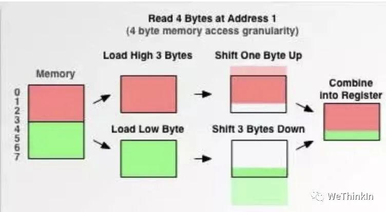

# C和C++进阶知识高频考点
* * *

created: 2025-01-25T00:41 updated: 2025-01-26T02:20
---------------------------------------------------

目录
--

*   [1.C/C++中struct的内存对齐与内存占用计算？](#1.cc%E4%B8%ADstruct%E7%9A%84%E5%86%85%E5%AD%98%E5%AF%B9%E9%BD%90%E4%B8%8E%E5%86%85%E5%AD%98%E5%8D%A0%E7%94%A8%E8%AE%A1%E7%AE%97%EF%BC%9F)
*   [2.C/C++中智能指针的定义与作用？](#2.cc%E4%B8%AD%E6%99%BA%E8%83%BD%E6%8C%87%E9%92%88%E7%9A%84%E5%AE%9A%E4%B9%89%E4%B8%8E%E4%BD%9C%E7%94%A8%EF%BC%9F)
*   [3.C/C++中数组和链表的优缺点？](#3.cc%E4%B8%AD%E6%95%B0%E7%BB%84%E5%92%8C%E9%93%BE%E8%A1%A8%E7%9A%84%E4%BC%98%E7%BC%BA%E7%82%B9%EF%BC%9F)
*   [4.C/C++中野指针的概念？](#4.cc%E4%B8%AD%E9%87%8E%E6%8C%87%E9%92%88%E7%9A%84%E6%A6%82%E5%BF%B5%EF%BC%9F)
*   [5.C/C++中内存泄漏以及解决方法？](#5.cc%E4%B8%AD%E5%86%85%E5%AD%98%E6%B3%84%E6%BC%8F%E4%BB%A5%E5%8F%8A%E8%A7%A3%E5%86%B3%E6%96%B9%E6%B3%95%EF%BC%9F)
*   [6.C/C++中指针和引用的区别](#6.cc%E4%B8%AD%E6%8C%87%E9%92%88%E5%92%8C%E5%BC%95%E7%94%A8%E7%9A%84%E5%8C%BA%E5%88%AB)
*   [7.C++中异常处理机制](#7.C++%E4%B8%AD%E5%BC%82%E5%B8%B8%E5%A4%84%E7%90%86%E6%9C%BA%E5%88%B6)
*   [8.什么时候用static](#8.%E4%BB%80%E4%B9%88%E6%97%B6%E5%80%99%E7%94%A8static)
*   [9.容器选择的原则](#9.%E5%AE%B9%E5%99%A8%E9%80%89%E6%8B%A9%E7%9A%84%E5%8E%9F%E5%88%99)
*   [10.什么是迭代器，有哪几种迭代器](#10.%E4%BB%80%E4%B9%88%E6%98%AF%E8%BF%AD%E4%BB%A3%E5%99%A8%EF%BC%8C%E6%9C%89%E5%93%AA%E5%87%A0%E7%A7%8D%E8%BF%AD%E4%BB%A3%E5%99%A8)
*   [11.什么是指针数组、什么是数组指针](#11.%E4%BB%80%E4%B9%88%E6%98%AF%E6%8C%87%E9%92%88%E6%95%B0%E7%BB%84%E3%80%81%E4%BB%80%E4%B9%88%E6%98%AF%E6%95%B0%E7%BB%84%E6%8C%87%E9%92%88)
*   [12.指针与数组的区别](#12.%E6%8C%87%E9%92%88%E4%B8%8E%E6%95%B0%E7%BB%84%E7%9A%84%E5%8C%BA%E5%88%AB)
*   [13.引用和指针的区别](#13.%E5%BC%95%E7%94%A8%E5%92%8C%E6%8C%87%E9%92%88%E7%9A%84%E5%8C%BA%E5%88%AB)
*   [14.什么是内联函数](#14.%E4%BB%80%E4%B9%88%E6%98%AF%E5%86%85%E8%81%94%E5%87%BD%E6%95%B0)
*   [15.什么是纯虚函数抽象类](#15.%E4%BB%80%E4%B9%88%E6%98%AF%E7%BA%AF%E8%99%9A%E5%87%BD%E6%95%B0%E6%8A%BD%E8%B1%A1%E7%B1%BB)
*   [16.函数重载条件](#16.%E5%87%BD%E6%95%B0%E9%87%8D%E8%BD%BD%E6%9D%A1%E4%BB%B6)
*   [17.构造函数的特点](#17.%E6%9E%84%E9%80%A0%E5%87%BD%E6%95%B0%E7%9A%84%E7%89%B9%E7%82%B9)
*   [18.什么是析构函数、析构函数的作用](#18.%E4%BB%80%E4%B9%88%E6%98%AF%E6%9E%90%E6%9E%84%E5%87%BD%E6%95%B0%E3%80%81%E6%9E%90%E6%9E%84%E5%87%BD%E6%95%B0%E7%9A%84%E4%BD%9C%E7%94%A8)
*   [19.头文件中的ifndef/define/endif有什么作用？](#19.%E5%A4%B4%E6%96%87%E4%BB%B6%E4%B8%AD%E7%9A%84ifndef/define/endif%E6%9C%89%E4%BB%80%E4%B9%88%E4%BD%9C%E7%94%A8%EF%BC%9F)
*   [20.什么是多态？多态有什么作用？](#20.%E4%BB%80%E4%B9%88%E6%98%AF%E5%A4%9A%E6%80%81%EF%BC%9F%E5%A4%9A%E6%80%81%E6%9C%89%E4%BB%80%E4%B9%88%E4%BD%9C%E7%94%A8%EF%BC%9F)
*   [21.重载和覆盖有什么区别？](#21.%E9%87%8D%E8%BD%BD%E5%92%8C%E8%A6%86%E7%9B%96%E6%9C%89%E4%BB%80%E4%B9%88%E5%8C%BA%E5%88%AB%EF%BC%9F)
*   [22.空指针和悬垂指针的区别？](#22.%E7%A9%BA%E6%8C%87%E9%92%88%E5%92%8C%E6%82%AC%E5%9E%82%E6%8C%87%E9%92%88%E7%9A%84%E5%8C%BA%E5%88%AB%EF%BC%9F)
*   [23.什么是智能指针，它的作用有哪些，智能指针有什么缺点？](#23.%E4%BB%80%E4%B9%88%E6%98%AF%E6%99%BA%E8%83%BD%E6%8C%87%E9%92%88%EF%BC%8C%E5%AE%83%E7%9A%84%E4%BD%9C%E7%94%A8%E6%9C%89%E5%93%AA%E4%BA%9B%EF%BC%8C%E6%99%BA%E8%83%BD%E6%8C%87%E9%92%88%E6%9C%89%E4%BB%80%E4%B9%88%E7%BC%BA%E7%82%B9%EF%BC%9F)
*   [24.C++空类默认有哪些成员函数？](#24.C++%E7%A9%BA%E7%B1%BB%E9%BB%98%E8%AE%A4%E6%9C%89%E5%93%AA%E4%BA%9B%E6%88%90%E5%91%98%E5%87%BD%E6%95%B0%EF%BC%9F)
*   [25.C++哪一种成员变量可以在一个类的实例之间共享？](#25.C++%E5%93%AA%E4%B8%80%E7%A7%8D%E6%88%90%E5%91%98%E5%8F%98%E9%87%8F%E5%8F%AF%E4%BB%A5%E5%9C%A8%E4%B8%80%E4%B8%AA%E7%B1%BB%E7%9A%84%E5%AE%9E%E4%BE%8B%E4%B9%8B%E9%97%B4%E5%85%B1%E4%BA%AB%EF%BC%9F)
*   [26.继承层次中，为什么基类析构函数是虚函数？](#26.%E7%BB%A7%E6%89%BF%E5%B1%82%E6%AC%A1%E4%B8%AD%EF%BC%8C%E4%B8%BA%E4%BB%80%E4%B9%88%E5%9F%BA%E7%B1%BB%E6%9E%90%E6%9E%84%E5%87%BD%E6%95%B0%E6%98%AF%E8%99%9A%E5%87%BD%E6%95%B0%EF%BC%9F)
*   [27.面向对象技术的基本概念是什么，三个基本特征是什么？](#27.%E9%9D%A2%E5%90%91%E5%AF%B9%E8%B1%A1%E6%8A%80%E6%9C%AF%E7%9A%84%E5%9F%BA%E6%9C%AC%E6%A6%82%E5%BF%B5%E6%98%AF%E4%BB%80%E4%B9%88%EF%BC%8C%E4%B8%89%E4%B8%AA%E5%9F%BA%E6%9C%AC%E7%89%B9%E5%BE%81%E6%98%AF%E4%BB%80%E4%B9%88%EF%BC%9F)
*   [28.为什么构造函数不能为虚函数？](#28.%E4%B8%BA%E4%BB%80%E4%B9%88%E6%9E%84%E9%80%A0%E5%87%BD%E6%95%B0%E4%B8%8D%E8%83%BD%E4%B8%BA%E8%99%9A%E5%87%BD%E6%95%B0%EF%BC%9F)
*   [29.虚函数是什么？为什么不把所有函数设为虚函数？](#29.%E8%99%9A%E5%87%BD%E6%95%B0%E6%98%AF%E4%BB%80%E4%B9%88%EF%BC%9F%E4%B8%BA%E4%BB%80%E4%B9%88%E4%B8%8D%E6%8A%8A%E6%89%80%E6%9C%89%E5%87%BD%E6%95%B0%E8%AE%BE%E4%B8%BA%E8%99%9A%E5%87%BD%E6%95%B0%EF%BC%9F)
*   [30.什么是多态？多态有什么作用？](#30.%E4%BB%80%E4%B9%88%E6%98%AF%E5%A4%9A%E6%80%81%EF%BC%9F%E5%A4%9A%E6%80%81%E6%9C%89%E4%BB%80%E4%B9%88%E4%BD%9C%E7%94%A8%EF%BC%9F)
*   [31.什么是公有继承、受保护继承、私有继承？](#31.%E4%BB%80%E4%B9%88%E6%98%AF%E5%85%AC%E6%9C%89%E7%BB%A7%E6%89%BF%E3%80%81%E5%8F%97%E4%BF%9D%E6%8A%A4%E7%BB%A7%E6%89%BF%E3%80%81%E7%A7%81%E6%9C%89%E7%BB%A7%E6%89%BF%EF%BC%9F)
*   [32.什么是虚指针？](#32.%E4%BB%80%E4%B9%88%E6%98%AF%E8%99%9A%E6%8C%87%E9%92%88%EF%BC%9F)
*   [33.C++如何阻止一个类被实例化？](#33.C++%E5%A6%82%E4%BD%95%E9%98%BB%E6%AD%A2%E4%B8%80%E4%B8%AA%E7%B1%BB%E8%A2%AB%E5%AE%9E%E4%BE%8B%E5%8C%96%EF%BC%9F)
*   [34.进程和线程的区别是什么？](#34.%E8%BF%9B%E7%A8%8B%E5%92%8C%E7%BA%BF%E7%A8%8B%E7%9A%84%E5%8C%BA%E5%88%AB%E6%98%AF%E4%BB%80%E4%B9%88%EF%BC%9F)
*   [35.C++中经常要操作的内存分为那几个类别？](#35.C++%E4%B8%AD%E7%BB%8F%E5%B8%B8%E8%A6%81%E6%93%8D%E4%BD%9C%E7%9A%84%E5%86%85%E5%AD%98%E5%88%86%E4%B8%BA%E9%82%A3%E5%87%A0%E4%B8%AA%E7%B1%BB%E5%88%AB%EF%BC%9F)
*   [36.类使用static成员的优点，如何访问？](#36.%E7%B1%BB%E4%BD%BF%E7%94%A8static%E6%88%90%E5%91%98%E7%9A%84%E4%BC%98%E7%82%B9%EF%BC%8C%E5%A6%82%E4%BD%95%E8%AE%BF%E9%97%AE%EF%BC%9F)
*   [37.介绍一下static数据成员和static成员函数？](#37.%E4%BB%8B%E7%BB%8D%E4%B8%80%E4%B8%8Bstatic%E6%95%B0%E6%8D%AE%E6%88%90%E5%91%98%E5%92%8Cstatic%E6%88%90%E5%91%98%E5%87%BD%E6%95%B0%EF%BC%9F)
*   [38.如何引用一个已经定义过的全局变量？](#38.%E5%A6%82%E4%BD%95%E5%BC%95%E7%94%A8%E4%B8%80%E4%B8%AA%E5%B7%B2%E7%BB%8F%E5%AE%9A%E4%B9%89%E8%BF%87%E7%9A%84%E5%85%A8%E5%B1%80%E5%8F%98%E9%87%8F%EF%BC%9F) [39.一个父类写了一个virtual函数，如果子类覆盖它的函数不加virtual,也能实现多态?在子类的空间里，有没有父类的这个函数，或者父类的私有变量?](#39.%E4%B8%80%E4%B8%AA%E7%88%B6%E7%B1%BB%E5%86%99%E4%BA%86%E4%B8%80%E4%B8%AAvirtual%E5%87%BD%E6%95%B0%EF%BC%8C%E5%A6%82%E6%9E%9C%E5%AD%90%E7%B1%BB%E8%A6%86%E7%9B%96%E5%AE%83%E7%9A%84%E5%87%BD%E6%95%B0%E4%B8%8D%E5%8A%A0virtual,%E4%B9%9F%E8%83%BD%E5%AE%9E%E7%8E%B0%E5%A4%9A%E6%80%81?%E5%9C%A8%E5%AD%90%E7%B1%BB%E7%9A%84%E7%A9%BA%E9%97%B4%E9%87%8C%EF%BC%8C%E6%9C%89%E6%B2%A1%E6%9C%89%E7%88%B6%E7%B1%BB%E7%9A%84%E8%BF%99%E4%B8%AA%E5%87%BD%E6%95%B0%EF%BC%8C%E6%88%96%E8%80%85%E7%88%B6%E7%B1%BB%E7%9A%84%E7%A7%81%E6%9C%89%E5%8F%98%E9%87%8F?)
*   [40.应用程序在运行时的内存包括代码区和数据区，其中数据区又包括哪些部分？](#40.%E5%BA%94%E7%94%A8%E7%A8%8B%E5%BA%8F%E5%9C%A8%E8%BF%90%E8%A1%8C%E6%97%B6%E7%9A%84%E5%86%85%E5%AD%98%E5%8C%85%E6%8B%AC%E4%BB%A3%E7%A0%81%E5%8C%BA%E5%92%8C%E6%95%B0%E6%8D%AE%E5%8C%BA%EF%BC%8C%E5%85%B6%E4%B8%AD%E6%95%B0%E6%8D%AE%E5%8C%BA%E5%8F%88%E5%8C%85%E6%8B%AC%E5%93%AA%E4%BA%9B%E9%83%A8%E5%88%86%EF%BC%9F)
*   [41.内联函数在编译时是否做参数类型检查？](#41.%E5%86%85%E8%81%94%E5%87%BD%E6%95%B0%E5%9C%A8%E7%BC%96%E8%AF%91%E6%97%B6%E6%98%AF%E5%90%A6%E5%81%9A%E5%8F%82%E6%95%B0%E7%B1%BB%E5%9E%8B%E6%A3%80%E6%9F%A5%EF%BC%9F)
*   [42.全局变量和局部变量有什么区别？怎么实现的？操作系统和编译器是怎么知道的？](#42.%E5%85%A8%E5%B1%80%E5%8F%98%E9%87%8F%E5%92%8C%E5%B1%80%E9%83%A8%E5%8F%98%E9%87%8F%E6%9C%89%E4%BB%80%E4%B9%88%E5%8C%BA%E5%88%AB%EF%BC%9F%E6%80%8E%E4%B9%88%E5%AE%9E%E7%8E%B0%E7%9A%84%EF%BC%9F%E6%93%8D%E4%BD%9C%E7%B3%BB%E7%BB%9F%E5%92%8C%E7%BC%96%E8%AF%91%E5%99%A8%E6%98%AF%E6%80%8E%E4%B9%88%E7%9F%A5%E9%81%93%E7%9A%84%EF%BC%9F)
*   [43.static全局变量与普通的全局变量有什么区别？static局部变量和普通局部变量有什么区别？static函数与普通函数有什么区别？](#43.static%E5%85%A8%E5%B1%80%E5%8F%98%E9%87%8F%E4%B8%8E%E6%99%AE%E9%80%9A%E7%9A%84%E5%85%A8%E5%B1%80%E5%8F%98%E9%87%8F%E6%9C%89%E4%BB%80%E4%B9%88%E5%8C%BA%E5%88%AB%EF%BC%9Fstatic%E5%B1%80%E9%83%A8%E5%8F%98%E9%87%8F%E5%92%8C%E6%99%AE%E9%80%9A%E5%B1%80%E9%83%A8%E5%8F%98%E9%87%8F%E6%9C%89%E4%BB%80%E4%B9%88%E5%8C%BA%E5%88%AB%EF%BC%9Fstatic%E5%87%BD%E6%95%B0%E4%B8%8E%E6%99%AE%E9%80%9A%E5%87%BD%E6%95%B0%E6%9C%89%E4%BB%80%E4%B9%88%E5%8C%BA%E5%88%AB%EF%BC%9F)
*   [44.对于一个频繁使用的短小函数,在C语言中应用什么实现,在C++中应用什么实现?](#44.%E5%AF%B9%E4%BA%8E%E4%B8%80%E4%B8%AA%E9%A2%91%E7%B9%81%E4%BD%BF%E7%94%A8%E7%9A%84%E7%9F%AD%E5%B0%8F%E5%87%BD%E6%95%B0,%E5%9C%A8C%E8%AF%AD%E8%A8%80%E4%B8%AD%E5%BA%94%E7%94%A8%E4%BB%80%E4%B9%88%E5%AE%9E%E7%8E%B0,%E5%9C%A8C++%E4%B8%AD%E5%BA%94%E7%94%A8%E4%BB%80%E4%B9%88%E5%AE%9E%E7%8E%B0?)
*   [45.共享内存安全吗，有什么措施保证?](#45.%E5%85%B1%E4%BA%AB%E5%86%85%E5%AD%98%E5%AE%89%E5%85%A8%E5%90%97%EF%BC%8C%E6%9C%89%E4%BB%80%E4%B9%88%E6%8E%AA%E6%96%BD%E4%BF%9D%E8%AF%81?)
*   [46.多态实现方式是什么？](#46.%E5%A4%9A%E6%80%81%E5%AE%9E%E7%8E%B0%E6%96%B9%E5%BC%8F%E6%98%AF%E4%BB%80%E4%B9%88%EF%BC%9F)
*   [47.介绍一下c++内存泄漏？](#47.%E4%BB%8B%E7%BB%8D%E4%B8%80%E4%B8%8Bc++%E5%86%85%E5%AD%98%E6%B3%84%E6%BC%8F%EF%BC%9F)
*   [48.vector的底层原理和扩容机制是什么？](#48.vector%E7%9A%84%E5%BA%95%E5%B1%82%E5%8E%9F%E7%90%86%E5%92%8C%E6%89%A9%E5%AE%B9%E6%9C%BA%E5%88%B6%E6%98%AF%E4%BB%80%E4%B9%88%EF%BC%9F)

2.C/C++中struct的内存对齐与内存占用计算？
---------------------------

什么是内存对齐？计算机系统对基本类型数据在内存中存放的位置有限制，它们会要求这些数据的首地址的值是有效对齐值的倍数。

什么是有效对齐值？计算机系统有默认对齐系数n,可以通过#pragma pack(n)来指定。有效对齐值就等与该对齐系数和结构体中最长的数据类型的长度两者最小的那一个值,比如对齐系数是8,而结构体中最长的是int,4个字节,那么有效对齐值为4。

为什么要内存对齐？假如没有内存对齐机制，数据可以任意存放，现在一个int变量存放在从地址1开始的连续四个字节地址中。当4字节存取粒度的处理器去取数据时，要先从0地址开始读取第一个4字节块,剔除不想要的字节（0地址）,然后从地址4开始读取下一个4字节块,同样剔除不要的数据（5，6，7地址）,最后留下的两块数据合并放入寄存器，这需要做很多工作，整体效率较低。



struct内存占用如何计算？结构体的内存计算方式遵循以下规则：

1.  数据成员对齐规则：第一个数据成员放在offset为0的地方，以后的每一个成员的offset都必须是该成员的大小与有效对齐值相比较小的数值的整数倍,例如第一个数据成员是int型，第二个是double，有效对齐值为8,所以double的起始地址应该为8,那么第一个int加上内存补齐用了8个字节
    
2.  结构体作为成员：如果一个结构里有某些结构体成员，则结构体成员要从其内部有效对齐值的整数倍地址开始存储。(比如struct a中存有struct b，b里有char, int, double，那b应该从8的整数倍开始存储)
    
3.  结构体内存的总大小，必须是其有效对齐值的整数倍，不足的要补齐。
    

我们来举两个🌰：

```
#include <stdio.h>
#pragma pack(8)
int main()
{
  struct Test
  {
    int a;
    //long double大小为16bytes
    long double b;         
    char c[10];
  };
  printf("%d", sizeof(Test));
  return 0;
} 

struct的内存占用为40bytes
```

```
#include <stdio.h>
#pragma pack(16)
int main()
{
  struct Test
  {
    int a;
    //long double大小为16bytes
    long double b;         
    char c[10];
  }
  printf("%d", sizeof(Test));
  return 0;
}

struct的内存占用为48bytes
```

2.C/C++中智能指针的定义与作用？
-------------------

智能指针是一个类，这个类的构造函数中传入一个普通指针，析构函数中释放传入的指针。智能指针的类都是栈上的对象，所以当函数（或程序）结束时会自动被释放。

（注：不能将指针直接赋值给一个智能指针，一个是类，一个是指针。）

常用的智能指针：智能指针在C++11版本之后提供，包含在头文件中，主要是shared\_ptr、unique\_ptr、weak\_ptr。unique\_ptr不支持复制和赋值。当程序试图将一个 unique\_ptr 赋值给另一个时，如果源 unique\_ptr 是个临时右值，编译器允许这么做；如果原来的unique\_ptr 将存在一段时间，编译器将禁止这么做。shared\_ptr是基于引用计数的智能指针。可随意赋值，直到内存的引用计数为0的时候这个内存会被释放。weak\_ptr能进行弱引用。引用计数有一个问题就是互相引用形成环，这样两个指针指向的内存都无法释放。需要手动打破循环引用或使用weak\_ptr。顾名思义，weak\_ptr是一个弱引用，只引用，不计数。如果一块内存被shared\_ptr和weak\_ptr同时引用，当所有shared\_ptr析构了之后，不管还有没有weak\_ptr引用该内存，内存也会被释放。所以weak\_ptr不保证它指向的内存一定是有效的，在使用之前需要检查weak\_ptr是否为空指针。

智能指针的作用：C++11中引入了智能指针的概念，方便管理堆内存。使用普通指针，容易造成堆内存泄露（忘记释放），二次释放，野指针，程序发生异常时内存泄露等问题等，使用智能指针能更好的管理堆内存。

3.C/C++中数组和链表的优缺点？
------------------

数组和链表是C/C++中两种基本的数据结构，也是两个最常用的数据结构。

数组的特点是在内存中，数组是一块连续的区域，并且数组需要预留空间。链表的特点是在内存中，元素的空间可以在任意地方，空间是分散的，不需要连续。链表中的元素都会两个属性，一个是元素的值，另一个是指针，此指针标记了下一个元素的地址。每一个数据都会保存下一个数据的内存的地址，通过此地址可以找到下一个数据。

数组的优缺点：

优点：查询效率高，时间复杂度可以达到O(1)。

缺点：新增和修改效率低，时间复杂度为O(N)；内存分配是连续的内存，扩容需要重新分配内存。

链表的优缺点：

优点：新增和修改效率高，只需要修改指针指向即可，时间复杂度可以达到O(1)；内存分配不需要连续的内存，占用连续内存少。

缺点：链表查询效率低，需要从链表头依次查找，时间复杂度为O(N)。

4.C/C++中野指针的概念？
---------------

野指针也叫空悬指针，不是指向null的指针，是未初始化或者未清零的指针。

**产生原因：**

1.  指针变量未及时初始化。
    
2.  指针free或delete之后没有及时置空。
    

**解决办法：**

1.  定义指针变量及时初始化活着置空。
    
2.  释放操作后立即置空。
    

5.C/C++中内存泄漏以及解决方法？
-------------------

内存泄漏是指己动态分配的堆内存由于某种原因导致程序未释放或无法释放，造成系统内存的浪费，导致程序运行速度减慢甚至系统崩溃等严重后果。

**解决方法：**

造成内存泄漏的主要原因是在使用new或malloc动态分配堆上的内存空间，而并未使用delete或free及时释放掉内存造成的。所以解决方法就是注意new/delete和malloc/free一定要配套使用。

6.C/C++中指针和引用的区别
----------------

C语言的指针让我们拥有了直接操控内存的强大能力，而C++在指针基础上又给我们提供了另外一个强力武器$\\to$引用。

首先我们来看一下C++中对象的定义：对象是指一块能存储数据并具有某种类型的内存空间。

一个对象a，它有值和地址&a。运行程序时，计算机会为该对象分配存储空间，来存储该对象的值，我们通过该对象的地址，来访问存储空间中的值。

指针p也是对象，它同样有地址&p和存储的值p，只不过，p存储的是其他对象的地址。如果我们要以p中存储的数据为地址，来访问对象的值，则要在p前加引用操作符$\*$，即$\*p$。

对象有常量（const）和变量之分，既然指针本身是对象，那么指针所存储的地址也有常量和变量之分，指针常量是指，指针这个对象所存储的地址是不可改变的，而常量指针的意思就是指向常量的指针。

我们可以把引用理解成变量的别名。定义一个引用的时候，程序把该引用和它的初始值绑定在一起，而不是拷贝它。计算机必须在声明引用r的同时就要对它初始化，并且r一经声明，就不可以再和其他对象绑定在一起了。

实际上，我们也可以把引用看作是通过一个指针常量来实现的，指向的地址不变，地址里的内容可以改变。

接下来我们来看看指针和引用的**具体区别：**

1.  指针是一个新的变量，要占用存储空间，存储了另一个变量的地址，我们可以通过访问这个地址来修改另一个变量。而引用只是一个别名，还是变量本身，不占用具体存储空间，只有声明没有定义。对引用的任何操作就是对变量本身进行操作，以达到修改变量的目的。
2.  引用只有一级，而指针可以有多级。
3.  指针传参的时候，还是值传递，指针本身的值不可以修改，需要通过解引用才能对指向的对象进行操作。引用传参的时候，传进来的就是变量本身，因此变量可以被修改。
4.  引用它一定不为空，因此相对于指针，它不用检查它所指对象是否为空，这样就提高了效率。
5.  引用必须初始化，而指针可以不初始化。

我们可以看下面的代码：

```cpp
int a,b,*p,&r=a;//正确
r=3;//正确：等价于a=3
int &rr;//出错：引用必须初始化
p=&a;//正确：p中存储a的地址，即p指向a
*p=4;//正确：p中存的是a的地址，对a所对应的存储空间存入值4
p=&b//正确：p可以多次赋值，p存储b的地址
```

“&”不仅能表示引用，还可以表示成地址，还有可以作为按位与运算符。这个要根据具体情况而定。比如上面的例子，等号左边的，被解释为引用，右边的被解释成取地址。

引用的操作加了比指针更多的限制条件，保证了整体代码的安全性和便捷性。引用的合理使用可以一定程度避免“指针满天飞”的情况，可以一定程度上提升程序鲁棒性。并且指针与引用底层实现都是一样的，不用担心两者的性能差距。

7.C++中异常处理机制
------------

C++异常处理机制通过\`try\`、\`throw\`和\`catch\`关键字实现，\`try\`块中包含可能引发异常的代码，\`throw\`用于抛出异常，\`catch\`块捕获并处理异常，提供了一种结构化的方法来处理运行时错误并确保程序的健壮性。

8.什么时候用static
-------------

\`static\`关键字在C++中用于声明静态变量或函数，其作用包括在局部变量中维持变量的生命周期为整个程序运行期间，在类中共享所有实例之间的成员变量或函数，以及在全局作用域中限制变量或函数的可见性仅在当前编译单元内。

9.容器选择的原则
---------

容器选择的原则是根据应用场景的需求来选择适当的容器，考虑因素包括元素的访问方式（顺序访问、随机访问）、插入和删除操作的频率与位置（头部、尾部、中间）、内存使用和迭代器的有效性，例如，选择\`vector\`用于频繁随机访问，选择\`list\`用于频繁插入和删除操作，选择\`map\`或\`set\`用于需要快速查找和有序存储。

10.什么是迭代器，有哪几种迭代器\]
-------------------

迭代器是用于遍历容器元素的对象或指针，提供一致的接口来访问容器元素，C++中主要有五种迭代器：输入迭代器（Input Iterator）、输出迭代器（Output Iterator）、前向迭代器（Forward Iterator）、双向迭代器（Bidirectional Iterator）和随机访问迭代器（Random Access Iterator），它们分别适用于不同的遍历需求和容器类型。

11.什么是指针数组、什么是数组指针\]
--------------------

指针数组是一个数组，数组中的每个元素都是指针（例如 \`int\* arr\[10\]\` 是一个包含10个指向整数的指针的数组）；数组指针是一个指针，指向一个数组的首地址（例如 \`int (\*ptr)\[10\]\` 是一个指向包含10个整数的数组的指针）。

12.指针与数组的区别
-----------

指针是一个变量，用于存储内存地址，可以动态指向不同位置，而数组是一块连续的内存区域，存储一组相同类型的元素，数组名在大多数情况下会被隐式转换为指向其第一个元素的指针，但数组的大小和位置在声明时确定且固定。

13.引用和指针的区别
-----------

引用是一个变量的别名，在声明时必须初始化且不能改变引用对象，而指针是一个变量，存储另一个变量的地址，可以在任何时候改变指向不同的对象并支持算术操作。

14.什么是内联函数
----------

内联函数是使用\`inline\`关键字修饰的函数，建议编译器在调用该函数时将其函数体展开以减少函数调用开销，适用于代码量小且频繁调用的函数，但编译器可能会根据实际情况选择是否真正内联。

15.什么是纯虚函数抽象类
-------------

构造函数是与类同名的特殊成员函数，在创建对象时自动调用，用于初始化对象的成员变量，不能有返回类型（包括void），可以重载以提供不同的初始化方式，并且可以有默认参数，但不能被显式调用或继承。

16.函数重载条件
---------

友元函数是被声明为某个类的友元的函数，允许它访问该类的私有和保护成员，尽管它本身并不是该类的成员，通常用于实现需要直接访问对象内部实现细节的功能，如重载运算符或实现外部辅助函数。

17.构造函数的特点
----------

构造函数的作用是初始化对象的成员变量，并执行任何必要的设置操作，在对象创建时自动调用，确保对象在使用前处于有效状态，并可以通过重载提供多种初始化方式。

18.什么是析构函数、析构函数的作用
------------------

析构函数是类的特殊成员函数，与类同名但前面带有波浪号\`~\`，在对象生命周期结束时自动调用，其作用是执行清理操作，如释放动态分配的内存、关闭文件或释放其他资源，确保对象在销毁前完成所有必要的清理工作。

19.头文件中的ifndef/define/endif有什么作用？
---------------------------------

在C++头文件中，#ifndef、#define 和 #endif 的组合用于防止头文件被多次包含。这种机制称为“头文件保护”或“包含保护”。它的主要作用是避免重复定义导致的编译错误。下面是每个部分的详细作用： #ifndef（如果未定义）： 这个指令用于检查一个特定的宏是否未被定义。如果未定义，则继续处理后续的代码。 #define（定义）： 这个指令用于定义一个宏。通过定义一个唯一的标识符，可以确保在其他地方包含同一个头文件时，这个标识符已经定义，从而避免重复包含。 #endif（结束条件编译）： 这个指令标志着条件编译的结束。如果前面的条件（即 #ifndef）为真，编译器会处理 #endif 之前的所有代码。

20.什么是多态？多态有什么作用？
-----------------

多态是C++中的一种面向对象编程特性，它允许通过基类指针或引用调用派生类中的重写函数，实现同一操作在不同对象上的不同表现。多态的作用在于提高代码的灵活性和可扩展性，使得程序能够处理不同类型的对象而不需要知道它们的具体类型，从而实现更好的代码复用和系统扩展。

21.重载和覆盖有什么区别？
--------------

重载（Overloading）和覆盖（Overriding）是C++中的两种多态机制。重载指的是在同一个作用域内定义多个同名函数，但参数列表不同（参数类型、数量或顺序），以支持不同的函数调用；而覆盖指的是在派生类中重新定义基类中已经存在的虚函数，通过匹配函数签名和使用虚函数机制，改变或扩展基类函数的行为。重载是在编译时选择适当的函数，覆盖是在运行时决定调用哪个函数。

22.空指针和悬垂指针的区别？
---------------

空指针和悬垂指针在C/C++中分别代表不同的指针问题：

*   **空指针（NULL Pointer）**：是一个指向无效或未分配内存的指针，通常用于表示指针当前不指向任何有效对象。空指针的值是 `NULL`（在C++中通常使用 `nullptr`）。空指针的主要用途是作为初始化值或检查指针是否有效的标志。
    
    ```cpp
    int* ptr = nullptr; // 空指针
    ```
    
*   **悬垂指针（Dangling Pointer）**：是一个指向已经被释放或不再有效的内存区域的指针。这种指针指向的内存区域可能已经被重新分配或销毁，使用悬垂指针会导致未定义行为或程序崩溃。悬垂指针通常是由于内存释放后没有将指针设置为 `NULL` 或 `nullptr` 造成的。
    
    ```cpp
    int* ptr = new int(10); // 动态分配内存
    delete ptr;             // 释放内存
    // ptr 现在是悬垂指针
    ```
    

总结：空指针表示指针当前不指向任何有效对象，而悬垂指针指向已经无效的内存区域，前者用于初始化和检查，后者则可能导致严重的程序错误。

23.什么是智能指针，它的作用有哪些，智能指针有什么缺点？
-----------------------------

智能指针是一种在C++中用于自动管理动态分配的内存生命周期的类模板。它们通过提供类似指针的接口，并在适当的时候自动释放所管理的内存，帮助避免内存泄漏和指针错误。 C++标准库中常用的智能指针有： std::unique\_ptr：独占所有权模型，不可复制但可以移动。它保证同一时间只有一个智能指针拥有对某块内存的控制。 std::shared\_ptr：共享所有权模型，可以被复制，并通过引用计数来管理内存。当没有任何shared\_ptr指向一块内存时，该块内存会被自动释放。 std::weak\_ptr：伴随shared\_ptr的非拥有型智能指针，用来解决shared\_ptr相互引用时可能产生的循环依赖问题。不增加引用计数，因此不影响其指向的对象的生命周期。 智能指针缺点： 性能开销：智能指针（尤其是std::shared\_ptr）通过引用计数来管理内存，这会增加额外的性能开销，比原始指针慢。 循环引用问题：std::shared\_ptr在存在循环引用时会导致内存泄漏，因为引用计数永远不会达到0，除非使用std::weak\_ptr打破循环。 复杂性增加：虽然智能指针有助于内存管理，但不当使用可以增加程序复杂性，误用可能导致难以调试的问题，如悬挂指针或者提前释放等。 不适用场景：特定场景下（如高性能或者低延迟要求的应用），智能指针所带来的额外开销可能是不可接受的。

24.C++空类默认有哪些成员函数？
------------------

在C++中，即使一个类没有显式定义任何成员函数，编译器也会自动生成默认的构造函数、析构函数、复制构造函数和赋值运算符。这些默认成员函数使得空类可以被创建、销毁，并支持对象的复制和赋值操作。例如，空类 \`class Empty {};\` 会自动获得这些默认成员函数的实现，除非你显式地定义或删除它们。

25.C++哪一种成员变量可以在一个类的实例之间共享？
---------------------------

在C++中，\`static\` 成员变量可以在一个类的所有实例之间共享。\`static\` 成员变量属于类本身，而不是某个特定的对象，因此所有类的实例共享同一个 \`static\` 成员变量的值。

### 特点

*   **共享**：所有对象实例共享同一个 `static` 成员变量。
*   **类作用域**：它的生命周期与类的生命周期相同，而不是与对象的生命周期相同。
*   **访问**：可以通过类名直接访问，也可以通过对象实例访问，但通常通过类名来访问更为明确。

### 示例代码

```cpp
#include <iostream>

class MyClass {
public:
    static int sharedValue; // 静态成员变量声明
    void printValue() const {
        std::cout << "Shared value: " << sharedValue << std::endl;
    }
};

// 静态成员变量的定义
int MyClass::sharedValue = 0;

int main() {
    MyClass obj1;
    MyClass obj2;

    obj1.sharedValue = 10; // 修改静态成员变量

    obj1.printValue(); // 输出: Shared value: 10
    obj2.printValue(); // 输出: Shared value: 10

    return 0;
}
```

在这个示例中，`sharedValue` 是一个静态成员变量，它的值在所有 `MyClass` 类的实例之间共享。无论通过哪个实例访问或修改 `sharedValue`，所有实例都会看到相同的值。

26.继承层次中，为什么基类析构函数是虚函数？
-----------------------

在继承层次中，基类的析构函数应该是虚函数，以确保在通过基类指针删除派生类对象时，能够正确调用派生类的析构函数，从而避免资源泄漏和未定义行为。虚析构函数使得 C++ 的动态绑定机制能够在删除对象时正确地调用实际的派生类析构函数，从而完成派生类特有资源的释放。

27.面向对象技术的基本概念是什么，三个基本特征是什么？
----------------------------

基本概念：类、对象、继承； 基本特征：封装、继承、多态。 封装：将低层次的元素组合起来形成新的、更高实体的技术； 继承：广义的继承有三种实现形式：实现继承、可视继承、接口继承。 多态：允许将子类类型的指针赋值给父类类型的指针

28.为什么构造函数不能为虚函数？
-----------------

虚函数采用一种虚调用的方法。需调用是一种可以在只有部分信息的情况下工作的机制。如果创建一个对象，则需要知道对象的准确类型，因此构造函数不能为虚函数。

29.虚函数是什么？为什么不把所有函数设为虚函数？
-------------------------

不行。首先，虚函数是有代价的，由于每个虚函数的对象都要维护一个虚函数表，因此在使用虚函数的时候都会产生一定的系统开销，这是没有必要的。

30.什么是多态？多态有什么作用？
-----------------

多态就是将基类类型的指针或者引用指向派生类型的对象。多态通过虚函数机制实现。多态的作用是接口重用。

31.什么是公有继承、受保护继承、私有继承？
----------------------

多态就是将基类类型的指针或者引用指向派生类型的对象。多态通过虚函数机制实现。多态的作用是接口重用。

（1）公有继承时，派生类对象可以访问基类中的公有成员，派生类的成员函数可以访问基类中的公有和受保护成员； （2）私有继承时，基类的成员只能被直接派生类的成员访问，无法再往下继承； （3）受保护继承时，基类的成员也只被直接派生类的成员访问，无法再往下继承。

32.什么是虚指针？
----------

虚指针或虚函数指针是虚函数的实现细节。带有虚函数的每一个对象都有一个虚指针指向该类的虚函数表。

33.C++如何阻止一个类被实例化？
------------------

（1）将类定义为抽象基类或者将构造函数声明为private； （2）不允许类外部创建类对象，只能在类内部创建对象

34.进程和线程的区别是什么？
---------------

（1）进程是程序的一次执行，线程是进程中的执行单元； （2）进程间是独立的，这表现在内存空间、上下文环境上，线程运行在进程中； （3）一般来讲，进程无法突破进程边界存取其他进程内的存储空间；而同一进程所产生的线程共享内存空间； （4）同一进程中的两段代码不能同时执行，除非引入多线程。 总的来说进程是操作系统分配资源和调度的独立单位，拥有自己的地址空间和系统资源。线程是进程内部的执行单元，共享属于相同进程的资源，但是执行切换代价更小。进程间相互独立，稳定性较高；线程间共享内存，创建和切换成本较低，但一个线程的失败可能影响同进程的其他线程。

35.经常要操作的内存分为那几个类别？
-------------------

（1）栈区：由编译器自动分配和释放，存放函数的参数值、局部变量的值等； （2）堆：一般由程序员分配和释放，存放动态分配的变量（使用new和delete管理）； （3）全局区（静态区）：全局变量和静态变量存放在这一块，初始化的和未初始化的分开放； （4）文字常量区：常量字符串就放在这里，程序结束自动释放； （5）程序代码区：参访函数体的二进制代码。

36.类使用static成员的优点，如何访问？
-----------------------

优点： （1）static 成员的名字是在类的作用域中，因此可以避免与其他类的成员或全局对象名字冲突； （2）可以实施封装。static 成员可以是私有成员，而全局对象不可以； （3） static 成员是与特定类关联的，可清晰地显示程序员的意图。 static 数据成员必须在类定义体的外部定义(正好一次)，static 关键字只能用于类定义体内部的声明中，定义不能标示为static. 不像普通数据成员，static成员不是通过类构造函数进行初始化，也不能在类的声明中初始化，而是应该在定义时进行初始化.保证对象正好定义一次的最好办法，就是将static 数据成员的定义放在包含类非内联成员函数定义的文件中。

37.介绍一下static数据成员和static成员函数？
-----------------------------

（1）static数据成员： static数据成员独立于该类的任意对象而存在；每个static数据成员是与类关联的对象，并不与该类的对象相关联。Static数据成员（const static数据成员除外）必须在类定义体的外部定义。不像普通数据成员，static成员不是通过类的构造函数进行初始化，而是应该在定义时进行初始化。 （2）static成员函数： Static成员函数没有this形参，它可以直接访问所属类的static成员，不能直接使用非static成员。因为static成员不是任何对象的组成部分，所以static成员不能被声明为const。同时，static成员函数也不能被声明为虚函数。

38.如何引用一个已经定义过的全局变量？
--------------------

可以用引用头文件的方式，也可以用extern关键字，如果用引用头文件方式来引用某个在头文件中声明的全局变量，假定你将那个变量写错了，那么在编译期间会报错，如果你用extern方式引用时，假定你犯了同样的错误，那么在编译期间不会报错，而在连接期间报错。

39.一个父类写了一个virtual函数，如果子类覆盖它的函数不加virtual,也能实现多态?在子类的空间里，有没有父类的这个函数，或者父类的私有变量?
-----------------------------------------------------------------------------

只要基类在定义成员函数时已经声明了 virtue关键字，在派生类实现的时候覆盖该函数时，virtue关键字可加可不加，不影响多态的实现。子类的空间里有父类的所有变量(static除外)。

40.应用程序在运行时的内存包括代码区和数据区，其中数据区又包括哪些部分？
-------------------------------------

对于一个进程的内存空间而言，可以在逻辑上分成 3个部份：代码区，静态数据区和动态数据区。 态数据区一般就是“堆栈”。 栈是一种线性结构，堆是一种链式结构。进程的每个线程都有私有的“栈”。 全局变量和静态变量分配在静态数据区，本地变量分配在动态数据区，即堆栈中。程序通过堆栈的基地址和偏移量来访问本地变量。

41.内联函数在编译时是否做参数类型检查？
---------------------

内联函数要做参数类型检查, 这是内联函数跟宏相比的优势。

42.全局变量和局部变量有什么区别？怎么实现的？操作系统和编译器是怎么知道的？
---------------------------------------

（1）生命周期不同：全局变量随主程序创建和创建，随主程序销毁而销毁；局部变量在局部函数内部，甚至局部循环体等内部存在，退出就不存在。 （2）使用方式不同：通过声明后全局变量程序的各个部分都可以用到；局部变量只能在局部使用，分配在栈区。 （3）操作系统和编译器通过内存分配的位置来知道的，全局变量分配在全局数据段并且在程序开始运行的时候被加载。局部变量则分配在堆栈里面 。

43.static全局变量与普通的全局变量有什么区别？static局部变量和普通局部变量有什么区别？static函数与普通函数有什么区别？
---------------------------------------------------------------------

static全局变量与普通全局变量区别：static全局变量只初使化一次，防止在其他文件单元中被引用; static局部变量和普通局部变量区别：static局部变量只被初始化一次，下一次依据上一次结果值； static函数与普通函数区别：static函数在内存中只有一份，普通函数在每个被调用中维持一份拷贝。

44.对于一个频繁使用的短小函数,在C语言中应用什么实现,在C++中应用什么实现?
-----------------------------------------

c用宏定义，c++用inline

45.共享内存安全吗，有什么措施保证?
-------------------

共享内存本身没有内建安全措施，通过以下方式确保安全性： 使用互斥锁或信号量来同步对共享内存的访问。 实施访问控制，限制哪些进程可以访问共享内存。 定期检查和清理，避免僵尸进程造成的资源泄露。 根据需求实现读写锁，允许多读单写的安全访问模式。

46.多态实现方式是什么？
-------------

多态在C++中的实现方式通常有两种： 虚函数（通过类的继承和虚函数表实现） 函数重载（同一作用域内多个同名函数通过参数列表区分）

47.介绍一下c++内存泄漏？
---------------

C++中内存泄漏是指程序分配的内存未被释放且无法再次被访问，常见原因包括：

动态分配的内存（使用new或malloc）没有使用delete或free释放。 使用指针指向新的内存区域，而忘记释放原有内存。 数据结构中的循环引用导致无法自动释放。 避免内存泄漏的方法包括：

使用智能指针（如std::unique\_ptr和std::shared\_ptr）自动管理内存。 适时使用delete或free释放不再需要的动态分配内存。 定期使用内存检测工具（如Valgrind）检测和定位内存泄漏问题。

48.vector的底层原理和扩容机制是什么？
-----------------------

底层原理: vector是基于动态数组实现的，支持随机访问。 在连续的内存空间中存储元素，允许快速访问。

扩容机制: 当向vector添加元素超过其当前容量时，它会创建一个更大的动态数组，并将所有现有元素复制到新数组中，释放旧数组的内存。 新容量通常是当前容量的两倍，不过这可能因实现而异。