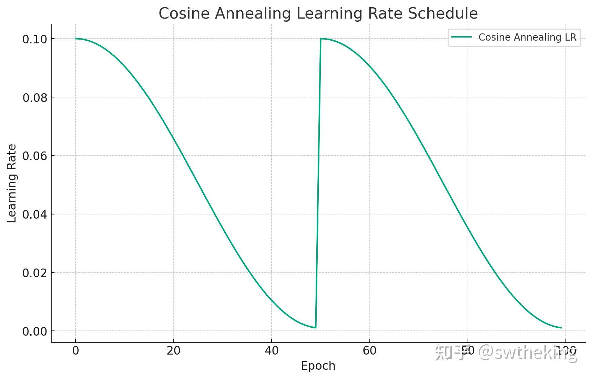
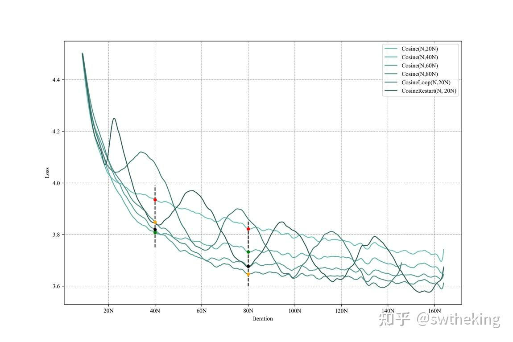

# 大模型面试题系列专栏-百面LLM&By&&swtheking
> _**作者: swtheking**_
> 
> _**原文:**_ [_**https://www.zhihu.com/column/c\_1747590116120698880**_](https://www.zhihu.com/column/c_1747590116120698880)

在一个LLM（Lamma2）对同一批prompt复制5次进行greedy预测的时候，为什么同一个prompt得到的answer会不一致？
--------------------------------------------------------------------

因为同一个prompt和不同的prompt在一个batch里的时候，会有不一样的padding个数（这依赖一个batch里最长的prompt）。而由于padding数量不一致，所以其实原始prompt变成prompt + padding，所以原先两个prompt其实不能exactly一致。尽管Transformer中会对padding在attention中设置成一个极小值（-2^32 + 1），那么softmax(Q^TK)，padding前都为接近0的极小值。但由于大模型深度太深，这种累计的极小值在最后一层依然会放大占据一些weight，使得padding也会影响预测。

DPO的第0步loss是固定的么？如果固定，是多少？
--------------------------

是固定的，因为$\\text{DPO loss} = -\\log\\sigma\\left(\\beta \\left(\\frac{p\_{\\theta}(y\_{w}|x)}{p\_{\\text{ref}}(y\_{w}|x)} - \\frac{p\_{\\theta}(y\_{l}|x)}{p\_{\\text{ref}}(y\_{l}|x)}\\right)\\right)$

$\\text{其中，} y\_{w} \\text{是正样本，} y\_{l} \\text{是负样本。}

\\text{在开始时，由于优化的网络参数等于参考网络参数，因此}

p\_{\\theta}(y\_{w}|x) = p\_{\\text{ref}}(y\_{w}|x), \\quad p\_{\\theta}(y\_{l}|x) = p\_{\\text{ref}}(y\_{l}|x)

\\text{因此，损失函数变为}

\-\\log\\sigma(\\beta - \\beta) = -\\log\\sigma(0)

\\text{根据 sigmoid 函数的定义，} \\sigma(0) = 0.5, \\text{所以}

\-\\log(0.5) = 0.693$

如果做二分类的few shot任务，In Context Learning和Supervised Fine-tuning主要的区别是什么？
---------------------------------------------------------------------

In Context Learning主要是将few shot数据加入Prompt中，然后让模型进行预测，不改变模型的参数。而Supervised Fine-tuning主要把few shot数据进行继续训练。在真实场景中，In Context Learning对label准确率要求较低，也就是label在出错的情况下，仍然可以凭借模型本身能力完成准确预测。而Supervised Fine-tuning对label准确率要求较高，因为改变了模型参数，因此label必须准确。具体细节可参考：

[Notion – The all-in-one workspace for your notes, tasks, wikis, and databases.](https://www.notion.so/swtheking/c31d141411be4d0eb50473fe6abae1db?v=50264a9824494b6c836ba0c6f3bebd2f)

什么是Cosine优化器？在大模型中应该怎么设置cosine优化器的周期比较好？
----------------------------------------

Cosine优化器是在lr\_min 到 lr\_max之间按pi \* epoch / T\_max周期变化的优化器。下面是用代码画的Cosine优化器变化的图：

```text-plain
import matplotlib.pyplot as plt
import numpy as np

# Parameters for the cosine annealing schedule
eta_min = 0.001  # Minimum learning rate
eta_max = 0.1    # Maximum learning rate
T_max = 50       # Number of epochs between two learning rate restarts
num_epochs = 100 # Total number of epochs

# Cosine Annealing Schedule
def cosine_annealing(epoch):
    return eta_min + (eta_max - eta_min) * (1 + np.cos(np.pi * epoch / T_max)) / 2

# Generate learning rate for each epoch
lr_each_epoch = [cosine_annealing(epoch % T_max) for epoch in range(num_epochs)]

# Plotting
plt.figure(figsize=(10, 6))
plt.plot(lr_each_epoch, label='Cosine Annealing LR')
plt.xlabel('Epoch')
plt.ylabel('Learning Rate')
plt.title('Cosine Annealing Learning Rate Schedule')
plt.legend()
plt.grid(True)
plt.show()
```

图像为：



在大模型中，一般把T\_max设置为最长epoch可以取得最大收益，具体可以参考：

[Notion – The all-in-one workspace for your notes, tasks, wikis, and databases.](https://shengdinghu.notion.site/MiniCPM-c805a17c5c8046398914e47f0542095a)

图像展示为：



> 根据模型设计不同cosine参数跑出的结果

当T\_max = 80N时，在80N epoch可以达到最低点，但如果设置为T\_max=20N，80Nepoch达不到最低点，可以看图上黄色点和黑色点在80N epoch的比较。