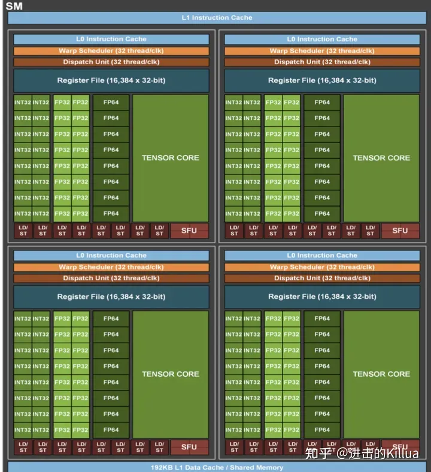

# 推理部署工程师面试题库
1.  描述一下SM的结构？

(INT32/FP32/FP64)CUDA core，Tensor Core，LD/ST, Warp Scheduler

RegisterFile，ShareMemory，L1 Cache

1.  共享内存和寄存器分别应该存放哪些数据。

局部变量、临时变量，场景：高频访问、空间较小。

1.  bank冲突是什么？描述具体结构，如何解决？

为了并行处理，NVIDIA GPU的共享内存被划分为多个“bank”来支持并发访问。然而，当多个线程同时访问同一个bank内的不同地址时，可能会导致bank冲突，从而降低内存访问的性能。

**数据对齐**：确保共享内存中的数据元素（例如数组或结构体）是按照bank大小对齐的。这样，多个线程可以同时访问不同的banks，而不会产生冲突。

**线程束（warp）的对齐访问**：尽可能地组织线程，使得在同一个warp内的线程访问的数据都来自不同的banks。例如，如果一个warp有32个线程，并且每个线程访问不同的bank，那么整个warp的访问将是无冲突的。

**数据填充**：Padding方式避免bank冲突。

1.  说一下分支冲突，如果warp内有冲突，部分符合if条件，部分符合else条件，是否需要等待？

当一个warp中的线程在执行一个条件分支时，如果不是所有的线程都满足相同的条件（例如，部分线程满足`if`条件，而其他线程满足`else`条件），这将导致warp内的线程分裂成多个执行路径，从而增加了计算的开销。当warp中的线程分裂到不同的执行路径时，它们不能再同时执行相同的指令，因为它们需要执行不同的指令集。这导致了一种情况，其中部分线程在某个时刻被激活，而其他线程则被暂停。

在warp内部，所有的线程都是硬件级别上同步的。当一个warp中的线程分裂到不同的执行路径时，这个warp内的所有线程都需要等待，直到所有的分支条件都被满足。具体来说：

*   如果部分线程满足`if`条件而其他线程满足`else`条件，那么这个warp会被分裂成两个独立的warp。
*   每个新的warp都会独立地执行其指定的指令路径，不需要等待其他warp。

1.  项目中用过TensorCore吗？了解TensorCore的原理吗？

Tensor Cores 使用介绍：[https://zhuanlan.zhihu.com/p/671312675](https://zhuanlan.zhihu.com/p/671312675)

1.  为什么用float4向量来存取数据？有什么好处？

**数据对齐**：在许多GPU和其他并行处理器上，访问对齐的数据是更加高效的。使用`float4`向量，数据被自动对齐到4字节的边界，从而提高了访问速度。

**内存事务优化**：现代GPU架构和其他并行处理器优化了内存事务。当连续地读取或写入`float4`向量时，它们可以在一个内存事务中处理多个数据元素，从而减少了内存访问的开销。

**内存带宽利用率**：通过减少内存事务的数量和增加每个事务的数据量，`float4`向量可以更有效地利用内存带宽，从而提高整体系统的性能。

1.  了解cuda流和cuda graph吗？

*   **CUDA流（CUDA Streams）**：CUDA流是CUDA编程模型中\*\*用于管理和调度并行操作的抽象概念\*\*。使用CUDA流，可以将多个GPU操作组织成不同的流，并发地执行这些流中的操作。CUDA流提供了一种灵活的方式来管理GPU资源并优化并行计算。
*   **CUDA图（CUDA Graphs）**：CUDA图是一种高级的CUDA编程技术，用于提前定义和优化GPU操作的执行顺序。通过创建和使用CUDA图，可以减少GPU操作之间的依赖关系，从而提高并行性和性能。CUDA图允许开发者以图的形式表示和管理GPU操作，这使得在某些情况下可以实现更高级的优化和调度。

1.  在Nsight Computing中，经常关注的与内存相关的指标?

**内存带宽（Memory Bandwidth）**：内存带宽指标告诉你GPU的内存子系统每秒可以传输的数据量。高带宽通常表示内存子系统的性能良好。

**L1、L2和L3缓存命中率（Cache Hit Rate）**：这些指标告诉你在访问缓存时命中的次数与尝试访问缓存的总次数之间的比例。高的缓存命中率通常表示算法和数据访问模式对缓存友好。

**内存利用率（Memory Utilization）**：内存利用率指标告诉你GPU内存的使用情况。了解内存的使用情况可以帮助你识别内存使用过多或过少的问题。

**内存延迟（Memory Latency）**：内存延迟指标告诉你从发出内存请求到收到响应所需的时间。理解内存延迟可以帮助你优化数据访问和计算模式，从而减少延迟并提高性能。

9.cutlass中如何对GEMM进行优化的吗？

CUTLASS 基础介绍：[https://zhuanlan.zhihu.com/p/671324125](https://zhuanlan.zhihu.com/p/671324125)

1.  了解Transformer吗？底层是什么结构？知道Faster Transformer吗?cuda中如何优化？

FasterTransformer Decoding 源码分析(一)-整体框架介绍

[https://zhuanlan.zhihu.com/p/669257891](https://zhuanlan.zhihu.com/p/669257891)

FasterTransformer Decoding 源码分析(二)-Decoder框架介绍

[https://zhuanlan.zhihu.com/p/669303360](https://zhuanlan.zhihu.com/p/669303360)

FasterTransformer Decoding 源码分析(三)-LayerNorm介绍

[https://zhuanlan.zhihu.com/p/669440844](https://zhuanlan.zhihu.com/p/669440844)

FasterTransformer Decoding 源码分析(四)-SelfAttention实现介绍

[https://zhuanlan.zhihu.com/p/669648527](https://zhuanlan.zhihu.com/p/669648527)

FasterTransformer Decoding 源码分析(五)-AddBiasResidualLayerNorm介绍

[https://zhuanlan.zhihu.com/p/670656687](https://zhuanlan.zhihu.com/p/670656687)

1.  Paged Attention有了解吗？

从 FlashAttention 到 PagedAttention, 如何进一步优化 Attention 性能

[https://zhuanlan.zhihu.com/p/638468472](https://zhuanlan.zhihu.com/p/638468472)

1.  TensorFlow和Pytorch设计思路有何不同？

*   **TensorFlow**：最初采用静态计算图的方式进行计算，用户需要先定义计算图，然后执行计算。
*   **PyTorch**：采用动态计算图的方式进行计算，允许用户在运行时动态地构建和修改计算图。

1.  Nsight Compute和Nsight System使用场景和区别？

**NVIDIA Nsight Compute**

1.  针对性：Nsight Compute 主要针对 CUDA 应用进行深入的性能分析，特别是核函数（kernel）的性能特性和瓶颈。
2.  特性分析：Nsight Compute 提供详细的核函数性能分析，包括指令级统计、内存访问模式、计算吞吐量等。

**NVIDIA Nsight Systems**

1.  全局视图：Nsight Systems 提供全局视图的性能分析，包括整体的应用执行流程、资源使用和性能特性。
2.  系统级分析：Nsight Systems 不仅分析 GPU 性能，还分析 CPU、内存和系统级的性能特性，提供全面的系统性能视图。

### **使用场景：**

*   Nsight Compute 适用针对核函数性能优化和调试的需求。
*   Nsight Systems 适用需要全面系统性能分析和优化的应用场景。

14.模型导出fp32的trt engine没有明显精度损失，导出fp16损失很明显，可能的原因有哪些？

\==比较突出的几个可能性就是：对一些敏感层进行了量化导致掉精度比较严重，或者权重的分布没有集中导致量化的dynamic range的选择让很多有数值的权重都归0了。另外，minmax, entropy, percentile这些计算scale的选择没有根据op进行针对性的选择也会出现掉点。==

\==15.onnx模型推理结果正确，但tensorRT量化后的推理结果不正确，大概原因有哪些？==

\==可能原因有：==

*   \==a. calibrator的算法选择不对；==
*   \==b. calibration过程使用的数据不够；==
*   \==c. 对网络敏感层进行了量化；==
*   \==d. 对某些算子选择了不适合OP特性的scale计算。==

\==16.采用tensorRT PTQ量化时，若用不同batchsize校正出来模型精度不一致，这个现象是否正常？==

\==正常的，因为calibration（校正）是以tensor为单位计算的。对于每次计算，如果histogram的最大值需要更新，那么PTQ会把histogram的range进行翻倍。不考虑内存不足的问题，推荐使用更大的batch\_size，这样每个batch中包含样本更加丰富，校准后的精度会更好。但具体设置多大，需要通过实验确定（从大的batch size开始测试。一点一点往下减）。需要注意的是batch\_size越大，校准时间越长。

\==17.模型量化到INT8后，推理时间反而比FP16慢，这正常吗？==

\==正常的，这可能是tensorrt中内核auto tuning机制作怪（会把所有的优化策略都运行一遍，结果发现量化后涉及一堆其他的操作，反而效率不高，索性使用cuda core，而非tensorrt core）。当网络参数和模型架构设计不合理时，trt会添加额外的处理，导致INT8推理时间比FP16长。我们可以通过trt-engine explorer工具可视化engine模型看到。==