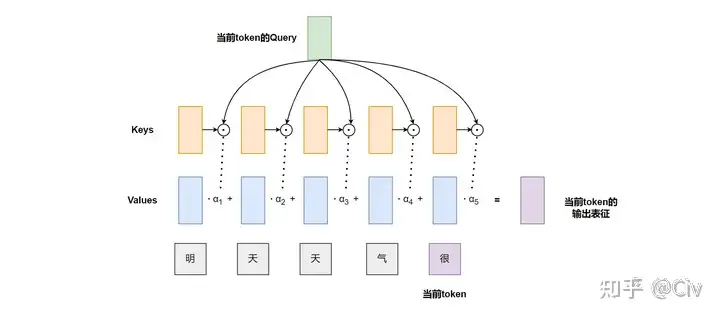
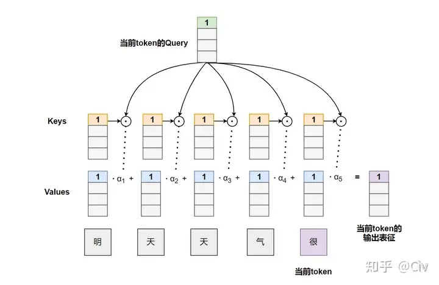

# 为什么不增加 transformer 模型的attention模块中的头的数量？
* * *

> 本文是根据 [https://www.zhihu.com/question/3366352749/answer/77811533929](https://www.zhihu.com/question/3366352749/answer/77811533929) 文章的总结修改精炼

**省流版：**

本文介绍了四种不同的视角来尝试解释为什么不能无限制地增加 attention head 数（按照标准 Transformer 的做法，这对应于减少 attention head 维数）：

**视角一：直觉**  
在多头注意力机制中，注意力头数 $h$ 可看作是一个控制模型自由度的超参数。**太小了约束太强，太大了模型不容易优化，所以就需要一个合适的约束，而不能无限制地增加注意力头数量**。

**视角二：集成模型**  
多头注意力实际上是将一个大模型（全维度的 self-attention）拆分为几个小模型（每个 head 的 self-attention）的集成。这在一定程度上能够解释为什么每个 head 降低了维度，但是整体效果更好。但我们不能让每个小模型太小（维度太低），以防止它们表现太差。

**视角三：Johnson-Lindenstrauss 引理**  
为了维持降维后的 embedding 精度，attention head 的维度不能过低，因此 head 数量就不能太多。

**视角四：理论研究**  
当 attention head 维度太小时，不满足"全表征"性质。虽然与实际应用存在一定的 gap，但它为维度选择提供了理论依据。

* * *

正文
--

### 符号约定

以 Decoder 结构为例，输入序列为 $x\_1, x\_2, ..., x\_n \\in \\mathbb{R}^{1 \\times d}$，其中 $d$ 为 token 的表征维度。定义：

$$ \\begin{aligned} q\_n &= x\_n W\_q \\quad &(1) \\ k\_i &= x\_i W\_k \\quad &(2) \\ v\_i &= x\_i W\_v \\quad &(3) \\end{aligned} $$

单头注意力输出为加权和： $$ o\_n = \\alpha\_1 v\_1 + \\alpha\_2 v\_2 + \\cdots + \\alpha\_n v\_n \\quad (4) $$ 权重计算为： $$ \\alpha\_i = \\frac{\\exp(q\_n \\cdot k\_i)}{\\sum\_{j=1}^n \\exp(q\_n \\cdot k\_j)} \\quad (5) $$

  
_图 1 单头注意力计算示意图_

多头注意力将向量切片为 $h$ 个子向量，拼接后通过全连接层： $$ o\_n = \\left\[o\_n^{(1)}, o\_n^{(2)}, \\ldots, o\_n^{(h)}\\right\] W\_o \\quad (6) $$

  
_图 2 多头注意力计算示意图（h=4）_

* * *

视角一：直觉分析
--------

单头注意力是多头注意力的约束形式： $$ o\_n = \\sum\_{j=1}^h \\left\[ \\sum\_{i=1}^n \\alpha\_{i,j} v\_i^{(j)} \\right\] \\quad (1.2) $$ 当所有子向量权重 $\\alpha\_{i,1}=\\alpha\_{i,2}=\\cdots=\\alpha\_{i,h}$ 时退化为单头注意力。**模型自由度需要平衡**：

*   自由度太低：约束过强（如 CNN 对 MLP 的约束）
*   自由度太高：优化困难（如 MLP 在图像任务中的表现）

* * *

视角二：集成模型
--------

将大模型拆分为 $h$ 个子模型： $$ \\begin{aligned} q\_n^{(j)} &= x\_n W\_q^{(j)} \\quad &(2.2) \\ k\_i^{(j)} &= x\_i W\_k^{(j)} \\quad &(2.3) \\ v\_i^{(j)} &= x\_i W\_v^{(j)} \\quad &(2.4) \\end{aligned} $$ 总参数量保持 $d \\times d$，通过**低秩性质**和**集成补偿**实现信息保留：

1.  参数矩阵普遍具有低秩特性
2.  子空间集成弥补单头信息损失

* * *

视角三：Johnson-Lindenstrauss 引理
----------------------------

对 $d$ 维空间中 $m$ 个点，存在线性映射 $f: \\mathbb{R}^m \\to \\mathbb{R}^n$ 使得： $$ (1-\\epsilon)|u-v|^2 \\leq |f(u)-f(v)|^2 \\leq (1+\\epsilon)|u-v|^2 \\quad (3.1) $$ 当 $n > \\frac{8 \\ln m}{\\epsilon^2}$ 时成立。以 LLaMA 3 的序列长度 8192 为例： $$ n > 8 \\ln 8192 \\approx 73 \\quad (3.2) $$ 实际使用 128 维度，验证了 JL 引理的实用性。

* * *

视角四：理论研究
--------

### 1\. Low-Rank Bottleneck (ICML'20)

证明当 attention head 维度 $d\_h < n$（序列长度）时：

*   存在无法表达的权重关系
*   输出 embedding 空间维度被压缩
*   理论建议 $d\_h \\geq n$，但实践表明"分辨率足够即可"

### 2\. Memorization Capacity (ICLR'24)

对一层 Transformer 的分析： $$ \\begin{aligned} \\text{记忆能力} &= \\Theta(Hn) \\quad (\\text{当 } d\_o = d) \\ \\text{参数量} &= \\Theta(Hd^2) \\end{aligned} $$ 结论：

1.  增加 $H$ 可提升记忆能力
2.  当 $d\_h > n$ 时增益消失（验证 $d\_h < d$ 的合理性）

* * *

总结
--

| 视角  | 核心矛盾 | 实践指导 |
| --- | --- | --- |
| 直觉  | 自由度 vs 优化难度 | 选择中等 head 数 |
| 集成模型 | 子空间分辨率 vs 参数量 | 保持合理压缩率 |
| JL 引理 | 降维精度 vs 计算成本 | 设置维度下限 |
| 理论研究 | 理论极限 vs 实际需求 | 超越最小阈值即可 |

最终结论：**注意力头数的选择本质是表达能力与优化难度的 tradeoff**。

* * *

参考文献
----

1.  [^](#ref1) Navon et al. _Low-Rank Bottleneck in Multi-head Attention Models._ ICML 2020. \[\[PDF\]\] ([https://arxiv.org/abs/2002.07028](https://arxiv.org/abs/2002.07028))
2.  [^](#ref2) Zhang et al. _Memorization Capacity of Multi-Head Attention in Transformers._ ICLR 2024. \[\[PDF\]\] ([https://arxiv.org/abs/2306.02010](https://arxiv.org/abs/2306.02010))