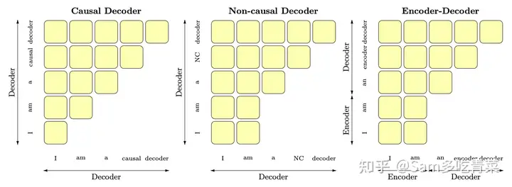

# 为什么现在的LLM都是Decoder&only的架构&&Sam聊算法
* * *

从**面试者**的角度认真答一下^\_^。

我想起了大半年前第一次在面试中遇到这个问题的窘况：

面试官 ：“为什么现在的大模型大都是**decoder-only**架构？”

懵逼的我TAT：“呃呃，和encoder-only相比，它**既能做理解也能做生成**，预训练的数据量和参数量上去之后，GPT这样的decoder-only模型的**zero-shot泛化能力很好**，而[BERT](https://zhida.zhihu.com/search?content_id=640486327&content_type=Answer&match_order=1&q=BERT&zhida_source=entity)这样的encoder-only模型一般还需要少量的下游标注数据来[fine-tune](https://zhida.zhihu.com/search?content_id=640486327&content_type=Answer&match_order=1&q=fine-tune&zhida_source=entity)才能得到较好的性能。”

面试官礼貌地说有点道理^\_^，然后开始发威→\_\_→：“那T5这种encoder-decoder也能兼顾理解和生成啊？像[FLAN](https://zhida.zhihu.com/search?content_id=640486327&content_type=Answer&match_order=1&q=FLAN&zhida_source=entity)那样instruction tuning之后zero-shot性能也不错呢？为啥现在几十几百B参数量的大模型基本都是decoder-only呢？”

更加慌张的我QaQ：“呃呃，确实有encoder-decoder和PrefixLM这些其他架构，现在大家对哪个更好好像还没有统一的定论，但到几十B这个规模还没人进行过系统的比较，大概是[OpenAI](https://zhida.zhihu.com/search?content_id=640486327&content_type=Answer&match_order=1&q=OpenAI&zhida_source=entity)先把decoder-only做work了，形成了轨迹依赖，大家都跟上了，之后或许会有更系统的探索。”

当时是面暑期实习，面试官还是放过了我，但我当时的内心是这样的：

> 半年前差点被这个问题挂在面试现场的我

现在想来，这个回答既不全面（没有主动提到T5那样的encoder-decoder架构，也忘了GLM、XLNET、PrefixLM等等其他架构），也没涉及到问题的科学本质：都知道decoder-only好，为啥好呢？

这个没有统一答案、却又对[LLM](https://zhida.zhihu.com/search?content_id=640486327&content_type=Answer&match_order=1&q=LLM&zhida_source=entity)的发展极其重要的问题，在24届算法岗面试热度颇高，我找工作的一路上就被不同公司的面试官们问了四五次，从面试官的反馈和贵乎各位大佬的回答中总结了一套目前来看比较完备的回答，希望能帮到有需要的各位：

首先**概述几种主要的架构**：以BERT为代表的encoder-only、以T5和[BART](https://zhida.zhihu.com/search?content_id=640486327&content_type=Answer&match_order=1&q=BART&zhida_source=entity)为代表的encoder-decoder、以GPT为代表的decoder-only，还有以[UNILM](https://zhida.zhihu.com/search?content_id=640486327&content_type=Answer&match_order=1&q=UNILM&zhida_source=entity)为代表的PrefixLM（相比于GPT只改了[attention mask](https://zhida.zhihu.com/search?content_id=640486327&content_type=Answer&match_order=1&q=attention+mask&zhida_source=entity)，前缀部分是双向，后面要生成的部分是单向的[causal mask](https://zhida.zhihu.com/search?content_id=640486327&content_type=Answer&match_order=1&q=causal+mask&zhida_source=entity)），可以用这张图辅助记忆：

> 这里的causal decoder就是GPT这样的decoder-only，non-causal-decoder就是指Prefix-LM。图片来自\[1\]

然后**说明要比较的对象**：首先淘汰掉BERT这种encoder-only，因为它用masked language modeling预训练，不擅长做生成任务，做[NLU](https://zhida.zhihu.com/search?content_id=640486327&content_type=Answer&match_order=1&q=NLU&zhida_source=entity)一般也需要有监督的下游数据微调；相比之下，decoder-only的模型用next token prediction预训练，兼顾理解和生成，在各种下游任务上的zero-shot和few-shot泛化性能都很好。我们需要讨论的是，为啥引入了一部分[**双向attention**](https://zhida.zhihu.com/search?content_id=640486327&content_type=Answer&match_order=1&q=%E5%8F%8C%E5%90%91attention&zhida_source=entity)的encoder-decoder和Prefix-LM没有被大部分大模型工作采用？（它们也能兼顾理解和生成，泛化性能也不错）

铺垫完了，相信这时候面试官已经能感受到你对各种架构是有基本了解的，不至于太菜，接下来是主干回答：

第一，用过去研究的经验说话，decoder-only的泛化性能更好：ICML 22的[What language model architecture and pretraining objective works best for zero-shot generalization?.](https://link.zhihu.com/?target=https%3A//proceedings.mlr.press/v162/wang22u/wang22u.pdf) 在最大5B参数量、170B token数据量的规模下做了一些列实验，发现用next token prediction预训练的decoder-only模型在各种下游任务上zero-shot泛化性能最好；另外，许多工作表明[decoder-only模型](https://zhida.zhihu.com/search?content_id=640486327&content_type=Answer&match_order=3&q=decoder-only%E6%A8%A1%E5%9E%8B&zhida_source=entity)的few-shot（也就是上下文学习，in-context learning）泛化能力更强，参见论文\[2\]和 [@Minimum](https://www.zhihu.com/people/cf0870ee9f85913d837ac5e15a557548) 大佬[回答](https://www.zhihu.com/question/588325646/answer/2932131238)的第3点。

第二，**博采众家之言，分析科学问题，阐述decoder-only泛化性能更好的潜在原因：**

1.  [@苏剑林](https://www.zhihu.com/people/ba2e8e5e459263c8074c6a50cd2763a4) 苏神强调的[**注意力满秩的问题**](https://www.zhihu.com/question/588325646/answer/2940298964)，双向attention的[注意力矩阵](https://zhida.zhihu.com/search?content_id=640486327&content_type=Answer&match_order=1&q=%E6%B3%A8%E6%84%8F%E5%8A%9B%E7%9F%A9%E9%98%B5&zhida_source=entity)容易退化为低秩状态，而[causal attention](https://zhida.zhihu.com/search?content_id=640486327&content_type=Answer&match_order=1&q=causal+attention&zhida_source=entity)的注意力矩阵是下三角矩阵，必然是满秩的，建模能力更强；
2.  [@yili](https://www.zhihu.com/people/1ed9356a7a74c78c424ff357d0c17357) 大佬强调的[**预训练任务难度问题**](https://www.zhihu.com/question/588325646/answer/3173454912)，纯粹的decoder-only架构+next token predicition预训练，每个位置所能接触的信息比其他架构少，要预测下一个token难度更高，当模型足够大，数据足够多的时候，decoder-only模型学习通用表征的上限更高；
3.  [@mimimumu](https://www.zhihu.com/people/ebd618ce0809773041780d8b94bf8558) 大佬强调，[**上下文学习为decoder-only架构带来的更好的few-shot性能**](https://www.zhihu.com/question/588325646/answer/2932131238)：prompt和demonstration的信息可以视为对模型参数的隐式微调\[2\]，decoder-only的架构相比encoder-decoder在[in-context learning](https://zhida.zhihu.com/search?content_id=640486327&content_type=Answer&match_order=2&q=in-context+learning&zhida_source=entity)上会更有优势，因为prompt可以更加直接地作用于decoder每一层的参数，微调的信号更强；
4.  多位大佬强调了一个很容易被忽视的属性，**causal attention （就是decoder-only的单向attention）具有隐式的位置编码功能 \[3\]**，打破了transformer的位置不变性，而带有双向attention的模型，如果不带位置编码，双向attention的部分token可以对换也不改变表示，对语序的区分能力天生较弱。

第三，既然是工业界面试嘛，肯定要提**效率问题**，**decoder-only支持一直复用**[**KV-Cache**](https://zhida.zhihu.com/search?content_id=640486327&content_type=Answer&match_order=1&q=KV-Cache&zhida_source=entity)，对多轮对话更友好，因为每个token的表示只和它之前的输入有关，而encoder-decoder和PrefixLM就难以做到；

第四，务虚一点，谈谈轨迹依赖的问题：OpenAI作为开拓者勇于挖坑踩坑，以decoder-only架构为基础摸索出了一套行之有效的训练方法和Scaling Law，后来者鉴于时间和计算成本，自然不愿意做太多结构上的大改动，继续沿用decoder-only架构。在工程生态上，decoder-only架构也形成了先发优势，[Megatron](https://zhida.zhihu.com/search?content_id=640486327&content_type=Answer&match_order=1&q=Megatron&zhida_source=entity)和flash attention等重要工具对causal attention的支持更好。

最后，**跳出轨迹依赖，展示一下你的博学和开放的眼光**，谈谈GLM、XLNet这些比较另类的模型结构，表示到了几十几百B这个参数规模，还没有特别系统的实验比较说明decoder-only一定最好，后面值得继续探索。当然了，“咱们”公司如果有相关机会，我特别愿意过来和老师们结合具体业务需求来探索（手动狗头）。

相信这一套回答下来，原本可能昏昏欲睡的面试官会精神一振奋，大概率给你痛快通过：

我是 [@Sam多吃青菜](https://www.zhihu.com/people/91a9276093edb7687d8be1df5c5f346b) ，一枚即将从北大毕业的NLPer，日常更新LLM和深度学习领域前沿进展，也接算法面试辅导，欢迎关注和赐读往期文章，多多交流讨论：

[机器学习中有哪些形式简单却很巧妙的idea？272 赞同 · 19 评论回答](https://www.zhihu.com/question/347847220/answer/3351077766)

[Sam多吃青菜：大模型微调新范式：当LoRA遇见MoE443 赞同 · 18 评论文章](https://zhuanlan.zhihu.com/p/683637455)

[Sam多吃青菜：算法冷知识第1期-大模型的FFN有什么变化？42 赞同 · 2 评论文章](https://zhuanlan.zhihu.com/p/683673404)

[Sam多吃青菜：算法冷知识第2期-一文看遍节省显存技巧（附代码）36 赞同 · 3 评论文章](https://zhuanlan.zhihu.com/p/687948401)

[Sam多吃青菜：算法冷知识第3期-1B参数的大模型训练需要多少显存？104 赞同 · 23 评论文章](https://zhuanlan.zhihu.com/p/688324947)

[Sam多吃青菜：算法冷知识第4期-LoRA为什么能加速大模型训练？别想得太简单哦34 赞同 · 9 评论文章](https://zhuanlan.zhihu.com/p/688361341)

[Sam多吃青菜：算法冷知识第5期——L2正则化和Weight Decay总是分不清？AdamW经典重温48 赞同 · 0 评论文章](https://zhuanlan.zhihu.com/p/689412950)

[机器学习中有哪些形式简单却很巧妙的idea？272 赞同 · 19 评论回答](https://www.zhihu.com/question/347847220/answer/3351077766)

[NLP中有什么比较好的sentence/paragraph embedding方法 ？132 赞同 · 23 评论回答](https://www.zhihu.com/question/299549788/answer/3359893373)

[Sam多吃青菜：开卷翻到毒蘑菇？浅谈大模型检索增强（RAG）的鲁棒性147 赞同 · 8 评论文章](https://zhuanlan.zhihu.com/p/668347524)

[Sam多吃青菜：LLaMA2+RLHF=脆皮大模型？ICLR 2024 高分投稿：多样性驱动的红蓝对抗139 赞同 · 5 评论文章](https://zhuanlan.zhihu.com/p/669675072)

[深度学习调参有哪些技巧？81 赞同 · 7 评论回答](https://www.zhihu.com/question/25097993/answer/3356180120)

[Sam多吃青菜：大模型对齐的奇兵——黑盒 Prompt 优化BPO53 赞同 · 5 评论文章](https://zhuanlan.zhihu.com/p/668685286)

[Sam多吃青菜：个性有了，心眼坏了？大模型微调的潜在危害36 赞同 · 6 评论文章](https://zhuanlan.zhihu.com/p/672454714)

[Transformer解码器推理速度慢怎么优化？26 赞同 · 0 评论回答](https://www.zhihu.com/question/524165474/answer/3369040272)

[现在的深度学习的模型越来越大，有个结论是说，大脑的激活是非常稀疏的，对模型参数有什么好的办法压缩吗?25 赞同 · 4 评论回答](https://www.zhihu.com/question/40503595/answer/3363802626)

#大模型 #[大语言模型](https://zhida.zhihu.com/search?content_id=640486327&content_type=Answer&match_order=1&q=%E5%A4%A7%E8%AF%AD%E8%A8%80%E6%A8%A1%E5%9E%8B&zhida_source=entity) #GPT \[\[ChatGPT\]\] \[\[NLP\]\] \[\[自然语言处理\]\] \[\[深度学习\]\] \[\[算法岗面试\]\] \[\[面经\]\]

**参考文献**

\[1\] Wang, Thomas, et al. "What language model architecture and pretraining objective works best for zero-shot generalization?."_International Conference on Machine Learning_. PMLR, 2022.

\[2\] Dai, Damai, et al. "Why can gpt learn in-context? language models secretly perform gradient descent as meta optimizers."_arXiv preprint arXiv:2212.10559_(2022).

\[3\] Haviv, Adi, et al. "Transformer Language Models without Positional Encodings Still Learn Positional Information."_Findings of the Association for Computational Linguistics: EMNLP 2022_. 2022.