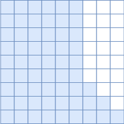
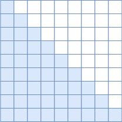
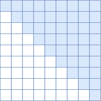
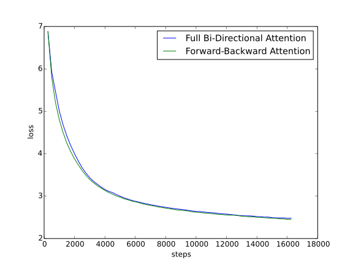

# &苏剑林
* * *

created: 2025-01-24T00:20 updated: 2025-01-26T02:08
---------------------------------------------------

LLM是“Large Language Model”的简写,目前一般指百亿参数以上的语言模型,主要面向\*\*文本生成\*\*任务.跟小尺度模型(10亿或以内量级)的“百花齐放”不同,目前LLM的一个现状是Decoder-only架构的研究居多,像OpenAI一直坚持Decoder-only的GPT系列就不说了,即便是Google这样的并非全部押注在Decoder-only的公司,也确实投入了不少的精力去研究Decoder-only的模型,如PaLM就是其中之一.那么,为什么Decoder-only架构会成为LLM的主流选择呢？

知乎上也有同款问题[《为什么现在的LLM都是Decoder only的架构？》](https://www.zhihu.com/question/588325646),上面的回答大多数聚焦于Decoder-only在训练效率和工程实现上的优势,那么它有没有理论上的优势呢？本文试图从这个角度进行简单的分析.

统一视角[#](https://kexue.fm/archives/9529#%E7%BB%9F%E4%B8%80%E8%A7%86%E8%A7%92)
----------------------------------------------------------------------------

需要指出的是,笔者目前训练过的模型,最大也就是10亿级别的,所以从LLM的一般概念来看是没资格回答这个问题的,下面的内容只是笔者根据一些研究经验,从偏理论的角度强行回答一波.文章多数推论以自己的实验结果为引,某些地方可能会跟某些文献的结果冲突,请读者自行取舍.

我们知道,一般的NLP任务都是根据给定的输入来预测输出,完全无条件的随机生成是很少的,换句话说,任何NLP任务都可以分解为“输入”跟“输出”两部分,我们可以把处理“输入”的模型叫做Encoder,生成“输出”的模型叫做Decoder,那么所有任务都可以从“Encoder-Decoder”的视角来理解,而不同模型之间的差距在于Encoder、Decoder的注意力模式以及是否共享参数:

GPTUniLMT5Encoder注意力单向双向双向Decoder注意力单向单向单向是否共享参数是是否Encoder注意力Decoder注意力是否共享参数GPT单向单向是UniLM双向单向是T5双向单向否

这里的GPT就是Decoder-only的代表作；[UniLM](https://kexue.fm/archives/6933)则是跟GPT相似的Decoder架构,但它是混合的注意力模式；[T5](https://kexue.fm/archives/7867)则是Encoder-Decoder架构的代表作,主要是Google比较感兴趣.

双向

混合

单向(正向)

单向(反向)

Google在[T5](https://papers.cool/arxiv/1910.10683)和[UL2](https://papers.cool/arxiv/2205.05131)两篇论文中做了较为充分的对比实验,结果均体现出了Encoder-Decoder架构相比于Decoder-only的优势,但由于从LLM的角度看这两篇论文的模型尺度都还不算大,以及多数的LLM确实都是在做Decoder-only的,所以这个优势能否延续到更大尺度的LLM以及这个优势本身的缘由,依然都还没有答案.

对比实验[#](https://kexue.fm/archives/9529#%E5%AF%B9%E6%AF%94%E5%AE%9E%E9%AA%8C)
----------------------------------------------------------------------------

从上表可以看出,其实GPT跟UniLM相比才算是严格控制变量的,如果GPT直接跟T5相比,那实际上产生了两个变量: 输入部分的注意力改为双向以及参数翻了一倍.而之所以会将它们三个一起对比,是因为它们的推理成本大致是相同的.

相比GPT,既然T5有两个变量,那么我们就无法确定刚才说的Encoder-Decoder架构的优势,究竟是输入部分改为双向注意力导致的,还是参数翻倍导致的.为此,笔者在10亿参数规模的模型上做了GPT和UniLM的对比实验,结果显示对于同样输入输出进行从零训练(Loss都是只对输出部分算,唯一的区别就是输入部分的注意力模式不同),UniLM相比GPT并无任何优势,甚至某些任务更差.

假设这个结论具有代表性,那么我们就可以初步得到结论:

输入部分的注意力改为双向不会带来收益,Encoder-Decoder架构的优势很可能只是源于参数翻倍.

换句话说,在同等参数量、同等推理成本下,Decoder-only架构很可能是最优选择.当然,要充分验证这个猜测,还需要补做一些实验,比如Encoder和Decoder依然不共享参数,但Encoder也改为单向注意力,或者改为下一节介绍的正反向混合注意力,然后再对比常规的Encoder-Decoder架构.但笔者的算力有限,这些实验就留给有兴趣的读者了.

低秩问题[#](https://kexue.fm/archives/9529#%E4%BD%8E%E7%A7%A9%E9%97%AE%E9%A2%98)
----------------------------------------------------------------------------

为什么“输入部分的注意力改为双向不会带来收益”呢？明明输入部分不需要考虑自回归生成,直觉上应该完整的注意力矩阵更好呀？笔者猜测,这很可能是因为双向注意力的低秩问题带来的效果下降.

众所周知,Attention矩阵一般是由一个低秩分解的矩阵加softmax而来,具体来说是一个n×dn×d的矩阵与d×nd×n的矩阵相乘后再加softmax(n≫dn≫d),这种形式的Attention的矩阵因为低秩问题而带来表达能力的下降,具体分析可以参考[《Attention is Not All You Need: Pure Attention Loses Rank Doubly Exponentially with Depth》](https://papers.cool/arxiv/2103.03404).而Decoder-only架构的Attention矩阵是一个下三角阵,注意三角阵的行列式等于它对角线元素之积,由于softmax的存在,对角线必然都是正数,所以它的行列式必然是正数,即Decoder-only架构的Attention矩阵一定是满秩的！满秩意味着理论上有更强的表达能力,也就是说,Decoder-only架构的Attention矩阵在理论上具有更强的表达能力,改为双向注意力反而会变得不足.

还有个间接支持这一观点的现象,那就是[线性Attention](https://kexue.fm/archives/7546)在语言模型任务上(单向注意力)与标准Attention的差距,小于它在MLM任务上(双向注意力)与标准Attention的差距,也就是说,线性Attention在双向注意力任务上的效果相对更差.这是因为线性Attention在做语言模型任务时,它的Attention矩阵跟标准Attention一样都是满秩的下三角阵；在做MLM任务时,线性Attention矩阵的秩比标准Attention矩阵更低(线性Attention是n×dn×d的矩阵与d×nd×n的矩阵相乘,秩一定不超过dd,标准Attention是n×dn×d的矩阵与d×nd×n的矩阵相乘后加softmax,softmax会有一定的升秩作用,参考[《Transformer升级之路: 3、从Performer到线性Attention》](https://kexue.fm/archives/8338)中的“低秩问题”一节及评论区).

反过来,这个结论能不能用来改进像BERT这样的双向注意力模型呢？思路并不难想,比如在Multi-Head Attention中,一半Head的Attention矩阵截断为下三角阵(正向注意力),另一半Head的Attention矩阵截断为上三角阵(反向注意力)；又或者说奇数层的Attention矩阵截断为下三角阵(正向注意力),偶数层的Attention矩阵截断为上三角阵(反向注意力).这两种设计都可以既保持模型整体交互的双向性(而不是像GPT一样,前一个token无法跟后一个token交互),又融合单向注意力的满秩优点.

笔者也简单做了对比实验,发现正反向混合的注意力在MLM任务上是比像BERT这样的全双向注意力模型效果稍微要好点的:

全双向注意力与正反向混合注意力的训练曲线比较

好消息是看得出略有优势,间接支持了前面的猜测；坏消息是这实验的只是一个base版本(1亿参数)的模型,更大模型的效果尚未清楚.

文章小结[#](https://kexue.fm/archives/9529#%E6%96%87%E7%AB%A0%E5%B0%8F%E7%BB%93)
----------------------------------------------------------------------------

所以,笔者作出的回答是: LLM之所以主要都用Decoder-only架构,除了训练效率和工程实现上的优势外,在理论上是因为Encoder的双向注意力会存在低秩问题,这可能会削弱模型表达能力,就生成任务而言,引入双向注意力并无实质好处.而Encoder-Decoder架构之所以能够在某些场景下表现更好,大概只是因为它多了一倍参数.所以,在同等参数量、同等推理成本下,Decoder-only架构就是最优选择了.