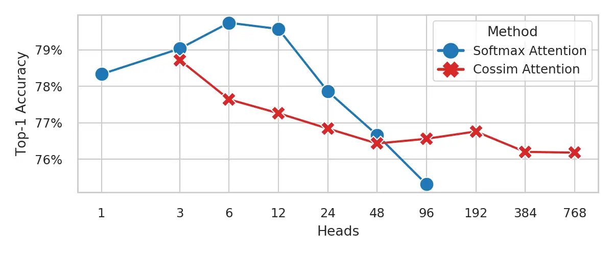

# 面试题随记
1 . 为什么Self-Attention要通过线性变换计算Q K V，背后的原理或直观解释是什么？
--------------------------------------------------

[https://www.zhihu.com/question/592626839/answer/67210626639](https://www.zhihu.com/question/592626839/answer/67210626639)

[https://www.zhihu.com/question/592626839/answer/3304714001](https://www.zhihu.com/question/592626839/answer/3304714001)

2\. 为什么不增加 transformer 模型的attention模块中的头的数量？
--------------------------------------------

Head 與 Top-1 Accurary 之間的關係 \[1\] Daniel Bolya, Cheng-Yang Fu, Xiaoliang Dai, Peizhao Zhang, & Judy Hoffman (2022). Hydra Attention: Efficient Attention with Many Heads\_. Eccv Workshops\_.

深入浅出完整解析Transformer核心 四种视角解读为什么head不是越多越好

3\. 为什么transformer要用adam？
-------------------------

CUHK-SZ一篇最近的文章解决了这个问题

[\[2402.16788\] Why Transformers Need Adam: A Hessian Perspective (arxiv.org)](https://link.zhihu.com/?target=https%3A//arxiv.org/abs/2402.16788)

大概就是每块的hessian不一样需要不一样的学习率，而adam的adaptivity刚好能满足这个要求