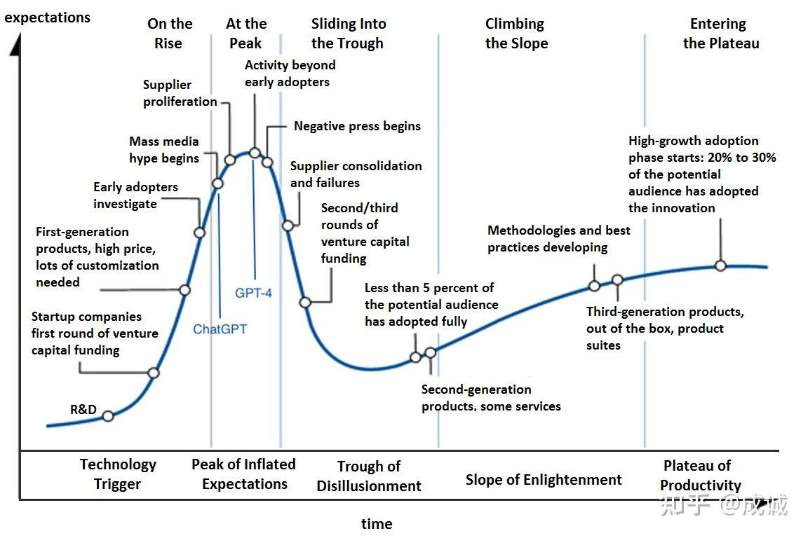
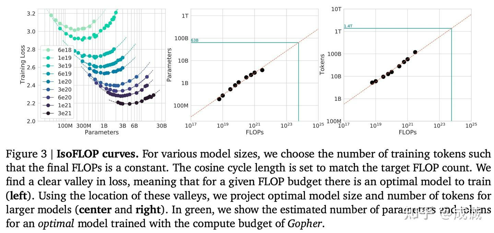
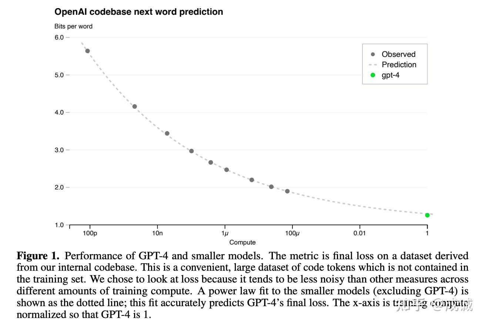
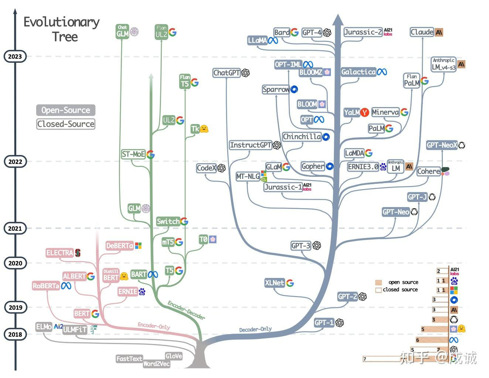

# 大模型时代，是Infra的春天还是冬天
* * *

created: 2025-01-24T00:20 updated: 2025-01-26T02:05
---------------------------------------------------

> 作者: 成诚
> 
> 原文: [https://zhuanlan.zhihu.com/p/656960458](https://zhuanlan.zhihu.com/p/656960458)

Highlights
----------

*   大模型时代元年感悟
*   Scaling Laws 是大模型时代的[摩尔定律](https://zhida.zhihu.com/search?content_id=234119980&content_type=Article&match_order=1&q=%E6%91%A9%E5%B0%94%E5%AE%9A%E5%BE%8B&zhida_source=entity),是最值得研究的方向
*   LLM 发展的三个阶段: 算法瓶颈 -> 数据瓶颈 -> [Infra](https://zhida.zhihu.com/search?content_id=234119980&content_type=Article&match_order=1&q=Infra&zhida_source=entity) 瓶颈
*   为什么 GPT 一枝独秀, BERT、T5 日落西山？
*   大模型时代,是大部分 Infra 人的冬天,少部分 Infra 人的春天(算法研究者 同理)

前言
--

2023 是我过往人生经历中最传奇的一年(虽然只过去了 3/4),年初 [ChatGPT](https://zhida.zhihu.com/search?content_id=234119980&content_type=Article&match_order=1&q=ChatGPT&zhida_source=entity) 爆火让所有人看到了 AGI 可能实现的曙光,无数创业公司、大厂立即跟进 LLM 甚至 ALL IN, 紧随而来的 GPT-4 和 [Office Copilot](https://zhida.zhihu.com/search?content_id=234119980&content_type=Article&match_order=1&q=Office+Copilot&zhida_source=entity) 让市场沸腾.当时感觉,AI 时代的技术迭代速度以天记,汹涌的 AI 技术革命将迅速影响每个人的生活.从技术发展曲线来看, GPT-4 的发布应该是市场关注度的峰值:

> LLM 技术成熟度曲线(大致)

那时我也有幸跟随[袁老师](https://zhida.zhihu.com/search?content_id=234119980&content_type=Article&match_order=1&q=%E8%A2%81%E8%80%81%E5%B8%88&zhida_source=entity)加入老王创立的光年之外,在低头开发分布式深度学习框架 [OneFlow](https://zhida.zhihu.com/search?content_id=234119980&content_type=Article&match_order=1&q=OneFlow&zhida_source=entity) 六年之后,幸运的站在了时代旋涡的中心(两个月 AI [独角兽](https://zhida.zhihu.com/search?content_id=234119980&content_type=Article&match_order=1&q=%E7%8B%AC%E8%A7%92%E5%85%BD&zhida_source=entity) 体验卡),也第一次体验了实操千卡集群做大模型训练究竟是怎样的,瓶颈在哪里(其实很多实际经验和预先设想的相悖).

最近 [DALL·E 3](https://zhida.zhihu.com/search?content_id=234119980&content_type=Article&match_order=1&q=DALL%C2%B7E+3&zhida_source=entity) 和 GPT-4V 相继出炉,OpenAI 的图片理解和生成能力都有很大的提升. 不过无论是 资本市场 还是 媒体关注度 其实都相对冷静下来了, AI 时代的技术迭代速度也不是按天革新的, 商业化能力更是遭到投资人的质疑.虽然所有人都认可未来是 AI 的时代,但在中短期内 AI 如何盈利是一个头大的问题,只有卖 GPU 的 [NVIDIA](https://zhida.zhihu.com/search?content_id=234119980&content_type=Article&match_order=1&q=NVIDIA&zhida_source=entity) 着实赚了钱.

对于做 AI Infra / MLSys 方向的我来说, 大模型的机会是既激动又悲哀的. 激动的是: 终于有机会在之前难以想象的尺度上解决复杂的、最前沿的工程问题,且能产生巨大的经济成本和时间成本收益. 悲哀的是: 随着 GPT 一统江湖,以及能真正训练超大模型的机会稀缺,**一个通用的分布式深度学习框架和通用并行优化算法已经失去了其意义(深度学习编译器同理, 在大模型训练侧,一定是手工优化最优,参考**\*\* \*\*[**FlashAttention**](https://zhida.zhihu.com/search?content_id=234119980&content_type=Article&match_order=1&q=FlashAttention&zhida_source=entity)),真正的需求是在特定集群上开发一个专有的训练系统,并人工优化和业务相关的特定模型.由于这些少数的特定模型经济效益巨大,值得商业公司为其雇佣一个 Infra 团队做专门的优化.

Scaling Laws —— 大模型时代的摩尔定律
--------------------------

如果大模型时代只能选择一个方向去研究的话,我认为 Scaling Laws 是当之无愧的、唯一重要的方向.

几篇前置的 Scaling Laws 论文:

*   [Scaling Laws for Neural Language Models](https://link.zhihu.com/?target=https%3A//arxiv.org/pdf/2001.08361.pdf) OpenAI, 2020
*   [Training Compute-Optimal Large Language Models](https://link.zhihu.com/?target=https%3A//arxiv.org/abs/2203.15556) DeepMind, 2022
*   [GPT-4 Technical Report](https://link.zhihu.com/?target=https%3A//arxiv.org/pdf/2303.08774.pdf) OpenAI, 2023

Scaling Laws 预示了几个非常重要的规律:

*   同架构下,同数据质量下, 增加参数量 、增加训练的 token 数(等效为增加训练的成本 / FLOPs )就会提升模型的最终表现. 且目前还没有看到 Scaling Laws 失效的迹象. 目前已知到至少到 2T 参数、30T tokens ( 理论 FLOPs 10^26) 都不是 Scaling Laws 的上限 (但已经是数亿美金的训练成本了). 也许 AGI 正隐藏在我们当前远远不能企及的 Model Size 和 Data Size 位置.

> Chinchilla Approach 2 拟合 Scaling Laws

*   Scaling Laws 具有可预测性, OpenAI 可以用小于 万分之一 的成本来预测并验证 GPT-4 的最终表现( loss 、能力得分), 同时 Scaling Laws 在至少 8 个数量级 FLOPs 跨度上都是[鲁棒](https://zhida.zhihu.com/search?content_id=234119980&content_type=Article&match_order=1&q=%E9%B2%81%E6%A3%92&zhida_source=entity)的.

> OpenAI GPT-4 跨多个 FLOPs 数量级尺度上预测最终的结果

Scaling Laws 比 摩尔定律 更加令人激动的是, 摩尔定律受限于硅基芯片的物理制程,到达 1nm 芯片的极限(电路只有一个硅原子间隙)以后就几乎无法再增加性能了.但 LLM 的 Model Size 和 [Token](https://zhida.zhihu.com/search?content_id=234119980&content_type=Article&match_order=1&q=Token&zhida_source=entity)s Size 永远可以再大一倍.

通往 AGI 的道路上,Infra 未来将定义一切
-------------------------

我将 LLM 的发展概括为三个阶段:

**阶段一: 算法研究阶段 (2020 年之前)**

此时 [NLP](https://zhida.zhihu.com/search?content_id=234119980&content_type=Article&match_order=1&q=NLP&zhida_source=entity) 的模型研究都是在探索一个基于 **给定数据集** , 一个 特定的下游任务, 怎样的 模型结构、超参、训练技巧可以达到更高的任务分数. 所以各种模型结构、算法百花齐放, 一开始是 [Word2vec](https://zhida.zhihu.com/search?content_id=234119980&content_type=Article&match_order=1&q=Word2vec&zhida_source=entity)、RNN/LSTM , 后面 BERT 、 T5 、 GPT 及其各种变体,更是百家争鸣. 模型的大小大多在 1B 以下 (如 **BERT**\-Large 340M, **T5**\-Large 770M、**GPT-2** 1.5B),训练所需的数据集大小一般不超过 10B . 这样的任务,大部分高校、科研院所 在几台高性能 GPU 服务器上用 [DeepSpeed](https://zhida.zhihu.com/search?content_id=234119980&content_type=Article&match_order=1&q=DeepSpeed&zhida_source=entity) 之类的框架都可以比较方便的训练起来.

**阶段二: 数据为王阶段 (2020 —— 2023 年)**

从 [GPT-3](https://zhida.zhihu.com/search?content_id=234119980&content_type=Article&match_order=1&q=GPT-3&zhida_source=entity) 起,LLM 的游戏玩法变了. Scaling Laws 揭示了模型大小 和 数据量 才是最关键的, 模型大小迅速从 1B 膨胀到了 175B (一百倍),数据量从 10B 膨胀到了 1T 以上 (一百倍),随之而来的是训练成本的极速增加. 由于 FLOPs 翻了 一万倍, LLM 不再是学术界能训得起的了, 500W 美金一次的训练成本, 只有少数头部 AI 企业能有机会玩得起. 同时数据迅速从一个类似 ImageNet 的开源数据集,演化为爬取、清洗、整理全互联网数据. **LLM 从学术研究 演变成了 数据工程科学.** 在巨量的数据、模型参数、GPU 卡下, 什么模型结构和算法调优不再显得重要,\*\* \*\***各家大模型公司实际上比的是谁的数据收集的多、质量清洗的好、配比调的优.**

其实这时候,用千卡 A100 训练千亿大模型,本身 Infra 也是瓶颈. 但是由于 NVIDIA 开源了 [Megatron-LM](https://zhida.zhihu.com/search?content_id=234119980&content_type=Article&match_order=1&q=Megatron-LM&zhida_source=entity) (复现 GPT-3),提供了业界最佳实践,导致 Infra 的开发和调优时间被极大缩短.

**为什么在大模型时代,曾经风光无限的 BERT 家族 和 T5 家族没落了？**

> LLM进化树,BERT(Encoder-Only)、T5(Encoder-Decoder)、GPT(Decoder-Only) 分别代表了不同的架构方向

这里提一个我自己的观点: 有可能从纯算法模型结构上,T5 是比 GPT 更优的结构, 但是由于 T5 的模型结构不是线性的(Decoder 和 Encoder 之间有复杂的连接关系),导致 T5 的流水并行实际上无法真正高效的执行起来.因此,在目前已知的并行优化上, T5 很难 [Scale](https://zhida.zhihu.com/search?content_id=234119980&content_type=Article&match_order=1&q=Scale&zhida_source=entity) 到千亿参数以上的规模. 针对 GPT 的[分布式并行优化](https://zhida.zhihu.com/search?content_id=234119980&content_type=Article&match_order=1&q=%E5%88%86%E5%B8%83%E5%BC%8F%E5%B9%B6%E8%A1%8C%E4%BC%98%E5%8C%96&zhida_source=entity),会比 T5 容易很多.因此,我的观点是,也许不同的算法结构互有高低,但是在 LLM 时代, **更容易分布式并行、更容易扩展、训练 Token 效率更高的模型,一定是更具备优势的,这就是 Infra 反过来影响 算法.**

**阶段三: Infra 决定了模型的发展方向 (2023 以后)**

由于目前 LLM 的成本已经非常高( GPT-4 训练一次的成本超过 5000W 美金),再往上翻倍探索下一个 FLOPs 数量级也变得十分困难. 因此 [MoE](https://zhida.zhihu.com/search?content_id=234119980&content_type=Article&match_order=1&q=MoE&zhida_source=entity) 才会是下一个时代的主流: **如何用更低的成本, 更快的训练更大的模型？ 将是未来 20 年 AI 革命中永恒的主题.**\*\* \*\*训练速度每提升 5%,都将节省上千万人民币的训练成本,并在大模型竞赛中占据优势地位.

未来 LLM 算法研究也必然朝着 Infra 的方向去探索: [稀疏化](https://zhida.zhihu.com/search?content_id=234119980&content_type=Article&match_order=1&q=%E7%A8%80%E7%96%8F%E5%8C%96&zhida_source=entity)([Sparse Attention](https://zhida.zhihu.com/search?content_id=234119980&content_type=Article&match_order=1&q=Sparse+Attention&zhida_source=entity)、 Sparse GEMM / MoE) 将会是明年的(学术界/工业界)主战场. 即使是 Dense 的大模型([LLaMa2](https://zhida.zhihu.com/search?content_id=234119980&content_type=Article&match_order=1&q=LLaMa2&zhida_source=entity)), 也在探索诸如 [GQA](https://zhida.zhihu.com/search?content_id=234119980&content_type=Article&match_order=1&q=GQA&zhida_source=entity) (Grouped Query Attention) 等算法结构上的调优,这些算法优化并不是为了提升模型的效果,而是希望成倍的节省 Inference 时的 [KVCache 显存](https://zhida.zhihu.com/search?content_id=234119980&content_type=Article&match_order=1&q=KVCache+%E6%98%BE%E5%AD%98&zhida_source=entity),从而使 LLM 可以有更高的吞吐.

因此,如果你是一个想在 AI 大模型时代有所建树的算法研究员,不懂 Infra 将会是非常吃亏的. 如果你来设计一个新的 大模型算法, 一定需要在设计阶段就要考虑如下问题:

*   这个模型结构是否更容易分布式并行？ 新的结构在各种并行时所需的通信量是不是更低？
*   新的模型算法是否拥有: 更少的计算量、 更少的显存需求、 更容易推理？
*   新的模型在做超长上下文(100K 以上的 Sequence Length) 时,如何训练 和 如何推理？

换言之,在 LLM 时代,如果你提出的新的算法结构可能有 5% 的效果提升,但是引入了额外 50% 的训练成本(计算时间 or 通信量) 的话,那这个新的算法一定是一个负优化. 因为这 50% 的训练成本,基于 Scaling Laws 我可以在原模型上多训练 50% 的 tokens ,或者训练大一半的模型, 带来的最终提升都远大于新算法的 5%. 因此,新的算法研究必然在探索阶段就需要引入 Infra 因素的考量.

大模型时代,是 Infra 的春天还是冬天？
----------------------

其实到这里,这个问题的答案是显而易见的.由于大模型时代,训练 LLM 的成本如此之高,绝大多数的 系统工程师(MLSys 方向)和 算法工程师(NLP 方向) 其实都没有实施自己的想法的机会.因此,对于 Infra 从业者而言,是少部分人的春天,大部分人的冬天.

对于 Pre-train 算法来说,更是只有极少人和极少的 idea 会被 验证和采纳. 大量的高校 和 科研院所 将无缘前沿的大模型研究,这些研究机会 几乎被 OpenAI、Google、百度、字节 等 拥有海量 GPU 资源的 头部公司所垄断. 绝大多数学者只能从 SFT、 [Prompt Engineering](https://zhida.zhihu.com/search?content_id=234119980&content_type=Article&match_order=1&q=Prompt+Engineering&zhida_source=entity)、LoRA 等不怎么占用资源的方向内卷.

而在本来更加重要的方向,诸如 MoE ,只有少之又少的几篇经典 paper (Switch-T 、 GLaM)可以粗略的了解了解算法. 而 Infra 更是落后 OpenAI 数个版本(我不认为诸如 [MegaBlocks](https://zhida.zhihu.com/search?content_id=234119980&content_type=Article&match_order=1&q=MegaBlocks&zhida_source=entity)、 Tutel、DeepSpeed-MoE 有能 Scale 到数千卡以上规模的能力),连一个最佳实践都没有. 这些具有巨大价值的 Know-how 被锁在了极少公司的核心团队内部. OpenAI 从不热衷于写论文(可以改名为 [CloseAI](https://zhida.zhihu.com/search?content_id=234119980&content_type=Article&match_order=1&q=CloseAI&zhida_source=entity)), Google 也开始 follow 了.

(其实这篇文章的初衷是想给自己打个广告招人....

* * *

因此想要探索这些 Know-how , 想要推进 AGI 的核心进程(我认为即使是 GPT-4,距离 AGI 也仍然非常遥远,仍需要很多代的 Foundation model 研究),只能在掌握大量 GPU 资源的团队才有机会实施自己的想法(貌似 [Meta](https://zhida.zhihu.com/search?content_id=234119980&content_type=Article&match_order=1&q=Meta&zhida_source=entity) 的卡也很少,不同团队竞争 GPU 很激烈).所以我在从光年之外离开以后,首要思考的就是去哪里能有机会 Own 一个数千卡的集群？ 最终我来到了 [昆仑天工 Skywork](https://link.zhihu.com/?target=https%3A//search.tiangong.cn/) ,一个我有机会能从头复现 GPT-4 的团队.

所幸,我作为 [昆仑万维](https://zhida.zhihu.com/search?content_id=234119980&content_type=Article&match_order=1&q=%E6%98%86%E4%BB%91%E4%B8%87%E7%BB%B4&zhida_source=entity) 的 AI-Infra 负责人,今年有约 6000 张 A800 , 是为数不多有机会从头训练 LLM 的公司. 如果你有兴趣来研发一个 SOTA 的 MoE Training Framework,或者想要研究下一代 Foundation Model 、研究 Scaling Laws,请私信联系我,让我们一起朝着 AGI 的方向前进~