# 生成式AI时代的AI&Infra—从DevOps👉MLOps👉LLMOps
* * *

created: 2025-01-24T00:20 updated: 2025-01-26T02:20
---------------------------------------------------

> 作者: 陀飞轮
> 
> 原文:

生成式AI时代的AI Infra—从DevOps->MLOps->LLMOps
---------------------------------------

距离上次讲LLM相关的内容已经过去2个月了[LLM as Controller—无限拓展LLM的能力边界](https://link.zhihu.com/?target=http%3A//mp.weixin.qq.com/s%3F__biz%3DMzg4MjQ1NzI0NA%3D%3D%26mid%3D2247498081%26idx%3D1%26sn%3Db20dbbde46c1ae9f9b368d3ed5f4519f%26chksm%3Dcf54d692f8235f848e0e174c25629fb71f906c18cc9ff20293c6b223228c8af7404bd6c5f71b%26scene%3D21%23wechat_redirect)，本文想要从AI Infra的角度出发，从更宏观的角度看Generative AI对AI Infra生态产生的变化，本文不局限于LLM，文中提到的LLM泛指一切Generative AI或者Foundation Models。

本文先从云计算服务范式的演变讲起，然后再着重讲一下DevOps、MLOps、LLMOps的发展。

云计算服务范式
-------

### IaaS/PaaS/SaaS

先讲一下云计算最基本的三个概念：IaaS(**Infrastructure as a Service**)、PaaS(**Platform as a Service**)、SaaS(**Software as a Service**)。

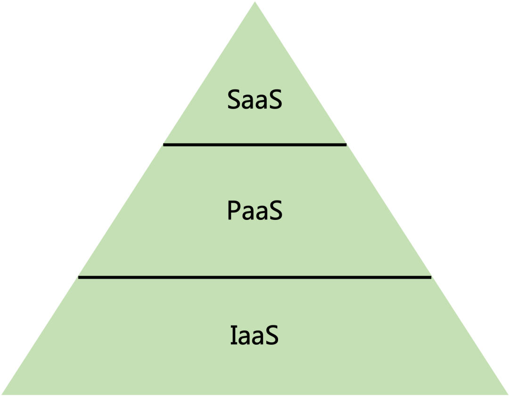

通常云计算会将建设在云上的服务分成3层，其中IaaS表示的是[基础设施即服务](https://zhida.zhihu.com/search?content_id=230514531&content_type=Article&match_order=1&q=%E5%9F%BA%E7%A1%80%E8%AE%BE%E6%96%BD%E5%8D%B3%E6%9C%8D%E5%8A%A1&zhida_source=entity)，PaaS表示的是平台即服务，SaaS表示的是软件即服务。一般来说，[IaaS层](https://zhida.zhihu.com/search?content_id=230514531&content_type=Article&match_order=1&q=IaaS%E5%B1%82&zhida_source=entity)主要包含了算力和存储部分；[PaaS层](https://zhida.zhihu.com/search?content_id=230514531&content_type=Article&match_order=1&q=PaaS%E5%B1%82&zhida_source=entity)包含了开发部署整个生命周期所需要的工具、解决方案；[SaaS层](https://zhida.zhihu.com/search?content_id=230514531&content_type=Article&match_order=1&q=SaaS%E5%B1%82&zhida_source=entity)则是直接面向用户的软件。

**拿做菜类比，IaaS相当于给食材，PaaS相当于给了个半成品，SaaS则是做好了菜。**

关于IaaS/PaaS/SaaS的详细解释可以看以下两个链接：

[https://www.zhihu.com/question/20387284](https://www.zhihu.com/question/20387284)

[https://www.zhihu.com/question/21641778](https://www.zhihu.com/question/21641778)

### MaaS

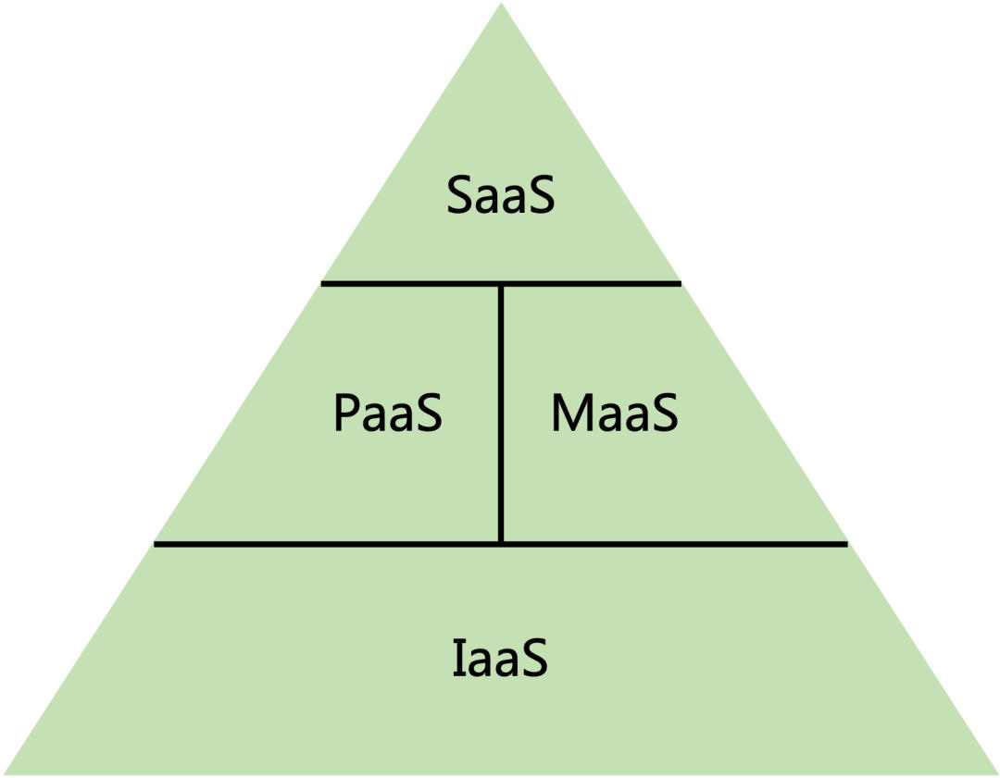

随着生成式AI(或者说Foundation Models)的火爆，云计算领域逐渐出现了MaaS(**Model as a Service**)的服务形态，模型即服务。

**MaaS意味着大模型可以使得服务变得更加扁平直接，从IaaS->PaaS->SaaS的传递路径更短更便捷。**

MaaS层的产生主要有两个来源：

1.  一部分是PaaS层的转移
2.  另一部分是MaaS层自己产生的增量市场

其中PaaS和MaaS可以认为是并列的层，也可以认为MaaS是介于PaaS和SaaS之间的。为了方便直观的阐述，本文暂且认为是并列的。

随着时间的推移，MaaS层的Foundation Models能力会越来越强，PaaS层会持续不断的往MaaS层迁移，MaaS会越来越厚，PaaS则会越来越薄。这个过程实际上是对于PaaS层的整体加速，PaaS层慢，MaaS层快，MaaS层可以更好更快的为SaaS层服务。生成式AI的LLM和AIGC领域都有类似的形态出现。

### AI Infra/XOps

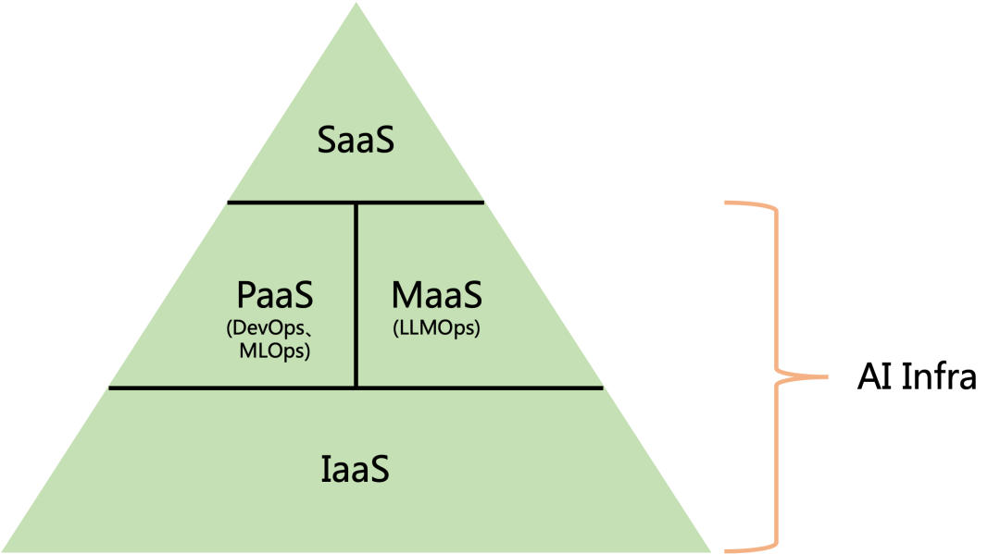

IaaS/PaaS/SaaS/MaaS指的是云给用户所提供的服务类型。而从云计算的建设上来讲，实际上搭建的是AI Infra(AI基础设施)。我理解的AI Infra应该包含IaaS/PaaS/MaaS这几层，SaaS层通常直接给用户提供软件服务，不包含在AI Infra的概念里面。

\*\*AI Infra涵盖一切跟开发部署相关的工具和流程。\*\*随着云计算的不断发展，又逐渐衍生出了DataOps、ModelOps、DevOps、MLOps、LLMOps等一些XOps的概念。\*\*从宏观的角度来看，所有XOps本质上是为了开发部署生命周期的提效。\*\*比如DataOps是为IaaS层的存储和PaaS层的数据处理提效的，DevOps、MLOps实际上是为PaaS层开发部署提效的，LLMOps是为MaaS层提效的。

XOps的不断发展，进而逐渐衍生出各种各样的工具、框架，XOps之间一部分工具是复用的。下面是目前[AI Infra](https://zhida.zhihu.com/search?content_id=230514531&content_type=Article&match_order=8&q=AI+Infra&zhida_source=entity)的全景图，实际上还只是冰山一角。

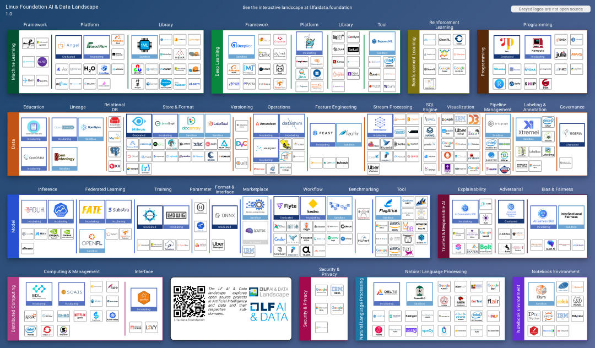

AI Infra全景图：[https://landscape.lfai.foundation/](https://link.zhihu.com/?target=https%3A//landscape.lfai.foundation/)

下文重点从DevOps -> MLOps -> LLMOps阐述AI Infra是如何发展演变的，以及MLOps和LLMOps生态下诞生了哪些有潜力的工具以及公司。

DevOps
------

这部分主要参考了[https://www.youtube.com/watch?v=0yWAtQ6wYNM&t=10s](https://link.zhihu.com/?target=https%3A//www.youtube.com/watch%3Fv%3D0yWAtQ6wYNM%26t%3D10s)

用以下例子来说明DevOps(**Dev**elopment **Op**eration**s**)的由来。

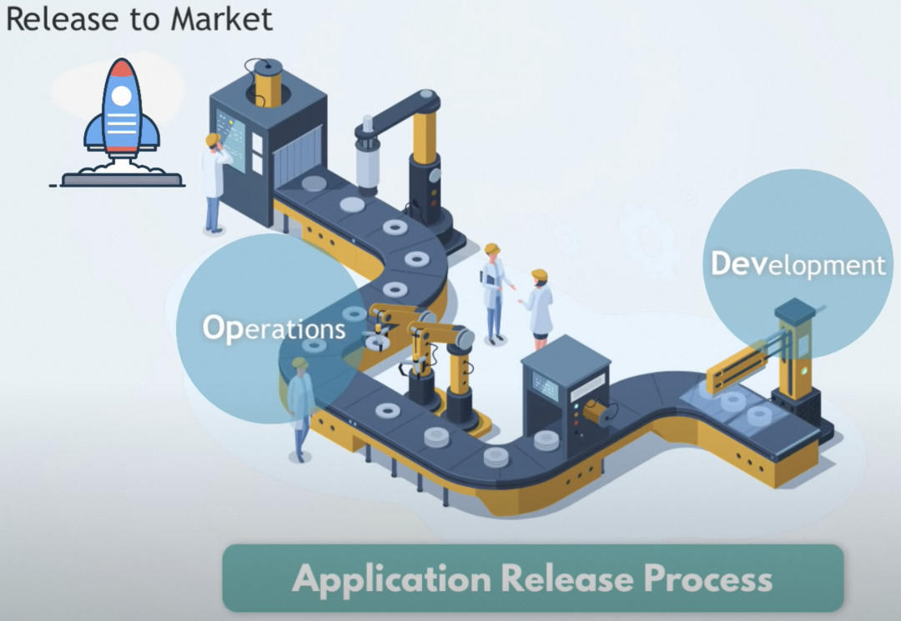

从应用开发的流程来看，主要由Development和Operations两个步骤组成。其中Development负责应用的开发，而Operations负责维护应用的稳定性。

典型的[软件开发流程](https://zhida.zhihu.com/search?content_id=230514531&content_type=Article&match_order=1&q=%E8%BD%AF%E4%BB%B6%E5%BC%80%E5%8F%91%E6%B5%81%E7%A8%8B&zhida_source=entity)如上图所示，先是有一个Idea，拆解成Requirements，编写成代码，再测试，然后进行打包，部署到需要的环境中，最后监控维护该软件。

这个流程会随着需求的变化而不断的重新再来一遍，比如新增features，比如需要修复bug，都需要优化最终的性能。

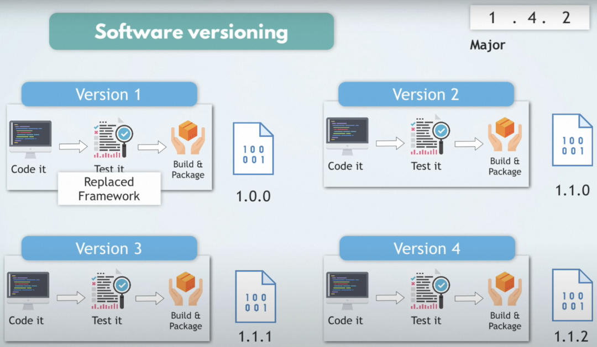

不断优化软件的过程中，会产生各种版本的代码。

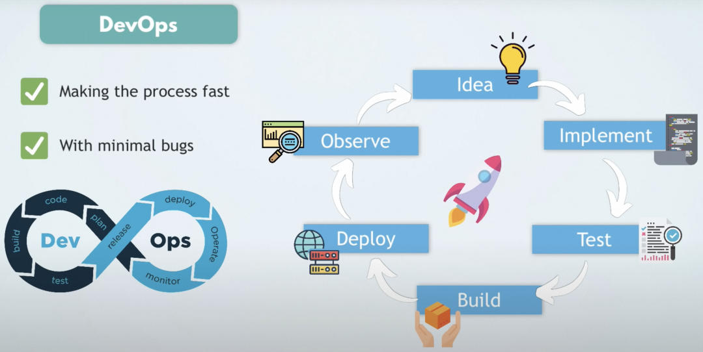

**DevOps(Dev**elopment **Op**eration\*\*s)\*\*可以加速软件的开发流程，减少软件的bugs，让软件开发流程标准化。

软件开发流程中，有5个问题会降低开发部署的效率，分别架设在上面流程的5个环节中：

1.  Miscommunications
2.  Conflict of Interest
3.  Security
4.  Application Testing
5.  Manual Work

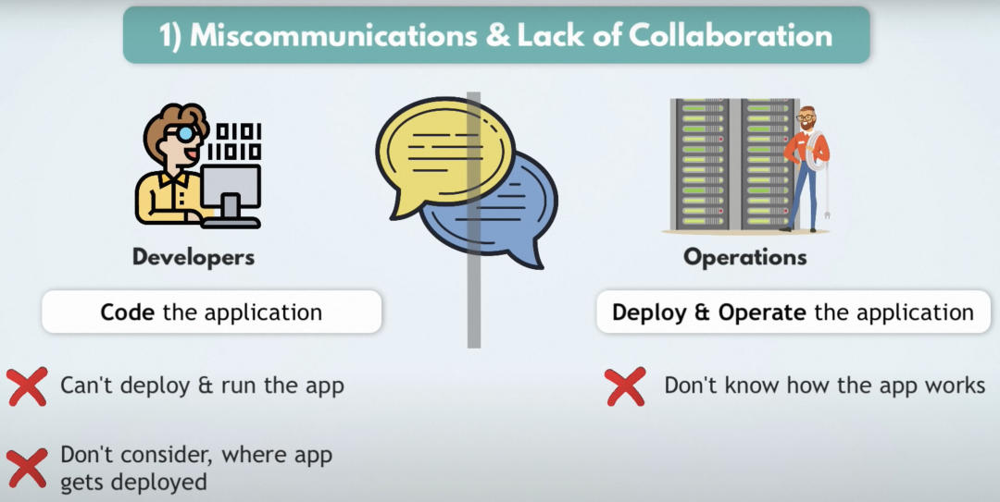

Miscommuncations&Lack of Collaboration是由于Developers不知道部署环境是怎样的，以及如何运行app，Operation不知道app如何才能正常工作。

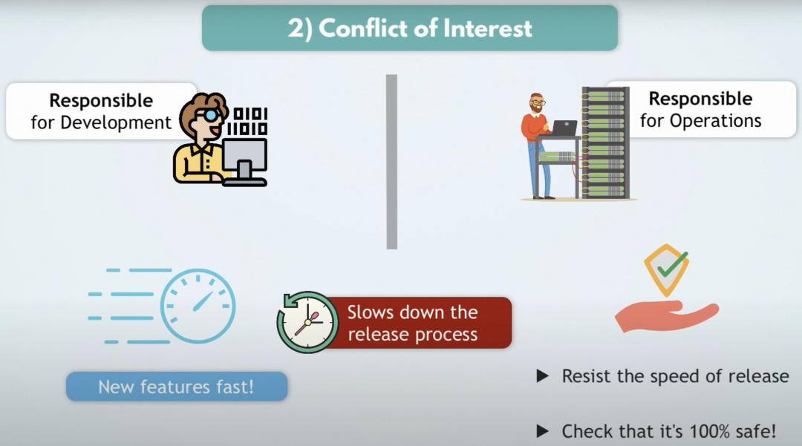

Conflict of Interest是由于Developers和Operations的目标不一致，Developers希望新features快速上线，而Operations希望确保软件稳定的工作。

缺乏Security是由于软件可能会影响系统的稳定性以及影响系统的安全性。

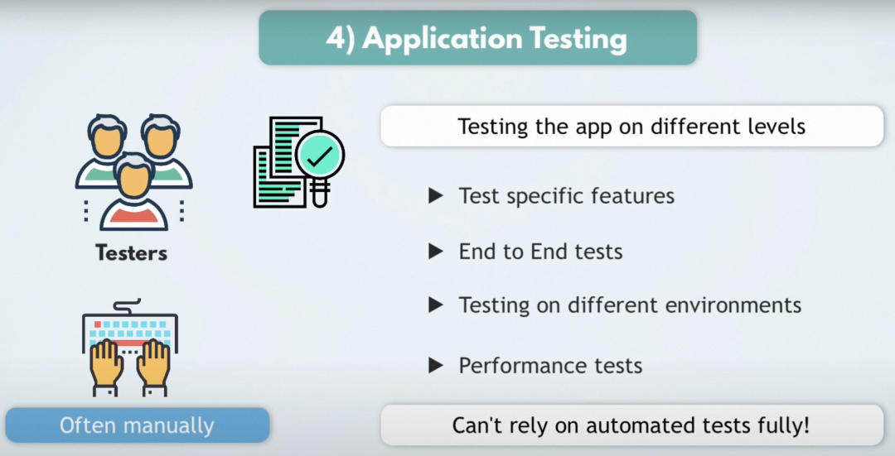

增加Application Testing可以确保软件的正确性，并且可以快速测试验证。

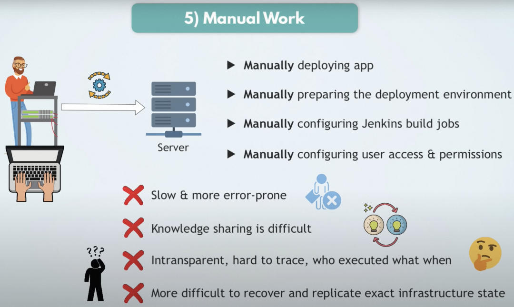

Manual Work导致容易出错，流程共享是困难的，并且难以跟踪。

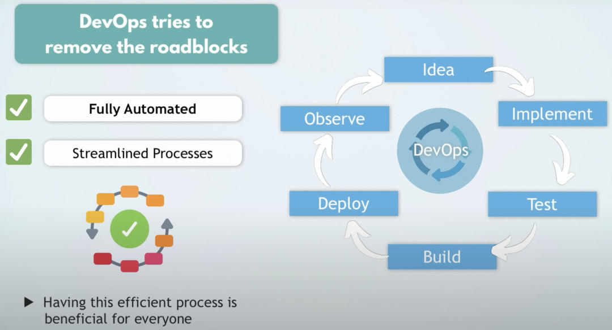

DevOps可以确保整个流程是全自动化的，并且是简化流程的。

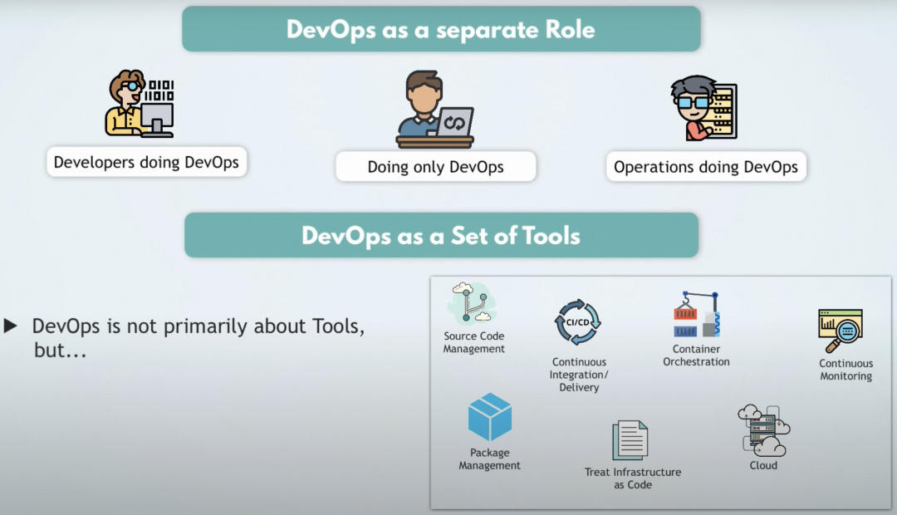

DevOps是Developers和Operations的桥梁，制定了开发部署的标准化流程，在DevOps的开发流程中产生了各种各样实用的工具，比如针对[源代码](https://zhida.zhihu.com/search?content_id=230514531&content_type=Article&match_order=1&q=%E6%BA%90%E4%BB%A3%E7%A0%81&zhida_source=entity)的管理、CI/CD、容器管理、持续监控、[软件包](https://zhida.zhihu.com/search?content_id=230514531&content_type=Article&match_order=1&q=%E8%BD%AF%E4%BB%B6%E5%8C%85&zhida_source=entity)管理等等。

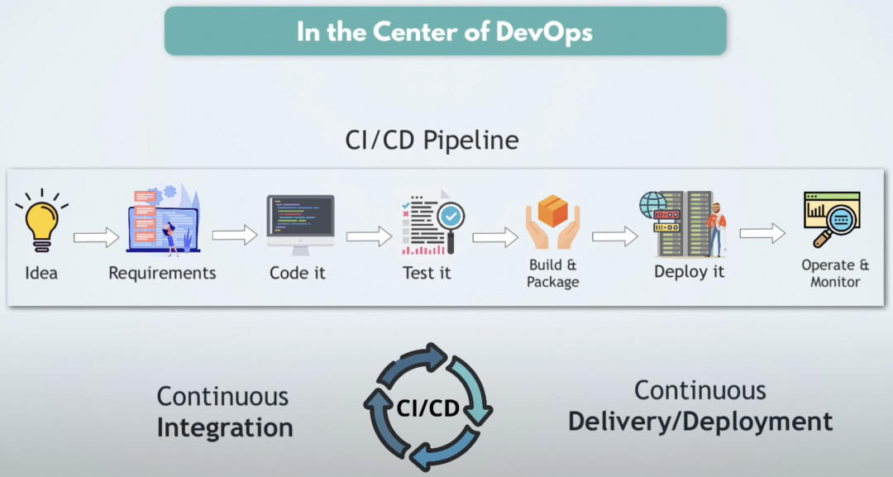

DevOps的核心是CI/CD Pipeline，可以持续不断的集成，持续不断的部署。

DevOps的提出和发展，意味着开发部署的流程逐渐标准化，搭建在DevOps之上的平台会更稳定高效。

DevOps相关资料：

[https://www.databricks.com/blog/2021/09/20/part-1-implementing-ci-cd-on-databricks-using-databricks-notebooks-and-azure-devops.html](https://link.zhihu.com/?target=https%3A//www.databricks.com/blog/2021/09/20/part-1-implementing-ci-cd-on-databricks-using-databricks-notebooks-and-azure-devops.html)

[https://www.databricks.com/blog/2022/01/05/implementing-mlops-on-databricks-using-databricks-notebooks-and-azure-devops-part-2.html](https://link.zhihu.com/?target=https%3A//www.databricks.com/blog/2022/01/05/implementing-mlops-on-databricks-using-databricks-notebooks-and-azure-devops-part-2.html)

[https://azure.microsoft.com/en-us/blog/introducing-azure-devops/](https://link.zhihu.com/?target=https%3A//azure.microsoft.com/en-us/blog/introducing-azure-devops/)

[https://www.youtube.com/watch?v=Xrgk023l4lI&t=215s](https://link.zhihu.com/?target=https%3A//www.youtube.com/watch%3Fv%3DXrgk023l4lI%26t%3D215s)

[https://www.youtube.com/watch?v=0yWAtQ6wYNM](https://link.zhihu.com/?target=https%3A//www.youtube.com/watch%3Fv%3D0yWAtQ6wYNM)

[https://www.youtube.com/watch?v=4BibQ69MD8c&t=1469s](https://link.zhihu.com/?target=https%3A//www.youtube.com/watch%3Fv%3D4BibQ69MD8c%26t%3D1469s)

[https://www.youtube.com/@TechWorldwithNana](https://link.zhihu.com/?target=https%3A//www.youtube.com/%40TechWorldwithNana)

MLOps
-----

这部分主要参考了[https://www.youtube.com/watch?v=JApPzAnbfPI](https://link.zhihu.com/?target=https%3A//www.youtube.com/watch%3Fv%3DJApPzAnbfPI)

**MLOps(M**echine **L**earning **Op**eration\*\*s)\*\*诞生于机器学习领域蓬勃发展的背景之下，因为ML模型需要数据、需要训练、需要评估，这对于对于模型开发部署来说，产生了一些新的需求。

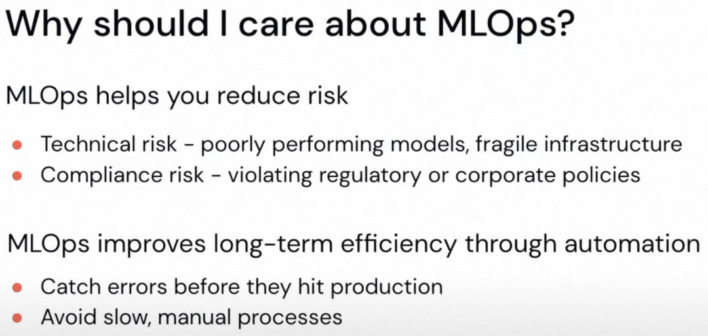

MLOps可以帮助降低风险，也可以帮助长期有效的自动化开发部署模型。

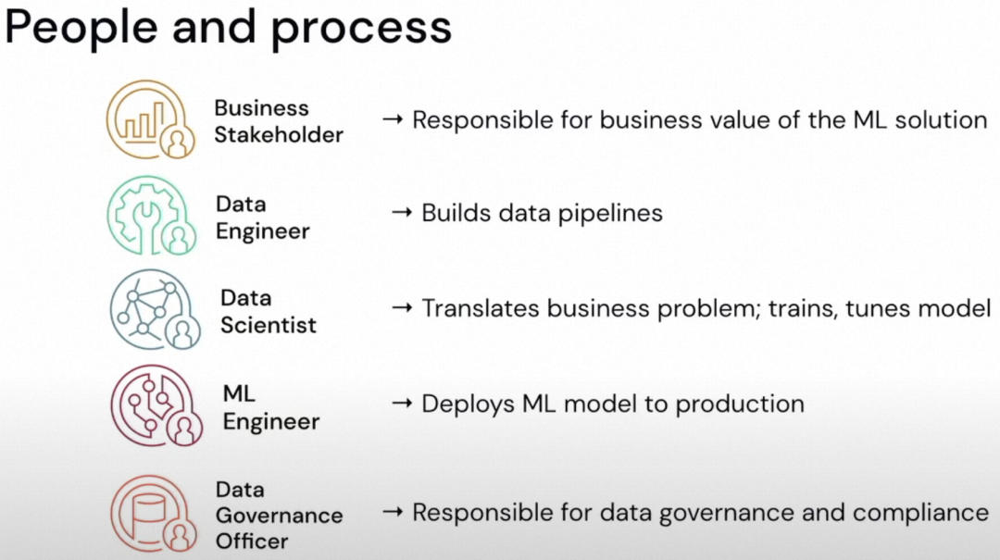

机器学习模型的开发部署可能会设计到以上5类人员：Business Stakeholder、Data Engineer、Data Scientist、ML Engineer和Data Governance Officer。Business Stakeholder负责ML解决方案可靠的商业价值；Data Engineer负责数据流程的构建；Data Scientist负责拆解商业问题并且训练微调模型；ML Engineer负责将ML模型部署到生产环境；Data Governance Officer负责数据治理和合规性。

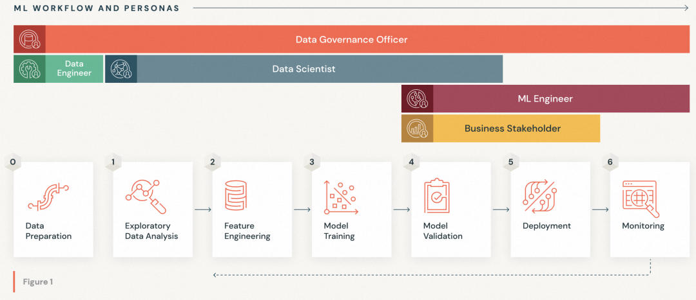

ML的整个WorkFlow可以粗略划分为Data Preparation、Exploratory Data Analysis、Feature ENgineering、Model Training、Model Validation、Deployment和Monitoring总共7个部分，上述的5类人员会涉及到其中的一部分流程，比如Data Governance Officer会涉及到0-6的流程，Data Scientist会涉及到1-4的流程，Data Engineer会涉及到0的流程，ML Engineer会涉及到4-6的流程，Business Stakeholder会涉及到4-5的流程。

databricks认为MLOps=DevOps + DataOps + ModelOps。其中DevOps可以由GitHub、GitLab、Azure DevOps等工具来提供；DataOps由databricks自己的Delta Lake数据库产品提供；ModelOps由databricks的MLflow开源工具提供。

### MLOps的三个阶段

ML的整个WorkFlow中主要有三类资产：Code、Data、Models。并且这三类资产会在Developed、Tested、Deployed3个流程中被使用。databricks称这3个流程为dev、staging、prod，分别对应的是开发阶段、测试阶段和生产阶段。

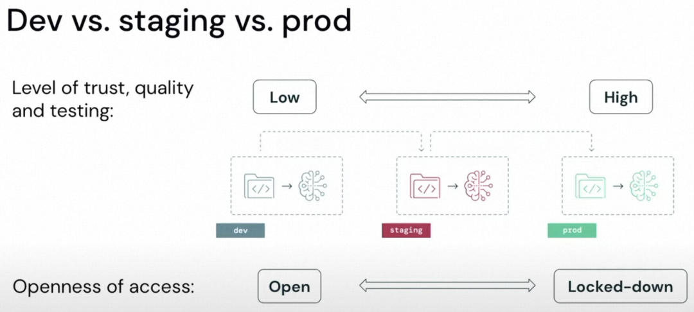

从dev -> staging -> prod，模型的可靠性和质量都不断提升，开放程度越来越低，这个很好理解，到生产阶段，模型的环境和稳定性都越来越好。

dev、staging、prod三个阶段的环境划分有三种方式：第一种是放在3个云账号上；第二种是放在一个云账号的3个工作空间里；第三种是放在一个云账号的一个工作空间里，通过访问权限对3个阶段进行隔离。一般情况下推荐第二种方式。

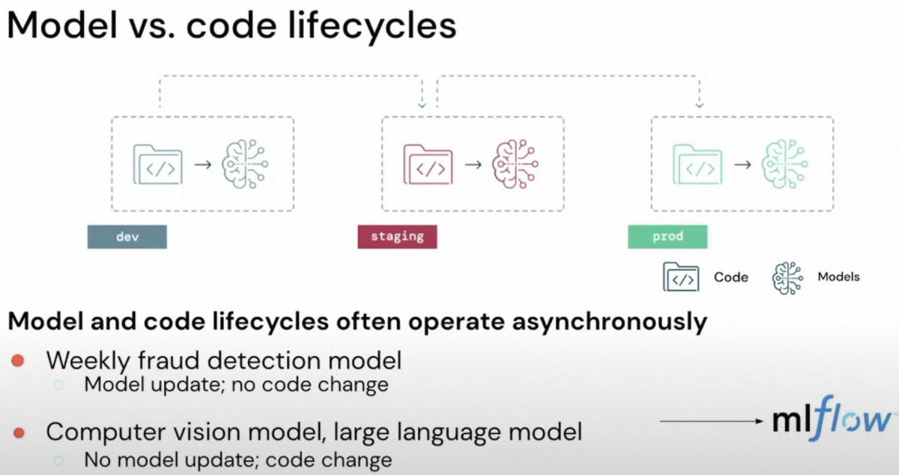

在ML的整个WorkFlow里，Model和Code的生命周期往往是异步的。比如在欺诈检测模型中，往往是模型经常更新，代码不更新；而在计算机视觉或者[大语言模型](https://zhida.zhihu.com/search?content_id=230514531&content_type=Article&match_order=1&q=%E5%A4%A7%E8%AF%AD%E8%A8%80%E6%A8%A1%E5%9E%8B&zhida_source=entity)中，往往是模型不更新，代码更新。这就需要涉及到独立于代码的ML生命周期的管理，databricks为此写了一个MLflow的开源工具。

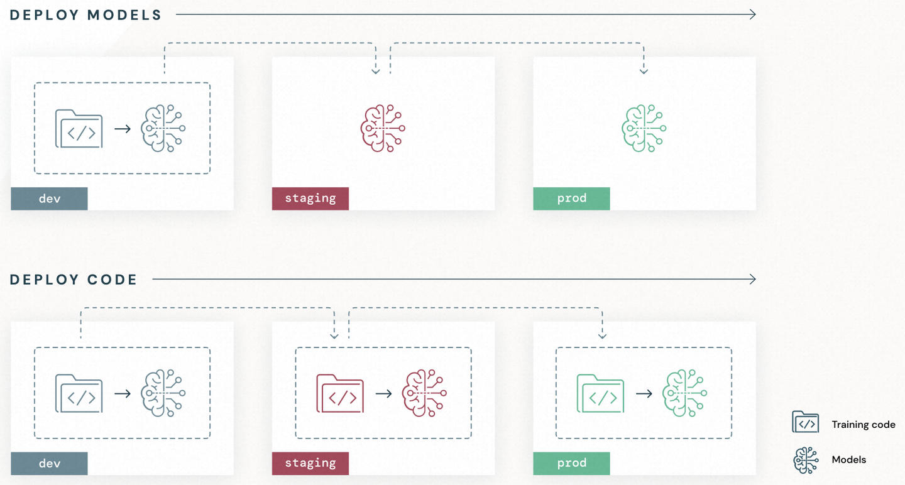

ML有两种部署模式，一种是部署模型，另一种是[部署代码](https://zhida.zhihu.com/search?content_id=230514531&content_type=Article&match_order=1&q=%E9%83%A8%E7%BD%B2%E4%BB%A3%E7%A0%81&zhida_source=entity)。部署代码意味着需要在3个阶段分别训练模型。

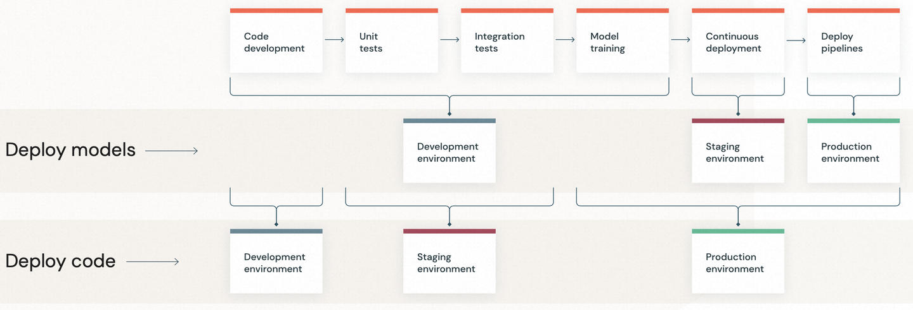

从生命周期来看，部署模型的dev阶段包含了Code development、Unit tests、Integration tests和Model training，staging阶段包含了Continuous deployment，prod阶段包含了Deploy pipelines；而部署代码的dev阶段包含了Code development，staging阶段包含了Unit tests和Integration tests，prod阶段包含了Model training、Continuous deployment和Deploy pipelines。

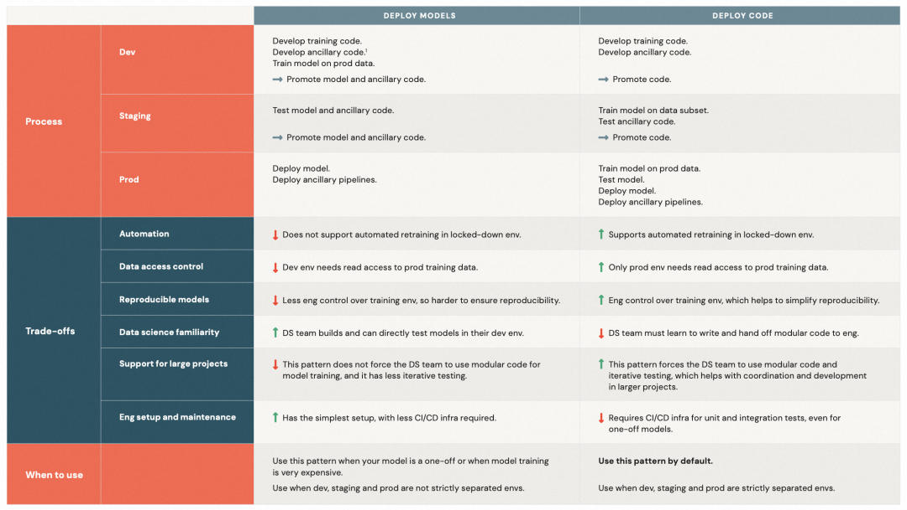

部署模型和部署代码两种方式的优劣都展示在上图。一般情况下，部署模型用在模型只需要一次性训练的情况下，dev/staging/prod 3个阶段的环境不需要严格分开；默认使用部署代码的方式，并且dev/staging/prod 3个阶段的环境需要严格分开。

### MLOps Overview

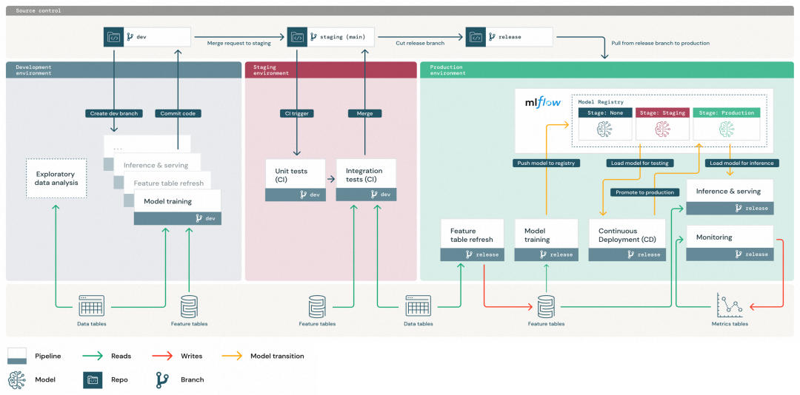

上图是一个部署代码的例子。最上面灰色部分是3个阶段的分支，最下面灰色部分是数据以及数据库的部分，左边蓝灰色块是dev阶段，中间红色块是staging阶段，右边绿色块是prod阶段。并且dev/staging/prod 3个阶段产生的模型、超参数、评估、log等等都通过mlflow保存。

下面分别展示一下dev/staging/prod 3个阶段的详细展开图。

**Dev**

**Staging**

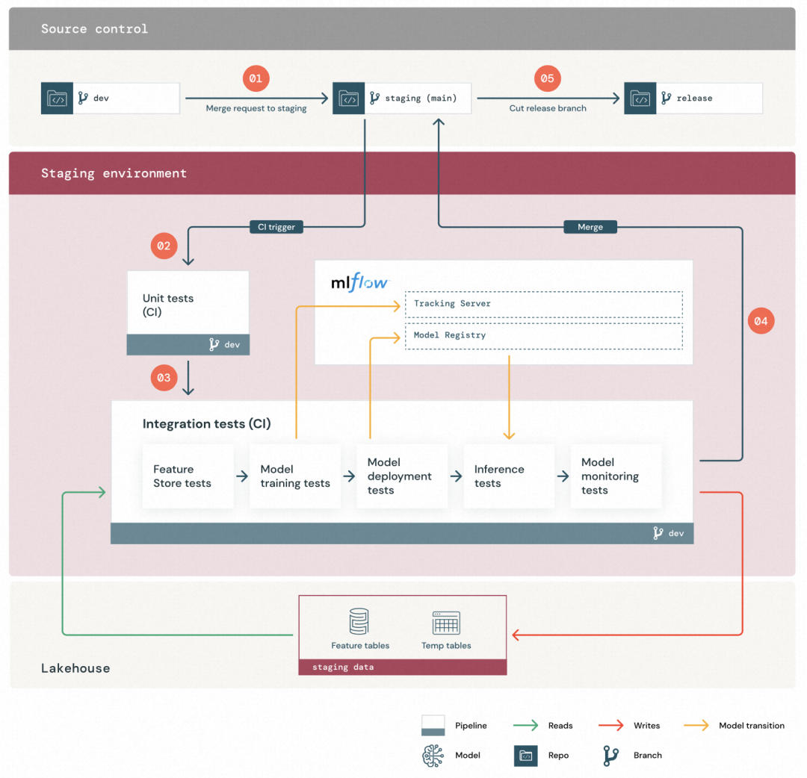

**Prod**

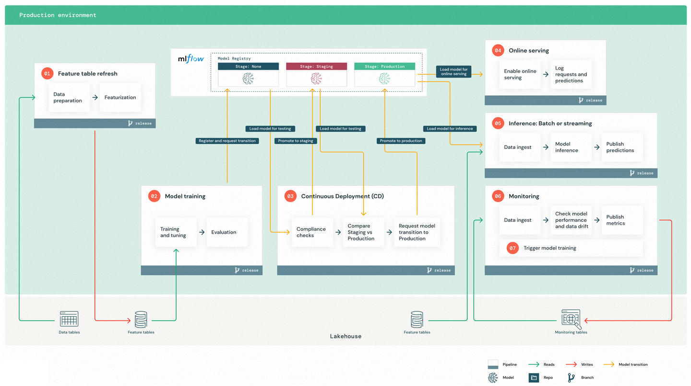

### Projects Structure

下面从项目结构理解MLOps。

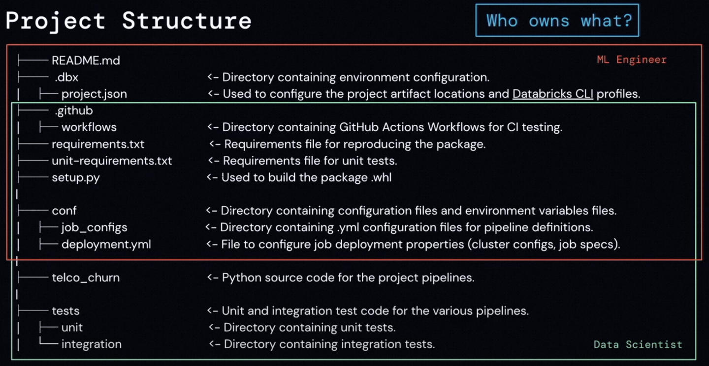

整个Project包含MLOps整个生命周期需要的所有文件，核心算法包在telco\_churn文件夹中。其中红色框是ML Engineer需要使用的文件，绿色框是Data Scientist需要使用的文件。

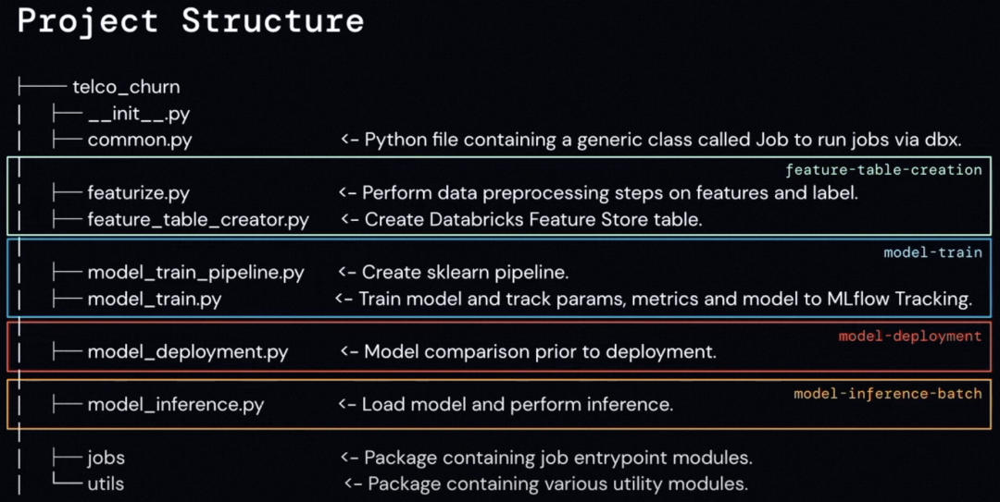

telco\_churn算法文件夹中包含了feature-table-creation、model-train、model-deployment、model-inference-batch部分。

最后我用Google MLOps[白皮书](https://zhida.zhihu.com/search?content_id=230514531&content_type=Article&match_order=1&q=%E7%99%BD%E7%9A%AE%E4%B9%A6&zhida_source=entity)中的示意图做个总结：

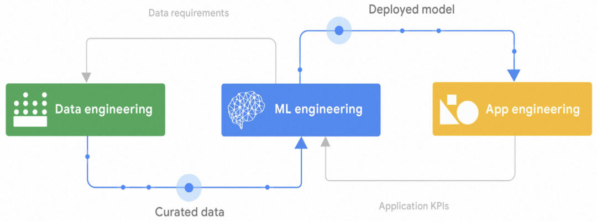

实际上MLOps要做的就是Data engineering、ML engineering、App engineering 3件事情。

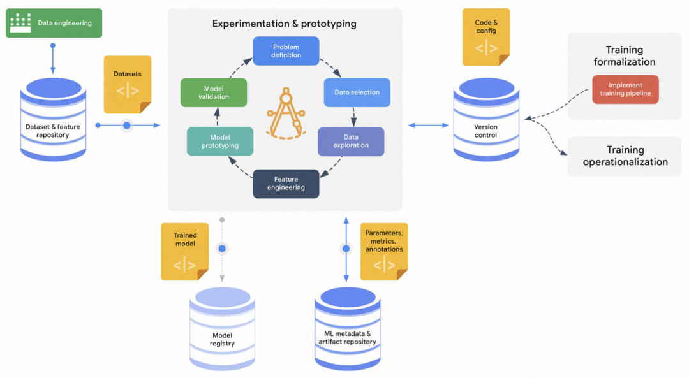

**MLOps整个生命周期的实验和原型设计都在中间的圆环中，MLOps整个生命周期需要用到的文件以及需要保存的文件都通过蓝色的容器进行保存，然后通过黄色的**[脚本文件](https://zhida.zhihu.com/search?content_id=230514531&content_type=Article&match_order=1&q=%E8%84%9A%E6%9C%AC%E6%96%87%E4%BB%B6&zhida_source=entity)**进行调用。**

### MLOps工具/公司

MLOps所产生的开源工具可以查看链接：

[https://github.com/ml-tooling/best-of-ml-python](https://link.zhihu.com/?target=https%3A//github.com/ml-tooling/best-of-ml-python)

[https://github.com/ml-tooling/best-of-python](https://link.zhihu.com/?target=https%3A//github.com/ml-tooling/best-of-python)

[https://github.com/ml-tooling/best-of-web-python](https://link.zhihu.com/?target=https%3A//github.com/ml-tooling/best-of-web-python)

[https://github.com/ml-tooling/best-of-python-dev](https://link.zhihu.com/?target=https%3A//github.com/ml-tooling/best-of-python-dev)

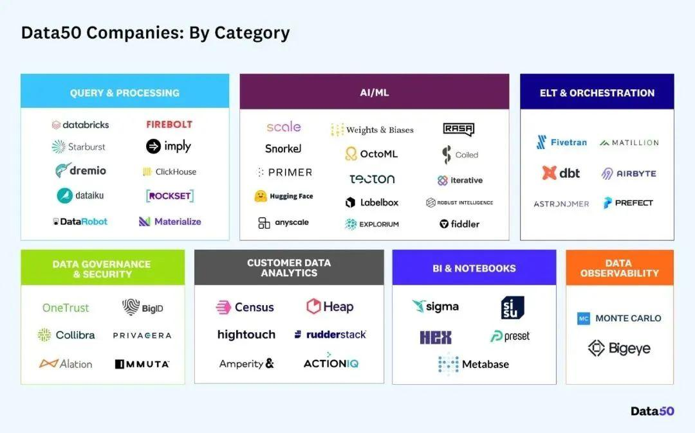

2022 年 3 月 23 日，[a16z](https://link.zhihu.com/?target=http%3A//mp.weixin.qq.com/s%3F__biz%3DMzg2OTY0MDk0NQ%3D%3D%26mid%3D2247489514%26idx%3D1%26sn%3D4cacb14e7cc49fd5c73a3eee0c82b9ab%26chksm%3Dce98a874f9ef2162a1d439e615c53ceaa15ecf877a427402418ed6ec8aabd32288ee16ac5f09%26scene%3D21%23wechat_redirect) 发布 Data 50 榜单，介绍了全球 50 家代表下一代行业标准的数据初创企业，覆盖 7 个子领域：

*   **数据查询与数据处理（Query & Processing）**
*   **人工智能与机器学习（AI / ML）**
*   **ELT 与编排（ELT & Orchestration）**
*   **数据治理与安全（Data governance & Security）**
*   **客户数据分析（Customer data analytics）**
*   **商业智能与演算本（BI & Notesbooks）**
*   **数据**[可观测性](https://zhida.zhihu.com/search?content_id=230514531&content_type=Article&match_order=1&q=%E5%8F%AF%E8%A7%82%E6%B5%8B%E6%80%A7&zhida_source=entity)**（Data Observability）**

具体信息可以查看链接：[https://mp.weixin.qq.com/s/nLbf0rNokB-RiZQpDzgO1w](https://link.zhihu.com/?target=https%3A//mp.weixin.qq.com/s%3F__biz%3DMzg2OTY0MDk0NQ%3D%3D%26mid%3D2247491253%26idx%3D1%26sn%3D2dd59984eaea6eccf29e39a12b779c12%26scene%3D21%23wechat_redirect)

databricks的MLOps相关资料：

[https://www.youtube.com/watch?v=JApPzAnbfPI](https://link.zhihu.com/?target=https%3A//www.youtube.com/watch%3Fv%3DJApPzAnbfPI)

[https://www.databricks.com/blog/2022/06/22/architecting-mlops-on-the-lakehouse.html](https://link.zhihu.com/?target=https%3A//www.databricks.com/blog/2022/06/22/architecting-mlops-on-the-lakehouse.html)

[https://www.databricks.com/resources/ebook/the-big-book-of-mlops](https://link.zhihu.com/?target=https%3A//www.databricks.com/resources/ebook/the-big-book-of-mlops)

[https://github.com/niall-turbitt/e2e-mlops](https://link.zhihu.com/?target=https%3A//github.com/niall-turbitt/e2e-mlops)

Google的MLOps相关资料：

[https://www.youtube.com/watch?v=6gdrwFMaEZ0#action=share](https://link.zhihu.com/?target=https%3A//www.youtube.com/watch%3Fv%3D6gdrwFMaEZ0%23action%3Dshare)

[https://cloud.google.com/architecture/mlops-continuous-delivery-and-automation-pipelines-in-machine-learning?hl=zh-cn](https://link.zhihu.com/?target=https%3A//cloud.google.com/architecture/mlops-continuous-delivery-and-automation-pipelines-in-machine-learning%3Fhl%3Dzh-cn)

MLOps相关资料：

[https://www.youtube.com/watch?v=ZVWg18AXXuE](https://link.zhihu.com/?target=https%3A//www.youtube.com/watch%3Fv%3DZVWg18AXXuE)

[https://www.youtube.com/watch?v=LdLFJUlPa4Y](https://link.zhihu.com/?target=https%3A//www.youtube.com/watch%3Fv%3DLdLFJUlPa4Y)

[https://madewithml.com/](https://link.zhihu.com/?target=https%3A//madewithml.com/)

[https://stanford-cs329s.github.io/syllabus.html](https://link.zhihu.com/?target=https%3A//stanford-cs329s.github.io/syllabus.html)

LLMOps
------

这部分主要参考了

[https://www.youtube.com/watch?v=Fquj2u7ay40&list=PL1T8fO7ArWleyIqOy37OVXsP4hFXymdOZ](https://link.zhihu.com/?target=https%3A//www.youtube.com/watch%3Fv%3DFquj2u7ay40%26list%3DPL1T8fO7ArWleyIqOy37OVXsP4hFXymdOZ)

[https://zhuanlan.zhihu.com/p/629589593](https://zhuanlan.zhihu.com/p/629589593)

**LLMOps(L**arge **L**anguage **M**odel **Op**eration\*\*s)\*\*实际上是随着LLM、AIGC等Foundation Models的爆发而逐渐兴起的，**LLMOps从形态上可以分成两类：一类是以Adapter为代表的训练微调，另一类是以Prompt Engineering为代表的复杂应用开发**。下文以LLM为例，阐述LLMOps有哪些新的需求产生。

### 选择base model

从几个维度来考虑选择哪个模型，包括**模型的效果，推理速度，价格开销，能否微调，数据安全，许可协议**等。

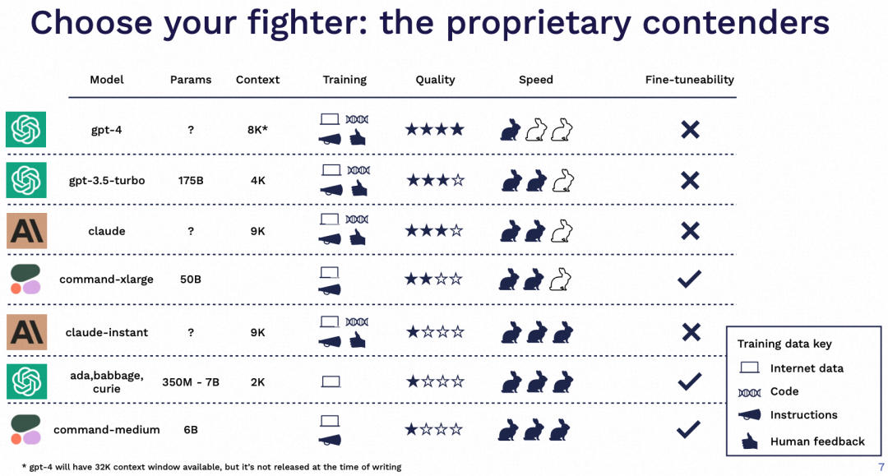

就 23 年 5 月这个时间节点来说，对于私有模型的建议：

*   绝大多数情况都可以直接选择 GPT-4 作为尝试的开始。后续如果有成本和速度的考量可以再切换到 GPT-3.5。
*   Claude 也是个不错的选择，无论是模型效果还是训练的完善程度上，再加上现在支持了超大的 context size，赶忙去申请了 wait-list。
*   如果需要做 fine tune，也可以考虑 Cohere 的 command 系列。

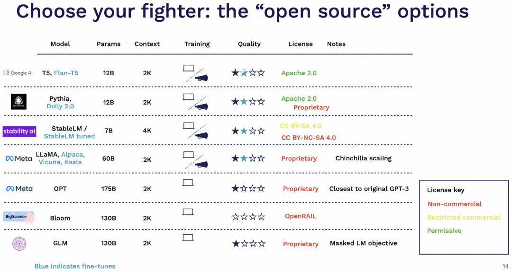

开源模型这块发展很快，最近几周都有新模型出来。这块的许可协议也很复杂，例如有些模型的不同版本因为用了特殊的数据就导致无法作为商业用途。在讲座的时间节点，作者的几个推荐是：

*   如果希望完全开放的使用，T5/Flan-T5 是个不错的选择，效果也还行。
*   开源可商用这块可以考虑最近的 Dolly，StableLM。
*   如果用于研究用途，LLaMA 系列是目前比较主流的。如果对于 2020 年的 [GPT-3](https://zhida.zhihu.com/search?content_id=230514531&content_type=Article&match_order=2&q=GPT-3&zhida_source=entity) 复现与实验感兴趣，可以用 OPT。
*   其它基本不太用考虑，包括表上的 Bloom 和 GLM。不过这个表的更新迭代速度应该会很快。

### Prompt管理

传统深度学习里对于实验追踪与记录有着非常完善的支持，但目前的 prompt 开发与迭代还在很早期的阶段，主要还是因为不同 prompt 产生的效果并不好自动化评估。

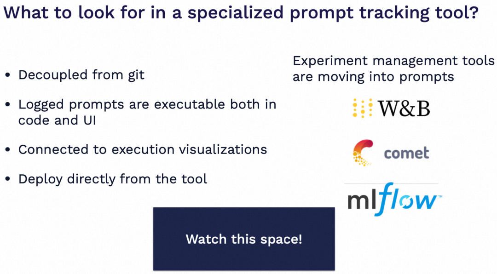

因此现阶段比较常见的做法就是通过 git 来管理 prompt 版本。如果有更复杂的需求，例如希望把 prompt 的应用逻辑解耦，或者引入业务人员来优化 prompt，以及通过单独的产品工具来快速评估管理不同的 prompt 甚至模型接口，那么就需要引入更加复杂的产品。这方面可以持续关注之前的 experiment tracking 产品，包括 WandB，MLFlow 等。

### LLM评估

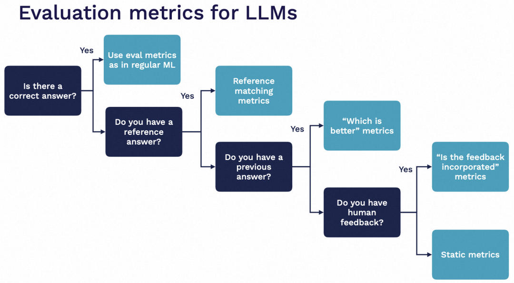

LLM 的能力非常强大，能处理各种任务，这对其评估造成了很大的困难，比如我们很难判断一篇总结是否比另外一篇总结写得更好。对于不同的 prompt，模型甚至 fine tune 的效果，如何进行快速，低成本且准确的评估是一个大问题。目前的常见做法是：

*   构建一个针对你所需要完成任务的评估数据集，一开始可以完全人工生成，后续逐渐完善。
*   除了通过人工检验的方式，也可以**借助 LLM 来做评估**。可以参考 auto-evaluator 项目。
*   在添加新的评估数据时，需要考虑这条样本带来的“额外价值”，比如是否是一个比较困难的问题，以及与已有评估数据是不是非常不一样。
*   思考“AI 测试覆盖率”，你收集的评估数据集能多大程度上覆盖生产环境的所有情况？

通过 LLM 来做评估的具体方法包括：

*   如果有完全精确的答案判定，可以用传统指标，不需要借助 LLM。
*   如果你有标准答案，可以测试[语义相似度](https://zhida.zhihu.com/search?content_id=230514531&content_type=Article&match_order=1&q=%E8%AF%AD%E4%B9%89%E7%9B%B8%E4%BC%BC%E5%BA%A6&zhida_source=entity)，或者询问 LLM：两个回答是否一致？
*   如果有上一个版本的回答，可以询问 LLM：哪一个回答更好？
*   如果有用户填写的反馈信息，可以询问 LLM：用户的反馈是否已经包含在回答中了？
*   其它情况，可以通过外部工具来检查是否是个合法的格式，或者让 LLM 给回答做个打分。

### [向量数据库](https://zhida.zhihu.com/search?content_id=230514531&content_type=Article&match_order=1&q=%E5%90%91%E9%87%8F%E6%95%B0%E6%8D%AE%E5%BA%93&zhida_source=entity)

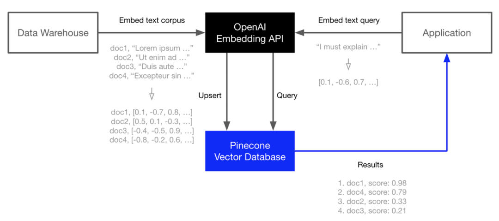

另一个随着LLM发展起来的热门领域是向量数据库。当前流行的LLM复杂应用通常以[embedding](https://zhida.zhihu.com/search?content_id=230514531&content_type=Article&match_order=1&q=embedding&zhida_source=entity)的形式从 LLM API 中提取信息（例如，电影摘要或产品描述），并在它们之上构建应用程序（例如，搜索、比较或推荐）。比如Pinecone、Weaviate或Milvus等向量数据库。

### PEFT

如果监控或者收集到上述问题的用户反馈，后续可以通过 prompt 优化或者 [fine tune](https://zhida.zhihu.com/search?content_id=230514531&content_type=Article&match_order=3&q=fine+tune&zhida_source=entity) 的手段来持续改进。一般来说**优先选择前者**，尤其是当前开源模型，fine tune 技术都没有那么成熟的情况下。以下两种情况需要针对性fine tune：

*   你需要节省成本，比如用更小的模型，不想每次都带一大段 prompt 之类。
*   你有大量的数据，且 [retrieval](https://zhida.zhihu.com/search?content_id=230514531&content_type=Article&match_order=1&q=retrieval&zhida_source=entity) 的方法表现不够理想。

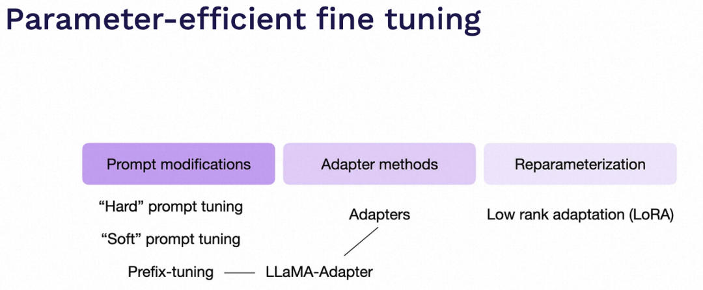

另外随着Foundation Models的兴起，现在的LLM或者AIGC领域的训练逐渐转向了PEFT(Parameter-efficient fine tuning)，也就是通常所说的Adapter的训练方式，这种训练方式下，需要更少的数据量已经更小的显存占用，可以在[消费级显卡](https://zhida.zhihu.com/search?content_id=230514531&content_type=Article&match_order=1&q=%E6%B6%88%E8%B4%B9%E7%BA%A7%E6%98%BE%E5%8D%A1&zhida_source=entity)上训练大模型，这对于用户快速开发部署模型来说是非常诱人的。

### LLMOps Overview

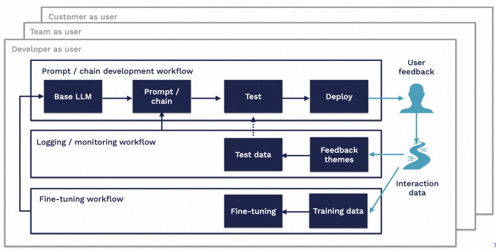

LLMOps可能的WorkFlow如上图所示。第一个链路在Base LLM的基础上通过Prompt来引导LLM，然后测试部署，通过用户反馈获取交互数据；第二个链路通过交互数据监控应用，通过迭代Prompt来提升应用的效果，如果效果始终不能达标，则进入第三个链路；第三个链路通过Adapter微调的方式提升模型精度，然后更新第一个链路的Base LLM。整个LLMOps由测试结果驱动。

LLMOps目前还处于很早期的阶段，相信随着技术的不断发展，搭建在Foundation Models之上的平台框架，开发部署的效率会逐渐提升。

### LLMOps工具/公司

LLM训练：[DeepSpeed](https://link.zhihu.com/?target=https%3A//github.com/microsoft/DeepSpeed)、[ColossalAI](https://link.zhihu.com/?target=https%3A//github.com/hpcaitech/ColossalAI)、[CodeTF](https://link.zhihu.com/?target=https%3A//github.com/salesforce/CodeTF)、[peft](https://link.zhihu.com/?target=https%3A//github.com/huggingface/peft)

DeepSpeed和ColossalAI是当前LLM分布式训练主流的框架，涵盖了大量分布式训练的方法，CodeTF针对[代码生成](https://zhida.zhihu.com/search?content_id=230514531&content_type=Article&match_order=1&q=%E4%BB%A3%E7%A0%81%E7%94%9F%E6%88%90&zhida_source=entity)的训练进行了针对性的设计。

peft主要聚焦在Adapter层微调大模型。

LLM应用：[LangChain](https://link.zhihu.com/?target=https%3A//github.com/hwchase17/langchain)、[Marvin](https://link.zhihu.com/?target=https%3A//github.com/PrefectHQ/marvin)、[AutoGPT](https://link.zhihu.com/?target=https%3A//github.com/Significant-Gravitas/Auto-GPT)、[openai-cookbook](https://link.zhihu.com/?target=https%3A//github.com/openai/openai-cookbook)、[guidance](https://link.zhihu.com/?target=https%3A//github.com/microsoft/guidance)

LangChain对ChatGPT、GPT-4等LLM模型构建了一层简单好用的模块，方便大家快速开发LLM应用。

Marvin通过LLM搭建了一个自然语言编程的框架，思维超前。

AutoGPT结合了LLM和ReAct的思想，构建了一个全自动化生产工具。

openai-cookbook提供了大量的ChatGPT、GPT-4的使用示例；guidance不局限于GPT模型，提供了大量的LLM应用示例。

AIGC领域还有[diffusers](https://link.zhihu.com/?target=https%3A//github.com/huggingface/diffusers) 专门针对文生图领域进行训练推理，[stable-diffusion-webui](https://link.zhihu.com/?target=https%3A//github.com/AUTOMATIC1111/stable-diffusion-webui)则通过gradio搭建了一个图像生成领域最大的应用市场，另外SAM生态下也出现了目前最大的demo仓库[Grounded-Segment-Anything](https://link.zhihu.com/?target=https%3A//github.com/IDEA-Research/Grounded-Segment-Anything)。

其他LLMOps所产生的开源工具可以查看链接：

[https://github.com/eugeneyan/open-llms](https://link.zhihu.com/?target=https%3A//github.com/eugeneyan/open-llms)

[https://github.com/Hannibal046/Awesome-LLM](https://link.zhihu.com/?target=https%3A//github.com/Hannibal046/Awesome-LLM)

[https://github.com/kyrolabs/awesome-langchain](https://link.zhihu.com/?target=https%3A//github.com/kyrolabs/awesome-langchain)

[https://github.com/shm007g/LLaMA-Cult-and-More](https://link.zhihu.com/?target=https%3A//github.com/shm007g/LLaMA-Cult-and-More)

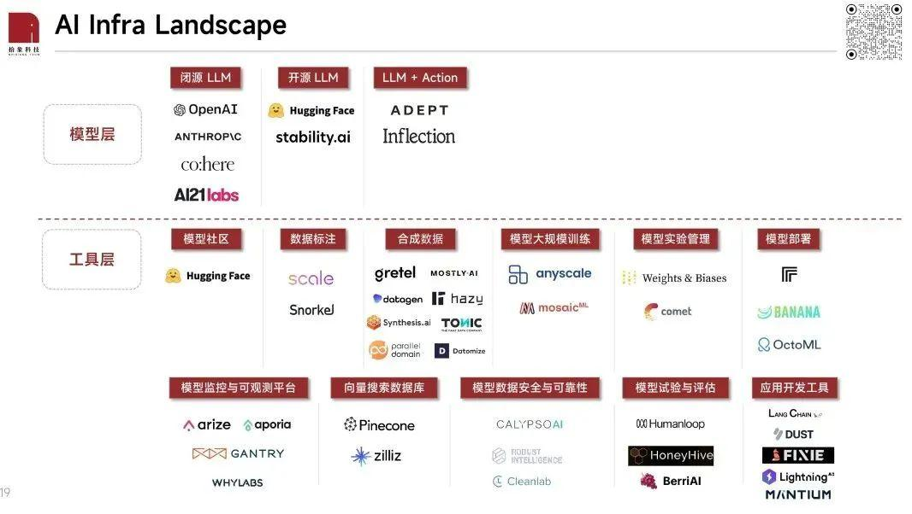

AI Infra 主要分为模型层和工具层：模型包括开源、闭源以及从模型到应用的端到端的公司；工具层主要围绕着模型训练和模型推理两大板块 mapping 了各个细分环节。

在现在这个时点，Infra 和应用层相比更稳定，并且不用特别担心底层模型能力大幅提升后受到冲击。模型的价值毋庸置疑，Infra 工具在未来 5 年内也会有爆发式的增长，**核心逻辑是大模型公司搞军备竞赛，卖武器的公司增长一定十分可观。**

在 AI Infra 领域，除 OpenAI 外，重点关注 Anthropic、Hugging Face，以及Weights&Biases 等。

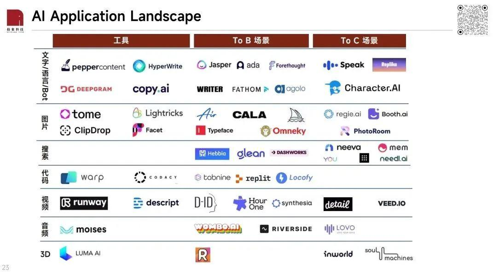

在对 AI 应用层进行 mapping 的过程中，我们看到现阶段的 AI 应用整体呈现出两大特点：

1.  To B 应用的数量远大于 To C 应用；
    
2.  General 工具的数量远大于落地到具体场景的应用的数量。
    

\*\*从功能看：技术最成熟、效果最好、公司数量也最多的是语言/文字和图片类应用，视频、音频、代码还需要一定时间，3D 似乎是更长远的事。\*\*语言/文字类应用包含：文字生成（e.g Jasper）、语音识别和语义理解（e.g Fathom）、文字摘要和文字总结（e.g Agolo）、聊天机器人（e.g Character.ai）等。图像生成和编辑的典型代表公司是 MidJourney、Typeface 等。

\*\*从场景看：\*\*目前美国市场的应用主要集中在以下三大场景——Sales & Marketing、客服/CRM/CEM、企业内部生产力工具。均为 To B 场景。

详细信息可以参考链接：[https://mp.weixin.qq.com/s?\_\_biz=Mzg2OTY0MDk0NQ==&mid=2247501241&idx=1&sn=aa2046e1cb75cb21b703805f294b6d5c&chksm=ce9b7a27f9ecf331863dc73ddc883373d18db3eaba2c847b0b147edd359f2b899942c62b4115&scene=178&cur\_album\_id=2629711036157493248#rd](https://link.zhihu.com/?target=https%3A//mp.weixin.qq.com/s%3F__biz%3DMzg2OTY0MDk0NQ%3D%3D%26mid%3D2247501241%26idx%3D1%26sn%3Daa2046e1cb75cb21b703805f294b6d5c%26chksm%3Dce9b7a27f9ecf331863dc73ddc883373d18db3eaba2c847b0b147edd359f2b899942c62b4115%26scene%3D21%26cur_album_id%3D2629711036157493248%23wechat_redirect)

LLMOps参考资料：

[https://www.algolia.com/blog/ai/what-is-vector-search/](https://link.zhihu.com/?target=https%3A//www.algolia.com/blog/ai/what-is-vector-search/)

[https://www.youtube.com/@The\_Full\_Stack](https://link.zhihu.com/?target=https%3A//www.youtube.com/%40The_Full_Stack)

[https://zhuanlan.zhihu.com/p/629589593](https://zhuanlan.zhihu.com/p/629589593)

[https://zhuanlan.zhihu.com/p/633033220](https://zhuanlan.zhihu.com/p/633033220)

[https://cyces.co/blog/llmops-expythoned](https://link.zhihu.com/?target=https%3A//cyces.co/blog/llmops-expythoned)

[https://drive.google.com/file/d/1LZXTrRdrloIqAJT6xaNTl4WQd6y95o7K/view](https://link.zhihu.com/?target=https%3A//drive.google.com/file/d/1LZXTrRdrloIqAJT6xaNTl4WQd6y95o7K/view)

[https://wandb.ai/iamleonie/Articles/reports/Understanding-LLMOps-Large-Language-Model-Operations--Vmlldzo0MDgyMDc2](https://link.zhihu.com/?target=https%3A//wandb.ai/iamleonie/Articles/reports/Understanding-LLMOps-Large-Language-Model-Operations--Vmlldzo0MDgyMDc2)

[https://zhuanlan.zhihu.com/p/631717651](https://zhuanlan.zhihu.com/p/631717651)

总结
--

这一波生成式AI的浪潮，会复刻甚至超过当年ML/DL最火爆的几年，AI Infra从MLOps到LLMOps，新的市场带来新的增量和新的生机，更多更好的工具和公司会百花齐放。

其他Reference
-----------

商业分析

[https://mp.weixin.qq.com/s?\_\_biz=Mzg2OTY0MDk0NQ==&mid=2247501241&idx=1&sn=aa2046e1cb75cb21b703805f294b6d5c&chksm=ce9b7a27f9ecf331863dc73ddc883373d18db3eaba2c847b0b147edd359f2b899942c62b4115&scene=178&cur\_album\_id=2629711036157493248#rd](https://link.zhihu.com/?target=https%3A//mp.weixin.qq.com/s%3F__biz%3DMzg2OTY0MDk0NQ%3D%3D%26mid%3D2247501241%26idx%3D1%26sn%3Daa2046e1cb75cb21b703805f294b6d5c%26chksm%3Dce9b7a27f9ecf331863dc73ddc883373d18db3eaba2c847b0b147edd359f2b899942c62b4115%26scene%3D21%26cur_album_id%3D2629711036157493248%23wechat_redirect)

[https://mp.weixin.qq.com/s?\_\_biz=Mzg2OTY0MDk0NQ==&mid=2247500217&idx=1&sn=571ee62fc7fa5d2150a1ef7fb38c667f&chksm=ce9b7e27f9ecf73172f532b59cf4023b09a8eb156c200cd126fb93068502195b63e25e78d5a5&scene=178&cur\_album\_id=2629711036157493248#rd](https://link.zhihu.com/?target=https%3A//mp.weixin.qq.com/s%3F__biz%3DMzg2OTY0MDk0NQ%3D%3D%26mid%3D2247500217%26idx%3D1%26sn%3D571ee62fc7fa5d2150a1ef7fb38c667f%26chksm%3Dce9b7e27f9ecf73172f532b59cf4023b09a8eb156c200cd126fb93068502195b63e25e78d5a5%26scene%3D21%26cur_album_id%3D2629711036157493248%23wechat_redirect)

三大云厂商：google(vertex)、amazon(sagemaker)、microsoft(azure)

[https://learn.microsoft.com/en-us/azure/machine-learning/?view=azureml-api-2](https://link.zhihu.com/?target=https%3A//learn.microsoft.com/en-us/azure/machine-learning/%3Fview%3Dazureml-api-2)

[https://cloud.google.com/vertex-ai?hl=zh-cn](https://link.zhihu.com/?target=https%3A//cloud.google.com/vertex-ai%3Fhl%3Dzh-cn)

[https://aws.amazon.com/cn/sagemaker/?nc2=h\_ql\_prod\_ml\_sm](https://link.zhihu.com/?target=https%3A//aws.amazon.com/cn/sagemaker/%3Fnc2%3Dh_ql_prod_ml_sm)

文章

[https://zhuanlan.zhihu.com/p/357897337](https://zhuanlan.zhihu.com/p/357897337)

[https://aws.amazon.com/cn/blogs/big-data/design-a-data-mesh-architecture-using-aws-lake-formation-and-aws-glue/](https://link.zhihu.com/?target=https%3A//aws.amazon.com/cn/blogs/big-data/design-a-data-mesh-architecture-using-aws-lake-formation-and-aws-glue/)

[https://towardsdatascience.com/comparing-cloud-mlops-platform-from-a-former-aws-sagemaker-pm-115ced28239b](https://link.zhihu.com/?target=https%3A//towardsdatascience.com/comparing-cloud-mlops-platform-from-a-former-aws-sagemaker-pm-115ced28239b)

[https://blogs.nvidia.com/blog/2020/09/03/what-is-mlops/](https://link.zhihu.com/?target=https%3A//blogs.nvidia.com/blog/2020/09/03/what-is-mlops/)

> 作者：陀飞轮  
> 链接：undefined