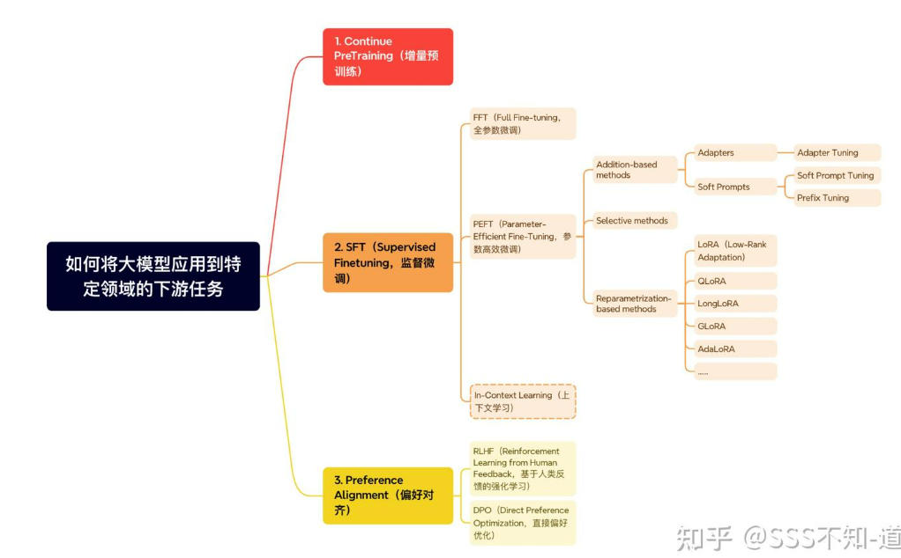

# LLM后训练
1.  **后训练（Post-training）**：
    *   这个术语不太常用，但可以理解为在预训练之后进行的任何形式的训练。因此，SFT、RLHF和微调都可以被视为后训练的一部分。
2.  **微调（Fine-tuning）**：
    *   微调通常指的是在预训练模型的基础上，使用特定任务的数据集来进一步调整模型参数，以提高模型在该任务上的性能。
    *   微调可以包括SFT和RLHF，但也可以是纯粹的基于损失函数的优化，而不涉及人类反馈。
3.  **SFT（Supervised Fine-tuning）**：
    *   SFT是微调的一种形式，它使用有标签的数据集来指导模型的学习，通常是监督学习的方式。
    *   SFT通常发生在预训练之后，是微调的第一步。
4.  **RLHF（Reinforcement Learning from Human Feedback）**：
    *   RLHF是在SFT之后进行的，它使用强化学习算法来优化模型，这些算法依赖于人类的反馈来调整模型的参数。
    *   RLHF可以看作是微调的一个更高级的阶段，它旨在使模型的行为更加符合人类的偏好。
5.  **对齐（Alignment）**：
    *   对齐通常指的是确保模型的输出或行为与人类的意图、价值观或期望相一致的过程。
    *   对齐可以发生在微调的任何阶段，包括SFT和RLHF。在RLHF中，对齐是一个核心目标，因为人类反馈直接用于指导模型朝向更符合人类期望的行为。 总结关系如下：

*   预训练 → 后训练
    *   后训练包括：SFT → RLHF → 对齐（对齐可以贯穿整个微调过程）

在这个过程中，SFT是微调的一种形式，RLHF是另一种更复杂的微调方法，它们都旨在提高模型在特定任务上的性能，并且都可以包含对齐的元素。对齐是一个跨阶段的目标，而SFT和RLHF是实现这一目标的具体技术。

