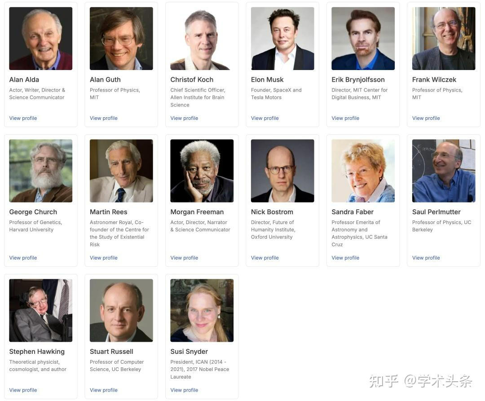
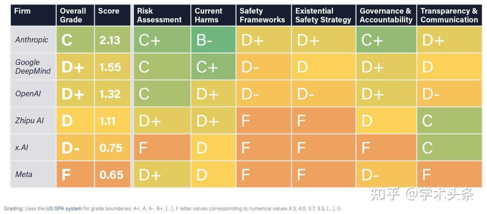
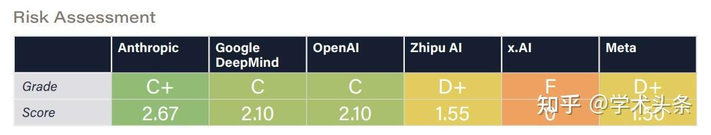
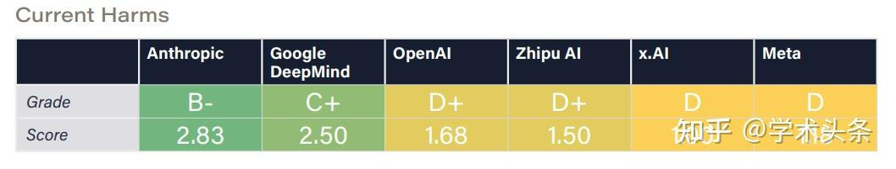
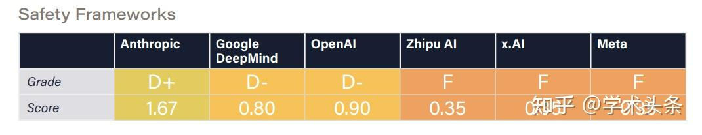
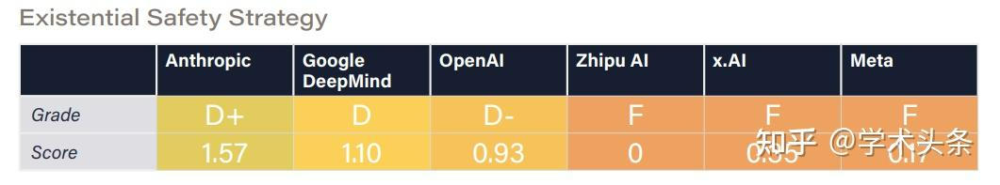
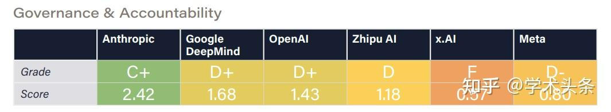
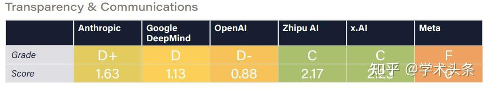
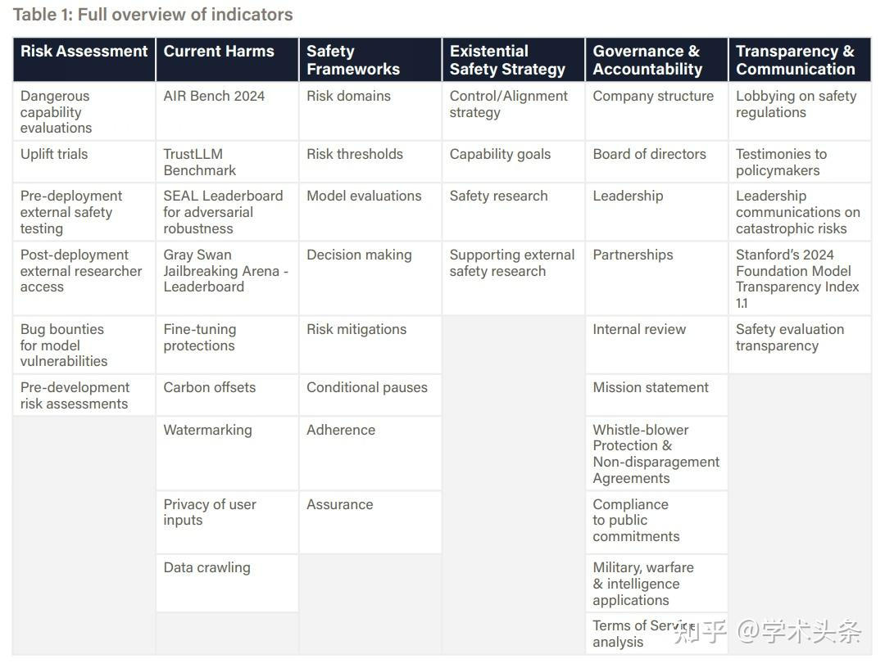

# 《人工智能安全指数报告》
> _**作者: 学术头条**_
> 
> _原文:_ [_**https://zhuanlan.zhihu.com/p/12831081837**_](https://zhuanlan.zhihu.com/p/12831081837)

_**图灵奖得主 Yoshua Bengio**_

[AI-Safety-Index-2024-Full-Report-11-Dec-24.pdf](https://www.yuque.com/attachments/yuque/0/2024/pdf/42982692/1735270197511-d80d0e4d-3fea-4cfc-b65e-400916bc8151.pdf)

安全话题,在人工智能(AI)行业一向备受关注.

尤其是诸如 GPT-4 这样的[大语言模型](https://zhida.zhihu.com/search?content_id=251589335&content_type=Article&match_order=1&q=%E5%A4%A7%E8%AF%AD%E8%A8%80%E6%A8%A1%E5%9E%8B&zhida_source=entity)(LLM)出现后,有不少业内专家呼吁「**立即暂停训练比 GPT-4 更强大的**[**人工智能模型**](https://zhida.zhihu.com/search?content_id=251589335&content_type=Article&match_order=1&q=%E4%BA%BA%E5%B7%A5%E6%99%BA%E8%83%BD%E6%A8%A1%E5%9E%8B&zhida_source=entity)」,包括马斯克在内的数千人纷纷起身支持,联名签署了一封公开信.

**这封公开信便来自生命未来研究所(Future of Life Institute)**,该机构由麻省理工学院教授、物理学家、人工智能科学家、《生命 3.0》作者 Max Tegmark 等人联合创立,是最早关注人工智能安全问题的机构之一,其使命为“引导变革性技术造福生活,避免极端的大规模风险”.

公开信息显示,生命未来研究所的顾问委员会成员阵容强大,包括理论物理学家[霍金](https://zhida.zhihu.com/search?content_id=251589335&content_type=Article&match_order=1&q=%E9%9C%8D%E9%87%91&zhida_source=entity)、企业家马斯克、哈佛大学遗传学教授 George Church、麻省理工学院物理学教授 Frank Wilczek 以及演员、科学传播者 Alan Alda、Morgan Freeman 等.

日前,生命未来研究所邀请[**图灵奖**](https://zhida.zhihu.com/search?content_id=251589335&content_type=Article&match_order=1&q=%E5%9B%BE%E7%81%B5%E5%A5%96&zhida_source=entity)**得主 Yoshua Bengio、**[**加州大学伯克利分校**](https://zhida.zhihu.com/search?content_id=251589335&content_type=Article&match_order=1&q=%E5%8A%A0%E5%B7%9E%E5%A4%A7%E5%AD%A6%E4%BC%AF%E5%85%8B%E5%88%A9%E5%88%86%E6%A0%A1&zhida_source=entity)**计算机科学教授 Stuart Russell** 等 7 位人工智能专家和治理专家,**评估了 6 家人工智能公司(Anthropic、Google DeepMind、Meta 、OpenAI、x.AI、**[**智谱**](https://zhida.zhihu.com/search?content_id=251589335&content_type=Article&match_order=1&q=%E6%99%BA%E8%B0%B1&zhida_source=entity))在 6 大关键领域的安全实践,并发布了他们的第一份《人工智能安全指数报告》(FLI AI Safety Index 2024).

报告显示,尽管 Anthropic 获得了最高的安全性评级,但分数仅为“C”,包括 Anthropic 在内的 6 家公司在安全实践方面仍有提升空间.

报告链接:

[https://futureoflife.org/document/fli-ai-safety-index-2024/](https://link.zhihu.com/?target=https%3A//futureoflife.org/document/fli-ai-safety-index-2024/)

关于这份报告,Tegmark 在 X 上甚至一针见血地指出: Anthropic first and Meta last,即: Anthropic 的安全性最高,而坚持开源的 Meta 在这方面却垫底.但 Tegmark 也表示,“这样做的目的不是羞辱任何人,而是激励公司改进.”

值得一提的是,生命未来研究所在报告中写道,“入选公司的依据是其在 2025 年之前打造最强大模型的预期能力.此外,智谱的加入也反映了我们希望使该指数能够代表全球领先企业的意图.随着竞争格局的演变,未来的迭代可能会关注不同的公司.”

6 大维度评估 AI 安全
-------------

据介绍,评审专家从风险评估(Risk Assessment)、当前危害(Current Harms)、安全框架(Safety Frameworks)、生存性安全策略(Existential Safety Strategy)、治理和问责制(Governance & Accountability)以及透明度和沟通(Transparency & Communication)分别对每家公司进行评估,最后汇总得出安全指数总分.

### 维度 1: 风险评估

在风险评估维度中,OpenAI、Google DeepMind 和 Anthropic 因在识别潜在危险能力(如网络攻击滥用或生物武器制造)方面实施更严格的测试而受到肯定.然而,报告也指出,这些努力仍存在显著局限,AGI 的相关风险尚未被充分理解.

OpenAI 的欺骗性能力评估和提升研究获得了评审专家的关注；Anthropic 则因与国家人工智能安全机构的深度合作被认为表现尤为突出.Google DeepMind 和 Anthropic 是仅有的两家维持针对模型漏洞的专项漏洞奖励计划的公司.Meta 尽管在模型部署前对危险能力进行了评估,但对自治、谋划和说服相关[威胁模型](https://zhida.zhihu.com/search?content_id=251589335&content_type=Article&match_order=1&q=%E5%A8%81%E8%83%81%E6%A8%A1%E5%9E%8B&zhida_source=entity)的覆盖不足.智谱的风险评估相对不够全面,而 x.AI 在部署前的评估几乎缺失,大幅低于行业标准.

评审专家建议,行业应扩大研究的规模与范围,同时建立明确的可接受风险阈值标准,从而进一步提高人工智能模型的安全性和可靠性.

### 维度 2: 当前危害

在当前危害维度中,Anthropic 的[人工智能系统](https://zhida.zhihu.com/search?content_id=251589335&content_type=Article&match_order=1&q=%E4%BA%BA%E5%B7%A5%E6%99%BA%E8%83%BD%E7%B3%BB%E7%BB%9F&zhida_source=entity)在安全性与信任度[基准测试](https://zhida.zhihu.com/search?content_id=251589335&content_type=Article&match_order=1&q=%E5%9F%BA%E5%87%86%E6%B5%8B%E8%AF%95&zhida_source=entity)中得到了最高分,Google DeepMind 紧随其后,该公司的 Synth ID 水印系统被认可为减少人工智能生成内容滥用的[最佳实践](https://zhida.zhihu.com/search?content_id=251589335&content_type=Article&match_order=1&q=%E6%9C%80%E4%BD%B3%E5%AE%9E%E8%B7%B5&zhida_source=entity).

其他公司得分偏低,暴露出安全缓解措施的不足.例如,Meta 因公开前沿模型权重被批评,该做法可能被恶意行为者利用来移除安全防护.

此外,[对抗性攻击](https://zhida.zhihu.com/search?content_id=251589335&content_type=Article&match_order=1&q=%E5%AF%B9%E6%8A%97%E6%80%A7%E6%94%BB%E5%87%BB&zhida_source=entity)仍是一个主要问题,多数模型易受越狱攻击,其中 OpenAI 的模型尤为脆弱,而 Google DeepMind 在此方面防御表现最佳.评审专家还指出,只有 Anthropic 和智谱在默认设置下避免将用户交互数据用于模型训练,这一实践值得其他公司借鉴.

### 维度 3: 安全框架

在安全框架(Safety Frameworks)方面,所有 6 家公司均签署了《前沿人工智能安全承诺》,承诺制定安全框架,包括设置不可接受风险阈值、高风险场景下的高级防护措施,以及在风险不可控时暂停开发的条件.

然而,截至本报告发布,仅有 OpenAI、Anthropic 和 Google DeepMind 公布了相关框架,评审专家仅能对这三家公司进行评估.其中,Anthropic 因框架内容最为详尽而受到认可,其也发布了更多实施指导.

专家一致强调,安全框架必须通过强有力的外部审查和监督机制支持,才能真正实现对风险的准确评估和管理.

### 维度 4: 生存性安全策略

在生存性安全策略维度,尽管所有公司均表示有意开发 AGI 或[超级人工智能](https://zhida.zhihu.com/search?content_id=251589335&content_type=Article&match_order=1&q=%E8%B6%85%E7%BA%A7%E4%BA%BA%E5%B7%A5%E6%99%BA%E8%83%BD&zhida_source=entity)(ASI),并承认此类系统可能带来的生存性风险,但仅有 Google DeepMind、OpenAI 和 Anthropic 在控制与安全性方面开展了较为严肃的研究.

评审专家指出,目前没有公司提出官方策略以确保[高级人工智能](https://zhida.zhihu.com/search?content_id=251589335&content_type=Article&match_order=1&q=%E9%AB%98%E7%BA%A7%E4%BA%BA%E5%B7%A5%E6%99%BA%E8%83%BD&zhida_source=entity)系统可控并符合人类价值观,现有的技术研究在控制性、对齐性和可解释性方面仍显稚嫩且不足.

Anthropic 凭借其详尽的“Core Views on AI Safety”博客文章获得最高分,但专家认为其策略难以有效防范超级人工智能的重大风险.OpenAI 的“Planning for AGI and beyond”博客文章则仅提供了高层次原则,虽被认为合理但缺乏实际计划,且其可扩展监督研究仍不成熟.Google DeepMind 的对齐团队分享的研究更新虽有用,但不足以确保安全性,博客内容也不能完全代表公司整体战略.

Meta、x.AI 和智谱尚未提出应对 AGI 风险的技术研究或计划.评审专家认为,Meta 的开源策略及 x.AI 的“democratized access to truth-seeking AI”愿景,可能在一定程度上缓解权力集中和价值固化的风险.

### 维度 5: 治理和问责制

在治理和问责制维度,评审专家注意到,Anthropic 的创始人在建立负责任的治理结构方面投入了大量精力,这使其更有可能将安全放在首位.Anthropic 的其他积极努力,如负责任的扩展政策,也得到了积极评价.

OpenAI 最初的非营利结构也同样受到了称赞,但最近的变化,包括解散安全团队和转向营利模式,引起了人们对安全重要性下降的担忧.

Google DeepMind 在治理和问责方面迈出了重要一步,承诺实施安全框架,并公开表明其使命.然而,其隶属于 Alphabet 的盈利驱动企业结构,被认为在一定程度上限制了其在优先考虑安全性方面的自主性.

Meta 虽然在 CYBERSEC EVAL 和[红队测试](https://zhida.zhihu.com/search?content_id=251589335&content_type=Article&match_order=1&q=%E7%BA%A2%E9%98%9F%E6%B5%8B%E8%AF%95&zhida_source=entity)等领域有所行动,但其治理结构未能与安全优先级对齐.此外,[开放源代码](https://zhida.zhihu.com/search?content_id=251589335&content_type=Article&match_order=1&q=%E5%BC%80%E6%94%BE%E6%BA%90%E4%BB%A3%E7%A0%81&zhida_source=entity)发布高级模型的做法,导致了滥用风险,进一步削弱了其问责制.

x.AI 虽然正式注册为一家公益公司,但与其竞争对手相比,在[人工智能治理](https://zhida.zhihu.com/search?content_id=251589335&content_type=Article&match_order=1&q=%E4%BA%BA%E5%B7%A5%E6%99%BA%E8%83%BD%E6%B2%BB%E7%90%86&zhida_source=entity)方面的积极性明显不足.专家们注意到,该公司在关键部署决策方面缺乏内部审查委员会,也没有公开报告任何实质性的风险评估.

智谱作为一家营利实体,在符合法律法规要求的前提下开展业务,但其治理机制的透明度仍然有限.

### 维度 6: 透明度和沟通

在透明度和沟通维度,评审专家对 OpenAI、Google DeepMind 和 Meta 针对主要[安全法规](https://zhida.zhihu.com/search?content_id=251589335&content_type=Article&match_order=1&q=%E5%AE%89%E5%85%A8%E6%B3%95%E8%A7%84&zhida_source=entity)(包括 SB1047 和欧盟《[人工智能法案](https://zhida.zhihu.com/search?content_id=251589335&content_type=Article&match_order=1&q=%E4%BA%BA%E5%B7%A5%E6%99%BA%E8%83%BD%E6%B3%95%E6%A1%88&zhida_source=entity)》)所做的游说努力表示严重关切.与此形成鲜明对比的是,x.AI 因支持 SB1047 而受到表扬,表明了其积极支持旨在加强人工智能安全的监管措施的立场.

除 Meta 公司外,所有公司都因公开应对与先进人工智能相关的极端风险,以及努力向政策制定者和公众宣传这些问题而受到表扬.x.AI 和 Anthropic 在风险沟通方面表现突出.专家们还注意到,Anthropic 不断支持促进该行业透明度和问责制的治理举措.

Meta 公司的评级则受到其领导层一再忽视和轻视与极端人工智能风险有关的问题的显著影响,评审专家认为这是一个重大缺陷.

专家们强调,整个行业迫切需要提高透明度.x.AI 缺乏风险评估方面的信息共享被特别指出为透明度方面的不足.

Anthropic 允许英国和美国人工智能安全研究所对其模型进行第三方部署前评估,为行业最佳实践树立了标杆,因此获得了更多认可.

专家是如何打分的？
---------

在指数设计上,6 大评估维度均包含多个关键指标,涵盖企业治理政策、外部模型评估实践以及安全性、公平性和[鲁棒性](https://zhida.zhihu.com/search?content_id=251589335&content_type=Article&match_order=1&q=%E9%B2%81%E6%A3%92%E6%80%A7&zhida_source=entity)的基准测试结果.这些指标的选择基于学术界和政策界的广泛认可,确保其在衡量[公司安全](https://zhida.zhihu.com/search?content_id=251589335&content_type=Article&match_order=1&q=%E5%85%AC%E5%8F%B8%E5%AE%89%E5%85%A8&zhida_source=entity)实践上的相关性与可比性.

这些指标的主要纳入标准为:

*   **相关性**: 清单强调了学术界和政策界广泛认可的人工智能安全和负责任行为的各个方面.许多指标直接来自斯坦福大学[基础模型](https://zhida.zhihu.com/search?content_id=251589335&content_type=Article&match_order=1&q=%E5%9F%BA%E7%A1%80%E6%A8%A1%E5%9E%8B&zhida_source=entity)研究中心等领先研究机构开展的相关项目.
*   **可比较性**: 选择的指标能够突出安全实践中的有意义的差异,这些差异可以根据现有的证据加以确定.因此,没有确凿差异证据的安全预防措施被省略了.

选择公司的依据是公司到 2025 年制造最强大模型的预期能力.此外,智谱的加入也反映了该指数希望能够代表全球领先公司的意图.随着竞争格局的演变,未来可能会关注不同的公司.

图｜评价指标概述.

此外,生命未来研究所在编制《AI 安全指数报告》时,构建了全面且透明的证据基础,确保评估结果科学可靠.研究团队根据 42 项关键指标,为每家公司制作了详细的评分表,并在附录中提供了所有原始数据的链接,供公众查阅与验证.证据来源包括:

*   **公开信息**: 主要来自研究论文、政策文件、新闻报道和[行业报告](https://zhida.zhihu.com/search?content_id=251589335&content_type=Article&match_order=1&q=%E8%A1%8C%E4%B8%9A%E6%8A%A5%E5%91%8A&zhida_source=entity)等公开材料,增强透明度的同时,便于利益相关方追溯信息来源.
*   **公司问卷调查**: 针对被评估公司分发了问卷,补充公开数据未覆盖的安全结构、流程与策略等内部信息.

证据收集时间为 2024 年 5 月 14 日至 11 月 27 日,涵盖了最新的人工智能基准测试数据,并详细记录了[数据提取](https://zhida.zhihu.com/search?content_id=251589335&content_type=Article&match_order=1&q=%E6%95%B0%E6%8D%AE%E6%8F%90%E5%8F%96&zhida_source=entity)时间以反映模型更新情况.[生命未来研究所](https://zhida.zhihu.com/search?content_id=251589335&content_type=Article&match_order=6&q=%E7%94%9F%E5%91%BD%E6%9C%AA%E6%9D%A5%E7%A0%94%E7%A9%B6%E6%89%80&zhida_source=entity)致力于以透明和问责为原则,将所有数据——无论来自公开渠道还是公司提供——完整记录并公开,供审查与研究使用.

评分流程方面,在 2024 年 11 月 27 日完成证据收集后,研究团队将汇总的评分表交由独立[人工智能科学家](https://zhida.zhihu.com/search?content_id=251589335&content_type=Article&match_order=2&q=%E4%BA%BA%E5%B7%A5%E6%99%BA%E8%83%BD%E7%A7%91%E5%AD%A6%E5%AE%B6&zhida_source=entity)和治理专家小组评审.评分表涵盖所有指标相关信息,并附有评分指引以确保一致性.

评审专家根据绝对标准为各公司打分,而非单纯进行横向比较.同时,专家需附上简短说明支持评分,并提供关键改进建议,以反映证据基础与其专业见解.生命未来研究所还邀请专家小组分工评估特定领域,如“生存性安全策略”和“当前危害”等,保证评分的专业性和深度.最终,每一领域的评分均由至少四位专家参与打分,并汇总为平均分后展示在评分卡中.

这一评分流程既注重结构化的标准化评估,又保留了灵活性,使专家的专业判断与实际数据充分结合.不仅展现当前安全实践的现状,还提出可行的改进方向,激励公司在未来达成更高的安全标准.