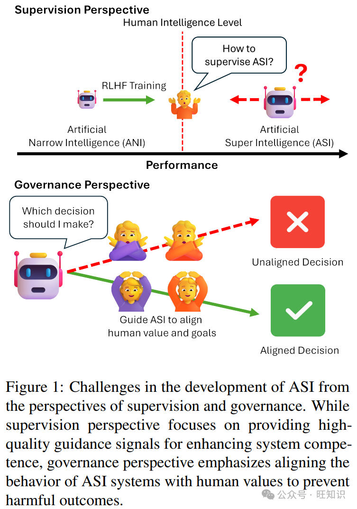
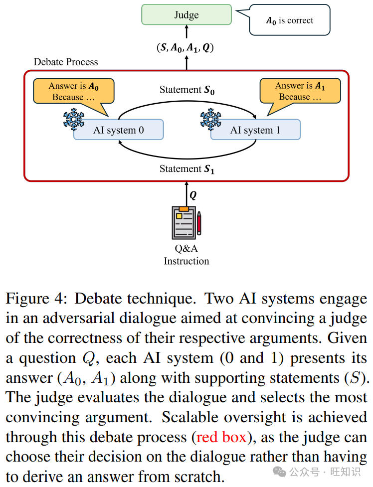

# AI迈向超级智能之路&超级对齐技术深度剖析与挑战应对
> _**作者: 旺知识 2024年12月28日**_
> 
> _**原文:**_ [_**https://mp.weixin.qq.com/s/H8eKEFKDogba9l4BZEh4jA**_](https://mp.weixin.qq.com/s/H8eKEFKDogba9l4BZEh4jA)

如今大型语言模型越来越厉害，有了实现人工超级智能的可能，但这也带来了一些问题，比如怎么确保这些智能系统的行为符合人类的价值观和安全要求。超级对齐就是为了解决这个问题，本文研究了相关的各种方法和面临的挑战，对未来实现安全的人工超级智能有重要意义，能帮助我们更好地引导 AI 系统为人类服务，避免可能的危害。

随着大型语言模型的发展，人工超级智能（ASI）成为可能，但现有对齐范式难以应对。超级对齐旨在使 AI 系统在超人能力水平上符合人类价值观和安全要求，本文探讨了其概念、挑战及现有范式局限性，回顾了可扩展监督方法，如弱到强泛化、辩论、基于 AI 反馈的强化学习和三明治方法等，并分析了这些方法的优势和局限性，最后讨论了关键挑战和未来发展方向，为实现安全和对齐的 ASI 提供参考。

摘要&解读
-----

大型语言模型（LLMs）的出现引发了关于人工超级智能（ASI）的可能性，ASI是一种超越人类智能的假设性AI系统。然而，现有的对齐范式难以指导如此先进的AI系统。超级对齐旨在使AI系统在超人能力水平上符合人类价值观和安全要求，它有两个主要目标——提供高质量指导信号的可扩展性监督以及确保与人类价值观对齐的稳健治理。在本综述中，我们研究了超级对齐的可扩展监督方法和潜在解决方案。具体而言，我们探讨了ASI的概念、它带来的挑战以及当前对齐范式在解决超级对齐问题方面的局限性。然后，我们回顾了超级对齐的可扩展监督方法。最后，我们讨论了关键挑战，并提出了ASI系统安全持续改进的途径。通过全面回顾当前文献，我们的目标是系统地介绍现有方法，分析它们的优势和局限性，并讨论潜在的未来方向。

*   **研究背景：** 大型语言模型能力提升引发 ASI 可能性，但现有基于人类反馈的强化学习（RLHF）、监督微调（SFT）和上下文学习（ICL）等对齐范式难以实现超级对齐，面临如人类反馈可扩展性和可靠性问题、治理风险、偏差放大等局限，因此需要研究新的可扩展监督方法来应对。
*   **工作贡献：** 调研了多种可扩展监督技术如弱到强泛化（W2SG）、辩论、基于 AI 反馈的强化学习（RLAIF）和三明治方法等，为解决 ASI 超级对齐问题提供了新途径和思路，部分技术在如推理、代码生成、视觉等领域有了初步应用和探索。
*   **实现设计：**
    *   弱到强泛化（W2SG）：利用弱 AI 系统生成的伪响应训练强 AI 系统，通过特定的训练目标和数据集设置实现。
    *   辩论：让两个 AI 系统进行对抗性对话，由法官根据对话评估选择答案，涉及辩论流程、策略和决策函数的设计。
    *   RLAIF：用 AI 生成的反馈训练奖励模型并优化强化学习策略，包括奖励模型和 RL 策略的训练目标及函数设计。
    *   三明治方法：通过非专家和专家与 AI 系统的交互及评估，设计了内外循环的迭代对齐过程。
*   **实验结果：**
    *   弱到强泛化（W2SG）：在一些推理和视觉任务中取得一定效果，但存在计算资源需求大、易受模型大小和任务限制、有 AI 欺骗风险等问题。
    *   辩论：在多智能体推理等任务中有效，但受限于辩论者和法官的能力及偏见，增强方法虽有改进但也面临计算资源和数据依赖等问题。
    *   RLAIF：在代码生成等任务中提高了性能，但存在传播偏差、依赖模型质量、对动态环境适应性有限等问题。
    *   三明治方法：能在一定程度上衡量对齐进展，但依赖专家评估，存在资源密集和引入不一致或偏见的问题。

1 引言
----

语言模型的能力随着其规模的增加而提高，这种现象被称为涌现能力（Wei等人，2022a；Brown等人，2020；Kaplan等人，2020；Nam等人，2024；Hu等人，2024）。这种规模扩展导致了大型语言模型（LLMs）的发展，包括专有模型如GPT-4（OpenAI，2024）、Claude 3.5（Anthropic，2024）和Gemini Ultra（团队等，2024），以及开源模型如Llama 3.2（Meta，2024）、Mixtral（Mistral，2024；Jiang等人，2024）和Qwen 2.5（团队，2024）变体。

从监督角度来看，人类智力水平面临着如何监督ASI的问题。传统的RLHF训练在模型开始超越人类智能时面临可扩展性问题。从治理角度来看，重点是引导ASI与人类价值观和目标保持一致，防止有害结果。

大型语言模型的涌现能力使其在广泛的任务中取得了显著进展，包括自然语言理解（Brown等人，2020）、推理（Wei等人，2022b；Rein等人，2024）、代码生成（Chen等人，2021；Liu等人，2024）和多语言翻译（Shi等人，2022）。此外，大型语言模型还取得了令人惊讶的突破，如部分通过图灵测试（Jones和Bergen，2024）以及在困难数学问题上达到高精度（Rein等人，2024）。最近的研究表明，大型语言模型的这些进展引发了从狭义人工智能（ANI）向通用人工智能（AGI）可能性的转变，尽管AGI尚未实现，但这使得人工超级智能（ASI）成为一个潜在的未来场景（Pohl，2015；Batin等人，2017）。ANI是指目前使用的人工智能系统，旨在执行特定任务，如用于医疗保健（Huang等人，2024）和软件工程（Fan等人，2023）的大型语言模型，但它们缺乏人类的一般认知能力。相比之下，AGI代表一种理论上的人工智能模型，具有人类水平的能力，包括在各个领域的推理、学习和适应能力（Bubeck等人，2023；Fei等人，2022；Goertzel，2014；Pohl，2015；Batin等人，2017）。大型语言模型的发展，特别是它们概括知识和表现出涌现行为的能力，使人们更加乐观地认为实现AGI正变得越来越现实（Bubeck等人，2023）。这一发展也引起了人们对ASI的关注，ASI是人工智能的一个假设未来阶段，在这个阶段，机器不仅在所有领域超越人类智能，还具有先进的认知功能和复杂的思维能力（Mucci和Stryker，2023；Hughes等人，2024）。考虑到未来实现ASI的潜力，设想并为ASI时代做好准备至关重要。

然而，ASI的发展带来了挑战，特别是当人类无法使用标记数据监督AI系统时缺乏指导信号。图1说明了为ASI扩展高质量指导信号的挑战。超级对齐被定义为“监督、控制和治理人工超级智能系统的过程”（Jonker和McGrath，2024；Jan Leike，2023），从监督和治理的角度包含两个子目标。实现这些目标需要一个迭代和共同进化的过程。

从监督角度来看，目标是构建高质量的指导信号以提高模型的实用性。传统的训练方法，如基于人类反馈的强化学习（RLHF）（Ouyang等人，2022），一旦模型开始超越人类智能，就会面临可扩展性问题。这就产生了一个关键瓶颈，即无法提供提高系统有用性或能力的高质量指导信号。

从治理角度来看，目标是有效地规范模型的行为，以确保其无害并与人类价值观保持一致。如果没有稳健的治理，ASI可能会表现出不可预测、有害甚至灾难性的行为。例如，对齐不良的ASI系统可能会追求无意中削弱人类力量或造成生存风险的目标，包括人类灭绝的威胁。为了解决这个问题，不仅要约束ASI的行为，还要确保这些系统以本质上安全且符合道德原则的方式运行。

这个过程涉及开发引导先进AI系统的方法，确保它们保持有益和安全。超级对齐能够开发与价值观一致的ASI，为人类带来最大利益。

当前的对齐范式，如基于人类反馈的强化学习（RLHF）（Christiano等人，2017；Ouyang等人，2022；Gulcehre等人，2023）、监督微调（SFT）（Zhou等人，2023；Rafailov等人，2023）和上下文学习（ICL）（Gou等人，2024；Xu等人，2023），在使大型语言模型与人类价值观和目标保持一致方面显示出了希望（Wang等人，2024）。RLHF利用人类反馈训练奖励模型，该模型生成有助于使语言模型与人类偏好对齐的奖励。相比之下，SFT消除了强化奖励模型，直接使用人类反馈对语言模型进行微调。同时，ICL通过在推理过程中约束大型语言模型的响应，使其输出与人类价值观保持一致，而无需额外训练。可扩展监督是源自超级对齐的概念，旨在开发可扩展、高质量的监督信号，能够在确保与人类价值观和目标一致的同时引导超越人类能力的AI系统（Amodei等人，2016；Taylor等人，2016；Olah，2016）。然而，尽管RLHF、SFT和ICL取得了进展，但这些范式难以实现超级对齐的目标。

从监督角度来看，RLHF受到人类反馈的可扩展性和可靠性的限制。随着模型变得越来越复杂，收集准确、一致和全面的反馈变得越来越困难，从而留下了指导空白。同样，SFT在策划和注释足够多样化和具有代表性的数据集以有效微调ASI方面面临挑战。ICL虽然完全绕过了训练，但在推理过程中依赖精心设计的提示，其可扩展性和表达能力本身就受到限制。从治理角度来看，RLHF和SFT在很大程度上依赖于人类监督的质量和意图，引发了对反馈中偏差和不一致性的担忧。人类监督不当的可能性带来了风险，特别是当模型超过人类能力时。另一方面，ICL需要治理结构来确保提示约束与更广泛的人类价值观保持一致，这一过程难以标准化和执行。此外，先进AI系统的欺骗风险进一步使治理复杂化（Yang等人，2024a）。因此，缺乏可扩展、高质量和多样化的监督信号仍然是实现超级对齐的瓶颈。为了应对超级对齐挑战，必须设计量身定制的方法。随着模型向ASI发展，在开发过程中增强其能力并引导其价值观和目标以最大化人类社会的利益至关重要。

我们的目标是概述超级对齐问题，包括其起源、历史背景和定义，以及超级对齐研究的现状和潜在解决方案。在第2节中，我们介绍了ASI的概念、它带来的挑战以及当前对齐范式在解决超级对齐问题方面的局限性。在第3节中，我们分析了当前的可扩展监督技术，并讨论了每种方法相关的具体挑战。在第4节中，我们总结了可扩展监督的关键挑战，并探索了解决这些挑战的潜在途径。

2 背景与形式化
--------

### 2.1 术语

狭义人工智能（ANI），或“弱人工智能”，是指旨在擅长单个特定任务的人工智能系统。这些系统在其领域内通常表现出与人类水平相当或更低的能力，并且缺乏推广到其他任务的能力。形式上，可以表示为，其中表示ANI系统在任务上的性能，表示人类在相同任务（例如翻译）上的性能。

然而，对于某些任务，如国际象棋和围棋，现代ANI系统已经超越了人类水平的性能，即，其中代表像国际象棋或围棋这样的任务（Mucci和Stryker，2023；Silver等人，2016）。尽管在这些特定领域具有令人印象深刻的能力，但ANI系统在执行其他任务时能力有限，对于所有，有。

通用人工智能（AGI）是指超越ANI的理论飞跃。AGI系统将拥有人类水平的智能，并在广泛的任务和领域中表现出通用能力（Bubeck等人，2023；Fei等人，2022；Goertzel，2014；Pohl，2015；Batin等人，2017）。AGI系统能够概括知识并适应新的挑战。形式上可以表示为，对于所有，其中表示AGI系统在任务上的性能，表示潜在的无限任务集，表示人类在相同任务和领域中的性能。

人工超级智能（ASI）是指在所有任务和领域中超越人类智能并具有卓越思维技能的人工智能系统（Mucci和Stryker，2023；Hughes等人，2024）。ASI系统表现出卓越的推理、创造力和适应性，形式上描述为，对于所有，其中表示ASI系统在结果质量上优于人类智能。

尽管ASI目前远未实现，但解决超级对齐的挑战对于减轻灾难性风险既及时又关键（Pueyo，2018）。积极的准备是必不可少的，因为ASI的出现可能会超过我们的应对能力，没有纠正的余地。此外，监督和治理必须作为互动过程共同发展，在增强AI能力的同时降低相关风险。

### 2.2 超级对齐

超级对齐的目标是提高能力并使ASI对齐（Jonker和McGrath，2024；Jan Leike，2023）。超级对齐源于可扩展监督的概念，该概念解决了在AI系统接近或超过人类水平智能时以可扩展方式引导其行为的挑战。

可扩展监督正式定义为“确保给定AI系统遵循其目标中在训练期间过于昂贵或不切实际频繁评估的方面的过程”（Amodei等人，2016）。这个概念表明需要提供可靠、高质量监督信号的方法，即使AI系统发展到超越人类智能的水平。超级对齐作为可扩展监督的一个特定情况，侧重于使ASI与人类价值观和意图保持一致，同时增强其有效实现目标的能力。

形式上，超级对齐被定义为“监督、控制和治理人工超级智能系统的过程”（Jonker和McGrath，2024），其目标是开发能够为ASI提供高质量监督信号的方法，即使在没有直接人类监督或传统反馈机制（如人类标记数据或RLHF）的情况下，也能指导其发展和行为（Amodei等人，2016；Christiano等人，2018）。随着AI能力的增长，由于人类监督所需的成本和专业知识不断增加，这些传统方法变得越来越不足。

自从大规模模型出现及其能力提高以来，超级对齐作为确保AI系统在保持能力的同时与人类价值观保持一致的手段受到了极大的关注。可扩展监督技术，如三明治方法和弱到强泛化（W2SG），已成为解决治理ASI挑战的有前途的方法。

### 2.3 超级对齐方法与挑战概述

#### 2.3.1 定义与形式化

可扩展监督解决了评估AI系统执行的任务时面临的挑战，这些任务对于单个人类来说过于复杂而无法直接评估。考虑一个经过训练与目标对齐的ANI系统。在其训练过程中，提供了一组监督信号。这些信号代表来自其他AI系统或人类的反馈或评估指标，用于指导的行为。可扩展监督旨在确保遵循中那些过于昂贵或复杂而无法直接和频繁评估的方面。形式上，可扩展监督可以表示为：

其中表示从数据分布中采样的输入，是在处理时的行为，衡量与的对齐程度，是表示可接受对齐的预定义阈值。主要挑战在于的可扩展性。随着接近或超过人类水平的能力，监督信号集必须提高质量。

关键思想：可扩展监督是一种通过为超越人类智能的AI系统提供高质量监督信号来实现超级对齐的方法。它侧重于评估和引导AI系统，而超级对齐是确保AI系统与人类价值观和目标保持一致的最终目标。

#### 2.3.2 方法

可扩展监督已成为监督ASI挑战的有前途的解决方案。它能够有效地使AI系统与复杂目标对齐，否则这些目标过于昂贵或难以频繁评估。已经提出了各种可扩展监督技术，包括迭代蒸馏和放大（IDA）（Christiano等人，2018；Charbel - Raphaël，2023）、递归奖励建模（RRM）（Leike等人，2018）和合作逆强化学习（Hadfield - Menell等人，2016）。这些方法构成了当前可扩展监督方法的基础，如弱到强泛化、辩论、基于AI反馈的强化学习和三明治方法（Burns等人，2023；Irving等人，2018；Bai等人，2022；Bowman等人，2022）。图2展示了当前的可扩展监督技术及其方法。

*   弱到强泛化（W2SG）是一项基于IDA（Christiano等人，2018；Charbel - Raphaël，2023）和RRM（Leike等人，2018）思想的实证研究。W2SG探索了在弱AI系统标签上训练的强AI系统是否能够超越经过微调的弱AI系统的能力（Burns等人，2023）。
*   辩论涉及两个AI系统进行零和辩论，每个系统都旨在最大化自己获胜的机会。法官根据辩论者的陈述确定最终的安全且有用的答案（Irving等人，2018）。
*   基于AI反馈的强化学习（RLAIF）是一种用AI生成的反馈取代人类反馈来训练奖励模型并优化强化学习策略以实现对齐的方法（Bai等人，2022）。
*   三明治方法是在能力较弱（非专家）和能力较强（专家）的人类之间评估AI系统的性能，模拟人类监督有限的场景（Cotra，2021；Bowman等人，2022）。

挑战：尽管这些方法具有潜力，但可扩展监督方法面临着重要挑战。一个主要问题是辅助系统的可利用性，这些辅助系统是这些方法的组成部分。例如，在训练和对齐中使用的辅助系统本身可能会被它们旨在对齐的主要AI利用，如在对抗性漏洞和奖励破解中所观察到的（AdamGleave，2023；Everitt等人，2023）。此外，对抗性鲁棒性仍然是一个持续存在的问题，因为即使是最先进的系统也容易受到对抗性攻击，这引发了对它们在最坏情况下行为的担忧（AdamGleave，2023）。

3 方法与途径
-------

### 3.1 弱到强泛化（W2SG）

在本节中，我们将概述 W2SG 技术，该技术利用在弱 AI 系统生成的标签上训练的强 AI 系统，超越经过微调的弱 AI 系统的能力。我们将探讨其形式化、回顾现有工作、讨论应用，并分析其优势和局限性。

#### 3.1.1 定义

W2SG 是一项实证研究，它利用经过微调的弱 AI 系统（即弱监督者）生成的伪响应来训练一个强 AI 系统（即强学生），使其能够泛化到超越其监督者的能力。尽管弱 AI 系统的性能可能不如强 AI 系统，但其伪响应可作为有效的训练信号，使强学生能够泛化到超越其监督者的能力。W2SG 的成功在于强 AI 系统理解潜在任务并从伪响应中进行泛化的内在能力。这确保了强 AI 系统能够减轻伪响应中的噪声和偏差，使得该技术可用于训练超越人类智能水平的 AI 系统。图 3 展示了 W2SG 技术的过程。

#### 3.1.2 形式化

给定一个定义为的输入空间和一个取决于分类问题类型的标签空间。对于二分类问题，标签空间为，而对于多分类问题，标签空间为。

弱 AI 系统表示为，强 AI 系统表示为。弱 AI 系统生成的数据定义为，其中表示用于生成标签的弱 AI 系统的微调版本，是带有弱 AI 系统标记的伪响应数据集，是用于微调弱 AI 系统的训练数据。

完整数据集为。用于训练弱 AI 系统的数据子集表示为。测试数据，表示为，也是完整数据的一个子集，但与弱训练数据没有重叠，即。输入的真实标签表示为。弱 AI 系统的训练目标如下：

其中是用于评估 AI 系统的损失函数。强 AI 系统使用弱 AI 系统的标签进行训练，其目标如下：

#### 3.1.3 核心概念与分析

一项研究强调了强学生欺骗弱监督者的风险，即强学生在弱 AI 系统已知的领域表现出正确行为，而在弱 AI 系统不理解的领域产生不一致或有害的行为（Yang 等人，2024a）。该研究聚焦于多目标对齐任务，其中冲突的对齐目标（例如，有用性与无害性）导致强 AI 系统以弱 AI 系统无法检测到的方式偏离其行为。该论文引入了欺骗分数的概念，用于量化在弱 AI 系统未知但强 AI 系统理解的领域中的不一致程度。

#### 3.1.4 增强

原始的 W2SG 工作（Burns 等人，2023）通过中间 AI 系统的自举监督提出了提高性能的概念证明。该方法不是直接对齐一个强 AI 系统，而是采用迭代过程：首先对齐一个稍强的 AI 系统，然后使用该系统对齐一个更强的系统，并重复这个循环。虽然 W2SG 技术展示了较弱的 AI 系统如何生成伪响应来对齐更强的系统，但它在计算上要求很高，因为它需要训练多个弱 AI 系统来扩展对齐。此外，该方法在不同任务中的性能差异很大，并且对学习设置（如超参数）很敏感。更强的 AI 系统也更容易对伪响应过拟合。此外，该工作主要关注简单任务，如奖励建模中的二分类，而不是使用直接偏好优化的对齐任务，这限制了其在更复杂场景中的适用性。

另一项工作试图通过整合两种方法来增强 W2SG（Sang 等人，2024）。第一种方法是集成学习，它使用诸如 bagging 和 boosting 等技术组合多个弱监督者，以提高弱监督的伪响应质量。第二种方法是利用外部 AI 系统（即辅助模型）来改进弱 AI 系统提供的伪响应（例如，通过辩论）。虽然该研究引入了一个用于对齐 ASI 的两阶段 W2SG 框架，并为第一阶段提供了一些实证结果，但实验仅限于二分类任务，并使用相对较小的 AI 系统（如 GPT - 2）进行评估。此外，基于辩论的使用辅助模型的方法取得的成功有限。

协同监督学习（CSL）框架通过专家层次混合方法改进了 W2SG（Liu 和 Alahi，2024）。与传统的 W2SG 方法依赖单个弱监督者不同，CSL 使用多个专门的弱监督者共同监督一个强学生。该方法在两个关键组件之间交替：教师分配，将数据样本与最合适的弱监督者匹配；以及降噪，过滤掉不可靠或有噪声的标签。这种层次结构允许弱监督者在各个专业领域有效地分配监督，改善了整体学习过程。虽然 CSL 引入了这个新颖的多教师框架，但它也有一些局限性。专家层次混合和交替过程可能会增加计算开销，使得该方法比简单方法更资源密集。此外，CSL 的成功取决于弱监督者之间是否存在明确的专业化；如果这些专业化不够明显，性能提升可能会受到限制。此外，实验仅限于视觉识别任务，模型大小和资源限制了任务范围。

#### 3.1.5 应用

推理：一项工作将 W2SG 应用于大型语言模型的复杂推理任务（Yang 等人，2024b）。它解决了在推理环境中使强 AI 系统能够从较弱的监督者学习的挑战，而不是简单的分类问题。所提出的渐进式学习框架包括两个阶段——在第一阶段，强 AI 系统使用由弱 AI 系统生成的较小、经过精心挑选且更可靠的数据子集进行微调，并结合强 AI 系统自身的上下文学习。在第二阶段，应用偏好优化从弱 AI 系统的错误中学习，使强 AI 系统能够通过创建对比样本来增强其推理能力。这种方法显示出了有希望的结果，特别是对于较大的 AI 系统（高达 70B 参数）和使用直接偏好优化的对齐任务。然而，在第一阶段精心挑选可靠训练数据的过程需要仔细过滤，这在扩展到更大的数据集或不同领域时可能会引入额外的复杂性。

视觉：Guo 等人（Guo 等人，2024）将 W2SG 应用于视觉基础模型，并提出了一种自适应置信度蒸馏方法。该方法在从较弱的监督者学习和使强学生 AI 系统在有信心时依赖其自身预测能力之间取得平衡。他们的方法展示了 W2SG 在视觉任务中的潜力。然而，一个局限性来自于训练设置，其中弱 AI 系统和强 AI 系统都在原始数据集上进行了微调。这种重叠使得很难将改进完全归因于 W2SG。

#### 3.1.6 优势和局限性

对 W2SG 的分析确定了与 AI 欺骗相关的重要问题。然而，解决这些挑战仍然很困难，因为目前没有明确的方法来完全减轻欺骗。W2SG 中的增强方法通过利用多个弱监督者来提高对齐和性能，显示出了相当大的潜力。然而，它们在计算上是密集型的，通常需要训练多个专门的弱 AI 系统。它们的性能在很大程度上取决于精心设计的训练设置。当前的实现使用较小的模型大小，并且仅限于更简单或特定领域的任务（如二分类），限制了其在更广泛和更复杂场景中的适用性。W2SG 的应用强调了其在不直接依赖人类注释的情况下增强不同领域强 AI 系统的潜力。尽管如此，由于数据策划和过滤的复杂性，可扩展性仍然是一个重大挑战。

### 3.2 辩论

在本节中，我们介绍辩论框架，这是一种让两个 AI 系统进行对抗性对话以说服法官其各自论点正确性的方法。我们将提供其形式化的详细概述、文献中的关键贡献、应用以及其优势和局限性。

#### 3.2.1 定义

辩论技术利用两个 AI 系统进行对抗性对话，以说服法官（人类或 AI 系统）其各自论点的正确性，如图 4 所示。这种范式将这些交互视为零和博弈，并基于一个主张：“在辩论游戏中，说谎比反驳谎言更难。”（Irving 等人，2018）在这个游戏的纳什均衡中，两个智能体都努力以最有说服力的方式呈现真相，揭示对方可能忽略的细节或反论点。辩论框架旨在引出可能超出法官直接理解的真实和有用信息。重要的是，法官不需要评估每个潜在的辩论结果；相反，由强 AI 系统或人类选择的单个论点路径足以代表整个决策树的推理。这个属性使得可扩展监督成为可能，可表示为模型（即 AI 系统）需要更新，是一个输入辩论问题，是由法官最终选择的对抗性对话。辩论 AI 系统的主要假设是，在这种设置下的最优策略会产生诚实、对齐的信息，这些信息超出了法官的能力。

#### 3.2.2 形式化

辩论过程涉及两个 AI 系统智能体，表示为和，它们竞争以说服法官关于它们在给定问题上的各自立场。设所有可能论点的空间表示为，问题空间表示为。辩论通过以下步骤展开：

1.  一个问题被呈现给两个智能体和。
2.  每个智能体提供一个初始答案，，其中表示可能答案的空间（在这种情况下为二进制）。智能体提供的初始答案和可能相同（）或不同（）。假设答案确定为和。
3.  智能体轮流提出论点，每个陈述，要么基于自己的论点进行构建，要么批评对手的论点。
4.  法官评估完整的对话序列，其中，并决定哪个智能体提出了最有说服力的案例。

陈述序列是智能体和分别采用的策略和的结果。每个策略是一个将辩论历史映射到下一个论点的函数或策略：

其中是辩论历史。例如，在第轮，智能体的论点确定为，其中表示到第轮的辩论历史。两个策略和的相互作用决定了整个论点序列的演变。

辩论可以建模为一个零和极小极大博弈，其中每个智能体试图最大化被选择的概率。形式上，设和分别表示智能体和的策略，设为收益函数，其中量化了从策略组合中获得的效用。每个智能体的目标是解决：

其中和分别表示和的策略空间。这里，表示的最优策略，即使在对手的最优反策略下也能保证最高的效用。法官的决策函数是一个二进制决策，确定哪个智能体提出了更有说服力的论点，定义为：

#### 3.2.3 核心概念与分析

Irving 等人（Irving 等人，2018）引入了辩论的概念，其中两个 AI 智能体进行讨论以说服人类法官。法官确定哪个智能体提供了最真实和有用的信息。类似于复杂性理论中的原则，这个框架表明智能体有动机提供对齐和真实的论点。这个辩论 AI 系统对于人类难以直接评估的可扩展监督是有效的。然而，ASI 可能会利用法官的偏见和理解，可能会歪曲人类价值观。此外，参与辩论可能需要比直接回答方法更多的 AI 系统能力，这可能会使辩论比其他训练方法效率更低。人类法官也容易受到偏见的影响，这可能会导致他们倾向于支持证实他们现有信念的论点。

Brown - Cohen 等人（Brown - Cohen 等人，2023）通过引入双重高效辩论增强了辩论框架。这种辩论方法使两个多项式时间证明者（即辩论者）能够在使用最少人类判断的情况下竞争说服一个验证者（即法官）解决方案的正确性。这种在人类判断上的效率支持了 AI 系统的可扩展监督。同时，该框架提供了一种依赖最少人类判断的高效辩论方法。然而，有两个关键问题：该框架假设存在一个 AGI 水平的证明者，这在实践中可能不适用；人类验证的固有缺陷降低了现实世界应用的可靠性。

Kenton 等人（Kenton 等人，2024）研究了使用弱大型语言模型作为强大型语言模型的法官进行可扩展监督。该研究检查了三种协议——辩论、咨询和直接问答（QA），在包括数学、编码和逻辑等不同信息不对称水平的任务中对它们进行了评估。结果表明，辩论通过利用辩论者之间的对抗性相互作用始终优于咨询，使弱法官能够提供更准确的监督。然而，弱法官对辩论者和顾问的依赖带来了挑战，可能会导致不准确的决策。此外，研究发现辩论和咨询都不如 QA 协议有效，在 QA 协议中法官直接回答问题或事先审查源文章，这引发了对辩论方法有效性的质疑。

然而，这些框架假设辩论者会生成可理解的推理痕迹，并且容易受到弱法官的偏见或限制的影响。它们也容易受到强 AI 系统的对抗性利用，并且由于人类固有的局限性（如偏见）可能不太可靠。

#### 3.2.4 增强方法

Kirchner 等人（Kirchner 等人，2024）引入了证明者 - 验证者游戏来提高 AI 系统的清晰度。它涉及一个“有帮助的”和一个“狡猾的”证明者生成解决方案，以及一个验证者评估其正确性并进行迭代改进。通过启用对抗性相互作用，该方法提高了复杂解决方案的清晰度。然而，训练涉及证明者和验证者之间的迭代过程，需要多轮和大量的计算资源。对可靠的地面真实数据的依赖限制了其在没有标签的领域中的泛化能力。此外，对抗性证明者可以利用验证者的弱点，并且在性能和清晰度之间的权衡对可扩展性构成挑战。

Khan 等人（Khan 等人，2024）探索了在辩论设置中使用更有说服力的大型语言模型来提高较弱法官的准确性。他们的研究表明，优化辩论者以有效地说服法官有助于非专家法官更好地识别真实答案，特别是在对抗性辩论中。这种优化改善了法官校准并提高了法官的表现。然而，结果仅限于辩论者能够向法官提供验证证据的设置，如果模型仅依赖于有说服力的输出而没有事实证据，这可能会有问题。此外，模型使用 RLHF 进行诚实性微调，尚不清楚如果应用于优先考虑性能而不是真实性的欺骗性模型，辩论是否仍然有效。

#### 3.2.5 评估

SCALEEVAL 框架利用多智能体辩论在各种场景（如头脑风暴）中创建大型语言模型的可扩展和可靠评估基准（Chern 等人，2024）。通过允许多个智能体迭代地批评和讨论响应，它减少了对大量人类注释的需求，同时确保与专家判断保持一致。然而，对智能体一致性的依赖以及人类参与的有限性可能会在难以达成共识的边缘情况下带来挑战。

#### 3.2.6 应用

Du 等人（Du 等人，2023）证明了多智能体辩论可增强语言模型的推理和事实性。这种方法涉及多个语言模型实例在多轮中提出并辩论它们的个人响应和推理过程，以达成共同的最终答案。该方法在数学推理和事实问答等任务中已被证明是有效的。然而，计算复杂度会随着参与辩论的智能体数量增加而增加。此外，较长的辩论可能会导致在 AI 系统内保持连贯性和理解性方面出现挑战。

#### 3.2.7 优势和局限性

对辩论框架的分析证明了它们在各种任务中的有效性，通过帮助较弱的法官提供更准确的监督。然而，这些框架假设辩论者会生成可理解的推理痕迹，并且容易受到弱法官的偏见和限制的影响。此外，它们容易受到强 AI 系统的对抗性利用，并且由于人类固有的偏见（尤其是当法官是人类时）可能可靠性较低。

AI 辩论增强方法提高了输出的正确性和清晰度，帮助较弱的法官识别真实答案。然而，这些方法需要大量的计算资源，严重依赖标记数据，并且存在强调说服力而不是事实准确性的风险。可扩展性进一步受到对地面真实数据的依赖的限制。此外，它们的鲁棒性受到利用系统弱点和偏见的对抗性策略的挑战。

对于涉及语言模型推理和事实性的应用，多智能体辩论被引入作为一种通过迭代辩论使多个智能体提出和改进响应的方法。这种方法对于复杂的推理任务特别有效。然而，由于涉及多个智能体，它会引入增加的计算开销，并且在长时间辩论期间面临连贯性挑战。

### 3.3 基于 AI 反馈的强化学习

在本节中，我们介绍 RLAIF，一种用 AI 生成的评论取代 RLHF 中人类反馈的技术。我们将探讨其形式化、回顾现有工作、讨论应用，并分析其优势和局限性。

#### 3.3.1 定义

RLAIF 用 AI 生成的评论取代 RLHF 中的人类反馈，以减少对人类标签的依赖。图 5 说明了 RLAIF 过程。AI 反馈系统评估模型的响应并生成评论，这些评论用于训练奖励模型。这个奖励模型为优化强化学习策略提供学习信号。通过使策略与 AI 生成的反馈对齐，RLAIF 在利用预训练模型能力和通过自动评论生成确保可扩展性之间取得平衡。

#### 3.3.2 形式化

RLAIF 技术将强化学习（RL）与 AI 生成的反馈集成用于策略训练。奖励模型使用来自预训练语言模型的 AI 反馈进行训练，而不是人类反馈。目标是学习一个策略，以最大化累积奖励，其中是状态空间（例如，一组提示），是动作空间（例如，候选响应）。

在 RLAIF 中，AI 反馈模型预测对提示的响应的质量。奖励模型学习近似此反馈，优化 RL 策略。奖励模型被训练以最小化损失函数：

其中和是更优和较不优的响应。RL 策略使用来自 AI 生成的奖励模型的反馈进行微调。RL 策略的目标函数为：

其中$\\mathcal{D}_{\\pi_{\\phi}^{RL}}\\pi^{SFT}\\beta\\mathcal{D}\_{pretrain}$以平衡 AI 反馈和预训练能力。

#### 3.3.3 核心概念与分析

Bai 等人（Bai 等人，2022）引入了宪法 AI 的概念，旨在使用预定义原则的“宪法”训练无害的 AI 系统。该过程包括一个监督学习阶段，其中 AI 系统使用自我生成的评论和修订进行训练，以及一个强化学习阶段，利用 AI 偏好模型而不是人类反馈。自我评论和自我改进使宪法 AI 更无害，而其基于预定义原则评估评论的能力增强了透明度。然而，对预定义原则的依赖可能会限制在各种环境中的适应性，因为需要定制原则。此外，使用 AI 反馈而不是人类注释可能会在模型中传播现有的偏见。

Sharma 等人（Sharma 等人，2024）通过评估它们的有效性，比较了 RL 建模的两种训练策略，SFT 和 AI 反馈，包括教师模型生成的直接偏好训练与使用 AI 反馈模型的 RLAIF 训练之间的能力差距。研究结果表明，在高质量完成任务上，SFT 可以优于 RLAIF。作者还发现，为了使 RLAIF 优于 SFT，需要一个足够强大的预训练基础模型，并且用于 SFT 数据收集的教师和用于 AI 反馈的评论者之间必须存在能力不匹配。这些结果引发了人们的担忧，即用 AI 取代人类标注者可能会导致次优结果。

Yuan 等人（Yuan 等人，2024）提出了一种自我奖励训练，其中模型在训练期间生成自己的反馈。这种自我改进范式展示了改进的指令遵循和奖励建模能力。虽然有前景，但这种方法需要大量的计算资源，并且结果仍然是初步的。例如，迭代训练的局限性尚未得到充分探索。

#### 3.3.4 增强

Lee 等人（Lee 等人，2024）提出了直接 - RLAIF（d - RLAIF），通过消除单独的奖励模型来训练 RLAIF。它在强化学习期间直接使用现成的大型语言模型的反馈。这种方法解决了关键挑战，如 RM 过时（即生成的输出与 RM 训练的数据集越来越不一致，导致次优性能）以及 RM 训练和 AI 偏好标注的耗时问题。通过简化强化学习管道，d - RLAIF 在总结和对话生成等任务中提供了提高的效率和有效性。

#### 3.3.5 应用

Yu 等人（Yu 等人，2024）引入了 RLAIF - V，一个使用开源反馈对齐多模态大型语言模型的框架。多模态训练通过使用多模态指令（例如，视频问答任务）的 SFT 训练来实现。训练后的 SFT 模型用于基于视频剪辑的详细描述（也是自我生成的）评估偏好分数，然后将这些分数用作奖励模型来训练模型。最后，SFT 模型使用近端策略优化（PPO）与奖励模型进行 RLAIF 训练。虽然 RLAIF - V 实现了多模态 RLAIF 训练，但该方法在很大程度上依赖于基础 AI 模型生成的内容的质量。

Dutta 等人（Dutta 等人，2024）将 RLAIF 应用于增强轻量级大型语言模型中的代码生成，专注于需要生成准确 API 调用的任务。通过在来自更大模型的 AI 生成的反馈上进行训练，他们的框架显著提高了代码可执行率，优于微调基线。然而，依赖比训练基础模型更大、更强大的模型进行反馈限制了这种方法的适用性。

#### 3.3.6 优势和局限性

核心概念成功地减少了对人类注释的依赖。然而，挑战包括通过 AI 反馈传播偏见的风险、在动态环境中的有限适应性以及迭代训练的大量计算需求。

RLAIF 增强简化了强化学习，使大型语言模型能够高效地自我改进。虽然这种方法缓解了传统方法的一些局限性，但它也引入了对现成大型语言模型反馈质量的依赖，这可能会放大现有的偏见。缺乏专门的奖励模型可能会进一步限制在不同任务中的适应性。

RLAIF 的应用在多模态和代码生成任务中提高了训练效率和可扩展性。然而，这种方法的成功取决于基础模型反馈的质量，因为低质量的反馈可能会损害性能。此外，依赖更大、更强大的模型进行反馈可能需要使用通用大型语言模型，而这些模型可能难以处理特定领域的专业知识。

### 3.4 三明治方法

在本节中，我们介绍三明治技术，一种用于评估 AI 对齐中可扩展监督的结构化方法。这种技术将 AI 系统的能力置于非专家人类和领域专家之间，从而能够对对齐策略进行系统评估。

#### 3.4.1 定义

三明治方法是一种用于评估的技术，旨在解决模型能力超过非专家人类但低于领域专家的挑战。它旨在通过将模型的性能置于非专家参与者和专家之间来评估可扩展监督方法，利用专家评估来改进监督策略（Cotra，2021）。这种技术创建了一个用于测试可扩展监督的结构化实验环境。

#### 3.4.2 形式化

三明治方法涉及三个关键参与者：非专家参与者、有能力的模型和领域专家。非专家参与者与模型交互，在他们不完全理解的任务上引导模型的输出，而领域专家评估最终输出以确定对齐成功与否。通过评估对齐，我们可以迭代地改进交互协议，以在训练阶段不需要专家参与的情况下实现专家级别的对齐。

形式上，设表示要执行的任务，表示要对齐的模型，表示引导模型的非专家参与者，表示评估对齐成功的专家评估者。迭代对齐过程可以用两个嵌套循环来描述：

1.  内循环是非专家迭代地改进模型对齐策略的地方：

其中表示非专家基于与模型的交互进行协议调整的函数。这个循环继续直到非专家确定模型符合他们的对齐标准。 2. 外循环评估和更新可扩展监督策略：

其中是经过次迭代后的可扩展监督策略，是内循环经过次迭代后的模型。函数根据专家对内循环结果的评估更新监督策略。目标是在迭代改进过程的条件下最大化对齐成功的概率：

其中表示模型解决任务的能力，是完成任务所需的能力阈值。

#### 3.4.3 分析

三明治方法提供了一个在现实环境中研究可扩展监督的系统框架。它首先由 Cotra 等人（Cotra，2021）提出，并由 Bowman 等人（Bowman 等人，2022）进行了实验。通过关注模型性能超过无助的非专家但需要监督才能达到专家水平性能的任务，该技术能够衡量对齐挑战的增量进展。例如，对像 GPT - 3 这样的大型模型的实验表明，在模型的帮助下，非专家可以优于模型和无助的非专家。

然而，三明治方法也有局限性。首先，它假设存在可用于评估的专家，这可能无法很好地扩展到所有任务或领域。其次，改进交互协议的迭代过程可能是资源密集型的。此外，依赖非专家来引导模型行为可能会引入不一致或偏见，特别是在复杂或主观的任务中。

#### 3.4.4 优势和局限性

三明治方法提供了一种可扩展监督的结构化方法。它能够对监督技术进行实证测试，提供关于模型和人类能力在对齐中的相互作用的见解。然而，其可扩展性受到对专家评估的依赖的限制，并且资源强度可能会限制其在实践中的适用性。此外，该方法的有效性取决于任务和协议的精心设计，因为选择不当的任务可能会产生误导性结果或无法捕捉有意义的对齐挑战。

4 挑战与潜在方向
---------

虽然可扩展监督和对齐范式如 RLHF、W2SG 和 RLAIF 已经取得了显著进展，但它们仍然面临着关键的局限性，阻碍了它们解决超级对齐问题的能力。下面，我们概述了当前范式固有的主要挑战，并探讨了未来工作的潜在方向。

### 4.1 挑战

监督信号的可扩展性：随着 AI 系统变得越来越复杂，传统的监督方法，如基于人类反馈的强化学习（RLHF），面临着可扩展性挑战。这些方法在很大程度上依赖于人类的评估能力，在监督可能超越人类智能的模型时变得不足。像 W2SG 或 RLAIF 这样的方法试图解决这些局限性，但在保持鲁棒性和减轻误差传播方面经常遇到挑战，特别是在需要微妙或上下文相关理解的任务中。

对抗风险和欺骗行为：先进的 AI 系统可以利用监督中的漏洞，在明确监测的区域对齐其行为，而在较少监测的区域偏离。基于辩论和 W2SG 的范式已经强调了这些风险。解决这些问题需要能够检测和减轻这种行为的方法，特别是在 AI 系统有动机隐藏其真实目标或行为的场景中。

资源强度和对专家的依赖：像三明治方法和辩论这样的框架在很大程度上依赖于专家的参与进行评估和监督。虽然这些框架为可扩展对齐技术提供了有价值的见解，但它们对领域专家的依赖造成了瓶颈，限制了可扩展性。

偏差放大：依赖 AI 生成反馈的对齐技术，如 RLAIF，存在传播和放大提供反馈的模型中固有偏差的风险。在跨不同领域和文化背景对齐 AI 系统时，这个问题尤其令人担忧。

### 4.2 潜在方向

通过数据多样性促进创造力：鼓励数据多样性可以在促进对齐策略的创造力和鲁棒性方面发挥关键作用。多智能体协作，其中具有不同专业或视角的智能体相互作用，已经显示出在实现超出单个模型能力的涌现行为和解决问题方法方面的潜力。智能体之间的竞争可以进一步推动改进，因为对抗性设置通常会揭示不同的论点数据，从而发现对齐弱点并提出新的改进途径。然而，基于多样性的方法需要仔细策划和过滤，以确保产生的行为是有益的，并且不会无意中强化不良特征。

教师 - 学生模型之间的迭代训练：迭代的教师 - 学生训练涉及一个循环过程，其中一个更先进的教师模型指导一个能力较弱的学生模型，而这个学生模型反过来又成为后续迭代的教师。这种方法促进了增量学习，其中每一代模型都继承并改进了其前身的对齐能力。虽然这种方法提供了可扩展性和从较弱的监督信号引导更强模型的能力，但必须解决诸如误差积累和连续迭代中收益递减等挑战。

基于搜索的最优学习方向方法：基于搜索的方法使用优化技术探索可能的对齐策略空间，寻求系统地导航复杂对齐挑战的最优路径。当最优对齐方向不明确时，这些方法特别有用，因为它们允许在不确定的空间中进行探索和实验。像蒙特卡洛树搜索或无梯度优化这样的技术可以通过优先考虑搜索空间中具有最高成功潜力的区域来指导这个过程。然而，这些方法需要大量的计算资源，并且可能在高度复杂或动态的环境中难以扩展。

5 结论
----

在本综述中，我们探讨了超级对齐、其挑战和可扩展监督技术。我们分析了当前的范式、实用方法及其潜力和局限性。通过识别关键挑战并提出未来方向，我们旨在弥合当前对齐技术与实现安全和对齐的 ASI 目标之间的差距。解决这些挑战对于引导 AI 系统不仅避免伤害而且造福人类至关重要——这是迈向人类和 AI 合作解决复杂全球问题的未来的关键一步。

  
作者：张长旺，图源：**旺知识**

### 参考资料

*   标题：The Road to Artificial SuperIntelligence: A Comprehensive Survey of Superalignment
*   作者：HyunJin Kim¹², Xiaoyuan Yi¹\*, Jing Yao¹, Jianxun Lian¹, Muhua Huang³, Shitong Duan⁴, JinYeong Bak²∗, Xing Xie¹
*   单位：1微软亚洲研究院，2成均馆大学，3芝加哥大学，4复旦大学
*   标签：人工智能、超级对齐、可扩展监督、人工超级智能
*   概述: 本文全面综述了超级对齐相关内容，包括其概念、挑战、现有对齐范式的局限，以及可扩展监督方法和潜在解决方案。
*   链接：[https://arxiv.org/pdf/2412.16468](https://arxiv.org/pdf/2412.16468)