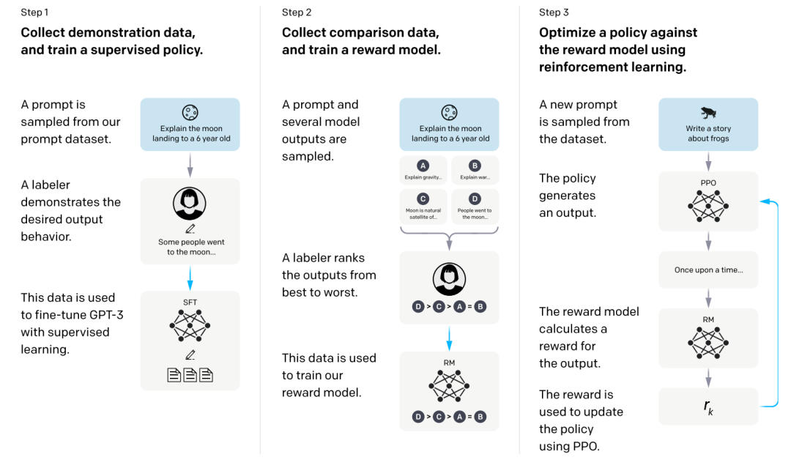

# LLM偏好对齐方法对比：PPO DPO ORPO SimPO KTO
> _**作者: 方方的算法花园**_ 
> 
> _**原文:**_ [_**https://mp.weixin.qq.com/s/0YmW5osL2QlJzFCKKm25hQ**_](https://mp.weixin.qq.com/s/0YmW5osL2QlJzFCKKm25hQ)

**背景**
------

在自然语言处理（NLP）范畴内，强化学习作为一种重要的机器学习范式，促使智能体（例如语言模型）与环境展开交互。智能体依据环境反馈的奖励信号，摸索出最优的行为策略，旨在实现长期累积奖励的最大化。这里的行为策略广泛涵盖文本生成、句子翻译等各类语言相关操作。

具体而言，在 NLP 场景下:

**环境:** 包含文本生成任务里的上下文信息、翻译任务中的源语言句子等。以文本摘要任务为例，原始文档的内容与格式便构成了环境要素。

**智能体:** 一般由 Transformer 架构的语言模型担当，它会根据当前环境状态，诸如已生成的部分文本，来采取行动，像挑选下一个单词以完成文本的完整生成。

奖励:对智能体行为的一种评价。在文本生成过程中，若生成的句子语法无误、语义连贯且契合任务要求，比如生成的摘要精准概括了原文，便会获得较高奖励；反之，若生成内容存在错误或不符合要求，所获奖励则较低 。

随着自然语言处理技术的迅猛发展，基于人类反馈优化语言模型的方法持续推陈出新。在这一背景下，本文着重关注 **RLHF（PPO）、DPO、ORPO、SimPO、KTO** 这五种具有代表性的算法，进行分析与对比。

**PPO**
-------

介绍PPO之前，需要先了解一下RLHF。

### **RLHF 简介**

RLHF（Reinforcement Learning from Human Feedback）即基于人类反馈的强化学习，是一种通过人类反馈来优化模型的技术。



RLHF包含三步骤:

**STEP1: SFT训练**

标注者针对输入提示分布提供期望行为的示范，随后利用监督学习对预训练的 GPT-3 模型进行微调。此过程通过大量标注数据训练模型，使其初步学习符合用户意图的输出模式，也就是SFT。

**STEP2: Reward model 训练**

收集模型输出之间的比较数据集，标注者指明对于给定输入更偏好的输出，接着基于此数据集训练奖励模型（Reward model），使其能够预测人类偏好的输出，为后续优化提供依据，也就是所谓的“偏好对齐”。

**STEP3: PPO优化**

将奖励模型的输出作为标量奖励，利用近端策略优化（PPO）算法对监督策略进行微调，以最大化该奖励，促使模型生成更符合人类偏好的输出。在实践中，可不断迭代步骤二和步骤三，持续收集比较数据训练新的奖励模型和策略，提升模型性能。

### **PPO 简介**

PPO（proximal policy optimization，近端策略优化）涉及四个关键模型:

**策略模型（Policy Model）:** 也被称为actor model（演员模型），即我们**想要训练的目标语言模型**。作为生成模型，负责针对给定的输入生成相应的回复，其输出直接影响智能体在环境中的行为决策，决定了行动的方向和方式，是整个系统对外交互的关键接口。

**评论模型（Critic Model/value model）:** 主要用于预测回复的优劣程度，在训练进程中能够实时动态地调整模型参数，通过对未来累积收益的预估，为策略选择提供前瞻性的指导，帮助智能体在复杂的环境决策中挑选出有望带来最大长期回报的行动路径，增强决策的合理性和长远性。\*\*该模型预测期望总收益，需要进行参数更新。\*\*可以采用策略模型参数共享初始化或者reward模型初始化。

**奖励模型（Reward Model）:** 通过输出奖励分数，对策略模型生成的回复质量进行量化评估，为策略的优化提供明确的反馈信号，引导策略朝着获得更高奖励的方向调整，其评估结果直接关联到策略更新的方向和程度。**该模型计算生成token的即时收益，是RW阶段训练的奖励模型，RLHF过程中需要参数冻结**。

**参考模型（Reference Model）:** 作为 SFT 模型的备份，在策略优化过程中发挥稳定器的作用，通过提供一个相对稳定的参考标准，防止模型在更新过程中出现过于剧烈或极端的变化，保障模型在优化迭代中的稳定性和可靠性，避免因过度优化而陷入局部最优或性能退化的困境。**可以采用SFT模型初始化该模型，训练过程中参数冻结，防止actor训歪、离sft结果太远等。**

**总之，整个过程中，Policy Model 和 Critic Model 参数是会进行更新的，而Reward Model 和 Reference Model 参数是冻结的。**

### **LLama factory 实践**

**1\. SFT**

**（1）SFT数据:**

```text-plain
[
```

dataset\_info.json 中的数据集描述应为

```text-plain
"数据集名称": {
```

**（2）参数设置**

参考:

[https://github.com/hiyouga/LLaMA-Factory/blob/main/examples/train\_full/llama3\_full\_sft.yaml](https://github.com/hiyouga/LLaMA-Factory/blob/main/examples/train_full/llama3_full_sft.yaml)

**（3）merge lora参数**

参考:[https://github.com/hiyouga/LLaMA-Factory/blob/main/examples/merge\_lora/llama3\_lora\_sft.yaml](https://github.com/hiyouga/LLaMA-Factory/blob/main/examples/merge_lora/llama3_lora_sft.yaml) 

```text-plain
import os
```

**2\. reward model 训练**

**（1）偏好数据:**

```text-plain
[
```

dataset\_info.json 中的数据集描述应为

```text-plain
"数据集名称": {
```

**（2）参数设置**

参考

[https://github.com/hiyouga/LLaMA-Factory/blob/main/examples/train\_lora/llama3\_lora\_reward.yaml](https://github.com/hiyouga/LLaMA-Factory/blob/main/examples/train_lora/llama3_lora_reward.yaml)

**3\. PPO训练**

**（1）训练数据:** 格式与SFT数据格式一致，数据可采用同一份数据。

**（2）训练参数:**

参考:

[https://github.com/hiyouga/LLaMA-Factory/blob/main/examples/train\_lora/llama3\_lora\_ppo.yaml](https://github.com/hiyouga/LLaMA-Factory/blob/main/examples/train_lora/llama3_lora_ppo.yaml)

**DPO**
-------

### **DPO 简介**

Direct Preference Optimization（DPO，直接偏好优化）在避免强化学习的同时针对人类偏好进行优化。现有的RLHF的方法，首先将奖励模型拟合到提示数据集以及人类对成对响应的偏好上，然后使用强化学习来找到使学习到的奖励最大化的策略。相比之下，**DPO 直接通过一个简单的分类目标来优化最能满足偏好的策略，拟合一个隐式奖励模型，其相应的最优策略可以通过闭式解提取出来，无需奖励模型训练。**


整个流程包括:

**1\. 构建偏好数据集:** 对于每一个提示x，从参考策略πref采样完成y1、y2，接着利用人类标注偏好的方式构建离线偏好数据集。πref通常采用经过SFT训练好的模型。

\*\*2. 优化语言模型:\*\*在获得数据集D和确定πref后，针对给定的参数β，优化语言模型πθ以最小化LDPO。LDPO的计算公式:


在原论文实现过程中，一般默认使用β = 0.1，批次大小为64，并采用RMSprop优化器，学习率为1e - 6，同时学习率会在最初的150步内从0线性增加到1e - 6。对于总结任务，通常会使用β = 0.5，而其他参数保持不变。

### **DPO vs PPO**

在DPO的论文中，作者做了以下对比:

**1\. 优化 RLHF 目标的能力对比**

在情感生成任务中，DPO 和 PPO在实现奖励和最小化与参考策略的 KL 散度方面进行了比较。DPO 的效率远高于 PPO，能在实现高奖励的同时保持低 KL 散度。即使与能够访问真实奖励的 PPO - GT相比，DPO 也表现更优。

**2\. 在真实偏好数据集上的性能对比**

**（1）总结任务:** DPO 在不同采样temperature下的胜率高于 PPO，并且对temperature更鲁棒。这意味着 DPO 在处理不同的采样条件时，能够更好地保持性能的稳定性，而 PPO 的性能则会受到采样temperature的较大影响。

**（2）单轮对话任务:** 在单轮对话任务中，DPO 是唯一能在 Anthropic - HH 数据集上优于首选完成的计算高效方法，并且收敛速度也较快。相比之下，PPO 在这些方面的表现不如 DPO。

**3\. 泛化能力对比**

在分布外评估中，将 Reddit TL;DR 总结实验中的 PPO 和 DPO 策略应用于 CNN/DailyMail 数据集的新闻文章。结果显示，DPO 的表现明显优于 PPO，这表明 DPO 具有较好的泛化能力，能够在不同的数据分布场景下保持较好的性能，而 PPO 在面对分布外的数据时，性能下降相对明显。

### **LLama factory 实践**

**1\. SFT训练**

与PPO部分提及的SFT一致。

**2\. DPO训练**

\*\*（1）偏好数据集:\*\*与PPO训练阶段数据格式一致

**（2）参数设置:**

参考

[https://github.com/hiyouga/LLaMA-Factory/blob/main/examples/train\_lora/llama3\_lora\_dpo.yaml](https://github.com/hiyouga/LLaMA-Factory/blob/main/examples/train_lora/llama3_lora_dpo.yaml)

**ORPO**
--------

### **ORPO 简介**

RLHF需要额外的奖励模型和单独的预热阶段（通常指SFT）；DPO省略了奖励模型，但仍需要SFT，这增加了训练的复杂性和资源消耗。除此之外，在传统的方法中，没有很好地利用 SFT 来同时实现领域适应和抑制不良生成风格。

**ORPO（odds ratio preference optimization , 优势比偏好优化）的提出，将SFT和偏好对齐两个阶段很好的融合在了一起。** ORPO 算法通过在训练过程中结合SFT损失和基于优势比的相对比例损失，对模型进行迭代训练，使其生成符合偏好的输出。


对于给定的输入序列x，和对应的选择响应yw、拒绝响应yl，ORPO的目标函数为:


其中，LSFT遵循传统的因果语言建模负对数似然（NLL）损失函数，即通过最大化生成参考token的可能性来进行监督微调，其计算方式为


这里yi是指示词汇集中第i个token是否为标签token的布尔值，pi是第i个token的概率，m是序列长度。

LOR是相对比例损失，是最大化选择响应和拒绝响应的优势比，其计算公式为


其中


表示给定输入x生成输出序列y的优势，σ是 sigmoid 函数。通过这样的目标函数设置，使得模型在训练过程中既要适应目标领域（通过LSFT），又要区分有利和不利的生成风格（通过LOR）。

### **ORPO vs DPO/SFT**

**1\. 模型性能**

**（1）单轮指令跟随:** 在 AlpacaEval 评估中，Phi - 2、Llama - 2、Mistral 等模型经 ORPO 微调后，成绩超越了同类用 DPO、SFT 训练的模型。像 Mistral - ORPO -α（7B）达到 87.92% 和 11.33% ，Mistral - ORPO -β（7B）超 91% 和 12%，说明 ORPO 在这方面表现更优。

**（2）多轮指令跟随:** 通过 MT - Bench 评估，Mistral - ORPO -α（7B）和 Mistral - ORPO -β（7B）得分 7.23 和 7.32，与较大规模或专有模型相当，且训练时没用多轮对话数据，这表明 ORPO 在多轮指令跟随上的有效性远超传统方法。

**2\. 奖励模型胜率**

在 HH - RLHF 和 UltraFeedback 数据集上，ORPO 对 SFT 和 PPO 胜率较高，对 DPO 的胜率随模型规模增大而提高 。如 OPT - 1.3B 在 HH - RLHF 上对 DPO 胜率为 70.9%，说明 ORPO 在偏好对齐上更具优势。

**3\. 词汇多样性**

ORPO 模型每输入多样性低，倾向给期望标记高概率。Phi - 2（ORPO）的跨输入多样性在某些情况下比 DPO 低，意味着 ORPO 能生成更多指令特定响应，和 DPO 表现不同。

**4\. 计算效率**

RLHF 和 DPO 训练需冻结参考模型，每个批次要四次前向传播；ORPO 无需参考模型，直接更新，前向传播次数减半，内存分配和计算量都更少，比 RLHF 和 DPO 更高效。

### **LLama factory 实践**

1.  **.ORPO训练**

\*\*（1）偏好数据集:\*\*与PPO训练阶段数据格式一致

**（2）参数设置:**

参考下述链接，其中pref\_loss 选择“orpo”:

[https://github.com/hiyouga/LLaMA-Factory/blob/main/examples/train\_lora/llama3\_lora\_dpo.yaml](https://github.com/hiyouga/LLaMA-Factory/blob/main/examples/train_lora/llama3_lora_dpo.yaml)

**SimPO**
---------

### **SimPO 简介**

传统 RLHF 过程复杂，DPO虽简化了流程，但仍存在问题。其隐式奖励在训练和推理时存在差异，且需要参考模型，增加了计算和内存成本，这促使研究者探索更优算法，SimPO 应运而生。

SimPO（simpleyet effective offline preference optimiza-tion algorithm，简单有效的离线偏好优化算法）主要包括以下流程:

**1\. 奖励函数设定:**

使用策略模型生成响应的平均对数概率作为隐式奖励，即


其中β为常数，用于控制奖励差异的缩放，x为输入，y为响应。此奖励函数消除了对参考模型的依赖，使奖励与模型生成时的似然度量相匹配，**避免了 DPO 中奖励与生成度量不一致的问题**。例如，在生成文本响应时，模型会根据输入生成不同的响应，SimPO 算法通过计算每个响应的平均对数概率来确定其奖励值，激励模型生成更符合预期的高质量响应。

**2\. 引入目标奖励边际**

在 Bradley - Terry 目标中引入目标奖励边际γ>0，得到


在训练过程中，对于给定的输入x以及对应的获胜响应yw和失败响应yl，算法会确保获胜响应的奖励与失败响应的奖励之差超过γ。通过调整γ的值，可以影响模型对不同响应的偏好程度，促使模型更好地区分高质量和低质量的响应，提高奖励准确性和模型性能。但过大可能导致模型退化，需要合理调整。

**3\. 模型训练与优化**

基于设定的奖励函数和目标奖励边际，使用偏好数据集进行模型训练。通过最小化损失函数来更新模型参数:


一般情况下β设置在 2.0 - 2.5 之间，γ设置在 0.5 - 1.5 之间，但在某些特定模型或数据集上可能需要进一步微调。


### **SimPO vs DPO**

**1\. 奖励函数形式**

DPO 的奖励函数依赖参考模型ref，使得训练和推理时的优化目标存在差异，且与生成过程中的平均对数似然度量不一致。SimPO 的奖励函数以策略模型生成响应的平均对数概率为基础，无需参考模型，与生成度量相匹配，避免了 DPO 的问题。

**2\. 奖励准确性**

在 UltraFeedback 数据集的实验中，SimPO 比 DPO 具有更高的奖励准确性。这表明 SimPO 能使学习到的奖励更好地与偏好标签在验证集上保持一致，有助于提升模型的泛化能力和生成质量，DPO 则在这方面表现欠佳。

**3\. 长度相关性:**

对于长度偏差的处理，DPO 虽有一定缓解但仍存在不足，与不进行长度归一化的方法相比，其平均对数似然与响应长度的正相关性较强。SimPO 通过长度归一化有效降低了这种相关性，能够更好地控制生成响应的长度，避免生成过长但质量不佳的序列。

**4\. 算法效率**

在 Llama - 3 - Base 设置且使用 8×H100 GPUs 时，SimPO 因无需参考模型的前向传播，运行时间相比 DPO 缩短约 20%，GPU 内存使用减少约 10%，在计算资源利用上展现出明显优势。

**5.性能表现**

在 AlpacaEval 2、Arena - Hard 和 MT - Bench 等基准测试中，SimPO 在不同设置下均显著优于 DPO。如在 AlpacaEval 2 的长度控制胜率指标上优势明显，在 Arena - Hard 中也大多表现更优。在下游任务方面，多数任务中两者表现相近，但在数学任务（如 GSM8K）上都可能出现性能下降，且 SimPO 偶尔表现比 DPO 还差，这可能与训练数据集、超参数及下游任务评估模板有关。

### **LLama factory 实践**

**1\. SFT训练**

与PPO部分提及的SFT一致。

**2\. SimPO训练**

**（1）偏好数据集:** 与PPO训练阶段数据格式一致

**（2）参数设置:**

参考下述链接，其中pref\_loss 选择“simpo”:

[https://github.com/hiyouga/LLaMA-Factory/blob/main/examples/train\_lora/llama3\_lora\_dpo.yaml](https://github.com/hiyouga/LLaMA-Factory/blob/main/examples/train_lora/llama3_lora_dpo.yaml)

**KTO**
-------

### **KTO 简介**

传统的基于人类反馈的对齐方法如 RLHF 和 DPO 虽有成效，但依赖偏好数据，收集成本高。研究者们从前景理论出发，发现现有对齐方法隐含人类决策偏差，进而提出 **KTO（Kahneman-Tversky Optimization），利用 Kahneman-Tversky 人类效用模型，直接最大化生成内容的效用，仅需判断输出是否符合期望的二元信号。**

**前景理论核心:** 人类效用由价值函数和权重函数决定，本文重点关注价值函数，其特点包括存在参考点、相对收益凹性和损失厌恶。

KTO的算法流程主要如下:

**1\. 价值函数构建:** 基于 Kahneman-Tversky 价值函数，用逻辑函数σ替代原函数以提升数值稳定性。引入超参数β控制风险厌恶程度，β越大，在收益时风险厌恶越强，在损失时风险寻求越强；用λD和λU分别作为期望和不期望输出的超参数替代原损失厌恶系数λ。参考点z0设为，但实际中采用有偏估计，即通过在同一微批次中移动输出来构建不匹配对，计算共享参考点。

**2\. 损失函数定义:**

****

****

**3\. 超参数设置:**

*   **学习率:** 通常为 DPO 最优学习率的 2 - 10 倍，如 DPO 默认学习率为5e-7，KTO 默认可设为5e-6.
*   **batch大小:** mini-batch大小需>=2以估计参考点，一般推荐 8 - 128。
*   **风险厌恶参数β:** 对于已进行 SFT 的较大模型，\[0.01,0.10\]效果较好；对于直接进行 KTO 的较小模型，\[0.10,1.00\]更优。
*   **损失厌恶参数λD\\λU:** 一般设

默认λD=λU=1，在不同任务中可根据期望和不期望样本比例调整。

### **KTO vs DPO/RLHF/ORPO**

**1\. 模型性能对比**

在 1B - 30B 参数规模内，KTO 相关方法（如 SFT+KTO）与 SFT、DPO 相比有竞争力甚至更优，如在 Llama 模型和一些任务基准测试中表现更好；KTO 严格优于 ORPO，且在内存使用上更高效。


**2\. 数据需求:** SFT 数据形式常规，DPO 和 RLHF 依赖昂贵稀缺的偏好数据，KTO 只需二元信号数据且能处理不平衡数据，在数据获取和利用上更具优势。

**3\. 对模型结构影响:** KTO 能在不进行 SFT 时使模型保持较好生成质量，避免 DPO 不进行 SFT 时的问题。

**4\. 超参数设置与敏感性:** KTO 给出详细超参数设置建议及影响，离线 PPO 变体存在超参数敏感问题，DPO 等未强调此问题，但 KTO 超参数设置更具针对性和可操作性。

**5.处理复杂数据能力:** KTO 在处理矛盾偏好数据时表现更好，能产生多数偏好输出，其他方法未提及在这方面的表现。

### **LLama factory 实践**

**1\. SFT训练**

与PPO部分提及的SFT一致。

**2\. KTO训练**

**（1）偏好数据集:** 额外添加一个 kto\_tag 列，包含 bool 类型的人类反馈。

```text-plain
[
```

dataset\_info.json 中的数据集描述应为:

```text-plain
"数据集名称": {
```

**（2）参数设置:**

参考:

[https://github.com/hiyouga/LLaMA-Factory/blob/main/examples/train\_lora/llama3\_lora\_kto.yaml](https://github.com/hiyouga/LLaMA-Factory/blob/main/examples/train_lora/llama3_lora_kto.yaml)

**总结对比**
--------

### **1\. 训练阶段及数据**

\*\*RLHF（PPO）:\*\*SFT训练（SFT数据）、RM训练（偏好数据）、PPO训练（SFT数据）

\*\*DPO:\*\*SFT训练（SFT数据）、DPO训练（偏好数据）

\*\*ORPO:\*\*ORPO训练（偏好数据）

\*\*SimPO:\*\*SFT训练（SFT数据）、SimPO训练（偏好数据）

\*\*KTO:\*\*SFT训练（SFT数据）、KTO训练（偏好数据，无需正负响应，仅需kto\_tag，即当前响应是否符合预期）

### **2\. 优化目标与机制**

\*\*RLHF（PPO）:\*\*通过人类反馈进行奖励模型训练，再用 PPO 算法优化策略模型，使模型生成更符合人类偏好的输出，涉及多个模型和复杂的训练过程。

\*\*DPO:\*\*直接通过一个简单的分类目标来优化最能满足偏好的策略，拟合一个隐式奖励模型，无需奖励模型训练，相对简洁直接。

\*\*ORPO:\*\*将 SFT 和偏好对齐两个阶段融合在一起，通过结合 SFT 损失和基于优势比的相对比例损失对模型进行迭代训练。

\*\*SimPO:\*\*使用策略模型生成响应的平均对数概率作为隐式奖励，引入目标奖励边际，基于设定的奖励函数和目标奖励边际使用偏好数据集进行模型训练。

\*\*KTO:\*\*利用 Kahneman-Tversky 人类效用模型，直接最大化生成内容的效用，仅需判断输出是否符合期望的二元信号。

### **3.奖励函数**

\*\*RLHF（PPO）:\*\*需要训练一个单独的奖励模型来提供奖励分数，用于评估策略模型生成回复的质量。

\*\*DPO:\*\*奖励函数依赖参考模型，导致训练和推理时的优化目标存在差异，与生成过程中的平均对数似然度量不一致。

\*\*ORPO:\*\*未明确提及独特的奖励函数，主要通过结合 SFT 损失和相对比例损失来优化模型。

\*\*SimPO:\*\*以策略模型生成响应的平均对数概率为基础，无需参考模型，与生成度量相匹配。

\*\*KTO:\*\*基于 Kahneman-Tversky 价值函数构建价值函数，用逻辑函数替代原函数以提升数值稳定性，并引入超参数控制风险厌恶程度等。

### **4\. 模型性能**

\*\*RLHF（PPO）:\*\*在情感生成任务、总结任务和单轮对话任务中的表现不如 DPO，泛化能力相对较弱，在分布外的数据上性能下降较明显。

\*\*DPO:\*\*在一些任务中表现出较好的性能和泛化能力，但在某些情况下不如 SimPO 和 KTO，在数学任务上可能出现性能下降。

\*\*ORPO:\*\*在单轮和多轮指令跟随任务中表现优于 DPO 和 SFT，词汇多样性相对较低。

\*\*SimPO:\*\*在 AlpacaEval 2、Arena - Hard 和 MT - Bench 等基准测试中显著优于 DPO，在奖励准确性和长度控制方面表现较好，但在数学任务上也可能存在性能问题。

\*\*KTO:\*\*在 1B-30B 参数规模内与 SFT、DPO 相比有竞争力甚至更优，严格优于 ORPO，在处理矛盾偏好数据时表现更好。

### **5.训练效率**

\*\*RLHF（PPO）:\*\*训练过程相对复杂，涉及多个阶段和模型的更新，训练效率相对较低，且存在超参数敏感问题。

\*\*DPO:\*\*在实现高奖励的同时保持低 KL 散度，效率高于 PPO，但仍需要参考模型和一定的计算资源。

\*\*ORPO:\*\*无需参考模型，前向传播次数减半，内存分配和计算量都更少，比 RLHF 和 DPO 更高效。

\*\*SimPO:\*\*因无需参考模型的前向传播，运行时间相比 DPO 缩短约 20%，GPU 内存使用减少约 10%。

\*\*KTO:\*\*学习率通常为 DPO 最优学习率的 2-10 倍，训练速度可能较快，且在内存使用上更高效。

**参考文献**

1.  \*\*RLHF-PPO论文:\*\*Training language models to follow instructions with human feedback【[https://arxiv.org/pdf/2203.02155】](https://arxiv.org/pdf/2203.02155%E3%80%91)
2.  \*\*DPO 论文:\*\*Direct Preference Optimization:Your Language Model is Secretly a Reward Model 【[https://arxiv.org/pdf/2305.18290】](https://arxiv.org/pdf/2305.18290%E3%80%91)
3.  \*\*ORPO 论文:\*\*Orpo: Monolithic preference optimization without reference model 【[https://arxiv.org/pdf/2403.07691】](https://arxiv.org/pdf/2403.07691%E3%80%91)
4.  \*\*SimPO 论文:\*\*Simpo: Simple preference optimization with a reference-free reward 【[https://arxiv.org/pdf/2405.14734】](https://arxiv.org/pdf/2405.14734%E3%80%91)
5.  \*\*KTO 论文:\*\*KTO: Model Alignment as Prospect Theoretic Optimization 【[https://arxiv.org/pdf/2402.01306】](https://arxiv.org/pdf/2402.01306%E3%80%91)
6.  \*\*LLaMA Factory Github:\*\*[https://github.com/hiyouga/LLaMA-Factory](https://github.com/hiyouga/LLaMA-Factory)