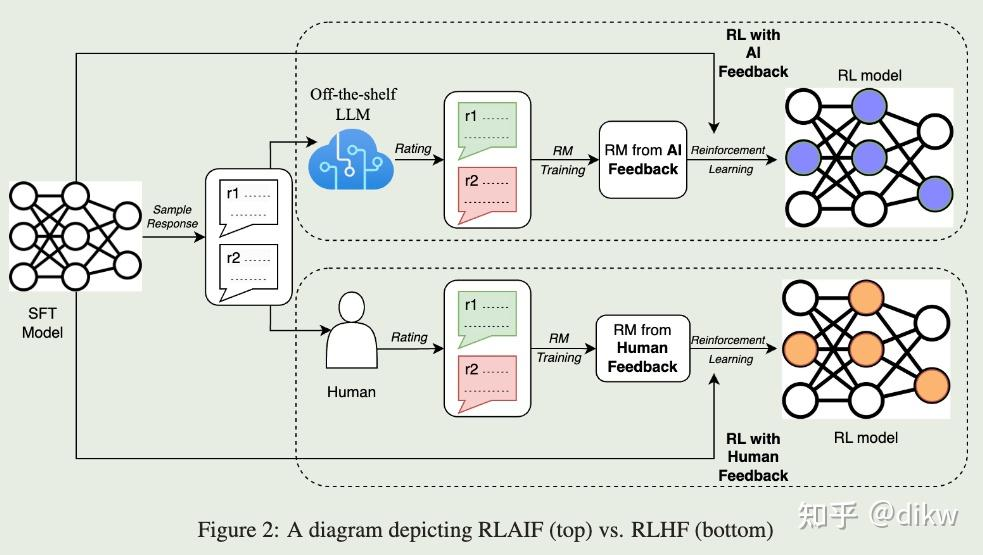
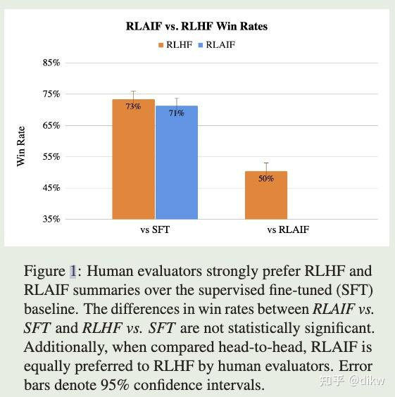
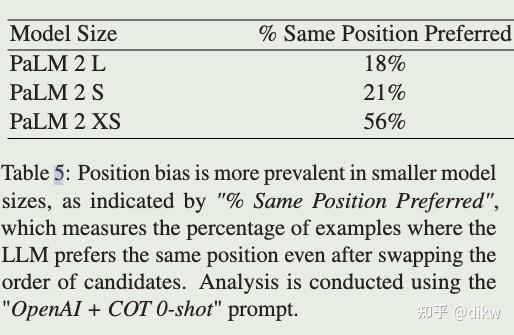
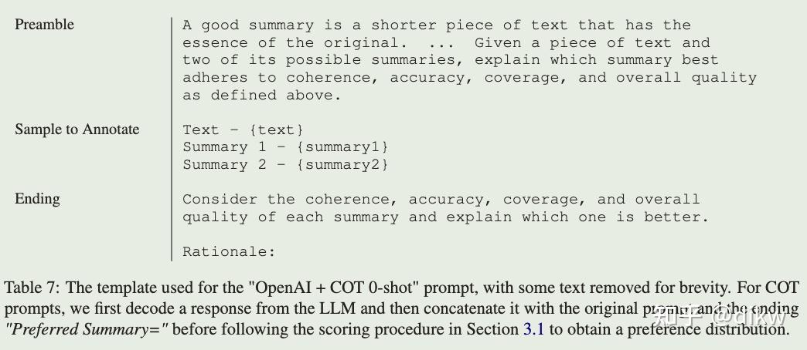
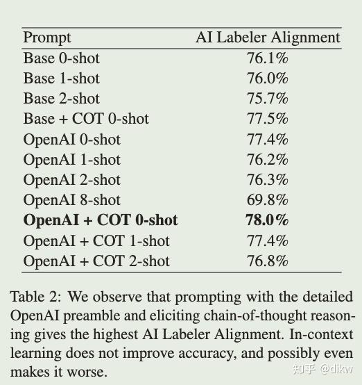
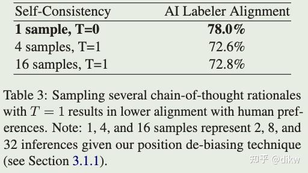
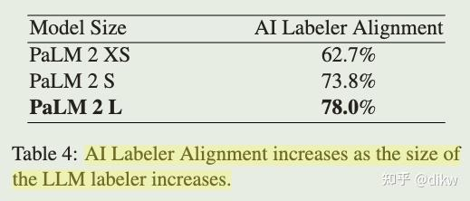
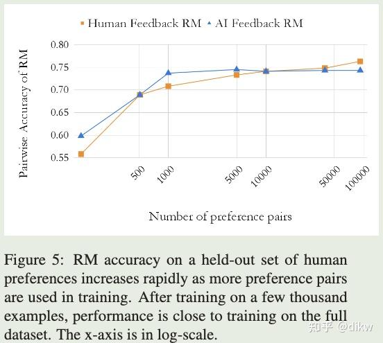

# RLAIF细节分享 个人想法
> _**作者: 过拟合**_
> 
> _**原文:**_ [_**https://zhuanlan.zhihu.com/p/657436655**_](https://zhuanlan.zhihu.com/p/657436655)

写在前面
----

论文地址：[RLAIF: Scaling Reinforcement Learning from Human Feedback with AI Feedback](https://link.zhihu.com/?target=https%3A//arxiv.org/abs/2309.00267)

RLAIF论文作者来自Google Research团队。当笔者首次在arxiv上发现RLAIF这篇文章时，立即将其加入了收藏夹，但由于种种原因，一直没有机会深入研读。在之前的项目中，笔者曾使用开源数据进行了一系列的强化学习实验，并验证了RL算法确实有一定的提升。然而，**当项目进入实际应用阶段，我们常常面临一个问题：缺乏足够的人力进行数据标注。这不仅增加了项目的复杂性，还使得我们很难尝试如PPO、DPO等先进算法。漫长反复的人力标注过程也是一个不容忽视的挑战。**

RLAIF（基于AI反馈的强化学习）切好解决了这些困难，这也是让我重新研读这篇文章的原因。

RLAIF（基于AI反馈的强化学习）解决了以下问题：

*   **收集高质量人类偏好标签的瓶颈问题**：尽管基于人类反馈的强化学习（RLHF）在将大型语言模型（LLMs）与人类偏好对齐方面非常有效，但收集高质量的人类偏好标签是一个关键瓶颈。

RLAIF的最大贡献是：

*   **提供一个潜在的替代方案**：**RLAIF使用现成的LLM来标记偏好，而不是依赖人类**。研究发现，RLAIF和RLHF在改进方面产生了类似的结果。具体来说，对于摘要任务，人类评估者在大约70%的情况下更喜欢RLAIF和RLHF的输出，而不是基线的有监督微调模型。
*   **证明**[**AI反馈**](https://zhida.zhihu.com/search?content_id=234225977&content_type=Article&match_order=3&q=AI%E5%8F%8D%E9%A6%88&zhida_source=entity)**的有效性**：当比较RLAIF和RLHF摘要时，人类对两者都表示出相同的偏好。这意味着使用AI反馈进行训练可以达到与使用人类反馈相似的性能，从而为RLHF的[可扩展性](https://zhida.zhihu.com/search?content_id=234225977&content_type=Article&match_order=1&q=%E5%8F%AF%E6%89%A9%E5%B1%95%E6%80%A7&zhida_source=entity)问题提供了一个潜在的解决方案。

**RLAIF的引入为强化学习提供了一个新的、可扩展的方法，该方法不依赖于昂贵和时间消耗的人类标签收集，但仍然可以达到与人类反馈相似的性能。**

RLAIF 与RLHF 流程图

**RLAIF vs RLHF的结果**
--------------------

*   RLAIF与RLHF的性能相当。具体来说，人类评估者分别在71%和73%的时间内更喜欢RLAIF和RLHF策略，而不是有监督的微调（SFT）基线。这两个胜率没有统计学上的显著差异。
*   当直接比较RLAIF和RLHF生成的内容时，人类对两者的偏好率相等（即50%的胜率）。
*   这些结果表明，RLAIF是一个可行的RLHF替代方案，不依赖于人类注释，并具有吸引人的扩展性。

RLAIF与RLHF效果对比

如何让AI标注偏好数据的效果和人类标注保持一致？
------------------------

### **Addressing Position Bias (解决位置偏见)**:

LLM可能会受到候选顺序的影响。为了减轻这种位置偏见，对每对候选进行两次推断，其中候选的顺序在第二次推断中被反转。然后平均两次推断的结果以获得最终的偏好分布。**越大的模型位置偏见越小。**

位置偏见

### **Chain-of-thought Reasoning (链式思考推理)**

为了提高与人类偏好的[对齐度](https://zhida.zhihu.com/search?content_id=234225977&content_type=Article&match_order=1&q=%E5%AF%B9%E9%BD%90%E5%BA%A6&zhida_source=entity)，通过prompt激发LLM的COT能力。在zero-shot prompt中没有给出LLM的标注过程的推理应该是什么样，在few-shot中作者提供了一些模型推理的例子来让让LLM遵循。

COT模版

**最好的prompt是COT-zero shot 无论是基于PALM还是OPEN AI。**

不同prompt设置对比

### **Self-Consistency (自我一致性)**

对于链式思考提示，还尝试了自我一致性技术，解码的时候temperature设置成大于0,采样多个推理路径并汇总每个路径末尾产生的最终答案进行**平均**来改进链式思考推理。**当temperate=1的时候，LLM标注效果和人类的一致性比较差，这意味着temperate设置在0到1之间比较好**。

Self-Consistency实验

### 标注模型大小的影响？

**模型大小与对齐度之间存在强烈的关系，模型越大标注偏好与人类的一致性越高**。当从PaLM 2 Large 移动到PaLM 2 Small (S)时，对齐度下降了4.2%，当进一步移动到PaLM 2 XS时，又下降11.1%。这一趋势与其他研究中观察到的规模定律一致。性能下降的一个可能原因是较小的LLM中位置偏见的增加。从这一趋势的末端来看，这些结果还表明，增大AI标记者的大小可能会产生更高质量的偏好标签。

模型越大，LLM与人类标注一致性越高

实验细节
----

### 数据

使用OpenAI策划的过滤后的Reddit TL;DR（Too Long; Didn't Read）数据集。TL;DR包含Reddit上的约3百万篇帖子，涵盖了各种主题，并附有原作者编写的帖子摘要。为确保数据的高质量，OpenAI进一步过滤了数据，这包括使用一个白名单，其中的[subreddits](https://zhida.zhihu.com/search?content_id=234225977&content_type=Article&match_order=1&q=subreddits&zhida_source=entity)对普通人来说是可以理解的。此外，只包括摘要在24到48个令牌之间的帖子。过滤后的数据集包含123,169篇帖子，其中约5%被留作[验证集](https://zhida.zhihu.com/search?content_id=234225977&content_type=Article&match_order=1&q=%E9%AA%8C%E8%AF%81%E9%9B%86&zhida_source=entity)。关于数据集的更多细节可以在原始论文中找到。此外，OpenAI从过滤后的TL;DR数据集中策划了一个人类偏好数据集。对于给定的帖子，从不同的策略生成了两个候选摘要，然后要求标签者评价他们更喜欢哪个摘要。整个数据集包括约92k pair 对比较数据。

### LLM标注

为了评估AI[标记技术](https://zhida.zhihu.com/search?content_id=234225977&content_type=Article&match_order=1&q=%E6%A0%87%E8%AE%B0%E6%8A%80%E6%9C%AF&zhida_source=entity)（如提示、自我一致性）的有效性，我们从TL;DR（Too Long; Didn't Read）偏好数据集中选择了那些人类注释者对一个摘要比另一个摘要更有信心的示例。我们在数据集的训练分割的随机15%子集上评估AI标记者对齐度，以便更快地进行实验迭代，为评估提供了2851个示例。对于奖励模型的训练TL;DR偏好数据集的完整训练分割由LLM标记并用于训练，而不考虑信心分数。我们使用PaLM 2作为我们的LLM来标记偏好。除非另有说明，我们使用Large模型大小，最大上下文长度为4096个令牌。对于链式思考生成，我们设置了最大解码长度为512个令牌，并使用温度T = 0进行采样（即[贪婪解码](https://zhida.zhihu.com/search?content_id=234225977&content_type=Article&match_order=1&q=%E8%B4%AA%E5%A9%AA%E8%A7%A3%E7%A0%81&zhida_source=entity)）。对于自我一致性实验，我们使用温度T = 1进行top-K采样，K=40。

### 模型训练

在OpenAI的过滤后的TL;DR（Too Long; Didn't Read）数据集，使用PaLM 2 Extra-Small 训练SFT模型。然后，我们从SFT模型初始化我们的奖励模型，并在OpenAI的TL;DR人类偏好数据集上训练它们。对于第5.1节和表1中的结果，我们使用PaLM 2 Large生成AI标记的偏好，使用OpenAI + COT 0-shot提示而不使用自我一致性，然后在完整的偏好数据集上训练奖励模型。对于强化学习，我们按照附录B中的描述使用Advantage Actor Critic (A2C)训练策略。策略和[价值模型](https://zhida.zhihu.com/search?content_id=234225977&content_type=Article&match_order=1&q=%E4%BB%B7%E5%80%BC%E6%A8%A1%E5%9E%8B&zhida_source=entity)都是从SFT模型初始化的。我们使用过滤后的Reddit TL;DR数据集作为初始状态来展开我们的策略。

### RM 模型上面两种方法的对比

LLM标注数据训练的RM的性能在训练几千个示例后迅速趋于稳定。当仅在128个示例上训练时，RM达到了约60%的准确性，然后当只用5,000个示例（大约是完整数据集的1/20）训练时，准确性接近于在完整数据集上的训练。对于在人类标注数据训练的RM和LLM标注训练的RM遵循相似的缩放曲线。**一个不同之处是，随着训练示例数量的增加，人类标注偏好数据训练的RM似乎持续改进，尽管更多的训练示例只为准确性带来了小幅的提高。这一趋势表明，与在人类偏好上训练的RM相比，基于AI偏好训练的RM可能不会从增加训练示例数量中受益很多。**

RM 在LLM标注样本与人类标注样本的准确率对比

### SFT-RM- RL 训练超参设置

*   **SFT ： lr=1e-5 , max\_input\_lenght=128, ouput\_lenght=1024**
*   **RM : 3 epochs , le=1e-5 ,batch\_size=128**
*   **RL： Temperature=0.9 to encourage exploration . batch\_size=128, epochs=8, set β = 0.05for the KL divergence loss.**

RLAIF VS RLHF 生成质量分析与对比
-----------------------

为了更好地理解RLAIF与RLHF之间的比较，我们手动检查了两种策略生成的摘要。在许多情况下，两种策略产生了相似的摘要，这在它们的相似胜率中得到了体现。然而，我们也发现了两种策略在某些情况下的不同之处：

1.  **幻觉问题**：**RLAIF似乎比RLHF更不容易产生幻觉。RLHF中的幻觉通常是合理的，但与原文不一致**。例如，RLHF的摘要可能会提到作者是20岁，但原文并没有提及或暗示这一点。
2.  **连贯性和语法问题**：**RLAIF有时会生成的摘要在连贯性或语法上不如RLHF**。例如，RLAIF的摘要可能会产生连续的句子。

尽管每种策略都有某些倾向，但两者都能产生高质量的摘要，且相对相似。

总结&个人想法
-------

RLAIF的方法利用了大型语言模型的能力来生成训练数据，这为强化学习提供了一个有趣的新途径，特别是在缺乏标注人力或者开发时间比较紧的情况下。这种方法的潜在优势在于它可能减少了对大量人工标注的需求，从而加速了模型的训练和部署。同时也存在一些需要注意的问题：

1.  **数据质量**：虽然[大型语言模型](https://zhida.zhihu.com/search?content_id=234225977&content_type=Article&match_order=3&q=%E5%A4%A7%E5%9E%8B%E8%AF%AD%E8%A8%80%E6%A8%A1%E5%9E%8B&zhida_source=entity)（LLM）在许多任务上表现出色，但生成的数据质量仍然可能受到限制。比如，LLM可能会产生与原始内容不一致的输出或包含错误的信息。因此，确 保AI生成的偏好数据的质量至关重要。
2.  **计算成本**：虽然RLAIF方法可能减少了对人工标注的需求，但使用LLM生成数据仍然可能需要大量的计算资源。并且可能要求非常大的效果非常好的LLM来进行偏好数据的标注，比如使用gpt3.5或者gpt4接口进行标注。