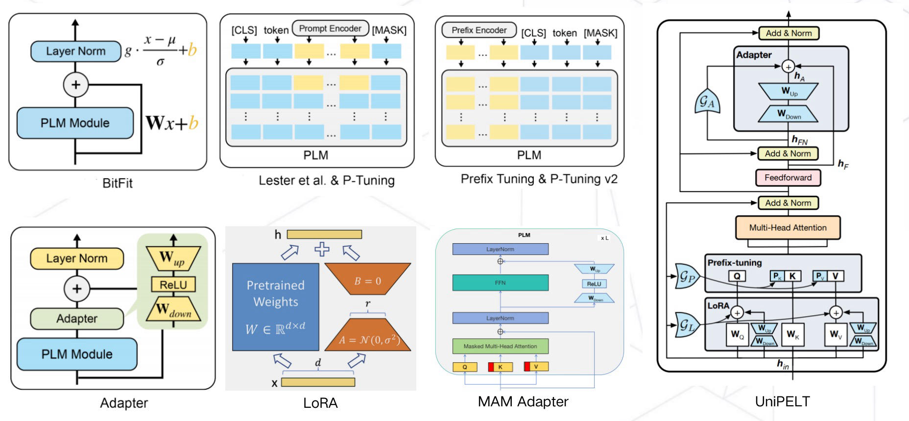

# LLM参数高效微调技术原理
> 对于普通大众来说，进行大模型的预训练或者全量微调遥不可及。由此，催生了各种参数高效微调技术，让科研人员或者普通开发者有机会尝试微调大模型。

> 因此，该技术值得我们进行深入分析其背后的机理，本系列大体分七篇文章进行讲解。

*   [大模型参数高效微调技术原理综述（一）-背景、参数高效微调简介](https://zhuanlan.zhihu.com/p/635152813)
*   [大模型参数高效微调技术原理综述（二）-BitFit、Prefix Tuning、Prompt Tuning](https://zhuanlan.zhihu.com/p/635686756)
*   [大模型参数高效微调技术原理综述（三）-P-Tuning、P-Tuning v2](https://zhuanlan.zhihu.com/p/635848732)
*   [大模型参数高效微调技术原理综述（四）-Adapter Tuning及其变体](https://zhuanlan.zhihu.com/p/636038478)
*   [大模型参数高效微调技术原理综述（五）-LoRA、AdaLoRA、QLoRA](https://zhuanlan.zhihu.com/p/636215898)
*   [大模型参数高效微调技术原理综述（六）-MAM Adapter、UniPELT](https://zhuanlan.zhihu.com/p/636362246)
*   [大模型参数高效微调技术原理综述（七）-最佳实践、总结](https://zhuanlan.zhihu.com/p/649755252)