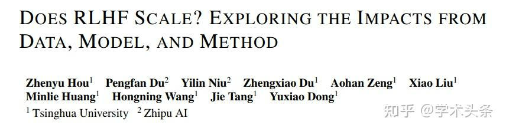
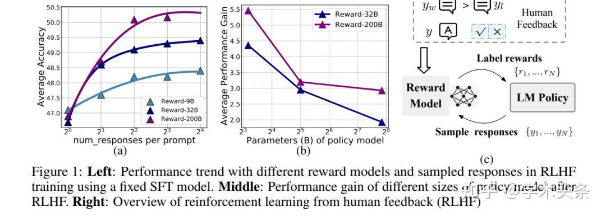
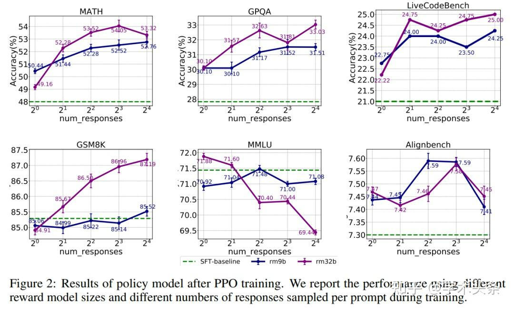
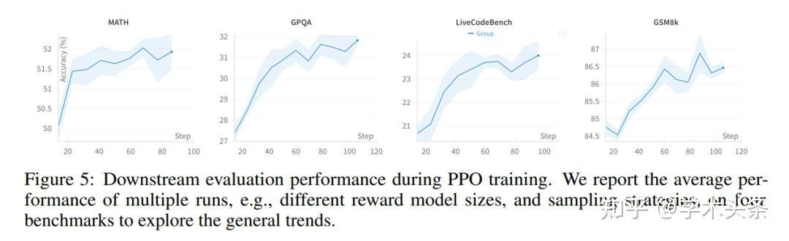
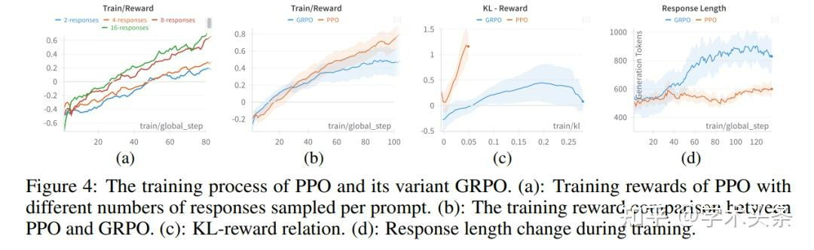
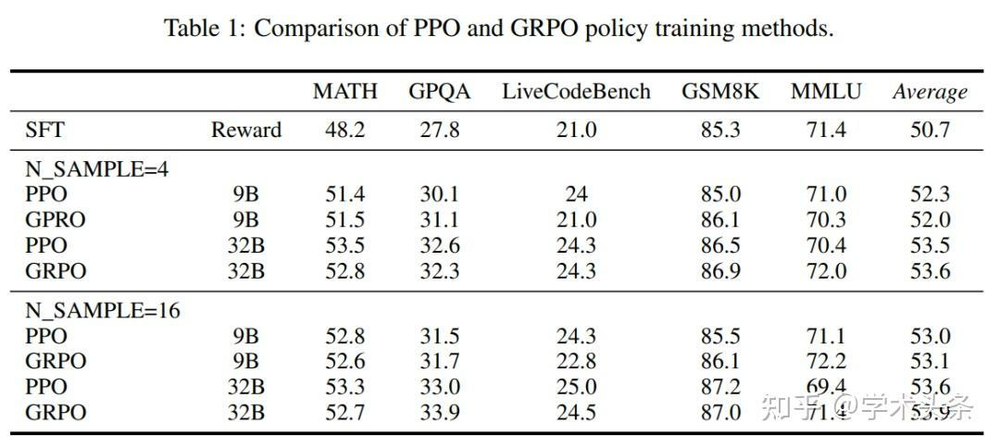
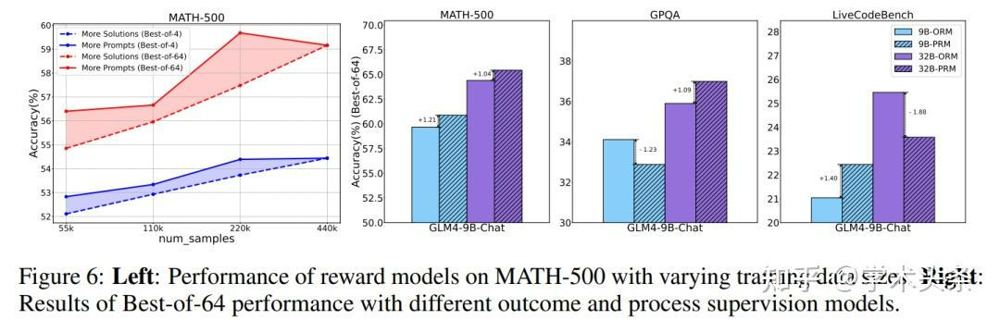

# 清华、智谱团队&探索&RLHF&的&scaling&laws
* * *

created: 2025-01-24T00:20 updated: 2025-01-26T02:05
---------------------------------------------------

> _**作者: 学术头条**_
> 
> _**原文:**_ [_**https://zhuanlan.zhihu.com/p/14349529199**_](https://zhuanlan.zhihu.com/p/14349529199)

基于人类反馈的强化学习（RLHF）是优化大语言模型（[LLM](https://zhida.zhihu.com/search?content_id=251892711&content_type=Article&match_order=1&q=LLM&zhida_source=entity)）行为的关键技术，能够让模型更符合人类偏好和需求，提升生成质量。

然而，**目前关于 RLHF 的** [**scaling**](https://zhida.zhihu.com/search?content_id=251892711&content_type=Article&match_order=1&q=scaling&zhida_source=entity)（扩展）潜力研究仍然相对缺乏，尤其是在模型大小、数据组成和推理预算等关键因素上的影响尚未被系统性探索。

针对这一问题，**来自清华大学与**[**智谱**](https://zhida.zhihu.com/search?content_id=251892711&content_type=Article&match_order=1&q=%E6%99%BA%E8%B0%B1&zhida_source=entity)**的研究团队对 RLHF 在 LLM 中的 scaling 性能进行了全面研究，并提出了优化策略**。

主要结论如下：

*   **数据的多样性和规模**：增加训练数据的多样性和数量能够显著提升奖励模型（RM）的性能；
*   **策略训练的效率**：初期增加响应样本能够提高策略训练效果，但收益会迅速趋于平稳；
*   **RLHF 的 scaling 效率低于预训练**：RLHF 的计算资源投入带来的[回报递减](https://zhida.zhihu.com/search?content_id=251892711&content_type=Article&match_order=1&q=%E5%9B%9E%E6%8A%A5%E9%80%92%E5%87%8F&zhida_source=entity)，整体 scaling 效率低于模型预训练阶段。

这一研究为优化 RLHF 在 LLM 中的应用提供了重要指导，也揭示了其在 scaling 性能上的潜在瓶颈。

研究方法
----

研究团队首先描述了 RLHF 中的关键组件，然后遵循 RLHF 的一般框架进行了实证研究。

值得注意的是，研究团队采取的研究方法有几个特殊之处。首先，他们使用[多任务](https://zhida.zhihu.com/search?content_id=251892711&content_type=Article&match_order=1&q=%E5%A4%9A%E4%BB%BB%E5%8A%A1&zhida_source=entity)目标训练一个统一模型，用于人类偏好和推理任务，而不是训练多个单独的奖励模型。其次，在策略训练期间，他们对每个提示采样多个响应，并应用额外的奖励剪切和归一化，从而得到更稳定的策略训练。

> 图｜使用固定监督微调（SFT）模型进行 RLHF 训练时，不同奖励模型和采样反应的性能趋势（左）；RLHF 后不同大小的策略模型的性能增益（中间）。RLHF 概述（右）。

**1.奖励模型训练**

奖励模型的训练是[生成式 AI](https://zhida.zhihu.com/search?content_id=251892711&content_type=Article&match_order=1&q=%E7%94%9F%E6%88%90%E5%BC%8F+AI&zhida_source=entity) 优化的重要环节，近期研究为这一领域带来了新启发，揭示了模型规模、数据扩展以及过程监督对性能提升的深远影响。

奖励模型的核心任务是基于用户偏好预测最优响应。在训练过程中，模型通过学习偏好[数据集](https://zhida.zhihu.com/search?content_id=251892711&content_type=Article&match_order=1&q=%E6%95%B0%E6%8D%AE%E9%9B%86&zhida_source=entity)，判断用户对不同生成内容的偏好顺序，并以此优化生成结果。尤其是在需要推理能力的任务中（如数学解题、编程等），正确答案通常非常清晰，因此他们提出了更高效的[二分类](https://zhida.zhihu.com/search?content_id=251892711&content_type=Article&match_order=1&q=%E4%BA%8C%E5%88%86%E7%B1%BB&zhida_source=entity)处理方法，同时结合偏好学习，使模型更精准地理解问题本质。

他们还重点探索了过程奖励模型（PRM），这是一种针对复杂推理任务的新型训练方式。过程奖励模型除了关注最终生成结果的优劣，还对生成过程中的每一步进行监督，从而提高模型在复杂推理任务中的表现。这一方式通过自动[标注工具](https://zhida.zhihu.com/search?content_id=251892711&content_type=Article&match_order=1&q=%E6%A0%87%E6%B3%A8%E5%B7%A5%E5%85%B7&zhida_source=entity)生成中间步骤的过程监督信号，为模型学习推理逻辑提供了支持。

**研究的主要问题集中于模型规模和数据 scaling 的影响：**

*   随着训练数据量的增加及数据多样性的提高，奖励模型的效果是否会显著改善？
*   增加过程监督的复杂度是否能够带来长期性能优势？

这些问题的答案将为生成式 AI 系统的优化提供重要参考。

**2.策略模型训练**

策略模型训练是生成式 AI 模型优化中的关键环节，其目标是通过最大化模型生成的响应质量，从而实现更高的奖励分数。在这一过程中，训练涉及多个核心模型，包括提供反馈的奖励模型、进行优化的策略模型、用于正则化的[参考模型](https://zhida.zhihu.com/search?content_id=251892711&content_type=Article&match_order=1&q=%E5%8F%82%E8%80%83%E6%A8%A1%E5%9E%8B&zhida_source=entity)，以及用于训练稳定性的可选评论模型。

策略模型的训练采用实时生成的响应，而非预先生成的固定答案。每次针对提示生成多个响应，通过奖励模型对这些响应进行评分并归一化处理，使得奖励更加稳定可靠。这种多响应采样的方式提高了提示数据的利用率，同时为策略模型的优化提供了更多[训练样本](https://zhida.zhihu.com/search?content_id=251892711&content_type=Article&match_order=1&q=%E8%AE%AD%E7%BB%83%E6%A0%B7%E6%9C%AC&zhida_source=entity)。

为了防止策略模型偏离初始 SFT 模型而导致性能退化，训练中引入了 KL 散度惩罚机制。这一方法通过限制策略模型与参考模型之间的偏差，确保优化过程的稳定性。此外，策略模型的优化通常使用强化学习的近端策略优化（PPO）方法及其变体，这种保守的训练方式能够避免不稳定的学习现象。

研究团队还提出了一种“非对称奖励收缩”技术，用于应对负奖励带来的训练不稳定问题。通过对负奖励进行非对称缩小，策略模型在训练过程中表现出更强的稳定性，并显著提高了训练效果。

**研究的主要问题聚焦于策略模型的**[**规模效应**](https://zhida.zhihu.com/search?content_id=251892711&content_type=Article&match_order=1&q=%E8%A7%84%E6%A8%A1%E6%95%88%E5%BA%94&zhida_source=entity)**与优化策略**：

*   较大的策略模型是否能够在现有的奖励模型和训练策略下获得更多收益？
*   增加每个提示的响应数量或引入更多提示数据，是否对优化过程有帮助？
*   更大的奖励模型或不同的强化学习算法对最终性能有多大影响？

这些探索将帮助研究者更好地理解策略模型训练中的关键因素，为进一步优化 AI 的生成质量提供有力支持。通过深入研究这些问题，生成式 AI 将向更高效、更精准的方向发展。

实验结果
----

为进一步优化奖励模型和策略模型，研究团队设计了一套全面的实验设置，涵盖数据构建、训练配置和[性能评估](https://zhida.zhihu.com/search?content_id=251892711&content_type=Article&match_order=1&q=%E6%80%A7%E8%83%BD%E8%AF%84%E4%BC%B0&zhida_source=entity)等方面。

首先，研究团队通过实验探索了策略模型训练过程中响应采样数量对模型性能的影响，进一步明确如何优化生成式 AI 的训练过程。实验采用 PPO 方法，对每个提示分别采样 1、2、4、8 和 16 个响应，并确保训练过程中的梯度更新步数保持一致，以便不同采样设置的结果具有可比性。采样的响应用于计算奖励反馈，指导策略模型的优化。

实验结果显示，随着每个提示采样的响应数量增加，模型在大多数任务中的性能都有明显提升。研究指出，这一趋势表明，更多样化的响应为策略模型提供了更丰富的奖励信号，使其能够更全面地学习不同情况下的优化策略，从而在整体性能上获得提升。

> 图｜PPO 训练后的策略模型结果。

在奖励模型规模上，实验发现较大的奖励模型（如 32B 参数）在推理相关任务（如 MATH、[GPQA](https://zhida.zhihu.com/search?content_id=251892711&content_type=Article&match_order=1&q=GPQA&zhida_source=entity) 和LiveCodeBench）中表现更优。然而，这种优势并非在所有任务中都存在。对于依赖于模型预训练的 MMLU 任务，大规模奖励模型在增加采样时反而可能引入更多对齐成本；在 AlignBench 中，小规模奖励模型甚至表现更佳，这可能与大模型对训练数据中的噪声更敏感有关。

训练数据量方面的实验显示，虽然强化学习可以通过优化奖励逐步提升策略模型的性能，但下游任务的性能改进在早期阶段表现较为显著，随后迅速趋于平稳。与[预训练](https://zhida.zhihu.com/search?content_id=251892711&content_type=Article&match_order=4&q=%E9%A2%84%E8%AE%AD%E7%BB%83&zhida_source=entity)和监督微调相比，当前的 RLHF 方法在缩放提示数据量上未能带来显著的性能提升。

> 图｜PPO 训练期间的下游评估绩效。

策略模型规模方面，实验显示，随着策略模型规模从 9B 增长至 200B，其从 RLHF 训练中获得的性能提升逐渐减小。例如，在使用 32B 奖励模型时，性能增益从 4.4% 下降到 1.9%。这一现象表明，在现有 RLHF 框架下，较大的策略模型受益更少，甚至可能出现逆向 scaling 的情况。

**研究团队还比较了 PPO 和 GRPO 两种训练算法**，发现它们在最终性能上差异较小，但表现出了不同的训练行为。例如，PPO 的奖励增加较为稳定，而 GRPO 在训练过程中显著增加了策略模型与[初始模型](https://zhida.zhihu.com/search?content_id=251892711&content_type=Article&match_order=1&q=%E5%88%9D%E5%A7%8B%E6%A8%A1%E5%9E%8B&zhida_source=entity)的发散性，并导致响应长度的明显增长。

> 图｜PPO 及其变体 GRPO 的训练过程。

> 图｜PPO 和 GRPO 策略训练方法的比较。

此外，**研究团队针对奖励模型的训练，从数据多样性与规模、过程奖励与结果奖励两个角度展开了详细研究**。

在数据多样性与规模方面，研究团队在数学任务中设置了不同规模和多样性的训练数据进行实验。结果表明，增加训练提示的多样性比为单一提示生成更多响应更能提升奖励模型的表现。在固定响应数量的前提下，提升提示多样性带来的性能改进近乎线性增长，尤其是在资源有限的情况下，优先收集多样化的提示数据比单纯缩放响应数量更有效。因此，为了优化奖励模型的性能，研究建议将重点放在提高训练数据的多样性上。

在过程奖励与结果奖励方面，研究团队对比了针对数学推理任务设计的过程奖励模型和适用于广泛任务的结果奖励模型（ORM）。实验发现，在数学任务（如MATH-500）中，过程奖励模型的表现显著优于结果奖励模型，尤其是在复杂评估（如 Best-of-64）的条件下。

然而，对于缺乏过程监督训练数据的任务（如 GPQA 和 LiveCodeBench），过程奖励模型的表现不如结果奖励模型稳定。基于这些发现，研究团队在此前的策略训练实验中主要使用了结果奖励模型。

> 图｜不同训练数据量的奖励模型在 MATH-500 上的表现（左）。不同结果和过程监督模型的 Best-of-64 性能结果（右）。

研究表明，奖励模型的性能可以通过多样化的提示数据和针对性优化的过程监督得到显著提升，但在不同任务间的[泛化能力](https://zhida.zhihu.com/search?content_id=251892711&content_type=Article&match_order=1&q=%E6%B3%9B%E5%8C%96%E8%83%BD%E5%8A%9B&zhida_source=entity)仍需进一步探索和优化。

未来展望
----

研究团队通过对 RLHF 训练过程的深入分析，总结出性能提升的关键因素，包括**增加响应采样数量、更大规模的奖励模型、更丰富的提示数据以及引入过程监督**。其中，更多的响应采样和更大规模的奖励模型在推理任务中表现尤为显著，而多样化的提示数据则提升了模型的任务适应性。

然而，**研究也揭示了现有 RLHF 方法的局限性**：性能提升随着计算资源的增加逐渐趋于饱和，大规模策略模型的提升效果有限，主要原因可能在于奖励模型精度不足，导致训练中引入了较大的噪声。此外，跨任务生成过程监督的有效方法仍未成熟，这限制了其在多任务场景中的应用。

研究团队指出，**当前 RLHF 方法无法实现像预训练那样的 scaling 效率**，未来的研究应集中于**提升奖励建模的准确性、减少训练过程中的噪声干扰，并探索更具扩展性和通用性的训练方法**。