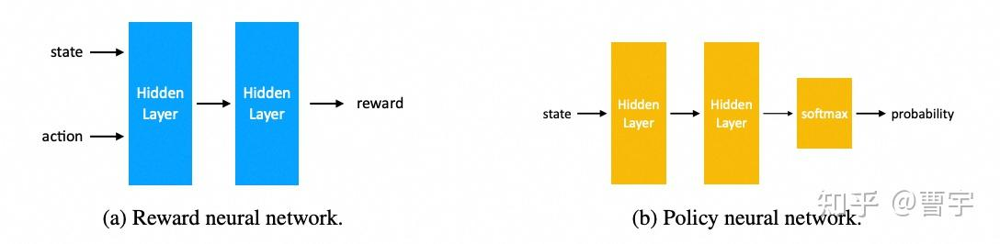

# DPO，RM，RLHF 傻傻分不清楚
> _**作者: 曹宇**_ 
> 
> _**原文:**_ [_**https://zhuanlan.zhihu.com/p/718913850**_](https://zhuanlan.zhihu.com/p/718913850)

DPO 的论文引用最近已经破千了，成了斯坦福的[Chelsea Finn](https://zhida.zhihu.com/search?content_id=247888363&content_type=Article&match_order=1&q=Chelsea+Finn&zhida_source=entity)组的机器人超猛PhD学生R.M. Rafailov的第一被引论文。又由于第二梯队的大模型频繁提及DPO的变种，DPO+RM的用法未来估计机器人界的思潮对于[LLM](https://zhida.zhihu.com/search?content_id=247888363&content_type=Article&match_order=1&q=LLM&zhida_source=entity)的正向影响不会削弱。

按照我平时使用的体验，我们可以将当前的主要头部三强划分为第一梯队，头部开源三强划分成为第二梯队，再加上我一直比较关心的应用侧玩家[Apple](https://zhida.zhihu.com/search?content_id=247888363&content_type=Article&match_order=1&q=Apple&zhida_source=entity):

| 模型  | 对齐算法 | 使用 [Reward Model](https://zhida.zhihu.com/search?content_id=247888363&content_type=Article&match_order=1&q=Reward+Model&zhida_source=entity) | 多阶段对齐 |
| --- | --- | --- | --- |
| Claude Sonnet 3.5 | RL [PPO](https://zhida.zhihu.com/search?content_id=247888363&content_type=Article&match_order=1&q=PPO&zhida_source=entity) | 是   | 未知  |
| [OpenAI GPT-4o](https://zhida.zhihu.com/search?content_id=247888363&content_type=Article&match_order=1&q=OpenAI+GPT-4o&zhida_source=entity) | RL PPO | 是   | 未知  |
| Gemini Pro | RL REINFORCE | 是   | 是   |
| Deepseek-V2 | RL GRPO | 是   | 是   |
| Llama3.1 | DPO+RM | 是   | 是   |
| Qwen2 | DPO+RM | 是   | 是   |
| Apple Intelligence | RL MDLOO | 是   | 是   |

可以发现几点：

1.  超头部玩家的对齐策略清一色的还是RL类方法
2.  开源头部玩家采用DPO的较多
3.  不论是什么PO，基本都是采用了和RM结合的xPO + RM的做法，没有纯原始DPO的玩法
4.  大多数对齐玩家都使用了多阶段对齐的策略

这个其实就让很多小伙伴很疑惑了，明明DPO的宣言是\_Your language model is secretly a reward model\_为啥在实际操作的过程中还是需要一个训练好的RM才能work呢？DPO原始论文中的做法，也是直接将偏好对在SFT之后的LLM上训练就取得了甚至超过PPO的做法，为什么在实际的实操中几乎没有头部大模型复现出来这个成果呢？同时更为让人吃惊的是DPO作为[off-policy算法](https://zhida.zhihu.com/search?content_id=247888363&content_type=Article&match_order=1&q=off-policy%E7%AE%97%E6%B3%95&zhida_source=entity)，原理上可以直接使用专家示教做类似[imitation learning](https://zhida.zhihu.com/search?content_id=247888363&content_type=Article&match_order=1&q=imitation+learning&zhida_source=entity)的，但是实际上几乎所有的训练范式都在朝着on-policy的方向走呢？

带着这些疑问，我们可以尝试从最近的一些非常确定的技术趋势和研究来看一看，以帮助我们真正理解什么是[大语言模型](https://zhida.zhihu.com/search?content_id=247888363&content_type=Article&match_order=1&q=%E5%A4%A7%E8%AF%AD%E8%A8%80%E6%A8%A1%E5%9E%8B&zhida_source=entity)的对齐，从而帮助我们在实操的过程中积累正确的技术判断能力。

[Discriminator](https://zhida.zhihu.com/search?content_id=247888363&content_type=Article&match_order=1&q=Discriminator&zhida_source=entity)\-Generator Gap，现代偏好学习的基础
--------------------------------------------------------------------------------------------------------------------------------------------------------------------

我们知道在老的[GAN](https://zhida.zhihu.com/search?content_id=247888363&content_type=Article&match_order=1&q=GAN&zhida_source=entity)时代，训练一个模型的方法是使用generator和[discriminator](https://zhida.zhihu.com/search?content_id=247888363&content_type=Article&match_order=1&q=discriminator&zhida_source=entity)对抗的方式完成的。generator尽量产生让discriminator无法判别出好坏的的样本，而discriminator D则尽量尝试识别generator G的样本。

这里面有一个细节，就是我们在利用D-G gap的时候，D和G的更新不是同步做的。D的更新在内环，第三步就做了，而G的更新在外环第五步才做。为什么要这么做呢？因为如果同时更新D和G，对抗的loss会同时反向传播到这两个网络，从梯度上来看D和G的微小gap就弥散在了整个网络里，对抗的效率容易打折扣。

那么传统的[RLHF](https://zhida.zhihu.com/search?content_id=247888363&content_type=Article&match_order=1&q=RLHF&zhida_source=entity)是怎么做的呢，最早版本的[online PPO（InstructGPT）](https://zhida.zhihu.com/search?content_id=247888363&content_type=Article&match_order=1&q=online+PPO%EF%BC%88InstructGPT%EF%BC%89&zhida_source=entity)之前的早古版本。是通过固定训练时的discriminator实现的，generator做完整个epoch的[rollout](https://zhida.zhihu.com/search?content_id=247888363&content_type=Article&match_order=1&q=rollout&zhida_source=entity)之后再样本送人标。后期由于online版本的送标成本高，就采用了offline的RM代替了人类discriminator。这种做法也是在**一定时间段内固定**discriminator的方式，来留给generator足够的时间机会进行偏好学习。

直接同时学习偏好（discriminator）和行为（generator）的方式在原始的DPO论文中，被认为是超越PPO学习效率和效果的一种好的方式。

DPO在相同KL散度条件下的Reward更好，相同Temperature下的win rate更高

看起来从效果方面妥妥吊打了PPO这种比较复杂的算法，同时由于不需要训练单独的Reward Model似乎也是一个比较快见效的业务算法。

深入研究DPO和RL
----------

[https://openreview.net/pdf?id=lNEFatlsQb](https://openreview.net/pdf?id=lNEFatlsQb)

针对DPO在纸面上效果很好，打榜上效果很好，但是在实际业务中仍然需要RM辅助的状况。Ziniu博士比较早期的理论建模工作给出了一些解释：其中最主要的聚焦点在于三个（1）Reward Model建模任务的区别，（2）偏好数据不足导致的可能迁移，（3）纯离线数据推理的offline performance gap

第一点其实非常好理解，Reward Model作为一个神经网络而言，他的输入是state和action。也就是对应着之前的所有状态（对话历史），action则是模型最近一轮的输出，他的目标是输出对于state和action的reward估计。

而Policy network则是根据state输出对应token的概率，再加上合适的解码策略之后，变成合适的action。这两个网络从结构上看起来就不太一样，而这种不一样正是前面讲的discriminator和generator拥有gap的基础。

第二点则是在于Reward Model本身的泛化性，使得其能够在一定程度上外插一个没有见过的state和action给出自己的reward判断。这更多的是大语言模型本身的一些能力，加上足够的领域数据泛化出来的。对于DPO而言，要同时学行为和判断就已经不容易了，还要同时学行为和判断泛化就是难上加难了。不过这里更多的是理论上的，实验上的结论后面有。

最后一点则是RL领域的基本sense，在同样[on-policy](https://zhida.zhihu.com/search?content_id=247888363&content_type=Article&match_order=2&q=on-policy&zhida_source=entity)的条件下训练的online程度越高，对于模型来说学习的效果越好。传统DPO采用了比较大量的数据在训练早期进行了offline inference，这样的推理虽然可以很高效地获得大量样本，但是越到训练后期这些offline数据的off-policy程度越高。会造成生产的数据与正在优化的policy之间距离过大的问题，难以取得较好的效果。

一些近期实验上的例子
----------

Yong Lin在Apple实习期间详细研究了DPO的泛化性问题：

这里面主要是对于刚刚第二点进行了实验中的比较和理论阐释，[implicit reward model](https://zhida.zhihu.com/search?content_id=247888363&content_type=Article&match_order=1&q=implicit+reward+model&zhida_source=entity)这个比较抽象，其实简单点理解就是我们采用DPO的方法直接同时学偏好和行为的方式。

其实Apple做这种研究还是比较有道理的，对于这样海量的用户而言，用户的意图极为复杂，同时在prompt和response程度都会存在[distribution shift](https://zhida.zhihu.com/search?content_id=247888363&content_type=Article&match_order=1&q=distribution+shift&zhida_source=entity)的可能。同时目标也不是为了打各种[In-distribution](https://zhida.zhihu.com/search?content_id=247888363&content_type=Article&match_order=1&q=In-distribution&zhida_source=entity)的榜，所以我们可以看看他的实验结论作为参考。

我们首先再解释一下这里造出来的概念：[EXRM](https://zhida.zhihu.com/search?content_id=247888363&content_type=Article&match_order=1&q=EXRM&zhida_source=entity)就是[RL方法](https://zhida.zhihu.com/search?content_id=247888363&content_type=Article&match_order=1&q=RL%E6%96%B9%E6%B3%95&zhida_source=entity)中单独训练出来的RM，DPORM是假设BT loss之后的DPO训练之后 recover出来的[Reward值](https://zhida.zhihu.com/search?content_id=247888363&content_type=Article&match_order=1&q=Reward%E5%80%BC&zhida_source=entity)（DPO也可以得到reward的哦，很多同学忽视了这一点，直接拿着policy就去评测了）。

EXRM: $r(x, y) = \\max\_{\\phi} \\left( -\\mathbb{E}_{(x, y\_w, y\_l) \\sim D} \\left\[ \\log \\sigma(r_\\phi(x, y\_w)) - \\log \\sigma(r\_\\phi(x, y\_l)) \\right\] \\right)$

DPORM: $r(x, y) = \\beta \\log \\frac{\\pi\_{\\text{dpo}}(y|x)}{\\pi\_{\\text{ref}}(y|x)}$

这个实验是怎么做的呢？就是在控制变量的条件下，对于这两种RM建模的方式，混合了prompt shift（Reward Model没见过这种 prompt）， 以及 response shift（Reward Model 没见过这种回答）之后RM能达到的精度。可以发现用DPORM这种方式在ID（[in-distribution](https://zhida.zhihu.com/search?content_id=247888363&content_type=Article&match_order=1&q=in-distribution&zhida_source=entity)）的混合场景里面表现的还可以。但是一旦面向[OOD](https://zhida.zhihu.com/search?content_id=247888363&content_type=Article&match_order=1&q=OOD&zhida_source=entity)场景之后，RM的精度就急剧下降。同时对于OOD的response shift表现最差，难以匹配上EXRM的表现。而在控制变量的OOD变现中，EXRM比ID好95.2%。

这其实验证了刚刚讲的第二点，同时学习偏好和行为似乎没有一个专有网络专门学习偏好的效果好。尤其是我们期望的[RL scaling](https://zhida.zhihu.com/search?content_id=247888363&content_type=Article&match_order=1&q=RL+scaling&zhida_source=entity)领域，如果只能通过大量数据堆叠的方式完全覆盖偏好，是看不到做一个更通用[AI系统](https://zhida.zhihu.com/search?content_id=247888363&content_type=Article&match_order=1&q=AI%E7%B3%BB%E7%BB%9F&zhida_source=entity)的希望的。

在实际工作中该怎么做呢
-----------

Shusheng Xu 在ICML

[https://slideslive.com/39022063/is-dpo-superior-to-ppo-for-llm-alignment-a-comprehensive-study?ref=account-138648-presentations​slideslive.com/39022063/is-dpo-superior-to-ppo-for-llm-alignment-a-comprehensive-study?ref=account-138648-presentations](https://link.zhihu.com/?target=https%3A//slideslive.com/39022063/is-dpo-superior-to-ppo-for-llm-alignment-a-comprehensive-study%3Fref%3Daccount-138648-presentations)

的工作就很直接，大家可以仔细研究研究。和前面的互为补充，主要谈的是用DPO学policy可能有什么问题，我仔细展开说一下里面的思路。

假设我们现在有一个待优化的policy $π\_{ref}$ , 他在两个可能的actions $y1$ 和 $y2$ 的原始[概率分布](https://zhida.zhihu.com/search?content_id=247888363&content_type=Article&match_order=1&q=%E6%A6%82%E7%8E%87%E5%88%86%E5%B8%83&zhida_source=entity)大概是各占一半，假设我们按照偏好 $y1≻y2$ 给定这个模型进行优化。理想中我们希望拉高 $y1$ 降低 $y2$ ，其实这两种算法都能达到。但是我们特别想避免的是拉高一个[分布外](https://zhida.zhihu.com/search?content_id=247888363&content_type=Article&match_order=1&q=%E5%88%86%E5%B8%83%E5%A4%96&zhida_source=entity)的 $y3$ , 因为分布外的这个回答极有可能给我一个巨大的惊喜。

为什么DPO优化中允许这种情况发生呢？

因为从DPO的loss来看，这种优化目标太专注于通过压制 $y2$ 来获得chosen和reject的gap。对于分布外的样本其实根本不在这个优化目标的考虑范围内，如果 $y3$ 很好那么赚到，如果 $y3$ 不好，那也只能认赔。

那PPO就不会有这个问题了嘛？我们假设PPO的Reward Model就是有问题的，他就认为这个分布外的 $y3$ 最好。 从机制上就没有什么关系，因为假设我们采样到了这个回答，由于这个回答是分布外的，所以作为KL散度约束的分母，会把KL惩罚做的极大，消除所有reward的收益。

所以聪明的你估计已经看到了，针对在RM的不足，最好的方式是在DPO的时候加上RM的弥补[泛化性](https://zhida.zhihu.com/search?content_id=247888363&content_type=Article&match_order=3&q=%E6%B3%9B%E5%8C%96%E6%80%A7&zhida_source=entity)的不足。然后由于offline带来的DPO分布外的训练不足，需要尽量使得DPO的更新和迭代和PPO一样online化。从头部开源玩家的方法来看，迭代式DPO加RM似乎是一个比较奏效的打榜玩法。

但是问题就来了，DPO加了RM，加了on-policy，又加了online，好像再加一个advantage估计和baseline就是纯RL方法了。这个方法比RL还RL，为什么还叫DPO呢。