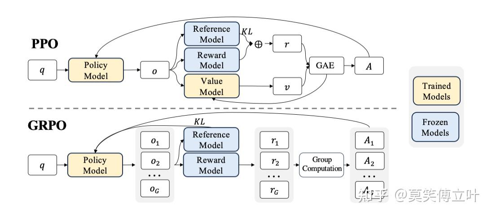
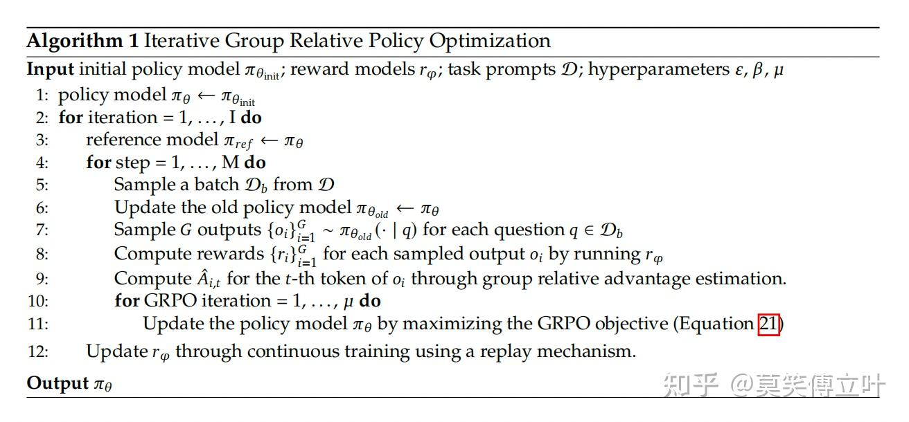
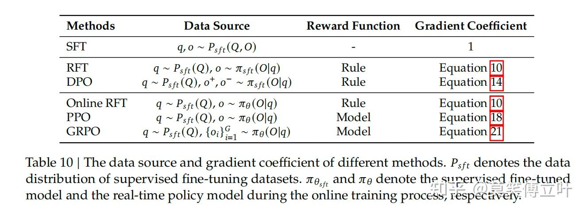

# Deepseek的RL算法GRPO解读
> _**作者: 莫笑傅立叶**_
> 
> _**原文: https://zhuanlan.zhihu.com/p/20565045592**_

从PPO到GRPO

近端策略优化（PPO）是一种 actor-critic 强化学习算法，广泛应用于大语言模型（LLM）的强化学习微调阶段。具体而言，它通过最大化以下替代目标来优化大语言模型：

\\(\\mathcal{J}\_{PPO}(\\theta) = \\mathbb{E}{\[q \\sim P(Q), o \\sim \\pi\_{\\theta\_{old}}(O|q)\]} \\frac{1}{|o|} \\\\ \\sum\_{t=1}^{|o|} \\min \\left\[ \\frac{\\pi\_\\theta(o\_{t} | q, o\_{<t})}{\\pi\_{\\theta\_{old}}(o\_{t} | q, o\_{<t})} A\_{t}, \\text{clip} \\left( \\frac{\\pi\_\\theta(o\_{t} | q, o\_{<t})}{\\pi\_{\\theta\_{old}}(o\_{t} | q, o\_{<t})}, 1 - \\varepsilon, 1 + \\varepsilon\\right) A\_{t} \\right\]\\)

其中，\\(\\pi\_{\\theta}\\)和 \\(old\\pi\_{\\theta\_{old}}\\) 分别是当前策略模型和旧策略模型， qq 和 oo 分别是从问题数据集和旧策略 \\(\\pi\_{\\theta\_{old}}\\)中采样的问题和输出。 \\(\\varepsilon\\) 是 PPO 中引入的用于稳定训练的裁剪相关超参数。 \\(A\_t\\)是优势值，它通过应用广义优势估计（GAE）计算得出，基于奖励 \\({r\_{\\ge t}}\\) 和一个学习到的价值函数 \\(V\_{\\psi}\\) 。因此，在 PPO 中，需要与策略模型一同训练一个价值函数。为了减轻对奖励模型的过度优化，标准做法是在每个 token 的奖励中添加来自参考模型的每个 token 的 KL 散度惩罚，即：\\(r\_{t} = r\_\\varphi(q, o\_{\\le t}) - \\beta \\log\\frac{\\pi\_{\\theta}(o\_{t}|q, o\_{<t})}{\\pi\_{ref}(o\_{t}|q, o\_{<t})}\\) 其中 \\(r\_\\varphi\\) 是奖励模型， \\(\\pi\_{ref}\\) 是参考模型，通常是初始的 SFT 模型，而 β 是 KL 惩罚的系数。

由于 PPO 中使用的价值函数通常是与策略模型大小相当的另一个模型，因此会带来大量的内存和计算负担。此外，在强化学习（RL）训练期间，价值函数被视为计算优势以减少方差的基线。

然而，在大语言模型（LLM）的背景下，通常只有最后一个 Token 会被奖励模型赋予奖励分数，这可能会使在每个 Token 上都准确的价值函数的训练变得复杂。为了解决这个问题，我们提出了组相对策略优化（GRPO），它无需像 PPO 那样进行额外的价值函数近似，而是使用针对同一问题生成的多个采样输出的平均奖励作为基线。更具体地说，对于每个问题 \\(qq\\)，GRPO 从旧策略 \\(\\pi\_{\\theta\_{old}}\\) 中采样一组输出\\({o\_1, o\_2, \\cdots, o\_G}\\)，然后通过最大化以下目标来优化策略模型：

\\(\\mathcal{J}\_{GRO}(\\theta) = \\mathbb{E}\[q \\sim P(Q), \\{o\_i\\}\_{i=1}^{G} \\sim \\pi\_{\\theta, old}(O | q)\] \\frac{1}{G} \\sum\_{i=1}^{G} \\frac{1}{|o\_i|} \\sum\_{t=1}^{|o\_i|} \\left\\{ \\min \\left\[ \\frac{\\pi\_\\theta(o\_{i,t} | q, o\_{i,<t})} {\\pi\_{\\theta, old}(o\_{i,t} | q, o\_{i,<t})} \\hat{A}\_{i,t}, \\mathrm{clip} \\left(  \\frac{\\pi\_\\theta(o\_{i,t} | q, o\_{i,<t})} {\\pi\_{\\theta, old}(o\_{i,t} | q, o\_{i,<t})}, 1 - \\epsilon, 1 + \\epsilon \\right) \\hat{A}\_{i,t} \\right\] - \\beta D\_{KL}\[\\pi\_\\theta || \\pi\_{ref}\] \\right\\}\\)

其中 \\(\\varepsilon\\)和 \\(\\beta\\)是超参数，\\(\\hat{A}\_{i,t}\\) 是基于每个组内输出的相对奖励计算的优势。

GRPO 利用组相对方式计算优势，与奖励模型的比较性质非常吻合，因为奖励模型通常在同一问题的输出比较数据集上进行训练。另请注意，GRPO 不是在奖励中添加 KL 惩罚，而是通过直接将训练策略和参考策略之间的 KL 散度添加到损失中进行正则化，从而避免了 \\(\\hat{A}{i,t}\\) _的计算复杂化。与 PPO 中使用的 KL 惩罚项不同，我们使用以下无偏估计器估计 KL 散度：_

\\(\\mathbb{D}{KL}\\left\[\\pi\_{\\theta} || \\pi\_{ref}\\right\] = \\frac{\\pi\_{ref}(o\_{i,t}|q,o\_{i,<t})}{\\pi\_{\\theta}(o\_{i,t}|q,o\_{i,<t})}- \\log\\frac{\\pi\_{ref}(o\_{i,t}|q,o\_{i,<t})}{\\pi\_{\\theta}(o\_{i,t}|q,o\_{i,<t})} - 1\\)

这保证是正数。

### 基于 GRPO 的结果监督强化学习

形式上，对于每个问题 \\(qq\\)，从旧策略模型 \\(\\pi\_{\\theta\_{old}}\\) 中采样一组输出 \\({o\_1, o\_2, \\cdots, o\_G}\\) 。然后使用奖励模型对这些输出进行评分，得到 GG 个相应的奖励 \\(\\mathbf{r}={r\_1, r\_2, \\cdots, r\_G}\\) 。随后，通过减去组平均值并除以组标准差来对这些奖励进行归一化。结果监督在每个输出 \\(o\_i\\) 的末尾提供归一化奖励，并将输出中所有 Token 的优势 \\(\\hat{A}{i, t}\\) _设置为该归一化奖励，即_ \\(\\hat{A}{i, t} = \\widetilde{r}\_i = \\frac{r\_i- {\\rm mean}(\\mathbf{r})}{{\\rm std}(\\mathbf{r})}\\) 。然后，通过最大化 GRPO 中定义的目标来优化策略。

### 使用 GRPO 的过程监督强化学习

结果监督仅在每个输出的末尾提供奖励，这可能不足以有效且高效地监督复杂数学任务中的策略。 遵循，我们还探索了过程监督，它在每个推理步骤的末尾提供奖励。 形式上，给定问题 \\(qq\\) 和采样的 \\(GG\\) 个输出 \\({o\_1, o\_2, \\cdots, o\_G}\\)，使用过程奖励模型来对输出的每个步骤进行评分，从而产生相应的奖励： \\(\\mathbf{R} = { {r\_1^{index(1)},\\cdots,r\_1^{index(K\_1)}}, \\cdots, {r\_G^{index(1)},\\cdots,r\_G^{index(K\_G)}} }\\) ，其中 \\(index(j)\\) 是第 \\(jj\\) 步的结束 token 索引，\\(K\_i\\) 是第 ii 个输出中的总步数。我们还使用平均值和标准差对这些奖励进行归一化，即 \\(\\widetilde{r}i^{index(j)} = \\frac{r\_i^{index(j)} - {\\rm mean(\\mathbf{R})}}{{\\rm std(\\mathbf{R})}}\\) _~。随后，过程监督计算每个 token 的优势，作为后续步骤的归一化奖励的总和，即~_ \\(\\hat{A}{i, t} = \\sum\_{index(j) \\ge t} \\widetilde{r}\_i^{index(j)}\\)，然后通过最大化 GRPO 中定义的目标来优化策略。

### 使用 GRPO 的迭代强化学习

随着强化学习训练过程的推进，旧的奖励模型可能不足以有效地监督当前的策略模型。因此，我们也探索了使用 GRPO 的迭代强化学习方法。如算 所示，在迭代 GRPO 中，我们基于策略模型的采样结果，为奖励模型生成新的训练数据集，并利用包含 10% 历史数据的回放机制，持续训练旧的奖励模型。随后，我们将参考模型设定为策略模型，并使用更新后的奖励模型持续训练策略模型。

### 迈向统一范式

在本节中，我们提供一个统一的范式来分析不同的训练方法，例如 SFT、RFT、DPO、PPO、GRPO，并进一步进行实验以探索统一范式的要素。一般来说，关于训练方法参数 \\(\\theta\\) 的梯度可以写成： 

\\(\\nabla\_{\\theta}J\_{\\textcolor{red}{A}}(\\theta)=E\[(q,o)\\sim\\textcolor{red}{D}\]\\left(\\frac{1}{|o|}\\sum\_{t=1}^{|o|}GC\_{A}(q,o,t,\\textcolor{red}{\\pi}\_{rf})\\nabla\_{\\theta}\\log\\pi\_{\\theta}(o\_t|q,o\_{<t}).\\right.\\)

这里存在三个关键组成部分：

1）_数据来源_ \\(\\mathcal{D}\\) ，它决定了训练数据；

2）_奖励函数_ \\(\\pi\_{{rf}}\\)，它是训练奖励信号的来源；

3）_算法_ \\(\\mathcal{A}\\) ：它处理训练数据和奖励信号，得到梯度系数 \\(GC\\) ，该系数决定了数据的惩罚或强化的幅度。

*   **监督微调 (SFT)**: SFT 在人工选择的 SFT 数据上微调预训练模型。 - **拒绝采样微调 (RFT)**: RFT 基于 SFT 问题，在从 SFT 模型采样的过滤输出上进一步微调 SFT 模型。RFT 基于答案的正确性过滤输出。
*   **直接偏好优化 (DPO)**：DPO 通过使用成对 DPO 损失，在从 SFT 模型采样的增强输出上对 SFT 模型进行微调，从而进一步改进 SFT 模型。
*   **在线拒绝采样微调 (Online RFT)**：与 RFT 不同，Online RFT 使用 SFT 模型初始化策略模型，并通过使用从实时策略模型采样的增强输出进行微调来改进它。
*   **PPO/GRPO**：PPO/GRPO 使用 SFT 模型初始化策略模型，并使用从实时策略模型采样的输出对其进行强化。