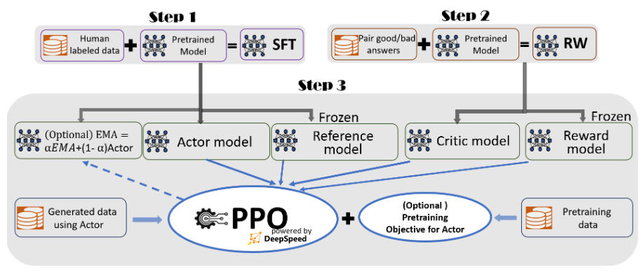
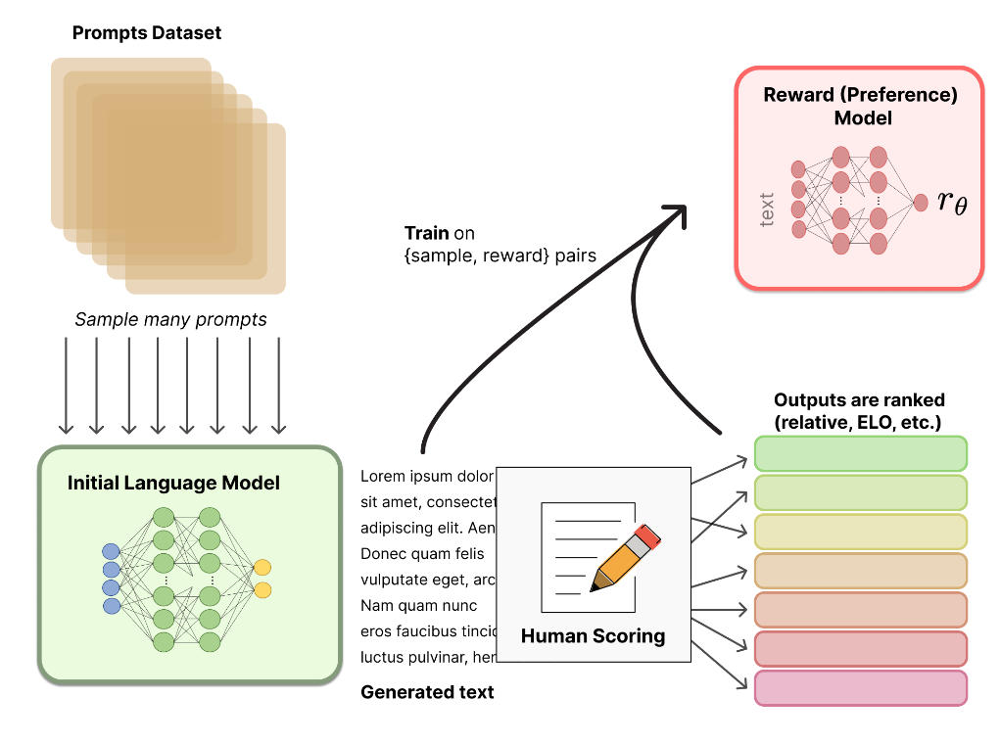
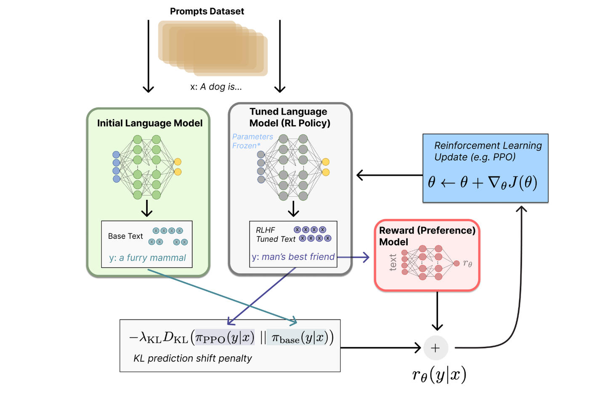
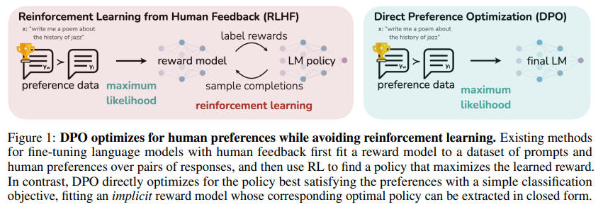
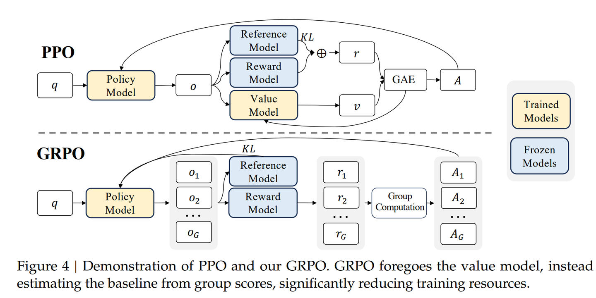
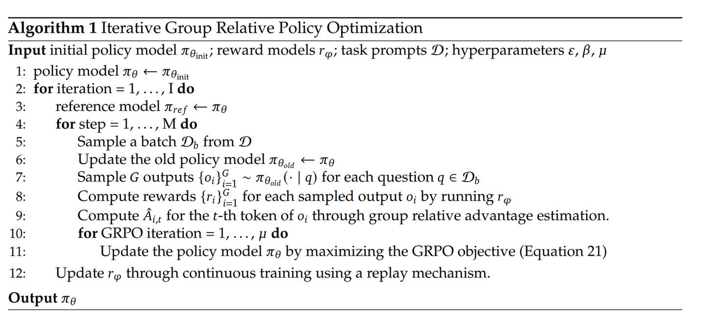

# RLHF 之 DPO, GRPO 梳理
> _**作者: Kevin吴嘉文**_ 
> 
> _**原文:**_ [_**https://zhuanlan.zhihu.com/p/712675213**_](https://zhuanlan.zhihu.com/p/712675213)

本文梳理了 DPO，GRPO 的主要算法、特点以及相关资源链接。

**DPO**
-------

论文：[Direct preference optimization: Your language model is secretly a reward model. arXiv preprint arXiv:2305.18290, 2023](https://link.zhihu.com/?target=https%3A//arxiv.org/abs/2305.18290)

先来回顾以下 PPO，采用 PPO 的 RLHF 会经过 reward model tuning 和 Reinforcement Learning 2 个步骤：



首先在上图的 Step 2 中训练 reward model r(s,a)，优化正负样本之间的距离

$\\mathcal{L}_R(r_\\phi, \\mathcal{D}) = -\\mathbb{E}_{(x,y\_w,y\_l)\\sim\\mathcal{D}}\[\\log\\sigma(r_\\phi(x,y\_w)-r\_\\phi(x,y\_l))\]$



而后在 Step 3 中采用梯度上升优化 LLM，目标函数为：

$\\begin{gathered} \\underset{\\pi\_{\\theta}}{\\max}\\mathbb{E}_{x\\sim\\mathcal{D},y\\sim\\pi_{\\theta}(y|x)}\[r\_{\\phi}(x,y)\]-\\beta D\_{KL}\[\\pi\_{\\theta}(y|x)||\\pi\_{ref}(y|x)\] \\end{gathered}$ 大致流程如下：



更多 PPO 细节可以参考 [RLHF 基础笔记](https://link.zhihu.com/?target=https%3A//antarina.tech/posts/notes/articles/%25E7%25AC%2594%25E8%25AE%25B0RLHF_1.html)。

DPO 的重点在于：将 PPO 的目标函数转化为了简单的 binary corss-entropy 目标函数。



DPO 论文截图

$\\max\_{\\pi} E\_{x \\sim p, y \\sim \\pi (y|x)} \[r\_\\theta (x, y) - \\beta D\_{KL} (\\pi (y|x) | \\pi\_{ref}(y|x))\]$

$= \\max\_{\\pi} E\_{x \\sim p, y \\sim \\pi (y|x)} \\left\[ r (x, y) - \\beta \\log \\frac{\\pi (y|x)}{\\pi\_{ref}(y|x)} \\right\]$

$= \\min\_{\\pi} E\_{x \\sim p} E\_{y \\sim \\pi (y|x)} \\left\[ \\log \\frac{\\pi (y|x)}{\\pi\_{ref}(y|x)} - \\frac{1}{\\beta} r (x, y) \\right\]$

$= \\min\_{\\pi} E\_{x \\sim p} E\_{y \\sim \\pi (y|x)} \\left\[ \\log \\frac{\\pi (y|x)}{\\pi^\*(y|x)} - \\log Z (x) \\right\]$

其中 ( Z (x) ) 为 partition function:

$Z (x) = \\sum\_{y'} \\pi\_{ref}(y'|x) \\exp \\left ( \\frac{1}{\\beta} r (x, y') \\right)$

我们可以定义:

$\\pi^\*(y|x) = \\frac{1}{Z (x)} \\pi\_{ref}(y|x) \\exp \\left ( \\frac{1}{\\beta} r (x, y) \\right),$

于是公式 (11) 可以整理成:

$\\min\_{\\pi} E\_{x \\sim p} \\left\[ E\_{y \\sim \\pi (y|x)} \\left\[ \\log \\frac{\\pi (y|x)}{\\pi^\*(y|x)} \\right\] - \\log Z (x) \\right\] =$

$\\min\_{\\pi} E\_{x \\sim p} \\left\[ D\_{KL} (\\pi (y|x) | \\pi^\*(y|x)) - \\log Z (x) \\right\]$

可以看到，上式中，( Z (x) ) 是不变的，因此当 KL 散度为 0 时，以上式子有最优解，即:

$\\pi (y|x) = \\pi^\*(y|x) = \\frac{1}{Z (x)} \\pi\_{ref}(y|x) \\exp \\left ( \\frac{1}{\\beta} r (x, y) \\right)$

但以上式中，( Z (x) ) 比较难求，因此我们对上式进行以下变换，可以得到:

$R (x, g) = \\beta \\log \\frac{\\pi (y|x)}{\\pi\_{ref}(y|x)} + \\beta \\log Z (x)$

将以上式子输入 reward function 的损失函数中，得到:

$\\mathcal{L}_R (r_\\theta, D) = - E\_{(x, y\_w, y\_l) \\sim p} \\left\[ \\log \\sigma (r\_\\theta (x, y\_w) - r\_\\theta (x, y\_l)) \\right\]$

$= - E\_{(x, y\_w, y\_l) \\sim p} \\left\[ \\log \\sigma \\left ( \\beta \\log \\frac{\\pi (y\_w|x)}{\\pi\_{ref}(y\_w|x)} - \\beta \\log \\frac{\\pi (y\_l|x)}{\\pi\_{ref}(y\_l|x)} \\right) \\right\]$

$= \\mathcal{L}_{DPPO} (r_\\theta; \\pi\_{ref})$

因此，优化时使用的数据集格式与训练 reward model 相同，也是 ((x, y\_w, y\_l)) 的格式，在优化 $\\mathcal{L}\_{DPPO}$ 时，不需要计算 reward model，也可以实现 RLHF 的效果。

参考 `trl` 的 dpo loss 计算方式，大致流程为：

```text-plain
def dpo_loss(
        self,
        policy_chosen_logps: torch.FloatTensor,
        policy_rejected_logps: torch.FloatTensor,
        reference_chosen_logps: torch.FloatTensor,
        reference_rejected_logps: torch.FloatTensor,
    ) -> Tuple[torch.FloatTensor, torch.FloatTensor, torch.FloatTensor]:
        # ... 省略部分代码
        logits = (policy_chosen_logps - reference_chosen_logps) - (policy_rejected_logps - reference_rejected_logps)
        if self.loss_type == "sigmoid":
            losses = (
                -F.logsigmoid(self.beta * logits) * (1 - self.label_smoothing)
                - F.logsigmoid(-self.beta * logits) * self.label_smoothing
            )
        # ... 省略其他 loss_type
        return losses, # ... 省略其他输出
```

在优化时候，可以与 sft loss 一起优化，当同时优化 SFT + DPO 时，sft loss 只计算 chosen 样本对应的 loss。

**GRPO**
--------

论文：[DeepSeekMath: Pushing the Limits of Mathematical Reasoning in Open Language Models](https://link.zhihu.com/?target=https%3A//arxiv.org/pdf/2402.03300)

GRPO 在 DeepSeek V2 中采用了，GRPO 在训练过程中，不需要 Value Model，因此也能够减少 RL 训练过程中的资源消耗。



GRPO 的目标函数为：

$$\\begin{align\*} & J\_{GRPO}(\\theta) \\ &= \\mathbb{E}\\Bigg\[ q \\sim P (Q), {o\_i}_{i=1}^{G} \\sim \\pi_{\\theta\_{old}}(O|q) \\Bigg\] \\Bigg\[ \\frac{1}{G} \\sum\_{i=1}^{G} \\frac{1}{|o\_i|} \\ & \\quad \\sum\_{t=1}^{|o\_i|} \\left{ \\min \\left\[ \\frac{\\pi\_\\theta (o\_{i, t}|q, o\_{i,<t})}{\\pi\_{\\theta\_{old}}(o\_{i, t}|q, o\_{i,<t})} \\hat{A}_{i, t}, \\mathrm{clip} \\left ( \\frac{\\pi_\\theta (o\_{i, t}|q, o\_{i,<t})}{\\pi\_{\\theta\_{old}}(o\_{i, t}|q, o\_{i,<t})}, 1-\\epsilon, 1+\\epsilon \\right) \\hat{A}_{i, t} \\right\] \\right. \\ & \\quad \\left. - \\beta D_{KL}\[\\pi\_\\theta \\parallel \\pi\_{ref}\] \\right} \\Bigg\] \\end{align\*}$$

GRPO 的步骤大致为：



其中，advantage $\\hat{A}\_{i,t} = \\frac{r\_i - \\text{mean}(r)}{\\text{std}(r)}.$

**参考**
------

RLHF 相关训练代码示例：

*   [https://github.com/huggingface/alignment-handbook](https://link.zhihu.com/?target=https%3A//github.com/huggingface/alignment-handbook)
*   [https://github.com/OpenRLHF/OpenRLHF](https://link.zhihu.com/?target=https%3A//github.com/OpenRLHF/OpenRLHF)
*   [https://github.com/hiyouga/LLaM](https://link.zhihu.com/?target=https%3A//github.com/hiyouga/LLaMA-Factory)