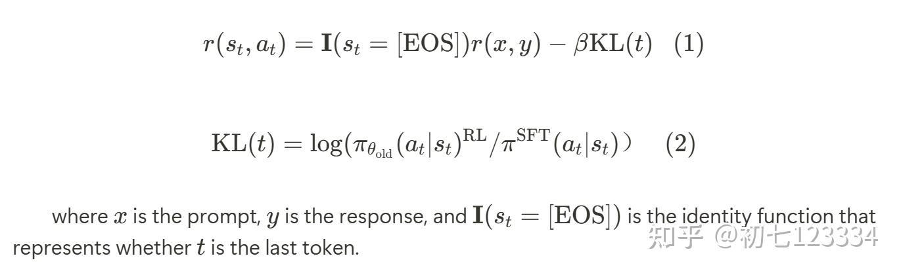
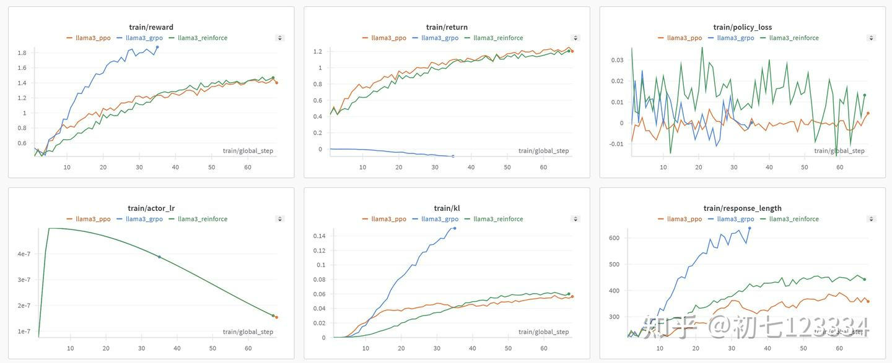
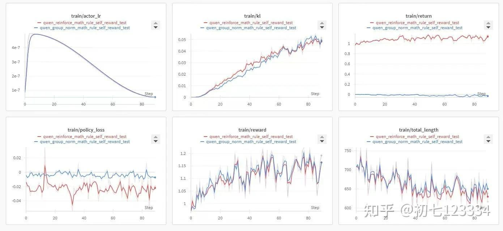
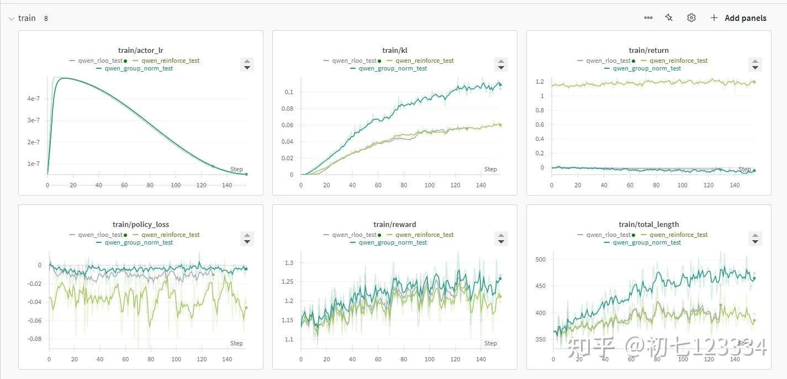

# RLHF&对齐之&REINFORCE++&算法&-&比&GRPO&稳定比PPO快
> **作者: 初七123334**
> 
> **原文:** [**https://zhuanlan.zhihu.com/p/14888098807**](https://zhuanlan.zhihu.com/p/14888098807)

英文版以及技术报告

[Notion – The all-in-one workspace for your notes, tasks, wikis, and databases.](https://hijkzzz.notion.site/reinforce-plus-plus)

[Awesome-LLM-Strawberry/resources/REINFORCE++.pdf at main · hijkzzz/Awesome-LLM-Strawberry](https://github.com/hijkzzz/Awesome-LLM-Strawberry/blob/main/resources/REINFORCE++.pdf)

* * *

RLHF（人类反馈强化学习）正在迅速发展，算法如PPO、DPO、RLOO、ReMax和GRPO等层出不穷。基于早前在RLHF实现技巧和OpenRLHF方面的研究探索经验，笔者"提出"了REINFORCE++对齐算法 。

\*\*REINFORCE++的核心思想是将PPO中的各种优化技巧整合到经典的强化学习算法REINFORCE中，以提升其性能和稳定性。\*\*这样REINFORCE++不需要 Critic 从而节省计算资源，又有加持了 PPO 相关的优化技巧实现高效训练。 **REINFORCE++的特点是 比 GRPO 稳定比PPO快。**

### REINFORCE

REINFORCE算法是强化学习（Reinforcement Learning）中的一种重要策略梯度方法，旨在通过直接优化策略来最大化预期的累计奖励。以下是对[REINFORCE算法](https://zhida.zhihu.com/search?content_id=252000540&content_type=Article&match_order=2&q=REINFORCE%E7%AE%97%E6%B3%95&zhida_source=entity)的简单介绍。

REINFORCE算法基于[蒙特卡罗方法](https://zhida.zhihu.com/search?content_id=252000540&content_type=Article&match_order=1&q=%E8%92%99%E7%89%B9%E5%8D%A1%E7%BD%97%E6%96%B9%E6%B3%95&zhida_source=entity)，通过以下步骤进行操作：

*   **策略采样**：智能体根据当前策略与环境交互，生成一条状态-动作-奖励序列（轨迹）。
*   **回报计算**：对每条轨迹进行回报计算，通常采用折扣累计奖励的形式，即：

Gt=∑k=t+1Tγk−trk

其中， γ 是折扣因子， rk 是在时间步 k 获得的即时奖励。

*   **梯度估计**：使用蒙特卡罗方法计算[策略梯度](https://zhida.zhihu.com/search?content_id=252000540&content_type=Article&match_order=2&q=%E7%AD%96%E7%95%A5%E6%A2%AF%E5%BA%A6&zhida_source=entity)，更新策略参数 θ 的公式为：

∇θJ(θ)=Eπ\[Gt∇θlog⁡πθ(At|St)\]

*   **策略更新**：通过[梯度上升法](https://zhida.zhihu.com/search?content_id=252000540&content_type=Article&match_order=1&q=%E6%A2%AF%E5%BA%A6%E4%B8%8A%E5%8D%87%E6%B3%95&zhida_source=entity)更新策略参数：

θt+1=θt+α∇θJ(θ)

其中， α 是学习率。

### RLHF Implementation Tricks

我们在 REINFORCE 上集成下面的优化 Tricks 以稳定模型的训练

**Token Level KL-Penalty**

**Token Level KL-Penalty** 是一种在序列生成任务中使用的正则化技术。其主要目的是控制生成的文本与训练数据之间的差异，以避免模型生成过于偏离训练分布的输出。具体方法如下：



这种 Token-level KL 的好处是可以无缝兼容 PRM 并且实现了KL reward的信用分配

**Mini-batch Updates**

**Mini-batch Updates** 是一种常用的优化策略，旨在提高训练效率和稳定性。其基本思想是：

*   **小批量样本**：将训练数据划分为多个小批量（mini-batch），而不是使用整个[数据集](https://zhida.zhihu.com/search?content_id=252000540&content_type=Article&match_order=1&q=%E6%95%B0%E6%8D%AE%E9%9B%86&zhida_source=entity)进行更新。
*   **频繁更新**：通过在每个小批量上进行多次参数更新，可以更快地收敛，同时减少内存消耗。
*   **随机性引入**：小批量更新引入了随机性，有助于避免局部最优解，提高模型的泛化能力。

**Reward Normalization and Clipping**

**Reward Normalization and Clipping** 是处理奖励信号不稳定的一种方法。具体包括：

*   **奖励归一化**：通过对奖励进行标准化（例如，减去均值并除以标准差），使得奖励信号更为平稳，从而提高训练过程的稳定性。
*   **奖励裁剪**：限制奖励值在某个范围内，以防止极端奖励对模型更新造成过大的影响。这有助于保持学习过程的稳定性，并防止梯度爆炸。

**Advantage Normalization**

**Advantage Normalization** 是一种用于处理[优势函数](https://zhida.zhihu.com/search?content_id=252000540&content_type=Article&match_order=1&q=%E4%BC%98%E5%8A%BF%E5%87%BD%E6%95%B0&zhida_source=entity)（advantage function）估计方差的方法。REINFORCE++的优势函数定义为：

At(s,a)=R(s,a)−∑i=tTKL(i)

其中 R 是[奖励函数](https://zhida.zhihu.com/search?content_id=252000540&content_type=Article&match_order=1&q=%E5%A5%96%E5%8A%B1%E5%87%BD%E6%95%B0&zhida_source=entity)， KL 是per-token 的kl reward， t 是token位置。优势归一化的步骤包括：

*   **均值和方差计算**：对计算出的优势值进行均值和方差计算。
*   **归一化处理**：将优势值减去均值并除以标准差，使得优势值具有更好的数值稳定性，进而提高学习效果。

**PPO-Clip**

**PPO-Clip** 是近端策略优化（Proximal Policy Optimization, PPO）算法中的一个关键技巧，用于限制策略更新幅度。其主要思想是：

*   **剪切目标函数**：通过引入一个剪切机制，限制新旧策略之间的比率变化，确保更新不会过大。这可以用以下公式表示：

LCLIP(θ)=Et\[min(rt(θ)A^t,clip(rt(θ),1−ϵ,1+ϵ)A^t)\]

其中 rt(θ) 是新旧策略比率， A^t 是优势估计， ϵ 是一个小常数。

*   **提高稳定性和样本效率**：这种剪切机制有效防止了策略更新过大导致的不稳定，提高了算法的收敛速度和样本效率。

**没错我们在 REINFORCE++ 中用的是 PPO 的 loss function**

更多的 RLHF 优化 Tricks 细节解释可参考

[Notion – The all-in-one workspace for your notes, tasks, wikis, and databases.hijkzzz.notion.site/rlhf-implementation-tricks?v=158d9a33ecc98132bf9e000c39227361](https://link.zhihu.com/?target=https%3A//hijkzzz.notion.site/rlhf-implementation-tricks%3Fv%3D158d9a33ecc98132bf9e000c39227361)

### 代码实现

我们基于 OpenRLHF 实现了这个 REINFORCE++ 算法

[https://github.com/OpenRLHF/OpenRLHF/blob/main/examples/scripts/train\_reinforce\_llama\_ray.shgithub.com/OpenRLHF/OpenRLHF/blob/main/examples/scripts/train\_reinforce\_llama\_ray.sh](https://link.zhihu.com/?target=https%3A//github.com/OpenRLHF/OpenRLHF/blob/main/examples/scripts/train_reinforce_llama_ray.sh)

### 实验对比和参数

```text-plain
KL coef = 0.01 (For BT reward model) or 0.001 (For Math Test) 
max_samples = 25000 
n_samples_per_prompt = 4 
rollout_batch_size = 256 
train_batch_size = 128 
actor_learning_rate = 5e-7 
critic_learning_rate = 9e-6 
datasets: OpenRLHF default datasets / MetaMathQA with rule-based reward (for Math Test) / 闭源 数学 rm
```



> Experimental 1 for Bradley-Terry Reward Models and general scenarios (PPO / REINFORCE++ is better than GRPO)



> Experimental 2 for rule-based reward and mathmatical scenarios 1 (REINFORCE++ == GRPO)



> Experimental 3 for mathmatical scenarios 2 ( REINFORCE++ / RLOO is better than GRPO)

**可以看出平均来说 REINFORCE++ 比 GRPO 更稳定，在单位kl消耗下 reward涨幅更高，length hacking问题更小，因为不需要 Critic 所以比 PPO更省计算资源。**

### **引用方式**

```text-plain
@misc{hu2024reinforceplusplus,
  title={REINFORCE++: A Simple and Efficient Approach for Aligning Large Language Models},
  author={Jian Hu},
  year={2024},
  howpublished={\url{https://hijkzzz.notion.site/REINFORCE-168d9a33ecc980949f9af56ca95ddae0}},
  note={Notion Blog}
}
```