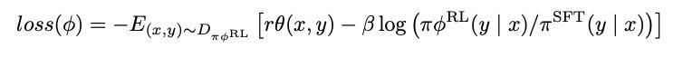
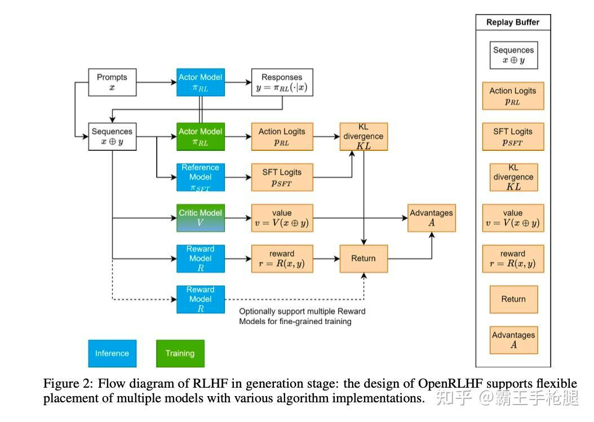
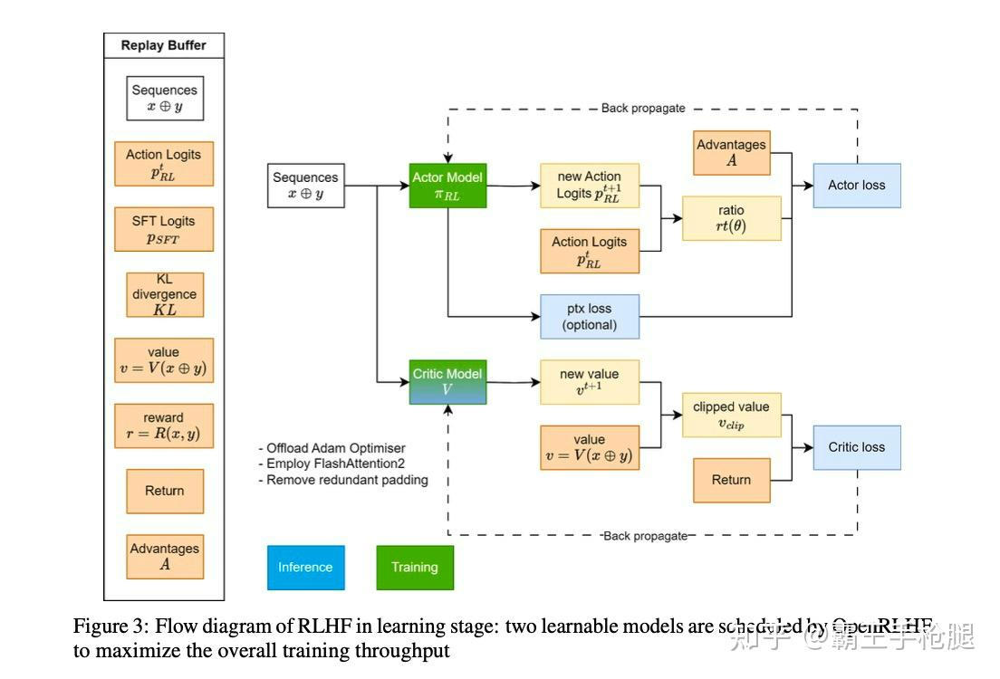

# RLHF入门学习路线梳理
> _**作者: 霸王手枪腿**_
> 
> _**原文:**_ [_**https://zhuanlan.zhihu.com/p/15039846126**_](https://zhuanlan.zhihu.com/p/15039846126)

由于[LLM](https://zhida.zhihu.com/search?content_id=252030819&content_type=Article&match_order=1&q=LLM&zhida_source=entity)尤其是reasoning方面推理和训练的边界在越来越小，最近两个月开始逐步入门学习[RLHF](https://zhida.zhihu.com/search?content_id=252030819&content_type=Article&match_order=1&q=RLHF&zhida_source=entity)方面的知识，作为系统方向的工程师，这个学习是必须的（不然连data flow都难以理解），但又是困难的，因为涉及到了不少算法的基础知识，抱着[sutton](https://zhida.zhihu.com/search?content_id=252030819&content_type=Article&match_order=1&q=sutton&zhida_source=entity)的《强化学习》啃了一阵，又看了不少网上的文章，才理解了个大概，但从[系统工程师](https://zhida.zhihu.com/search?content_id=252030819&content_type=Article&match_order=1&q=%E7%B3%BB%E7%BB%9F%E5%B7%A5%E7%A8%8B%E5%B8%88&zhida_source=entity)的角度回头去看，这个过程还是挺低效的，一来是因为我第一时间并不需要像算法同学那样去理解每一步推导过程，而是更快地想获得整体的全貌，二来是网上虽然资料很多，但基本上是基于某一步去仔细讲解其中细节，对于基本零基础又迫切想理解问题全貌的我来说就有些痛苦，三来这其中的概念相互交织，有些文章会混在一起讲，又会加大理解难度，比方说很多文章说起[PPO](https://zhida.zhihu.com/search?content_id=252030819&content_type=Article&match_order=1&q=PPO&zhida_source=entity)的时候，其实指代的是LLM场景下的PPO，它想说的某个点其实是为了解决LLM的问题，而非PPO本身的问题。所以我认为去梳理一下这条学习线路对像我一样的后来者应该是有些帮助的。

所以趁今天有点空，我打算回过头去，简单梳理一条适合零算法基础的系统工程师的学习/理解脉络。（没空把每一步都写的很具体，但其实每一步更详细的学习资料都很好搜到。）

1 理解强化学习的基本概念，**策略，轨迹，奖励，状态，动作**等。

2 为了在复杂场景中能够学习到好的[策略函数](https://zhida.zhihu.com/search?content_id=252030819&content_type=Article&match_order=1&q=%E7%AD%96%E7%95%A5%E5%87%BD%E6%95%B0&zhida_source=entity)，需要引入**策略梯度函数**，用梯度下降的方式去学习策略函数。每一步中策略函数的loss由后续每一步的奖励乘以折扣因子得到。

3 这么做核心的问题是奖励的方差会很大，会导致训练很困难，因此需要引入[**价值函数**](https://zhida.zhihu.com/search?content_id=252030819&content_type=Article&match_order=1&q=%E4%BB%B7%E5%80%BC%E5%87%BD%E6%95%B0&zhida_source=entity)来估计某一步之后总的奖励（价值函数是对于后续奖励总和的[无偏估计](https://zhida.zhihu.com/search?content_id=252030819&content_type=Article&match_order=1&q=%E6%97%A0%E5%81%8F%E4%BC%B0%E8%AE%A1&zhida_source=entity)，同时方差小于真实奖励的采样）。为了同时优化策略函数和价值函数，引入了[Actor-Critic](https://zhida.zhihu.com/search?content_id=252030819&content_type=Article&match_order=1&q=Actor-Critic&zhida_source=entity)的训练模式，Actor代表策略函数/模型，Critic代表价值函数/模型，在完成一轮迭代之后，Actor根据每一步的优势（advantage）和当步的奖励来计算loss，而优势又由Critic算出的，该步前后的价值和当步的奖励来算出。Critic根据每一步估计的价值与后续得到的奖励来计算loss。

4 当策略函数的参数更新了之后，上一轮迭代采样到的策略函数的结果就不准确了，需要重新采样一个新的样本才能继续训练，而很多场景[下采样](https://zhida.zhihu.com/search?content_id=252030819&content_type=Article&match_order=1&q=%E4%B8%8B%E9%87%87%E6%A0%B7&zhida_source=entity)新样本的成本是很高的，为了解决这个问题，引入了PPO（Proximal Policy Optimization），PPO通过[**重要度采样**](https://zhida.zhihu.com/search?content_id=252030819&content_type=Article&match_order=1&q=%E9%87%8D%E8%A6%81%E5%BA%A6%E9%87%87%E6%A0%B7&zhida_source=entity)的方式来调整Actor每一步的优势，进而修正Actor的loss。引入了PPO之后，对于一组s0a0s1a1......snan的采样，可以进行多次反向（计算loss-更新权重）计算。

注意到这里，指的都是一般意义上的强化学习，和LLM还没什么关系。

5 理解怎么将LLM的问题转化为一个强化学习的问题。这个其实比较简单，s0（初始状态）就是prompt,后续每一步的状态就是prompt加上当前生成的token，每一步就是生成一个token，action就是生成哪个token。而策略函数 \\pi（s,a） 的结果也就是LLM生成的[logits](https://zhida.zhihu.com/search?content_id=252030819&content_type=Article&match_order=1&q=logits&zhida_source=entity)中某个token的生成概率。Critic则是在每一步为当前的状态算出一个价值。

6 这里面还有一个重要的问题是[奖励函数](https://zhida.zhihu.com/search?content_id=252030819&content_type=Article&match_order=1&q=%E5%A5%96%E5%8A%B1%E5%87%BD%E6%95%B0&zhida_source=entity)怎么搞。在一般的强化学习问题中，奖励是由环境来反馈的。在LLM的场景中，我们需要再训练一个[**奖励模型**](https://zhida.zhihu.com/search?content_id=252030819&content_type=Article&match_order=1&q=%E5%A5%96%E5%8A%B1%E6%A8%A1%E5%9E%8B&zhida_source=entity)**（Reward model）**。将输入的token序列x和LLM输出的token序列y一同丢给奖励模型，返回一个奖励值。这里又有个问题，生成y需要多步，每一步都需要奖励值，而奖励模型只会输出一个奖励值，一般的做法是只有最后一步获得奖励值，前面的步奖励值都是0。

7 这里还引入了一个小的修正，为了让模型不被奖励模型带的太偏，奖励值还会减去Actor模型和[**初始模型**](https://zhida.zhihu.com/search?content_id=252030819&content_type=Article&match_order=1&q=%E5%88%9D%E5%A7%8B%E6%A8%A1%E5%9E%8B&zhida_source=entity)（Reference model）的[KL散度](https://zhida.zhihu.com/search?content_id=252030819&content_type=Article&match_order=1&q=KL%E6%95%A3%E5%BA%A6&zhida_source=entity)。

8 讲到这里熟悉LLM的聪明的你，应该可以理解为什么这是一个适合PPO的场景了。采样的过程就是正常的LLM推理过程，需要一个一个token的生成，而除此之外的全部步骤，包括Reward model和Reference model的前向，Actor model和Critic model的前反向，都是可以所以token一起进行的。

最后可以通过看看[OpenRLHF](https://zhida.zhihu.com/search?content_id=252030819&content_type=Article&match_order=1&q=OpenRLHF&zhida_source=entity)论文的两张图来检查自己理解了没有：

