# RLHF笔记-从策略梯度到PPO
> _**作者: 过拟合**_ 
> 
> _**原文:**_ [_**https://zhuanlan.zhihu.com/p/648225307**_](https://zhuanlan.zhihu.com/p/648225307)

ppt很大一部分用的[李宏毅](https://zhida.zhihu.com/search?content_id=232180061&content_type=Article&match_order=1&q=%E6%9D%8E%E5%AE%8F%E6%AF%85&zhida_source=entity)老师的，原始ppt[链接](https://link.zhihu.com/?target=http%3A//speech.ee.ntu.edu.tw/~tlkagk/courses/ML_2017/Lecture/RL%2520%28v4%29.pdf) , 视频： [DRL Lecture 2: Proximal Policy Optimization (PPO)](https://link.zhihu.com/?target=https%3A//www.youtube.com/watch%3Fv%3DOAKAZhFmYoI)

### 基于策略的方法 (policy based model)

智能体会制定一套动作策略，即确定在给定状态下需要采取何种动作， 并根据这个策略进行操作。强化学习算法直接对策略进行优化，使制定的策略能够获得最大的奖励。

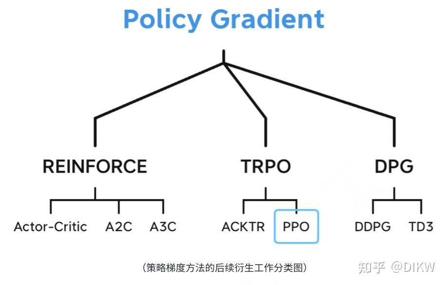

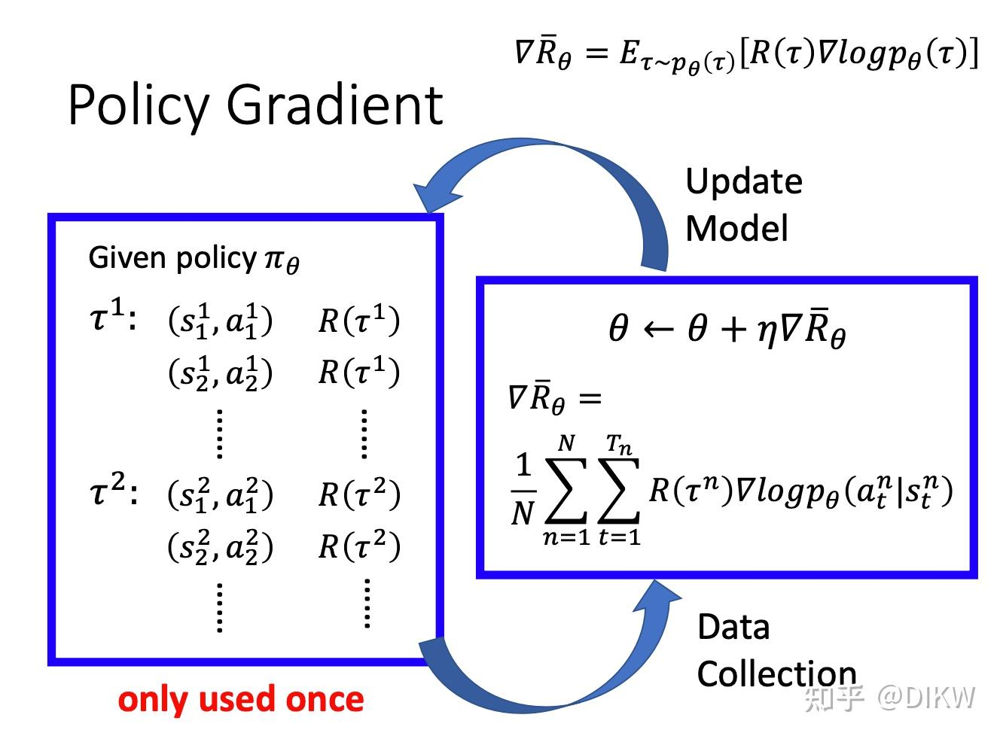

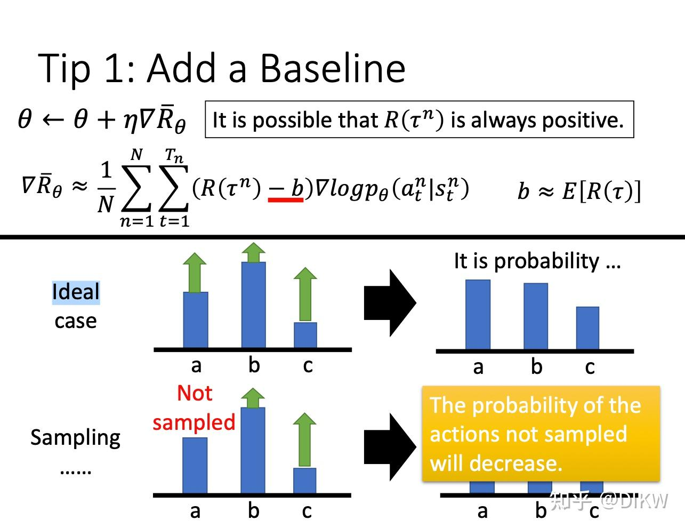

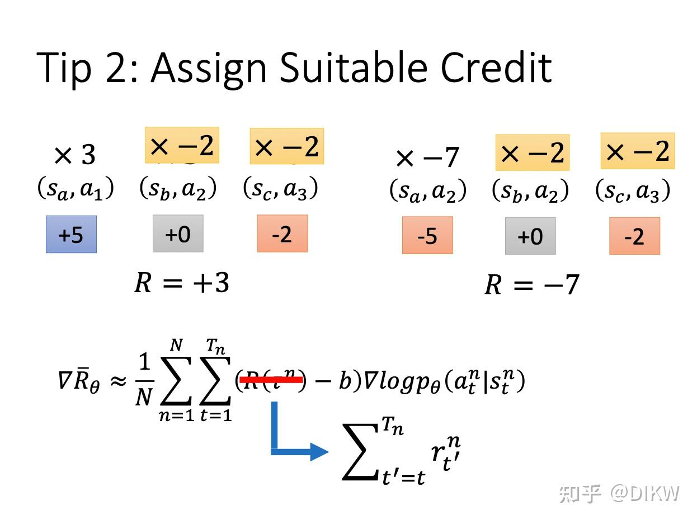

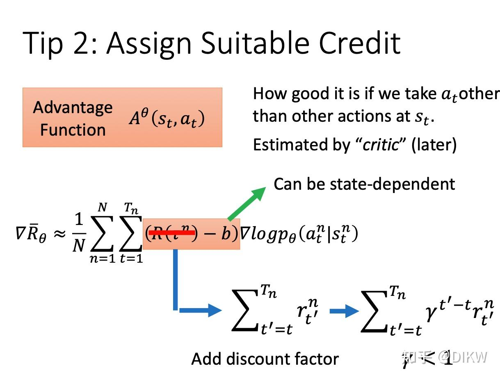

策略梯度REINFORCE算法：

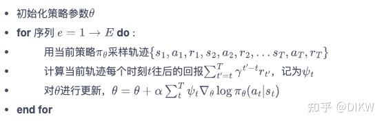

强化学习中的累积奖励 G 是不稳定的随机变量，它的值受到状态 s 和动作 a 的影响，但因为环境的交互过程具有随机性，即便是在相同的状态和动作下，每次计算得到的累积奖励也可能不同。这意味着 G 有一个固定的分布，但我们只能通过采样的方式来估计这个分布。

实际上，我们是通过对 G 进行[蒙特卡洛采样](https://zhida.zhihu.com/search?content_id=232180061&content_type=Article&match_order=1&q=%E8%92%99%E7%89%B9%E5%8D%A1%E6%B4%9B%E9%87%87%E6%A0%B7&zhida_source=entity)，用采样结果去更新策略的参数。这个过程的随机性很大，同一个状态下采取同一动作，可能得到的累积奖励结果会有很大差异。如果我们能在每次更新参数前采样足够多次，可以有效缓解这个问题，但实际操作中，因为时间和计算资源的限制，我们只能进行有限次数的采样。

因此，有时我们可能会遇到一些不太理想的情况，比如采样结果偏差过大，如 G = 100 或 G = -10，这就会导致策略的更新效果不佳。

策略梯度改进：

1.添加基线，REINFORCE 通过蒙特卡洛采样的方法对策略梯度的估计是无偏的，但是方差非常大。引入**基线函数**（baseline function）来减小方差。

2。引入折扣因子，通过计算累计折扣奖励来表示动作对（at,st)之后的回报。

### 基于值函数的方法(value base model)

智能体不需要制定显式的策略，它维护一个价值表格或者[价值函数](https://zhida.zhihu.com/search?content_id=232180061&content_type=Article&match_order=1&q=%E4%BB%B7%E5%80%BC%E5%87%BD%E6%95%B0&zhida_source=entity)，并通过这个价值表格或价值函数来执行使得价值最大化的动作。 基于价值的方法就是深度 Q 网络。深度 Q 网 络有两种函数，有两种评论员。第一种评论员是 Vπ(s)。即假设演员的策略是 π，使用 π 与 环境交互，当智能体看到状态 s 时，接下来累积奖励的期望值是多少。第二种评论员是 Qπ(s,a)。Qπ(s,a) 把 s 与 a 当作输入，它表示在状态 s 采取动作 a，接下来用策略 π 与环境交互，累积奖励的期望值是多 少。Vπ 接收输入 s，输出一个标量。Qπ 接收输入 s，它会给每一个 a 都分配一个 Q 值。

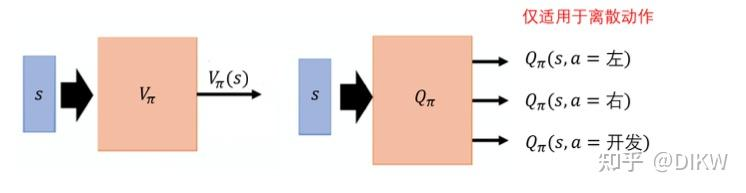

### 如何衡量状态价值函数 Vπ(s) ？

### 1\. 基于[蒙特卡洛算法](https://zhida.zhihu.com/search?content_id=232180061&content_type=Article&match_order=1&q=%E8%92%99%E7%89%B9%E5%8D%A1%E6%B4%9B%E7%AE%97%E6%B3%95&zhida_source=entity)

如果在状态 sa，接下来的累积奖励就是 Ga。也就是对这个价值函数，如果输入是状态 sa，正确的输出应该是 Ga;如果输入状态是 sb，正确的输 出应该是 Gb。所以在训练的时候，它就是一个[回归问题](https://zhida.zhihu.com/search?content_id=232180061&content_type=Article&match_order=1&q=%E5%9B%9E%E5%BD%92%E9%97%AE%E9%A2%98&zhida_source=entity)(regression problem)。网络的输出就是一个值， 我们希望在输入 sa 的时候，输出的值与 Ga 越接近越好;输入 sb 的时候，输出的值与 Gb 越接近越好。 接下来继续训练网络，这是基于蒙特卡洛的方法。

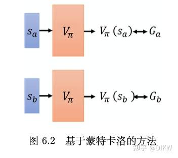

### 2\. 基于[时序差分](https://zhida.zhihu.com/search?content_id=232180061&content_type=Article&match_order=1&q=%E6%97%B6%E5%BA%8F%E5%B7%AE%E5%88%86&zhida_source=entity)的方法

TD不需要玩到游戏结束，只需要在游戏的某一个状态 st 的时候，采取动作 at 得到奖励 rt ，接下来进入状态 st+1，就可 以使用时序差分的方法。我们可以通过下面来使用时序差分的方法。

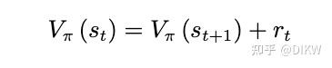

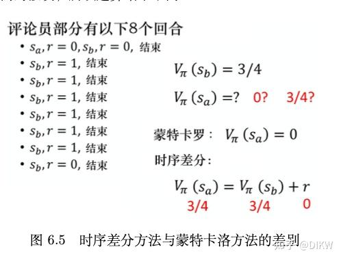

### Actor-Critic算法

演员-评论员算法是一种强化学习方法，它结合了策略梯度和时序差分学习。在这种算法中，"演员"指的是[策略函数](https://zhida.zhihu.com/search?content_id=232180061&content_type=Article&match_order=1&q=%E7%AD%96%E7%95%A5%E5%87%BD%E6%95%B0&zhida_source=entity)，其目标是学习能获得尽可能高回报的策略。"评论员"则指的是价值函数，用于评估当前策略的效果，即对"演员"的表现进行评价。演员-评论员算法可以利用价值函数进行实时参数更新，无需等待回合结束。该算法中，最著名的算法为异步优势演员-评论员算法，如果去掉异步部分，就成为了优势演员-评论员(A2C)算法。

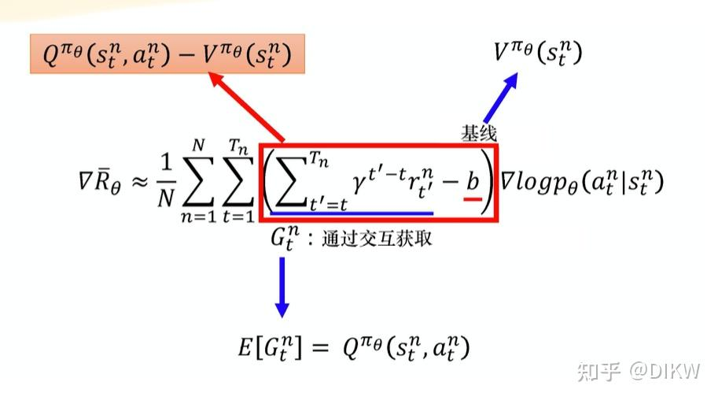

从策略梯度到A2C算法

上图方法 有一个缺点，即我们需要估计两个网络——Q 网络和 V 网络，估计不准的风险 就变成原来的两倍。所以我们何不只估计一个网络呢?事实上，在演员-评论员算法中，我们可以只估计网 络 V，并利用 V 的值来表示 Q 的值，Q (sn,an) 可以写成 rn +V sn 的期望值 。最终可以替换成：

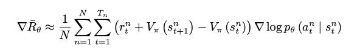

### TRPO信任区域策略优化（trust region policy optimization）

基于策略的方法包括[策略梯度算法](https://zhida.zhihu.com/search?content_id=232180061&content_type=Article&match_order=1&q=%E7%AD%96%E7%95%A5%E6%A2%AF%E5%BA%A6%E7%AE%97%E6%B3%95&zhida_source=entity)和 Actor-Critic 算法。这些方法虽然简单、直观，但在实际应用过程中会遇到训练不稳定的情况  
1.policy based 方差大

2.value based 偏差大

当[策略网络](https://zhida.zhihu.com/search?content_id=232180061&content_type=Article&match_order=1&q=%E7%AD%96%E7%95%A5%E7%BD%91%E7%BB%9C&zhida_source=entity)是深度模型时，沿着策略梯度更新参数，很有可能由于步长太长，策略突然显著变差，进而影响训练效果。

TRPO考虑在更新时找到一块\*\*[信任区域](https://zhida.zhihu.com/search?content_id=232180061&content_type=Article&match_order=2&q=%E4%BF%A1%E4%BB%BB%E5%8C%BA%E5%9F%9F&zhida_source=entity)**（trust region），在这个区域上更新策略时能够得到某种策略性能的安全性保证，这就是**信任区域策略优化\*\*（trust region policy optimization，TRPO）算法的主要思想。TRPO 算法在 2015 年被提出，它在理论上能够保证策略学习的性能单调性，并在实际应用中取得了比策略梯度算法更好的效果。

### 通过重要性采样得到新旧策略的关系

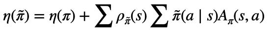

新旧策略之间的关系

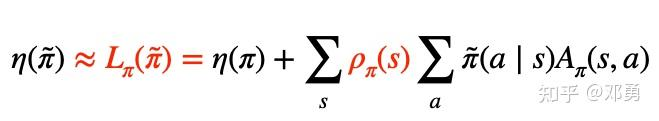

近似替代函数：因为我们没法基于新的策略求新的略，这里假设新旧策略很近，做了个近似替代

### 最大化目标函数+约束新旧策略之间的距离

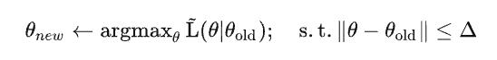

带约束条件的最大化新策略的期望

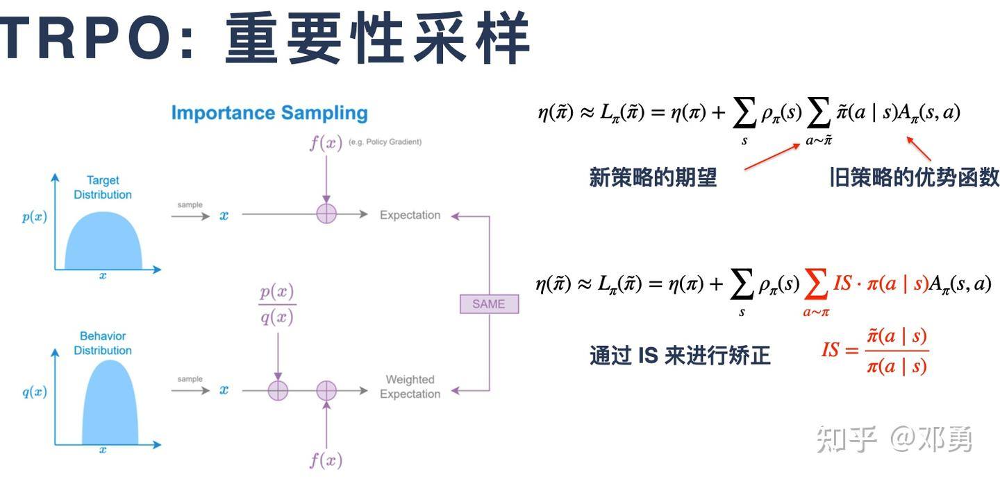

通过重要性采样将公式里面a需要从新策略采样的分布换到旧策略分布\*重要性

### PPO 近端策略优化 （proximal policy optimization ）

TRPO和PPO的主要区别在于约束的位置。PPO直接将约束放入优化式中，可以使用梯度上升方法进行最大化。而TRPO则将[KL散度](https://zhida.zhihu.com/search?content_id=232180061&content_type=Article&match_order=1&q=KL%E6%95%A3%E5%BA%A6&zhida_source=entity)作为约束，希望θ与θ′的KL散度小于δ。但在基于梯度的优化中，处理约束较为困难。TRPO因为将[KL散度约束](https://zhida.zhihu.com/search?content_id=232180061&content_type=Article&match_order=1&q=KL%E6%95%A3%E5%BA%A6%E7%BA%A6%E6%9D%9F&zhida_source=entity)作为额外的约束，没有放入目标函数中，因此其计算难度较大。相比之下，人们通常更倾向于使用PPO而非TRPO，因为PPO和TRPO的性能相当，但PPO在实现上比TRPO简单得多。

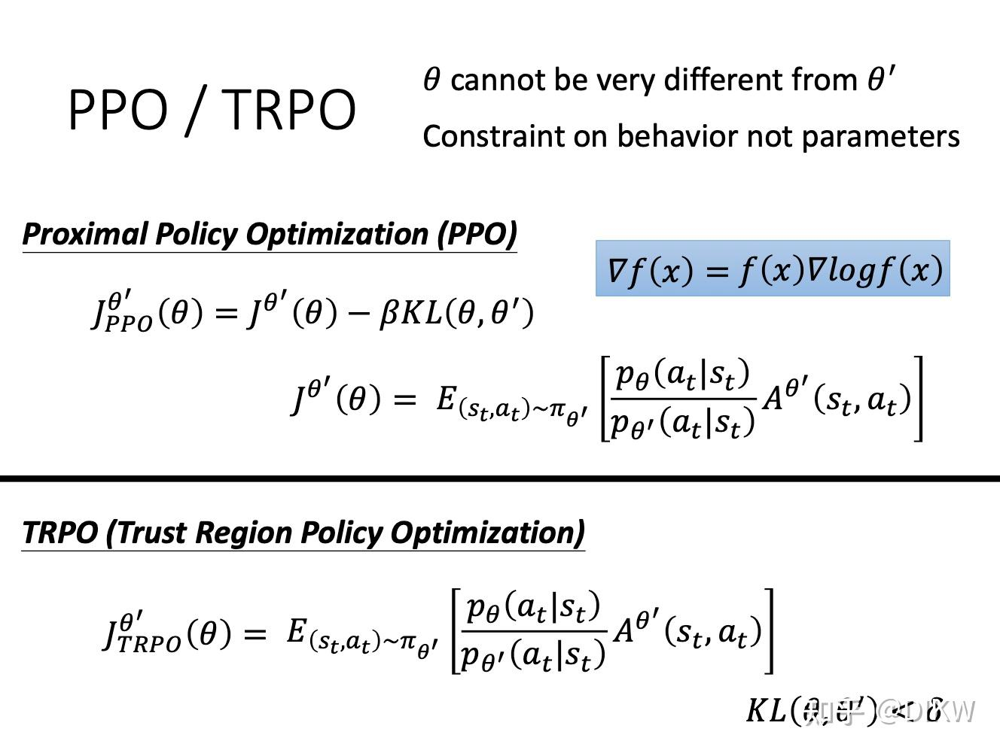

ppo1近端策略优化惩罚(PPO-penalty)

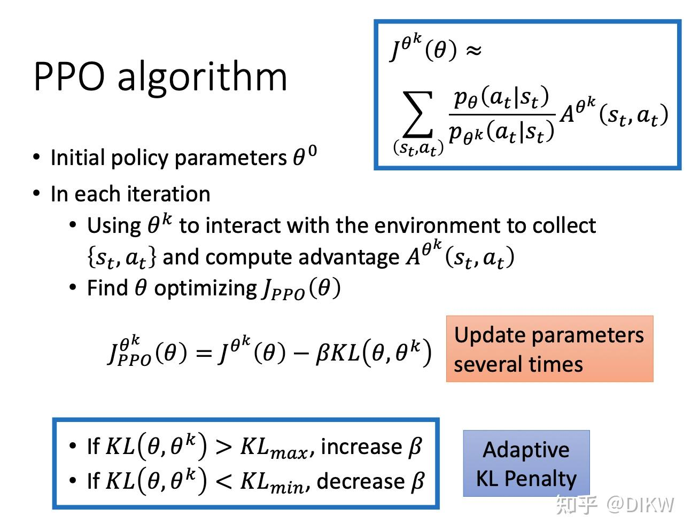

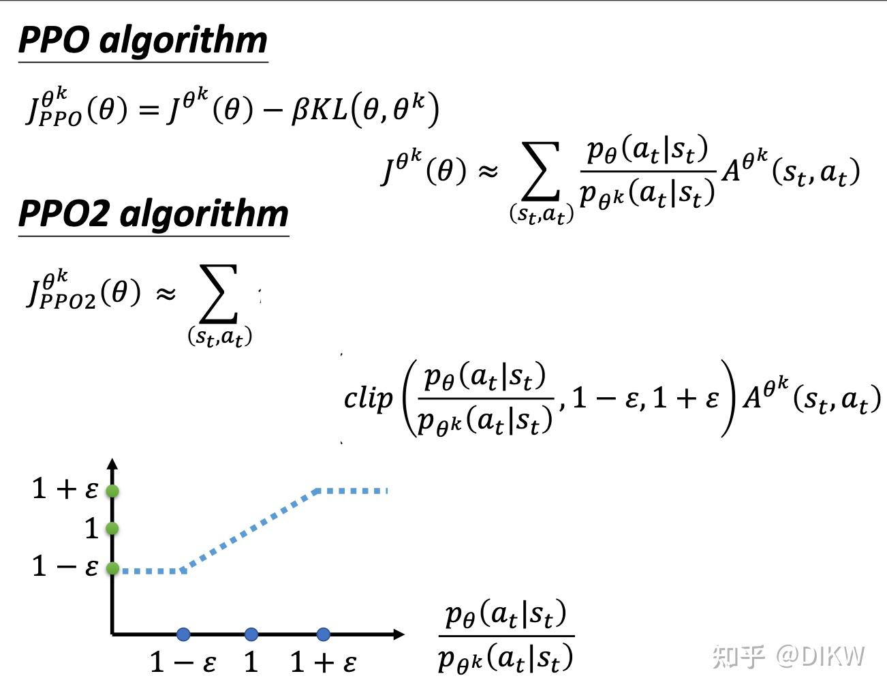

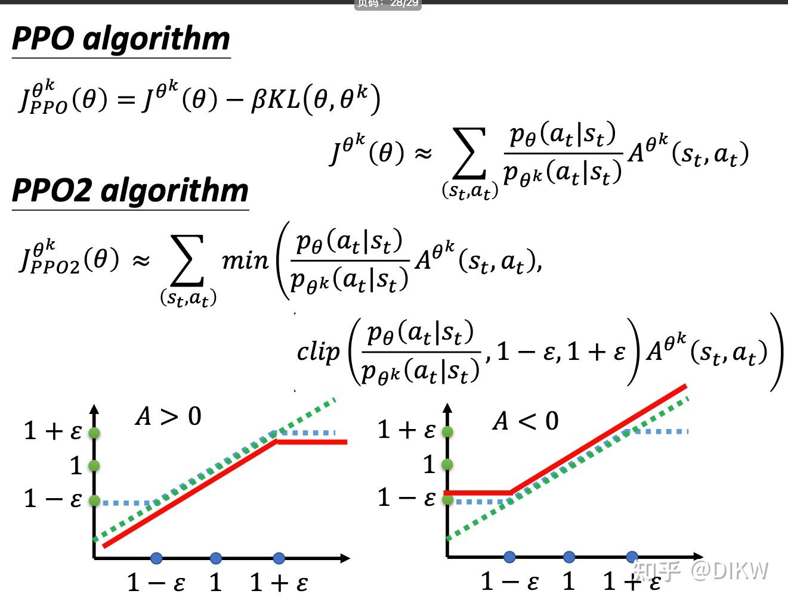