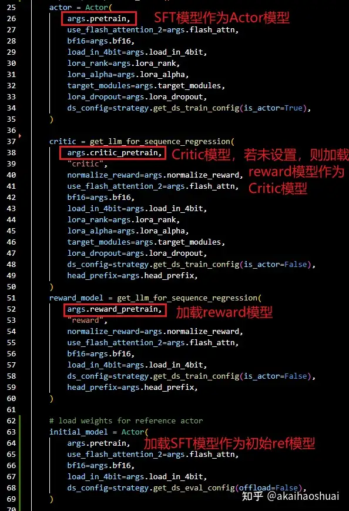
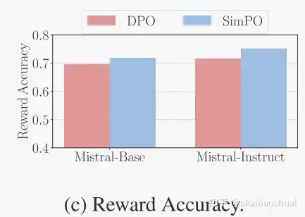

# 什么是RLHF
> _**作者：akaihaoshuai**_
> 
> _**原文：**_[_**https://www.zhihu.com/question/644676855/answer/3569432287**_](https://www.zhihu.com/question/644676855/answer/3569432287)

Reward模型
--------

因为PPO需要一个Reward模型对模型生成结果的质量进行评价，因此先收集数据训练Reward模型。

**Reward模型的目的是对符合人类偏好/高质量的回答打高分，否则打低分。**

### **模型**

Reward模型一般也是使用的LLM模型，由于最终需要生成scores，因此通常在模型最后会有一个线性层Linear(dims, 1)，将output\_hidden转成为一个score。Reward模型可以是任意SFT模型+Linear层，也可以是其他预训练好的Reward模型（也可以在基础上继续微调）。

比如原本的模型Qwen


Qwen2

增加了一个v\_head层


Qwen2WithVhead

每一个输入token最终都能够生成一个标量值。对于LLM来说，最后一个输入token的处理结果会采样变成next\_token，现在变成了score，作为所有输入token的打分结果（其实也可以取所有token生成的score进行平均，通常是直接取最后一个score，训练的效果更好一些）。

预训练好的Reward模型可以参考：[https://huggingface.co/IDEA-CCNL/Ziya-LLaMA-7B-Reward](https://link.zhihu.com/?target=https%3A//huggingface.co/IDEA-CCNL/Ziya-LLaMA-7B-Reward)

### **数据集**

要训练模型先得有数据集，首先就要知道什么样的数据符合人类偏好。这部分数据不需要多，一定要是高质量的数据集，可以是数据+score的形式，也可以是chosen和rejected的形式，只要能够正确区分不同回答的质量即可（目前基本是chosen和rejected对的形式，数据+score的形式收集成本更高，但是结果更加详细和准确）。

数据集data/dpo\_en\_demo.json格式如下图


dpo\_en\_demo.json

包含conversations、chosen和rejected。其中conversations可以为多轮对话。

### **Loss**

模型有了，数据有了，那么如何设计loss才能让Reward模型达到想要的效果？

对于chosen和rejected的数据对形式来说，自然是chosen的得分越高越好，rejected的得分越低越好，那么自然是loss=chosen\_logits - rejected\_logits，此时loss越大越好。

通常来说loss需要在\[-1,1\]或着\[0,1\]之间，那么可以变成loss=sigmod([chosen-rejected](https://zhida.zhihu.com/search?content_id=679058908&content_type=Answer&match_order=1&q=chosen-rejected&zhida_source=entity))。由于在数据非常大或者非常小时，[sigmod函数](https://zhida.zhihu.com/search?content_id=679058908&content_type=Answer&match_order=1&q=sigmod%E5%87%BD%E6%95%B0&zhida_source=entity)会存在数值溢出问题，且在结果0时容易存在梯度消失问题，可以将sigmod换成logsigmod函数。又考虑到训练时需要loss越低越好，那么可以对结果取负。最终loss公式如下

$$loss=-logsigmod(r\_{chosed}-r\_{rejected}) $$

### 代码实现：[LLaMA-Factory](https://link.zhihu.com/?target=https%3A//github.com/hiyouga/LLaMA-Factory)

在训练时会把conversations+chosen作为chosen\_messages，conversations+rejected作为rejected\_messages。如果存在system，则将system拼接到conversations前。将两个messages分别转换为token\_ids作为输入（此时数据格式为\[bs=2n, max\_seq\_len\]，n是原本设置的bs）。

而label值是将messages的system+conversations部分的token\_id置为-100。


训练过程参考[https://github.com/hiyouga/LLaMA-Factory/blob/main/src/llamafactory/train/rm/trainer.py](https://link.zhihu.com/?target=https%3A//github.com/hiyouga/LLaMA-Factory/blob/main/src/llamafactory/train/rm/trainer.py)

将token\_ids输入模型，得到output\_values，将其拆成chosen\_rewards和[rejected\_rewards](https://zhida.zhihu.com/search?content_id=679058908&content_type=Answer&match_order=1&q=rejected_rewards&zhida_source=entity)。


对于每个输入对，获取system+prompt长度，截取response+padding部分的reward\_value。


cal loss

其中输入最后一个token得到的reward\_value结果，作为Reward模型的最终打分。


输入输出数据示意图

考虑到每一个chosen\_data的token打分都应该比rejected\_data的token打分更高。因此在LLM训练阶段，loss使用了全部的response token的loss平均。

nvidia/Nemotron-4-340B-Reward
-----------------------------

[https://huggingface.co/nvidia/Nemotron-4-340B-Reward](https://link.zhihu.com/?target=https%3A//huggingface.co/nvidia/Nemotron-4-340B-Reward)

这是英伟达开源的一个奖励模型。在Nemotron-4-340B-Base的基础上增加了线性层输出5个score（实际输出为9个score，但是前4个没有训练，只使用后五个即可）。最多支持4096个token。

5个score分别表示了：帮助性、正确性、连贯性、复杂性和详细程度。


scores

如果只要得到1个最终分数进行筛选，对最后5个得分进行加权平均即可，官方建议\[0.3, 0.74, 0.46, 0.47, -0.33\]。

Nemotron-4-340B-Reward是在HelpSteer2数据集上使用[NeMo-Aligner](https://link.zhihu.com/?target=https%3A//github.com/NVIDIA/NeMo-Aligner)框架训练的。[GitHub - NVIDIA/NeMo-Aligner: Scalable toolkit for efficient model alignment](https://link.zhihu.com/?target=https%3A//github.com/NVIDIA/NeMo-Aligner)

### HelpSteer2数据集

[https://huggingface.co/datasets/nvidia/HelpSteer2](https://link.zhihu.com/?target=https%3A//huggingface.co/datasets/nvidia/HelpSteer2)

[HelpSteer2: Open-source dataset for training top-performing reward models](https://link.zhihu.com/?target=https%3A//arxiv.org/abs/2406.08673)

HelpSteer2是一个开源的专门用于奖励模型的偏好数据集。


HelpSteer2

其中95%的prompt来自ShareGPT。去除了其他语言prompt，去除了编程相关的专业知识。

1、为了保证样本多样性，使用[BERTopic聚类](https://zhida.zhihu.com/search?content_id=679058908&content_type=Answer&match_order=1&q=BERTopic%E8%81%9A%E7%B1%BB&zhida_source=entity)了大概1000个主题，均匀采样训练。使用[Nemotron-2-43B](https://zhida.zhihu.com/search?content_id=679058908&content_type=Answer&match_order=1&q=Nemotron-2-43B&zhida_source=entity)评估了prompt的复杂性，对最复杂的样本，采样权重是其他的两倍。

2、为了确保HelpSteer2在多轮对话中预测奖励是有效的，样本中也包含29%的多轮prompt数据。

3、每个问题生成两个response。

4、为每个response注释5个属性的得分。先用三个注释器对所有的结果进行注释（单个注释器可能不准），如果不同注释器之间的差异过大，则再引入更多的注释器。每个注释还需要人工审核。最后保留三个相近的注释器结果，但是如果结果差异超过阈值2，此数据会被删除。注释员还被要求对同一提示的两个回答进行顺序评分。

Reward Bench评估结果


Reward Bench

除了数据集的高质量之外，这种高性能也和预测响应的可粒度更细有关（帮助、正确性、连贯性、复杂性和冗长，都采用0.0-4.0的scores）。与简单的二元偏好相比，这种方法为奖励模型提供了更多的信息，使其更清楚地表明什么是“好”的反应。

*   _**对比测试**_

1、在Llama-3-70B的基础上根据Open Assistant数据集训练了一个模型1，56k的对话，bs=128，step=2400。（性能略低于原始模型，舍弃）

2、在Llama-3-70B的基础上使用了Daring Anteater数据集训练一个模型2，100k对话，bs=128，step=1200。

3、在模型2的基础上，使用HelpSteer2数据集进行DPO训练，得到模型3

4、使用Daring Anteater数据集，生成10个response，通过Llama-3-70B RM模型进行评分，选择最好和最差的pair组成偏好数据。对模型2进行迭代DPO训练。

5、在模型1和2的基础上，使用HelpSteer2数据集和Llama-3-70B RM模型进行PPO训练。

6、通过SteerLM框架，使用Daring Anteater数据集训练模型2。


使用较少的HelpSteer2数据（10K）DPO训练出来的模型就可以达到和100倍数据训练出来的Llama-3-70B RM模型的PPO训练效果。

[消融实验](https://zhida.zhihu.com/search?content_id=679058908&content_type=Answer&match_order=1&q=%E6%B6%88%E8%9E%8D%E5%AE%9E%E9%AA%8C&zhida_source=entity)方面，使用HelpSteer2训练的模型相比Open Assistant训练的模型，质量有显著提升。

[RLHF-Reward-Modeling](https://link.zhihu.com/?target=https%3A//github.com/RLHFlow/RLHF-Reward-Modeling)
--------------------------------------------------------------------------------------------------------

[Interpretable Preferences via Multi-Objective Reward Modeling and Mixture-of-Experts](https://link.zhihu.com/?target=https%3A//arxiv.org/abs/2406.12845)

[GitHub - RLHFlow/RLHF-Reward-Modeling: Recipes to train reward model for RLHF](https://link.zhihu.com/?target=https%3A//github.com/RLHFlow/RLHF-Reward-Modeling/)

[https://rlhflow.github.io/posts/2024-05-29-multi-objective-reward-modeling/](https://link.zhihu.com/?target=https%3A//rlhflow.github.io/posts/2024-05-29-multi-objective-reward-modeling/)

奖励模型是对LLM输出结果进行打分的模型，有生成式和判别式两种。

*   1、生成式通常为设计prompt：对输入的模型回答{anwser}进行评分score:{}。对奖励模型的输出结果根据字符串匹配得到得分。但可能会失败。
*   2、判别式通常是在LLM最后增加一个Linear层，将最后一层的logits映射成是一个score。但解释性差。

为了构建具有可解释偏好的 RM，提出了一种两阶段方法：

*   i）使用**多维绝对**评分数据训练绝对评分多目标奖励模型（ArmoRM），每个维度对应一个人类可解释的目标（例如诚实、冗长、安全）；
*   ii）采用**混合专家（MoE）策略和门控网络，该门控网络可根据上下文自动选择最合适的奖励目标。**

### 绝对评级多目标奖励模型

成对的数据集训练的奖励模型相当于一个二分类器，只能判断好还是不好。无法进行更细的判别，比如哪方面好，好多少。这就需要更细致的数据集进行训练。例如UltraFeedback采用 5 个目标绝对评级：总体得分、遵循指令、真实性、诚实性和乐于助人（每个目标根据预定义的评分标准有 5 个不同的评级）

此外，在将 RLHF 应用于 LLM 对齐时，一个值得注意的例子是冗长偏差[，](https://link.zhihu.com/?target=https%3A//arxiv.org/abs/2310.10076)其中对齐的 LLM 产生比必要更长的响应，因为 RM 偏爱长度，而不管质量如何。下图说明了 RM 对较长响应的偏好如何导致相应 LLM 的输出更冗长。


假设 RM 的输出是可解释的，解释它根据两个因素为响应分配高分：40% 是有用性，60% 是长度。在这种情况下，我们可以看到 RM 有冗长偏差。此外，如果 RM 是可调试的，我们可以调整其决策过程，使其评分 100% 基于有用性，而不管响应长度如何，从而缓解冗长偏差。

本文训练了一个绝对评分多目标奖励模型（ArmoRM），使用多维绝对评分数据，每个维度对应一个人类可解释的目标（例如诚实性、啰嗦性、安全性）


### MOE架构聚合多评价结果

多个奖励分数，最终需要汇总成一个最终分数进行选择。传统的线性组合方式太死板，这里借鉴MOE架构，设置了gating层。


### 总结

就是在多维度输出的RM模型上，**增加了一个线性层将多个得分聚合成一个**，比手动合并要soft一些。

PPO
---

有了Reward模型，是时候开始对SFT模型进行RLHF训练了。

简单来说训练过程就是：数据输入**SFT模型**生成答案，**Reward模型**根据输入和答案进行打分，将打分结果作为loss更新SFT模型权重。

整个过程需要一个可训练的SFT模型+固定的Reward模型，但如果真这么训练，实际场景中就会出现很多问题。。。

*   _**Actor模型和Ref\_Actor模型（Actor模型的拷贝）**_

如果学的太多忘得太多怎么办，训的好但是跟原来的输出风格不像了怎么办。LLM可以根据输入生成结果。不同的LLM，对于相同的输入，即使生成结果相同，生成结果每个token的logits值也都不一样，这些对每个LLM来说独一无二的logit值可以认为是这个LLM的风格和能力。我们认为在PPO过程中，模型只是调整输出偏好，最好不要影响固有能力，导致原有知识遗忘。那么可以将模型输出的logits作为参考，使优化后的模型和原始模型的logits分布近似。那么就引入了KL散度loss，需要一个固定的SFT模型模型作为基准模型+一个可训练的SFT模型进行优化。

*   _**Reward模型和Critic模型（Reward的拷贝）**_

这时还要考虑一个问题，因为Reward可以鼓励生成好的结果，但是没有办法让模型持续变好。考虑到对于一个好的响应，raward值为正，对于一个坏的响应，reward值为负。那么在训练过程中，如果模型输出的都是普通的响应，reward值为0，此时模型就会停止更新（大概这个意思），意味着模型只能提升到偏好数据集的质量程度，难以持续提升。这个过程是policy gradient，要想继续提升，则出现了PPO算法。

PPO增加一个critic模型（reward模型的拷贝），会随着Actor模型的训练同步更新，将评分的要求提高的越来越严格，初期还不错的输出在后期可以判断为差（负），以促进Actor模型质量持续提升。

> [TRiddle：拆解大语言模型RLHF中的PPO](https://zhuanlan.zhihu.com/p/645225982)  
> [长文 | 大模型偏好对齐全家桶 - RL侧](https://link.zhihu.com/?target=https%3A//mp.weixin.qq.com/s/M7CvtnGO3Av3qYq9l0xoBQ)

经过上面的讨论后可知，PPO算法需要加载4个模型，更新其中的2个。

### 公式推导

RLHF是给定数据集 (x,yw,yl)(x,y\_w,y\_l) ，对偏好数据的奖励应该大于非偏好数据的奖励，可以构造Bradley-Terry模型 $$p∗(y\_{w}≻y\_{l}|x)=σ(r∗(x,y\_{l})−r∗(x,y\_{l}))  (1) $$ 由人类获取奖励得分十分困难，因此提出了一个奖励模型Reward Model进行评分，loss为最大化偏好数据和非偏好数据的差异。 $$\\zeta _R(rϕ) = E_{x,y\_w,y\_l}∼D\[−log σ(r\_ϕ(x, y\_w) − r\_ϕ(x, y\_l))\]$$ 如果仅仅使用reward loss，容易导致模型在偏好数据上过拟合，损失原本的能力。因此增加了和原始模型输出的KL损失（KL越小越好）。则有 $$E\_{x∈D,y∈π\_θ} \[r\_ϕ(x, y)\] − βD\_{KL}(π\_θ(y|x)∥π\_{ref}(y|x)) \\ (2)$$ 其中 $\\beta$ 是超参数。上述公式就是policy gradient算法的内容。此时训练效果并不理想+不稳定。

后面增加Critic的模型更新全过程，便可对SFT模型性能进行持续提升。

### [OpenRLHF](https://link.zhihu.com/?target=https%3A//github.com/OpenLLMAI/OpenRLHF)代码

[https://github.com/OpenLLMAI/OpenRLHF/blob/24487a718c2fb182c4393da7dd7155f5a2ea2aec/examples/train\_ppo.py](https://link.zhihu.com/?target=https%3A//github.com/OpenLLMAI/OpenRLHF/blob/24487a718c2fb182c4393da7dd7155f5a2ea2aec/examples/train_ppo.py)

输入数据如下图所示，使用SFT的数据。


dataset

应用相应模型的模板后，每个prompt的输入类似下图


加载预训练模型得到Actor模型。加载Critic模型，通常使用reward模型作为Critic模型。同样的方法加载reward模型。加载初始模型，和Actor模型相同。



PPO加载模型

有如下计算过程

1.  将数据\[2_bs, len\]输入**Actor模型**进行generate处理，得到输出结果output\_ids \[2_bs, total\_len\]。
2.  将output\_ids \[2_bs, total\_len\]输入\*Actor模型_，得到action\_log\_probs \[2\*bs, output\_len\]，输入initial\_model（Ref模型）\*_得到base\_action\_log\_probs \[2_bs, output\_len\]
3.  将output\_ids \[seq, total\_len\]输入**critic模型**，得到\[2\*bs, output\_len\]。
4.  将output\_ids \[seq, total\_len\]输入**Reward模型**，得到响应的评分\[2\*bs, 1\]。

根据上述结果计算reward结果和kl散度，以及advantage结果。


其中compute\_reward函数内容如下，将reward和kl相加，即可得到最终的reward分数。


compute\_reward

这里的reward值越大越好，而kl散度越小越好，因此计算kl时取了负，保持趋势一致。

得到reward分数后，要和Critic得到的结果一起计算优势动作advantages。


get\_advantages\_and\_returns

得到一批数据之后（比如256个step），每次迭代micro\_batch\_size，遍历n个epoch，更新Actor和Critic模型。

对于Actor模型，首先使用当前的最新Actor模型处理输入数据得到action\_log\_probs，将action\_log\_probs和这批次训练初始状态的Actor模型处理得到的action\_log\_probs进行对比，得到actor\_loss


training\_step\_actor

此时的状态值如下

```text-plain
{'policy_loss': 0.003501538187265396, 'kl': 0.0, 'reward': -1.736328125, 'return': -1.736328125, 'response_length': 683.0, 'total_length': 1707.0}
```

对于Critic模型，使用当前的最新Critic模型处理输入数据得到values，和初始的value值计算loss，更新模型。


training\_step\_critic

这时候的状态为

```text-plain
'critic_loss': 0.23018041253089905, 'values': -1.478515625
```

相关计算过程原理可参考：[Advanced Tricks for Training Large Language Models with Proximal Policy Optimization](https://link.zhihu.com/?target=https%3A//www.notion.so/eb7b2d1891f44b3a84e7396d19d39e6f%3Fv%3D01bcb084210149488d730064cbabc99f%23d524feec891e4edfbac66eec2bf09c79)

WARP：多RLHF模型加权平均
----------------

[WARP: On the Benefits of Weight Averaged Rewarded Policies](https://link.zhihu.com/?target=https%3A//arxiv.org/abs/2406.16768v1)

人类反馈强化学习(RLHF)可能产生的问题

1.  使用相对较小的数据集，可能导致过度专业化和忘记预训练知识（增加KL loss）。
2.  当RM模型严重偏离其初始化时，LLM可以学习利用RM中的漏洞。这种奖励黑客行为可能会产生在语言上有缺陷、过于冗长或奉承的输出，从而引起对不对齐和安全的担忧（增加KL loss）。
3.  RLHF可能会减少生成的多样性，有可能导致采样策略崩溃。限制了创造性或探索性任务的使用，并可能导致LLM系统地拒绝回答。

RLHF为了防止忘记预先训练的知识通常加入KL正则化。这迫使策略和原始SFT模型保持接近，但在一定程度上阻碍了优化效果。loss函数如下


其中 $\\theta\_{sft}->\\theta\_{anchor}$ , $\\beta$ 是正则化强度，值越大，KL越低，但是reward值也越低。用该KL调整的奖励函数为 $r(x,y)-\\beta log(\\frac{\\pi\_{\\theta}(y|x)}{\\pi\_{\\theta\_{anchor}}(y|x)})$ 。

### 原理

为了解决KL和奖励之间的权衡问题，本文提出了一种新的权值平均奖励策略(WARP)。 考虑使用指数移动平均数(EMA)更新原始策略模型。在策略模型固定和不固定之间折中处理，既在一定程度上得到了比固定策略模型更优的训练效果，又相比非固定策略模型遗忘的更少。 $\\theta\_{ema}\\leftarrow(1-\\mu)\\cdot\\theta\_{ema}+\\mu\\cdot\\theta\_{policy}\\quad\\quad\\quad(EMA)$ 但如果只是使用EMA也不行，单纯的线性相加效果不佳。_（和非固定策略模型，设置学习率足够低，效果应该差不多）_

因此在此基础上运行多个独立的RLHF过程，将训练出来的不同的模型权重通过线性内插合并。

$$ \\text{slerp}(\\theta\_{\\text{init}}, \\theta^1, \\theta^2, \\lambda) = \\theta\_{\\text{init}} + \\frac{\\sin\[(1-\\lambda)\\Omega\]}{\\sin \\Omega} \\cdot \\delta^1 + \\frac{\\sin\[\\lambda \\Omega\]}{\\sin \\Omega} \\cdot \\delta^2, \\quad \\quad\\quad (SLERP) $$

其中Ω是两个任务向量 $1=1−Init ^1= ^1− \_{Init}$和 $2=2−Init ^2= ^2− \_{Init}$ 之间的角度， 是内插系数。


LERP线性内插法降低了KL，但降低了对报酬的影响。SLERP球面线性插值法提高了奖励，但略微增加了KL。

然后将SLERP插值得到的模型和初始模型合并。 $\\theta^{n}\\leftarrow(1-\\eta)\\cdot\\theta\_{\\min}+\\eta\\cdot\\theta\_{slerp}\\cdot \\quad\\quad\\quad(LITI)$

过程示意图如下。原始模型通过多个RL过程得到多个蓝色的优化模型，进行SLERP插值得到黄色的综合优化模型，和原始模型EMA插值得到最终的新初始化模型。


WARP的性能优于其他RL对齐策略，在测试时没有任何内存或推理开销。然而，**训练WARP代价高昂，需要在每次迭代中运行多个RL。**

### **评估**

 $\\beta=0.1$时的EMA效果最好。缺乏正则化( =0.0)导致了奖励模型非常快速的优化。相对较高的值(如 =0.1)无法优化奖励，因为正则化太强，导致图中−0.62附近的快速奖励饱和。 =0.01可以在低KL区域与我们的均线锚点匹配，但在−0.46的奖励附近饱和。

SLERP始终获得比LERP更高的回报。


### **总结**

运行多个RLHF过程，训练强度进一步加大。效果比原始过程更好。。。

把策略模型更新+加权平均玩出了花。。。谷歌这论文真水啊

DPO
---

由于PPO需要加载4个模型，且同时更新两个模型，内存消耗大、训练难度也大。因此提出了DPO方法简化训练过程。

原始PPO的损失函数为最大化奖励得分，最小化策略模型和初始模型的kl loss。

$$\\max\_{\\pi\_\\theta} \\mathbb{E}_{x \\sim D, y \\sim \\pi_\\theta (y|x)} \[r\_\\phi (x, y)\] - \\beta D\_{KL} \[\\pi\_\\theta (y|x) | \\pi\_{ref}(y|x)\]$$

而DPO则使用偏好数据直接优化。


RLHF和DPO对比

核心在与loss的设计。


DPO的损失函数

> [LLM面面观之RLHF平替算法DPO - mengrennwpu - 博客园](https://link.zhihu.com/?target=https%3A//www.cnblogs.com/mengrennwpu/p/17999027)

### [OpenRLH](https://link.zhihu.com/?target=https%3A//github.com/OpenLLMAI/OpenRLHF)F代码

[https://github.com/OpenLLMAI/OpenRLHF/blob/24487a718c2fb182c4393da7dd7155f5a2ea2aec/examples/train\_dpo.py](https://link.zhihu.com/?target=https%3A//github.com/OpenLLMAI/OpenRLHF/blob/24487a718c2fb182c4393da7dd7155f5a2ea2aec/examples/train_dpo.py)

加载两个模型model和ref\_model


加载模型

使用成对的偏好数据集进行训练。


RewardDataset

分别计算Actor模型和ref\_Actor模型的logits\_prob


具体计算过程如下


concatenated\_forward

计算loss


loss计算中

KTO
---

[KTO: Model Alignment as Prospect Theoretic Optimization](https://link.zhihu.com/?target=https%3A//arxiv.org/abs/2402.01306)

人类对损失比收益更敏感，这种属性被称为损失厌恶。本文提出了一类更一般的损失函数，称为人工感知损失（HALO），在现有方法中，符合HALO定义的方法比不符合HALO定义的方法效果更好。

实验发现，DPO性能甚至可以通过在虚拟+1/-1奖励上运行离线PPO变体来匹配大多数尺度，这表明如果损失函数中的归纳偏差足够好，则可能不需要偏好数据。但KHALO受到超参数敏感性的影响，使其难以使用。

提出了KTO方法，直接最大化生成效果。KTO背后的意图是，即使模型从较弱的信号中学习，我们也可以通过实践中可以访问的更大数据量进行补偿。

### 原理

DPO的loss函数为

$$L\_{DPO}(π\_θ, π\_{ref}) = E\_{x,y\_w,y\_l}∼D\[−log σ(β log \\frac{π\_θ(y\_w|x)}{π\_{ref}(y\_w|x)}− β log\\frac{π\_θ(y\_l|x)}{π\_{ref}(y\_l|x)}\]\\quad\\quad\\quad(3)$$ 测试发现，尽管只使用虚拟+1/-1奖励，但offline PPO变体表现良好。证明即使是最简单的奖励可以证明是有用的，当使用在损失函数，具有正确的归纳偏见。


loos函数修改为 $L\_{KTC}(\\pi\_{\\theta},\\pi\_{ref})=\\mathbb{E}_{x,y\\sim D}\[\\lambda\_y-v(x,y)\]$ 其中 $r_{\\theta}(x,y)=log\\frac{\\pi\_{\\theta}(y|x)}{\\pi\_{ref}(y|x)}$, $z\_0=\\mathbb{E}_{x'\\sim D}\[KL(\\pi_{\\theta}(y'|x')||\\pi\_{ref}(y'|x'))\]$ $$v(x,y)=\\begin{cases}\\lambda\_D\\sigma(\\beta(r\_{\\theta}(x,y)-z\_0))&\\text{if }y\\sim y\_{desirable}|x\\ \\lambda\_U\\sigma(\\beta(z\_0-r\_{\\theta}(x,y)))&\\text{if }y\\sim y\_{undesirable}|x\\end{cases}$$ 直观地说，KTO的工作原理如下：如果模型以一种生硬的方式增加了一个理想例子的奖励，那么KL惩罚也会上升，并且没有进展。这迫使模型准确地学习什么使输出可取，以便在保持KL项平坦（甚至减少它）的同时增加奖励。该论证在另一个方向也有效，尽管KL项的非负性允许在损耗状态中更快地饱和。

实际上，按照上面的定义估计z0是不切实际的，因为从πθ采样很慢，人类无法感知πθ引起的完整分布。 $$ $\\hat{z}_0 = \\max \\left( 0, \\frac{1}{m} \\sum_{i \\neq j} \\log \\frac{\\pi\_\\theta(y\_j | x\_i)}{\\pi\_{\\text{ref}}(y\_j | x\_i)} \\right)$

$$ 这个估计是有偏差的，但这是可取的，因为它使我们更接近人类如何构建他们的主观参考点。

### 实验

*   _**KTO>DPO**_


从图中可看出，KTO的效果优于DPO。在Pythia模型中，两者之间没有显着差异，这表明需要最小的模型容量才能出现这些差异。

*   _**KTO不需要SFT**_

各种对齐方法的生成长度对比。可以看出单独DPO的情况下，回复长度急剧增加。而KTO效果好一些。


生成长度

*   _**KTO不需要偏好数据**_

如果我们丢弃90%的理想数据，而不需要的数据保持不变，那么理想与不需要的例子的比例将从1：1变为1：10，并且绝大多数不需要的例子不再有首选的对应物。通过改变λD，λU来处理这种不平衡。

发现高达90%的理想数据实际上可以被丢弃，同时仍然优于DPO。


### 代码

参考[https://github.com/hiyouga/LLaMA-Factory/blob/main/src/llamafactory/train/kto/trainer.py](https://link.zhihu.com/?target=https%3A//github.com/hiyouga/LLaMA-Factory/blob/main/src/llamafactory/train/kto/trainer.py)

数据格式如下，SFT数据+label


将最后一个回合的回复作为response，前面的全部对话作为prompt，把所有的response倒序作为kl\_response


preprocess\_feedback\_dataset

分别编码得到prompt\_ids、response\_ids和kl\_response\_ids。将response相关作为label


\_encode\_feedback\_example

训练时模型输入input\_ids \[bs, seq\]，得到logits\[bs, seq, vocab\_size\]， 得到logps


forward处理

同样输入kl\_input\_ids，得到kl\_logps。


concatenated\_forward

根据log\_probs计算kt\_loss


kt\_loss

kl是为了避免学习后的模型离原始模型太远。

[SimPO](https://link.zhihu.com/?target=https%3A//github.com/princeton-nlp/SimPO)
--------------------------------------------------------------------------------

[SimPO: Simple Preference Optimization with a Reference-Free Reward](https://link.zhihu.com/?target=https%3A//arxiv.org/abs/2405.14734)

[GitHub - princeton-nlp/SimPO: SimPO: Simple Preference Optimization with a Reference-Free Reward](https://link.zhihu.com/?target=https%3A//github.com/princeton-nlp/SimPO)

Simpo是一种比DPO更简单更有效的方法。Simpo的有效性归因于一个关键的设计：使用序列的平均对数概率作为隐含奖励。这种奖励公式更好地与模型生成保持一致，并消除了对参考模型的需要，使其计算和内存效率更高。此外，在Bradley-Terry目标中引入了目标奖励差值，以鼓励输赢响应之间有更大的差值，从而进一步提高算法的性能。


SimPO

DPO对RLHF中的奖励函数进行了重新参数化，以直接从偏好数据中学习策略模型，从而消除了对显式奖励模型的需要。在DPO中，隐性奖励是使用当前策略模型和监督微调(SFT)模型之间的响应可能性的对数比来表示的。

Simpo算法的核心是将偏好优化目标中的奖励函数与生成度量对齐。Simpo由两个主要部分组成：

*   (1)长度归一化奖励，使用策略模型计算响应中所有令牌的平均对数概率；
*   (2)目标奖励差值，以确保胜负响应之间的奖励差值超过该差值。

SimPO有如下优势：

*   简单性：Simpo不需要参考模型，与DPO和其他依赖参考的方法相比，它更轻量级，更容易实现。
*   ·性能显著：尽管Simpo很简单，但它的性能明显优于DPO及其最新变种(例如ORPO)。
*   ·最小长度：与SFT或DPO模型相比，Simpo没有显著增加生成长度。


性能对比

### 原理介绍

DPO使用具有最优策略的封闭形式表达式来重新参数化奖励函数r：

$r(x, y) = β log\\frac{π\_θ(y | x)}{π\_{ref}(y | x)}+ β log Z(x)$, $π\_{θ}$ 是策略模型，$π\_{ref}$ 是参考策略，通常都是SFT模型。通过将建立函数公式合并，最终用策略模型而不是奖励模型表达偏好数据的概率。 $$L\_{DPO}(π\_θ; π\_{ref}) = −E(x,y\_w,y\_l)∼D\[log σ(β log\\frac{π\_θ(y\_w | x)}{π\_{ref}(y\_w | x)}− β log\\frac{π\_θ(y\_l | x}{π\_{ref}(y\_l | x)})\], \\quad\\quad\\quad\\quad(2) $$ 上面的奖励函数是隐式表达，所有有以下缺点：1、训练期间需要参考模型π，因此需要额外的存储和计算。2、训练期间优化的reward和推理时的生成度量之间有差异。

在生成期间，策略模型πθ用于生成近似最大化平均对数似然的序列，在解码过程中该度量的直接最大化是困难的。 $$ p\_{\\theta}(y \\mid x) = \\frac{1}{|y|} \\log \\pi\_{\\theta}(y \\mid x) = \\frac{1}{|y|} \\sum\_{i=1}^{|y|} \\log \\pi\_{\\theta}(y\_i \\mid x, y\_{<i}). \\quad\\quad\\quad\\quad (3) $$

在DPO中，对于任意三元组(x，yw，yl)，满足报酬排序，$r(x，y\_w)>r(x，y\_l)$ a并不一定意味着满足似然排序a $p\_θ(y\_w|x)>p\_θ(y\_l|x)$ 。事实上，当使用DPO进行训练时，来自训练集的三元组中只有大约50%满足这一条件.


长度归一化奖励公式：考虑以等式中的pθ取代DPO中的奖励公式，使其与指导生成的喜好度量一致。 $$ r\_{SimPO}(x,y)=\\frac{\\beta }{|y|}\\log \\pi _{\\theta }(y|x)=\\frac{\\beta }{|y|}\\sum_{i=1}^{|y|}\\log \\pi _{\\theta }(y_{i}|x,y\_{<i}) \\quad\\quad\\quad\\quad (4)$$

*   _**Target reward margin**_

在目标函数中引入γ > 0,用于确保获胜响应的奖励r(x，yw)超过比失败响应的奖励r(x，yl)。

$P (y\_w ≻ y\_l | x) = σ (r (x, y\_w) − r (x, y\_l) − γ) . (5)$两个类别之间的差值会影响分类器的泛化能力，在具有随机模型初始化的标准训练设置中，增加目标差值通常会改善泛化。

最终SimPO的公式如下


$$ \\mathcal{L}_{\\text{SimPO}}(\\pi_\\theta) = -\\mathbb{E}_{(x, y\_u, y\_l) \\sim \\mathcal{D}} \\left\[ \\log \\sigma \\left( \\frac{\\beta}{|y\_w|} \\log \\pi_\\theta(y\_u | x) - \\frac{\\beta}{|y|} \\log \\pi\_\\theta(y\_l | x) - \\gamma \\right) \\right\]. $$ SimPO

### 实验

常用的RLHF方法如下所示


Various preference optimization objectives

对不同的模型进行微调和评测的结果如下


Mistral-Instruct (7B)对比


Llama3-Instruct (8B)对比实验

Simpo的性能始终显著优于现有的偏好优化方法。尽管偶尔会被CPO超越，但CPO生成的响应比Simpo生成的响应平均长50%。且Instruct模型的效果始终好于Base模型。

对长度归一化和奖励率进行消融实验，可知两个方法对性能均有较大幅度的影响。


有无长度归一化实验

*   _**Length Normalization (LN)对生成长度的影响**_

1、LN导致所有偏好对的奖励差异增加，无论它们的长度如何。相比之下，当获胜的反应比失败的反应短时，没有LN的Simpo会导致偏好对的负回报差异。

2、去掉LN后，奖励与生成长度呈显著正相关，导致长度偏好。


从图中可看出，加了LN后，无论长度多多少，均可得到正确的probs。

*   _**Target Reward Margin的影响**_

奖励精确度被衡量为偏好对的百分比，其中获胜的响应最终具有比失败的响应更高的奖励。


Performance w/ different γ.

观察到，在两个基准上，奖励准确性都随着γ的增加而增加，这表明实施更大的目标奖励边际有效地提高了奖励准确性。然而，AlpacaEval 2的胜率随着γ的增加而先上升后下降，这表明生成质量并不完全由奖励幅度决定。

可视化了学习的奖励边际 ，，r(x，yw)−r(x，yl)r(x，y\_w)−r(x，y\_l) 和获胜响应的奖励r(x，yw)在不同γ值下的分布。增加γ往往会使这两个分布变平，并降低获胜序列的平均对数可能性。这最初会提高性能，但最终可能会导致模型退化。


Log likelihood distributionon chosen responses under different γ values.

*   _**DPO和SimPO的深度分析**_

DPO奖励隐含地促进了长度标准化。策略模型和参考模型之间的对数比可以用于隐含地抵消长度偏差。与没有任何长度归一化的方法相比，使用DPO降低了平均对数似然与响应长度之间的Spearman相关系数(称为“Simpo w/o LN”)。然而与SimPO相比，它仍然显示出更强的正相关性。


DPO奖励不匹配生成可能性。DPO的奖励公式 rθ(x,y)=βlogπθ(y|x)πref(y|x),r\_θ(x, y) = β log \\frac{π\_θ(y|x)}{π\_{ref}(y|x) }, 和平均对数似然度量 pθ(y|x)=1|y|logπθ(y|x),p\_θ(y | x) = \\frac{1}{|y|} log π\_θ(y | x), 之间存在偏差，这直接影响到生成。Simpo直接使用平均对数似然率作为奖励表达式，从而完全消除了差异。


在奖励准确性方面，DPO落后于Simpo。



虽然Simpo没有对参考模型应用任何形式的正则化，但Simpo的KL发散相当小。增加β减小了DPO和SINPO的KL发散，DPO在较高的β值时表现出更明显的减少。

当参考模型较弱时，将策略模型严格约束到参考模型可能没有好处。


### 总结

SimPO相比于DPO，增加了长度归一化和奖励边际率参数，消除了对参考模型的需要，并在不利用长度偏差的情况下获得了强大的性能。

总结
--

1、Reward模型是对模型回复打分的模型，可以是任意种类的模型。包含生成式（类似LLM，需要设计prompt引导生成分数，有可能生成失败）和判别式（线性层输出score）两种。

2、RLHF是通过引入奖励模型，强化SFT模型在生成高质量回复时的收益，持续提升模型性能。需要加载4个模型，更新其中2个。

3、WARP是同时运行多个RLHF流程，对权重进行加权平均，在保证训练稳定性的同时，稳步提升模型质量。

4、DPO是PPO的简化，通过设计loss隐式包含了奖励模型的效果，不再需要reward模型，直接使用偏好数据（之前用于训练Reward模型的数据）进行训练，降低了训练难度，但是性能也有所降低。**DPO只需要加载两个模型。**

5、KTO是在DPO的基础上进行优化，不需要偏好数据，只需要一个二元信号来指示输出是否期望，最大化生成的效用。通常来说DPO效果略强于KTO（和数据有关）。

> 可参考：[辰星：大模型对齐 | KTO对齐](https://zhuanlan.zhihu.com/p/695992165)、[血红蛋白：KTO偏好优化算法](https://zhuanlan.zhihu.com/p/701320470)

6、SimPO在DPO的基础上再次简化，增加了长度归一化项，解决了DPO回复长度变长的问题（之后的DPO也解决了这个问题），增加了奖励边际率参数，消除了ref\_Actor模型。**SimPO只需要加载单个模型即可训练**。

相关RLHF方法loss定义如下图


常用RLHF方法的loss函数定义

参考文章
----

[akaihaoshuai：从0开始实现LLM：7、RLHF/PPO/DPO原理和代码简读](https://zhuanlan.zhihu.com/p/686217468)

[TRiddle：拆解大语言模型RLHF中的PPO](https://zhuanlan.zhihu.com/p/645225982)

[WARP: On the Benefits of Weight Averaged Rewarded Policies](https://link.zhihu.com/?target=https%3A//arxiv.org/abs/2406.16768v1)

[DPO Meets PPO: Reinforced Token Optimization for RLHF](https://link.zhihu.com/?target=https%3A//arxiv.org/abs/2404.18922v1)

[冯良骏：昇腾大模型|热点算法1——Direct Preference Optimization（DPO）直接偏好优化](https://zhuanlan.zhihu.com/p/708652317?utm_psn=1796556670362595328)

[DPO: Direct Preference Optimization 直接偏好优化（学习笔记）](https://link.zhihu.com/?target=https%3A//www.cnblogs.com/lemonzhang/p/17910358.html)

[LLM面面观之RLHF平替算法DPO - mengrennwpu - 博客园](https://link.zhihu.com/?target=https%3A//www.cnblogs.com/mengrennwpu/p/17999027)

[Advanced Tricks for Training Large Language Models with Proximal Policy Optimization](https://link.zhihu.com/?target=https%3A//www.notion.so/eb7b2d1891f44b3a84e7396d19d39e6f%3Fv%3D01bcb084210149488d730064cbabc99f%23d524feec891e4edfbac66eec2bf09c79)

[长文 | 大模型偏好对齐全家桶 - RL侧](https://link.zhihu.com/?target=https%3A//mp.weixin.qq.com/s/M7CvtnGO3Av3qYq9l0xoBQ)

[KTO: Model Alignment as Prospect Theoretic Optimization](https://link.zhihu.com/?target=https%3A//arxiv.org/abs/2402.01306)

[https://blog.csdn.net/Brilliant\_liu/article/details/136871766](https://link.zhihu.com/?target=https%3A//blog.csdn.net/Brilliant_liu/article/details/136871766)

[辰星：大模型对齐 | KTO对齐](https://zhuanlan.zhihu.com/p/695992165)

KTO偏好优化算法 - 血红蛋白的文章 - 知乎

[SimPO: Simple Preference Optimization with a Reference-Free Reward](https://link.zhihu.com/?target=https%3A//arxiv.org/abs/2405.14734)

[GitHub - princeton-nlp/SimPO: SimPO: Simple Preference Optimization with a Reference-Free Reward](https://link.zhihu.com/?target=https%3A//github.com/princeton-nlp/SimPO)