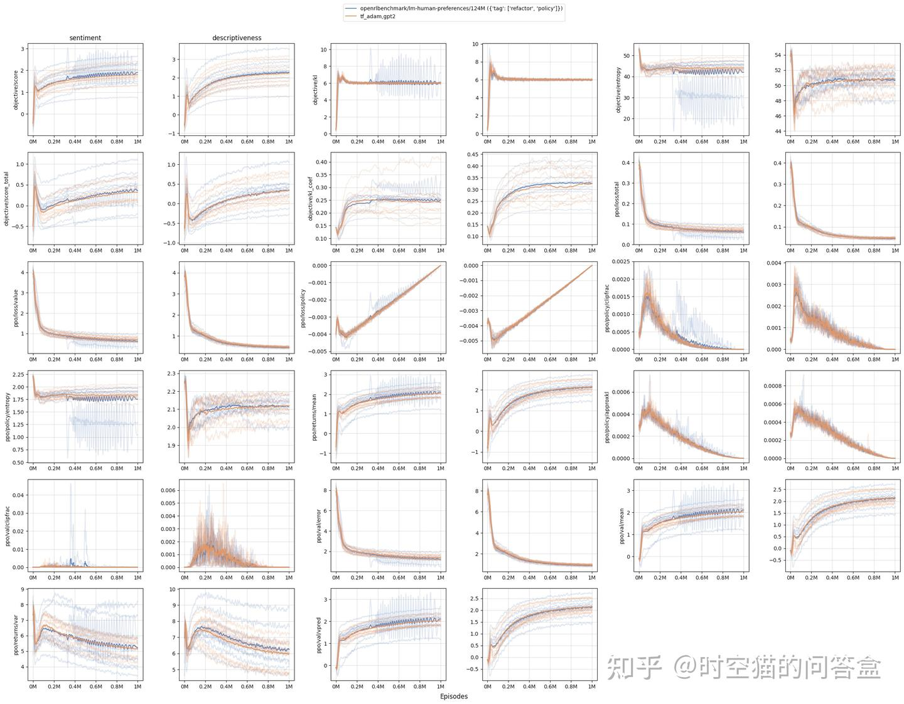
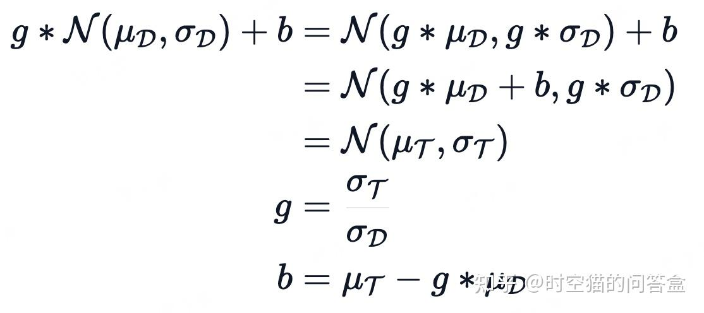
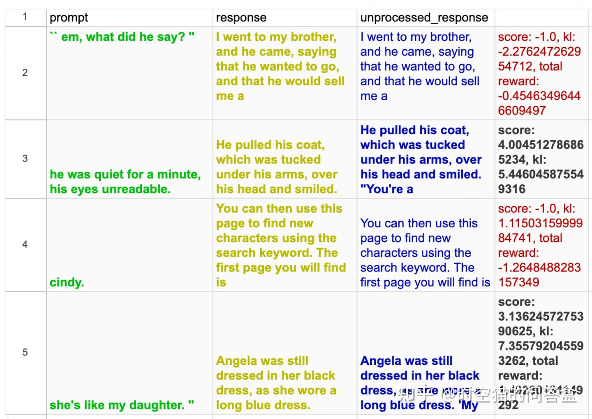
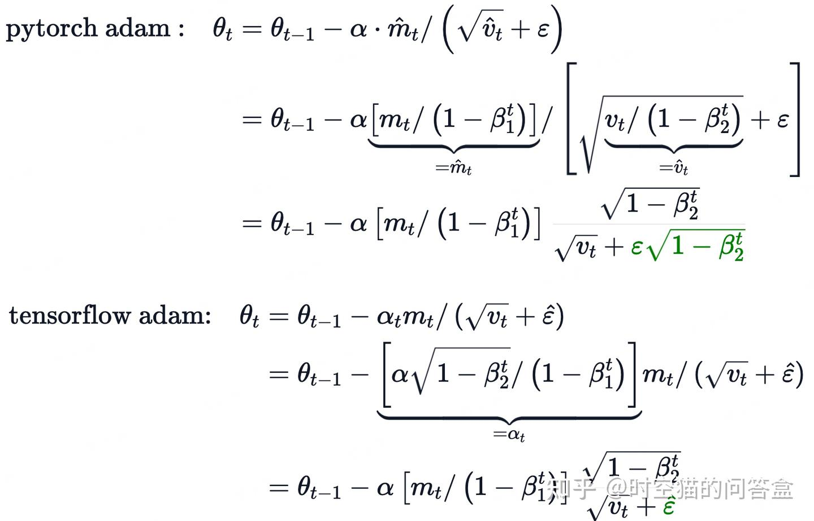
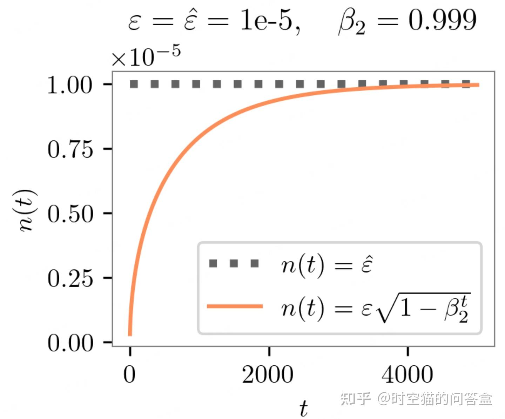

# 解读RLHF-PPO实现细节及代码复现
> 作者: 时空猫的问答盒
> 
> 原文: [https://zhuanlan.zhihu.com/p/20807332864](https://zhuanlan.zhihu.com/p/20807332864)

\# 文章推荐 #

文章名称：The N Implementation Details of RLHF with PPO

文章链接：[https://huggingface.co/blog/the\_n\_implementation\_details\_of\_rlhf\_with\_ppo#limitations](https://link.zhihu.com/?target=https%3A//huggingface.co/blog/the_n_implementation_details_of_rlhf_with_ppo%23limitations)

github链接：[_https://__github.com/vwxyzjn/lm-h__uman-preference-details_](https://link.zhihu.com/?target=https%3A//github.com/vwxyzjn/lm-human-preference-details)

今天我要向大家讲解的是《The N Implementation Details of RLHF with PPO》。首先，我需要解释一下什么是RLHF和PPO，这两个是文章中非常重要的概念。

RLHF，也就是Reinforcement Learning from Human Feedback（人类反馈强化学习），是一种结合了强化学习和人类反馈的方法。简单来说，就是通过人类对AI行为的反馈来训练AI模型，让AI学会更好地完成任务。比如说，我们可以让AI写文章，然后人类告诉它哪些文章写得好，哪些写得不好，AI通过这些反馈来改进自己的写作能力。

PPO，也就是Proximal Policy Optimization（[近端策略优化](https://zhida.zhihu.com/search?content_id=253183709&content_type=Article&match_order=1&q=%E8%BF%91%E7%AB%AF%E7%AD%96%E7%95%A5%E4%BC%98%E5%8C%96&zhida_source=entity)），是一种强化学习算法。它主要用于训练智能体，让智能体在与环境互动的过程中学习最优策略。PPO的核心思想是在更新策略时，尽量保持策略的稳定性，避免在训练过程中出现策略“跳跃式”变化的问题。

**摘要**
------

接下来，我来详细讲解一下这篇文章的摘要。

首先，摘要的第一段提到，RLHF和ChatGPT是最近非常热门的研究方向。作者希望通过研究RLHF，尝试复现OpenAI在2019年发布的原始RLHF[代码库](https://zhida.zhihu.com/search?content_id=253183709&content_type=Article&match_order=1&q=%E4%BB%A3%E7%A0%81%E5%BA%93&zhida_source=entity)。尽管这个代码库使用的是比较老旧的TensorFlow 1.x版本，但它的评估和基准测试非常完善，因此非常适合用来学习RLHF的实现细节。

接下来，作者列出了他们在这篇文章中想要实现的三个目标：

1.  复现OpenAI在风格化任务中的结果，并且让学习曲线与OpenAI的原始代码库非常接近。也就是说，他们希望自己的代码能够像OpenAI的代码一样，训练出性能相似的模型。
2.  提供一份类似于《The 37 Implementation Details of Proximal Policy Optimization》那样的检查清单，总结出一些在实现RLHF时需要注意的关键细节。这些细节包括如何生成奖励/值、如何生成响应等等。
3.  提供一个简单易读、轻量级的RLHF实现版本。也就是说，他们希望自己的代码能够方便其他人阅读和理解，同时尽量减少不必要的复杂性。

作者还提到，这项工作主要是为了教育和学习的目的。对于更高级的用户，如果需要更多的功能，比如训练更大的模型，可以考虑使用Hugging Face的trl库。

接下来，摘要的第二部分详细介绍了他们的贡献。首先，在“Matching Learning Curves”部分，他们展示了自己主要的贡献：创建了一个能够复现OpenAI在风格化任务中结果的代码库，并且这个代码库的学习曲线与OpenAI的原始代码库非常接近。

然后，在“Technical Deep Dive”部分，他们深入探讨了实现RLHF时需要注意的一些技术细节。这些细节可以分为以下几个方面：

1.  General Implementation Details（通用实现细节）：这部分主要介绍了一些基本的实现细节，比如如何生成奖励/值，如何生成响应等。
2.  Reward Model Implementation Details（奖励模型实现细节）：这部分主要讨论了奖励模型的一些实现细节，比如奖励归一化（Reward Normalization）。奖励归一化是指将生成的奖励值进行标准化处理，使得奖励值的分布更加稳定，有助于训练过程的稳定。
3.  Policy Training Implementation Details（[策略训练](https://zhida.zhihu.com/search?content_id=253183709&content_type=Article&match_order=1&q=%E7%AD%96%E7%95%A5%E8%AE%AD%E7%BB%83&zhida_source=entity)实现细节）：这部分主要讨论了策略训练中的一些细节，比如拒绝采样（Rejection Sampling）和奖励“白化”（Reward Whitening）。拒绝采样是指在生成响应时，根据一定的策略选择保留或拒绝某些样本；奖励“白化”是指对奖励值进行处理，使得不同任务之间的奖励值具有可比性。

接下来，他们还提到了一个非常有趣的技术细节，那就是PyTorch和TensorFlow在Adam优化器上的差异。Adam优化器是一种常用的优化算法，用于训练深度学习模型。他们发现，在使用PyTorch和TensorFlow时，Adam优化器在数值计算上有一些差异，这些差异会导致在模型训练过程中出现更激进的更新。这一点对于理解RLHF的实现细节非常重要。

然后，他们还探讨了训练不同[基模型](https://zhida.zhihu.com/search?content_id=253183709&content_type=Article&match_order=1&q=%E5%9F%BA%E6%A8%A1%E5%9E%8B&zhida_source=entity)（比如gpt2-xl、falcon-1b等）的效果，因为这些模型的奖励标签是使用gpt2-large生成的。这部分内容主要是为了验证他们的实现是否能够在不同的基模型上保持一致的性能。

最后，他们总结了这项工作的局限性和讨论。尽管他们成功地复现了OpenAI的代码库，并且提供了一些有价值的实现细节，但他们的实现仍然有一些局限性，比如只支持较小的模型，无法处理更大的模型。此外，他们还提到了一些在训练过程中可能遇到的问题，比如模型的收敛速度和训练的稳定性等。

**1 Matching Learning Curves**
------------------------------

接下来开始讲解文章的“Matching Learning Curves”部分。

首先，这一部分是文章的主要贡献，作者成功地复现了OpenAI在风格化任务中的结果，并且他们的代码库（橙色曲线）生成的学习曲线与OpenAI的原始代码库（蓝色曲线）非常接近。学习曲线是指在训练过程中，模型性能随训练步骤变化的图表，匹配学习曲线意味着他们的实现非常接近于OpenAI的原始实现。

接下来，作者提到他们运行了OpenAI的原始RLHF代码，即openai/lm-human-preferences。这个过程非常重要，因为它提供了有价值的指标，帮助验证和诊断他们的复现工作。然而，他们遇到了一些问题，具体如下：

1.  OpenAI的数据集部分被损坏或丢失。具体来说，OpenAI在GCP Azure迁移过程中丢失了他们的书籍数据集。作者用Hugging Face的书籍[语料库](https://zhida.zhihu.com/search?content_id=253183709&content_type=Article&match_order=1&q=%E8%AF%AD%E6%96%99%E5%BA%93&zhida_source=entity)（bookcorpus）代替了这个数据集。虽然理论上这是OpenAI使用的数据集，但实际性能可能会有所不同。
2.  原始代码无法在单个V100 GPU上运行，因为它不支持[梯度累积](https://zhida.zhihu.com/search?content_id=253183709&content_type=Article&match_order=1&q=%E6%A2%AF%E5%BA%A6%E7%B4%AF%E7%A7%AF&zhida_source=entity)。相反，它使用了较大的批量大小，并将批量分布在8个GPU上。如果只使用1个GPU，会因为内存不足（OOM）而无法运行。
3.  原始代码无法在8个A100 GPU上运行，因为TensorFlow 1.x与Cuda 8+不兼容。
4.  原始代码也无法在8个V100（16GB）GPU上运行，因为同样会因为内存不足而OOM。
5.  最后，原始代码只能在8个V100（32GB）GPU上运行，这在AWS上是p3dn.24xlarge实例提供的配置。

通过这些信息，我们可以看出，复现OpenAI的原始代码需要特定的硬件配置和数据集，这在一定程度上限制了作者的工作。然而，他们成功地在这些条件下运行了代码，并验证了他们的实现与OpenAI的原始实现非常接近。

**2 General Implementation Details**
------------------------------------

接下来开始讲解文章的 General Implementation Details部分。

首先，这一部分深入探讨了实现RLHF时需要注意的一些技术细节。作者详细介绍了奖励模型和策略的价值头如何处理输入，包括如何拼接查询和响应，以及如何处理填充和截断。

1.  奖励模型和策略的价值头输入处理：  
    \- 奖励模型和策略的价值头将查询和响应拼接起来作为输入。例如，查询和响应会被拼接成一个连续的文本序列，然后进行前向传播，生成奖励和价值。  
    \- 作者通过一个具体的例子展示了如何拼接查询和响应，并说明了奖励和价值的形状。
2.  填充和截断：  
    \- OpenAI使用了一个特殊的填充令牌，并在处理输入时会截断过长的序列。  
    \- 作者建议在使用Hugging Face的transformers库时，将填充令牌设置为“\[PAD\]”，并确保在填充时正确处理注意力掩码。  
    \- 他们提供了一个代码示例，展示了如何使用tokenizer.pad方法来填充输入，并生成相应的注意力掩码。
3.  调整位置索引：  
    \- 在计算[logits](https://zhida.zhihu.com/search?content_id=253183709&content_type=Article&match_order=1&q=logits&zhida_source=entity)时，模型需要正确处理填充令牌的位置索引。  
    \- 作者展示了如何通过调整位置索引来确保填充令牌不影响模型的输出，保持与原始实现一致。
4.  响应生成：  
    \- 作者提到，OpenAI在生成响应时使用了top\_k=0和top\_p=1.0，这意味着在生成过程中不使用任何采样限制，而是直接进行分类抽样。  
    \- 生成的响应长度是固定的，即使遇到EOS令牌也会继续生成，直到达到指定长度。  
    \- 在使用Hugging Face的[生成函数](https://zhida.zhihu.com/search?content_id=253183709&content_type=Article&match_order=1&q=%E7%94%9F%E6%88%90%E5%87%BD%E6%95%B0&zhida_source=entity)时，需要注意设置eos\_token\_id和pad\_token\_id为None，以避免生成过程中提前终止。
5.  学习率衰减：  
    \- 奖励模型和策略在训练时，学习率会逐渐衰减到零，以防止过拟合。  
    \- 这种方法在Ziegler et al. (2019)中被建议用于训练奖励模型，因为数据量有限，单个[epoch](https://zhida.zhihu.com/search?content_id=253183709&content_type=Article&match_order=1&q=epoch&zhida_source=entity)的训练有助于避免过拟合。
6.  不同进程中的随机种子：

\- 在使用多进程数据并行时，每个进程使用不同的随机种子。

\- 这样可以确保不同进程生成的响应和得分不同，提高训练的多样性和稳定性。

\- 作者提到，数据集的洗牌可能存在一些问题，需要进一步验证。

**3 Reward Model Implementation Details**
-----------------------------------------

接下来开始讲解文章的“Reward Model Implementation Details”部分。

首先，这一部分主要讨论了奖励模型的实现细节，包括奖励标准化和层初始化等内容。作者详细介绍了在实现奖励模型时需要注意的一些关键点，这些细节对于复现[OpenAI](https://zhida.zhihu.com/search?content_id=253183709&content_type=Article&match_order=19&q=OpenAI&zhida_source=entity)的原始实现非常重要。

1.  奖励模型输出的位置：  
    \- 奖励模型的输出只在最后一个标记处提取。在OpenAI的设置中，查询和响应的总长度是固定的，例如88个标记。奖励模型的输出形状为(B, T, 1)，其中T是总长度。作者从最后一个标记提取奖励，因此形状变为(B, 1)。  
    \- 这一点非常重要，因为后续的训练和评估都依赖于这个奖励值。
2.  奖励头层的初始化：  
    \- 奖励头的权重初始化遵循正态分布，均值为0，方差为1/(dmodel +1)，其中dmodel是模型的嵌入维度。没有平方根，所以方差是1/(dmodel +1)。  
    \- 偏置项初始化为0。这种初始化方法有助于保持奖励模型的稳定性，避免在训练初期出现过大的输出值。
3.  奖励模型的标准化：  
    \- 作者提到，为了保持奖励模型的尺度一致，需要对其进行标准化处理，使其均值为0，方差为1。  
    \- 这个过程涉及到计算奖励的增益和偏置参数。首先，设置增益为1，偏置为0，然后从目标数据集中收集样本，计算奖励的均值和标准差。  
    \- 使用这些统计量来调整增益和偏置，使得奖励分布符合目标分布（均值0，方差1）。  
    \- 这个标准化过程在训练前后都会应用，确保奖励模型的输出在训练过程中保持一致的尺度。

1.  响应生成的注意事项：  
    \- 在生成响应时，使用top\_k=0和top\_p=1.0，这意味着不使用任何采样限制，直接进行分类抽样。  
    \- 生成的响应长度是固定的，即使遇到EOS标记也会继续生成，直到达到指定长度。  
    \- 在使用Hugging Face的生成函数时，需要注意设置eos\_token\_id和pad\_token\_id为None，以避免生成过程中提前终止。
2.  学习率衰减：  
    \- 奖励模型和策略在训练时，学习率会逐渐衰减到零，以防止过拟合。  
    \- 这种方法在Ziegler et al. (2019)中被建议用于训练奖励模型，因为数据量有限，单个epoch的训练有助于避免过拟合。
3.  不同进程中的随机种子：

\- 在使用多进程数据并行时，每个进程使用不同的随机种子。

\- 这样可以确保不同进程生成的响应和得分不同，提高训练的多样性和稳定性。

\- 作者提到，数据集的洗牌可能存在一些问题，需要进一步验证。

**4 Policy Training Implementation Details**
--------------------------------------------

接下来开始讲解文章的“Policy Training Implementation Details”部分。

首先，作者讨论了对对数概率的缩放。在计算响应的对数概率时，模型会先输出各个词的对数概率，然后将这些对数概率除以采样温度。采样温度默认设置为1，这样可以保持输出的稳定性。如果不进行这种缩放，[KL散度](https://zhida.zhihu.com/search?content_id=253183709&content_type=Article&match_order=1&q=KL%E6%95%A3%E5%BA%A6&zhida_source=entity)可能会增长得更快，导致性能下降。

接下来是价值头层的初始化。奖励头的权重初始化遵循正态分布，均值为0，方差为1/(dmodel +1)，其中dmodel是模型的嵌入维度。没有平方根，所以方差是1/(dmodel +1)。这种初始化方法有助于保持奖励模型的稳定性，避免在训练初期出现过大的输出值。偏置项初始化为0。

然后是数据预处理部分，特别是查询文本的处理。作者提到，他们选择那些以句号开头和结尾的文本作为查询。在数据预处理阶段，他们会尝试截取文本，只保留从句号开始的部分，并进行填充。然而，由于OpenAI的数据集在迁移过程中部分损坏，他们不得不使用Hugging Face的书籍语料库作为替代。这个语料库已经预处理过，因此他们不需要额外处理，只需设置start\_text和end\_text为None即可。

接下来是关于策略训练中是否使用Dropout。Ziegler et al. (2019)建议在策略训练中不使用Dropout，这一点在代码中也得到了体现。通过禁用Dropout，可以减少训练过程中的不确定性，提高模型的稳定性。

然后是拒绝采样。作者详细解释了OpenAI如何使用拒绝采样来确保生成的响应在特定位置有一个句号。具体来说，他们会在生成的响应中截断到第一个出现的句号，并对不符合条件的样本赋予一个固定的低奖励值，如-1。通过这种方式，他们可以过滤掉不符合要求的样本，提高训练数据的质量。

接下来是折扣因子的设置。作者将折扣因子γ设置为1，这意味着未来奖励和当前奖励的权重相同，不会随着时间衰减。这种设置有助于模型关注长期奖励，而不仅仅是近期的奖励。

然后是训练循环中的术语，包括批量大小和小批量大小。作者通过一个具体的代码示例，展示了如何划分批量和小批量，以及如何进行梯度累积。这种划分方法有助于在训练过程中更高效地利用计算资源，同时保持训练的稳定性。

接下来是每令牌的KL惩罚。作者提到，在策略训练中，他们会在每个令牌上添加一个KL惩罚项，以防止策略与原始策略之间的差异过大。通过这种方式，可以保持策略的稳定性，避免在训练过程中出现策略的“跳跃式”变化。

然后是奖励和优势的“白化”处理。作者解释了OpenAI如何对奖励和优势进行标准化，即减去均值并除以标准差。这种处理有助于保持奖励和优势的尺度一致，避免训练过程中出现数值不稳定的问题。他们还比较了PyTorch和TensorFlow在计算均值和方差时的不同行为，指出这种差异可能会影响最终的训练结果。

接下来是价值函数的截断。作者提到，价值函数的输出会被截断，以防止其超出一定的范围。这种截断方法类似于PPO算法中的处理方式，有助于保持价值函数的稳定性，避免在训练过程中出现数值溢出的问题。

最后是自适应KL控制。作者解释了如何根据当前策略与前一策略之间的KL散度，自适应地调整KL惩罚系数β。如果KL散度超出目标范围，惩罚系数会被调整，以使KL散度回到目标范围内。这种自适应方法有助于保持策略的稳定性，同时[允许策略](https://zhida.zhihu.com/search?content_id=253183709&content_type=Article&match_order=1&q=%E5%85%81%E8%AE%B8%E7%AD%96%E7%95%A5&zhida_source=entity)在必要时进行较大的调整。

**5 PyTorch Adam optimizer numerical issues w.r.t RLHF**
--------------------------------------------------------

接下来开始讲解文章的 PyTorch Adam optimizer numerical issues w.r.t RLHF部分。

首先，这一部分讨论了PyTorch和TensorFlow在实现Adam优化器时的差异，特别是在RLHF中的影响。Adam优化器是一种常用的优化算法，用于训练深度学习模型。然而，PyTorch和TensorFlow在实现Adam优化器时有一些细微的差别，这些差别在RLHF训练中可能会导致不同的结果。

作者首先比较了PyTorch和TensorFlow的Adam优化器实现。PyTorch遵循的是Kingma和Ba的原始Adam算法（Algorithm 1），而TensorFlow使用的是另一种变体，具体来说是位于Adam文章中Section 2.1之前的公式。这种差异主要体现在对偏置校正和epsilon处理上。

在PyTorch中，Adam优化器的实现遵循了Kingma和Ba的原始算法，具体来说，它使用了两个偏置校正项：bias\_correction1和bias\_correction2。这两个校正项分别用于校正梯度的一阶[矩估计](https://zhida.zhihu.com/search?content_id=253183709&content_type=Article&match_order=1&q=%E7%9F%A9%E4%BC%B0%E8%AE%A1&zhida_source=entity)和二阶矩估计。在每一步，PyTorch会计算这两个校正项，并将其应用于学习率和梯度的更新中。

而在TensorFlow中，Adam优化器的实现略有不同。它使用了一个不同的公式来计算学习率和梯度的更新。具体来说，TensorFlow的Adam优化器在计算学习率时，只考虑了二阶矩的偏置校正，而没有考虑一阶矩的偏置校正。此外，TensorFlow还使用了一个不同的epsilon处理方式，即epsilon hat，这在PyTorch中并没有直接体现。

接下来，作者通过具体的伪代码比较了PyTorch和TensorFlow的Adam优化器实现。PyTorch的实现包括计算bias\_correction1和bias\_correction2，并将其应用于学习率和梯度的更新中。而TensorFlow的实现则使用了不同的学习率计算方式和梯度更新方式。

作者进一步解释了这两种实现的数学差异。PyTorch的Adam优化器在更新参数时，使用了两个偏置校正项，并将其应用于梯度的更新中。而TensorFlow的Adam优化器则使用了一个不同的学习率计算方式，并且在更新梯度时，只考虑了二阶矩的偏置校正。

为了更直观地理解这两种实现的差异，作者提供了一个数学公式比较。PyTorch的Adam优化器在更新参数时，使用了两个偏置校正项，并将其应用于梯度的更新中。而TensorFlow的Adam优化器则使用了一个不同的学习率计算方式，并且在更新梯度时，只考虑了二阶矩的偏置校正。

作者还提供了一个具体的代码示例，展示了PyTorch和TensorFlow的Adam优化器实现的差异。PyTorch的实现包括计算bias\_correction1和bias\_correction2，并将其应用于学习率和梯度的更新中。而TensorFlow的实现则使用了不同的学习率计算方式和梯度更新方式。

接下来，作者讨论了这两种实现的差异对RLHF训练的影响。他们指出，PyTorch的Adam优化器在训练初期会进行更激进的梯度更新，这可能导致模型的KL散度更大，从而影响训练的稳定性。此外，他们还提供了一些实验结果，比较了PyTorch的Adam优化器和自定义的TensorFlow-style Adam优化器在训练过程中的表现。

在实验中，作者记录了PyTorch的Adam优化器和自定义的TensorFlow-style Adam优化器在训练过程中的各项指标，包括policy/approxkl、policy/clipfrac、ratio\_mean、ratio\_var等。他们发现，PyTorch的Adam优化器在训练初期会进行更激进的梯度更新，导致KL散度更大，clipfrac更高，训练过程中的波动也更大。

此外，作者还发现，这种差异在训练大模型时表现得更加明显。例如，在训练gpt2-xl模型时，PyTorch的Adam优化器会导致更大的KL散度和更高的clipfrac，从而影响模型的训练稳定性。

为了进一步验证这一点，作者提供了一些实验结果，包括在训练gpt2和gpt2-xl模型时，PyTorch的Adam优化器和自定义的TensorFlow-style Adam优化器在训练过程中的表现。他们发现，PyTorch的Adam优化器在训练gpt2模型时表现与自定义的TensorFlow-style Adam优化器相似，但在训练gpt2-xl模型时，PyTorch的Adam优化器会导致更大的KL散度和更高的clipfrac，从而影响模型的训练稳定性。

最后，作者总结了这些发现，并强调了在RLHF训练中选择合适的Adam优化器实现的重要性。他们建议在复现OpenAI的原始代码时，应该选择与OpenAI使用的优化器实现相匹配的版本，以确保训练过程和结果的一致性。

**6 Limitations**
-----------------

接下来开始讲解文章的 Limitations部分。

首先，作者提到他们没有尝试复现摘要任务，比如CNN/Daily Mail或TL;DR，因为这些任务的训练非常耗时且不稳定。他们发现训练过程中的GPU利用率只有约30%，这意味着在AWS的p3dn.24xlarge实例上训练需要近四天时间，成本高昂。

此外，训练过程不够稳定。虽然奖励得分有所提高，但很难复现Ziegler et al. (2019)中提到的“智能复制者”行为。作者提供了一些样本输出，显示代理出现了过拟合的情况。他们还分享了WandB的链接，供读者查看完整的日志。

最后，作者指出，尽管他们的实现成功复现了OpenAI的代码库，但仅限于较小的模型，无法处理更大的模型。此外，训练过程中还存在一些问题，如模型的收敛速度和训练的稳定性等。这些局限性为后续的研究者提供了改进的方向，特别是在硬件配置和训练稳定性方面。

**结论**
------

接下来开始讲解文章的结论部分。

结论部分总结了作者的主要工作和发现，同时指出了研究的局限性和未来的研究方向。

首先，作者提到他们深入研究了OpenAI的原始RLHF代码库，并整理了其中的实现细节。他们创建了一个最小的基础实现，当数据集和超参数保持一致时，能够复现与OpenAI原始代码相同的学习曲线。这意味着他们的实现成功地模拟了OpenAI的训练过程，证明了他们对RLHF的理解和实现是正确的。

接下来，作者指出了一些令人惊讶的实现细节，特别是Adam优化器的设置，这在早期的RLHF训练中导致了更激进的梯度更新。他们发现，PyTorch和TensorFlow在实现Adam优化器时存在差异，这种差异在训练过程中表现得尤为明显，尤其是在训练初期，PyTorch的Adam优化器会导致更大的KL散度和更高的clipfrac，从而影响训练的稳定性。这一发现为后续的研究者提供了重要的参考，特别是在选择优化器实现时需要考虑这些差异。

此外，作者还提到，尽管他们的实现成功复现了OpenAI的代码库，但仅限于较小的模型，无法处理更大的模型。这表明，他们的实现可能在扩展性上存在一定的限制，未来的研究可以进一步优化硬件配置和训练策略，以支持更大规模的模型训练。

最后，作者总结了这项工作的意义和价值。他们通过详细列出实现RLHF时需要注意的关键细节，为研究者和开发者提供了一个宝贵的参考。这些细节不仅帮助复现了OpenAI的原始实现，还为后续的研究提供了重要的指导，特别是在优化器选择、数据预处理和模型训练稳定性方面。