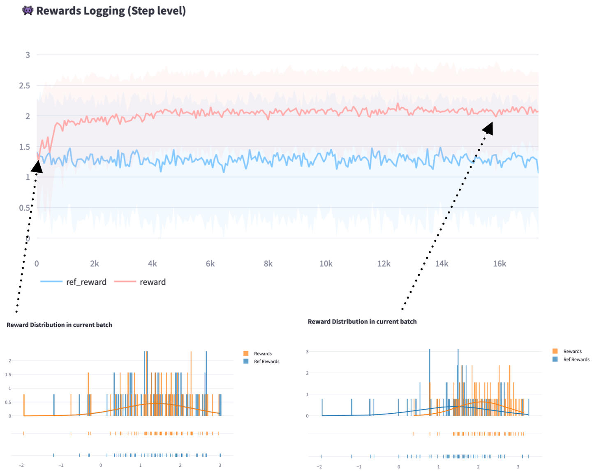
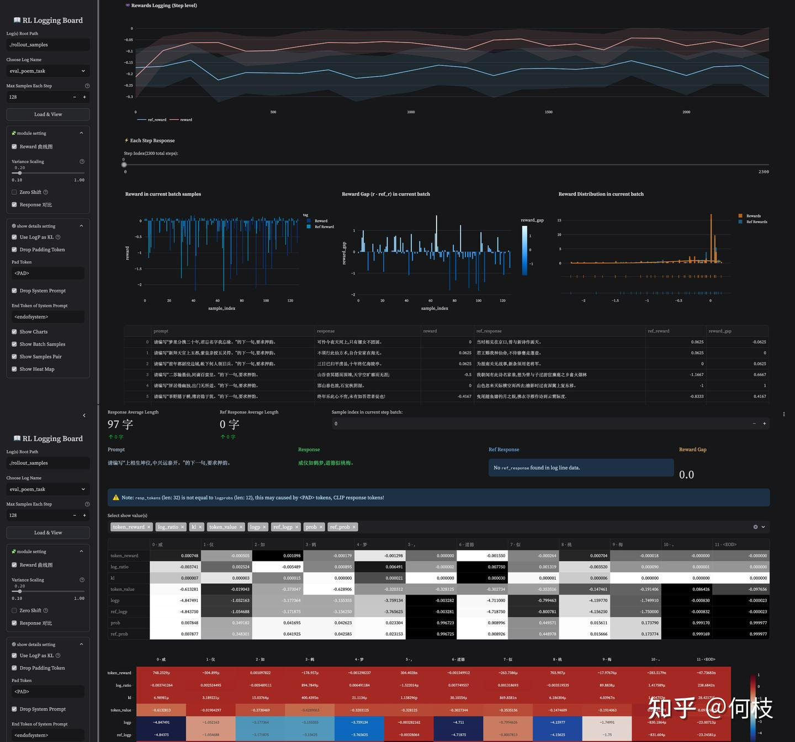
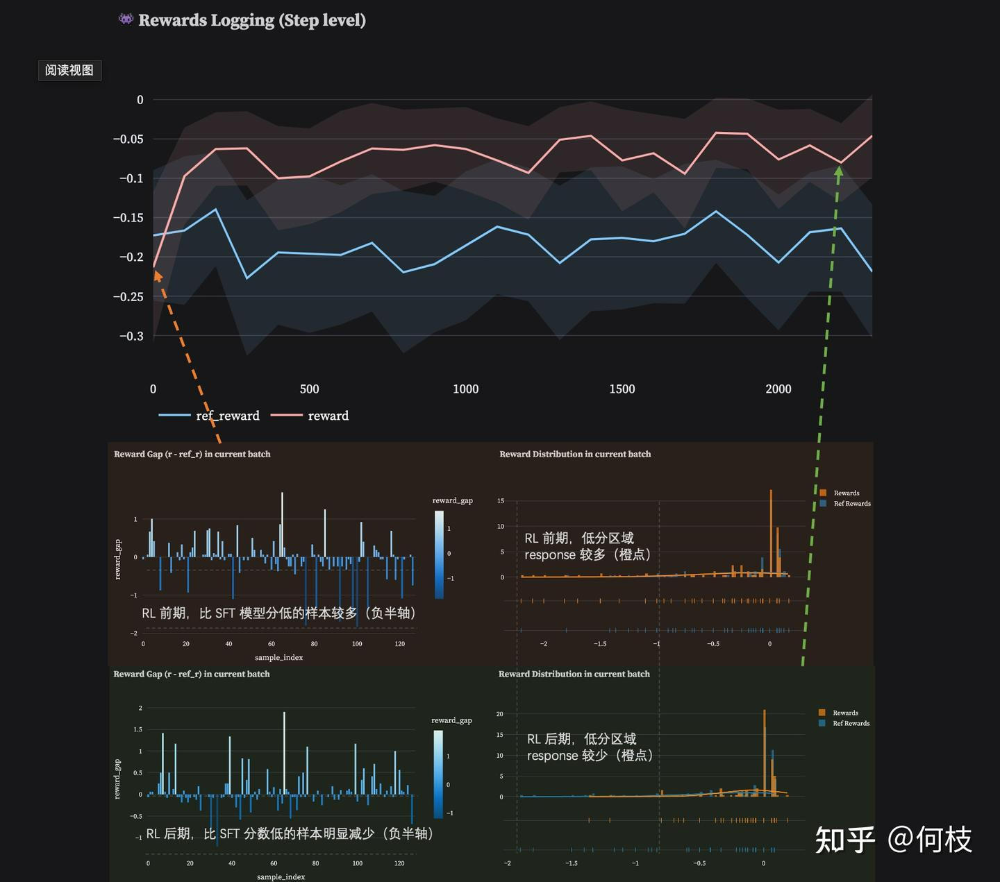
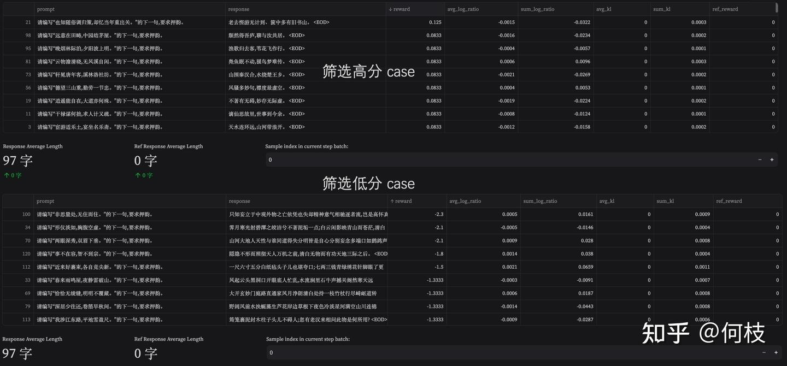
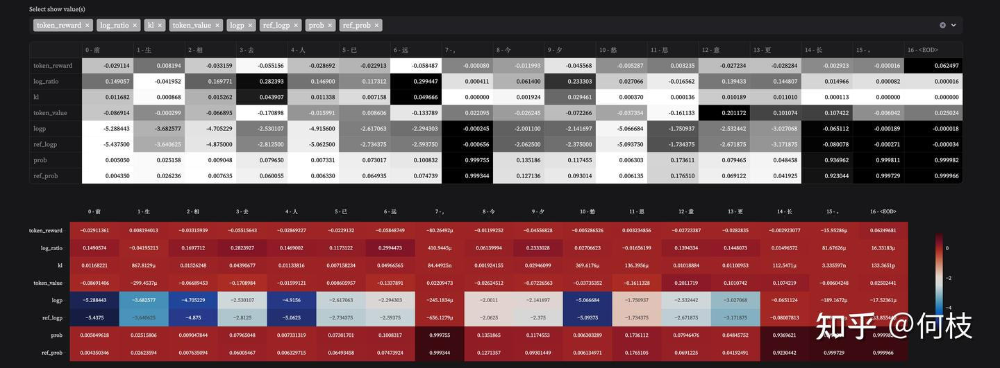

# 如何让 RLHF 训练更稳定
> _**作者: 何小枝与NLP的快乐日常**_
> 
> _**原文:**_ [_**https://zhuanlan.zhihu.com/p/16734946629**_](https://zhuanlan.zhihu.com/p/16734946629)



如何让 RLHF 训练更稳定？
---------------

不知不觉做 RLHF 已经一年多了，跳了很多坑，也慢慢累积了一些经验。

这一年中最大的感触是：**RL 是一门需要被非常深入理解的学科，而可视化是深入理解的第一步**。

之前很长一段时间里，为了弄清为什么就是训不 work，我感觉我写画图代码的时间比写训练代码的时间还要多。

（=-=）

今天整理文档的时候，无意间又看到之前的实验记录，那些训练失败的记忆突然开始攻击我，

于是，我打算把我平时用的比较多的一个 \[[可视化工具](https://link.zhihu.com/?target=https%3A//github.com/HarderThenHarder/RLLoggingBoard)\] 分享出来，希望能帮助大家更好驯服 PPO 这匹烈马 :)

* * *

RL Logging Board 是一个将 Reinforcement Learning from Human Feedback（RLHF）的训练过程进行可视化的工具，旨在：

1.  帮助人们「直观理解 RL 训练过程」（token 概率会随着训练升高/降低情况、response reward 分布变化等）。
2.  当训练不符合预期时，通过监控 token 粒度的指标来定位可能的问题（异常 token 的 kl 过大等）。
3.  更直观的看到每一个 step 高 / 低 reward 对应的 response 分布，用于发现 [reward hacking](https://zhida.zhihu.com/search?content_id=252369010&content_type=Article&match_order=1&q=reward+hacking&zhida_source=entity) 的潜在 pattern。
4.  对RL & SFT 模型之间进行包含 response、reward 在内的多个方面的对比。

**⚠️** 注意： RL Logging Board 仅进行指标可视化，不包含训练框架本身！该工具初衷并非是成为 [tensorboard](https://zhida.zhihu.com/search?content_id=252369010&content_type=Article&match_order=1&q=tensorboard&zhida_source=entity) & wanDB 的平替，事实上我们在实做的时候也会同时使用 tensorboard 和该工具。对于一些数值类型的简单 metric（例如 reward\_mean，response\_length，loss 等）tensorboard 已经能很好的胜任，而对于一些更细粒度的展示（如 token 级别的指标）我们会使用该工具进行辅助。



> RL Logging Board Overview

使用该工具需要使用者在自己使用的训练框架中（如：\[[OpenRLHF](https://link.zhihu.com/?target=https%3A//github.com/OpenRLHF/OpenRLHF)\]），加入对应的指标保存代码（保存为 `.jsonl` 的本地文件，在后续内容中会有对应 OpenRLHF 的数据获取示例），再使用该工具进行可视化。

我们会在后面详细介绍所有需要保存的每一个 [metric](https://zhida.zhihu.com/search?content_id=252369010&content_type=Article&match_order=2&q=metric&zhida_source=entity)，并提供一些 \[[示例文件](https://link.zhihu.com/?target=https%3A//github.com/HarderThenHarder/RLLoggingBoard/blob/main/rollout_samples/eval_poem_task/data.jsonl)\] 以供参考。

1\. 有哪些可视化的部分？（Visualization Modules）
-------------------------------------

在这个部分中我们将描述该工具支持的所有可视化功能，并分享一些我个人常用到的一些关键部分。

我们使用一个非常简单的「押韵任务」（训练模型续写的诗句必须押韵）来进行示例展示，以便于大家理解。

### 1.1 Reward Area（curve & distribution）

reward 是 RL 训练中的核心指标，也是训练中观测最频繁的一个 metric，我们主要关注：

*   [**训练曲线**](https://zhida.zhihu.com/search?content_id=252369010&content_type=Article&match_order=1&q=%E8%AE%AD%E7%BB%83%E6%9B%B2%E7%BA%BF&zhida_source=entity)**（Traning Curves）：** 在保存文件中，我们可以将 reference model 的 reward 保存，随后进行可视化（可选），这通常需要让 reference model（init policy）对指定的 prompt(s) 进行推理，并得到打分结果。因此这个过程通常发生在 dev 测试集上（或者在训练集合中提前把 init policy 的结果提前跑好），该指标能更好的进行 RL Model 和 Reference Model 之间的 metric 比较，是一个可选项（如果不保存 reference metric 则会只展示 rl model 的 metirc）。
*   **每个 batch 内得分分布（Reward Distribution）：** 通过观测得分分布，我们可以直观的看到 RL 训练的收敛性，由于 PPO 属于 \[[Reverse KL](https://link.zhihu.com/?target=https%3A//agustinus.kristia.de/blog/forward-reverse-kl/)\] 的优化方法，因此正常来讲，训练后期的 reward distribution 应该比前期收的更尖锐（如下图中上下两部分中的右侧柱状统计图），如果训练过程发现并非如此，那么我们可能需要关注下训练框架或是训练 setting 中是否存在问题。
*   **与 Reference Model 之间的 reward 差值分布：** 正常来讲，训练到后期的模型 reward 低于 init policy 的样本应当越来越少（如下图中上下两部分中的左侧侧柱状统计图），我们可以通过查看在训练过程中一直未能战胜 init policy 的那些样本，并分析为什么这类样本无法提升。（是否是训练集的 [OOD](https://zhida.zhihu.com/search?content_id=252369010&content_type=Article&match_order=1&q=OOD&zhida_source=entity)，或是 RM 的 OOD）



> Reward Area Overview

### 1.2 Response Area（Sort by Many Metrics）

Instance Level 的监控同样比较重要，我们不仅需要看到一个 step 的 mean reward，同时希望看到这个 step 下每一个样本的具体指标是怎样的（这有助于我们找到整个训练过程中的那些“害群之马”，将那些异常的 case 筛选出来进行分析）。

我们主要关注：

*   **按 reward 排序（Reward Sort）：** 通过升序/降序排列，我们能够查看每个 batch 内部分数高（或低）的样本的特征。对于高分，我们需要着重考虑这类 prompt 是否存在 hacking features（这通常会通过一些其他方法锁定到发生 hacking 的 step 范围），接着尝试在这些 step(s) 内的高分样本中观测得到可能的 hacking feature(s)，并在 Reward Model 侧验证这些猜想。对于低分，我们需要尝试解释这类 prompts 为何一直无法被优化（这可能是由于 init policy 能力不足以完成这类型的任务，或是现有 [reward model](https://zhida.zhihu.com/search?content_id=252369010&content_type=Article&match_order=1&q=reward+model&zhida_source=entity) 对这类任务打不出更高的分数等）。
*   **按 log\_ratio 排序（KL Sort）：**log\_ratio（或 KL）能够直接反应「当前模型被优化的程度」，因此我们可以对 log\_ratio 进行排序，我们能够看到在相同的训练步数下，哪些类型的 prompts 被优化的程度过高（小心会过早的出现 hacking），哪些类型的 prompts 被优化的很少（不怎么能被提升）。除此之外，由于 kl 会和 reward 一起被加入 returns 中优化，因此，对 kl 的监控也是必要的（例如出现 negative kl 过大导致训练目标偏移），这时我们需要找到那些 kl 过大的样本，并对这些样本进行分析（为什么会出现过大 kl 的情况），从而排除一些训练框架本身的问题。



> Response Area Overview

### 1.3 Token Area（kl, critic value, dense\_reward, prob）

Token Level 的监控是我们所能做到最小粒度的监控，它反映了整个 RL 训练过程中每一个 token 上的变化情况，具体来讲，我们主要关注：

*   **token reward：** 这是 policy model 训练时真实使用的 signal（= kl\_penalty + rewards(dense or sparse)）。我们可以关注训练过程中，每个 step 下不同 token 被「奖励 or 惩罚」的程度，从而帮助我们更好的调整各项 reward signal 之间的比例（例如 kl\_coef，或是 dense signal 的 ratio）。
*   **token value：** 这是 critic model 为当前 policy model 在每个 token（action）上给出的评价（state value），通过直接比较 token value 和 token reward（往后 cumulative 一下），我们能较为直观的看出 value model 对哪些 token 的拟合是容易的（MSE 小），对哪些 token 的拟合是困难的（MSE 大）。
*   **prob & ref\_prob：** 该指标反映了当前 response 中每一个 token 「被当前 policy 选择的概率」和「被 init policy 选择的概率」，相比于 log\_ratio，概率能够更直观的让我们理解模型当前的「策略」是怎样的。对于那些低分 case，我们可以观测在 init policy 模型上它们的概率是怎样的，若 init model 较为「坚定」的选择了这些 bad case，或许我们可以反查回 sft 数据中大概率存在这样的异常数据。



> Token Area Overview

2\. 如何运行该工具？
------------

### 2.1 保存数据格式

在之前介绍中有提到，因为这个工具本身只做可视化，本身不包含训练，因此需要我们在别的训练框架中自行保存工具所需要的 metric，因为与训练框架解耦，理论可以支持任何训练框架的训练[过程可视化](https://zhida.zhihu.com/search?content_id=252369010&content_type=Article&match_order=1&q=%E8%BF%87%E7%A8%8B%E5%8F%AF%E8%A7%86%E5%8C%96&zhida_source=entity)。

工具加载需要 `.jsonl` 的文件，每一行 json 需要包含以下 key：

| **字段名** | **类型** | **描述** |
| --- | --- | --- |
| prompt | str | prompt 的字符串形式（可带 Pad Token，后续在工具里设置自动过滤即可），通常在 generate 中拿到 |
| response | str | response 的字符串形式（可带 Pad Token，后续在工具里设置自动过滤即可），通常在 generate 中拿到 |
| response\_tokens | List\[str\] | response token 的 str list，用于逐 token 展示细粒度指标（kl，dense signal 等），可通过 tokenizer.convert\_ids\_to\_tokens() 获得 |
| logprobs | List\[float\] | response token 对应 policy model 的 log\_probs，在 forward 过程 中获得 |
| ref\_logprobs | List\[float\] | response token 对应 reference model 的 log\_probs，在 forward 过程 中获得 |
| values | List\[float\] | critic model 对 response token 打出的 value 值，在 critic forward 阶段中获得 |
| token\_rewards | List\[float\] | kl\_penalty + reward (dense 直接相加，sparse 加在尾 token)，对应训练中所使用的真实 rewards，通过 combined reward 获得 |
| reward | float | response 的整体 reward，通过 rm 打分 后获得 |
| step | int | 当前数据的训练步数，在 training loop 中获得 |
| ref\_response | str, Optional | reference model 对该 prompt 的采样结果（可选） |
| ref\_reward | float, Optional | reference response 的整体 reward（可选） |

```text-plain
{
    "prompt": "<PAD>请编写“上相生坤位,中兴运泰开。”的下一句,要求押韵。",
    "response": "威仪如鹤梦,道德似桃梅。<EOD><PAD>",
    "response_tokens": ["威", "仪", "如", "鹤", "梦", ",", "道德", "似", "桃", "梅", "。", "<EOD>", "<PAD>"],
    "logprobs": [-4.847491264343262, -1.052163004875183, -3.1773641109466553, -3.155355215072632, -3.759133815765381, -0.0032821616623550653, -4.711000442504883, -0.7994625568389893, -4.159769535064697, -1.7499101161956787, -0.0008301864145323634, -2.3007127310847864e-05],
    "ref_logprobs": [-4.84375,-1.0546875,-3.171875,-3.15625,-3.765625,-0.0032806396484375,-4.71875,-0.80078125,-4.15625,-1.75,-0.00083160400390625,-2.3245811462402344e-05],
    "values": [-0.61328125,-0.01904296875,-0.373046875,-0.62890625,-0.3203125,-0.328125,-0.302734375,-0.353515625,-0.1474609375,-0.19140625,0.08642578125,-0.09765625],
    "token_rewards": [0.0007482529035769403,-0.0005048990133218467,0.001097822212614119,-0.00017895699420478195,-0.0012982368934899569,3.0440278919741104e-07,-0.0015499115688726306,-0.0002637386496644467,0.0007039070478640497,-1.7976761228055693e-05,-2.835178918303427e-07,-4.77368296003533e-08],
    "reward": 0.0,
    "step": 4,
    "（Optional）ref_response": "从 reference model 采样的结果（可选）",
    "（Optional）ref_reward": 0.0,
},
...
```

将数据文件保存到 `./rollout_samples/` 目录下一个 `单独的文件夹` 即可。

**Note:** 工具会读取目标文件夹下的所有 .jsonl 文件，因此在训练中可按 DP 存储为独立的文件（这样就不用 gather 到主节点），工具会根据 json data 中的 `step` 进行自动整合。

完整源码见：

_以上，_

_祝大家在即将到来的蟒蛇年里：任务把把不挂，模型代代屠榜 ~_