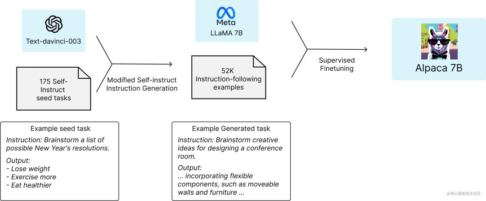
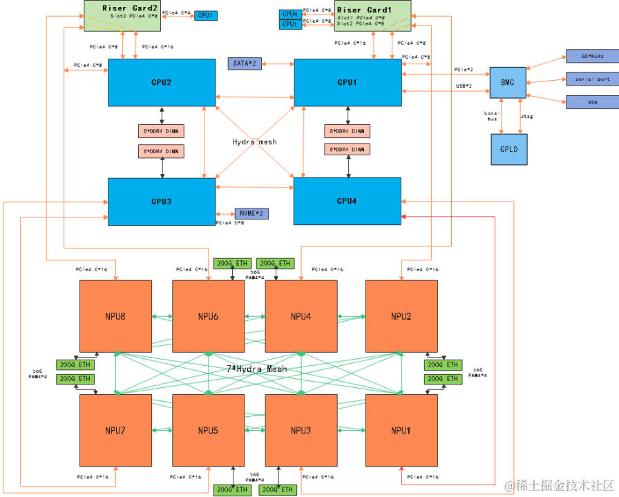
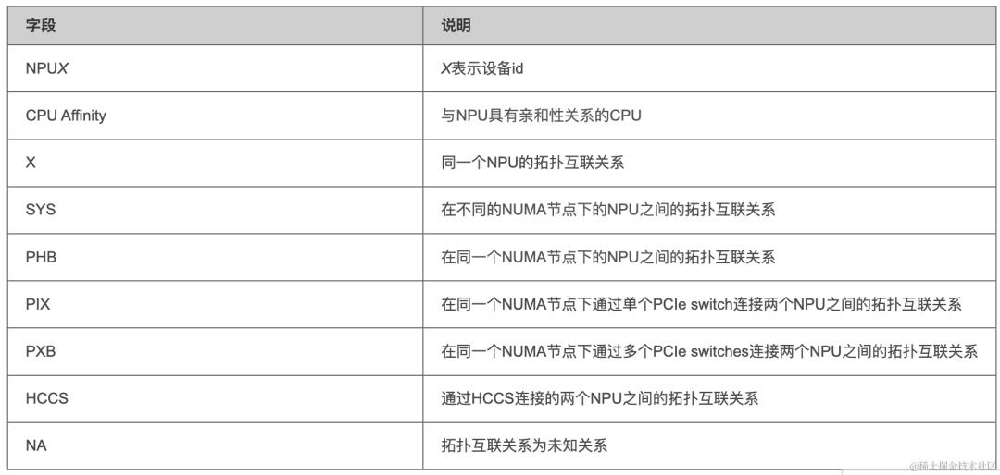

# 大模型国产化适配10-快速迁移大模型到昇腾910B保姆级教程（Pytorch版）
随着 ChatGPT 的现象级走红，引领了AI大模型时代的变革，从而导致 AI 算力日益紧缺。与此同时，中美贸易战以及美国对华进行AI芯片相关的制裁导致 AI 算力的国产化适配势在必行。之前也分享过一些国产 AI 芯片、使用国产 AI 框架 Mindformers 基于昇腾910训练大模型，使用 MindIE 进行大模型服务化。

另外，我撰写的**大模型相关的博客及配套代码**均整理放置在Github：llm-action，有需要的朋友自取。

而本文将讲述如何快速迁移大模型到昇腾910B，相信很多人入门大模型都是从斯坦福羊驼开始，本文将使用羊驼的训练代码和训练数据集快速将baichuan2-7B/13B、qwen1.5-7B/14B大模型在昇腾910B上面进行训练。之前的文章讲过 从0到1复现斯坦福羊驼（Stanford Alpaca 7B），本文不再赘述，斯坦福羊驼的整体思路如下图所示。



image.png

声明：本次只做训练流程上面的验证，不做loss精度的对齐，不同模型训练的细微差异需视具体情况进行调整。

**准备工作**
--------

*   **操作系统版本/架构**：EulerOS 2.0 (SP10)/aarch64
*   **NPU**：8x 910B 64G
*   **Python**：3.9
*   **NPU 驱动**：24.1.rc1，下载
*   **NPU 固件**：7.1.0.6.220，下载
*   **CANN 工具包**：7.0.0，下载
*   **Pytorch及torch\_npu插件**：2.1.0，下载
*   **Docker镜像环境**：ascend-mindspore:23.0.0-A2-ubuntu18.04 ，下载
*   **DeepSpeed**：0.14.1， 下载

查询所有设备的基本信息。

```text-plain
 npu-smi info
+------------------------------------------------------------------------------------------------+
| npu-smi 24.1.rc1                 Version: 24.1.rc1                                             |
+---------------------------+---------------+----------------------------------------------------+
| NPU   Name                | Health        | Power(W)    Temp(C)           Hugepages-Usage(page)|
| Chip                      | Bus-Id        | AICore(%)   Memory-Usage(MB)  HBM-Usage(MB)        |
+===========================+===============+====================================================+
| 0     910B1               | OK            | 95.7        36                0    / 0             |
| 0                         | 0000:C1:00.0  | 0           0    / 0          3306 / 65536         |
+===========================+===============+====================================================+
| 1     910B1               | OK            | 96.7        38                0    / 0             |
| 0                         | 0000:01:00.0  | 0           0    / 0          3307 / 65536         |
+===========================+===============+====================================================+
| 2     910B1               | OK            | 92.2        36                0    / 0             |
| 0                         | 0000:C2:00.0  | 0           0    / 0          3307 / 65536         |
+===========================+===============+====================================================+
| 3     910B1               | OK            | 96.2        37                0    / 0             |
| 0                         | 0000:02:00.0  | 0           0    / 0          3306 / 65536         |
+===========================+===============+====================================================+
| 4     910B1               | OK            | 92.2        36                0    / 0             |
| 0                         | 0000:81:00.0  | 0           0    / 0          3307 / 65536         |
+===========================+===============+====================================================+
| 5     910B1               | OK            | 98.7        37                0    / 0             |
| 0                         | 0000:41:00.0  | 0           0    / 0          3307 / 65536         |
+===========================+===============+====================================================+
| 6     910B1               | OK            | 95.3        36                0    / 0             |
| 0                         | 0000:82:00.0  | 0           0    / 0          3306 / 65536         |
+===========================+===============+====================================================+
| 7     910B1               | OK            | 94.6        39                0    / 0             |
| 0                         | 0000:42:00.0  | 0           0    / 0          3305 / 65536         |
+===========================+===============+====================================================+
```

本次使用 Atlas 900 RCK A2 计算节点逻辑结构如下所示。

*   集成四路鲲鹏920处理器，每个处理器支持8个DDR4 DIMM。
*   iBMC使用华为自研管理芯片，外出VGA、管理网口、调试串口等管理接口。
*   集成8个昇腾910 AI处理器（NPU模组）：
    *   每个NPU模组通过一路PCIe 4.0 x16与CPU主板对接。
    *   每个NPU模组出1\*200GE，通过NPU模组本身自带高速Serdes接口完成。
    *   每个NPU模组提供七路双向带宽为56GB/s的HCCS，实现8个NPU模组Full Mesh连接。



image.png

通过以下命令来查询设备CPU和NPU的亲和性关系、多NPU之间的拓扑结构。

```text-plain
 npu-smi info -t topo

NPU0       NPU1       NPU2       NPU3       NPU4       NPU5       NPU6       NPU7       CPU Affinity
NPU0       X          HCCS       HCCS       HCCS       HCCS       HCCS       HCCS       HCCS       144-167
NPU1       HCCS       X          HCCS       HCCS       HCCS       HCCS       HCCS       HCCS       0-23
NPU2       HCCS       HCCS       X          HCCS       HCCS       HCCS       HCCS       HCCS       144-167
NPU3       HCCS       HCCS       HCCS       X          HCCS       HCCS       HCCS       HCCS       0-23
NPU4       HCCS       HCCS       HCCS       HCCS       X          HCCS       HCCS       HCCS       96-119
NPU5       HCCS       HCCS       HCCS       HCCS       HCCS       X          HCCS       HCCS       48-71
NPU6       HCCS       HCCS       HCCS       HCCS       HCCS       HCCS       X          HCCS       96-119
NPU7       HCCS       HCCS       HCCS       HCCS       HCCS       HCCS       HCCS       X          48-71


Legend:
  X    = Self
  SYS  = Path traversing PCIe and NUMA nodes. Nodes are connected through SMP, such as QPI, UPI.
  PHB  = Path traversing PCIe and the PCIe host bridge of a CPU.
  PIX  = Path traversing a single PCIe switch
  PXB  = Path traversing multipul PCIe switches
  HCCS = Connection traversing HCCS.
  NA   = Unknown relationship.
```

参数说明：

### **模型准备**

下载baichuan2-7B/13B、qwen1.5-7B/14B大模型，用于国内访问HuggingfaceHub不太友好，因此，这里直接通过ModelScope下载。

```text-plain
git lfs clone https://www.modelscope.cn/qwen/Qwen1.5-7B-Chat.git
git lfs clone https://www.modelscope.cn/qwen/Qwen1.5-14B-Chat.git

git lfs clone https://www.modelscope.cn/baichuan-inc/Baichuan2-7B-Chat.git
git lfs clone https://www.modelscope.cn/baichuan-inc/Baichuan2-13B-Chat.git
```

### **代码和数据集准备**

本文直接复用斯坦福羊驼的代码和数据集进行训练，预先下载代码。

```text-plain
git clone https://github.com/tatsu-lab/stanford_alpaca.git
```

### **环境准备**

从ascendhub镜像仓库下载镜像。

```text-plain
docker login -u 157xxx4031 ascendhub.huawei.com
docker pull ascendhub.huawei.com/public-ascendhub/ascend-mindspore:23.0.0-A2-ubuntu18.04
```

创建容器并进入容器。

```text-plain
# docker rm -f pytorch_ubuntu_dev
docker run -it -u root \
--name pytorch_ubuntu_dev \
--network host \
-e ASCEND_VISIBLE_DEVICES=0,1,2,3,4,5,6,7 \
-v /etc/localtime:/etc/localtime \
-v /var/log/npu/:/usr/slog \
-v /usr/bin/hccn_tool:/usr/bin/hccn_tool \
-v /data/containerd/workspace/:/workspace \
ascendhub.huawei.com/public-ascendhub/ascend-mindspore:23.0.0-A2-ubuntu18.04 \
/bin/bash

# 启动容器
# docker start pytorch_ubuntu_dev
# 进入容器
# docker exec -it pytorch_ubuntu_dev bash
```

安装conda。

```text-plain
wget -c https://repo.anaconda.com/miniconda/Miniconda3-py39_24.4.0-0-Linux-aarch64.sh

bash Miniconda3-py39_24.4.0-0-Linux-aarch64.sh -p /workspace/installs/conda

source ~/.bashrc
```

创建虚拟环境。

```text-plain
conda create -n llm-dev python=3.9
conda activate llm-dev
```

安装Pytorch及其插件torch\_npu，**注意**：torch\_npu 最好按官方推荐与Pytorch和CANN的版本对应上，不然可能会出现问题。

```text-plain
pip3 install torch==2.1.0
pip3 install pyyaml setuptools
pip3 install torch-npu==2.1.0
pip3 install numpy attrs decorator psutil absl-py cloudpickle psutil scipy synr tornado
```

初始化CANN环境变量。

```text-plain
source /usr/local/Ascend/ascend-toolkit/set_env.sh
```

使用Pytorch测试能否在**昇腾NPU**是否执行成功。

```text-plain
import torch
import torch_npu

x = torch.randn(2, 2).npu()
y = torch.randn(2, 2).npu()
z = x.mm(y)

print(z)
```

**大模型微调**
---------

接下来进入大模型的微调，进入stanford\_alpaca项目。

### **安装依赖**

首先，需要安装依赖。

```text-plain
pip install -r requirements.txt
```

requirements.txt 内容如下所示：

```text-plain
numpy
rouge_score
fire
[[openai]]
transformers=4.28.1
[[torch]]
sentencepiece
tokenizers=0.13.3
[[wandb]]
tensorboardX
deepspeed
accelerate
```

### **修改代码**

然后，简单修改stanford\_alpaca中的修改代码，保证训练正常运行。

第一步，删除utils.py中OpenAI相关代码(第11行至130行)。

第二步，添加 `trust_remote_code=True` 参数，允许执行存储在模型权重文件中的自定义的模型代码。

```text-plain
model = transformers.AutoModelForCausalLM.from_pretrained(
    model_args.model_name_or_path,
    trust_remote_code=True,
    cache_dir=training_args.cache_dir,
)

tokenizer = transformers.AutoTokenizer.from_pretrained(
    model_args.model_name_or_path,
    trust_remote_code=True,
    cache_dir=training_args.cache_dir,
    model_max_length=training_args.model_max_length,
    padding_side="right",
    use_fast=False,
)
```

至此，整个准备工作就已经完成了，接下来开始训练。

### **使用 Pytorch FSDP 训练**

使用 Pytorch FSDP 训练时，需要通过fsdp\_transformer\_layer\_cls\_to\_wrap指定transformers层的类。比如，qwen1.5 为Qwen2DecoderLayer、Baichuan2-7B为DecoderLayer、Baichuan2-13B为BaichuanLayer。

qwen1.5-7b运行命令如下，baichuan2-13B的启动命令与之类似，就不再演示。

```text-plain
torchrun --nproc_per_node=8 --master_port=29001 train.py \
    --model_name_or_path /workspace/model/Qwen1.5-7B-Chat/ \
    --data_path ./alpaca_data_1k.json \
    --fp16 True \
    --output_dir /workspace/output/alpaca \
    --num_train_epochs 1 \
    --per_device_train_batch_size 2 \
    --per_device_eval_batch_size 4 \
    --gradient_accumulation_steps 8 \
    --eval_strategy "no" \
    --save_strategy "steps" \
    --save_steps 2000 \
    --save_total_limit 1 \
    --learning_rate 2e-5 \
    --weight_decay 0. \
    --warmup_ratio 0.03 \
    --lr_scheduler_type "cosine" \
    --logging_steps 1 \
    --fsdp "full_shard auto_wrap" \
    --fsdp_transformer_layer_cls_to_wrap 'Qwen2DecoderLayer'
```

使用qwen1.5-14B、baichuan2-13B进行训练时，开启gradient\_checkpointing和offload以降低对于显存的消耗，否则可能出现NPU OOM的情况。

qwen1.5-14B 启动脚本下所示，baichuan2-13B的启动命令与之类似，就不再演示。

```text-plain
torchrun --nproc_per_node=8 --master_port=29001 train.py \
    --model_name_or_path /workspace/model/Qwen1.5-14B-Chat/ \
    --data_path ./alpaca_data_1k.json \
    --fp16 True \
    --output_dir /workspace/output/alpaca-qwen14 \
    --num_train_epochs 1 \
    --per_device_train_batch_size 1 \
    --per_device_eval_batch_size 4 \
    --gradient_accumulation_steps 8 \
    --gradient_checkpointing True \
    --eval_strategy "no" \
    --save_strategy "steps" \
    --save_steps 2000 \
    --save_total_limit 1 \
    --learning_rate 2e-5 \
    --weight_decay 0. \
    --warmup_ratio 0.03 \
    --lr_scheduler_type "cosine" \
    --logging_steps 1 \
    --fsdp "full_shard offload auto_wrap" \
    --fsdp_transformer_layer_cls_to_wrap 'Qwen2DecoderLayer'
```

### **使用 Deepspeed Zero 训练**

此外，我们还可以使用 Deepspeed Zero 进行训练。在使用 ZeRO 时，通过三个阶段依次对优化器状态（一阶动量、二阶动量）、梯度、参数的切割，解决了传统数据并行中冗余存储的问题，提高了 GPU 的内存使用效率。

*   ZeRO-1没有将模型本身进行分片，也没有将Gradient进行分片，而是只将优化器进行分片。训练过程与DDP类似。
*   相比于ZeRO-1，ZeRO-2除了对optimizer state进行切分，还对Gradient进行了切分。
*   为了进一步节省更多的内存，ZeRO-3提出进行模型参数的分片。

此外，还推出了ZeRO-Offload，其利用异构设备训练（Heterogeneous DL training ）的思想，即利用 CPU 内存来减少 GPU 内存的压力，并集成到了 ZeRO-2 中。ZeRO-Offload 分为 Offload Strategy 和 Offload Schedule 两部分，前者解决如何在 GPU 和 CPU 间划分模型的问题，后者解决如何调度计算和通信的问题。

而 ZeRO-Infinity 则在 ZeRO-Offload 的基础上进一步优化，主要包括三个方面。

*   一是将和 ZeRO 的结合从 ZeRO-2 延伸到了 ZeRO-3，**解决了模型参数受限于单张 GPU 内存的问题**；
*   二是解决了 ZeRO-Offload 在训练 batch size 较小的时候效率较低的问题；
*   三是除 CPU 内存外，尝试**利用 NVMe 的空间进一步打破内存墙的限制训练超大模型**。

综上，在使用 ZeRO Stage 1、2 时，可以使用 offload\_optimizer 参数将优化器状态卸载到CPU。在使用 ZeRO Stage 3 时，可以同时使用offload\_optimizer 和 offload\_param 参数将优化器状态和模型参数卸载到CPU或NVMe。

更具体的说明之前的文章 大模型分布式训练并行技术（二）-数据并行 和 AI 集群基础设施 NVMe SSD 详解 。

下面是使用Zero2训练千问1.5-7B的启动命令。

```text-plain
torchrun --nproc_per_node=8 --master_port=29001 train.py \
    --model_name_or_path /workspace/model/Qwen1.5-7B-Chat/ \
    --data_path ./alpaca_data_1k.json \
    --fp16 True \
    --output_dir /workspace/output/alpaca2 \
    --per_device_train_batch_size 2 \
    --gradient_accumulation_steps=8 \
    --num_train_epochs 1 \
    --per_device_eval_batch_size 4 \
    --eval_strategy "no" \
    --save_strategy "steps" \
    --save_steps 2000 \
    --save_total_limit 1 \
    --learning_rate 2e-5 \
    --weight_decay 0. \
    --warmup_ratio 0.03 \
    --lr_scheduler_type "cosine" \
    --logging_steps 1 \
    --deepspeed ds_config_zero2.json
```

其中，ds\_config\_zero2.json 放置在 llm-action 中。

使用 Deepspeed Zero3 进行训练启动命令与之类似，配置文件 ds\_config\_zero3.json 也放置在 llm-action 中。

不过目前在Ascend NPU上面使用Zero3训练baichuan2会报错。使用Zero3训练qwen1.5可以训练成功，但是结合ZeRO-Offload仍然会有问题，需进一步跟进问题的原因。

**结语**
------

本文演示了如何快速在昇腾910B上微调baichuan2/qwen1.5大模型，相对于Nvidia GPU来说，目前将大模型部署到910B，基本上不需要太多额外的改动即可完成。当然该方案可能会遇到某些算子瓶颈，导致性能很差，特别是在910A上面特别明显。此外，还有一些库并没有原生支持Ascend NPU，比如：bitsandbytes、Xformers 等。因此，在训练和微调时，会受到一些限制。不过，现在越来越多的训练微调框架已宣布原生支持Ascend NPU了，比如：LLaMA-Factory、unsloth等。