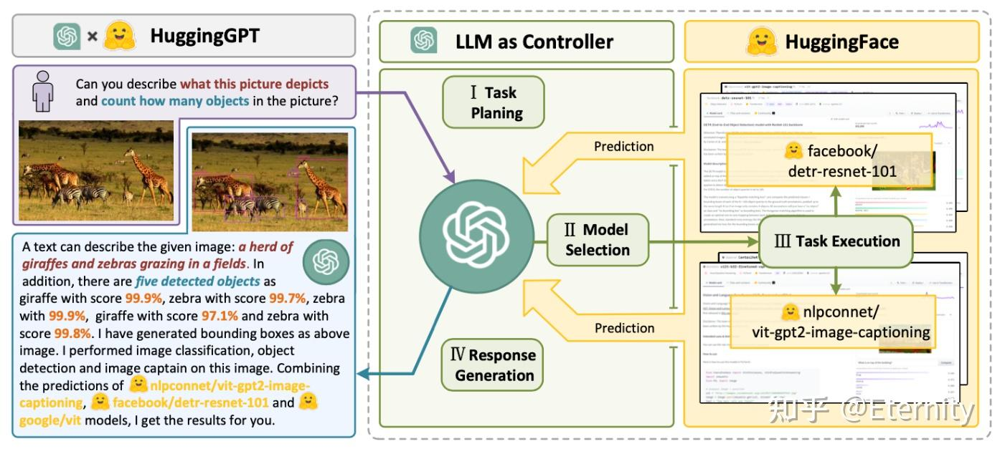

# 也谈LLM-Based Agent——规划&推理、记忆、工具使用与多Agent系统
* * *

created: 2025-01-30T00:13 updated: 2025-01-30T00:14
---------------------------------------------------

> _**作者: Eternity​**_ _**原文: [https://zhuanlan.zhihu.com/p/13905150871](https://zhuanlan.zhihu.com/p/13905150871)**_

好久没写知乎内容了，在从事图形学工作之余，利用碎片时间看了一些LLM、Agent相关的内容，写点东西来记录记录，写的不对之处还请批评指教。本文以Lilian Weng关于Agent的博客文章展开，也会集思广益（参考了大量Agent相关的综述，详细见参考部分）。写的过程中，也让笔者想起来了6、7年前短暂涉猎[知识图谱](https://zhida.zhihu.com/search?content_id=251803962&content_type=Article&match_order=1&q=%E7%9F%A5%E8%AF%86%E5%9B%BE%E8%B0%B1&zhida_source=entity)、问答系统的美好时光。**_当然，无论如何也不能忘记自己的“本行”，后续有机会会写一些关于LLM与3D、合成数据生成的文章。_**

A unified framework for the architecture design of LLM-based autonomous agent from A Survey on Large Language Model based Autonomous Agents

Agent系统概述
---------

规划是[大语言模型（LLMs）](https://zhida.zhihu.com/search?content_id=251803962&content_type=Article&match_order=1&q=%E5%A4%A7%E8%AF%AD%E8%A8%80%E6%A8%A1%E5%9E%8B%EF%BC%88LLMs%EF%BC%89&zhida_source=entity)解决复杂问题的关键能力，它涉及创建一系列动作来实现特定目标。自主智能体，作为LLMs的一个重要应用，是实现通用人工智能（AGI）的有前景的技术途径。这些智能体通过**感知环境**、**规划解决方案**和**执行动作**来完成设定的目标任务。通过实施基于任务的规划，[自主智能体](https://zhida.zhihu.com/search?content_id=251803962&content_type=Article&match_order=2&q=%E8%87%AA%E4%B8%BB%E6%99%BA%E8%83%BD%E4%BD%93&zhida_source=entity)能够在其环境中执行必要的动作，以实现目标任务的解决。在一个由LLM驱动的自主代理系统中，LLM作为代理的大脑，辅以几个关键组件：

LLM Powered Autonomous Agents

### 规划 Planning

规划主要包含两部分：**子目标和分解**、**反思和改进。**

\*\*子目标和分解：\*\*代理将大型任务分解成更小、更易于管理的子目标，这使得复杂任务能够高效处理。

> 任务分解可以通过以下方式完成：（1）通过简单的提示由LLM完成，如“XYZ的步骤。\\n1.”，“实现XYZ的子目标是什么？”；（2）使用特定任务的指令；例如，“为写小说写一个故事大纲”；（3）或通过人类输入。

具体地，**思维链CoT（Chain of Thoughts）**受到两个idea启发（算术推理任务能够受益于自然语言生成的中间推理步骤，少样本示例学习），通过Prompt样例<输入，[思维链](https://zhida.zhihu.com/search?content_id=251803962&content_type=Article&match_order=2&q=%E6%80%9D%E7%BB%B4%E9%93%BE&zhida_source=entity)/思考过程，输出>作为示范，引导LLM输出[推理逻辑](https://zhida.zhihu.com/search?content_id=251803962&content_type=Article&match_order=1&q=%E6%8E%A8%E7%90%86%E9%80%BB%E8%BE%91&zhida_source=entity)并给出正确答案。通常包含两种主要类型：**_Few-Shot CoT_**、**_Zero-Shot CoT（使用Let’s think step by step）_**。

*   思维链原则上允许模型将多步骤问题分解为中间步骤，但也意味着需要为更多推理步骤的问题分配额外的计算资源。
*   思维链提供了一个可解释的窗口，使用户能够理解模型的推理过程，包括它是如何得出特定答案的，并提供调试推理路径出错的机会。
*   [思维链推理](https://zhida.zhihu.com/search?content_id=251803962&content_type=Article&match_order=1&q=%E6%80%9D%E7%BB%B4%E9%93%BE%E6%8E%A8%E7%90%86&zhida_source=entity)可用于数学文字题、常识推理和符号操作等任务，理论上可以用于任何通过语言解决的人类任务。
*   只需在少量示例提示的示例中包含思维链序列，就可以在已有大规模LLM中生成思维链推理。

Chain-of-thought Prompting

\*\*自洽性采样（Self- Consistency）\*\*相比于CoT一次采样，CoT-SC设置温度大于0生成多个输出（可兼容多种采样方式），从候选中选择最佳输出（如多数投票）。

Self-consistency Method

以此为基础的工作还有：[Tree of Thoughts](https://link.zhihu.com/?target=https%3A//export.arxiv.org/pdf/2305.10601v1.pdf)、[Graph of Thoughts](https://link.zhihu.com/?target=https%3A//export.arxiv.org/pdf/2308.09687v2.pdf)。

\*\*反思和改进：\*\*代理能够对过去的行为进行自我批评和自我反思，从错误中学习，并在未来的步骤中进行改进，从而提高最终结果的质量。

ReAct: Reason and Action通过思维链的方式引导LLM将复杂问题进行拆分，并一步步进行推理（Reason）和行动（Action），并引入观察（Observation）环节。具体地，从训练集中选择示例手动编写ReAct格式推理轨迹，作为提示中的小样本示例。每个轨迹由多个思考-行动-观察步骤（即密集思考）组成，其中自由形式的思考用于各种目的，如使用一系列分解问题的思考（“我需要搜索x，找到y，然后找到z”），从维基百科观察中提取信息（“x始于1844年”，“段落没有提到x”），常识性（“x不是y，所以z必须是……”）或算术推理（“1844 < 1989”），指导搜索重构（“也许可以搜索/查找x代替”），并综合最终答案（“……所以答案是x”）。

> A unique feature of human intelligence is the ability to seamlessly combine task-oriented actions with verbal reasoning (or inner speech), which has been theorized to play an important role in human cognition for enabling [self-regulation](https://zhida.zhihu.com/search?content_id=251803962&content_type=Article&match_order=1&q=self-regulation&zhida_source=entity) or strategization and maintaining a working memory. This tight [synergy](https://zhida.zhihu.com/search?content_id=251803962&content_type=Article&match_order=1&q=synergy&zhida_source=entity) between “acting” and “reasoning” allows humans to learn new tasks quickly and perform robust decision making or reasoning, even under previously unseen circumstances or facing information uncertainties.

ReAct: Synergizing Reasoning and Acting in Language Models

未完待续：_Reflexion, Chain of Hindsight_

### 记忆 Memory

与人类类似的，可分为\_感官记忆（Sensory Memory，原始输入）_、_[短期记忆](https://zhida.zhihu.com/search?content_id=251803962&content_type=Article&match_order=1&q=%E7%9F%AD%E6%9C%9F%E8%AE%B0%E5%BF%86&zhida_source=entity)（Short-Term Memory，对话交互）\_、_长期记忆（Long-Term Memory，外部存储数据）_。常见的技术如RAG技术，涉及的[技术栈](https://zhida.zhihu.com/search?content_id=251803962&content_type=Article&match_order=1&q=%E6%8A%80%E6%9C%AF%E6%A0%88&zhida_source=entity)：\_数据库检索、向量数据库、[embedding](https://zhida.zhihu.com/search?content_id=251803962&content_type=Article&match_order=1&q=embedding&zhida_source=entity)\_等。

Categorization of human memory.

\*\*感官记忆：\*\*提供了在原始刺激结束后保留感觉信息（视觉、听觉等）印象的能力。[感觉记忆](https://zhida.zhihu.com/search?content_id=251803962&content_type=Article&match_order=1&q=%E6%84%9F%E8%A7%89%E8%AE%B0%E5%BF%86&zhida_source=entity)通常只持续几秒钟。子类别包括图像记忆\_（iconic memory，视觉）_、[回声记忆](https://zhida.zhihu.com/search?content_id=251803962&content_type=Article&match_order=1&q=%E5%9B%9E%E5%A3%B0%E8%AE%B0%E5%BF%86&zhida_source=entity)_（echoic memory，听觉）_和触觉记忆_（haptic memory，触觉）\_；与之对应的是LLM中作为原始输入的learning embedding representations。

**短期记忆：**存储我们当前意识并需要执行复杂认知任务的信息（学习与推理），时间范围约20-30秒；与之对应的是LLM中的**上下文学习**，其短暂且有限，受到[Transformer](https://zhida.zhihu.com/search?content_id=251803962&content_type=Article&match_order=1&q=Transformer&zhida_source=entity)有限上下文窗口长度的限制。

\*\*长期记忆：\*\*时间跨度从数天到数十年；在LLM中，为了使得代理能够在较长时间内保留和回忆信息，主要利用外部向量存储和快速检索来实现。

*   显性/成熟性记忆：这是关于事实和事件的记忆，指的是那些可以有意识地[回忆的记忆](https://zhida.zhihu.com/search?content_id=251803962&content_type=Article&match_order=1&q=%E5%9B%9E%E5%BF%86%E7%9A%84%E8%AE%B0%E5%BF%86&zhida_source=entity)，包括[情景记忆](https://zhida.zhihu.com/search?content_id=251803962&content_type=Article&match_order=1&q=%E6%83%85%E6%99%AF%E8%AE%B0%E5%BF%86&zhida_source=entity)（事件和经历）和语义记忆（事实和概念）。
*   隐性/[程序性记忆](https://zhida.zhihu.com/search?content_id=251803962&content_type=Article&match_order=1&q=%E7%A8%8B%E5%BA%8F%E6%80%A7%E8%AE%B0%E5%BF%86&zhida_source=entity)：这种类型的记忆是无意识的，涉及自动执行的技能和程序，如骑自行车或在键盘上打字。

A Survey on the Memory Mechanism of Large Language Model based Agent

**最大内积搜索 Maximum Inner Product Search**

外部存储可缓解有限注意力跨度的限制，一定程度上避免模型输出带有幻觉的答案。一种常见的做法是将信息的嵌入表示保存到向量数据库中，该数据库能够支持快速的最大内积搜索。常见的选择是[最近邻算法](https://zhida.zhihu.com/search?content_id=251803962&content_type=Article&match_order=1&q=%E6%9C%80%E8%BF%91%E9%82%BB%E7%AE%97%E6%B3%95&zhida_source=entity)以返回最接近的k个最近邻：

*   [LSH](https://link.zhihu.com/?target=https%3A//en.wikipedia.org/wiki/Locality-sensitive_hashing)(Locality-Sensitive Hashing): 引入[Hash函数](https://zhida.zhihu.com/search?content_id=251803962&content_type=Article&match_order=1&q=Hash%E5%87%BD%E6%95%B0&zhida_source=entity)，使得相似的输入以高概率被映射到相同的桶中，桶的数量远小于输入的数量；
*   [ANNOY](https://link.zhihu.com/?target=https%3A//github.com/spotify/annoy)(Approximate Nearest Neighbors Oh Yeah): 通过构造二叉树快速查询相似信息；
*   [HNSW](https://link.zhihu.com/?target=https%3A//arxiv.org/abs/1603.09320) (Hierarchical Navigable Small World)
*   [FAISS](https://link.zhihu.com/?target=https%3A//github.com/facebookresearch/faiss)(Facebook AI Similarity Search)
*   [ScaNN](https://link.zhihu.com/?target=https%3A//github.com/google-research/google-research/tree/master/scann)(Scalable Nearest Neighbors)

### 工具使用 Tool use

Agent在训练后可使用工具借助外部能力，获取模型训练时缺失的额外信息（如查询天气信息等）或者执行代码等。比较简单的做法是：通过Json等格式化输出\*\*\_（这里也贴一个我刚写的回答——_**[如何让大语言模型输出JSON格式？](https://www.zhihu.com/question/656512469/answer/66858469885)**_，Json格式的输出更加方便Agent调用工具）\_\*\*，调用所需要使用的工具api接口等，可以对每次工具调用结果进行反思总结，并进行下一步决策与执行（如ReAct）。**比较典型的步骤包括：**

1.  Agent判断：根据用户query判断是否属于回答问题的范畴（即是否需要进入流程）；
    
2.  [任务规划](https://zhida.zhihu.com/search?content_id=251803962&content_type=Article&match_order=1&q=%E4%BB%BB%E5%8A%A1%E8%A7%84%E5%88%92&zhida_source=entity)
    
3.  API检索 & 选择：根据用户输入检索最相关的API，根据上下文、输入确定最终调用API；
    
4.  参数判断：根据需要调用的API与用户输入，确定参数，如果未满足调用要求（缺少参数），向用户发起询问；
    
5.  参数填充/组装：对应“槽填充”任务，将用户输入组装为最终调用API参数用于调用；
    
6.  动作执行：调用API，如有需要，重复上述过程调用新的API；
    
7.  生成回答：根据所有调用输出最终结果。
    

**MRKL** ([Karpas et al. 2022](https://link.zhihu.com/?target=https%3A//arxiv.org/abs/2205.00445)),，全称为“模块化推理、知识和语言”，是一种用于自主智能体的神经符号架构。提出的MRKL系统包含一系列“专家”模块，而通用的[大型语言模型](https://zhida.zhihu.com/search?content_id=251803962&content_type=Article&match_order=1&q=%E5%A4%A7%E5%9E%8B%E8%AF%AD%E8%A8%80%E6%A8%A1%E5%9E%8B&zhida_source=entity)充当路由器，将查询路由到最合适的专家模块。这些模块可以是神经网络（例如深度学习模型）或符号（例如数学计算器、货币转换器、天气API）。

MRKL系统的一个简单例子是一个可以使用计算器应用程序的大型语言模型。这是一个单模块系统，其中大型语言模型充当路由器。当被问到“100乘以100等于多少？”时，大型语言模型从提示中提取数字，指导MRKL系统使用计算器计算结果。更加复杂的例子可能需要调用更多的api：

**HuggingGPT**([Shen et al. 2023](https://link.zhihu.com/?target=https%3A//arxiv.org/abs/2303.17580))使用ChatGPT作为任务规划者，根据任务描述选择HuggingFace平台上的模型，执行结果并生成响应。

**API-Bank**([Li et al. 2023](https://link.zhihu.com/?target=https%3A//arxiv.org/abs/2304.08244))基准测试旨在评估大型语言模型在实际应用中使用工具的能力。它通过模拟真实场景，要求模型在多个层面上做出决策，包括是否调用API、选择正确的API、处理API返回的结果以及规划复杂的任务。测试包括三个层级，分别对应模型调用API\_（给定API的描述，模型需要确定是否调用给定的API，正确调用它，并且对API返回做出适当的响应）\_、检索API（\_模型需要搜索可能解决用户需求的API，并通过阅读文档学习如何使用它们）_和规划API调用_（面对不明确的用户请求（例如，安排团体会议，为旅行预订航班/酒店/餐厅），模型可能需要进行多次API调用来解决问题）\_的能力。通过这些测试，可以全面了解模型在工具使用方面的表现。

> It contains 53 commonly used API tools, a complete tool-augmented LLM workflow, and 264 annotated dialogues that involve 568 API calls.

虽然理想十分美好，但在使用中会有不少局限性，正如 

[@ybq](https://www.zhihu.com/people/fd23b3c098971743b3ffa9d49d2bbaa6)

 在[LLM 又一年](https://zhuanlan.zhihu.com/p/13803218651)写的那样：

> 前面我说过，2024 年初的时候，大家都认为 agent 很快就能实现。为什么？因为 function\_call 的技术路线已经突破了。通过让 function\_call 调用 API，我们轻易就能让 llm 和环境进行交互。然后，各家公司的 agent 模型应运而出，却都像一个没灵魂的躯壳，完全让用户提不起兴趣。问题出在哪里？我个人觉着是这个 agent 没有思考能力，导致和环境的交互太死板了。毕竟目前的 function\_call，本质就是把一堆 if else 语句变成训练语料让模型来背，遇见代码就 call\_python\_API，遇见天气就 call\_weather\_API。当我把 prompt 写出来的时候，就能预测到模型会调什么函数了。

其实现在很多系统并不属于真正意义上的“Agent”，[Anthropic](https://zhida.zhihu.com/search?content_id=251803962&content_type=Article&match_order=1&q=Anthropic&zhida_source=entity)对Agent是这么定义的：LLM动态指导自身流程和工具使用，保持对完成任务方式的控制。相比之下，通过预定义代码路径协调和工具的系统称之为Workflows更加合适，或者将两者称为\*\*“Agentic System”。\*\*

### [设计模式](https://zhida.zhihu.com/search?content_id=251803962&content_type=Article&match_order=1&q=%E8%AE%BE%E8%AE%A1%E6%A8%A1%E5%BC%8F&zhida_source=entity)

最基础的模块可以通过在LLM的基础上增加检索、工具和记忆部分，模型可以利用这些能力生成搜索查询、选择适当的工具以及决定保留哪些信息。

Augmented LLM

1.  \*\*Prompt Chaining：\*\*将任务分解为一系列步骤，每个大型语言模型（LLM）调用处理前一个调用的输出，可以在任何中间步骤添加程序检查确保结果符合预期；
2.  \*\*Routing：\*\*将任务进行分类并指向下游任务，如将不同类型的客户服务查询（一般问题、退款请求、技术支持）引导至不同的下游流程、提示和工具。将简单/常见问题路由到较小的模型，而将困难/不寻常问题路由到更强大的模型；
3.  \*\*Parallelization：\*\*LLMs同时进行工作，并将输出聚合，主要分为两种变体：Sectioning，将任务分为独立子任务并行运行；Voting，多次运行相同的任务以获得多样化的输出；
4.  **Orchestrator-workers：**中心大型语言模型（LLM）动态分解任务，将它们委托给工作LLM，从结构上看，其实和**Routing、Parallelization**非常相似，Orchestrator-workers可看作是Parallelization的进阶版，其可以动态编排任务，而不是预定义，个人更认为Routing、Parallelization是Orchestrator-workers的特殊情况；
5.  \*\*Evaluator-optimizer：\*\*在该模式下，一个LLM负责生成、另一个LLM负责检查并反馈，直到生成的内容符合要求，这其实有点像[GAN](https://zhida.zhihu.com/search?content_id=251803962&content_type=Article&match_order=1&q=GAN&zhida_source=entity)的训练；

Agentic Workflow

而对于Agent，似乎更加强调自主性，即不依赖于事先预定的步骤，同时需要接受环境的反馈，比如生成代码，使用代码解释器验证程序，再根据反馈不断迭代，直到达到最大尝试次数。整体设计而言，Anthropic倾向于只有必要的时候再使用Agent，尽可能减少系统复杂度，在追求稳定性、可控性时尽可能直接调用API而非使用框架。

多Agent系统
--------

> 本部分主要参考[Large Language Model based Multi-Agents: A Survey of Progress and Challenges](https://link.zhihu.com/?target=https%3A//arxiv.org/pdf/2402.01680)

Agent系统通过利用大语言模型的归纳推理能力，通过重复执行、观察、反思等步骤，并配合工具使用完成用户需求。在此过程中，可能包含与用户的多轮交互。相比于单Agent系统，多Agent系统通过以下方式提供更高级的能力：

1.  通过将大型语言模型专业化为具有不同能力的多个独立智能体，每个智能体都有其独特的专长，这样可以提升回答的准确性和一致性，有效减少LLM的幻觉问题；
2.  [多智能体系统](https://zhida.zhihu.com/search?content_id=251803962&content_type=Article&match_order=1&q=%E5%A4%9A%E6%99%BA%E8%83%BD%E4%BD%93%E7%B3%BB%E7%BB%9F&zhida_source=entity)能够将任务分解为多个部分，从而处理更复杂的任务，并且能够容纳更长的上下文长度；
3.  通过角色扮演，不同的智能体可以带来不同的视角，使得任务回答更加全面和完善。多智能体之间也可以通过协作，结合不同模型的优势来解决问题。

The Architecture of LLM-MA Systems from Large Language Model based Multi-Agents: A Survey of Progress and Challenge

为了构建一个Multi-Agent系统，在Single-Agent系统的基础上，需要增加以下组件。

\*\*环境 Environment：\*\*所有agent应当处于同一环境，需要共享全局状态，Agent与环境间存在交互与更新。Agent通过Agent-Environment接口与环境互动及感知，了解周围环境、做出决策并从其行动结果中学习。当前大型语言模型-多智能体系统中的接口分为三种类型：**沙盒、物理和无环境：**

*   沙盒指的是由人类构建的模拟或虚拟环境，Agent在此可以更自由地互动并尝试各种行动和策略。这种接口广泛应用于软件开发（代码解释器作为模拟环境）、游戏（使用游戏规则作为模拟环境）。
*   物理环境是指Agent与物理实体互动并遵循现实世界物理定律和限制的真实世界环境。在物理空间中，Agent通常需要执行具有直接物理结果的举措。例如，在执行扫地、制作三明治、打包杂货和整理橱柜等任务时，要求机器人代理反复执行动作、观察物理环境并持续改进其行动。
*   无环境指的是没有特定外部环境的场景，Agent不与任何环境互动。一些应用利用多个Agent进行辩论以达成共识。这些应用主要关注Agent之间的通信，并不依赖于外部环境。

**Agents Profiling**

在多Agent系统中，Agent通过其特征、行为和技能定义，这些特征、行为和技能被定制以满足特定目标。在不同的系统中，Agent承担不同的角色，每个角色都有全面描述，包括特征、能力、行为和限制。例如，在游戏环境中，Agent可能被描绘为具有不同角色和技能的玩家，每个玩家以不同的方式为游戏目标做出贡献。在软件开发中，Agent可能承担产品经理和工程师的角色，每个角色都有指导开发过程的责任和专业知识。同样地，在辩论平台中，Agent可能被设计为支持者、反对者或裁判，每个Agent都有独特的功能和策略，以有效履行它们的角色。

**Agents Communication**

\*\*通信范式 Communication Paradigms：\*\*当前的LLM-MA系统主要采用三种通信范式：合作、辩论和竞争。合作Agent共同努力实现共同的目标或目的，通常交换信息以增强集体解决方案。当Agent参与论证性互动时，采用辩论范式，提出并捍卫自己的观点或解决方案，并批评他人的方案。这种范式非常适合达成共识或更精细的解决方案。竞争Agent努力实现自己的目标，这些目标可能与其他Agent的目标发生冲突。

\*\*通信结构 Communication Structure：\*\*分层通信（Layered）按层次结构化，每个层次的Agent具有不同的角色，主要在自身层内或与相邻层进行互动。去中心化通信（Decentralized）采用点对点网络运作，在需要Agent之间直接通信的工作中，这种结构通常被用于世界模拟应用。集中式通信（Centralized）涉及一个中心Agent或一组中心Agent协调系统的通信，其他Agent主要通过这个中心节点进行交互。MetaGPT提出共享消息池（Shared Message Pool）以提高通信效率，该通信结构维护一个共享消息池，代理根据其[配置文件](https://zhida.zhihu.com/search?content_id=251803962&content_type=Article&match_order=1&q=%E9%85%8D%E7%BD%AE%E6%96%87%E4%BB%B6&zhida_source=entity)发布消息并订阅相关消息，从而提升通信效率。

The Agent Communication Structure from Large Language Model based Multi-Agents: A Survey of Progress and Challenges

\*\*通信内容 Communication Content：\*\*在LLM-MA系统中，通信内容通常以文本形式出现。具体内容因特定应用而异。例如，在软件开发中，Agent可能会就代码段相互交流。在类似“狼人杀”游戏的模拟中，Agent可能会讨论他们的分析、怀疑或策略。

相比于Single-Agent System，Multi-Agent System除了**接受环境反馈与人类反馈**，还会接受来自其他Agent的反馈，这有助于在辩论等场景提升Agent的能力。此外，Multi-Agent系统通过记忆、自我反思等途径增强自身能力（这与Single-Agent系统类似）。

关于多智能体框架，目前主流的有 

[@Guohao Li李国豪](https://www.zhihu.com/people/46e01b5318ce6abc0110d44419aa25da)

 前辈发起的Camel-AI、MetaGPT、AutoGen，这个后续找机会单独展开。

应用
--

一些研究([Bran et al. 2023](https://link.zhihu.com/?target=https%3A//arxiv.org/abs/2304.05376)、[Boiko et al. 2023](https://link.zhihu.com/?target=https%3A//arxiv.org/abs/2304.05332))利用LLM与专家提供的工具以进行科学研究，旨在完成特定科学领域任务（有机合成、药物发现、材料设计等）。对于Multi-Agent系统应用，目前有一些交叉学科的研究方向，比如探究一些社科问题、博弈论、经济学问题等。

A Survey on Large Language Model based AutonomousAgents

挑战
--

计算资源：无论是单Agent系统（涉及到不断反思、任务执行）还是多Agent系统，在训练与部署过程中都会大量使用计算资源。

有限上下文长度：大型语言模型在处理信息时受到上下文长度的限制，这影响了它们包含历史数据、详细指令、API调用细节以及响应的能力。系统设计必须适应这种有限的通信能力。

长期规划与任务分解：在处理长期历史记录和探索解决方案时，大型语言模型面临规划难题。它们在遇到未预期错误时调整计划的能力有限，这使得它们在[鲁棒性](https://zhida.zhihu.com/search?content_id=251803962&content_type=Article&match_order=1&q=%E9%B2%81%E6%A3%92%E6%80%A7&zhida_source=entity)方面不如能够通过试错学习的人类。

自然语言界面可靠性：智能体系统依赖自然语言与大型语言模型及外部组件进行交互。但模型输出的可靠性存在疑问，因为它们可能会有格式错误或偶尔不服从指令。

推荐阅读
----

知乎上也有不少与Agent/LLM相关的内容与博主：

[@RUC AI Engine](https://www.zhihu.com/people/163524332a7cdc802501041d6d3a61f8)

 [ACL 2024 LLM-based Agent 论文总结](https://zhuanlan.zhihu.com/p/722064605)

[@九号](https://www.zhihu.com/people/e9dda8c05a9a9dfbfa117b3646ed7233)

 [AI领域的agent是什么意思？](https://www.zhihu.com/question/51195225/answer/3269574560)

[@潜伏的小Joy](https://www.zhihu.com/people/0e4ecefe5d82f960706559cc856b67fe)

 [一些关于Agent的随笔](https://zhuanlan.zhihu.com/p/10121042102)

[@Rookie-Wu](https://www.zhihu.com/people/63758c7e2a2d980391303875040fb65b)

 [Rookie-Wu：CoT、CoT-SC、ToT和GoT的简析](https://zhuanlan.zhihu.com/p/655243536)

[@田渊栋](https://www.zhihu.com/people/9819f6938be0d3bb133ad0151eefd188)

 [2024年年终总结](https://zhuanlan.zhihu.com/p/15135181332)

[@gaocegege](https://www.zhihu.com/people/02ebc974f01f196ec2e7a2c1a1ab7e6e)

 [2024 年终总结：Agent，Coding 与 AI infra](https://zhuanlan.zhihu.com/p/15161317229)

[@Yuxi Li](https://www.zhihu.com/people/d7eaac230ba5121925d07b169ed8760d)

 [agent = perception + action + feedback + learning (+ model)](https://zhuanlan.zhihu.com/p/678826438?utm_psn=1857231995920338944)

[对于agent，LLMs到底有什么用？读Deepmind论文FunSearch和AlphaGeometry有感](https://zhuanlan.zhihu.com/p/678617747)

[@lafmdp](https://www.zhihu.com/people/48c675f6696fb84379a29517a71be711)

 [AI领域的agent是什么意思？](https://www.zhihu.com/question/51195225/answer/3254986585?utm_psn=1857885172793491456)

[@wx1997](https://www.zhihu.com/people/2b7247102e8b48ebb1ac7e0c2e5fd767)

[@Guohao Li李国豪](https://www.zhihu.com/people/46e01b5318ce6abc0110d44419aa25da)

[@ybq](https://www.zhihu.com/people/fd23b3c098971743b3ffa9d49d2bbaa6)

写在最后
----

在完成本文的过程中，发现无论是Agent的核心——LLM，还是记忆等模块，都需要阅读更多参考资料、补充更多内容，也会使文章变得非常“膨胀”、冗长，不便于阅读。因此，本文仅介绍Agent相关概念和相关领域的代表作品（例如思维链等），希望在未来能够完成更多的文章，探讨“Agent/LLM是如何推理的？”、“记忆模块是如何工作的？”、“LLM与3D的结合”。

**参考**
------

1.  [LLM Powered Autonomous Agents](https://link.zhihu.com/?target=http%3A//lilianweng.github.io/posts/2023-06-23-agent/)
2.  [A Survey on the Memory Mechanism of Large Language Model based Agent](https://link.zhihu.com/?target=https%3A//arxiv.org/pdf/2404.13501)
3.  [ReAct: Synergizing Reasoning and Acting in Language Models](https://link.zhihu.com/?target=https%3A//arxiv.org/pdf/2210.03629)
4.  [CoT、CoT-SC、ToT和GoT的简析](https://zhuanlan.zhihu.com/p/655243536)
5.  [Chain-of-Thought Prompting Elicits Reasoning in Large Language Models](https://link.zhihu.com/?target=https%3A//export.arxiv.org/pdf/2201.11903v6.pdf)
6.  [Self-Consistency Improves Chain of Thought Reasoning in Language Models](https://link.zhihu.com/?target=https%3A//export.arxiv.org/pdf/2203.11171v4.pdf)
7.  [A Survey of Large Language Models](https://link.zhihu.com/?target=https%3A//arxiv.org/pdf/2303.18223)
8.  [MRKL Systems A modular, neuro-symbolic architecture that combines large language models, external knowledge sources and discrete reasoning](https://link.zhihu.com/?target=https%3A//arxiv.org/pdf/2205.00445)
9.  [https://learnprompting.org/docs/agents/mrkl](https://link.zhihu.com/?target=https%3A//learnprompting.org/docs/agents/mrkl)
10.  [HuggingGPT: Solving AI Tasks with ChatGPT and its Friends in Hugging Face](https://link.zhihu.com/?target=https%3A//arxiv.org/pdf/2303.17580)
11.  [API-Bank: A Comprehensive Benchmark for Tool-Augmented LLMs](https://link.zhihu.com/?target=https%3A//arxiv.org/pdf/2304.08244)
12.  [MIND2WEB: Towards a Generalist Agent for the Web](https://link.zhihu.com/?target=https%3A//arxiv.org/pdf/2306.06070)
13.  [Large Language Model based Multi-Agents: A Survey of Progress and Challenges](https://link.zhihu.com/?target=https%3A//arxiv.org/pdf/2402.01680)
14.  [Building effective agents](https://link.zhihu.com/?target=https%3A//www.anthropic.com/research/building-effective-agents)