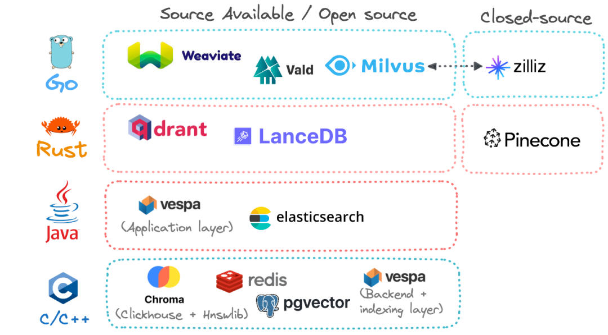
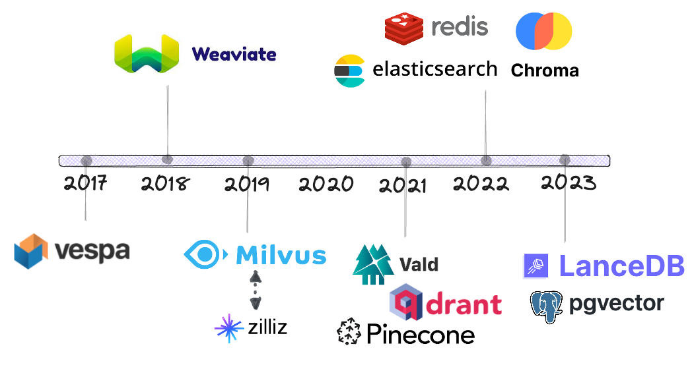
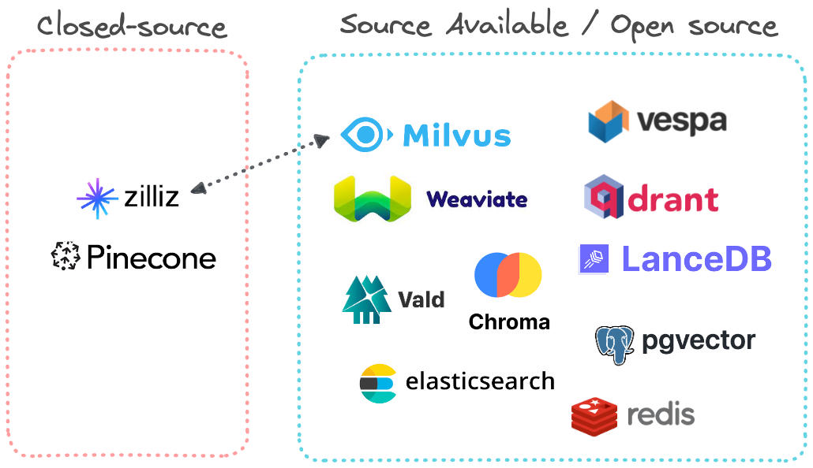
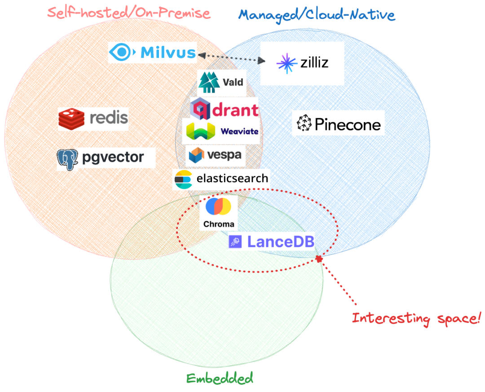
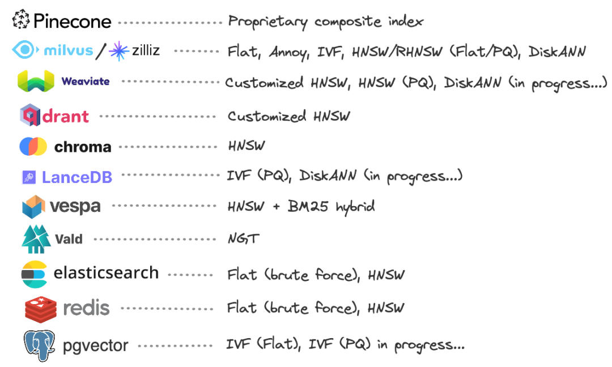

# 向量数据库对比
* * *

created: 2025-01-24T00:20 updated: 2025-01-26T02:10
---------------------------------------------------

在2023年上半年,与向量数据库相关的营销(不幸的是,有些是炒作)非常多,如果你正在阅读这篇文章,你可能好奇为什么存在这么多种类的向量数据库,它们之间有何不同. 从理论上讲,向量数据库都在做同样的事情(它们支持一系列需要语义搜索的应用程序),那么如何开始形成对它们的明智看法呢？🤔

在本文中,我将尽可能以视觉方式突出各种向量数据库之间的差异. 我还将强调我进行比较的特定维度,以提供更全面的视角.

\*\*这么多选择!\*\***🤯**

在过去的几个月里,我一直在研究不同的向量数据库及其内部结构,并通过它们的Python API进行交互,我发现了以下常见问题:

每个数据库供应商都会推销自己的能力(当然),同时贬低竞争对手,因此根据观察点不同,很容易得出有偏见的观点. 市场上有很多向量数据库供应商,需要阅读多个来源的内容才能连接各种信息,了解整个领域以及存在的底层技术. 在进行向量搜索时,需要考虑很多权衡:

*   混合搜索还是关键词搜索？关键词+向量搜索的混合方式可以获得最佳结果,每个向量数据库供应商都意识到了这一点,并提供了自己的定制混合搜索解决方案.
*   本地部署还是云原生？很多供应商将“云原生”作为卖点,好像基础设施是世界上最大的痛点,但是长期来看,本地部署可能更经济,因此更有效.
*   开源还是完全托管？大多数供应商在一个可用源代码或开源代码基础上构建,展示了他们的底层方法论,然后通过完全托管的SaaS来实现部署和基础设施的盈利. 仍然可以自行托管很多数据库,但这需要额外的人力和内部技能要求.

我正在使用一个运行中的电子表格来跟踪不同的向量数据库供应商,记录关键的特征和里程碑. 可能还有很多我没有注意到的,所以请在评论中告诉我！

比较各种向量数据库
---------

截至2023年6月,我正在研究8个专为向量数据库而构建的产品,以及3个将向量搜索作为额外功能添加的现有产品.

总部所在地和经费

暂且不考虑现有的供应商(即已建立的供应商),我们可以开始跟踪每个向量数据库初创企业的融资里程碑.

| 公司  | 总部  | 融资  |
| --- | --- | --- |
| Weaviate | 阿姆斯特丹 | 6800万美元B轮 |
| Qdrant | 柏林  | 1100万美元种子轮 |
| Pinecone | 旧金山 | 1.38亿美元B轮 |
| Milvus/Zilliz | 红木城 | 1.13亿美元B轮 |
| Chroma | 旧金山 | 2000万美元种子轮 |
| LanceDB | 旧金山 | 风险投资 |
| Vespa | 印第安纳波利斯 | 雅虎  |
| Vald | 东京  | 雅虎日本 |

显然,当涉及到向量数据库时,加利福尼亚州的湾区活动非常活跃！此外,融资和估值之间存在很大的差异,很明显数据库的能力与其融资金额之间不存在相关性.

编程语言的选择
-------

如今,快速、响应迅捷且可扩展的数据库通常使用现代语言如Golang或Rust编写. 在专为向量数据库而构建的供应商中,唯一使用Java构建的是Vespa. Chroma目前是一个Python/TypeScript包装器,基于C++构建的OLAP数据库Clickhouse和开源向量索引HNSWLib.

有趣的是,Pinecone和LanceDB的底层存储格式都是使用Rust从头开始重写的,尽管它们最初是用C++编写的. 显然,越来越多的数据库社区正在拥抱Rust 💪！

**时间线**

每个向量数据库存在多长时间了？

Vespa是最早在当时主导的基于BM25关键词搜索算法旁边引入向量相似性搜索的供应商之一(有趣的事实: Vespa的GitHub仓库现在已经有近7.5万次提交🤯). Weaviate紧随其后,在2018年底推出了一个开源的专用向量搜索数据库,到2019年,我们开始看到更多的竞争者进入这个领域,其中包括开源的Milvus. 需要注意的是,时间线中还显示了Zilliz,但它没有单独列出,因为它是Milvus的(商业)母公司,并提供基于Milvus构建的完全托管的云解决方案. 在2021年,又有三家新的供应商进入了这个领域: Vald、Qdrant和Pinecone. 而Elasticsearch、Redis和PostgreSQL等现有供应商在此之前明显缺席,并且直到2022年及以后才开始提供向量搜索,比人们预期的要晚得多.

源代码可用性
------

在列出的所有选项中,只有一个是完全闭源的: Pinecone. Zilliz也是一个闭源的完全托管的商业解决方案,但它完全建立在Milvus之上,可以看作是Milvus的母公司. 其他所有选项至少在代码库方面是源代码可用的,具体的许可证决定了代码的可许可性以及如何部署.

作为开发者,我发现在每个相关数据库的开源GitHub仓库中跟踪问题、PR和发布可以很好地了解路线图中的优先事项和解决方案. GitHub上的星星数量⭐️是项目受到社区关注程度的良好指标,但没有什么比个人经验更重要,所以我总是尽可能地尝试使用尽可能多的开源数据库.

托管方法
----

数据库供应商提供的典型托管方法包括自托管(本地部署)和托管/云原生,两者都遵循客户端-服务器架构. 第三种较新的选择是嵌入式模式,其中数据库本身与应用程序代码紧密耦合,以无服务器的方式运行. 目前,只有Chroma和LanceDB可用作嵌入式数据库.

在图表中,圈出的部分特别有趣:

Chroma试图构建一个全能的解决方案,具有嵌入式模式(默认模式),一个遵循客户端-服务器架构的托管云原生服务器,以及一个在云上实现无服务器计算的云托管分布式系统. LanceDB是目前最年轻的向量数据库,它有着雄心勃勃的目标,即提供一个嵌入式的多模态AI数据库,配备一个完全托管的云解决方案,具有分布式无服务器计算环境. 该数据库依赖于Lance数据格式,这是一种现代的列式格式,可快速高效地进行向量操作和机器学习的查找.

索引方法
----

大多数供应商使用混合向量搜索方法,以不同的方式将关键词搜索和向量搜索相结合. 然而,每个数据库使用的底层向量索引可能有很大的差异.

绝大多数数据库供应商选择自己定制实现HNSW(Hierarchical Navigable Small-World graphs)算法. 将向量索引持久化到磁盘上正在迅速成为一个重要目标,以处理超过内存大小的数据集. 2019年的NeurIPS论文中介绍的DiskANN算法显示,它有潜力成为在数十亿数据点上进行磁盘搜索的最快算法. 已经实现了自己版本的DiskANN(或正在积极实现)的数据库,如Milvus、Weaviate和LanceDB,在这个领域值得关注.

在本节中,我将列出一些关键要点以及每个数据库的优缺点. 其中一些是我通过各种途径(博客、播客、研究论文、与用户/合作者的对话以及我自己的代码)获得的知情意见.

Pinecone
--------

优点: 非常容易上手(无需托管负担,完全云原生),不需要用户了解向量化或向量索引的任何知识. 根据他们的文档(也非常好),它只是工作.

缺点: 完全专有,无法了解其内部运作和路线图,除非能够在GitHub上跟踪他们的进展. 此外,某些用户的经验突显了依赖完全外部的第三方托管服务以及开发者在数据库设置和运行方面完全缺乏控制的危险. 从长远来看,依赖完全托管的闭源解决方案的成本影响可能是显著的,考虑到存在大量的开源、自托管的替代方案.

我的看法: 在2020-21年,当向量数据库还不太为人所知时,Pinecone在提供方便的开发者功能方面领先于其他供应商. 快进到2023年,坦率地说,Pinecone现在提供的功能其他供应商也有,而且大多数其他供应商至少提供自托管、托管或嵌入式模式,更不用说他们的算法和底层技术的源代码对最终用户是透明的了.

Weaviate
--------

优点: 令人惊叹的文档(包括技术细节和持续实验),Weaviate似乎专注于构建最好的开发者体验,并且通过Docker非常容易上手. 在查询方面,它能够快速产生亚毫秒级的搜索结果,并提供关键字和向量搜索功能.

缺点: 由于Weaviate是使用Golang构建的,可扩展性是通过Kubernetes实现的,这种方法在数据变得非常大时需要大量的基础设施资源(与Milvus类似). Weaviate的完全托管服务的长期成本影响尚不清楚,可能需要将其性能与其他基于Rust的替代方案(如Qdrant和LanceDB)进行比较(尽管时间将告诉我们哪种方法在最具成本效益的方式下扩展得更好).

我的看法: Weaviate拥有一个强大的用户社区,开发团队正在积极展示极限可扩展性(数千亿个向量),因此它似乎面向的目标市场是拥有大量数据并希望进行向量搜索的大型企业. 它提供关键字搜索和向量搜索,并且具有强大的混合搜索功能,可以适用于各种用例,直接与Elasticsearch等文档数据库竞争. Weaviate还积极关注数据科学和机器学习,通过向量数据库将其扩展到传统搜索和检索应用程序之外的领域.

Qdrant
------

优点: 虽然Qdrant比Weaviate更新,但它也有很好的文档,可以帮助开发人员通过Docker轻松上手. 它完全使用Rust构建,提供了开发人员可以通过其Rust、Python和Golang客户端访问的API,这些是目前后端开发人员最常用的语言. 由于Rust的强大性能,它的资源利用似乎比使用Golang构建的替代品低(至少在我的经验中是如此). 目前,它通过分区和Raft共识协议实现可扩展性,这是数据库领域的标准做法.

缺点: 作为相对较新的工具,Qdrant在查询用户界面等方面一直在迎头赶上Weaviate和Milvus等竞争对手,尽管这个差距在每个新版本中都在迅速缩小.

我的看法: 我认为Qdrant有望成为许多公司首选的矢量搜索后端,这些公司希望最大限度地降低基础设施成本,并利用现代编程语言Rust的强大功能. 在撰写本文时,混合搜索尚未可用,但根据他们的路线图,正在积极开发中. 此外,Qdrant不断发布有关如何优化其HNSW实现(内存和磁盘上的实现)的更新,这将极大地帮助实现其长期的搜索准确性和可扩展性目标. 很明显,Qdrant的用户社区正在迅速增长(有趣的是,比Weaviate的增长速度更快),根据其GitHub的星标历史记录！也许全世界都对Rust感到兴奋？无论如何,在我看来,在Qdrant上构建应用是非常有趣的😀.

Milvus/Zilliz
-------------

优点: 作为向量数据库生态系统中存在时间较长的数据库,Milvus非常成熟,并提供了许多向量索引的选项. 它完全使用Golang构建,具有极强的可扩展性. 截至2023年,它是唯一一个提供可工作的DiskANN实现的主要供应商,据说这是磁盘上最高效的向量索引.

缺点: 在我看来,Milvus似乎是一个将可扩展性问题解决得非常彻底的解决方案-它通过代理、负载均衡器、消息代理、Kafka和Kubernetes的组合实现了高度可扩展性,这使得整个系统变得非常复杂和资源密集. 客户端API(例如Python)也不像Weaviate和Qdrant等较新的数据库那样易读或直观,后者更注重开发者体验.

我的看法: 很明显,Milvus的构建理念是为了实现对向量索引的大规模可扩展性,而在许多情况下,当数据的大小不是太大时,Milvus可能会显得过于复杂. 对于更静态和不频繁的大规模情况,Qdrant或Weaviate等替代方案可能更便宜且更快速地投入生产.

Chroma
------

优点: Chroma为开发人员提供了方便的Python/JavaScript接口,可以快速启动向量存储. 它是市场上第一个默认提供嵌入模式的向量数据库,其中数据库和应用层紧密集成,使开发人员能够快速构建、原型设计和展示他们的项目.

缺点: 与其他专门构建的供应商不同,Chroma主要是一个围绕现有的OLAP数据库(Clickhouse)和现有的开源向量搜索实现(hnswlib)的Python/TypeScript封装. 目前(截至2023年6月),它没有实现自己的存储层.

我的看法: 向量数据库市场正在快速发展,Chroma似乎倾向于采取“等待观望”的策略,是为数不多的旨在提供多种托管选项的供应商之一: 无服务器/嵌入式、自托管(客户端-服务器)和云原生分布式SaaS解决方案,可能同时支持嵌入式和客户端-服务器模式. 根据他们的路线图,Chroma的服务器实现正在进行中. Chroma带来的另一个有趣的创新领域是量化“查询相关性”,即返回结果与用户输入查询的接近程度. 在他们的路线图中还列出了可视化嵌入空间,这是一个创新领域,可以使数据库在搜索之外的许多应用中使用. 然而,从长远来看,我们还没有看到嵌入式数据库架构在向量搜索领域成功实现商业化,因此它的发展(以及下面描述的LanceDB)将是一个有趣的观察对象！

LanceDB
-------

优点: LanceDB专为多模态数据(图像、音频、文本)的分布式索引和搜索而设计,构建在Lance数据格式之上,这是一种创新的、用于机器学习的新型列式数据格式. 与Chroma一样,LanceDB使用嵌入式、无服务器架构,并且完全使用Rust从头开始构建,因此与Qdrant一起,这是仅有的另一个利用Rust的速度、内存安全性和相对较低资源利用率的主要向量数据库供应商.

缺点: LanceDB是一个非常年轻的数据库,因此许多功能正在积极开发中,并且由于工程团队规模较小,功能的优先级排序将是一个挑战.

我的看法: 我认为在所有的向量数据库中,LanceDB与其他数据库的区别最大. 这主要是因为它在数据存储层(使用Lance,一种比parquet更快速的新型列式格式,专为非常高效的查找而设计)和基础架构层面进行了创新-通过使用无服务器架构. 因此,大大减少了许多基础架构的复杂性,极大地增加了开发人员构建直接连接到数据湖的分布式语义搜索应用程序的自由和能力.

Vespa
-----

优点: 提供了最“企业级就绪”的混合搜索能力,将关键字搜索和自定义向量搜索与HNSW相结合. 尽管其他供应商如Weaviate也提供关键字和向量搜索,但Vespa是最早推出这种功能的供应商之一,这给他们足够的时间来优化其功能,使其快速、准确和可扩展.

缺点: 与使用性能导向语言(如Go或Rust)编写的更现代的替代方案相比,开发人员体验不够流畅,这是由于应用层是用Java编写的. 此外,直到最近,它并没有提供非常简单的设置和拆除开发实例的方法,例如通过Docker和Kubernetes.

我的看法: Vespa确实提供了非常好的功能,但它的应用程序主要是用Java编写的,而后端和索引层是用C++构建的. 这使得随着时间的推移,它更难以维护,并且相对于其他替代方案而言,它的开发人员友好度较低. 现在大多数新的数据库都是完全用一种语言编写的,通常是Golang或Rust,并且似乎在Weaviate、Qdrant和LanceDB等数据库中算法和架构的创新速度更快.

Vald
----

优点: 通过高度分布式的架构,设计用于处理多模态数据存储,同时具有索引备份等有用功能. 使用非常快速的ANN搜索算法NGT(邻域图和树),当与高度分布式的向量索引结合使用时,它是最快的ANN算法之一.

缺点: 与其他供应商相比,Vald似乎没有那么多的关注度和使用量,并且文档没有明确描述使用了什么向量索引(“分布式索引”相当模糊). 它似乎完全由一个实体Yahoo! Japan资助,很少有关于其他主要用户的信息.

我的看法: 我认为Vald是一个比其他供应商更为专业的供应商,主要满足Yahoo! Japan的搜索需求,并且整体上拥有一个更小的用户社区,至少根据他们在GitHub上的星标来看是如此. 其中一部分原因可能是它总部位于日本,并且没有像其他在欧盟和湾区的供应商那样进行大规模的市场推广.

Elasticsearch, Redis and pgvector
---------------------------------

优点: 如果已经在使用现有的数据存储,如Elasticsearch、Redis或PostgreSQL,那么利用它们的向量索引和搜索功能是相当简单的,无需使用新技术.

缺点: 现有的数据库不一定以最优的方式存储或索引数据,因为它们被设计为通用目的,结果是,在涉及百万级向量搜索及以上规模的数据时,性能会受到影响. Redis VSS(Vector Search Store)之所以快速,主要是因为它完全在内存中,但一旦数据超过内存大小,就需要考虑替代解决方案.

我的看法: 我认为专为特定目的构建的向量数据库将逐渐在需要语义搜索的领域中与已有数据库竞争,主要是因为它们在向量搜索的最关键组件-存储层面上进行了创新. HNSW和ANN算法等索引方法在文献中有很好的文档记录,大多数数据库供应商都可以推出自己的实现,但专为特定目的构建的向量数据库具有根据任务进行优化的优势(更不用说它们是用现代编程语言如Go和Rust编写的),出于可扩展性和性能的原因,从长远来看,它们很可能在这个领域获胜.

结论:万亿规模的问题
----------

很难想象在历史上的任何时候,任何一种数据库能够吸引如此多的公众关注,更不用说风险投资生态系统了. 向量数据库供应商(如Milvus、Weaviate)试图解决的一个关键用例是如何以最低的延迟实现万亿级向量搜索. 这是一项极其困难的任务,考虑到当今通过流式处理或批处理传输的数据量,专为存储和查询性能进行优化的专用向量数据库最有可能在不久的将来突破这个障碍.

我将以观察到的历史数据库世界中最成功的商业模式作为结束,即首先开源代码(以便激发技术周围的热情社区),然后通过托管服务或云服务来商业化工具. 嵌入式数据库在这个领域相对较新,尚不清楚它们在产品商业化和长期收入方面的成功程度. 因此,可以推断出完全闭源的产品可能无法占据大部分市场份额-从长远来看,我直觉认为重视开发者生态系统和开发者体验的数据库有可能蓬勃发展,并且建立一个活跃的相信该工具的开源社区将比你想象的更重要！

希望大家觉得这个总结有用！在接下来的文章中,我将总结向量数据库中的底层搜索和索引算法,并深入探讨技术细节. 🤓 🚀