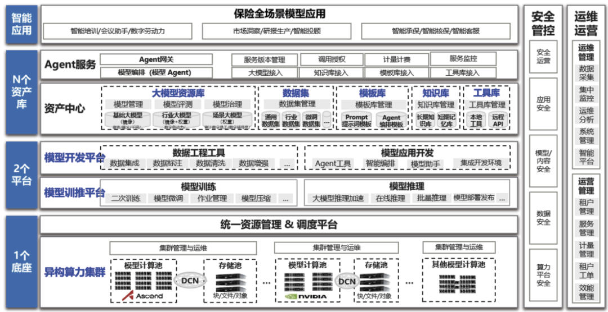
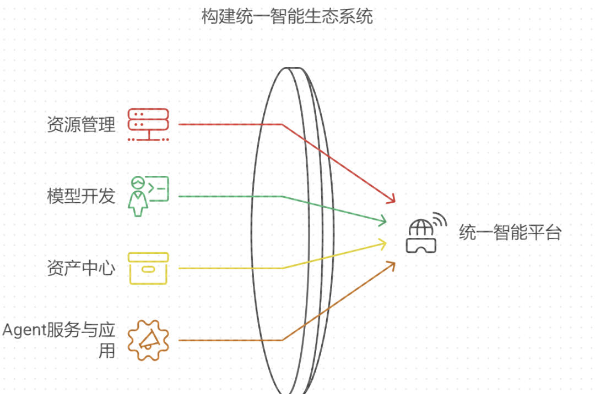
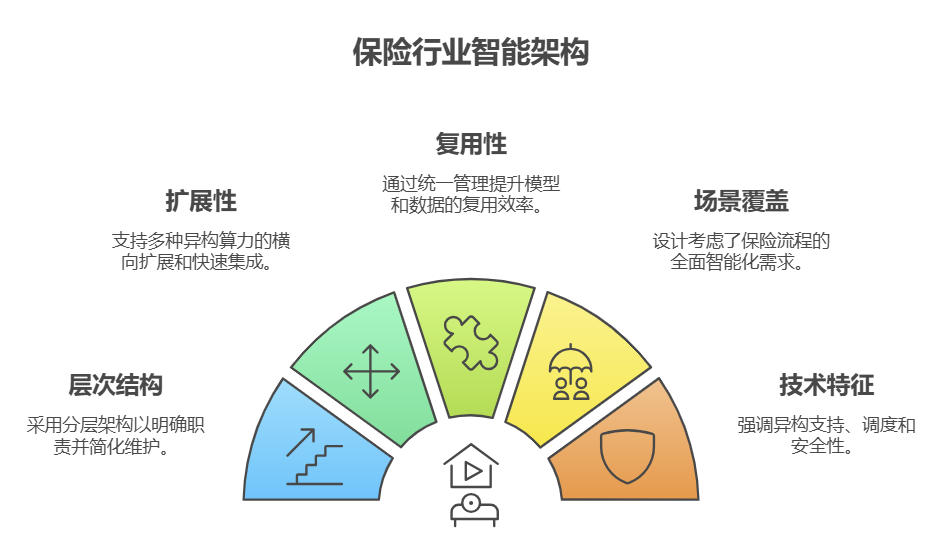

# 保险行业大模型架构&从技术底座到智能应用的全景解析
* * *

created: 2025-01-24T00:20 updated: 2025-01-26T02:10
---------------------------------------------------

> _\*\*作者: **\_\_** \*\*\_\_**数据AI指北**_
> 
> _\*\*原文: \*\*_[_**https://mp.weixin.qq.com/s/e9y8gVNfhoA01tu1m7LFCw**_](https://mp.weixin.qq.com/s/e9y8gVNfhoA01tu1m7LFCw)

**一、背景介绍**
----------

保险行业这些年变化挺大的，以前靠人工操作的那些繁琐流程，现在都在往智能化方向走。大模型技术一出来，给保险行业带来了不少机会。特别是在风险评估、客户服务这些领域，传统方式确实跟不上时代了。现在市场竞争越来越激烈，客户需求也越来越多样化，保险公司要是还守着老办法，迟早要被淘汰。

智能化平台现在成了保险行业的标配。大家都说，数字化转型是必经之路。但说实话，不是每家保险公司都能玩得转。技术底座、模型开发、资产库这些概念听上去高大上，实际操作起来还得考虑系统的稳定性、扩展性和灵活性。毕竟保险业务涉及的数据量大、流程复杂，搞不好就容易出问题。

**二、模型架构**
----------

### **2.1 架构描述**

保险全场景模型应用平台的架构设计挺有牛笔的，分成四个主要层次： 底座层、平台层、资产层和应用层。

（1）统一资源管理与调度平台（底座层）

**底座层采用异构算力集群设计：**

*   多个模型计算池（Ascend/NVIDIA等）和存储池
*   DCN网络互联
*   统一的集群管理与运维体系
*   灵活的算力调度机制

（2）模型开发与训练平台（平台层）

**包含两个核心平台：**

*   模型开发平台：提供数据工程工具（数据集成、标注、清洗、增强等）和模型应用开发环境（Agent工具、智能编排、模型助手等）
*   模型训推平台：支持模型训练、压缩、微调、在线推理等全流程能力

（3）资产中心（资产层）

**构建了多个专业资产库：**

*   大模型资源库：包含基础大模型、行业大模型和场景大模型
*   数据集：通用数据集和行业数据集
*   模板库：Prompt模板和Agent编排模板
*   知识库：长短期记忆知识库
*   工具库：基础工具和API

（4）Agent服务与智能应用（应用层）

*   Agent服务层：提供模型编排、版本管理、调用授权等基础能力
*   智能应用层：覆盖智能培训/会议助手、市场洞察/研报生产、智能承保/核保等保险全场景应用

这种分层设计的好处是清晰明了，每一层都能独立运作，不会互相干扰。

比如底座层的算力资源可以随时扩展，平台层的工具链也能快速更新。资产层的资源还能在不同场景下复用，效率高了不少。

不过，这种架构也不是没有挑战。算力资源调度在高并发时容易出问题，模型版本管理也得特别小心，数据安全更是重中之重。

### **2.2 架构分析**

（1）**架构设计优势**

*   分层清晰：采用"1+2+N"的层次架构不仅使系统职责划分明确，还便于后期维护和升级。每一层都能独立演进，不会互相影响。
*   扩展性强：底座层支持包括Ascend、NVIDIA等多种异构算力的横向扩展，平台层可以快速集成新的AI框架和工具，资产层能持续积累和优化各类模型与知识资产。
*   复用性高：通过资产中心的统一管理，各类模型、数据、知识可以在不同场景下被复用，显著提升了研发效率和资源利用率。
*   场景丰富：架构设计充分考虑了保险行业从产品设计、营销、承保到理赔的全流程场景，能够满足不同业务环节的智能化需求。

**（2）技术特点**

*   异构算力支持：平台可以同时管理和调度Ascend、NVIDIA等不同类型的算力资源，通过统一的资源池化管理，实现算力资源的最优配置。
*   统一调度：采用智能调度算法，根据任务优先级、资源利用率等多个维度，实现算力资源的动态分配和负载均衡。
*   全流程工具链：提供从数据采集、清洗、标注到模型开发、训练、部署的一站式工具支持，大幅提升开发效率。
*   安全管控：构建了多层次的安全防护体系，包括数据加密、访问控制、审计日志等，确保系统和数据的安全性。

**三、架构应用**
----------

这个架构在保险行业的应用场景挺多的。

比如在保险营销服务方面，智能培训助手和数字劳动力可以帮营销人员提升效率。以前那些重复性工作，现在都能交给机器去处理。在风险管理方面，智能承保和核保系统能快速分析风险因素，给出精准的定价建议。理赔系统也能自动化处理标准案件，速度快了不少。

市场分析这块也有亮点。智能研报生产功能可以自动分析市场数据，生成专业的分析报告，辅助决策者制定战略。智能投顾系统还能为客户提供个性化的保险产品组合建议。总的来说，这个架构平台能帮保险公司实现业务的智能化升级，提升运营效率，优化客户体验。同时，平台的安全管控和运维体系也确保了业务的稳定运行和数据安全，满足了保险行业的合规要求。

**四、技术特点与思考**
-------------

这个架构的技术特点也挺突出的。异构算力支持让平台能同时管理和调度不同类型的算力资源，通过统一的资源池化管理，实现最优配置。统一调度机制则避免了资源浪费或瓶颈。全流程工具链则大大提升了开发效率，从数据采集到模型部署都能一站式搞定。

不过，挑战也不少。算力资源调度在高并发时容易出问题，模型版本管理也得特别小心，数据安全更是重中之重。毕竟保险行业涉及的数据量太大，搞不好就容易出问题。性能优化也是个难题，大模型服务通常需要较高的计算资源，如何在保证服务质量的同时控制成本，是每个保险公司都得面对的。

总的来说，这个架构平台确实能帮保险公司实现业务的智能化升级，提升运营效率，优化客户体验。但要想真正玩转这个平台，还得解决不少技术难题。