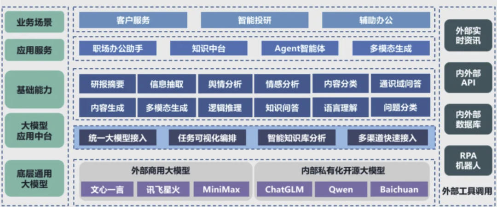
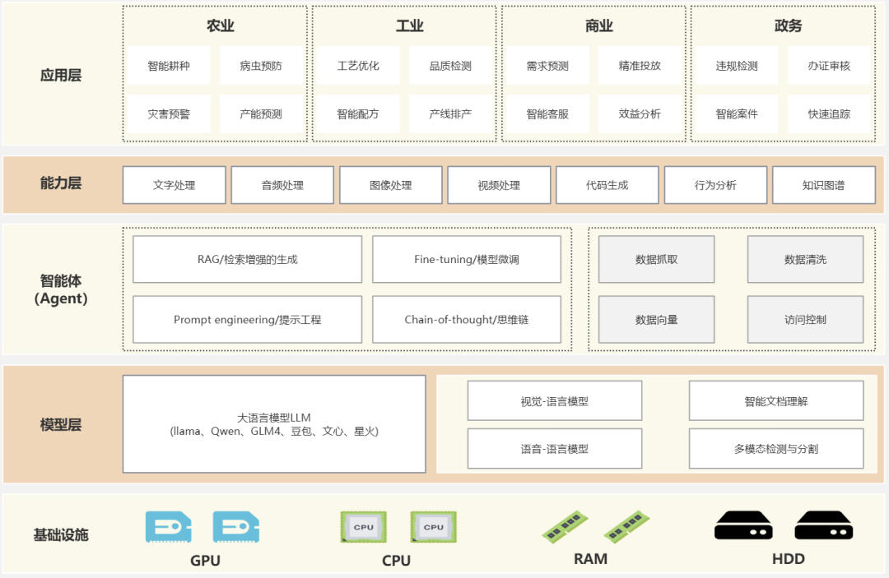
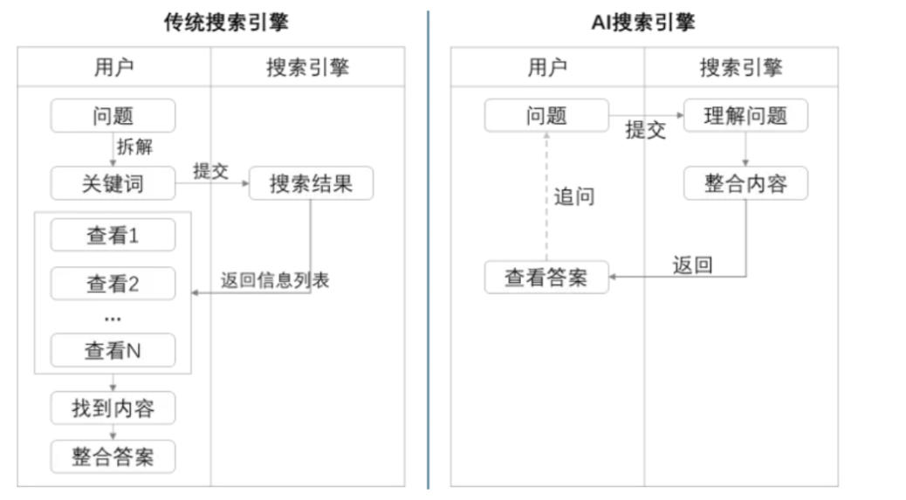
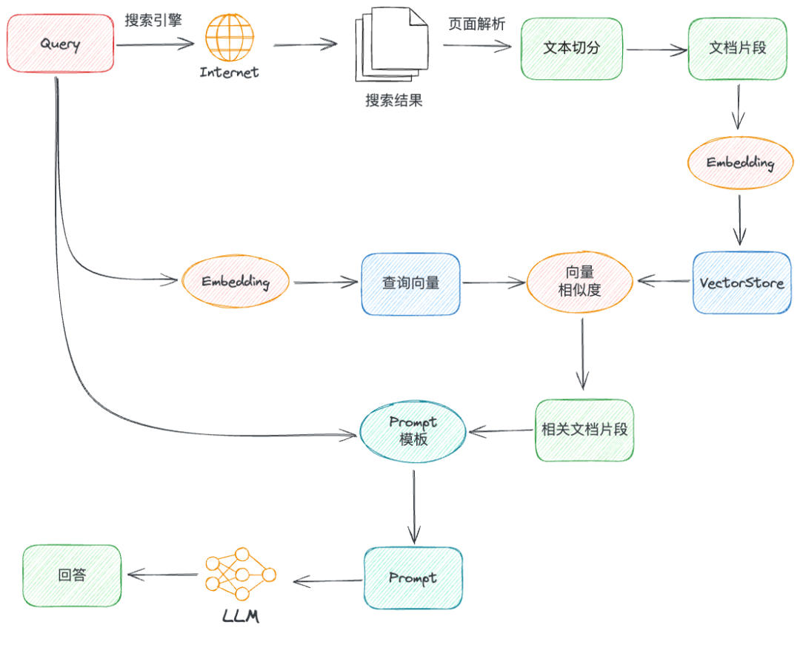

# 大模型AI应用&架构设计到AI搜索
* * *

created: 2025-01-24T00:20 updated: 2025-01-26T02:20
---------------------------------------------------

> _**作者: 数据AI指北**_
> 
> _\*\*原文: \*\*_[_**https://mp.weixin.qq.com/s/cQIaDT-tVSxQE0a70Q\_Edw**_](https://mp.weixin.qq.com/s/cQIaDT-tVSxQE0a70Q_Edw)

越来越深入到大模型应用中，对大模型的应用架构也是看过很多的知识，例如：之前谈到过大模型应用中台《[深入解读大模型应用中台：探索AI实战应用](https://mp.weixin.qq.com/s?__biz=Mzg3Nzc1MzQxMQ==&mid=2247488518&idx=1&sn=d09e8520c5bcfec26cc0a0b7e3b18f73&chksm=cf1f712af868f83ca6d568c4bac8d0c3d16a4f33dfed67b5e5b8764405602b62ea3c50c03401&token=1235152695&lang=zh_CN&scene=21#wechat_redirect)》，从底层通用大模型到业务应用，层次分明，应有尽有。

不过有小伙伴反馈，这个架构图比较复杂，不接地气😄。

希望来一个简易版本的。

**一、大模型应用架构**
-------------

这个简易的大模型应用架构使用了层次架构的样式，其中智能体作为核心服务，为上面的业务逻辑提供支持。在这样的体系中，顶层的应用程序可以通过标准化接口获取必要的能力，实现高效且灵活的开发与运维流程。

（1） 基础设施

提供了整个架构的物理和虚拟资源。包括GPU（图形处理单元）、CPU（中央处理单元）、RAM（随机存取存储器）和HDD（硬盘驱动器）。

GPU用于处理图形和并行计算任务，CPU负责通用计算任务，RAM提供快速数据访问，HDD用于存储大量数据。

（2） 模型层

包含了人工智能和机器学习的核心模型。

*   **大语言模型LLM**：如Llama、Qwen、GLM4、豆包、文心、星火等，这些模型用于处理自然语言处理任务，能够理解和生成文本。
*   **视觉-语言模型**：用于处理图像和文本的结合，实现图像识别和描述等任务。
*   **语音-语言模型**：用于语音识别和语音合成，将语音转换为文本或反之。
*   **智能文档理解**：用于解析和理解文档内容。
*   **多模态检测与分割**：处理多种类型的数据，如图像、文本和声音，进行特征提取和数据分割。

（3） 智能体

这一层是模型层的延伸，提供了更高级的功能，如生成、微调、提示工程和思维链。

*   **检索增强的生成**：结合检索和生成技术，提供更准确的信息。
*   **模型微调**：对预训练模型进行微调，以适应特定任务或数据集。
*   **提示工程**：设计和优化提示，以引导模型生成期望的输出。
*   **思维链**：模拟人类思考过程，逐步推理以解决问题。
*   **数据抓取和控制**：这些功能支持数据的收集、处理和安全访问

（4）能力层

这一层提供了各种技术能力，支持上层应用的开发。

包括文字处理、音频处理、图像处理、视频处理、代码生成、行为分析和知识图谱等。

这些能力可以被不同的应用层调用，以实现特定的功能。

（5）应用层

展示了技术如何被应用于不同的行业和领域。

*   **农业**：智能耕种、病虫害预防、灾害预警、产能预测。
*   **工业**：工艺优化、智能配方、质量检测、产线排产。
*   **商业**：需求预测、精准投放、智能客服、效益分析。
*   **政务**：违规检测、办证审核、智能案件、快速追踪。

每一层都是构建在下一层的基础上，形成了一个完整的技术栈，从基础设施到具体的行业应用。

这样的架构设计有助于实现模块化、可扩展性和灵活性，同时也能够针对不同的应用场景提供定制化的解决方案。

**二、大模型架构实践**
-------------

简易版本的大模型应用架构，已经阐述得非常详细。

我想小伙伴们肯定应该非常的清晰明了。那么它是如何运用在业务平台中呢？

带着这个疑问，咱们以一个实际案例来说明（以我的理解）。

以一个较为实用，并且非常火热，小伙伴们经常使用的平台为例。

**比如：大模型搜索平台**。

天工搜索，秘塔搜索，kimi搜索等等

传统搜索引擎和AI大模型搜索引擎在多个方面存在显著差异。

传统搜索引擎主要依赖关键词匹配和链接排名，返回的是相关网页链接，用户需要自行筛选信息，这导致搜索效率较低且容易受到广告和SEO影响。

相比之下，AI大模型搜索引擎通过深度学习和自然语言处理技术，能够更精准地理解用户的查询意图，提供更加个性化和准确的搜索结果。

AI搜索引擎不仅能够直接生成答案，还能进行多轮对话，理解上下文信息，从而提升用户的搜索体验。

*   应用层

AI搜索的应用层确实是在于智能搜索需求，它为用户呈现一个干净整洁的回答。不仅仅是整合传统搜索信息，更重要的是，通过智能化处理，我们能够解决用户在搜索过程中遇到的复杂问题，提供更加精准和高效的服务。

*   能力层

当用户在AI搜索输入了搜索问题后，那么就会通过传统的搜索引擎去进行关键词搜索。因为如果直接利用大模型爬取网页数据，这样会来不及处理。因此一般来说，都会去借助搜索引擎去获取数据，最后把大模型总结的答案回复给用户。

*   智能体

在能力层，用户输入了问题后，搜索引擎获取到大量数据，那么就需要把数据以向量化的形式，存入到知识库。之后把问题向量化，与知识库进行匹配，获取最终知识向量，传给大模型进行总结与推理。

其实就是一个RAG知识库应用。但是用户输入问题，搜索获取信息，之后信息向量化等过程可以做成一个智能体应用。

*   模型层

模型层对于AI搜索平台而言，较为重要。

一个推理能力和上下文能力很强的大模型，那么它接受的背景知识长度，以及总结能力是非常nice的，也就是不胡说八道。

*   基础设施

基础设施这个一般而言都是通用的，无非就是物理和虚拟资源。

对于AI模型搜索平台而言，它面向的用户量众多，那么需要的硬件资源就会更加大。