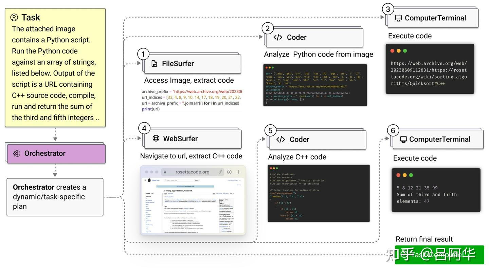
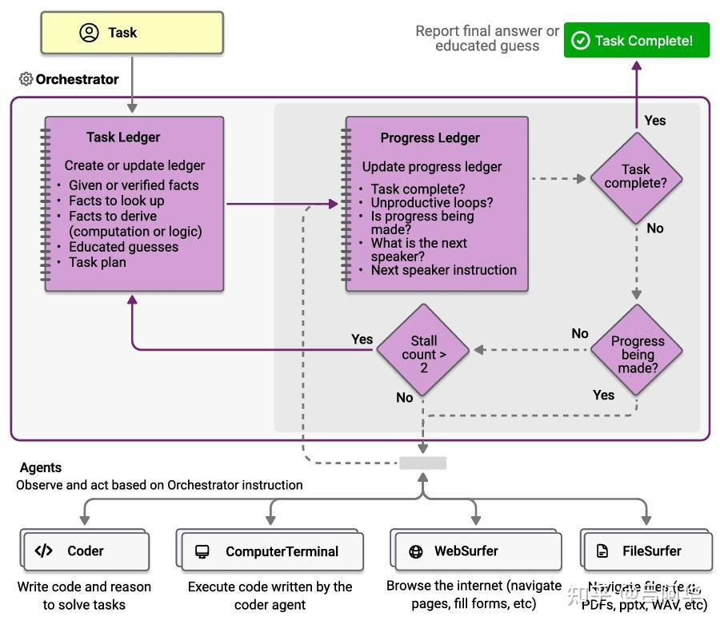
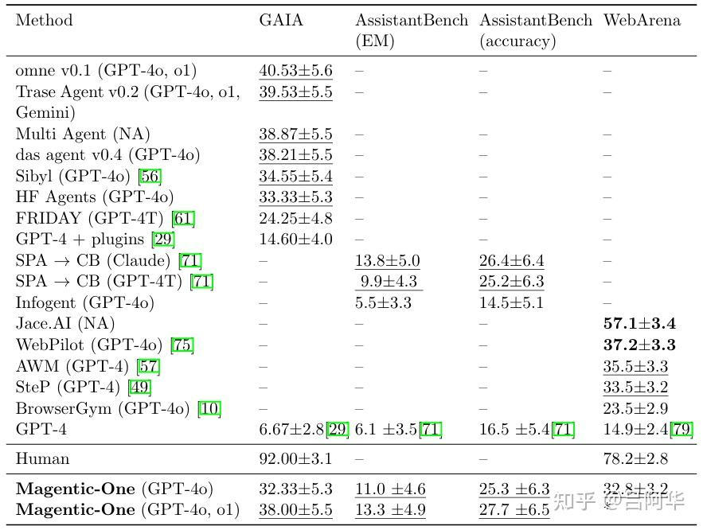
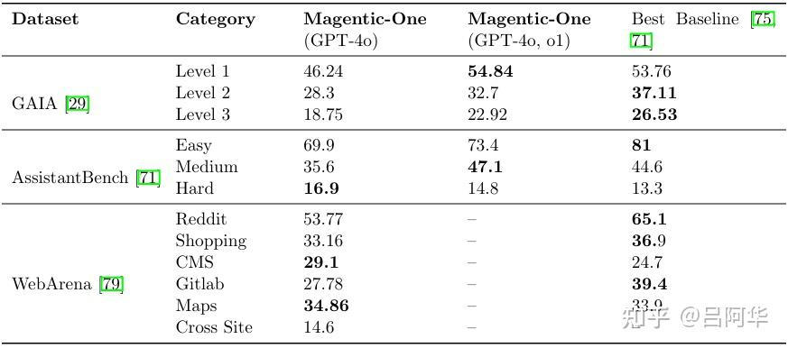
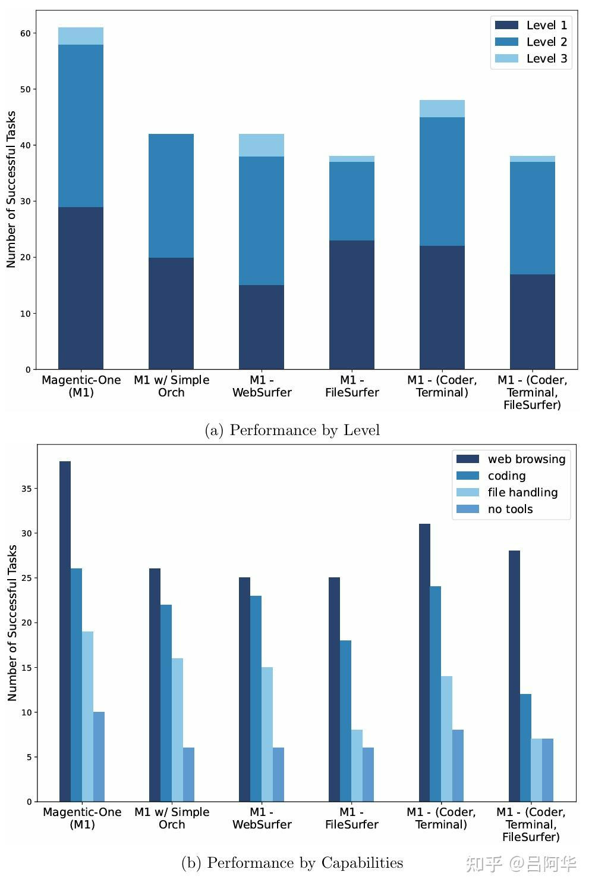
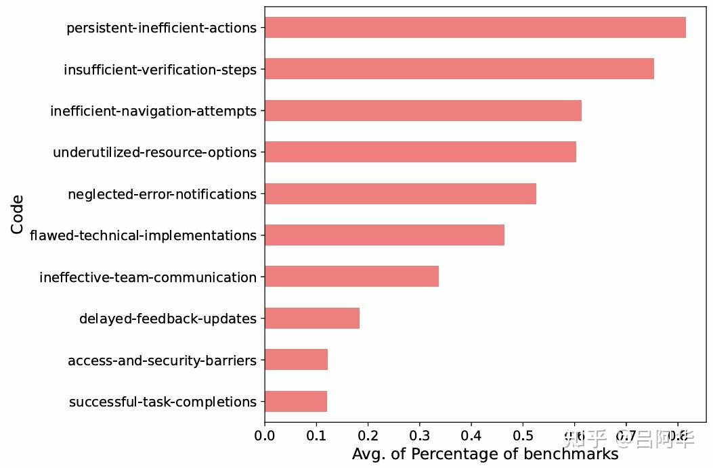
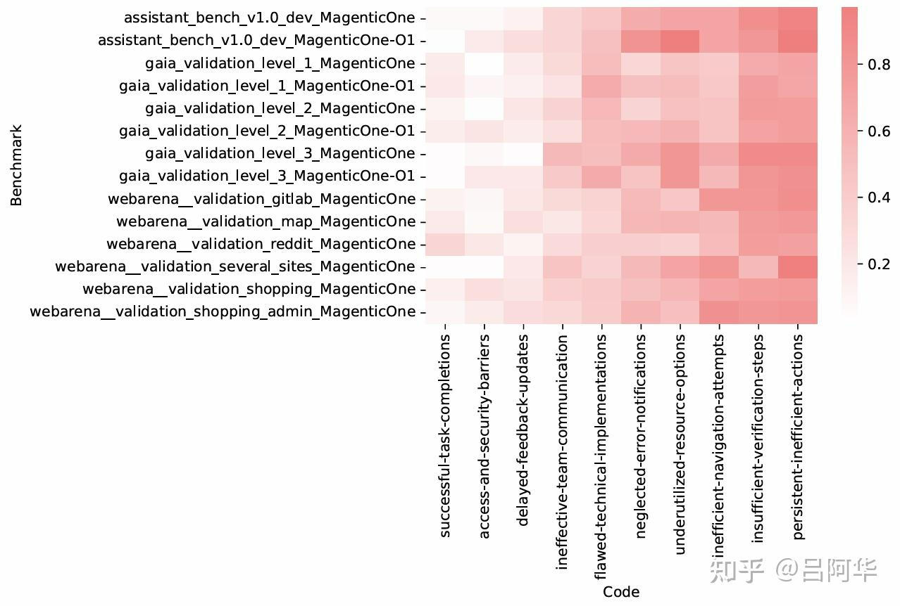

# AI&Agent技术论文《Magentic-One&面向复杂任务的通用多智能体系统》
* * *

created: 2025-01-24T00:20 updated: 2025-01-26T02:05
---------------------------------------------------

> 作者: 吕阿华
> 
> 原文: [https://zhuanlan.zhihu.com/p/13110050652](https://zhuanlan.zhihu.com/p/13110050652)

[https://www.microsoft.com/en-us/research/uploads/prod/2024/11/MagenticOne.pdf](https://www.microsoft.com/en-us/research/uploads/prod/2024/11/MagenticOne.pdf)

随着AI行业的高速发展,[AI智能体](https://zhida.zhihu.com/search?content_id=251645346&content_type=Article&match_order=1&q=AI%E6%99%BA%E8%83%BD%E4%BD%93&zhida_source=entity)被要求能够有效地进行规划、多步推理与操作、应对新观察结果,并从错误中恢复,以成功地在各种场景下完成复杂任务.

最近,微软研究院AI团队(后面简称“团队”)推出了介绍了**Magentic-One**——一个高性能的开源智能体系统,用于解决此类任务.

Magentic-One 使用一种多智能体架构,其中一个主导智能体\*\*Orchestrator(协调者)\*\*负责规划、跟踪进度并在出错时重新规划.在任务执行过程中,Orchestrator 还会指挥其他专门的智能体按需执行任务,例如操作网页浏览器、导航本地文件或编写和执行 Python 代码.

实验表明,Magentic-One 在三个多样且具有挑战性的智能体基准测试中——**GAIA**、**AssistantBench** 和 **WebArena**,达到了与当前最先进技术相竞争的统计性能.值得注意的是,Magentic-One 在不修改核心智能体能力或协作方式的情况下实现了这些结果,展示了在通用智能体系统愿景方面取得的进展.此外,Magentic-One 的模块化设计使得可以在无需额外提示词调优或训练的情况下,随意添加或移除团队中的智能体,便于开发并使其能够适应未来的场景.

团队提供了 **Magentic-One** 的开源实现以及一个独立的智能体评估工具 **AutoGenBench**.AutoGenBench 提供了内置的重复性和隔离控制,可以在具有副作用的智能体操作基准测试中,以严格和受控的方式运行评估.

Magentic-One、AutoGenBench 以及详细的实证性能评估,包括[消融实验](https://zhida.zhihu.com/search?content_id=251645346&content_type=Article&match_order=1&q=%E6%B6%88%E8%9E%8D%E5%AE%9E%E9%AA%8C&zhida_source=entity)和错误分析,可在 [https://aka.ms/magentic-one](https://link.zhihu.com/?target=https%3A//aka.ms/magentic-one) 获取.

简介
--

人工智能与基础模型的最新进展正推动人们重新关注**智能体系统(Agentic System)**.这些系统能够感知、推理并在现实世界中采取行动,帮助人类完成各种任务.[智能体系统](https://zhida.zhihu.com/search?content_id=251645346&content_type=Article&match_order=4&q=%E6%99%BA%E8%83%BD%E4%BD%93%E7%B3%BB%E7%BB%9F&zhida_source=entity)有望通过自动执行繁琐和耗时的任务,提升人类的生产力,并通过扩展知识与能力,彻底改变用户的生活方式.凭借LLM强大的推理与生成能力,智能体系统已在多个领域取得显著进展,包括软件工程、数据分析、科学研究和网页导航.

要实现智能体系统改变日常生活的愿景,这些系统不仅需要在特定领域内表现优异,还需要具备广泛的泛化能力,能够处理人们在日常工作与个人生活中遇到的多样化任务.

为朝这一目标迈进,本文提出了**Magentic-One**,一个通用的智能体系统.Magentic-One 采用多智能体团队架构,其中每个智能体都具备一种常用技能,例如操作网页浏览器、管理文件以及执行代码.整个团队由一个核心智能体——**Orchestrator(协调者)** 负责统筹任务.

Orchestrator 通过迭代规划、维护结构化的任务进度记录、将任务分配给其他智能体,并在遇到错误时重试,从而引导任务朝着高层目标前进.Orchestrator 使用两个结构化的记录机制来实现任务的跟踪和决策,确定下一步操作应由哪个智能体完成.通过这种团队协作,Magentic-One 在多个具有挑战性的基准测试中展现出了卓越的性能.图1展示了 Magentic-One 如何在一个多步骤、多工具任务中高效完成目标的示例.

> 图1: 展示了 Magentic-One 多智能体团队在 GAIA 基准测试中协作完成复杂任务的过程.Orchestrator智能体负责制定任务计划,分配任务给其他智能体,并跟踪任务进展,必要时动态调整计划.

Magentic-One 成功的关键在于其模块化且灵活的**多智能体方法**,并通过**AutoGen2** 框架实现.这种多智能体范式相较于传统的单一智能体方法具有多重优势,使其有望成为未来智能体开发的主流模式.

例如,将不同技能封装在独立智能体中,可以简化系统开发过程,并便于技能的复用,这一思路类似于[面向对象编程](https://zhida.zhihu.com/search?content_id=251645346&content_type=Article&match_order=1&q=%E9%9D%A2%E5%90%91%E5%AF%B9%E8%B1%A1%E7%BC%96%E7%A8%8B&zhida_source=entity).此外,Magentic-One 的设计还具备良好的适应性与扩展性,能够在无需修改现有组件的前提下,自由添加或移除智能体,从而避免了单一智能体系统中常见的流程僵化与不灵活的问题.

\_附: \_\_**Autogen**\__论文的_[_传送门_](https://zhida.zhihu.com/search?content_id=251645346&content_type=Article&match_order=1&q=%E4%BC%A0%E9%80%81%E9%97%A8&zhida_source=entity)

[【AI Agent技术论文】《AutoGen: 通过多智能体对话实现的下一代LLM应用》5 赞同 · 0 评论文章](https://zhuanlan.zhihu.com/p/705418344)

[【AI Agent应用论文】AutoGen应用实例(7例)11 赞同 · 2 评论文章](https://zhuanlan.zhihu.com/p/705583812)

为了对 Magentic-One 的性能进行严格评估,本文提出了一个名为**AutoGenBench**的独立评估工具.AutoGenBench 设计精巧,支持实验的可重复性、任务隔离以及初始条件的严格控制,从而解决了随机 LLM 调用带来的结果变异问题,并有效隔离智能体操作所带来的副作用.通过 AutoGenBench,团队在三个广泛使用的基准测试中对 Magentic-One 进行了评估,结果显示:

Magentic-One 在 **GAIA** 基准测试上的任务完成率为 **38%**,在 **WebArena**上为 **32.8%**,在 **AssistantBench** 上的准确率达到了 **27.7%**.

这些结果表明,Magentic-One 的性能已达到领先水平,与专为特定基准优化的SOTA系统相比具备统计竞争力.此外,为进一步理解系统的性能贡献,团队进行了消融实验与深入的错误分析,揭示了各智能体的增益效果,并指出了系统的优势与未来改进的方向.

本文的贡献包括:

1.  **Magentic-One**: 一个通用的多智能体团队系统,并提供开源实现.该系统由五个智能体组成: **Coder(代码编写器)**、**Computer Terminal(计算机终端)**、**File Surfer(文件导航器)**、**Web Surfer(网页导航器)** 和 **Orchestrator(协调者)**.这些智能体可以操作相关工具,包括网页与[文件浏览器](https://zhida.zhihu.com/search?content_id=251645346&content_type=Article&match_order=1&q=%E6%96%87%E4%BB%B6%E6%B5%8F%E8%A7%88%E5%99%A8&zhida_source=entity)、[命令行终端](https://zhida.zhihu.com/search?content_id=251645346&content_type=Article&match_order=1&q=%E5%91%BD%E4%BB%A4%E8%A1%8C%E7%BB%88%E7%AB%AF&zhida_source=entity)和 Python 代码执行器.Orchestrator 通过任务规划、结构化进度管理、任务分配、故障重启和任务完成判断,确保系统高效完成复杂目标.
2.  **AutoGenBench**: 一个独立的智能体系统评估工具,并提供开源实现.AutoGenBench 支持实验配置、任务运行与性能报告,确保所有实验在相同初始条件下进行,避免智能体间的相互干扰,保证结果的准确性与可重复性.
3.  **实验结果与分析**: 团队对 Magentic-One 在 **GAIA**、**WebArena** 和 **AssistantBench** 基准测试中的表现进行了系统评估,结果显示 Magentic-One 取得了显著的任务完成率,与最先进系统具备统计竞争力.此外,团队通过消融实验和错误分析,深入探讨了各个智能体的贡献与系统性能的提升空间,为未来研究提供了有价值的参考.

**相关工作**
--------

[**单智能体**](https://zhida.zhihu.com/search?content_id=251645346&content_type=Article&match_order=1&q=%E5%8D%95%E6%99%BA%E8%83%BD%E4%BD%93&zhida_source=entity)**(Single-Agent)方法**

近年来,随着 GPT-4 等大型语言模型的快速发展,代表人类执行任务的自主智能体重新引起了广泛关注.这些智能体在软件开发、网页操作、通用图形界面操作等多个领域展现出显著性能.

常见的开发策略包括为大型语言模型配备代码执行、网页浏览等工具,并通过提示词工程方法(如 **CoT**、**ReACT** 和少样本提示)提升推理与规划能力.此外,[多模态模型](https://zhida.zhihu.com/search?content_id=251645346&content_type=Article&match_order=1&q=%E5%A4%9A%E6%A8%A1%E6%80%81%E6%A8%A1%E5%9E%8B&zhida_source=entity)的发展使智能体能够进入视觉领域,利用如 **Set-of-Marks** 等技术.为了提高在多步骤任务中的可靠性,智能体系统常引入自我批判机制与推理时搜索功能,并通过显式微调或内存机制增强记忆与学习能力.

团队的工作结合了上述部分技术,将其分配到 Magentic-One 的多智能体工作流程中,形成了一个模块化、易扩展的系统.

**多智能体(Multi-Agent)方法**

多智能体架构提供了灵活且模块化的解决方案,适合处理复杂任务.该方法中,各智能体通常承担不同的角色或使用不同的工具,例如 **Sibyl** 结合辩论机制与工具执行,**WebPilot** 采用全局与局部规划优化,**Trase** 则结合了自我批判与分层智能体.

然而,这些方法与 Magentic-One 存在本质区别: Magentic-One 通过 Orchestrator 智能体实现动态任务分配,同时结合了规划与错误恢复功能,进一步提升了任务执行的灵活性与[鲁棒性](https://zhida.zhihu.com/search?content_id=251645346&content_type=Article&match_order=1&q=%E9%B2%81%E6%A3%92%E6%80%A7&zhida_source=entity).

**智能体评估**

为评估智能体在复杂任务中的表现,已有多种基准测试被提出,其中许多侧重于网页任务.团队聚焦于与实时网站交互的基准测试(如 **GAIA** 和 **WebArena**),这些测试更接近真实任务场景.

此外,本文提出了独立的评估工具 **AutoGenBench**,用于精确测试智能体系统的性能,并对 Magentic-One 的结果进行详细的错误分析,以推动智能体系统调试的进一步研究.

**问题设定**
--------

**复杂任务**

本文的目标是构建一个能够跨领域解决复杂任务的通用智能体系统.团队将需要多轮**规划、执行、观察**与**反思**的任务定义为复杂任务.在这里,“**执行**”不仅包括生成文本,还涉及代码执行、工具使用以及与环境的交互.“**观察**”指获取之前无法获取或未知的信息.

每个任务包括**输入**、**期望输出**和一个用于评估结果的**评估函数**.

输入包含明确的文本任务描述和可选的文件附件(如图像、数据集、音频等).例如,任务描述可以是“_核实附件PDF文件中每个陈述的正确性_”,附件为 PDF 文件.

期望输出可以是文本答案(如结构化标记结果)或所需达到的环境状态.例如,在事实核查任务中,输出可以是“_陈述1: 正确,陈述2: 错误..._”这样的标记结果,评估函数则用于判断输出结果与目标答案是否一致.

**智能体系统**

智能体系统运行在一个可以被部分观察与操作的计算机环境中.任务输入包括任务描述及相关附件,系统需要在限定时间内(如25分钟)完成任务.系统可执行的操作包括运行 Python 代码、使用浏览器访问网页、下载文件等,这使其能够在本地与网络环境中执行操作并进行修改.任务完成后,系统返回最终的输出结果、执行过程中的操作记录,以及任务评估所需的详细环境状态.整体设置可被形式化描述为**部分可观测**[**马尔可夫决策过程**](https://zhida.zhihu.com/search?content_id=251645346&content_type=Article&match_order=1&q=%E9%A9%AC%E5%B0%94%E5%8F%AF%E5%A4%AB%E5%86%B3%E7%AD%96%E8%BF%87%E7%A8%8B&zhida_source=entity),与现有研究中的相关形式化框架类似.

接下来,本文将介绍 **Magentic-One**,一个能够自主解决复杂任务的[多智能体系统](https://zhida.zhihu.com/search?content_id=251645346&content_type=Article&match_order=1&q=%E5%A4%9A%E6%99%BA%E8%83%BD%E4%BD%93%E7%B3%BB%E7%BB%9F&zhida_source=entity).

**Magentic-One 概述**
-------------------

**Magentic-One** 是一个通用多智能体系统,能够自主协作完成复杂任务.

团队中的核心智能体 **Orchestrator(协调者)** 负责任务拆解与规划,调度其他智能体执行子任务,跟踪整体进度,并在出现问题时进行纠正.而其他智能体则专注于各自的功能,具备执行复杂任务所需的核心能力,例如网页浏览与交互、文件处理,以及编写与执行 Python 代码(见图2).

> 图 2: Magentic-One 的核心在于Orchestrator智能体的双重循环机制: 外部循环(背景较浅,实线箭头): 负责管理任务账本,包括事实、假设和任务计划.内部循环(背景较深,虚线箭头): 负责管理进度账本,包括当前任务进展与各智能体的任务分配情况.

整个 Magentic-One 团队能够协同工作,为用户解决各种复杂任务.

例如,假设用户提出需求: 制作一份关于上个月发布的 AI 安全论文的调研报告与幻灯片演示.Magentic-One 的解决流程如下:

首先,Orchestrator 智能体会制定初步的任务计划,将任务拆分为若干步骤,如搜索论文摘要、下载相关文献、阅读并总结核心内容,最终基于总结结果生成[演示文稿](https://zhida.zhihu.com/search?content_id=251645346&content_type=Article&match_order=1&q=%E6%BC%94%E7%A4%BA%E6%96%87%E7%A8%BF&zhida_source=entity).这一初始计划作为任务执行的框架,起到引导作用,类似于智能体任务执行中的**逐步推理提示**,但系统在执行时会根据实际情况动态调整.

在制定初步计划后,Orchestrator 会分配子任务给合适的智能体.例如,**WebSurfer** 智能体负责搜索与下载 AI 安全论文,**FileSurfer** 智能体负责打开 PDF 文件并提取关键信息,**Coder** 智能体则通过编写 Python 代码来生成演示文稿,最后由 **ComputerTerminal** 智能体执行代码,输出最终结果(或反馈代码中的执行错误,供 Coder 智能体修复).在任务执行过程中,**Orchestrator** 智能体负责全局协调,持续监控任务进度,并判断任务是否已经完成.

接下来的章节中,本文将详细介绍由 Orchestrator 驱动的 Magentic-One 智能体协作流程,并逐一描述各智能体的设计、功能特点与操作空间.

### **Magentic-One 的多智能体工作流程**

图2更深入地展示了 Magentic-One 的工作流程.从整体上看,该工作流程包含两个循环: **外部循环**和**内部循环**.

外部循环维护任务账本,其中包含整体任务计划; 而内部循环维护进度账本,进度账本指导和评估各个智能体执行的具体步骤.

**外部循环.**

外部循环由初始提示词或任务触发.

在接收到任务后,Orchestrator 创建任务账本,任务账本在任务执行期间作为系统的短期记忆.在这一阶段,Orchestrator 会反思任务请求,并预填充任务账本中的关键信息,包括以下几类: 已知或已验证的事实、需要查找的事实(例如通过网页搜索)、需要推导的事实(如通过程序计算或逻辑推理)以及初步猜测.这些初步的猜测具有重要作用,可以让 Orchestrator 以一种谨慎或限定的方式表达存储在系统内的知识,从而为后续智能体提供一定参考,减少系统整体对错误或幻觉的敏感性.

例如,当智能体陷入停滞状态,或者时间耗尽却仍需给出最终答案时,这些猜测便可以作为最终结果或应急参考.这些初步猜测并非静态不变,而是随着新信息的获取,由外部循环定期进行更新.

当任务账本中的事实和猜测被填充完毕后,Orchestrator 会开始分析并确定其所指导的团队构成.具体而言,Orchestrator 会根据每个团队成员的能力描述,并结合任务账本中的当前状态,制定一份详细的逐步执行计划.这份计划以自然语言进行表达,包含一系列操作步骤,并将这些步骤分配给具体的智能体来执行.

由于该计划的作用类似于**CoT提示词**,因此它主要是作为执行任务的引导和参考,而非严格指令.无论是 Orchestrator 还是其他智能体,都不必完全按照该计划执行.在每次外部循环的迭代过程中,这份计划都可能会被重新审视和更新,因此,所有智能体在计划更新后都必须**清空其当前上下文,并重置其内部状态**,以确保执行过程的统一性和连续性.一旦初步计划形成,系统便会启动内部循环.

**内部循环**

在内部循环的每次迭代中,Orchestrator 会通过回答以下五个关键问题,来动态生成**进度账本**:

1.  **请求是否已完全满足(即任务是否已完成)？**
2.  **团队是否处于循环状态或重复执行任务？**
3.  **当前是否在取得前进进展？**
4.  **下一步应由哪个智能体进行操作？**
5.  **应向该智能体提供怎样的指令或问题？**

在回答这些问题的过程中,Orchestrator 会同时参考**任务账本**(其中包含事实、猜测和执行计划)和当前智能体之间的对话上下文.这种机制确保 Orchestrator 能够根据最新的任务进展,合理调度各个智能体,推动任务的顺利执行.

此外,Orchestrator 还维护一个**停滞计数器**,用于追踪系统在任务执行中陷入停滞或进展缓慢的时长.如果 Orchestrator 检测到任务执行陷入循环状态,或者缺乏有效的进展,停滞计数器的值会相应增加.

在实验中,当停滞计数器的值低于设定的阈值(例如2次)时,Orchestrator 会继续从当前状态出发,选择适当的智能体并为其分配指令,触发下一步操作.然而,当停滞计数器的值超过预设阈值时,Orchestrator 会主动退出当前的内部循环,并返回外部循环,重新审视任务的执行情况.在这一过程中,Orchestrator 会启动一个**反思与自我改进**步骤,分析任务执行中可能存在的问题、总结从执行过程中学到的新信息,并针对下一次外部循环提出更优化的执行策略.随后,Orchestrator 会更新任务账本,修订最初的执行计划,并重新启动新一轮的内部循环.

这种嵌套的循环机制将会持续运行,直到 Orchestrator 确定任务已完成,或者系统满足了某些(可配置的)终止条件,例如达到最大尝试次数或超出设定的时间限制.在两个循环完全终止后,Orchestrator 会回顾任务执行的完整轨迹,包括任务账本中的所有记录,并最终输出一个结果.这一结果可以是基于执行过程中收集的信息得出的最终答案,或者在无法完全解决任务时输出的最佳合理猜测.

### **Magentic-One 的智能体**

在 Magentic-One 系统中,Orchestrator智能体负责与四个专用智能体进行协调,这四个智能体分别是: **WebSurfer**、**FileSurfer**、**Coder** 和 **ComputerTerminal**.

正如这些名称所示,每个智能体都针对特定的功能进行了优化,而这些功能通常也具有普遍的适用性.在大多数情况下,这些智能体是围绕LLM构建的,配备了自定义的系统提示以及与特定功能相关的工具或操作.例如,WebSurfer 能够进行页面导航、点击链接、滚动视口等操作.

在其他情况下,某些智能体的操作是确定性的,完全不涉及 LLM 调用.例如,ComputerTerminal 在接到请求时会确定性地运行 Python 代码或 shell 命令.

这种将高级能力分解到不同智能体中、将低级操作封装在每个智能体内部的设计,形成了一种**工具使用的分层结构**,这种结构有助于 LLM 更高效地进行推理.例如,与其让 Orchestrator 在数十种可能的操作中进行选择,不如让它仅需决定调用哪个智能体以执行一种广泛的功能(如网页浏览).然后,被选中的智能体可以从其较小的、针对具体任务的操作集中进行决策(例如,在点击按钮和滚动页面之间选择).

接下来将详细介绍每个智能体的实现:

**WebSurfer**

这是一个高度专业化的、基于 LLM 的智能体,擅长管理和控制基于 Chromium 的网页浏览器的状态.每当接收到自然语言请求时,WebSurfer 会将请求映射到其操作空间中的一个具体操作(具体见下文),然后报告网页的新状态,包括提供截图和文本描述.

类比来说,这种配置类似于电话技术支持场景: Orchestrator 知道要做什么,但无法直接操作网页,因此它通过 WebSurfer 传达指令,并依赖 WebSurfer 执行动作并报告观察到的结果.

WebSurfer 的操作空间包括三类:

1.  **导航操作**: 例如访问指定 URL、执行网页搜索或在网页上滚动视口;
2.  **网页操作**: 例如点击[网页元素](https://zhida.zhihu.com/search?content_id=251645346&content_type=Article&match_order=1&q=%E7%BD%91%E9%A1%B5%E5%85%83%E7%B4%A0&zhida_source=entity)和输入文本;
3.  **阅读操作**: 例如总结文档内容或回答问题.这一类操作允许 WebSurfer 在完整文档的上下文中直接应用文档问答技术,从而减少与 Orchestrator 之间的多次往返操作(例如,Orchestrator 可能只需命令智能体继续滚动页面).这种设计在执行许多任务时非常高效.

在与网页元素交互时(例如点击或输入),WebSurfer 必须将操作定位到当前网页中的特定坐标或元素.为实现这一点,团队使用了**Set-of-Marks 提示**,这一方法与 **Web Voyager** 中的方法类似.这一步依赖于一个带标注的网页截图,因此本质上是**多模态**的.

此外,团队进一步扩展了 Set-of-Marks 提示,包含了可视区域之外内容的文本描述,使得智能体能够推断出通过滚动页面、展开菜单或点击下拉选项可能会发现的信息.

**FileSurfer**

FileSurfer 智能体与 WebSurfer 类似,但它不是管理网页浏览器,而是控制一个定制的基于 Markdown 的文件预览应用程序.该应用程序是**只读的**,但支持多种文件类型,包括 PDF、Office 文档、图像、视频、音频等.此外,FileSurfer 还能够执行常见的文件导航任务,例如列出目录内容以及在文件夹结构中进行导航.

**Coder**

这是一个基于 LLM 的智能体,通过系统提示词进行了专业化训练,专门用于编写代码、分析其他智能体收集的信息,或生成新的任务工件.Coder 智能体既能够编写新的程序,也能够在接收到控制台输出时对其先前的程序进行调试.

**ComputerTerminal**

ComputerTerminal 智能体为团队提供了对控制台 shell 的访问权限,能够执行 Coder 智能体编写的程序.此外,ComputerTerminal 还能够运行 shell 命令,例如下载和安装新的编程库.这使得团队可以根据需要动态扩展可用的编程工具集.

综合来看,Magentic-One 系统中的这些智能体为 Orchestrator 提供了广泛的工具和能力,帮助其解决各种开放式问题.通过这些智能体的协同工作,Orchestrator 还能够自主适应和应对动态且不断变化的网页环境和文件系统环境,并在此基础上采取有效的行动.

**实验**
------

### **AutoGenBench 和实验设置**

**概述**

像 Magentic-One 这样的智能体系统在与状态保持的环境交互时,评估过程会面临独特的挑战.例如,如果一个任务需要安装特定的 Python 库,那么首个接受评估的系统将处于不利地位: 它的智能体需要先编写代码、识别错误、调试问题,然后安装所需库并重新执行任务.而后续执行的系统(如其他智能体或模型)会因为 Python 库已安装而受益,因此可能表现得更好,单纯是因为它们执行的时间较晚.反之,一个执行错误的智能体可能会采取有害操作(如删除系统文件或使系统无法运行),这将对所有后续任务产生负面影响.因此,在评估智能体系统时,必须确保**任务间相互独立**,并避免由于智能体行为引起的潜在副作用,确保实验的安全性和可靠性.

为了解决上述挑战,团队开发了 **AutoGenBench**,一个专门用于评估智能体系统的工具.AutoGenBench 可以对一组独立任务及其相应的评估函数进行管理与执行,确保所有任务都在**严格受控的初始条件**下运行.在每个任务开始时,AutoGenBench 会通过全新初始化的 **Docker容器** 提供一个全新的执行环境,确保实验过程的结果一致性与系统安全性.

每个任务的执行结果会被记录在主机系统外部的一个中央位置,这样用户可以使用度量脚本对结果进行后续分析.此外,为了提高评估效率,AutoGenBench 支持**并行运行多个任务**,加快任务的整体执行速度.此外,用户还可以通过重复运行任务来计算结果的方差,进一步分析系统性能的稳定性与差异性.

**基准测试**

通过使用AutoGenBench,团队能够在多种基准测试上实现并评估 Magentic-One.他们选择基准测试的标准是,它们必须包含**复杂的多步骤任务**,其中至少一些任务或步骤需要进行规划和工具使用(包括使用网页浏览器操作真实或模拟网页、处理文件等).

在本研究中,他们选择了三个符合这些标准的基准测试: **GAIA**、**AssistantBench** 和 **WebArena**.

**GAIA** 是一个面向[通用人工智能](https://zhida.zhihu.com/search?content_id=251645346&content_type=Article&match_order=1&q=%E9%80%9A%E7%94%A8%E4%BA%BA%E5%B7%A5%E6%99%BA%E8%83%BD&zhida_source=entity)助手的基准测试,包含 **465 个多模态问答对**.

这些任务具有现实性且充满挑战,需要多个步骤和多种工具(例如网页导航、文件处理等)来解决.

尽管任务较为复杂,GAIA 的问题被设计为可以**自动且明确地验证**,每个答案均由一个目标字符串组成,可以通过**字符串匹配**的方式来进行验证.

GAIA 数据集被划分为 **开放验证集**(包含 165 个问答对)和 **测试集**(包含 300 个问题,测试集的答案隐藏).

**GAIA 任务示例**:  
**问题: **_在美国总统出生的城市中,东西方向上,最西边和最东边的两座城市之间,哪两座城市的距离最远？请仅提供城市名称,按字母顺序排列,用逗号分隔_.  
**解决方案**: 要解决此任务,系统需要完成多个步骤: 首先使用网络查找每位美国总统的出生城市,然后检索这些城市的坐标,接着确定最西边和最东边的坐标,最后按字母顺序返回对应城市名称.这一过程需要**网页导航**、**编程** 和**推理能力**,充分展现了 GAIA 任务的复杂性.

团队考虑的第二个基准测试是 **AssistantBench**.

AssistantBench 的设计与 GAIA 类似,包含 **214 个问答对**.这些任务具有现实性,通常耗时较长(人类完成每个任务需要数分钟),且可以通过自动验证来评估结果.AssistantBench 的任务要求系统在真实世界的网站上进行导航,并完成多步骤推理.

与 GAIA 相似,AssistantBench 的答案通过字符串匹配进行评估,但它还引入了更宽松的准确性指标,**允许任务结果部分得分**.

AssistantBench 数据集被划分为 **开放验证集**(包含 33 个问答对)和 **测试集**(包含 181 个问题,测试集的答案隐藏).

**AssistantBench 任务示例**:  
\*\*问题: \*\*_在芝加哥林肯公园附近两条街区以内,哪些超市提供价格低于 15 美元的即食沙拉？_  
**解决方案**: 此任务要求系统使用[在线地图](https://zhida.zhihu.com/search?content_id=251645346&content_type=Article&match_order=1&q=%E5%9C%A8%E7%BA%BF%E5%9C%B0%E5%9B%BE&zhida_source=entity)(例如 Bing 地图)查找林肯公园附近的超市,接着导航至每个超市的网站,检查它们是否提供价格低于 15 美元的即食沙拉.

团队考虑的第三个基准测试是 **WebArena**.

WebArena 的任务发生在**合成的网页环境**中,每个任务都需要进行**多**步骤规划和操作,涉及与一个或多个功能完备的合成网站进行交互.

WebArena 包含 **812 个任务**,这些任务分为五个主要类别的网站(例如购物、论坛、地图等),以及第六类要求跨多个网站进行交互的任务.任务通过运行每个任务对应的**评估脚本**进行评估,检查答案是否与目标结果**完全或大致匹配**,并验证页面是否处于预期状态(例如评论已成功发布,或商品已被添加到购物车中).

WebArena 提供了一个公共排行榜,但该排行榜的结果是基于**自我报告**的.此外,该数据集并未提供正式的验证集和测试集划分.

为了评估 Magentic-One 在未见任务上的泛化能力,团队自行对任务进行了划分.具体方法是,他们计算每个任务模板 ID 的 **MD5 哈希值**,将哈希值以数字 0-7 开头的 **422 个任务** 分配到验证集,而剩余的 **390 个任务** 则分配到测试集.验证集中的一个 WebArena 任务示例如下:

**WebArena 任务示例**:  
\*\*问题: \*\*_在 Showerthoughts 论坛中,告诉我最新发布的帖子作者所有评论中,获得反对票多于赞同票的评论数量是多少？_  
**解决方案**: 要解决此任务,系统需要首先导航至 Showerthoughts 论坛,找到最新发布帖子的作者个人资料,接着检索该用户发布的所有评论,最后统计其中反对票多于赞同票的评论数量.这一任务展现了 WebArena 基准测试中多步骤网页导航的特性.

### **实现细节**

在所有三个基准测试中,Magentic-One 使用了**相同的配置**,但每个基准测试都需要一些额外的设置代码.具体而言,每个基准测试使用了一个独特的最终提示词,以确保答案符合基准测试中所要求的特定格式.此外,对于 WebArena,设置代码中包含了登录网站的指令,这部分内容不被视为任务的一部分.最后,由于 WebArena 将 Postmill 网站称作 Reddit,导致智能体抱怨它们访问了错误的网站.为了解决这一问题,团队在提示词文本中加入了以下内容:

**“**_\[这个网站是\] 一个基于 Postmill 的论坛,包含从 Reddit 抓取的大量数据样本.Postmill 与 Reddit 类似,但用户界面有所不同,‘子版块’的前缀为 /f/ 而不是 /r/._**”**

团队为其他三个 WebArena 网站提供了类似的提示词.对于 Magentic-One,除 ComputerTerminal 智能体外,所有智能体默认使用的多模态大模型是 **gpt-4o-2024-05-13**.在 Magentic-One 的另一种配置中,他们尝试使用 OpenAI 的\*\* \*\***o1-preview** 模型来处理 Orchestrator 的外部循环以及 Coder 智能体的任务,而其他智能体仍然使用 **GPT-4o**.在这种情况下,由于 **o1-preview** 模型仅能处理文本输入,只有部分智能体(例如 WebSurfer)具备多模态能力.

团队基于多智能体平台 AutoGen 版本 0.4实现了 Magentic-One.Magentic-One 的代码已被公开提供.本文所报告的实验是在 2024 年 8 月至 2024 年 10 月 期间进行的.

**结果**

表1展示了 **Magentic-One** 在三个基准测试中的表现,并与相关基准系统进行了对比.

> 表 1: Magentic-One 在 GAIA、WebArena 和 AssistantBench 测试集上的性能表现与相关基准系统的对比

对于每个方法,表格在括号中标注明了所使用的LLM.表中所报告的数值表示任务的**完成率**(以百分比表示).所有基准系统的结果均来自相应基准测试的官方排行榜.

需要注意的是,表格中未报告 Magentic-One(GPT-4o, o1) 在 WebArena 上的结果,这是因为 **o1 模型** 拒绝执行部分任务,具体包括:

*   **26%**\*\* \*\*的 WebArena Gitlab 任务
*   **12% 的**\*\* \*\*Shopping Administration 任务

这使得无法进行公平的性能比较.例如,o1 拒绝的一个任务示例为:  
**“**_创建一个名为‘webagent’的新组,并添加成员 pandey2000、sayakpaul、sayakpaul._**”**

团队通过 **Wald 区间方法** 计算了 95% 的误差范围,并将其在结果中以 ± 的形式表示.根据\*\* \*\***α=0.05** 的 z 检验,表中用下划线标出了与 Magentic-One(GPT-4o, o1) 统计上无显著差异的结果,用加粗字体标出了在统计上显著超过 Magentic-One 性能的结果.详细的统计方法可见原文附录A.

在 GAIA 和 AssistantBench 上,团队仅报告了测试集的结果; 对于 WebArena,由于缺少公共测试集,他们报告了所有 812 个任务的结果.此外,结果还分别展示了 Magentic-One 在所有智能体均使用 GPT-4o 和结合 GPT-4o 与 o1-preview 两种配置下的表现.

实验还包括了截至 2024 年 10 月 21 日,各基准测试排行榜上的最佳系统表现,尽管这些系统有些非开源,或未提供技术报告,难以独立验证其结果.

团队使用统计测试比较 Magentic-One 和基准系统的性能.若两种方法的性能差异不具统计显著性(α=0.05),则视为**统计上无显著差异**.详细的统计方法可在原文附录A中找到.

在 GAIA 和 AssistantBench 上,Magentic-One(GPT-4o, o1-preview) 的表现与SOTA方法**统计上无显著差异**.在 WebArena 上,实验仅评估了 GPT-4o 配置,其表现与大多数最先进方法**统计上可比**,但低于 **WebPilot**\*\* \*\*和 **Jace.AI**,这两个系统取得了统计上显著更高的分数.

需要注意的是,WebArena 缺少隐藏的测试集,这对公平评估造成了一定困难.为进一步分析这一点,团队使用了事先自定义的验证集和测试集.在验证集中,Magentic-One 的准确率为 **35.1%(422 个任务中的 148 个)**,而在测试集中,准确率下降至 **30.5%(390 个任务中的 119 个)**.

在基准测试设置过程中,团队使用验证集调试和验证工作流程,这可能导致系统在验证集上出现**轻微**[**过拟合**](https://zhida.zhihu.com/search?content_id=251645346&content_type=Article&match_order=1&q=%E8%BF%87%E6%8B%9F%E5%90%88&zhida_source=entity).目前尚不清楚排行榜上的其他系统是否也进行了类似的分析.团队建议 WebArena 的作者开发一个**隐藏的测试集**,以便未来实现更公平的对比.

比较 Magentic-One(GPT-4o) 和 Magentic-One(GPT-4o, o1) 的表现,性能提升最明显的基准测试是 **GAIA**.团队推测这是因为 GAIA 的任务更依赖于**逻辑推理**与**解谜能力**,而这些能力是 **o1-preview** 模型的优化重点.

总体而言,这些结果表明 Magentic-One 是一个强大的智能体系统,能够高效解决复杂的**网页与文件任务**.此外,Magnetic-One 在多个基准测试中取得的优异表现,证明了其**通用性**——值得一提的是,表1中的基准系统(除基础模型外)尚无其他系统在所有三个基准测试上进行了评估.

**按任务难度或领域划分的性能表现**

每个基准测试都会对任务进行分类,例如 GAIA 和 AssistantBench 基于任务的难度进行划分,而 WebArena 则根据任务的应用领域进行划分.在表2中,团队对性能表现进行了类别细分,分别将 Magentic-One 与 GAIA 和 AssistantBench 中表现最佳的基准系统进行比较,同时与 WebPilot(WebArena 中类别级别结果的最佳系统)进行了对比.

> 表 2: Magentic-One(GPT-4o)、Magentic-One(GPT-4o, o1)与每个基准测试最佳基准系统的性能比较

通过类别细分分析,团队注意到 Magentic-One 在**高难度任务**(如第 3 级,困难)上的表现优于在**简单任务**(如第 1 级,简单)上的表现.例如,在 AssistantBench 中,Magentic-One 在最困难的任务类别中超过了最好的可比较基准系统.同样,在 WebArena 中,Magentic-One 的性能与 WebPilot 的主要差异体现在 Reddit 类别,而这一类别的任务显然是得分**最简单**的类别.

团队推测,Magentic-One 的任务执行过程引入了一定的**额外开销**或**复杂度**,这在长多步骤任务中带来了明显优势,但在短少步骤任务中反而增加了出错的几率.这表明团队有机会进一步优化 Magentic-One,使其在简单任务上表现更优,从而在所有任务难度级别上达到最先进(SOTA)的性能.

### **消融实验**

本章中通过消融实验分析了不同智能体和功能对 Magentic-One 性能的贡献.

**设置**

在 GAIA 的验证集上,团队进行了多组消融实验,评估 Magentic-One(GPT-4o) 的关键智能体与组件的影响.首先,为了理解 Magentic-One Orchestrator 的影响,团队将其替换为一个基准系统,该系统基于 AutoGen 库的 **GroupChat 机制** 构建.这个基准协调器在任务执行期间仅负责决定下一个发言的智能体,去除了**任务账本**、**规划**、**进度跟踪**、**循环检测** 以及对其他智能体的显式指令.

第二组消融实验中,团队从 Magentic-One 团队中移除各个智能体,以衡量这些智能体对整体任务性能的影响.

对于所有的消融实验,团队按任务难度级别和所需能力对结果进行了细分.在能力分析中,他们基于 GAIA 数据集中人类标注者所报告的工具需求,将完成任务所需的工具映射到四个类别:

1.  **网页浏览**
2.  **代码编写**
3.  **文件处理**
4.  **无工具需求**

这些类别大致对应于中定义的类别,但团队稍作调整,使其更好地与 Magentic-One 智能体的核心功能职责保持一致.例如,原始类别中包括了**多模态**类别,因为在当时多模态任务处理是通过工具完成的.然而,由于 **Magentic-One** 使用多模态模型,所有智能体都能**内在地**处理多模态任务,而无需使用特定工具.因此,在此类情况下将任务标记为**无工具需求**(即 “none”).能力映射详细说明见原文附录B.

**结果**

图3(a)展示了 Magentic-One 在 GAIA 验证集上不同消融配置的性能,结果按任务难度级别进行细分.

团队发现 Orchestrator 的任务账本对 Magentic-One 的性能至关重要: 当去除完整的账本时,性能下降了 **31%**.同样,团队发现所有四个工作智能体都至关重要: 移除任何单个智能体都会导致性能下降,幅度在 **21%**(移除Coder, Executor) 到 **39%**(移除FileSurfer) 之间.例如,FileSurfer 对于 GAIA 数据集中最大的类别 Level 2 是必不可少的,因为许多问题都涉及文件附件.另一方面,WebSurfer 对于 Level 1 任务最为关键.

图3(b)展示了按所需能力细分的消融结果.在大多数情况下,从 Magentic-One 中移除某个智能体会导致在需要相应功能的任务上团队性能下降.例如,当移除 FileSurfer 时,Magentic-One 在需要文件处理的任务上的表现最差.同样,当移除 WebSurfer 时,系统在需要网页浏览的任务上表现最差.

有趣的是,通过对消融日志的定性分析,团队发现了几个案例,其中 Magentic-One 的智能体通过**创造性的方法**弥补了缺失的功能.例如,当 Coder 和 ComputerTerminal 智能体在任务中不可用,且任务预计需要运行代码时,其余智能体通过让 FileSurfer 阅读代码并推理出答案的方式解决了任务.在另一个例子中,当 FileSurfer 在任务中不可用,且任务需要读取 PDF 文件的内容时,其余智能体尝试找到在线PDF查看器来解决任务.

### **错误分析**

作为评估工作的最后环节,团队对 Magentic-One 的失败模式进行了深入分析,以更好地理解其当前的局限性.

**方法**

Magentic-One 在任务执行过程中会生成极为详细的日志.通过手动检查这些日志,团队能够发现智能体在执行任务时出现的错误、未抓住的机会、思路中断以及运行时错误.这些问题中有许多具有系统性,表明系统在某些方面存在明显的改进潜力.

值得注意的是,即使智能体成功完成了任务,日志中也可能反映出某些不够最优的行为.然而,手动检查这些冗长的日志既耗时又费力,当涉及大规模日志时,成本更是难以承受.

为了应对这一挑战,团队使用 LLM 自动化日志分析.这项工作的核心目标是实现**定性编码**的自动化,即通过算法识别日志中常见的错误主题和低效模式.

解决方案分以下几个阶段:

1.  **提炼后事分析文档**: 对于每个任务,团队使用 GPT-4o 从团队日志中提炼出详细的后事分析文档,以识别任务失败的根本原因以及相关促成因素.
2.  **分配标签**: 每份后事分析文档由 GPT-4o 自动分配一些描述性代码(标签).由于没有预定义的标签集,初始阶段的代码种类较为多样.
3.  **分组和聚类**: 生成初始代码后,将它们分组并交由 GPT-4o 进行聚类,以合并相似的代码并生成更精简的标签集合.
4.  **迭代优化**: 重复这一代码合并与优化过程,直到标签集合趋于稳定或达到预设的迭代次数为止.

团队使用 **200** 份随机抽取的日志样本来初始化代码集.一旦生成最终的标签集合,就将其应用到整个文档数据集中,以实现全面的自动化错误分析.

### **结果**

图4(a)展示了通过自动化方法发现的错误代码在所有基准测试验证集中的分布情况.

> 图4(a): 展示了通过自动化分析 Magentic-One 在验证集日志中的行为所获得的错误代码分布,涵盖所有研究的基准测试.

这些错误代码按出现频率排序,分别对应 Magentic-One 的两种版本.以下是出现频率最高的前三种错误代码的具体描述,所有代码的详细定义和示例可参见原文附录C.

1.  **持续低效操作(persistent-inefficient-actions)**  
    这是最常见的错误代码,指智能体在遇到失败后未能调整策略,而是反复进行无效操作.这种行为会导致任务延误和结果次优.例如,智能体可能多次执行无效的网页搜索,但不修改查询内容,或者反复访问错误的数据集,却没有进行必要的调整,从而浪费了大量时间和精力.
2.  **验证步骤不足(insufficient-verification-steps)**  
    第二常见的错误代码描述智能体在任务未经过充分验证的情况下就标记为完成的情况.这种行为可能导致任务结果不准确或不可靠.例如,智能体接受了未经验证的最终输出,可能会导致后续分析或决策中引入错误,从而对整体任务产生更大的影响.
3.  **低效导航尝试(inefficient-navigation-attempts)**  
    第三常见的错误代码涉及智能体因错误或低效的导航操作导致的任务延迟.这种错误通常源于对界面布局的误解,例如反复切换选项卡寻找“设置”页面,或错误点击导航栏而未能进入正确的配置页面.此外,智能体可能反复访问错误的页面链接,进一步拖延任务完成时间.这一错误代码突显了改进智能体导航策略和优化用户界面设计的必要性,以提高任务效率.

图4(b)是按基准测试和 Magentic-One 版本划分的错误代码热图.

> 图4(b): 展示了通过自动化分析 Magentic-One 在验证集日志中的行为所获得的错误代码热图,涵盖所有研究的基准测试.

热图显示,在所有基准测试中,持续低效操作 和验证步骤不足是最常见的两个错误代码.此外,\*\*资源利用不足(underutilized-resource-options)\*\*这一代码也频繁出现,描述智能体未能有效利用现有资源(如数据、工具等)完成任务,导致效率降低甚至需要额外的人工干预.**低效导航尝试**在WebArena的日志中尤其普遍,这表明智能体在理解界面布局和选择路径时存在困难,从而进一步延迟了任务完成时间.

**讨论**
------

本章探讨了设计多智能体系统以解决复杂任务时的一些开放性问题、当前的局限性,以及智能体在自主操作计算机时的风险与风险缓解方法.

### **多智能体架构**

Magentic-One 的核心在于其**多智能体设计**,这一架构是 Magentic-One 性能出色的主要原因之一.事实上,团队注意到,大多数表现优异的系统也采用了多智能体架构.

除了性能外,多智能体架构还具备开发简易性、成本控制和性能优化方面的诸多优势.例如,将任务能力划分到不同的智能体中,如同面向对象编程一样,可以大幅简化开发过程.通过将任务分散到不同智能体,开发者能够更专注于具体任务的模型选择、提示词策略和参数优化(例如,WebSurfer 智能体需要多模态支持和结构化输出,但无需关注代码编写).

此外,多智能体的模块化设计显著提升了智能体的可复用性和扩展性,尤其是在团队采用“**即插即用**”设计时.例如,Magentic-One 的架构允许通过添加或移除智能体轻松调整团队的功能范围,而无需修改其他智能体的提示词或整体工作流.相比之下,单智能体系统通常依赖固定的工作流,难以扩展或适应新任务.

这种模块化还允许每个智能体以最适合其任务的方式实现.在本文中,团队充分利用这一特性,将 **o1-preview**\*\* \*\*应用于某些特定角色(如 Coder 和 Orchestrator 的外部循环),而在网页和文件处理任务中依赖通用的多模态模型 **GPT-4o**.未来,这种多样化的方法或许可以减少对大型模型的依赖——某些复杂任务可能需要高性能的大型语言模型,而其他任务(如 WebSurfer 的导航操作或 FileSurfer 的文件总结)可以通过更小、更经济的模型完成.此外,一些子任务可能需要不同的模态,甚至可以依赖传统的非 AI 工具(如代码执行环境).通过采用这种多样性,多智能体系统可以实现更高性能,同时降低成本.

理解并量化多智能体架构与单智能体架构的实际性能差异,是未来研究的重要课题.此外,多智能体架构的实现方式也有许多可能性.本研究中,团队选择了一种集中式控制流模式,其中 Orchestrator 智能体负责规划任务并调用专用的工作智能体.但也可以设想其他模式,例如去中心化的控制流模式,智能体自行决定任务流的下一步应由哪个智能体接管; 或更严格的控制流模式,Orchestrator 严格按照既定计划操作,而不是将计划作为提示词保留以用于链式思维提示.探索不同控制流模式对任务的适用性将具有重要的理论与实践意义.

另一个设计维度涉及任务划分的逻辑.Magentic-One 的设计区别于许多其他多智能体系统,其智能体基于工具功能(如网页浏览器、计算机终端)分工,而非基于类似人类团队的角色分工(如规划者、研究员、数据分析师).经验表明,基于工具的智能体相较于角色型智能体,能够更清晰地划分功能职责,且更易于实现可复用性和组合性.例如,一个强大的 WebSurfer 智能体能够应对多种任务场景,而角色型智能体可能需要多个具备重叠能力的智能体来完成高度专业化的任务.未来研究应通过实验证明功能型与角色型智能体团队在性能上的差异,并分析每种设计对开发与调试的影响.

### **局限性**

团队的研究不可避免地存在一些局限性,部分是当前领域普遍面临的问题,部分则是解决方案中独有的限制:

**以准确性为核心的评估方法**

与其他先进系统类似,Magentic-One 的评估仅关注最终结果的准确性或正确性.这种评估方法虽然直观且易于操作,却忽略了成本、延迟、用户偏好和用户价值等重要因素.例如,部分正确的过程可能具有很大价值,而一个完全正确的答案若交付过晚或成本过高,则可能毫无价值,甚至带来负面影响.如何设计既能涵盖这些因素,又能适应正确性定义不明确的主观或开放性任务的评估协议,仍是领域中的一个重要挑战.

**高成本与延迟**

尽管 Magentic-One 的正式评估未包含对成本和延迟的考量,但这是一个不可忽视的局限性.Magentic-One 通常需要大量的迭代和 LLM 调用来完成大多数任务,这些调用的成本和延迟可能令人望而却步,单个任务可能需要数美元和数十分钟.通过引入较小的本地模型(如用于 FileSurfer 和 WebSurfer 的工具支持)以及改进 WebSurfer 的动作定位,可以显著降低这些成本.此外,增加人工监督或引入人类参与,能有效减少智能体卡住时的无效迭代次数,从而进一步节省资源.这是未来研究的一个重要方向.

**多模态能力的局限**

目前,Magentic-One 并不能处理所有模态.例如,WebSurfer 无法观看在线视频,但通常会通过引用字幕或文字记录进行补偿.同样,FileSurfer 将所有文档转化为 Markdown 格式,因此无法回答与文档图表、版式或布局相关的问题.音频文件也仅能通过语音转录模型处理,因此音乐或非语音内容的分析仍是盲区.像 GAIA 这样的基准测试要求智能体具备这些能力.如果能扩展多模态支持,团队预计基准测试和任务的整体性能都会提升.未来改进可以包括扩展 WebSurfer 和 FileSurfer 的多模态能力,或增加专门处理音频和视频任务的 Audio 和 VideoSurfer 智能体.这种工具导向的扩展方案符合多智能体架构简化开发和复用的核心价值.

**受限的动作空间**

Magentic-One 的智能体配备了完成常见操作的工具,但其工具集并不全面.这虽然简化了动作管理,但也限制了智能体在某些场景下的执行能力.例如,WebSurfer 无法在网页上悬停鼠标或拖拽调整元素,这在与地图交互时尤为明显.同样,FileSurfer 无法处理所有文档类型,而 Coder 和 ComputerTerminal 智能体无法执行需要外部 API 密钥或计算资源的代码.随着行业内工具使用的标准化,以及智能体对操作系统和应用程序使用能力的提升,团队预计这一局限性会逐步缩小.

**有限的代码能力**

Magentic-One 的 Coder 智能体设计较为简单: 每次任务请求都会生成一个新的独立 Python 程序.在需要调试的情况下,Coder 必须完全重新生成代码.这种设计导致两个主要问题:

1.  不适合处理现有复杂或多文件的代码库,这在像 SWE-bench 这样的基准测试中成为显著劣势.
2.  Coder 偶尔会因无法访问之前定义的函数而失败.引入类似 Jupyter Notebook 的单元格设计可能是一个解决方案,每次代码更新仅需添加新单元格.目前,Magentic-One 所基于的 AutoGen 库支持这一能力,未来值得进一步探索.

**固定的团队成员**

Magentic-One 的团队固定由五个智能体组成: Orchestrator、WebSurfer、FileSurfer、Coder 和 ComputerTerminal.当某些智能体无用时,可能会对 Orchestrator 的决策造成干扰,从而降低性能.而当需要额外的专业知识时,系统却无法提供支持.一个更优的方案是根据任务需求动态添加或移除智能体.

**缺乏长期学习能力**

虽然 Magentic-One 能在单次任务中通过试错调整策略,但这些经验在任务间并未保存下来.团队在 WebArena 上观察到这一设计的直接影响: 许多问题共享相同的核心子任务(如查找特定的线程或用户资料),但智能体每次都需要重新发现这些解决方案.这种重复既耗时又容易出错,还会显著增加成本.通过引入长期记忆功能克服这一局限性将是未来研究的一个关键方向.

### **结论**

本研究提出了 Magentic-One,一个通用的多智能体系统,专为解决临时性和开放性的文件及网页任务而设计.Magentic-One 采用多智能体架构,以一个主导智能体 Orchestrator 为核心,协调其他四个智能体的工作.Orchestrator 智能体通过基于记录的协调机制,具备规划任务、跟踪进度和错误恢复的能力.其余智能体各自专注于通用工具的操作,如网页浏览器、文件浏览器和计算机终端.

实验表明,Magentic-One 在三个具有挑战性的基准测试上取得了与其他SOTA系统在统计意义上不相上下的成绩,展现了强大的性能和泛化能力.此外,团队已开源了 Magentic-One 的实现代码,其中包含一个基于 AutoGen 框架的事件驱动智能体参考设计,为研究和开发人员提供了重要工具支持.

最后,文章讨论了 Magentic-One 的局限性,以及通用人工智能智能体可能带来的风险,并提出了相应的缓解措施.

总之,Magentic-One 标志着智能体系统在解决开放性任务能力上的重要进步,为未来多智能体系统的研究和应用奠定了坚实基础.