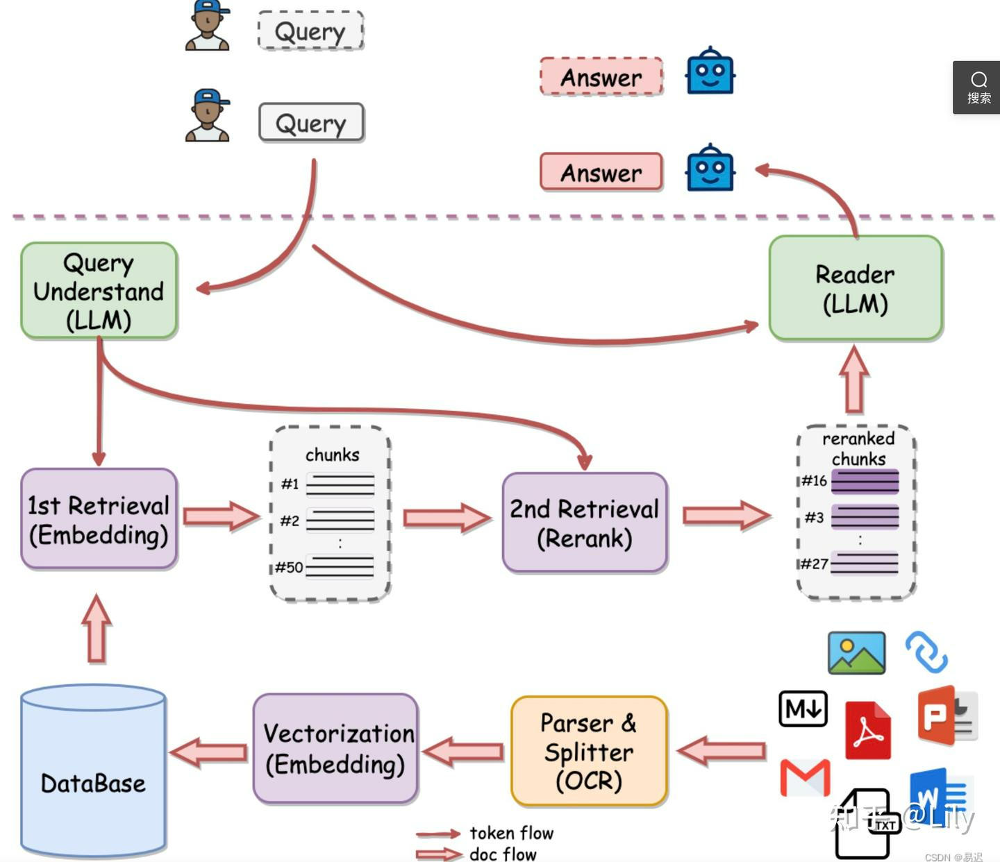
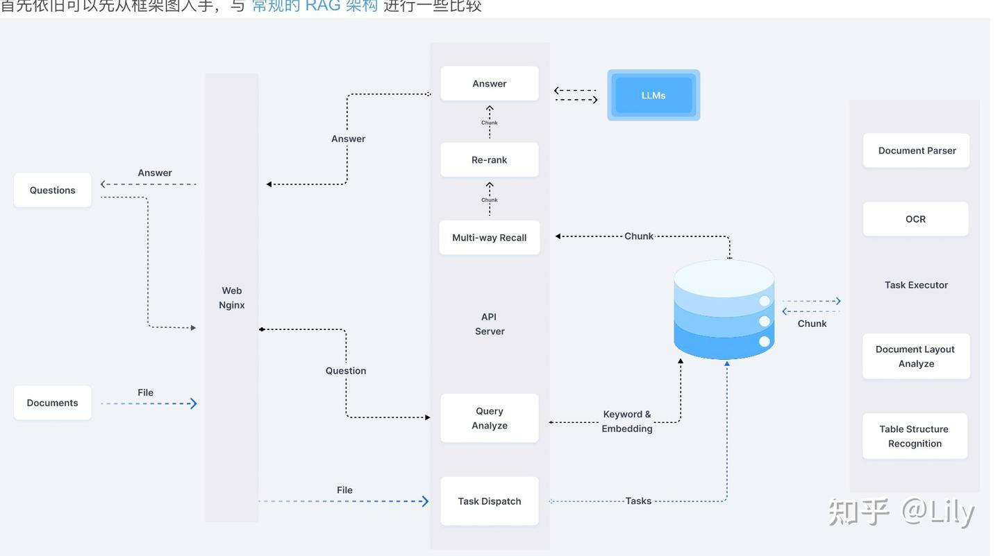
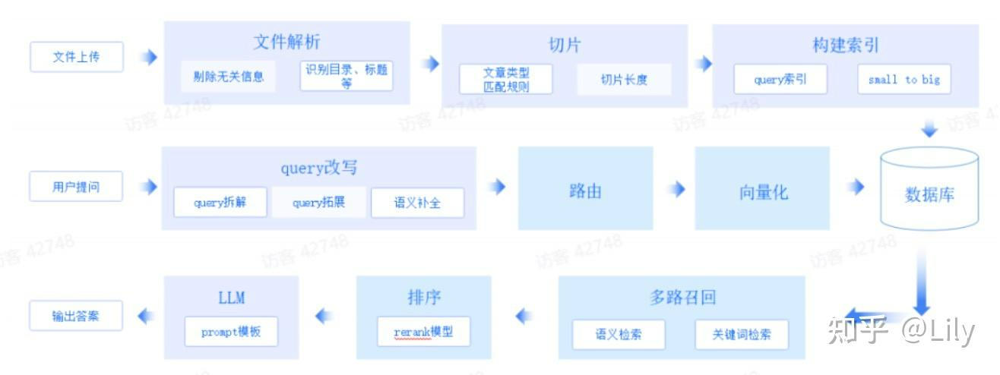
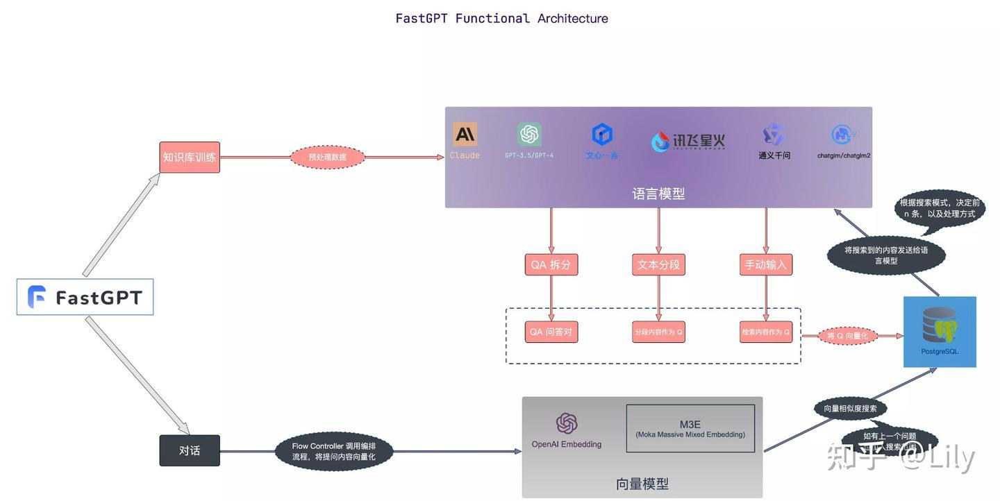

# RAG&工业落地方案框架（Qanything、RAGFlow、FastGPT、智谱RAG）细节比对--细节是魔鬼
* * *

created: 2025-01-24T00:20 updated: 2025-01-26T01:59
---------------------------------------------------

[解码RAG：智谱 RAG 技术的探索与实践](https://www.yuque.com/lebornyuan/sg1shy/alxk2e4manr4xwny)

所谓 RAG，简单来说，包含三件事情。

第一，Indexing。即怎么更好地把知识存起来。

第二，[Retrieval](https://zhida.zhihu.com/search?content_id=244759562&content_type=Article&match_order=1&q=Retrieval&zhida_source=entity)。即怎么在大量的知识中，找到一小部分有用的，给到模型参考。

第三，Generation。即怎么结合用户的提问和检索到的知识，让模型生成有用的答案。这三个步骤虽然看似简单，但在 RAG 应用从构建到落地实施的整个过程中，涉及较多复杂的工作内容（细节上是魔鬼）。

架构几乎按照这个模块设计，但是各家落地方案各有不同

先看一下各家的技术方案
-----------

### 有道的[QAnything](https://zhida.zhihu.com/search?content_id=244759562&content_type=Article&match_order=1&q=QAnything&zhida_source=entity)

亮点在：[rerank](https://zhida.zhihu.com/search?content_id=244759562&content_type=Article&match_order=1&q=rerank&zhida_source=entity)

### RAGFLow

亮点在：数据处理+index

### [智谱AI](https://zhida.zhihu.com/search?content_id=244759562&content_type=Article&match_order=1&q=%E6%99%BA%E8%B0%B1AI&zhida_source=entity)

亮点在文档解析、切片、query改写及recall模型的微调

### [FastGPT](https://zhida.zhihu.com/search?content_id=244759562&content_type=Article&match_order=1&q=FastGPT&zhida_source=entity)

优点：灵活性更高

下面分别按照模块比较各框架的却别

| **功能模块** | **QAnything** | **RAGFLow** | **FastGPT** | **智谱AI** |
| --- | --- | --- | --- | --- |
| 知识处理模块 | pdf文件解析是抑郁[PyMUPDF](https://zhida.zhihu.com/search?content_id=244759562&content_type=Article&match_order=1&q=PyMUPDF&zhida_source=entity)   实现的，目前效率最高的，解析文档的文字采用的是[PyMuPDF](https://zhida.zhihu.com/search?content_id=244759562&content_type=Article&match_order=1&q=PyMuPDF&zhida_source=entity)   的get\_text.不区分文字文档，还是图像文档（图像文档的若没有文字会报错） | [OCR](https://zhida.zhihu.com/search?content_id=244759562&content_type=Article&match_order=1&q=OCR&zhida_source=entity)   ， Document Layout Analyze 等，这些在常规的 RAG 中可能会作为一个不起眼的 Unstructured Loader 包含进去，可以猜到 RagFlow 的一个核心能力在于文件的解析环节 |     |     |
| 召回模块 | 向量库采用[milvus](https://zhida.zhihu.com/search?content_id=244759562&content_type=Article&match_order=1&q=milvus&zhida_source=entity)   的混合检索（BM25+向量检索），不设置阈值，返回topk（100） | 向量数据库使用的是 [ElasticSearch](https://zhida.zhihu.com/search?content_id=244759562&content_type=Article&match_order=1&q=ElasticSearch&zhida_source=entity)   。[混合检索](https://zhida.zhihu.com/search?content_id=244759562&content_type=Article&match_order=2&q=%E6%B7%B7%E5%90%88%E6%A3%80%E7%B4%A2&zhida_source=entity)   ，实现的是文本检索 + 向量检索， 没有指定具体的向量模型，但是使用huqie作为文本检索的分词器 | 语义检索 语义检索模式通过先进的[向量模型](https://zhida.zhihu.com/search?content_id=244759562&content_type=Article&match_order=2&q=%E5%90%91%E9%87%8F%E6%A8%A1%E5%9E%8B&zhida_source=entity)   技术，将知识库中的数据集转换成高维向量空间中的点。在这个空间中，每个文档或数据项都被表示为一个向量，这些向量能够捕捉到数据的语义信息。当用户提出查询时，系统同样将问题转化为向量，并在向量空间中与知识库中的向量进行相似度计算，以找到最相关的结果。 优势：能够理解并捕捉查询的深层含义，提供更加精准的搜索结果。 应用场景：适用于需要[深度语义理解](https://zhida.zhihu.com/search?content_id=244759562&content_type=Article&match_order=1&q=%E6%B7%B1%E5%BA%A6%E8%AF%AD%E4%B9%89%E7%90%86%E8%A7%A3&zhida_source=entity)   和复杂查询处理的情况，如学术研究、技术问题解答等。 技术实现：利用如[text-embedding-ada-002](https://zhida.zhihu.com/search?content_id=244759562&content_type=Article&match_order=1&q=text-embedding-ada-002&zhida_source=entity)   等模型，对文本数据进行embedding，实现高效的语义匹配。 [全文检索](https://zhida.zhihu.com/search?content_id=244759562&content_type=Article&match_order=1&q=%E5%85%A8%E6%96%87%E6%A3%80%E7%B4%A2&zhida_source=entity)   全文检索模式侧重于对文档的全文内容进行索引，允许用户通过输入关键词来检索文档。这种模式通过分析文档中的每个词项，并建立一个包含所有文档的[索引数据库](https://zhida.zhihu.com/search?content_id=244759562&content_type=Article&match_order=1&q=%E7%B4%A2%E5%BC%95%E6%95%B0%E6%8D%AE%E5%BA%93&zhida_source=entity)   ，使用户可以通过任何一个词或短语快速找到相关的文档。 优势：检索速度快，能够对大量文档进行广泛的搜索，方便用户快速定位到包含特定词汇的文档。 应用场景：适用于需要对文档库进行全面搜索的场景，如新闻报道、在线图书馆等。 技术实现：采用倒排索引技术，通过关键词快速定位到文档，同时结合诸如[TF-IDF](https://zhida.zhihu.com/search?content_id=244759562&content_type=Article&match_order=1&q=TF-IDF&zhida_source=entity)   等算法优化搜索结果的相关性。 混合检索 混合检索模式结合了语义检索的深度理解和全文检索的快速响应，旨在提供既精准又全面的搜索体验。在这种模式下，系统不仅会进行关键词匹配，还会结合语义相似度计算，以确保搜索结果的相关性和准确性。 优势：兼顾了全文检索的速度和语义检索的深度，提供了一个平衡的搜索解决方案，提高了用户满意度。 应用场景：适合于需要综合考虑检索速度和结果质量的场景，如在线客服、[内容推荐系统](https://zhida.zhihu.com/search?content_id=244759562&content_type=Article&match_order=1&q=%E5%86%85%E5%AE%B9%E6%8E%A8%E8%8D%90%E7%B3%BB%E7%BB%9F&zhida_source=entity)   等。 技术实现：通过结合倒排索引和[向量空间模型](https://zhida.zhihu.com/search?content_id=244759562&content_type=Article&match_order=1&q=%E5%90%91%E9%87%8F%E7%A9%BA%E9%97%B4%E6%A8%A1%E5%9E%8B&zhida_source=entity)   ，实现对用户查询的全面理解和快速响应。例如，可以先通过全文检索快速筛选出候选集，再通过语义检索从候选集中找出最相关的结果。 向量模型采用：BGE-M3 别通过向量检索、文本检索召回数据，并采用RFF算法排序； | 采用文章结构切片以及 small to big 的索引策略可以很好地解决。针对后者，则需要对 [Embedding 模型](https://zhida.zhihu.com/search?content_id=244759562&content_type=Article&match_order=1&q=Embedding+%E6%A8%A1%E5%9E%8B&zhida_source=entity)   进行微调。我们有四种不同的构造数据的方案，在实践中都有不错的表现： Query vs Original：简单高效，数据结构是直接使用用户 query 召回知识库片段； Query vs Query：便于维护，即使用用户的 query 召回 query，冷启动的时候可以利用模型自动化从对应的知识片段中抽取 query； Query vs Summary：使用 query 召回知识片段的摘要，构建摘要和知识片段之间的映射关系； F-Answer vs Original：根据用户 query 生成 fake answer 去召回知识片段。 微调 Embedding 模型 |
| 重排模块 | 精准排序采用自己的rerank模型，但是阈值设置在0.35 | 重排是基于文本匹配得分 + 向量匹配得分混合进行排序，默认文本匹配的权重为 0.3, 向量匹配的权重为 0.7 | 支持重排，动态设置 合并 embedding 和 fulltext 的结果，并根据 id 去重； 对qa字符串拼接，并删除空格、标点符号，对字符串进行[hash编码](https://zhida.zhihu.com/search?content_id=244759562&content_type=Article&match_order=1&q=hash%E7%BC%96%E7%A0%81&zhida_source=entity)   并去重； 如果配置了 rerank 模型，那调用模型进行重排序，并在 score 中新增 rerank 的得分；没有则不会增加 rerank的得分； |     |
| 大模型的处理 | 所有数据组织在一起的prompt（做了最大token的优化处理） | 大模型可用的 token 数量进行过滤 |     | 模型微调上，采用分阶段微调，即首先用开源通用问答数据进行微调，然后用[垂域](https://zhida.zhihu.com/search?content_id=244759562&content_type=Article&match_order=1&q=%E5%9E%82%E5%9F%9F&zhida_source=entity)   问答数据微调，最后用人工标注的高质量问答数据进行微调。 |
| web服务 | 使用[sanic](https://zhida.zhihu.com/search?content_id=244759562&content_type=Article&match_order=1&q=sanic&zhida_source=entity)   实现web服务 | Web 服务是基于 [Flask](https://zhida.zhihu.com/search?content_id=244759562&content_type=Article&match_order=1&q=Flask&zhida_source=entity) |     |     |
| 切词处理 | 自定义的ChineseTextSplitter完成 | huqie |     |     |
| 文件存储 |     | 文件存储使用的是 [MinIO](https://zhida.zhihu.com/search?content_id=244759562&content_type=Article&match_order=1&q=MinIO&zhida_source=entity) |     |     |
|     |     |     |     |     |
| 亮点  | 与常规的RAG比较，在rerank环节做了精细化调整 | 解析过程写的也很复杂，无怪乎处理速度有点慢。不过预期处理效果相对其他 RAG 项目也会好一些。从实际前端的展示的 Demo 来看，RAGFlow 可以将解析后的文本块与原始文档中的原始位置关联起来，这个效果还是比较惊艳的，目前看起来只有 RagFlow 实现了类似的效果。 | FastGPT 提供了三种检索模式，覆盖了 RAG 中的主流实现。 对重复的数据去重并使用最高得分；计算 rrfScore 并以其为依据排序； |     |

总结：

1、Qanything rerank模块设计的最好

2、RAGFlow 文档处理最好

3、FastGPT 模块动态配置多

4、智谱RAG，在领域数据上微调训练最好

[全维度](https://zhida.zhihu.com/search?content_id=244759562&content_type=Article&match_order=1&q=%E5%85%A8%E7%BB%B4%E5%BA%A6&zhida_source=entity)。没有最好，在自己业务的数据上，能落地就是最好的～。 落地为王