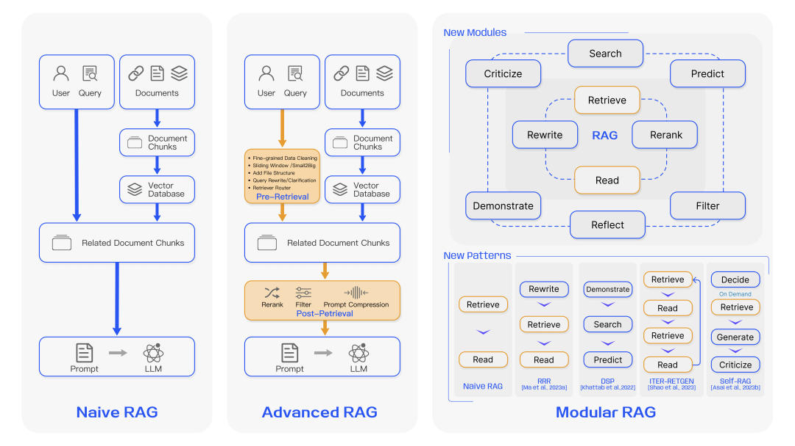

# RAG技术总结和串讲
* * *

created: 2025-01-24T00:20 updated: 2025-01-26T02:12
---------------------------------------------------

> _**作者: cs 的陋室**_
> 
> _\*\*原文: \*\*_[_**https://mp.weixin.qq.com/s/HdEzXWiZaUYEJ3HXSLwZMQ**_](https://mp.weixin.qq.com/s/HdEzXWiZaUYEJ3HXSLwZMQ)

> 最近写的RAG内容已经挺多了，然而内容逐渐变得零散，我今天给大家总结一下RAG的有关内容，同时给大家把有关内容串起来。当然，串起来的更多是概述和摘记，让大家对RAG的基础有更整体的了解，详情大家可以根据需要再展开了解，我也会在合适的位置加上原文链接。

> 内容目录：

*   概念。
*   从baseline到技术拓展。（basleine和高级RAG升级）
*   调优方案。（论文视角和实践视角）
*   效果评估。
*   微调和RAG的权衡。
*   RAG是否会消亡。（本文私货）

**\>概念**
--------

> 首先还是得介绍什么是RAG（Retrieval-Augmented Generation）指的是\*\*>通过将检索模型和生成模型结合在一起，从而提高了生成内容的相关性和质量。\*\*>说到概念，严谨的，我照旧摘录来自一篇综述的解释（[\>综述-面向大模型的检索增强生成（RAG）](http://mp.weixin.qq.com/s?__biz=MzU3Mzg5ODgxMg==&mid=2247487029&idx=1&sn=4b85963c99aaeb8dbdc008bfc1b46d34&chksm=fd3be766ca4c6e70cc16bb9cc1b8bd0916a1f58e0765945b00bf9c0a0011c5cfbc656a47c69c&scene=21#wechat_redirect)\>）：

> In the era of Large Language Models, the specific definition of RAG refers to the model, when answering questions or generating text,**\> ****\>first retrieving relevant information from a vast corpus of documents**\>. Subsequently, i**\>t utilizes this retrieved information to generate responses or text**\>, thereby enhancing the quality of predictions.

> 说白了就是有检索和对检索的使用，基本都可以说是RAG了（极端的，某种程度上，词典匹配，也算是一种RAG）。

> 正因为需要包含检索以及后续大模型的使用，所以RAG和原来常规的深度学习研究不太一样，他不是一个深度模型，更像是一个系统，系统里面可以有多个组件，一般的结构可用下面这张图来表示。（[\>综述-面向大模型的检索增强生成（RAG）](http://mp.weixin.qq.com/s?__biz=MzU3Mzg5ODgxMg==&mid=2247487029&idx=1&sn=4b85963c99aaeb8dbdc008bfc1b46d34&chksm=fd3be766ca4c6e70cc16bb9cc1b8bd0916a1f58e0765945b00bf9c0a0011c5cfbc656a47c69c&scene=21#wechat_redirect)\>）

> 但概念解释我不想止步于此，在这里我想进一步挖掘，RAG这个概念的起源。早在2020年就已经有人提及RAG的概念（Retrieval-augmented generation for knowledge-intensive nlp tasks，他的首版发布在arxiv于2020年5月，如果有更早的欢迎大家再提出）（这篇论文后面有时间，我也想拿出来详细讲讲），当年还是seq2seq的时代，但实验就已经发现，通过检索，能快速从海量知识中找到和原本问题相关的知识，借助知识带来的信息能让最终的生成效果能够得以提升。

**\>从baseline到技术拓展**
--------------------

### **\>baseline**

> 最基础的RAG，就是上图左边的Naive RAG，基本只包含两个部分，即检索和生成，为了让大家更好地理解RAG整体结构，我自己写了一版基础RAG项目，这里最大程度还原最基础RAG的结构，同时也给了一定的调优空间，github地址：[https://github.com/ZBayes/basic\_rag](https://github.com/ZBayes/basic_rag).

> 里面有几个比较关键的点，着重拿出来讲一下。

*   这个项目是奔着大型RAG项目去写的。所以里面会划分服务，而不是一个流程全部写完，注意看服务和代码文件的拆分，还有具体服务是怎么串起来的。
*   **服务是用tornado写的简单版，当然换成别的服务组件也可以，例如flask、fastapi等。**
*   里面有几个部分：**离线的灌数据模块**，一般就是脚本；**检索模块是在线的检索**，目前使用的是最简单的向量召回；**大模型模块**用的是一个chatglm，直接封装服务就好了。
*   很多位置我都为后续的迭代留了空间，例如向量检索这里，我切分了很多层，searcher、vec\_searcher、vec\_index，就是给了很多空间，一个searcher可以有很多不同的索引和索引类型，**vec\_searcher是向量检索，下面可以有多个vec\_index，对应不同的向量模型。**

### **\>技术拓展**

> 有关RAG的拓展，往往会在naive基础上分为两个阶段，高级RAG和模块化RAG。

高级的RAG能很大程度优化原始RAG的问题，在索引、检索和生成上都有更多精细的优化>，主要的优化点会集中在\*\*>索引、向量模型优化、检索后处理\*\*>等模块进行优化。

> 模块化RAG是对高级RAG的一种升级，这里面集成了大量优化策略，并将这些策略进行重组，形成完整的模块独立完成特定功能，很多内容和前面的高级RAG提及的内容很接近，**\>只是更加模块化，如搜索模块、记忆模块、额外生成模块、任务适配模块、对齐模块、验证模块等**\>，因为RAG本身是一个高度组织性的项目，因此在迭代过程中，是允许且需要对这些模块进行优化和调整的，可以增减、调整各个模块。

> 具体有什么调优方案，我在下一个章节展开说。

**\>调优方案**
----------

> 说到调优，无论是学术界还是工业界，可谓是八仙过海各显神通，但是科研和工业界各自会呈现不同的倾向性，所以这里我分两个大块来讲，分别是学术界和工业界的思路。

### **\>学术界**

> 学术界自然离不开综述，1月份我对综述（Retrieval-Augmented Generation for Large Language Models: A Survey）进行了详细的讲解，字数有7千多（[\>综述-面向大模型的检索增强生成（RAG）](http://mp.weixin.qq.com/s?__biz=MzU3Mzg5ODgxMg==&mid=2247487029&idx=1&sn=4b85963c99aaeb8dbdc008bfc1b46d34&chksm=fd3be766ca4c6e70cc16bb9cc1b8bd0916a1f58e0765945b00bf9c0a0011c5cfbc656a47c69c&scene=21#wechat_redirect)\>），文章里对RAG的升级路径进行了详细解释，其中重点从检索模块、生成模块、整体等角度对RAG目前的关键技术进行了讲解，为RAG的调优提供了大量思路。简单摘录一下：

*   **检索模块重在关注向量模型的合理表征（领域微调和下游任务微调）、query和文档语义空间的匹配（query改写、实体mask等策略）、大模型和检索模块协同的优化。**
*   生成模块关注检索的后处理（重点信息提取、检索结果重排）、生成结果的处理等角度。
*   整体调优从调优阶段（入手点）、数据来源和调优思路三个角度来分析具体的调优方法。

> 里面的内容过多，不好展开，详情大家可以看我的讲解（[\>综述-面向大模型的检索增强生成（RAG）](http://mp.weixin.qq.com/s?__biz=MzU3Mzg5ODgxMg==&mid=2247487029&idx=1&sn=4b85963c99aaeb8dbdc008bfc1b46d34&chksm=fd3be766ca4c6e70cc16bb9cc1b8bd0916a1f58e0765945b00bf9c0a0011c5cfbc656a47c69c&scene=21#wechat_redirect)\>）或者是综述原文（Retrieval-Augmented Generation for Large Language Models: A Survey）。

### **\>工业界**

> 工业界也有一篇综述，不过里面体提到的方案和思路更加偏向应用，所以我想把这篇放在工业界（[https://pub.towardsai.net/advanced-rag-techniques-an-illustrated-overview-04d193d8fec6），我也写了解读文章（\[>高级RAG技术\](http://mp.weixin.qq.com/s?\_\_biz=MzIzMzYwNzY2NQ==&mid=2247489357&idx=1&sn=4193a9e92c7749e4ecdacbce7cf6b9db&chksm=e8824fd3dff5c6c5b6c04be81624bf075c96fef23fc40f8cd165a600ecaa02d434a5fd21da41&scene=21#wechat\_redirect)>）。](https://pub.towardsai.net/advanced-rag-techniques-an-illustrated-overview-04d193d8fec6%EF%BC%89%EF%BC%8C%E6%88%91%E4%B9%9F%E5%86%99%E4%BA%86%E8%A7%A3%E8%AF%BB%E6%96%87%E7%AB%A0%EF%BC%88%5B%3E%E9%AB%98%E7%BA%A7RAG%E6%8A%80%E6%9C%AF%5D(http://mp.weixin.qq.com/s?__biz=MzIzMzYwNzY2NQ==&mid=2247489357&idx=1&sn=4193a9e92c7749e4ecdacbce7cf6b9db&chksm=e8824fd3dff5c6c5b6c04be81624bf075c96fef23fc40f8cd165a600ecaa02d434a5fd21da41&scene=21#wechat_redirect)%3E%EF%BC%89%E3%80%82)

> 和前面的综述类似，这里也提到了基础RAG、高级RAG和区别，然后就展开解释各个模块的优化了：

*   离线文档处理。
*   文档内容增强。
*   索引构建和选择。
*   检索策略多样性和合并。
*   查询后处理。
*   多轮和聊天引擎。
*   查询路由和智能体。
*   响应合成。
*   模型微调。

> 这些结构里，能看到很多现实应用才会遇到的特定问题，例如检索策略多样性和合并>，工业界和学术界的视角差异还是很大的，**\>工业界更倾向于拆分分别处理，既能更方便特异化处理提升上限，也方便进行分工推进工作**\>，而学术界其实并没有那么擅长尤其是这种横向的拆分，确实是不够学术优雅。

> 而且，我自己也根据自己的经验提供了很多优化思路，专门有写文章（[\>基础RAG-调优方案](http://mp.weixin.qq.com/s?__biz=MzU3Mzg5ODgxMg==&mid=2247487127&idx=1&sn=00545a44e4b6fdc9d98d4bfc7a6ed0fc&chksm=fd3be7c4ca4c6ed2553f849da7d988eb8f3e3b5e25f2b843071fbf604fc38f0cab5b21c946f6&scene=21#wechat_redirect)\>），尽管现在来看还有很多可以聊的部分（后面有机会我再写！），但这篇也很实用了，希望对大家有多帮助，里面提了很多实践和分析数据才会发现的优化点。我是分为检索调优、prompt、后处理、微调这几个方面去谈的。

> 除此之外，**\>知识的处理也是一个非常重要的一环，尤其现在大模型出来后，文档处理能力提升还挺明显的**\>，我正好写了一篇文章，主要是串讲知识的处理和使用流程，同时介绍了里面的常用方案，大家可以在有个大框架的基础上进一步深入学习（[\>知识文档处理和使用流程](http://mp.weixin.qq.com/s?__biz=MzIzMzYwNzY2NQ==&mid=2247489470&idx=1&sn=50f618e87545a1ef12e3480bd44e64f1&chksm=e8824f20dff5c6365532bd45aa1853086014cad3bc31f5bbb73235da791ee45b16738501ba5c&scene=21#wechat_redirect)\>）。

> 有一篇比较取巧地\*\*>query拓展的文章\*\*>（[\>微软新文query2doc：用大模型做query检索拓展](http://mp.weixin.qq.com/s?__biz=MzIzMzYwNzY2NQ==&mid=2247489295&idx=1&sn=fcb269e47dc27fcaf31201aa1c75dafb&chksm=e8824f91dff5c687a3a95d18490c8d2ba9b18d1b7cd5bc614e01ef3d7dd6d72aa62bcc0c2b0d&scene=21#wechat_redirect)\>），属于对搜索有用，现在视角看对RAG领域也有很大的优化收益，所以在这里也重提，非常推荐大家在早期项目上使用这个方案，虽然多了一次大模型调用的代价，但是效果提升还挺明显，值得推荐。>趁此机会也补充说明一下，在之前已经有一篇类似的论文，HyDE（Precise Zero-Shot Dense Retrieval without Relevance Labels），这篇我没出解读，感觉重复不少，我就不重写了，但仍很推荐大家也读读看。

**\>效果评估**
----------

> 效果评估是算法的重要一环，我也对这块内容进行了详细调研和经验总结（[\>RAG效果评估经验](http://mp.weixin.qq.com/s?__biz=MzU3Mzg5ODgxMg==&mid=2247487941&idx=1&sn=ce46415b1f5ffe12db07766f740466f7&chksm=fd3bf896ca4c7180f49d2491660a050e880f0584b3d2a3c5968d9ad0f5bf7037351139327e71&scene=21#wechat_redirect)\>）。类似的，我也是从学术界和实际场景应用两个角度分别阐述两者的评估方案，并从快速验证、稳定评估和问题定位三个角度，给出实践场景下的建议。

**\>方案选择和权衡**
-------------

> RAG只是大模型的一种使用方法，检索技术能快速从海量知识中找到和原本问题相关的知识，借助知识带来的信息能让最终的生成效果能够得以提升，因此RAG本质上并非大模型的专属，从而可以发现大模型不是非RAG不可，RAG也不是非大模型不可，RAG只是大模型的一种打开方式>，**\>他所解决的，是对知识的依赖，这可以是知识的可见性（能懂大模型之前没见过或者没学好的东西）、及时性（新知识）、存在性（不会的能拒绝）等问题。**

> 而它的使用时机，以及和微调之间的权衡，详细地讨论可以参考这篇文章（[\>微调与RAG的优缺点分析](http://mp.weixin.qq.com/s?__biz=MzU3Mzg5ODgxMg==&mid=2247487432&idx=1&sn=402081b9eefc32f128b7bd11166d7c51&chksm=fd3be69bca4c6f8d014626a672885c5a259246bfb040173637f40f3a080114000a5d3e3f0113&scene=21#wechat_redirect)\>），在这里我有通过论文、社区等角度汇总了多方观点，并通过案例分析的方式给出了我的答案。

**\>RAG（检索增强生成）会不会消亡呢**
-----------------------

> 另外，我想在这里驳斥一个社区经常谈及的问题：“RAG（检索增强生成）会不会消亡呢？”（[https://www.zhihu.com/question/637421964），这个问题的背景是目前的大模型Context](https://www.zhihu.com/question/637421964%EF%BC%89%EF%BC%8C%E8%BF%99%E4%B8%AA%E9%97%AE%E9%A2%98%E7%9A%84%E8%83%8C%E6%99%AF%E6%98%AF%E7%9B%AE%E5%89%8D%E7%9A%84%E5%A4%A7%E6%A8%A1%E5%9E%8BContext) Length变大，RAG就可能会消失。这个问题我本想专门写文章，但又感觉不够长，写一半成了废案，于是就放在这里吧，还挺合适的。

> 第一，这个问题能问出来，说明对RAG背后所希望解决的问题理解不足吧，**\>RAG所要解决的是知识依赖的问题，知识依赖这个事和大模型Context Length的关系并不紧密**\>。

> 第二，知识依赖这不只是大模型的问题，而是整个领域都要面对的问题。>在很早之前（都是21年那会的文章了），我就写过一篇文章（[\>模型需要的信息提供够了吗](http://mp.weixin.qq.com/s?__biz=MzIzMzYwNzY2NQ==&mid=2247487806&idx=1&sn=4fbfe81cf083b7d2937893556cb62558&chksm=e88249a0dff5c0b67d17d31431d96853a747b9031aa1b6907973e9e5f050958039615b7afe8b&scene=21#wechat_redirect)\>），从一个更高角度来聊信息传递给模型的重要性，模型要是不知道，那让他干的事就很可能会办不好，而向模型传递信息，一般有两个方法，一个是训练，一个是特征，对应到现在大模型的场景，那就是微调和prompt，**\>前者通过大量相似相关的数据案例告诉模型让模型照着预测，后者则是把规则描述讲给模型听或者把关键信息直接传给模型，降低他的推理压力，只要关键信息没有提供给模型，那效果就好不了**\>，过去的bert是这样，现在的大模型也是这样。

> 第三，同样是模型的问题。\*\*>无论是大模型，还是之前的小模型，\*\***对信息反馈的及时性，仍旧不足。**\>大家或多或少都会发现，一些去年前期发布的开源模型，或多或少都对新的知识并不了解，其根本问题就是，没有学习到新知识，要学习新知识，不得不经过严格的训练和评估才能上线，且还要面对遗忘的问题，要做实时的难度非常大，这里就是第二点提出的微调方向。要解决这种，不得不依赖外部信息的支持，然后通过第二点提到的prompt的方式输入到模型中，而这些知识，无法绕开检索来进行。举个例子，某些商店的上架商品信息，天气日期、新闻等的一些实时性要求高的知识，就只能通过数据库来存储，数据库的更新可以非常敏捷，查询后配合prompt交给大模型来解决了。

> 综上，只要上面的知识依赖、知识更新问题没有解决，那RAG就仍有一席之地。至于RAG内部说到的搜索，可以说是从来没大火过但是又一直在喝汤的领域了。