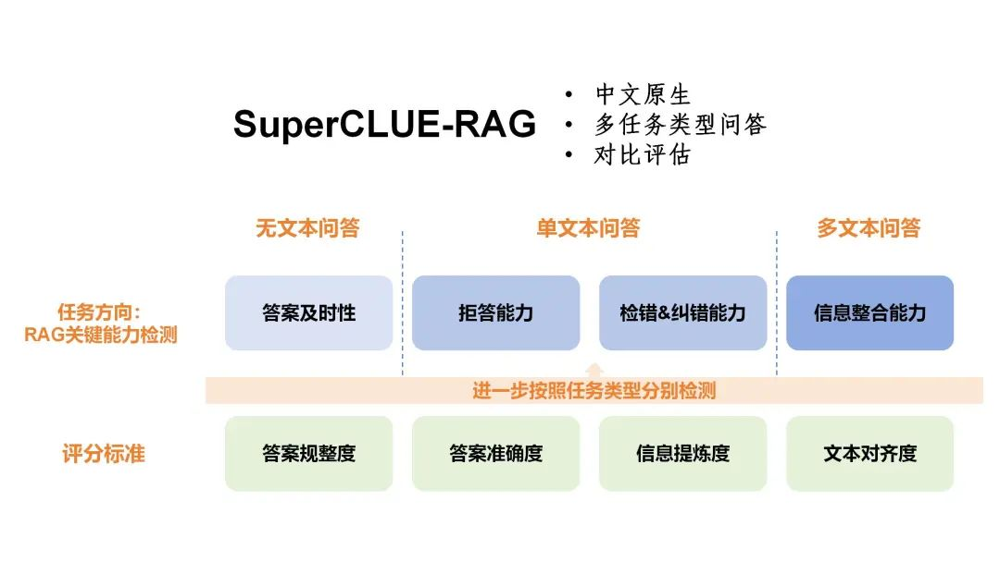

# RAG效果评估经验总结
* * *

created: 2025-01-24T00:20 updated: 2025-01-26T02:12
---------------------------------------------------

> > [https://mp.weixin.qq.com/s/HEYT\_9ScVmjzRlpdRKKB4Q](https://mp.weixin.qq.com/s/HEYT_9ScVmjzRlpdRKKB4Q)

> 对一套算法方案进行客观全面的评估并不是一个容易的课题，加上大模型这种偏自由的模型，评估起来就难上加难，RAG在大模型的基础上增加了检索模块，此时又叠加上了更复杂的结构，如此以来，科学地评估和分析的难度就大了不少，今天来给大家讲一下如何对RAG进行客观全面的评估。

> 叠个甲，本文其实是应用方向，旨在让大家更好地分析自己场景下的RAG效果。

**\>学术界的讨论**
------------

> 学术界是专业严谨的代表，里面的方法也能很大程度代表了其专业性和认可度，我先从论文入手开始分析吧。

### **\>从CRAG开始的分析**

> 首先是CRAG这篇论文，之前有专门讲过（[\>谷歌中科院新文：CRAG-可矫正的检索增强生成](http://mp.weixin.qq.com/s?__biz=MzIzMzYwNzY2NQ==&mid=2247489437&idx=1&sn=b70db6190484c4056318b8275b014dd6&chksm=e8824f03dff5c61579c9eeb01c588f3713bbfbb0b7786cc81246144c52d65715ca31d975610f&scene=21#wechat_redirect)\>），在这篇论文里，横向评估使用的是4个数据集及其对应指标，分别是PopQA（Accuracy）、Bio（FactScore）、Pub（Accuracy）、 ARC（Accuracy）。

*   PopQA：[https://paperswithcode.com/dataset/popqa](https://paperswithcode.com/dataset/popqa)
*   Bio/FactScore：[https://arxiv.org/abs/2211.08411，https://github.com/shmsw25/FActScore](https://arxiv.org/abs/2211.08411%EF%BC%8Chttps://github.com/shmsw25/FActScore)
*   Pub：[https://paperswithcode.com/dataset/pubhealth](https://paperswithcode.com/dataset/pubhealth)
*   ARC：[https://arxiv.org/abs/2102.03315](https://arxiv.org/abs/2102.03315)

> 而随着论文的深入，逐步发现数据集下其实并非唯一指标或者唯一的数据集，作者只是取了一些比较直观的指标来进行对比，我这里简单总结一下这些数据集涉及的覆盖的一些评估方法。

*   **将回复拆解成多个事实，然后通过一一比对事实来查看回复的正确性**。
*   最直接的就是**人工评估，直接判断答案的对错**。
*   使用黄金数据集，然后用生成指标（ROUGE、F1 wordoverlap）之类的指标来进行判断。
*   **借助大模型来进行判断，或者用比较接近完美的GPT4和实际回复进行比对**。

> 这些评估方法思路各异，也一定程度在特定场景下能产生作用，可以作为方案储备起来。

### **\>综述分析**

> 早前我也是详细介绍了一篇综述（[\>综述-面向大模型的检索增强生成（RAG）](http://mp.weixin.qq.com/s?__biz=MzU3Mzg5ODgxMg==&mid=2247487029&idx=1&sn=4b85963c99aaeb8dbdc008bfc1b46d34&chksm=fd3be766ca4c6e70cc16bb9cc1b8bd0916a1f58e0765945b00bf9c0a0011c5cfbc656a47c69c&scene=21#wechat_redirect)\>），文章里我其实也有提及这个评估指标，在这里我重新讲讲吧。论文中是把整体评估方案分成了两个部分，分别是独立评估和端到端评估。

> 独立评估是指深入RAG内部，评估每个部分的效果，这里主要是\*\*>检索模块和生成模块\*\*>的评估，前者本质就是一个搜索，所以自然就用搜索方面的常用指标了，例如 Hit Rate、MRR、NDCG、Precision等>。至于生成模块，则则需要\*\*>关注生成结果和问题的关系\*\*>，某种程度上和直接评估端到端差不多了，这个“关系”的定义，后面我在端到端模块重点讲。

**\>端到端评估，关注的是输入和输出的关联性，**\>这里作者列举了一些有用的评估指标：**无标注的，可以通过忠诚性、答案相关性、无害性来评估（主观），有标注（有标准答案的）的可以考虑准确率和EM（exact match，即完全匹配答案的覆盖度），亦或者是一些生成或者翻译的指标，如BLEU。**

> 再者，作者也重点强调了RAG内比较重要的能力维度（文章称为Key Metrics and Abilities，我给简化合并了）。

*   忠诚性：强调回复内容必须忠诚于上下文（指检索得到的内容）
*   答案相关性：答案必须是回答给定问题的。
*   上下文相关性：这里是要求检索到的内容必须足够和问题相关，强调的是检索模块的能力。
*   抗噪性：检测生成模块对噪音（问题无关）信息的抵抗能力。
*   无答案拒答：在无答案或者内容不正确的情况下拒绝回答的能力。
*   信息整合能力：考察模型能否集成多个文档的内容来回答复杂问题的能力。

> 其实可以看到，考察RAG的能力是多维度多样的，实际场景我们要根据实际需要去监测不同维度的效果。

### **\>superCLUE**

> 最近superclue出了一个有关RAG的评估方案。

*   项目：[https://github.com/CLUEbenchmark/SuperCLUE-RAG（目前看项目里没什么东西，就是一个README和图片而已）](https://github.com/CLUEbenchmark/SuperCLUE-RAG%EF%BC%88%E7%9B%AE%E5%89%8D%E7%9C%8B%E9%A1%B9%E7%9B%AE%E9%87%8C%E6%B2%A1%E4%BB%80%E4%B9%88%E4%B8%9C%E8%A5%BF%EF%BC%8C%E5%B0%B1%E6%98%AF%E4%B8%80%E4%B8%AAREADME%E5%92%8C%E5%9B%BE%E7%89%87%E8%80%8C%E5%B7%B2%EF%BC%89)
*   文章：[https://www.cluebenchmarks.com/superclue\_rag.html](https://www.cluebenchmarks.com/superclue_rag.html)

> 文章内提供的一张图基本能表现他的具体能力和判断维度了。

superclue

**吃果冻不吐果冻皮**致力于分享AI前沿技术（如：LLM/MLOps/RAG/智能体）、AI工程落地实践、AI基建（如：算力、网络、存储）等。165篇原创内容公众号\*\*>实际场景\*\*
----------------------------------------------------------------------------------------------------------------------------

### **\>开源框架**

> 首先想聊的也是社区里经常能看到的一个开源框架，**\>Ragas（[https://docs.ragas.io/en/stable/getstarted/index.html），内部是有支持多个指标的计算，但值得注意的是，这里的评估是依赖openai](https://docs.ragas.io/en/stable/getstarted/index.html%EF%BC%89%EF%BC%8C%E5%86%85%E9%83%A8%E6%98%AF%E6%9C%89%E6%94%AF%E6%8C%81%E5%A4%9A%E4%B8%AA%E6%8C%87%E6%A0%87%E7%9A%84%E8%AE%A1%E7%AE%97%EF%BC%8C%E4%BD%86%E5%80%BC%E5%BE%97%E6%B3%A8%E6%84%8F%E7%9A%84%E6%98%AF%EF%BC%8C%E8%BF%99%E9%87%8C%E7%9A%84%E8%AF%84%E4%BC%B0%E6%98%AF%E4%BE%9D%E8%B5%96openai)**\>，因此可以推测，这里面很多评估依赖了openai的大模型。我自己因为场景原因用的比较少，如果自己的场景合适大家可以自行探索。

> 当然还有其他框架：

*   DeepEval：[https://link.zhihu.com/?target=https%3A//www.confident-ai.com/blog/how-to-evaluate-rag-applications-in-ci-cd-pipelines-with-deepeval](https://link.zhihu.com/?target=https%3A//www.confident-ai.com/blog/how-to-evaluate-rag-applications-in-ci-cd-pipelines-with-deepeval)
*   ARES：[https://link.zhihu.com/?target=https%3A//github.com/stanford-futuredata/ARES](https://link.zhihu.com/?target=https%3A//github.com/stanford-futuredata/ARES)
*   LangChain Evals：[https://link.zhihu.com/?target=https%3A//python.langchain.com/docs/guides/evaluation/](https://link.zhihu.com/?target=https%3A//python.langchain.com/docs/guides/evaluation/)
*   Llama Index Evals：[https://link.zhihu.com/?target=https%3A//docs.llamaindex.ai/en/stable/module\_guides/evaluating/root.html](https://link.zhihu.com/?target=https%3A//docs.llamaindex.ai/en/stable/module_guides/evaluating/root.html)

### **\>人工评估**

> 大模型的自由生成下，人工评估总是最直接能想到的方法，虽说不方便，但可靠性并不低。科学地、可分析地，我们一般会按照几个维度来评估，然后对每个样本进行打分，简单的0-1两档，如果觉得不够细可根据实际情况再分多个档，例如中间加个0.5之类的。

*   真实性：回复内容确保是真实的，完整的，无幻觉，无过度描述。
*   相关性：答案和问题是相关的，有效的，答案是能够回答问题的。
*   无害性：内容安全可靠，没有各领域的危险说法，如黄反、违法违规等。
*   无答案拒绝：没有答案的情况下的拒绝回复能力。

> 当然，很多实际场景可能不局限在这些维度，可能有别的，也可能有些维度在实际场景并不需要，可以进行合并简化。

### **\>自动化评估**

> 为了更快地进行评估，一些时候我们可以用一些自动化评估的方案来加速迭代进度，虽说不一定准但胜在比较快，等到发版前或者关键里程碑位置再来启用人工，这样的效率更高。

自动化评估一般可以直接参照文本生成下常用的指标来进行>，对RAG，可以\*\*>尽可能参考机器翻译的指标，比较常见的是BLEU、ROUGE等\*\*>，其实可以很大程度观测到具体的提升波动情况，结合对低分case的分析，我们可以快速分析问题并进行迭代。

> 这里有一个大难题，是**测试集**\>，很多时候我们可能没有比较好的测试集，这个可以\*\*>通过大模型生成结果后复核来实现，这种方案很大程度降低了标注成本，\*\*>毕竟人工写和修正之间的差距还是很大的。

> 另外，要补充说明，**\>RAG还可以用在分类、实体抽取之类任务上（如检索出最接近的例子让大模型参考，形成few-shot prompt方案），此时，就可以用对应任务的指标来进行评估，例如准确率、召回率、F1等**\>，这些直接就是可以自动化评估的。

### **\>系统内部检测**

> 在评估完端到端后，为了更详细地剖析问题，我们还需要定位问题，此时我们就要开始对系统内的多个模块进行评估，这里列举一些常见模块。

*   检索模块。此时可以考虑用准确率、NDGC、recall@N等的搜索/推荐指标来进行评估。
*   判别&排序模块。在CRAG、self-RAG内都有类似的模块，事实上都需要而且可以进行严格的判断，这种直接**按照分类、排序常见的指标来评估即可，准确率、召回率、ACC等。**
*   embedding模型评估。简化后就是**句子对分类问题，那就是考虑分类指标。**
*   query理解。**有很多RAG系统中会有query理解模块，如实体抽取、意图识别等，这些问题也就直接使用对应方法进行评估即可。**
*   **生成模块的可靠性**。在检索正确的情况下，生成模块（一般就是大模型），大模型是否能给出正确的结果。

**\>实践建议**
----------

> 大家也可以看到，相比以前很多NLP任务的标准逐渐统一，现在RAG的标准非常多样，而且在大模型的背景下，对人工依赖还不少，而回到实际场景，我们还是需要根据实际情况来设计效果评估的方案。这里我提供一个现实情况比较通用的方案供大家使用。

> 整个评测分为三个角度，分别是快速验证、稳定评估和问题定位>。

> 快速验证的重点是能比较快地评估出整套RAG方案的效果，要快速又要较为准确，自动化评估>里的方案是非常合适的，大家可以\*\*>通过预标注+人工校验的方式快速弄出一批百级别的比较精准的测试集\*\*>，然后利用指标计算快速验证，例如一些文本生成的指标，前面提了几次的BLEU、ROUGE都是很好的，这些指标虽然算不上准确，但只要基本和最标准的人工特征呈正相关关系，就可以作为观测的指标了。

> 稳定评估则是用于进行更严格标准的验证，一般是在上线前或者是里程碑时间点下的评估方案，一般是人工、多维度的检验>，虽说人工的可靠性是最高的，但人工资源宝贵而且时间长，所以降低使用的频次，只在重要时间节点下使用。

> 问题定位是在对整体效果有一定把握时，为了定位和发现问题所使用的方法，毕竟RAG是一个系统，任何一个位置出问题都是有可能带来最终效果的变差，具体的思路就参考前面提及的“系统内部检测”，**\>检查各个模块各自的效果**\>，例如\*\*>query理解的准确情况、检索的准确性、排序判别是否正确或者是生成模块结果的可靠性，都要全面观测\*\*>，这里的观测重点关注两个内容，一个是各个模块自己的指标高低，另一个是在端到端环境下，每个模块各自问题的占比>，前者很好理解，但是后者同样重要，后者几乎直接决定了后面的优化方向，这个直接通过bad case分析，归因得到，能看到短板问题。