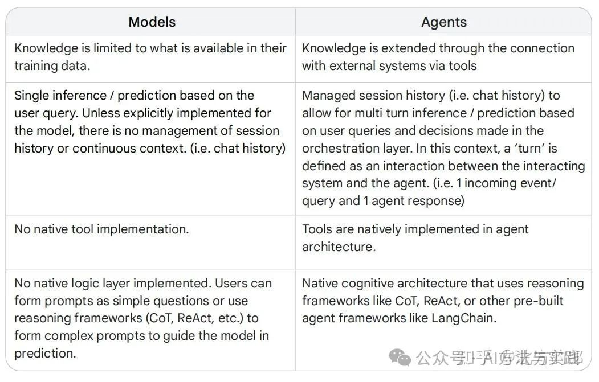
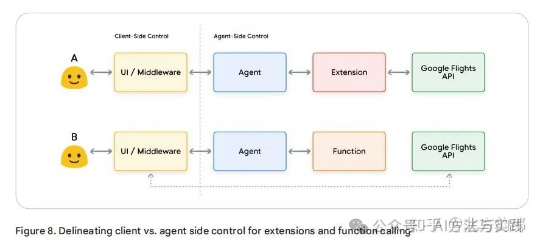

# 详解Google《Agents》白皮书，揭开智能体（Agents）的神秘面纱
* * *

created: 2025-01-24T00:20 updated: 2025-01-26T01:59
---------------------------------------------------

> _**作者: 北方的郎**_
> 
> _\*\*原文: \*\*_[_**https://mp.weixin.qq.com/s/I\_ZtBrOrudgydS3o6\_Crqg**_](https://mp.weixin.qq.com/s/I_ZtBrOrudgydS3o6_Crqg)

最近大厂都开始针对大模型向外输出知识、经验，前两天刚刚学习了anthropic公司的非常实用的“Building effective agents”（具体可以看我的文章：北方的郎：构建高效的智能体，来看anthropic的经验），Google又发布了“Agents”，深入探讨智能体的核心架构、工具的使用方式，以及如何通过增强学习提升模型性能，带领读者一窥生成式AI与外部世界互动的未来。

地址：Agents

原文是一个白皮书，内容非常长，为了方便大家了解，我对主要内容进行了提取。不过还是建议大家看一遍原文，这个文章写的很好，对于构建智能体有很多值得学习、借鉴的地方，尤其是例代码。

第一章：引言
------

### 什么是智能体？

智能体可以被定义为一个试图通过观察世界并利用其工具来达成目标的应用程序。与传统的生成式AI模型不同，智能体具有自主性，能够在没有人类干预的情况下独立行动。它们不仅能够根据明确的指令执行任务，还能在没有明确指令的情况下，通过推理来决定下一步行动。智能体的核心在于其认知架构，即驱动其行为、决策和行动的三个基本组件：模型、工具和编排层。

### 模型、工具与编排层

模型：模型是智能体的核心决策者，通常是一个或多个语言模型（LM）。这些模型可以是通用的、多模态的，也可以根据特定任务进行微调。模型的选择应根据最终应用的需求，理想情况下，模型应具备与工具相关的数据签名。

工具：尽管生成式AI模型在文本和图像生成方面表现出色，但它们无法直接与外部世界互动。工具弥补了这一缺陷，使智能体能够与外部数据和系统交互，执行更广泛的任务。工具的形式多样，通常与常见的Web API方法（如GET、POST、PATCH和DELETE）对齐。

编排层：编排层描述了智能体如何循环处理信息、进行内部推理，并基于推理结果决定下一步行动。这个循环会持续进行，直到智能体达成目标或达到停止点。编排层的复杂性因任务而异，可能涉及简单的决策规则或复杂的逻辑链。

### 智能体与模型的区别

智能体与传统的生成式AI模型有几个关键区别：

*   知识扩展：模型的知识仅限于其训练数据，而智能体通过工具与外部系统连接，扩展了其知识范围。
*   会话管理：智能体能够管理会话历史（如聊天记录），支持多轮推理和预测，而模型通常只能进行单次推理。
*   工具实现：智能体原生支持工具的使用，而模型则需要通过复杂的提示工程来实现类似功能。

第二章：工具——连接外部世界的钥匙
-----------------

智能体的核心能力之一是通过工具与外部世界进行交互。这些工具不仅扩展了智能体的功能，还使其能够访问实时信息、执行复杂任务，并在现实世界中产生影响。本章将详细介绍智能体所使用的三种主要工具类型：**扩展（Extensions）**、**函数（Functions）和数据存储（Data Stores）**，并探讨它们如何帮助智能体突破生成式AI模型的固有局限。

### 1\. 扩展（Extensions）：无缝连接API与智能体

扩展是智能体与外部API之间的桥梁，允许智能体以标准化的方式执行API调用。与传统的自定义代码相比，扩展更具弹性和可扩展性，能够动态选择最适合的API来响应用户查询。

### 扩展的工作原理

扩展通过以下方式连接智能体与外部API：

1.  **教导智能体如何使用API**：扩展通过提供示例，教导智能体如何调用特定的API端点。
2.  **定义API调用所需的参数**：扩展还定义了调用API所需的参数，确保智能体能够正确解析用户输入并生成有效的API请求。

例如，假设一个智能体的目标是帮助用户预订航班。开发者可以使用Google Flights扩展，使智能体能够调用Google Flights API来检索航班信息。如果用户输入“我想预订从奥斯汀到苏黎世的航班”，智能体会自动提取“奥斯汀”和“苏黎世”作为出发地和目的地，并生成相应的API请求。

### 扩展的优势

*   **动态选择**：智能体可以根据用户查询动态选择最合适的扩展，而无需依赖固定的代码逻辑。
*   **弹性处理**：扩展能够处理各种边缘情况，例如用户未提供完整信息时，智能体可以通过推理或提示用户补充信息。

### 示例：Google Flights扩展

在Google的Gemini应用中，用户可以启用Google Flights扩展，并通过自然语言查询航班信息。例如，用户可以输入“显示从奥斯汀到苏黎世下周五的航班”，智能体会自动调用Google Flights API并返回实时航班信息。

### 2\. 函数（Functions）：客户端执行的灵活工具

函数是另一种重要的工具类型，与扩展不同，函数的执行发生在客户端，而不是智能体端。这种设计为开发者提供了更细粒度的控制，适用于需要安全认证、批处理操作或复杂数据转换的场景。

### 函数的工作原理

函数是自包含的代码模块，能够完成特定任务并重复使用。智能体可以生成函数的参数，但实际的API调用由客户端应用程序执行。这种分工使得开发者能够更好地控制数据流和系统执行。

例如，在旅行规划场景中，智能体可以生成一个包含城市列表和用户偏好的JSON格式函数调用。客户端应用程序随后可以使用这些参数调用Google Places API，检索相关城市的图像和数据，并将结果呈现给用户。

### 函数的优势

*   **安全性**：由于API调用发生在客户端，开发者可以避免在智能体端暴露敏感信息或API密钥。
*   **灵活性**：开发者可以在客户端执行复杂的数据转换或批处理操作，而无需依赖智能体的能力。
*   **异步操作**：函数调用适用于需要长时间运行的异步操作，例如批量数据处理或人工审核。

### 示例：旅行规划函数

假设一个智能体被训练为旅行助手，用户输入“我想和家人一起滑雪，但不知道去哪里”。智能体可以生成一个函数调用，返回一个结构化的JSON输出，包含推荐的城市列表和用户偏好（如“滑雪”）。客户端应用程序随后可以使用这些数据调用Google Places API，检索相关城市的图像和信息。

### 3\. 数据存储（Data Stores）：访问动态信息的桥梁

数据存储为智能体提供了访问动态和实时信息的途径，确保模型的响应基于最新的事实和数据。与传统的生成式AI模型不同，智能体可以通过数据存储访问其训练数据之外的信息，从而提供更准确和相关的响应。

### 数据存储的工作原理

数据存储通常以向量数据库的形式实现，存储数据的向量嵌入（vector embeddings）。这些嵌入是高维数学表示，能够捕捉数据的语义信息。当用户查询智能体时，查询会被转换为向量嵌入，并与数据存储中的内容进行匹配。匹配到的数据随后被检索并用于生成响应。

### 数据存储的应用场景

数据存储支持多种数据格式，包括：

*   **网站内容**：智能体可以访问预索引的网站数据，提供最新的信息。
*   **结构化数据**：如PDF、Word文档、CSV文件和电子表格。
*   **非结构化数据**：如HTML、PDF和TXT文件。

### 示例：检索增强生成（RAG）

检索增强生成（RAG）是一种常见的应用场景，智能体通过数据存储检索相关信息，并将其用于生成响应。例如，用户查询“Google的育儿假政策是什么？”时，智能体会从数据存储中检索相关政策文档，并生成基于最新信息的响应。

### 工具总结

扩展、函数和数据存储是智能体与外部世界交互的三大工具类型。每种工具都有其独特的优势和适用场景：

*   **扩展**：适用于需要智能体直接控制API调用的场景，例如多跳规划和实时API调用。
*   **函数**：适用于需要客户端执行API调用或复杂数据转换的场景，提供更高的安全性和灵活性。
*   **数据存储**：适用于需要访问动态和实时信息的场景，支持检索增强生成（RAG）等应用。

通过合理选择和组合这些工具，开发者可以构建出功能强大且灵活的智能体，解决各种复杂的现实世界问题。

第三章：通过针对性学习增强模型性能
-----------------

智能体的核心能力之一是通过工具与外部世界进行交互，但要让智能体在实际应用中表现出色，模型必须能够有效地选择和使用这些工具。本章将深入探讨如何通过**针对性学习**来增强模型的性能，使其能够更好地理解何时以及如何使用工具完成任务。

### 上下文学习（In-context Learning）

上下文学习通过在推理时提供提示、工具和少量示例，使模型能够“即时”学习如何使用这些工具完成任务。ReAct框架是这种方法的典型代表。

### 基于检索的上下文学习（Retrieval-based In-context Learning）

这种方法通过从外部存储器中检索最相关的信息、工具和示例，动态填充模型提示。例如，Vertex AI扩展中的“示例存储”就是这种技术的应用。

### 微调学习（Fine-tuning Based Learning）

微调学习通过在推理前使用大量特定示例训练模型，帮助模型理解何时以及如何使用某些工具。这种方法适用于需要模型在特定领域表现出色的场景。

### 针对性学习的类比：厨师的烹饪艺术

为了帮助读者更好地理解这些针对性学习方法，我们可以用一个厨师的烹饪艺术来类比：

1.  **上下文学习**：想象一个厨师收到了一份特定的食谱（提示）、一些关键食材（工具）和几个示例菜肴（少量示例）。基于这些有限的信息和厨师的通用烹饪知识，他需要“即时”准备一道符合食谱和顾客偏好的菜肴。这就是上下文学习。
2.  **基于检索的上下文学习**：现在，假设这个厨师在一个备有各种食材和食谱的厨房（外部数据存储）中工作。他可以根据顾客的食谱和偏好，动态选择食材和食谱，从而准备出更符合顾客需求的菜肴。这就是基于检索的上下文学习。
3.  **微调学习**：最后，假设我们送这位厨师去学校学习一种新的烹饪风格（大量特定示例）。通过深入学习，他能够更好地应对未来的顾客需求，并在特定烹饪风格中表现出色。这就是微调学习。

第四章：使用LangChain快速构建智能体
----------------------

为了展示智能体的实际应用，本文提供了一个使用LangChain和LangGraph库构建的快速原型示例。该示例使用了Google的gemini-1.5-flash-001模型，结合SerpAPI（用于Google搜索）和Google Places API，回答用户的多阶段查询。通过这个简单的示例，读者可以直观地理解模型、编排层和工具如何协同工作，完成复杂任务。

第五章：生产级应用——Vertex AI智能体
-----------------------

构建生产级智能体应用需要集成用户界面、评估框架和持续改进机制。Google的Vertex AI平台提供了一个完全托管的开发环境，简化了这一过程。开发者可以通过自然语言界面快速定义智能体的目标、任务指令、工具和子智能体，轻松构建所需的系统行为。Vertex AI平台还提供了一系列开发工具，支持测试、评估、调试和改进智能体性能，使开发者能够专注于智能体的构建和优化。

总结
--

本文深入探讨了生成式AI智能体的核心构建模块、其组成结构以及如何通过认知架构有效实现这些智能体。智能体通过工具扩展了语言模型的能力，使其能够访问实时信息、建议现实世界行动，并自主规划和执行复杂任务。编排层作为智能体操作的核心，通过推理、规划和决策指导智能体的行动。工具（如扩展、函数和数据存储）为智能体提供了与外部系统交互的途径，使其能够访问超越训练数据的知识。

未来，随着工具的不断进化和推理能力的增强，智能体将能够解决越来越复杂的问题。通过“智能体链”策略，结合多个擅长不同领域或任务的专家智能体，我们可以创建出跨行业和问题领域的卓越解决方案。

构建复杂的智能体架构需要迭代的方法，实验和优化是找到特定业务案例和组织需求解决方案的关键。每个智能体都是独一无二的，因为它们基于生成式模型的架构。然而，通过充分利用这些核心组件的优势，我们可以创建出具有实际价值的应用程序，推动生成式AI在现实世界中的应用。