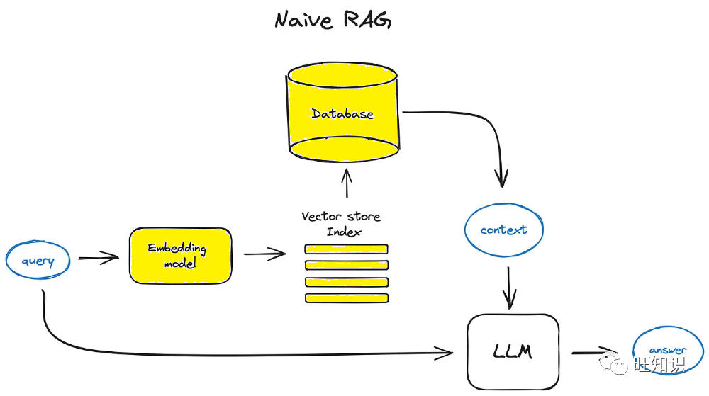
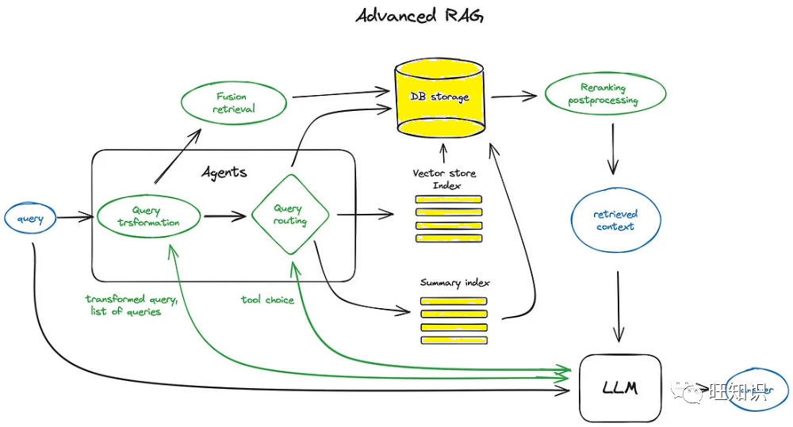
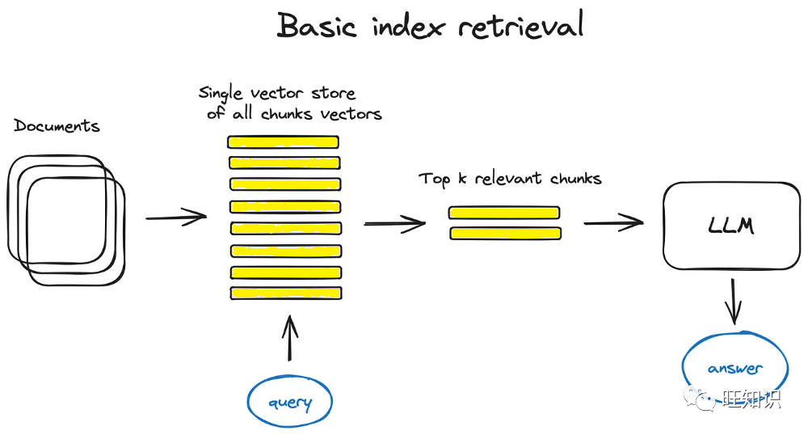
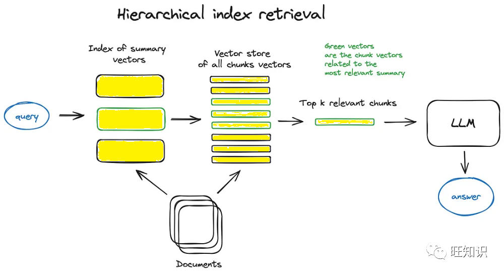
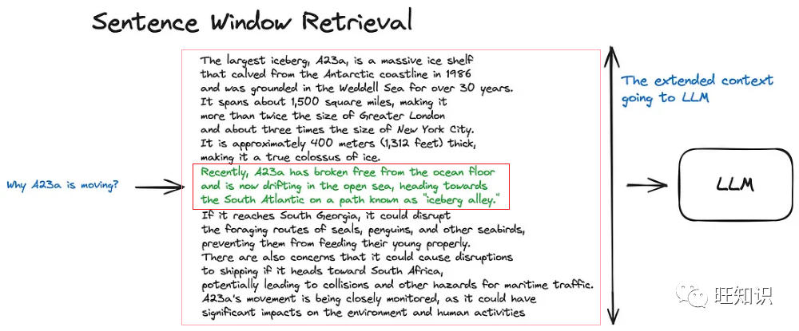
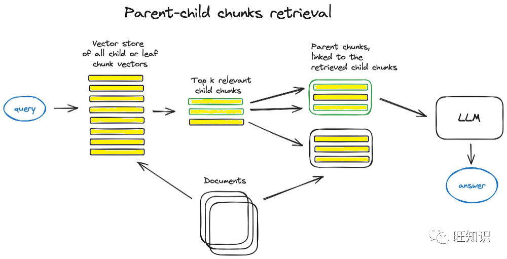
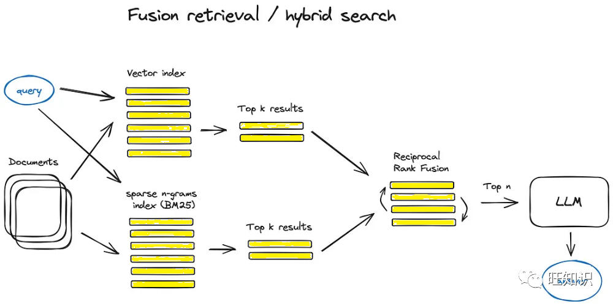
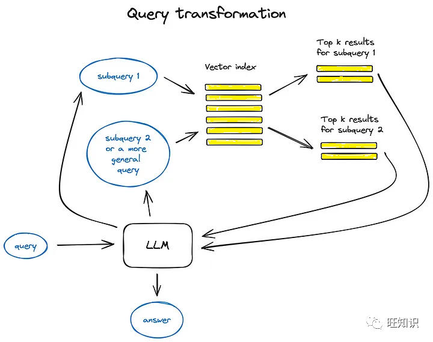
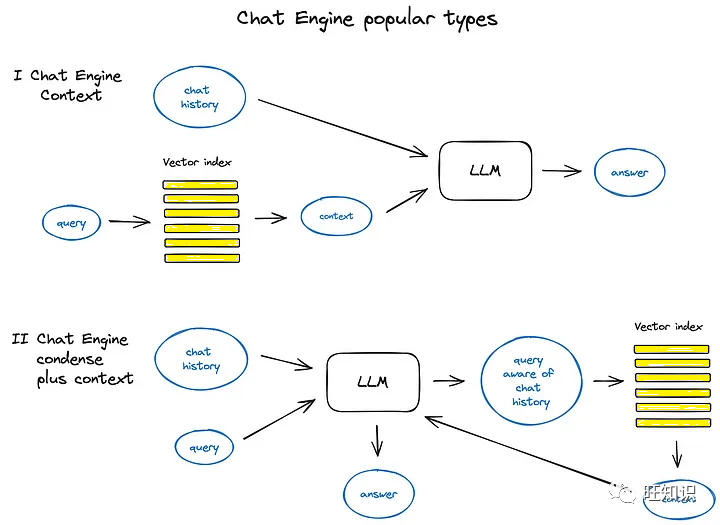
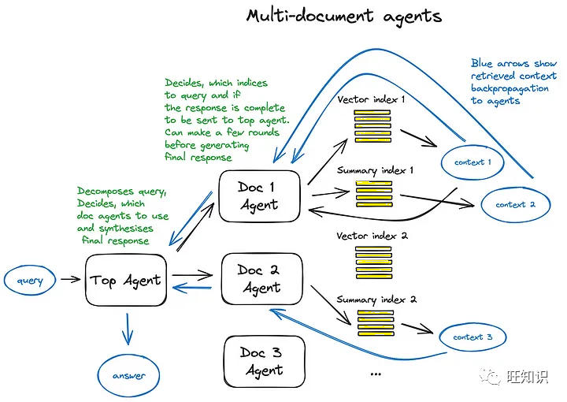

# 高级检索增强生成技术&RAG&全面指南&原理、分块、编码、索引、微调、Agent、展望
* * *

created: 2025-01-24T00:20 updated: 2025-01-26T02:11
---------------------------------------------------

ChatGPT、Midjourney等生成式人工智能（GenAI）在文本生成、文本到图像生成等任务中表现出令人印象深刻的性能。然而，**生成模型也不能避免其固有的局限性，包括产生幻觉的倾向，在数学能力弱，而且缺乏可解释性。**\>因此，提高他们能力的一个可行办法是让他们能够与外部世界互动，以不同的形式和方式获取知识，从而提高所生成内容的事实性和合理性。

\*\*检索增强生成（\*\*\*\*Retrieval-Augmented Generation, RAG）\*\*\*\*技术研究旨在提供更有依据、更依赖事实的信息来帮助解决生成式AI的幻觉倾向、专业力弱等固有缺陷。\*\*RAG最新科研综述可以参考：[万字综述：2023年多模态检索增强生成技术(mRAG)最新进展与趋势-图片、代码、图谱、视频、声音、文本](http://mp.weixin.qq.com/s?__biz=Mzg5NTc2OTcyOQ==&mid=2247487105&idx=1&sn=36b23830782eb0686c88c196514823ac&chksm=c00a036ff77d8a797077ae304332c80c2f1b3227becf5815a4b285f38da84edbe153692190ce&scene=21#wechat_redirect)。

现在已有大多数教程都挑选一种或几种RAG技术并详细解释如何实现它们，而缺少一个对于RAG技术的系统化概述。**本文的目的是想系统化梳理关键的高级RAG技术，并介绍它们的实现，以便于其他开发人员深入研究该技术。**

  
图源：旺知识

作者：张长旺，旺知识

**1 - 检索增强生成(RAG)技术简介**

检索增强生成（又名RAG）为大语言模型提供从某些数据源检索到的信息，作为其生成答案的依据。\*\*RAG通常包括两个阶段：检索上下文相关信息和使用检索到的知识指导生成过程。\*\*基本上，RAG是通过检索算法找到的信息作为上下文，帮助大模型回答用户问询。查询和检索到的上下文都被注入到发送给LLM的提示中。

\*\*>RAG是2023年最流行的基于LLM的系统架构。\*\***有许多产品几乎完全基于RAG构建-从将网络搜索引擎与LLM相结合的问答服务到数百个与数据交互的应用程序。**

矢量搜索领域也受到了RAG火热的推动而进一步提升了重要度。像chroma, weavaite.io, pinecone这样的矢量数据库初创公司都是建立在现有的开源搜索索引（主要是faiss和nmslib）的基础上的最近为输入文本添加了额外的存储空间以及一些其他工具。

基于大模型的的应用程序有多个最著名的开源库，包括LangChain，LlamaIndex，AutoGen, PromptAppGPT等。对于LLM应用开发可以参考如下文章进一步了解：

*   [2023年人工智能体(AI Agent)开发与应用全面调研：概念、原理、开发、应用、挑战、展望](http://mp.weixin.qq.com/s?__biz=Mzg5NTc2OTcyOQ==&mid=2247487471&idx=1&sn=7f4487e7f82f4695bbfbb2bc987074b2&chksm=c00a0201f77d8b17fbb8fb328ce19d50d595d81c112c2ba842453ac89229f4f02e205c338a43&scene=21#wechat_redirect)
    
*   [PromptAppGPT低代码大语言模型应用开发实战：聊天机器人、智能文生图、图文搜索](http://mp.weixin.qq.com/s?__biz=Mzg5NTc2OTcyOQ==&mid=2247486244&idx=1&sn=aef19677bfd7e14e083c4c8042bf30ee&chksm=c00a06caf77d8fdc60c82652be5a496717c3d27b359a23cc8aa1495b39c39e7df0a3f83aab2d&scene=21#wechat_redirect)
    

**2 - 基础\*\*\*\*检索增强生成(RAG)技术**

  
基础RAG流程图。图源：旺知识

基础RAG流程简单来说如下：将文本分割成块，然后使用编码模型将这些块嵌入到向量中，将所有这些向量放入索引中，最后为LLM创建一个提示，告诉模型根据我们在搜索步骤中找到的上下文来回答用户的查询。

**在运行时，我们使用相同的编码器模型对用户的查询进行矢量化，然后针对索引执行该查询向量的搜索，找到前k个结果，从数据库中检索相应的文本块，并将它们作为上下文输入到LLM提示中。**

下面是一个示例提示信息：

```python
def question_answering(context, query):    prompt = f"""                Give the answer to the user query delimited by triple backticks ```{query}```\                using the information given in context delimited by triple backticks ```{context}```.\                If there is no relevant information in the provided context, try to answer yourself,                 but tell user that you did not have any relevant context to base your answer on.                Be concise and output the answer of size less than 80 tokens.                """

    response = get_completion(instruction, prompt, model="gpt-3.5-turbo")    answer = response.choices[0].message["content"]    return answer
```

提示工程是可以尝试改进RAG系统的最便捷便宜的方法。可以参考如下文章了解更多提示工程技巧：

*   [从1000+模板中总结出的10大提示工程方法助你成为提示词大师！](http://mp.weixin.qq.com/s?__biz=Mzg5NTc2OTcyOQ==&mid=2247487125&idx=1&sn=910dd5d016982b78aab7826161fd1c63&chksm=c00a037bf77d8a6db95181343d155ac201d30745ee8ab2b59e906d5c9b4c91ee0221d80677ab&scene=21#wechat_redirect)
    
*   [ChatGPT提示工程师必备基础知识与进阶技巧！](http://mp.weixin.qq.com/s?__biz=Mzg5NTc2OTcyOQ==&mid=2247486302&idx=1&sn=bcc67da04344d1facca58bec928d3740&chksm=c00a06b0f77d8fa6b7851abe762f03995055f55c3f85882e583af35fad45a8b402f2cc63695a&scene=21#wechat_redirect)
    

显然，尽管OpenAI是LLM提供商的市场领导者，但仍有许多替代方案，例如Anthropic的Claude、最近流行的较小但功能强大的模型，例如Mixtral形式的Mistral、Microsoft的Phi-2以及许多开源选项，例如Llama2、OpenLLaMA、Falcon。

**3 - 高级\*\*\*\*检索增强生成(RAG)技术**

现在我们将深入了解高级RAG技术的核心步骤和所涉及算法。为了保持方案的可读性，我们省略了一些逻辑循环和复杂的多步骤代理行为。

  
高级RAG的些关键流程图。图源：旺知识

方案图中的绿色元素是进一步讨论的核心RAG技术，蓝色元素是文本。并非所有先进的RAG技术都可以在单个方案中轻松可视化，例如，省略了各种上下文放大方法，不过，我们将在文中深入探讨这些技术。

**3.1 - 分块和矢量化**

首先，我们要创建一个向量索引，表示我们的文档内容，然后在运行时搜索所有这些向量与对应于最接近语义的查询向量之间的最小余弦距离。

**3.1.1 - 分块**

Transformer模型具有固定的输入序列长度，即使输入上下文窗口很大，一个或几个句子的向量也比几页文本的平均向量更好地表示其语义，因此需要对数据进行分块。\*\*分块将初始文档分割成一定大小的块，尽量不要失去语义含义，将文本分割成句子或段落，而不是将单个句子分成两部分。\*\*有多种文本分割器实现能够完成此任务。

**块的大小是一个需要考虑的重要参数**\-它取决于您使用的嵌入模型及其令牌容量，标准转换器编码器模型（例如基于BERT的句子转换器）最多需要512个令牌。OpenAI ada-002能够处理更长的序列，如8191个标记，但**这里就需要权衡是留有足够的上下文供大语言模型进行推理，还是留足够具体的文本表征以便有效地执行检索。**

例如，在语义搜索中，我们对文档语料库进行索引，每个文档都包含有关特定主题的有价值的信息。通过应用有效的分块策略，我们可以确保我们的搜索结果准确地捕捉用户查询的本质。如果我们的块太小或太大，可能会导致搜索结果不精确或错过显示相关内容的机会。**根据经验，如果文本块在没有周围上下文的情况下对人类有意义，那么它对语言模型也有意义。因此，找到语料库中文档的最佳块大小对于确保搜索结果的准确性和相关性至关重要。**

另一个例子是会话Agent。我们使用嵌入的块根据知识库为会话Agent构建上下文，该知识库使Agent基于可信信息。在这种情况下，对我们的分块策略做出正确的选择很重要，原因有两个：首先，它将确定上下文是否确实与我们的提示相关。其次，考虑到我们可以为每个请求发送的令牌数量的限制，它将确定我们是否能够在将检索到的文本发送到外部模型提供商（例如 OpenAI）之前将其放入上下文中。在某些情况下，例如在 32k 上下文窗口中使用 GPT-4 时，拟合块可能不是问题。**尽管如此，我们需要注意何时使用非常大的块，因为这可能会对检索结果的相关性产生不利影响。**

**a. 分块因素**

有几个因素在确定最佳分块策略方面发挥着作用，这些变量根据用例而变化，以下是需要关注的一些关键方面：

*   \*\*被索引的内容的性质是什么？\*\*您是否正在处理长文档（例如文章或书籍）或较短的内容（例如推文或即时消息）？答案将决定哪种模型更适合您的目标，以及应用哪种分块策略。
*   \*\*您使用哪种嵌入模型，它在什么块大小上表现最佳？\*\*例如，句子转换器模型在单个句子上效果很好，但像text-embedding-ada-002这样的模型在包含256或512个标记的块上表现更好。
*   \*\*您对用户查询的长度和复杂性有何期望？\*\*它们会简短而具体，还是长而复杂？这也可能会告诉您选择对内容进行分块的方式，以便嵌入式查询和嵌入式块之间有更紧密的相关性。
*   \*\*检索到的结果将如何在您的特定应用程序中使用？\*\*例如，它们会用于语义搜索、问答、摘要或其他目的吗？例如，如果您的结果需要输入到具有令牌限制的另一个LLM中，您必须考虑到这一点，并根据您想要适应请求的块数量来限制块的大小。

回答这些问题将使您能够开发一种平衡性能和准确性的分块策略，这反过来又将确保查询结果更相关。

**b - 分块方法**

分块的方法有多种，每种方法可能适合不同的情况。通过检查每种方法的优点和缺点，我们的目标是确定应用它们的正确场景。

**b.1 - 固定大小分块**

这是最常见、最直接的分块方法：我们只需决定块中的标记数量，以及可选地确定它们之间是否应该有重叠。\*\*一般来说，我们希望在块之间保留一些重叠，以确保语义上下文不会在块之间丢失。在大多数常见情况下，固定大小的分块将是最佳路径。\*\*与其他形式的分块相比，固定大小的分块计算成本低且易于使用，因为它不需要使用任何NLP库。

下面是使用LangChain执行固定大小分块的示例：

text = "..." # your textfrom langchain.text\_splitter import CharacterTextSplittertext\_splitter = CharacterTextSplitter( separator = "\\n\\n", chunk\_size = 256, chunk\_overlap = 20)docs = text\_splitter.create\_documents(\[text\])

**b.2 - 内容感\*\*\*\*知分块**

这种方法利用我们正在分块的内容的性质并对其应用更复杂的分块的一组方法。这里有些例子：

\*\*句子分块：\*\*正如我们之前提到的，许多模型都针对嵌入句子级内容进行了优化。当然，我们会使用句子分块，并且有多种方法和工具可用于执行此操作，包括：

*   \*\*直接分割：\*\*最直接的方法是按句点（“.”）和换行符分割句子。虽然这可能快速且简单，但这种方法不会考虑所有可能的边缘情况。这是一个非常简单的例子：

text = "..." # your textdocs = text.split(".")

*   \*\*NLTK：\*\*自然语言工具包(NLTK)是一个流行的Python库，用于处理人类语言数据。它提供了一个句子标记器，可以将文本分割成句子，帮助创建更有意义的块。例如，要将NLTK与LangChain结合使用，可以执行以下操作：

text = "..." # your textfrom langchain.text\_splitter import NLTKTextSplittertext\_splitter = NLTKTextSplitter()docs = text\_splitter.split\_text(text)

*   spaCy：spaCy是另一个用于NLP任务的强大Python库。它提供了复杂的句子分割功能，可以有效地将文本分割成单独的句子，从而在生成的块中更好地保留上下文。例如，要将spaCy与LangChain结合使用，可以执行以下操作：

text = "..." # your textfrom langchain.text\_splitter import SpacyTextSplittertext\_splitter = SpaCyTextSplitter()docs = text\_splitter.split\_text(text)

\*\*递归分块：\*\*递归分块使用一组分隔符以分层和迭代的方式将输入文本划分为更小的块。如果分割文本的初始尝试没有生成所需大小或结构的块，则该方法会使用不同的分隔符或标准在生成的块上递归调用自身，直到达到所需的块大小或结构。这意味着虽然块的大小不会完全相同，但它们仍然“渴望”具有相似的大小。

以下是如何在LangChain中使用递归分块的示例：

```python
text = "..." # your textfrom langchain.text_splitter import RecursiveCharacterTextSplittertext_splitter = RecursiveCharacterTextSplitter(    # Set a really small chunk size, just to show.    chunk_size = 256,    chunk_overlap  = 20)

docs = text_splitter.create_documents([text])
```

\*\*专门分块：\*\*Markdown和LaTeX是可能遇到的结构化和格式化内容的两个示例。在这些情况下，可以使用专门的分块方法在分块过程中保留内容的原始结构。

*   \*\*Markdown：\*\*Markdown是一种轻量级标记语言，通常用于格式化文本。通过识别Markdown语法（例如标题、列表和代码块），您可以根据内容的结构和层次结构智能地划分内容，从而产生语义上更连贯的块。例如：

```python
from langchain.text_splitter import MarkdownTextSplittermarkdown_text = "..."

markdown_splitter = MarkdownTextSplitter(chunk_size=100, chunk_overlap=0)docs = markdown_splitter.create_documents([markdown_text])
```

*   \*\*LaTex：\*\*LaTeX是一种文档准备系统和标记语言，常用于学术论文和技术文档。通过解析LaTeX命令和环境，可以创建尊重内容逻辑组织的块（例如，部分、小节和方程），从而获得更准确且与上下文相关的结果。例如：

from langchain.text\_splitter import LatexTextSplitterlatex\_text = "..."latex\_splitter = LatexTextSplitter(chunk\_size=100, chunk\_overlap=0)docs = latex\_splitter.create\_documents(\[latex\_text\])

\*\*c -\*\***分块优化**

如果常见的分块方法（例如固定分块）无法轻松应用于用例，那么这里有一些提示可以帮助您找到最佳的分块大小。

*   \*\*预处理数据：\*\*在确定应用程序的最佳块大小之前，您需要首先预处理数据以确保质量。例如，如果您的数据是从网络检索的，您可能需要删除HTML标签或只会增加噪音的特定元素。
*   \*\*选择块大小范围：\*\*数据经过预处理后，下一步是选择要测试的潜在块大小范围。如前所述，选择应考虑内容的性质（例如，短消息或冗长的文档）、您将使用的嵌入模型及其功能（例如，令牌限制）。目标是在保留上下文和保持准确性之间找到平衡。首先探索各种块大小，包括用于捕获更精细语义信息的较小块（例如，128或256个标记）和用于保留更多上下文的较大块（例如，512或1024个标记）。
*   \*\*评估每个块大小的性能：\*\*为了测试各种块大小，您可以使用多个索引或具有多个命名空间的单个索引。使用代表性数据集，为要测试的块大小创建嵌入并将它们保存在索引中。然后，您可以运行一系列查询，可以评估其质量，并比较不同块大小的性能。这很可能是一个迭代过程，您可以针对不同的查询测试不同的块大小，直到可以确定内容和预期查询的最佳性能块大小。

在大多数情况下，对内容进行分块非常简单-但当您开始偏离常规时，它可能会带来一些挑战。没有一种万能的分块解决方案，因此适用于一种用例的方法可能不适用于另一种用例。希望这篇文章能够帮助您更好地了解如何为应用程序进行分块。

**3.1.2 矢量化**

下一步是选择一个模型来嵌入我们的块，有很多选项，我选择针对搜索优化过的模型，如bge-large或E5嵌入系列。这里可以参考MTEB排行榜以获取最新模型效果：

```python
https://huggingface.co/spaces/mteb/leaderboard
```

对于分块和矢量化步骤的端到端实现，可以参考查看LlamaIndex中完整数据摄取管道的示例：

```python
https://docs.llamaindex.ai/en/latest/module_guides/loading/ingestion_pipeline/root.html
```

**3.2 - 搜索索引**

**3.2.1 - 向量存储索引**

  
基本索引检索流程图。图源：旺知识

RAG流程的关键部分是搜索索引，她用于存储在上一步中获得的矢量化内容。最简单的实现使用平面索引—遍历查询向量和所有块向量之间的距离。**Faiss、nmslib、annoy等使用一些近似最近邻实现（如聚类、树或HNSW算法）来提升检索效率，实现在\*\*\*\*10000多个元素尺度上进行有效索引和检索。**

同时还有OpenSearch或ElasticSearch等托管解决方案以及矢量数据库，例如Pinecone、Weaviate或Chroma，负责在后台处理数据摄取管道。

根据索引选择、数据和搜索需求，还可以将元数据与向量一起存储，然后使用元数据过滤器来搜索某些日期或来源内的信息。

LlamaIndex支持大量向量存储索引，但也支持其他更简单的索引实现，例如列表索引、树索引和关键字表索引。

**3.2.2 - 层次索引**

  
层次索引流程图。图源：旺知识

如果有许多文档需要检索，就需要能够有效地在其中进行检索，找到相关信息并将其综合到一个答案中并给出参考来源。**在大型数据库的情况下，一种有效的方法是创建两个索引—一个由摘要组成，另一个由文档块组成，并分两步检索，首先通过摘要过滤掉相关文档，然后只在这个相关组内检索。**

**3.2.3 - 假设问题和HyDE**

**另一种方法是要求LLM为每个块生成一个问题并将这些问题嵌入向量中，在运行时针对该问题向量索引执行查询检索（用索引中的问题向量替换块向量），然后在检索后路由到原始数据文本块并将它们作为上下文发送给LLM以获得答案。**

与实际块相比，查询和假设问题之间的语义相似性更高，因此这种方法提高了搜索质量。

**还有一种称为HyDE的反向逻辑方法-要求LLM根据给定的查询生成假设的响应，然后使用其向量和查询向量来提高检索质量。**

**3.2.4 - 上下文丰富**

这里的概念是检索较小的块以获得更好的搜索质量，但添加周围的上下文供LLM进行推理。有两种选择：通过围绕较小检索块的句子来扩展上下文，或者将文档递归地拆分为多个包含较小子块的较大父块。

**a - 句子窗口检索**

在该方案中，文档中的每个句子都是单独嵌入的，这为上下文余弦距离搜索的查询提供了很高的准确性。**为了在获取最相关的单个句子后更好地对找到的上下文进行推理，我们将上下文窗口在检索到的句子之前和之后扩展了k个句子，然后将此扩展的上下文发送给LLM。**

  
句子窗口检索。图源：旺知识

绿色部分是在索引中搜索时找到的句子嵌入，整个黑色+绿色段落被馈送到LLM以扩大其上下文，同时根据所提供的查询进行推理。

**b - 自动合并检索器（又名父文档检索器）**

这里的想法与句子窗口检索器非常相似—搜索更细粒度的信息，然后扩展上下文窗口，然后将所述上下文提供给LLM进行推理。文档被分割成较小的子块，引用较大的父块。

  
父子块检索。图源：旺知识

文档被分成块的层次结构，然后最小的叶块被发送到索引。在检索时，我们检索k个叶子块，如果有n个块引用同一父块，我们用该父块替换它们并将其发送到LLM进行答案生成。

首先在检索期间获取较小的块，然后如果前k个检索到的块中超过n个块链接到同一父节点（较大的块），我们将通过该父节点替换馈送到LLM的上下文-工作原理类似于自动合并一些检索到的块块合并成一个更大的父块，因此得名方法。请注意-搜索仅在子节点索引内执行。

**3.2.5 - 融合检索或混合搜索**

一个自然的想法是，可以充分利用两个世界的优点—基于关键字的老式搜索—稀疏检索算法（如tf-idf或搜索行业标准BM25）和现代语义或向量搜索，并将其组合到一个检索结果中。

这里唯一的技巧是将检索到的结果与不同的相似度分数正确地结合起来—这个问题通常是借助Reciprocal Rank Fusion (RRF)算法来解决的，对检索到的结果进行重新排序以获得最终输出。

  
融合检索。图源：旺知识

在LangChain中，这是在Ensemble Retriever类中实现的，结合了定义的检索器列表，例如Faiss矢量索引和基于BM25的检索器，并使用RRF算法进行重新排名。在LlamaIndex中，也是以非常相似的方式完成的。

**混合或融合搜索通常会提供更好的检索结果，因为结合了两种互补的搜索算法，同时考虑了查询与存储文档之间的语义相似性和关键字匹配。**

**3.3 - 重新排序和过滤**

使用上述任何算法都得到了检索结果，现在需要通过过滤、重新排序或某种转换来优化它们。在LlamaIndex中，有多种可用的后处理器，可以根据相似度得分、关键词、元数据过滤结果，或者使用LLM等其他模型对结果进行重新排名，句子转换器交叉编码器，Cohere重排序端点或者基于日期新近度等元数据。

现在是时候学习更复杂的RAG技术了，比如查询转换和路由，它们都涉及LLM，从而代表Agent行为，涉及复杂的逻辑，涉及RAG管道中的LLM推理。

**3.4 - 查询转换**

查询转换是一系列使用LLM作为推理引擎来修改用户输入以提高检索质量的技术。有不同的选择可以做到这一点。

  
查询转换原理图解。图源：旺知识

如果查询很复杂，可以将其分解为多个子查询。例如，如果你问：

“LangChain或LlamaIndex哪个框架在Githu上拥有更多星星？”

并且我们不太可能在语料库中的某些文本中找到直接比较，因此在两个子查询中分解这个问题是有意义的，假设更简单和更具体的信息检索：

*   “LangChain在Github上有多少颗星？”
*   “LlamaIndex在Github上有多少颗星？”

它们将并行执行，然后将检索到的上下文合并到一个提示中，供LLM合成初始查询的最终答案。这两个库都实现了此功能-作为LangChain中的多查询检索器和LlamaIndex中的子问题查询引擎。

*   \*\*后退提示(Step-back prompting)：\*\*使用LLM生成更通用的查询，并检索我们获得更通用或高级上下文的内容，这些上下文有助于为原始查询提供答案。还执行原始查询的检索，并且在最终答案生成步骤中将两个上下文馈送到 LLM。
*   \*\*查询重写：\*\*使用LLM重新制定初始查询以改进检索。LangChain和LlamaIndex都有实现，只是有点不同，我发现LlamaIndex解决方案在这里更强大。

**参考文献引用**

这个没有数字，因为它更像是一种工具，而不是检索改进技术，尽管这是一个非常重要的技术。如果我们使用多个源来生成答案，要么是由于初始查询的复杂性（我们必须执行多个子查询，然后将检索到的上下文合并到一个答案中），要么是因为我们在各种文档中找到了单个查询的相关上下文，问题是我们是否能够准确地回溯我们的来源。有几种方法可以做到这一点：

*   **将此引用任务插入到我们的提示中**，并要求LLM提及所用来源的ID。
*   **将生成的响应部分与索引中的原始文本块进行匹配**\-LlamaIndex针对这种情况提供了一种基于模糊匹配的高效解决方案。如果您还没有听说过模糊匹配，这是一种非常强大的字符串匹配技术。

**3.5 - 聊天引擎**

构建一个可以针对单个查询多次工作的优秀RAG系统的下一个重要事项是聊天逻辑，考虑到对话上下文，与LLM时代之前的经典聊天机器人相同。

这需要支持与先前对话上下文相关的后续问题、照应或任意用户命令。它将聊天上下文与用户查询一起考虑在内，通过查询压缩技术来解决。

有几种方法可以实现上下文压缩：

*   **一个流行且相对简单的ContextChatEngine**，首先检索与用户查询相关的上下文，然后将其与内存缓冲区中的聊天历史记录一起发送给LLM，以便LLM在生成下一个答案时了解先前的上下文。
*   **更复杂的情况是CondensePlusContextMode**—在每次交互中，聊天历史记录和最后一条消息都会压缩为一个新查询，然后该查询转到索引，检索到的上下文与原始用户消息一起传递给LLM，以生成一个回答。

不同聊天引擎类型和原理。图源：旺知识

还有其他聊天引擎类型，例如ReActAgent，但让我们在第3.7节中说明。

**3.6 - 查询路由**

查询路由是LLM支持的决策步骤，根据给定的用户查询下一步该做什么，选项通常是总结、针对某些数据索引执行搜索或尝试多种不同的路由，然后将其输出综合到单一答案。

查询路由器还用于选择索引或更广泛的数据存储，将用户查询发送到何处-要么您有多个数据源，例如经典向量存储和图形数据库或关系数据库，要么您有索引的层次结构-对于多文档存储，一个非常经典的情况是摘要索引和文档块向量的另一个索引。

路由选项的选择是通过LLM调用执行的，以预定义的格式返回其结果，用于将查询路由到给定的索引，或者，如果我们采用父系行为，则路由到子链甚至其他Agent如节的多文档代理方案所示。LlamaIndex和LangChain都支持查询路由器。

**3.7 - RAG中的Agent**

Agent几乎自第一个LLM API发布以来就已经存在了，其想法是提供一个能够推理的LLM，并提供一组工具和一个要完成的任务。这些工具可能包括一些确定性函数，例如任何代码函数或外部API甚至其他Agent，这种LLM链思想就是LangChain名称的由来。

Agent本身就是一件大事，不可能在RAG概述中对这个主题进行足够深入的研究，感兴趣深入理解可以参考如下文章：

*   [2023年人工智能体(AI Agent)开发与应用全面调研：概念、原理、开发、应用、挑战、展望](http://mp.weixin.qq.com/s?__biz=Mzg5NTc2OTcyOQ==&mid=2247487471&idx=1&sn=7f4487e7f82f4695bbfbb2bc987074b2&chksm=c00a0201f77d8b17fbb8fb328ce19d50d595d81c112c2ba842453ac89229f4f02e205c338a43&scene=21#wechat_redirect)
    
*   [万字综述：大语言模型驱动智能体(LLM Agent)进展与潜力 By 复旦+米哈游](http://mp.weixin.qq.com/s?__biz=Mzg5NTc2OTcyOQ==&mid=2247486743&idx=1&sn=e7e78ed9832bee8c476e39056ddfea2a&chksm=c00a00f9f77d89eff5abfbd44183b89013fd36fd741f05dd22b7878db5bf662f0be7cba0371b&scene=21#wechat_redirect)
    

这里我们将继续基于Agent的多文档检索案例描述的RAG系统的底层工作。Open AI Assistants基本上已经实现了我们之前在开源中拥有的LLM所需的许多工具：聊天记录、知识存储、文档上传接口，以及也许最重要的函数调用API。

在LlamaIndex中，有一个OpenAIAgent类将这种高级逻辑与ChatEngine和QueryEngine类结合起来，提供基于知识和上下文感知的聊天，以及在一个对话轮中调用多个OpenAI函数的能力，这真正带来了智能Agent行为。

让我们看一下多文档Agent方案，它涉及在每个文档上初始化代理（OpenAIAgent），能够进行文档摘要和经典的QA机制，以及一个顶级Agent，负责将查询路由到文档代理并用于最终答案合成。

每个文档Agent都有两个工具-向量存储索引和摘要索引，并根据路由查询决定使用哪一个。而对于顶层Agent来说，所有的文件Agent都尊称是工具。

该方案展示了一种先进的RAG架构，其中包含每个相关Agent做出的大量路由决策。这种方法的好处是能够比较不同文档中描述的不同解决方案或实体及其摘要以及经典的单文档摘要和QA机制-这基本上涵盖了最常见的与文档集合聊天的用例。



多文档Agent的方案，涉及查询路由和代理行为模式。图源：旺知识

这种复杂方案的缺点可以从图片中猜到，由于我们Agent内部使用LLM进行了多次来回迭代，它有点慢。以防万一，LLM调用始终是RAG管道中最长的操作，搜索在设计上针对速度进行了优化。因此，对于大型多文档存储，我们建议对该方案进行一些简化，使其具有可扩展性。

**3.8 - 响应合成器**

这是任何RAG管道的最后一步-根据我们仔细检索的所有上下文和初始用户查询生成答案。最简单的方法是将所有获取的上下文（高于某个相关阈值）与查询一起连接并立即提供给LLM。

但是，与往常一样，还有其他更复杂的选项，涉及多个LLM调用，以细化检索到的上下文并生成更好的答案。

响应合成的主要方法包括：

*   1.通过将检索到的上下文逐块发送到LLM来迭代地细化答案
*   2.总结检索到的上下文以适应提示
*   3.根据不同的上下文块生成多个答案，然后将它们连接或总结。

更多详细信息，可以参考响应合成器模块文档：

```python
https://docs.llamaindex.ai/en/stable/module_guides/querying/response_synthesizers/root.html
```

**4 - RAG系统模型微调**

RAG系统涉及多个模型，可以考虑对它们进行微调：

*   \*\*编码器模型(Transformer)：\*\*负责内容向量编码，从而负责上下文检索质量
    
*   \*_大语_\*\*\*言模型(LLM)：\*\*负责最好地使用所提供的上下文来回答用户查询
    
*   \*\*排序器(Ranker)：\*\*负责对检索结果排序优选
    

如今的一大优势是可以使用GPT-4等高端LLM来生成高质量的合成数据集。但应该始终意识到，采用由专业研究团队在仔细收集、清理和验证的大型数据集上训练的开源模型，并使用小型合成数据集进行快速调整可能会缩小模型的总体能力。

**4.1 - 编码器微调**

我们在LlamaIndex设置中测试了通过微调bge-large-en-v1.5（撰写本文时MTEB排行榜前4名）带来的性能提升，结果显示检索质量提高了2%。没什么戏剧性的，但很高兴有这个选项，特别是如果你有构建RAG的领域数据集。

**4.2 - 排序器微调**

另一个好的选项是如果您不完全信任基本编码器，则可以对检索到的结果进行重新排名。

它的工作方式如下：将查询和检索到的前k个文本块传递给交叉编码器，并用SEP令牌分隔，并将其微调为输出1表示相关块，输出0表示不相关。

结果表明，通过交叉编码器微调，成对分数(pairwise)提高了4%，这里可以找到这种调整过程的一个很好的例子：

```python
https://docs.llamaindex.ai/en/latest/examples/finetuning/cross_encoder_finetuning/cross_encoder_finetuning.html
```

**4.3 - LLM微调**

最近OpenAI开始提供LLM微调API，LlamaIndex有一个关于在RAG设置中微调GPT-3.5-turbo的教程，以“提炼”一些GPT-4知识。这里的想法是拿一份文档，用GPT-3.5-turbo生成一些问题，然后使用GPT-4根据文档内容生成这些问题的答案（构建一个由GPT4驱动的RAG管道），然后进行细化-在该问答对数据集上调整GPT-3.5-turbo。用于RAG管道评估的ragas框架显示忠实度指标增加了5%，这意味着经过微调的GPT3.5-turbo模型比原始模型更好地利用提供的上下文来生成答案。

最近的论文RA-DIT：MetaAIResearch的检索增强双指令调整中演示了一种更复杂的方法，提出了一种同时调整LLM和Retriever的技术，优化关于查询、上下文和答案的三元组。具体实现方式请参考本指南:

```python
https://docs.llamaindex.ai/en/stable/examples/finetuning/knowledge/finetune_retrieval_aug.html#fine-tuning-with-retrieval-augmentation
```

该技术用于通过微调API和Llama2开源模型（在原始论文中）对OpenAI LLM进行微调，从而使知识密集型任务指标增加约5%（与带有RAG的Llama265B相比）常识推理任务也增加了几个百分点。

**5 - RAG系统评估**

RAG系统性能评估有多个框架，它们共享一些独立指标的想法，例如总体答案相关性、答案基础性、忠实性和检索到的上下文相关性。上一节提到的Ragas使用忠实度和答案相关性作为生成的答案质量指标，并使用经典的上下文精确度和召回率作为RAG方案的检索部分。

在AndrewNG、LlamaIndex和评估框架Truelens最近发布的优秀短期课程《构建和评估高级RAG》中，他们提出了RAG三元组——检索到的与查询的上下文相关性、接地性（LLM答案在多大程度上受所提供的上下文支持）并回答与查询相关的问题。

**关键和最可控的指标是检索到的上下文相关性。**上述高级RAG技术的第3.1-3.7部分加上编码器和Ranker微调部分旨在改进该指标，而第3.8部分和LLM微调则注重**回答相关性(relevance)和事实性(groundedness)。**

可以在此处找到一个非常简单的检索器评估管道的好示例，并将其应用于编码器微调部分：[https://github.com/run-llama/finetune-embedding/blob/main/evaluate.ipynb](https://github.com/run-llama/finetune-embedding/blob/main/evaluate.ipynb)

OpenAI演示了一种更先进的方法，不仅考虑命中率，还考虑平均倒数排名（一种常见的搜索引擎指标）以及生成的答案指标（例如忠实度和相关性）。

LangChain有一个非常先进的评估框架LangSmith，可以在其中实现自定义评估器，并且它监视RAG管道内运行的跟踪，以使您的系统更加透明。

如果您使用LlamaIndex进行构建，可以使用rag\_evaluator llama包，它提供了一个使用公共数据集评估管道的快速工具。

**6 - 总结展望**

我们试图系统化梳理RAG的核心方法，并举例说明其中的一些方法，希望这可能会激发一些新颖的思路，以便在RAG系统中进行探索。

  
图源：旺知识

还有很多其他事情需要考虑，比如基于网络搜索的RAG(由LlamaIndex、webLangChain等提供的RAG)、深入研究代理架构以及关于LLM长期记忆的一些想法。

除了答案相关性(relevance) 和忠实性(faithfulness)之外，RAG系统的主要生产挑战是速度，特别基于更灵活的Agent方案的RAG系统。ChatGPT和大多数其他助手使用的这种流媒体回复仅仅是一种缩短感知答案生成时间的方法。**这就是为什么我们看到较小的LLM也有一个非常光明的未来，最近发布的Mixtral和Phi-2正在引领我们朝这个方向发展。**