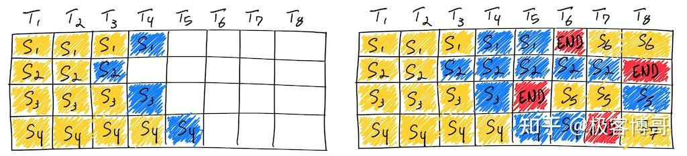

# LLM&推理优化&Continuous&Batching&及其实现
> _**作者: 极客博哥**_
> 
> _**原文:**_ [_**https://zhuanlan.zhihu.com/p/19696795081**_](https://zhuanlan.zhihu.com/p/19696795081)

**原理**
------

Continuous Batching 是 LLM 推理优化的一项技术，作为这篇文章的知识背景不再赘述，目前流传最广的参考资料是这篇：《[How continuous batching enables 23x throughput in LLM inference while reducing p50 latency](https://link.zhihu.com/?target=https%3A//www.anyscale.com/blog/continuous-batching-llm-inference)》。它也有中文翻译，感兴趣可以搜一下，先看看。

> 图片来自：Anyscale 博客

虽然这篇资料介绍了它的主要原理，尤其是这张简单易懂的图，但是实现与原理是存在差异的，因为工程实现要解决很多现实问题。

**(Re)scheduling 开销**
---------------------

如原文所说，Continuous batching 还有个别名，叫做：batching with iteration-level scheduling，这里的 iteration 就是指一次 decode 计算。也就是说在每次 decode 的迭代过程中，做 batch 的调度调整。

但调度本身不是无代价的，它可能涉及到接收和处理新的输入请求，重新组织输入数据的形状，甚至各种状态的重新初始化，这些都需要消耗 CPU 时间。这也就意味着在这段时间里，GPU 是闲着的，GPU 没有得到充分利用。

所以在实现时，程序并不会真的每个 iteration 都做 scheduling，目前看到有两种做法：

*   合理间隔调度。比如每 16 次 decode 计算后，检查一下是否有新的输入，以及是否有空闲的槽位，然后对 batch 做一次调度调整。这能够显著降低调度的开销（[TGI](https://link.zhihu.com/?target=https%3A//github.com/huggingface/text-generation-inference/blob/f59fb8b630844c2ad2cd80e689202de89d45c37e/launcher/src/main.rs%23L182)、[lmdeploy](https://link.zhihu.com/?target=https%3A//github.com/InternLM/lmdeploy/blob/70c0b1f99ae4eec0404818421d4098abad217490/lmdeploy/messages.py%23L154)、[vLLM](https://link.zhihu.com/?target=https%3A//github.com/vllm-project/vllm/blob/0739b1947f4081b0edafc7951134a928e39302e7/vllm/config.py%23L541)）。
*   排队比例调度。比如当前 batch 中有 10 个请求的 decode 正在进行，而排队中有 12 个请求，超过了排队比例 1.2，那么就启动一次调度调整（[TGI](https://link.zhihu.com/?target=https%3A//github.com/huggingface/text-generation-inference/blob/f59fb8b630844c2ad2cd80e689202de89d45c37e/launcher/src/main.rs%23L135)）。

**KV Cache 重读**
---------------

如果真的像图中那样，每个生成 Token 的 decode iteration 与一个 prompt token 的计算对齐，那 KV Cache 的利用就会很糟糕。因为它们需要在 Global Memory 与 Shared Memory 之间反复搬运，而且每次搬进来以后只被使用一次。

这本质上是 prefill 阶段（prompt 计算）与生成阶段的计算特性不同导致的，prefill 阶段并不适合 one-by-one 的 token 计算。

所以在实现时，程序并不会真的做 prefill 和生成的 token 对齐调度。目前看到的调度方法有三种：

*   在重调度时，如果有新的请求进来，那么将新请求的 prefill 计算和要进行的 decode 计算做合并（Orca、[vLLM-prev](https://link.zhihu.com/?target=https%3A//github.com/vllm-project/vllm/pull/658)）。
*   在重调度时，如果有新的请求进来，那么先对新的请求做 prefill 计算，然后再合并所有进行中的请求做 decode 计算（TGI、vLLM、lmdeploy）。
*   先根据 decode 耗时估算出来每次 decode 同时能做 prefill 的 token 数量，在重调度时，如果有新的请求进来，对新请求的 [prefill](https://zhida.zhihu.com/search?content_id=252961725&content_type=Article&match_order=7&q=prefill&zhida_source=entity) 按照上面的估算进行分块，然后将分块的 prefill 和其它请求的 decode 计算融合在一起，一定程度上减少了 KV Cache 重读的次数，又避免先做 prefill 计算带来的 Token 生成延时增加（[Sarathi-Serve+vLLM](https://link.zhihu.com/?target=https%3A//github.com/vllm-project/vllm/issues/3130)）。

**可调优能力**
---------

LLM 推理服务往往用于生产环境，而生产环境面临的情况是复杂多样的。

*   对于做阅读理解的应用来说，Prompt 可能会非常长，但生成的内容可能会非常短，开发人员可能会更追求吞吐；
*   对于聊天应用来说，Prompt 可能较短，生成的内容也不会太长，开发人员可能会更追求延迟；
*   对于创作类应用来说，Prompt 可能很短，生成的内容会更长，开发人员可能会更追求首 Token 延迟。

对 Continuous Batching 实现来说，就要求它调度策略尽量清晰，并且参数可调。所以更灵活的实现，未来可能会更受欢迎。