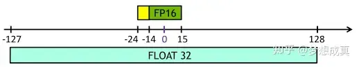
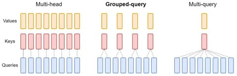
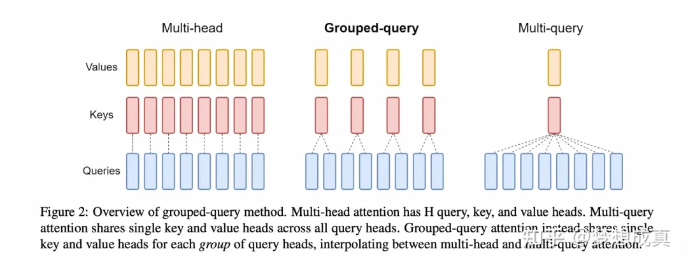

# LLM&推理加速方式汇总
> [https://mp.weixin.qq.com/s/pDKuXs79xPJcE5jGRZ1S\_A](https://mp.weixin.qq.com/s/pDKuXs79xPJcE5jGRZ1S_A)

**前言**

LLM参数一般都是1.5B，3B，7B，13B甚至更大，远大于CV的主流模型。并且随着ChatGPT爆火，基本上现在的LLM都是围绕decoder-only的next token prediction形式，推理预测方式相对比较固定，本文介绍下LLM 若干推理加速方式。

**总览**

总的来说，我的调研中，有如下几种方式可以提高LLM推理的速度

1.  量化
2.  模型结构改进
3.  Dynamic batch
4.  投机（Speculative） 推理

**量化**

几乎在每一个LLM的公开repo中都能看到作者团队release了不同大小的量化模型，这是因为量化是一种非常有效的加速LLM推理，并且减少显存占用的方式。

**数值类型**

讲量化之前，有必要带大家重温一下数值类型。如果你觉得不重要，你完全可以跳过到下一个章节 ，你只需要记住LLM的训练和推理要尽量使用BF16，而不是FP16，HF16，FP32就行了。

这里**主要区分 FP32 、FP16 和BF16**。这些是LLM在训练推理过程常见的三种类型，至于INT8，INT4比较好理解，这里就不过多介绍了。

1.  FP32 是单精度浮点数，用8bit 表示指数，23bit 表示小数；
2.  FP16半精度浮点数，用5bit 表示指数，10bit 表示小数；
3.  BF16是对FP32单精度浮点数截断数据，即用8bit 表示指数，7bit 表示小数。

所以FP16和BF16都是两个字节（B），占用大小是一致的。表格总结以上就是：

| \>Format | \>Bits | \>Exponent | \>Fraction |
| --- | --- | --- | --- |
| \>FP32 | \>32 | \>8 | \>23 |
| \>FP16 | \>16 | \>5 | \>10 |
| \>BF16 | \>16 | \>8 | \>7 |

\*\*其中，fp16是intel提出的，bf16是nvidia提出的。\*\*动态范围是：

| \>Format | \>Range（E表示10的多少次方） | \>有效位数 | \>二进制最小 | \>二进制最大 |
| --- | --- | --- | --- | --- |
| \>FP32 | \>1.4E-45～3.40E38 | \>7 |     |     |
| \>FP16 | \>5.96E−8 ~ 65504 | \>4 | \>0 00000 0000000001 | \>0 11110 0000000000 |
| \>BF16 | \>9.2E−41～3.39E38 | \>2 | \>0 00000000 0000001 | \>0 11111110 1111111 |

以FP16的最小二进制 0 00000 \*\*0000000001 \*\*为例，讲解如何转化为十进制。参考：[https://www.paddlepaddle.org.cn/documentation/docs/zh/dev\_guides/amp\_precision/amp\_op\_dev\_guide\_cn.html。](https://www.paddlepaddle.org.cn/documentation/docs/zh/dev_guides/amp_precision/amp_op_dev_guide_cn.html%E3%80%82)

*   第一个位表示 符号位（Sign bit）
*   第二到六位表示指数位（Exponent bits）
    *   指数位是以偏移量存储的，对于binary16格式，偏移量是15。指数位需要计算与15的偏差，min\_e=00001-01111=-14，max\_e=11110-01111=15
*   剩下十位表示尾数位（Mantissa bits）

2^(-14) \* 2^(-10) = 2^(-24) = 5.960464477539063E-08

**这里区分一个概念，虽然FP16最小数是5.96E−8，并不意味着有效数字是E-8（也就是小数点后8位）。有效数字是由尾数的位数决定的，对于FP32，尾数有23位，加上隐含的1位，共24位二进制数字。这大约相当于7位十进制数字的精度，因为 2^24 ～= 10^7。**

\*\*  
\*\*

**Q：深度学习中应该使用HF16还是BF16？**

\*\*A：\*\*在尾数的表示上，BF16拥有7位精度，而HF16则有10位精度。这表明在表示接近于1的小数值时，HF16比BF16能提供更高的精度。

然而，BF16拥有与FP32相同的8位指数部分，因而能够表示与FP32几乎一样广泛的数值范围，\*\*这对于避免上溢和下溢非常重要。\*\*尽管BF16在尾数精度上不如HF16，但在深度学习应用中，这种较宽的数值范围通常比尾数的额外几位精度更为重要。这是因为深度学习模型通常对权重的尾数精度不是非常敏感，而更依赖于能够处理范围广泛的梯度和权重值。

**量化对LLM的影响**

了解完数值类型后，我们不妨通过Qwen官方发布的Qwen-7B-Chat-Int4为例，看看量化究竟会对LLM产生什么影响。

以下数据来源于：[https://huggingface.co/Qwen/Qwen-7B-Chat-Int4#%E9%87%8F%E5%8C%96-quantization](https://huggingface.co/Qwen/Qwen-7B-Chat-Int4#%E9%87%8F%E5%8C%96-quantization)

测算不同精度模型在各个数据集上的评测结果，**最终量化后的模型精度并没有大幅下降。**

| \>Quantization | \>MMLU | \>CEval (val) | \>GSM8K | \>Humaneval |
| --- | --- | --- | --- | --- |
| \>BF16 | \>55.8 | \>59.7 | \>50.3 | \>37.2 |
| \>Int8 | \>55.4 | \>59.4 | \>48.3 | \>34.8 |
| \>Int4 | \>55.1 | \>59.2 | \>49.7 | \>29.9 |

测算不同精度模型以及不同FlashAttn库版本下模型生成2048和8192个token的**平均推理速度**。**可以看到量化后速度并没有大幅提高。**

| \>Quantization | \>FlashAttn | \>Speed (2048 tokens) | \>Speed (8192 tokens) |
| --- | --- | --- | --- |
| \>BF16 | \>v2 | \>40.93 | \>36.14 |
| \>Int8 | \>v2 | \>37.47 | \>32.54 |
| \>Int4 | \>v2 | \>50.09 | \>38.61 |
| \>BF16 | \>v1 | \>40.75 | \>35.34 |
| \>Int8 | \>v1 | \>37.51 | \>32.39 |
| \>Int4 | \>v1 | \>45.98 | \>36.47 |
| \>BF16 | \>Disabled | \>37.55 | \>33.56 |
| \>Int8 | \>Disabled | \>37.84 | \>32.65 |
| \>Int4 | \>Disabled | \>48.12 | \>36.70 |

⬆表官方记录了在长度为1的上下文的条件下生成8192个token的性能。评测运行于单张A100-SXM4-80G GPU，使用PyTorch 2.0.1和CUDA 11.8。推理速度是生成8192个token的速度均值。

测算不同模型精度编码2048个token及生成8192个token的峰值显存占用情况。（显存消耗在是否使用FlashAttn的情况下均类似。）结果如下所示，**量化后显存大幅降低。**

| \>Quantization Level | \>Peak Usage for Encoding 2048 Tokens | \>Peak Usage for Generating 8192 Tokens |
| --- | --- | --- |
| \>BF16 | \>16.99GB | \>22.53GB |
| \>Int8 | \>11.20GB | \>16.62GB |
| \>Int4 | \>8.21GB | \>13.63GB |

**结论：**

1.  从BF16，int8到int4，Qwen-7B-Chat各数据集上量化损失性能不显著
2.  量化后速度并不能明显提高
3.  量化后显存显著减少

稍微解释一下结论：

1.  量化对于文本生成特别有效，因为我们关心的是选择 最可能的下一个词元的分布 ，而不真正关心下一个词元的确切 logit 值。所以，只要下一个词元 logit 大小顺序保持相同， argmax 或 topk 操作的结果就会相同。【与图像检索类似】
2.  量化基本原理是权重需要经过量化与反量化（到bf16），需要更多的计算量，所以int8推理速度甚至会变慢。

**常用量化方法：GPTQ、AWQ和GGUF**

现在主流的方法是使用GPTQ、AWQ和GGUF（cpu上）这类量化方法把模型权重量化到INT8甚至INT4。

GPTQ和AWQ，包括GGUF社区已经有公开release的包了，基本上开箱即用，我们完全可以拿来主义，直接实现。这里我因为时间问题只粗略看了最新的AWQ。

AWQ全称是 Activation-aware Weight Quantization (AWQ) for LLM Compression and Acceleration。简单来说就是，激活时重要的数值使用FP16，其余全部W都使用量化后的数值。

AWQ还有一个损失函数使用数据驱动方式减少量化后的损失，最终的效果如下：

PPL 表示困惑度，一般来说越低越好。

不过看原文Tabel 3，看起来保存1%fp16效果已经足够好了，AWQ 数据驱动的方案提升貌似并不明显。当然一味看PPL说明不了问题，还是得看实际实现后的效果。

**模型结构改进**

因为LLM已经预训练好了，我们一般也不需要重新再做预训练。所以其实最简单的方法就是用一个更小的模型推理，13B不行，就用7B，7B不行呢就用3B。当然，这只是从实操角度说明的。如果可以修改模型，那么可以采用MQA或者GQA的方式重新训练模型，此外，也可以采用无需训练的 flash attention，page attention对推理进行提速。下面我们一个一个讲下。

**Multi-Query Attention (MQA)**

[https://arxiv.org/pdf/1911.02150.pdf](https://arxiv.org/pdf/1911.02150.pdf)

MQA实现非常简单，相比于Multi-Head Attention，MQA仅仅只有一个不同，也就是 k, v矩阵参数共享。

根据表格2和表格3可以看出，MQA的效果基本不变，训练速度不变。推理速度中，encoder的推理速度基本不变，decoder的推理快了很多（表3是生成per token所需要的毫秒数）

这里很有意思的两个点是：

1.  训练速度不变，推理速度变快
2.  推理速度主要是因为decoder速度变快，而encoder速度基本不变

按照道理来说，MQA只能降低显存的使用啊，运算量并没有减少，为啥速度能提高这么多？

了解到一个历史，MQA刚出来，虽然作者很牛，但是没什么人关注，最重要的原因是paper写的太随意。直到ChatGPT这种LLM出来，推理时间需要优化，才重新被捡起来。

**encoder是并行的一次前向，输入token变多，推理时间并不会线性增长。而decoder是auto regression的过程，因此decoder肯定会比encoder慢，decoder的计算时间通常随着输出长度的增加而线性增长。**

Decoder 每次前向，当前 timestep 计算 Attention 要用到的部分，如之前 timestep 的 KV （Key 和 Value）值都计算过的，只是之前每次前向完后给计算结果都丢掉，只保留最后输出。

于是一个很自然的想法就是 **Cache**。这很像斐波那契递归函数，会出现不断重复计算问题，加个 cache 瞬间提速。如图，我画了一个简图，一个简单的想法就是每次前向完，**之前计算的kv attention都保留下来，之后只用计算新的token和之前的token的attention矩阵就好了。**

实际上对于LLM是不现实的，比如 Llama 7B 模型，hidden size 是 4096，那么每个 timestep 需缓存参数量为 4096_2_32（个head）=262144，假设半精度保存就是 512KB，1024 长度那就要 512MB. 而现在英伟达最好的卡 H100 的 SRAM 缓存大概是 50MB，而 A100 则是 40MB。

回归正题。。\*\*MQA的inference提速就是因为极大的缩小了kv的存储代价，然后采用某种策略缓存了一部分kv，试想一下，之前假设32个head得存32份kv的project weight网络参数，但是现在只需要存一份！\*\*后面的flash attention 也有异曲同工之妙。

**Grouped Query Attention (GQA)**

[https://arxiv.org/pdf/2305.13245.pdf](https://arxiv.org/pdf/2305.13245.pdf)

MQA和MHA的折中版本，MQA会小幅降低性能，所以为了在牺牲更小性能前提下加速，GQA应运而生，GQA就是每几组kv共享参数。这个过度事实上非常缓慢，毕竟 Group Conv的演变早很多。

从最终结果看GQA确实取得了折中

**Flash attention**

这个一般主流LLM都使用了，主要思想是分配计算，榨干GPU

GPU主要分为**计算单元（如浮点运算单元）和内存层次结构**。大多数现代GPU包含专用的低精度矩阵乘法单元（如Nvidia GPU的Tensor Core用于FP16/BF16矩阵乘法）。

**内存层次结构**分为高带宽内存（High Ba**ndwidth Memory, HBM）和片上SRAM（也称为shared memory）**。以A100 GPU为例，它具有40-80GB的HBM，带宽为1.5-2.0TB/s，每个108个streaming multiprocessors共享的SRAM为192KB，带宽约为19TB/s。

参考Flash attention论文，QKV运算的中间结果不用放在HBM，而是放在SRAM上，FlashAttention可以将内存开销降低到线性级别，并实现了2-4倍的加速，同时避免了对中间结果的频繁读写，从而提高了计算效率。

参考Flash attention v2论文，参考：[https://zhuanlan.zhihu.com/p/645376942](https://zhuanlan.zhihu.com/p/645376942)

博主讲的很清楚，总的来说，v2相比v1，减少了非矩阵乘法运算（non-matmul）的FLOPs，将任务分配给不同的thread block进行并行计算，充分利用GPU资源，在一个thread block内部分配任务给不同的warps，以减少访问共享内存次数。这些优化方案使得FlashAttention-2的速度提升了2-3倍。

原文的实验如下，注意这里的指标是TFLOPs/s 表示 1万亿次浮点指令每秒。**这里TFLOPs/s 翻倍并不代表模型吞吐量翻倍。也就是吐出token/s。吐出token/s可以参考**

**由于flash attention 优化的是self-attention的运算（和input token强相关），因此当输入序列更长，效果更明显。在输入token短时，没有明显提速 ，可以参考github上相关issue。**

[https://github.com/QwenLM/Qwen/issues/49](https://github.com/QwenLM/Qwen/issues/49)

**Page attention**

参考博客：[https://zhuanlan.zhihu.com/p/661152161。LLaMA-13B中，单个序列的KV缓存可能高达1.7GB。更重要的是，其大小取决于序列的长度，这个长度是难以预测和有很大变化的。这种情况对KV缓存的有效管理带来了巨大挑战。实际上，现有的系统由于内存的碎片化和过度预留，浪费了60%](https://zhuanlan.zhihu.com/p/661152161%E3%80%82LLaMA-13B%E4%B8%AD%EF%BC%8C%E5%8D%95%E4%B8%AA%E5%BA%8F%E5%88%97%E7%9A%84KV%E7%BC%93%E5%AD%98%E5%8F%AF%E8%83%BD%E9%AB%98%E8%BE%BE1.7GB%E3%80%82%E6%9B%B4%E9%87%8D%E8%A6%81%E7%9A%84%E6%98%AF%EF%BC%8C%E5%85%B6%E5%A4%A7%E5%B0%8F%E5%8F%96%E5%86%B3%E4%BA%8E%E5%BA%8F%E5%88%97%E7%9A%84%E9%95%BF%E5%BA%A6%EF%BC%8C%E8%BF%99%E4%B8%AA%E9%95%BF%E5%BA%A6%E6%98%AF%E9%9A%BE%E4%BB%A5%E9%A2%84%E6%B5%8B%E5%92%8C%E6%9C%89%E5%BE%88%E5%A4%A7%E5%8F%98%E5%8C%96%E7%9A%84%E3%80%82%E8%BF%99%E7%A7%8D%E6%83%85%E5%86%B5%E5%AF%B9KV%E7%BC%93%E5%AD%98%E7%9A%84%E6%9C%89%E6%95%88%E7%AE%A1%E7%90%86%E5%B8%A6%E6%9D%A5%E4%BA%86%E5%B7%A8%E5%A4%A7%E6%8C%91%E6%88%98%E3%80%82%E5%AE%9E%E9%99%85%E4%B8%8A%EF%BC%8C%E7%8E%B0%E6%9C%89%E7%9A%84%E7%B3%BB%E7%BB%9F%E7%94%B1%E4%BA%8E%E5%86%85%E5%AD%98%E7%9A%84%E7%A2%8E%E7%89%87%E5%8C%96%E5%92%8C%E8%BF%87%E5%BA%A6%E9%A2%84%E7%95%99%EF%BC%8C%E6%B5%AA%E8%B4%B9%E4%BA%8660%) - 80%的内存资源。

为了解决这个问题，他们提出了PagedAttention，这是一种管理注意力计算的算法，也是面向kv cache的计算优化。它受到了虚拟内存和操作系统中的分页思想的启发。与传统的注意力算法不同，**PagedAttention在非连续的内存空间中存储连续的键和值**。PagedAttention的工作原理是，它将每个序列的KV缓存分成若干块，每块负责固定数量的令牌的键和值。在进行注意力计算时，PagedAttention算法能够高效地识别并获取这些块，从而提高了内存使用的效率。

简单来说，page attention 有一个高效的索引逻辑索引，在非连续的内存空间中存储连续的键和值，理论上，内存浪费只会发生在最后一个block，允许系统将更多单元进行批处理，并且还有并行采样的逻辑。所以需要预先在gpu上分配一定额外空间，大幅提高吞吐量。

page attention 集成在了 **vllm**，即插即用。

[https://github.com/vllm-project/vllm?tab=readme-ov-file](https://github.com/vllm-project/vllm?tab=readme-ov-file)

我自己实测qwen-7B-chat，10个案例求平均，每一个案例输入 prompt = "输出20个任意的中文字符。"，nf4是q-lora提出的一种精度格式，一块做了对比。vllm提速非常明显。

| \>模型 | \>input max token | \>speed (token/s) | \>显存占用 |
| --- | --- | --- | --- |
| \>baseline | \>32768 | \>40.12 | \>16.8GB |
| \>nf4 | \>4096 | \>27.51 | \>7.6GB |
| \>vllm | \>4096 | \>88.16 | \>22.3GB |
| \>vllm + fp8\_e5m2 | \>4096 | \>91.07 | \>22.3GB |