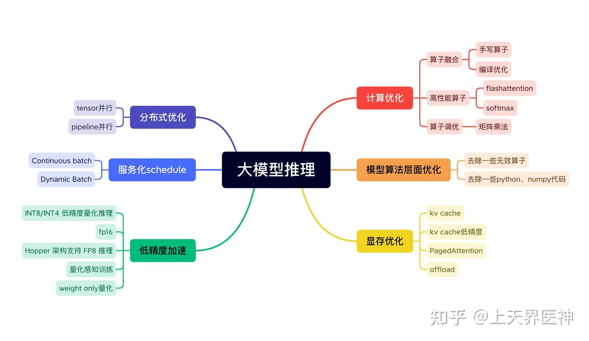
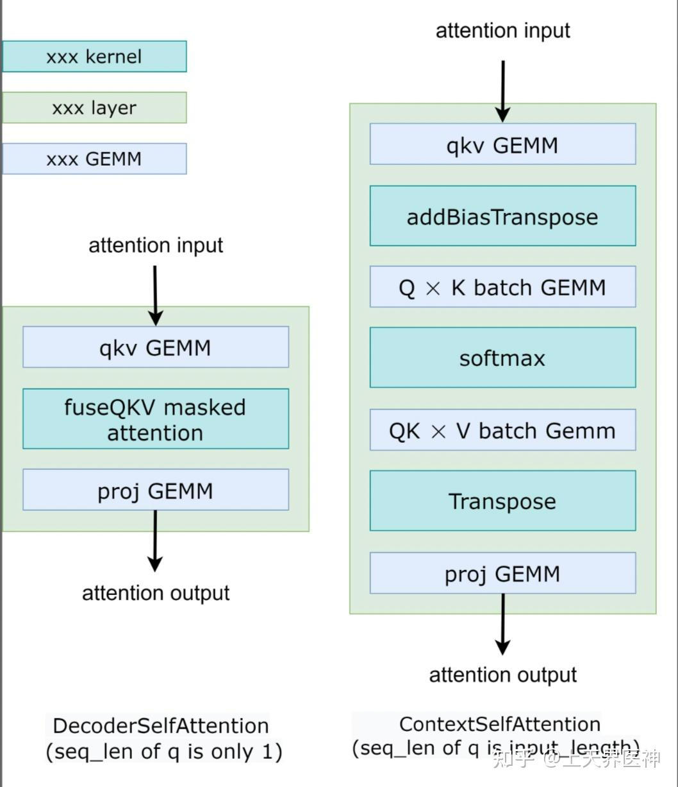
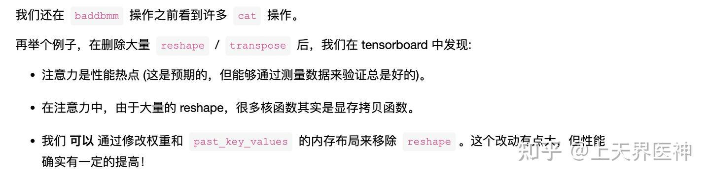

# LLM大模型推理优化技术综述&手抓饼熊
这篇文章主要是整理目前业界比较主流的大模型推理优化技术。本文分为3个大的章节，第一章主要介绍一些大模型推理的背景，第二章介绍LLM大模型推理优化的技术点，并附上笔者调研的一些文章（目前主要是网上的一些分析技术博客，后续会增加一些论文的介绍），第三章会将一些主流的大模型推理优化框架的分析文档链接贴进去，便于体系化阅读。

大模型推理优化
-------

\[优化故事: BLOOM 模型推理 - HuggingFace - 博客园\]([优化故事: BLOOM 模型推理](https://link.zhihu.com/?target=https%3A//www.cnblogs.com/huggingface/p/17327790.html))

\[NLP（十八）：LLM 的推理优化技术纵览 - 知乎\]([紫气东来：NLP（十八）：LLM 的推理优化技术纵览](https://zhuanlan.zhihu.com/p/642412124))

\[如何对大语言模型推理进行优化？7策详解 - 知乎\]([Baihai IDP：如何对大语言模型推理进行优化？7策详解](https://zhuanlan.zhihu.com/p/648403338))

上述几篇文章比较详细的介绍了大模型推理过程中用到的一些技术，现在这里做一些简单的总结。

1.  大模型推理一般是自回归型的任务，往往是显存密集型的任务；
2.  大模型推理主要是考虑延迟和吞吐量；
3.  大模型推理非常的耗费显存，除了模型占用显存外，kv cache本身也会占用大量的显存；
4.  大模型太大的时候，可能会遇到单机无法存下，这时候需要分布式；

通过这些点，以及上述综述的文章，尝试总结出如下的大模型推理优化手段。

常见优化手段
------

### 计算优化

计算优化主要有如下几个方面。

1，算子融合，这部分和传统的算子融合类似，主要减少显存交互以及cuda的kernel lunch，通常是融合一些非计算密集型的，如element wise型的算子，下图的addBiasTranspose，主流的deepspeed和fastertransformer都有类似优化：

可以参考如下：

[OneFlow：高效、易用、可拓展我全都要：OneFlow CUDA Elementwise 模板库的设计优化思路](https://zhuanlan.zhihu.com/p/447577193)

[BBuf：【BBuf的CUDA笔记】四，介绍三个高效实用的CUDA算法实现（OneFlow ElementWise模板，FastAtomicAdd模板，OneFlow UpsampleNearest2d模板）](https://zhuanlan.zhihu.com/p/597435971)

[Alexwell：LightSeq2-计算图优化之Attention Softmax算子](https://zhuanlan.zhihu.com/p/601718938)

2，高性能算子优化，如softmax高性能实现、FlashAttention高性能实现，这部分优化包含了算子融合方面，不过和上面的区别，这部分优化算子包含了一部分计算密集型算子，通常利用了一些tile的手段；

可以参考如下softmax实现：[BBuf：【BBuf的CUDA笔记】八，对比学习OneFlow 和 FasterTransformer 的 Softmax Cuda实现](https://zhuanlan.zhihu.com/p/609198294)

可以参考如下FlashAttention实现：[皓月争曦：动手Attention优化1：Flash Attention 2优化点解析](https://zhuanlan.zhihu.com/p/634427617)

[Austin：FlashAttention图解（如何加速Attention）](https://zhuanlan.zhihu.com/p/626079753)

[FlashAttention 的速度优化原理是怎样的？](https://www.zhihu.com/question/611236756/answer/3132304304)

[deephub：FlashAttention算法详解](https://zhuanlan.zhihu.com/p/651280772)

[莫笑傅立叶：\[LLM\] FlashAttention 加速attention计算\[理论证明｜代码解读\]](https://zhuanlan.zhihu.com/p/646084771)

[回旋托马斯x：FlashAttention:加速计算,节省显存, IO感知的精确注意力](https://zhuanlan.zhihu.com/p/639228219)

[Austin：FlashAttention2详解（性能比FlashAttention提升200%）](https://zhuanlan.zhihu.com/p/645376942)

[AI狂人日记：FlashAttention2: 更快的注意力与更好的并行性和工作分区](https://zhuanlan.zhihu.com/p/651396037)

[木子知：Flash Attention推理性能探究](https://zhuanlan.zhihu.com/p/652691133)

[NULL：Flash Attention2 示意图](https://zhuanlan.zhihu.com/p/645627275)

3，矩阵乘法优化

矩阵乘法cuda优化技术可以看一下 [棍哥的深入浅出gemm](https://www.zhihu.com/people/ban-zhuan-yuan-shi-chao-ji-gun/posts) 系列。

目前矩阵乘法，不少框架直接使用cutlass优化，可以参考如下b站视频。

[CUTLASS 极致性能优化探索及在阿里巴巴推荐系统中的应用 \[SE51305\]\_哔哩哔哩\_bilibili](https://link.zhihu.com/?target=https%3A//www.bilibili.com/video/BV1Eh411V7qc/%3Fspm_id_from%3D333.337.search-card.all.click%26vd_source%3D0ed9d89390ce09cad647885798cc4ff5)

[半小时快速入门CUTLASS-基于 CUDA 的多层次稠密线性代数计算原语\_哔哩哔哩\_bilibili](https://link.zhihu.com/?target=https%3A//www.bilibili.com/video/BV1Qk4y1n7Nd/%3Fspm_id_from%3D333.337.search-card.all.click%26vd_source%3D0ed9d89390ce09cad647885798cc4ff5)

[使用 CUTLASS 融合多个 GEMM 实现非凡性能 Use CUTLASS to Fuse Multiple GEMMs to Extreme Perfor\_哔哩哔哩\_bilibili](https://link.zhihu.com/?target=https%3A//www.bilibili.com/video/BV1AL411X7w6/%3Fspm_id_from%3D333.337.search-card.all.click%26vd_source%3D0ed9d89390ce09cad647885798cc4ff5)

另外知乎上也有cutlass的文章，感兴趣可以参考：

[我自己：CUTLASS: Fast Linear Algebra in CUDA C++](https://zhuanlan.zhihu.com/p/461060382)

[霸王手枪腿 的 cutlass解读](https://www.zhihu.com/people/ruc-whc/posts)

### 显存优化

显存优化，这部分主要是针对kv cache的pageattention技术了。

详细参考：

\[continuous batching在LLM推理中的意义 - 知乎\]([焦虑的职场老猿：continuous batching在LLM推理中的意义](https://zhuanlan.zhihu.com/p/652165071))

[LLM推理框架2：vLLM源码学习 - 知乎](#root/DvSDgGnSHCg0)

\[vLLM框架top down概览 - 知乎\]([是阿沅啊：vLLM框架top down概览](https://zhuanlan.zhihu.com/p/645251151))

\[LLM 高速推理框架 vLLM 源代码分析 / vLLM Source Code Analysis - 知乎\]([SiriusNEO：LLM 高速推理框架 vLLM 源代码分析 / vLLM Source Code Analysis](https://zhuanlan.zhihu.com/p/641999400))

[VLLM推理流程梳理（一） - 知乎](#root/10sbOangwiDU)

[BBuf：VLLM推理流程梳理（二）](https://zhuanlan.zhihu.com/p/649977422)

### 模型低精度加速

这部分内容比较多，且属于高速发展期，暂时列为 TODO

### 模型算法层面优化

这部分主要是模型本身有一些低效或者冗余的代码，会导致性能变慢，或者模型内部有一些numpy导致无法进行算子融合。下文是bloomz推理故事中的一些模型层面的优化。

### 服务化scheduler

可以参考：\[continuous batching在LLM推理中的意义 - 知乎\]([焦虑的职场老猿：continuous batching在LLM推理中的意义](https://zhuanlan.zhihu.com/p/652165071))

分布式优化
-----

### 张量并行

### 流水线并行

23年到24年这段时间，大模型推理领域可谓是卷出了新的高度，大模型一天，人间一年，一点也不夸张。最近发现几篇长序列推理的文章，笔者觉得挺有意思，具体文章翻译链接如下：

### 序列并行

序列并行在训练场景已经十分常见和成熟了，具体可以看笔者论文翻译专栏：[大模型训练（序列并行）](https://www.zhihu.com/column/c_1758860420298076160)

推理场景使用序列并行的暂时不多，以下算是一篇，而且和流水线并行结合。[狂刀：Poster: PipeLLM: Pipeline LLM Inference on Heterogeneous Devices with Sequence Slicing](https://zhuanlan.zhihu.com/p/698525218)

这篇文章将序列并行和流水并行结合起来，简单易懂，文章不长，建议阅读。其实这篇文章不完全说是序列并行，序列并没有并行，只是拆分程block的形式，但是整体思想和序列并行一致。

### 分离式架构

_**这个思想其实比较简单，就是prefill 和 generate 分别放在不同的gpu上，下面4篇文章均是这种思想。劣者认为prefill和generate分开这种模式，必将成为大模型推理将来的标配，这种模式的好处，不同论文均有阐述，劣者认为可以浓缩为一句，专业的卡做专业的事从而达到性价比最高。有点像国富论里的经济发展到社会分工。具体可以将这几篇论文都阅读一遍，不同的论文，阐述的点可能不同，均值得细品。。。**_

[狂刀：Inference without Interference:Disaggregate LLM Inference for Mixed Downstream Workloads](https://zhuanlan.zhihu.com/p/698629560)，

[狂刀：Splitwise: Efficient Generative LLM Inference Using Phase Splitting](https://zhuanlan.zhihu.com/p/698537680)，

[狂刀：DistServe: Disaggregating Prefill and Decoding for Goodput-optimized Large Language Model Serving](https://zhuanlan.zhihu.com/p/696864514)，

[狂刀：LoongServe论文](https://zhuanlan.zhihu.com/p/698334463)

### kv cache分布式

[狂刀：Infinite-LLM: Efficient LLM Service for Long Context with DistAttention and Distributed KVCache](https://zhuanlan.zhihu.com/p/698528010) 这篇论文没有将prefill和generate分开，只是kv cache是分布式的，有兴趣，也可以读一读。