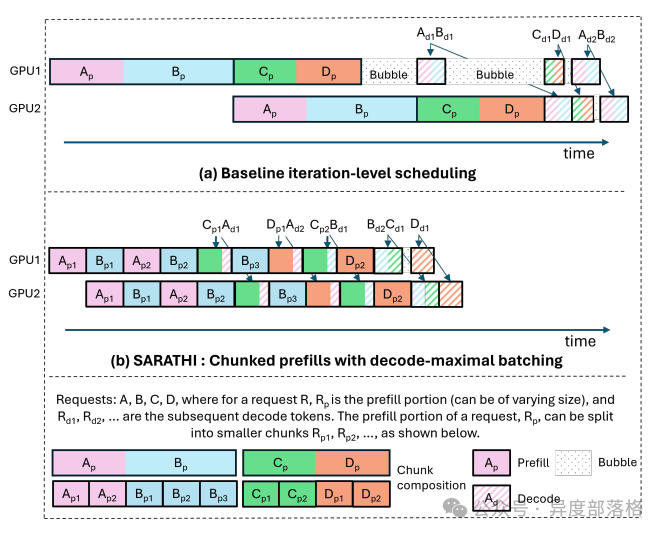
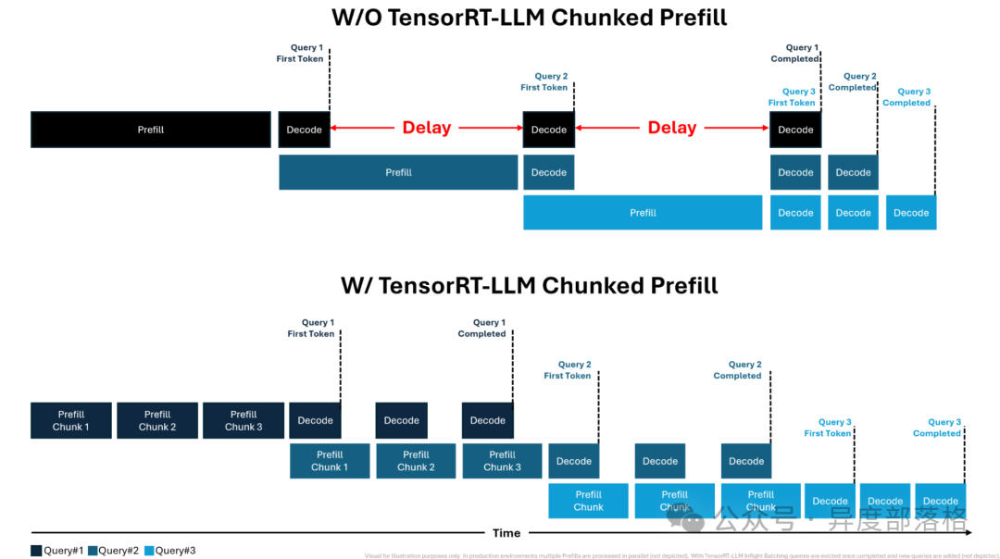
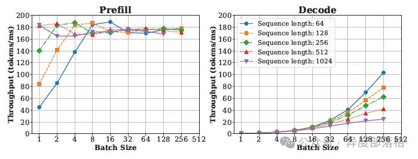
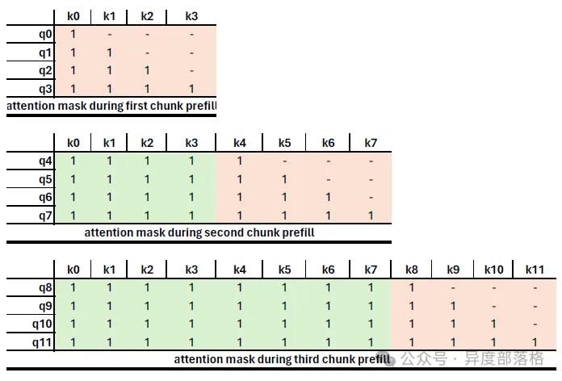
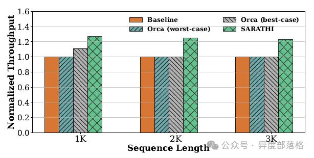
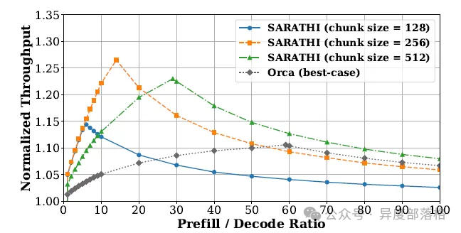

# LLM推理优化&-&Chunked&prefills
> 作者: 异度部落格
> 
> 原文: [https://mp.weixin.qq.com/s/n9X7Z6N1w0fTsH8CpqcCxg](https://mp.weixin.qq.com/s/n9X7Z6N1w0fTsH8CpqcCxg)

概述
--

在[LLM推理优化 - Prefill-Decode分离式推理架构](https://mp.weixin.qq.com/s?__biz=MzU1MjkzNzg5Nw==&mid=2247484088&idx=1&sn=a8725dc1f0e17483c1f276c6afd431ee&scene=21#wechat_redirect)中,我们通过 DistServe 框架深入探讨了“为何需要采用分离式推理架构”.这种架构通过将 Prefill(计算密集型)与 Decode(内存密集型)过程解耦,使它们可以在硬件资源分配和并行策略上独立优化,从而在提升 TTFT(Total Time for First Token)和 TPOT(Total Processing of Tokens)方面实现双赢,并避免了传统架构中的资源权衡问题.

那么,**能否让处于 Prefill 阶段的请求与 Decode 阶段的请求组成一个批次(batch)进行计算,同时最大化 GPU 计算单元的利用率并最小化 IO 开销？** 答案便是 **Chunked Prefills**.

Chunk Prefills 工作流程
-------------------

Chunked Prefills 是 Sarathi-Serve 推理架构中的一种优化机制,其核心思想是将大型语言模型推理过程中的 Prefill 阶段分块处理.以下是论文中描述的具体工作流程:

1.  **确定 batch 的 token 容量\*\*\*\*根据 GPU 性能,确定每个 batch 中可处理的最大 token 数量(可通过 profiling 模拟实验获得).**
2.  **分配 Prefill 和 Decode 的 token 比例\*\*\*\*遵循“decode-maximal batching”原则:优先向 batch 中添加 Decode 请求,直到其占用的 KV cache 空间达到上限.随后,根据剩余的 token 配额,将需要 Prefill 的序列进行分块处理并加入 batch.**
3.  **动态调度\*\*\*\*采用 iteration-level scheduling 策略,在推理的每一步后由调度器重新构建 batch.**

以下流程图直观地展示了 Chunk Prefills 的操作机制:  
同时,NVIDIA 提供了更清晰的图解:  
**Chunk Prefills 核心设计逻辑**

Chunk Prefills 的设计基于以下两点关键观察:

**1.吞吐量与 token 数量的关系**

*   对于特定的模型和 GPU,增加 Prefill token 数量会带来吞吐量的提升,但当数量超过某临界值时(如 Llama-13B 模型在 A6000 GPU 上的 512 tokens),吞吐量增长趋缓甚至停止.
*   对 Decode 而言,吞吐量随着总 Decode token 数量的增加而持续提升,但同样存在计算资源限制.

以下图表展示了不同分块大小对 Prefill 和 Decode 吞吐量的影响:  
**2.生产环境中的 Prefill 分块需求**

*   通常,生产环境中的 Prefill 长度较大(1K–4K tokens).通过将其拆分为更小的计算单元,可以更高效地利用 GPU 资源.
*   在实现过程中,需调整注意力掩码(attention mask)以确保每个块的查询 token 只访问当前块及之前的 token,而不会影响后续块.

以下示意图展示了分块后的 Prefill 如何通过注意力掩码保持计算结果一致性:  
**Chunked Prefill 性能评估**

实验结果展示了不同条件下 Chunked Prefills 的性能表现:

1.  **单 GPU 下不同序列长度的评估**

**从图中可以看出,随着序列长度增加,Chunked Prefills 能有效提升吞吐量.**

1.  **单 GPU 下不同 P/D 比例和分块大小的评估**

**通过调整 P/D 比例和分块大小,Chunked Prefills 达到了性能与资源利用率的最佳平衡.**

参考资料
----

*   图解大模型计算加速系列:分离式推理架构 2,模糊分离与合并边界的 chunked-prefills
*   Streamlining AI Inference Performance and Deployment with NVIDIA TensorRT-LLM Chunked Prefill