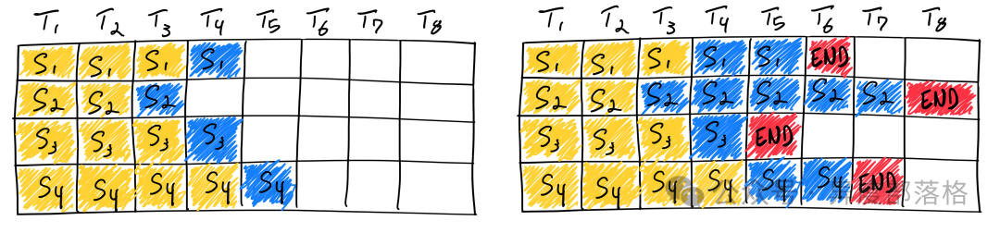
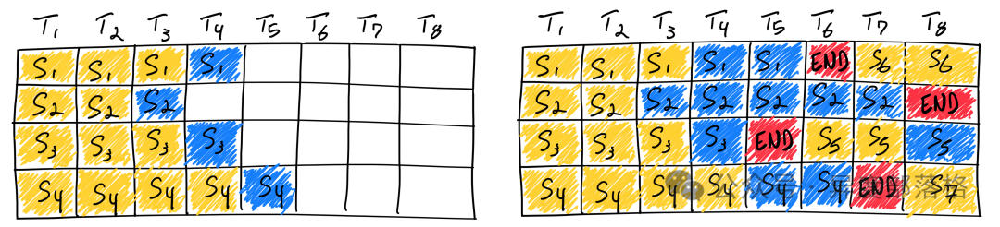
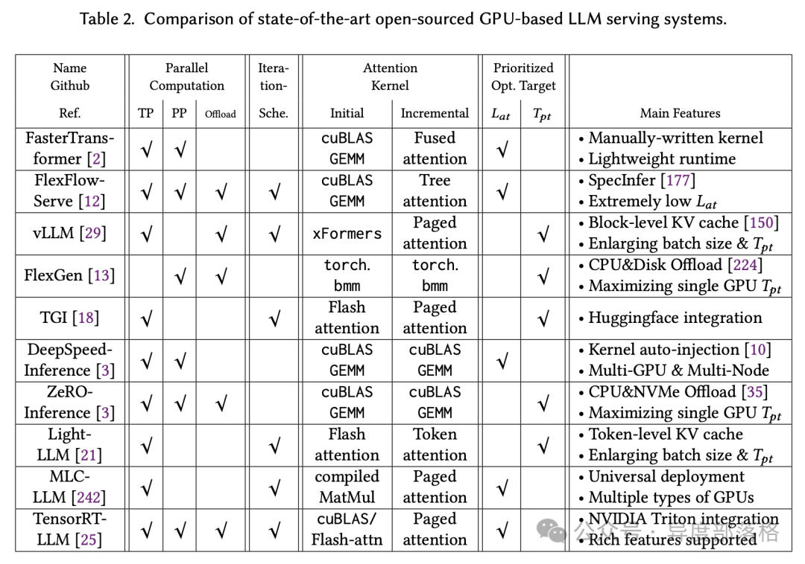

# LLM推理优化&-&Continuous&Batching
> 作者: 异度部落格
> 
> 原文: [https://mp.weixin.qq.com/s/RZLkx\_48fBFpZ4wS\_KFa6w](https://mp.weixin.qq.com/s/RZLkx_48fBFpZ4wS_KFa6w)

概述
--

Continuous Batching（也称为 Dynamic Batching）是一种按每次推理迭代调度请求的方式。最早出现在 2022 年的 Orca 推理框架中（《Orca: A Distributed Serving System for Transformer-Based Generative Models》），此后逐渐成为大规模语言模型（LLM）推理的事实标准。

Static Batching
---------------

我们通常称这种传统的批处理方法为静态批处理，因为在推理完成之前，批次的大小是固定的。以下是静态批处理在 LLM 推理中的应用示意图：

与传统的深度学习模型不同，LLM（大语言模型）的批处理具有其特殊性，因为推理过程是迭代式的。由于批次中的请求完成时间不一致，提前完成的请求很难释放资源并加入新的请求，这导致不同序列的生成长度差异，使得 GPU 资源无法得到充分利用。例如，当输入和输出序列长度不固定时，静态批处理会导致大量 GPU 资源浪费。特别是在大语言模型服务中，GPU 利用率往往较低，进一步增加了计算成本。因此，为了在生产环境中高效地处理 LLM 流量，必须优化批处理策略，避免不必要的资源浪费和高昂的计算费用。

Continuous Batching
-------------------

顾名思义，Continuous Batching 即为“持续批处理”策略，来源于《Orca: A Distributed Serving System for Transformer-Based Generative Models》。与静态批处理不同，Continuous Batching 在每次迭代中动态确定批次大小。这样，随着批次中某个序列的生成完成，可以立即插入新的请求，最大化 GPU 的利用率。

然而，实际情况比上述简化的模型要复杂得多：由于预填充阶段需要计算且其计算模式与生成阶段不同，因此不能像生成令牌那样轻松进行批处理。目前，持续批处理框架通过超参数来管理这一问题，即“等待服务比率”（waiting\_served\_ratio），它表示等待预填充的请求与等待生成序列结束的请求之间的比率。

Continuous Batching 在 LLM 推理框架中的应用
----------------------------------

前面谈到 Continuous batching 已经广泛应用于 LLM 推理框架，下面的表格出自《Towards Efficient Generative Large Language Model Serving: A Survey from Algorithms to Systems》（**LLM 推理技术在过去一年中发展迅速，所以表格中的数据仅供参考**）关于 Continuous Batching 在不同的推理框架中的实现，可以参考这篇文章：大模型推理服务调度优化技术-Continuous batching

参考资料
----

*   How continuous batching enables 23x throughput in LLM inference while reducing p50 latency
*   图文详解 Continuous Batch：不写 CUDA Kernel 也能成倍优化推理效率
*   大模型推理服务调度优化技术-Continuous batching