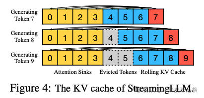
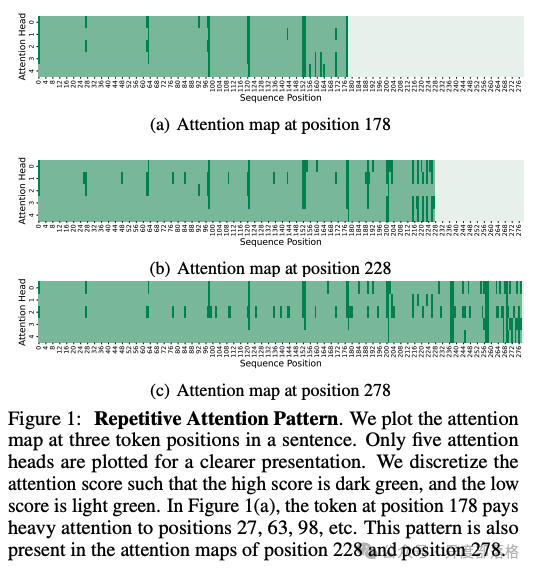
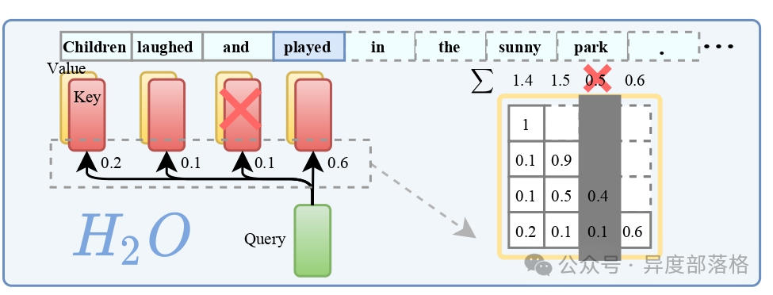
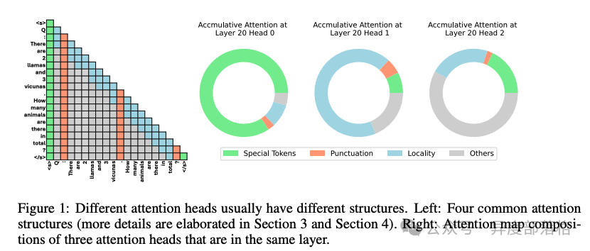
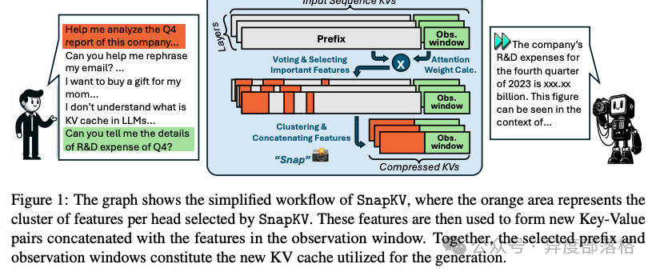
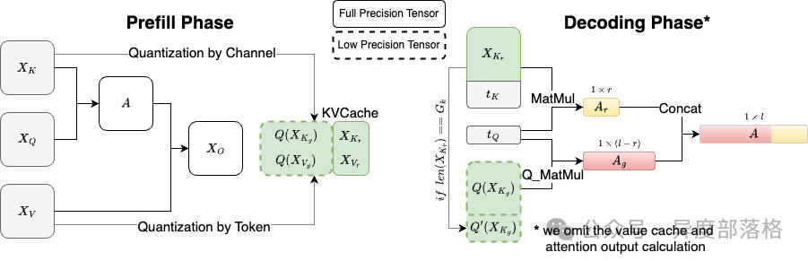
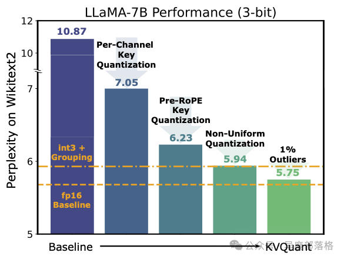

# LLM推理优化&-&KVCache压缩
* * *

created: 2025-01-24T00:20 updated: 2025-01-26T01:59
---------------------------------------------------

> 作者: 异度部落格
> 
> 原文: [https://mp.weixin.qq.com/s/ZmfE\_YxDn4fEPXr3waXBug](https://mp.weixin.qq.com/s/ZmfE_YxDn4fEPXr3waXBug)

概述
--

在之前的LLM 推理优化系列文章中,我们曾多次提到上下文对推理性能的影响. 其核心问题在于,KV Cache 占用了大量的访存带宽,同时在生成阶段引入了大量重复计算. 正因如此,**KV Cache 压缩技术**在过去一年(2024 年)成为了 LLM 推理领域的热门研究方向.

目前,KV Cache 压缩技术主要有两个方向:

*   稀疏化: 面向超长 prompt,通过减少 kv cache 中 slot 的数量进行压缩. 例如,对于长度为 128K tokens 的 prompt,仅挑选 1024 个 tokens 的 kv cache 进行存储.
*   量化: 在保持 kv cache slot 数量不变的情况下,将数据格式从 fp16 压缩到 int8 或 int4 等低精度格式.

这两种方法的目标一致,都是**减少 KV Cache 的占用并提升推理性能**.

KV Cache 显存需求量
--------------

在介绍 KV Cache 压缩之前,先简单复习一下 KV Cache 显存占用量的计算方法.

假设我们使用一个 Transformer 模型,其中每一层的 Key 和 Value 向量维度为 `d_model`,序列长度为 `n`,层数为 `L`,批量大小为 `b`,则每层的 KV Cache 显存占用可按以下公式计算:

*   每个 token 的 Key 和 Value: Key 和 Value 向量的维度为 `d_model`,因此每个 token 的 Key 和 Value 占用的显存为 `2 * d_model`.
*   每层缓存: 对于序列长度为 `n`,每一层的 KV Cache 占用显存为 `2 * n * d_model`.
*   所有层缓存: 如果模型有 `L` 层,那么所有层的 KV Cache 总占用为 `L * 2 * n * d_model`.
*   批量大小: 若批量大小为 `b`,则需要将显存占用再乘以 `b`.

最终,KV Cache 显存总占用公式为:

Total KV Cache Memory= b \* n \* d\_model \* L \* 2 \* size of float16

其中,`size of float16` 大约为 2 字节(16 位浮点数).

KV Cache 稀疏化
------------

**KV Cache 稀疏化**(KVCache Sparsification)是通过减少不必要的存储和计算来提高效率的一种优化方法. 它的核心思想是选取需要关注的关键 token,并丢弃无关的 token,以减少 KV Cache 的体积和计算复杂度.

KV Cache 稀疏化的各种方案本质上就是选取需要关注的 token 方法的不同. 下面是一些比较有代表性的 KV Cache 稀疏化技术方案:

### **StreamingLLM**

StreamingLLM 来自论文《Efficient Streaming Language Models with Attention Sinks》,该研究由 MIT-Han Lab 的 Guangxuan Xiao 等人完成. 其目标是让模型能够处理无限长度的输入(注意,这里的“无限长度输入”与“无限长度上下文”有所不同——前者无需记住所有输入内容).

目前主流扩展输入长度的方法包括:

*   \*\*长度外推(Length Extrapolation): \*\*让训练在短序列上的 LLM 能够在推理时处理更长序列. 例如常见的 RoPE 和 ALiBi 编码方法. 但目前尚未有方法实现真正意义上的无限长度外推.
*   \*\*上下文窗口扩展(Context Window Extension): \*\*直接扩展上下文窗口长度(序列长度). 但由于 Attention 的计算复杂度和内存需求随序列长度呈平方增长,扩展序列长度的代价非常高.

StreamingLLM 通过使用**近似注意力**(approximate attention),放松对全部输入记忆的限制,仅保留最近的上下文,实现了对无限长度输入的支持,同时生成无限长度的输出.

### **Scissorhands**

Scissorhands 来自论文《Scissorhands: Exploiting the Persistence of Importance Hypothesis for LLM KV Cache Compression at Test Time》. 其核心思想是: **并非所有 token 都需要被存储到 KV Cache 中,模型仍然可以理解上下文**. 换句话说,LLM 不需要关注每个 token,也能够进行有效推理.

研究发现,单个 token 的注意力分数呈现**强幂律分布**,这意味着某些 token 对 Attention 机制的重要性远高于其他 token. 作者据此提出了“重要性的持久性”(Persistence of Importance)假设: 在生成过程中,只有具有显著重要性的 token 会对后续生成步骤产生持续影响.

论文进一步指出,大多数 Transformer 层之间的注意力模式高度相似,重叠比率超过 90%. 因此,通过识别“高权重分数 token”,可以有效减少 KV Cache 的内存占用. 此外,还可通过预先分配 KV Cache 的空间,仅存储必要的 token,从而将计算复杂度简化为常数级别.

### **H2O**

H2O 来自论文《H2O: Heavy-Hitter Oracle for Efficient Generative Inference of Large Language Models》. 其思路与 Scissorhands 类似,通过逐出策略(eviction strategy)识别“高权重 token”,从而压缩 KV Cache. 这种方法本质上是一种贪心策略,且该论文与 Scissorhands 几乎同时发布在 NIPS 2023 上.

### **FastGen**

FastGen 出自论文《Model Tells You What to Discard: Adaptive KV Cache Compression for LLMs》. 相比 Scissorhands 和 H2O,FastGen 更进一步地分析了不同注意力的特性,提出了对不同注意力头采用不同压缩策略的方法. 通过对注意力机制的 profiling,FastGen 为每种注意力打上标签并进行针对性优化.

### **SnapKV**

SnapKV 来自论文《SnapKV: LLM Knows What You are Looking for Before Generation》. 本质上,SnapKV 是 FastGen 的一个简化版本. 它的核心区别在于,通过为每个注意力头聚类选择重要的 KV 位置,从而实现 KV Cache 的压缩.

KV Cache 量化
-----------

**KV Cache 量化**(KVCache Quantization)是一种通过压缩 Key 和 Value 的数值表示以减少存储需求并提升计算性能的优化方法.

下面是一些比较有代表性的 KV Cache 量化技术方案(KV Cache 量化技术方案真的太多了！！):

### **KIVI**

KIVI 来自论文《KIVI: A Tuning-Free Asymmetric 2bit Quantization for KV Cache》. 研究发现:

*   使用 INT4 精度对 Key 和 Value 量化能够很好地保持精度,但降低到 INT2 会显著影响性能.
    
*   最优方案是对 Key 缓存按通道量化(Per-Channel Quantization),对 Value 缓存按 Token 量化(Per-Token Quantization).
    

基于这些发现,KIVI 提出了一种非对称的 2 比特量化方法. 实验表明,KIVI 可在几乎不损失精度的情况下,将内存峰值减少 2.6 倍,并将推理吞吐量提升至原来的 2.35 倍到 3.47 倍.

### **KVQuant**

KVQuant 来自论文《KVQuant: Towards 10 Million Context Length LLM Inference with KV Cache Quantization》. 它的核心创新包括:

*   \*\*Per-Channel Key 和 Pre-RoPE Key 量化: 对异常通道进行优化. \*\*
*   \*\*非均匀 KV Cache 量化(Non-Uniform Quantization, NUQ): 更好地表示非均匀激活. \*\*
*   \*\*向量级密集与稀疏量化: 缓解数值异常问题. \*\*

这些技术结合使 KVQuant 在长上下文推理任务中展现了卓越性能.

总结
--

从实际工程意义来看,**KV Cache 量化**的应用价值更高,而**KV Cache 稀疏化**更多属于理论探索,尚需进一步验证其实用性.

参考资料
----

*   [大模型推理优化技术-KV Cache 量化](https://zhuanlan.zhihu.com/p/4335176084)
*   [聊聊大模型推理中的 KVCache 压缩](https://zhuanlan.zhihu.com/p/708946312)
*   [量化那些事之 KVCache 的量化](https://zhuanlan.zhihu.com/p/691537237)
*   [2024 年-开源大模型推理引擎现状及常见推理优化方法](https://zhuanlan.zhihu.com/p/755874470)
*   [LLM 推理技术之 StreamingLLM: 如何拥有无限长生成能力](https://zhuanlan.zhihu.com/p/659875511)
*   [LLM(二十): 漫谈 KV Cache 优化方法,深度理解 StreamingLLM](https://zhuanlan.zhihu.com/p/659770503)