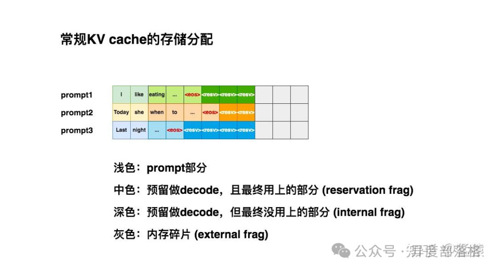
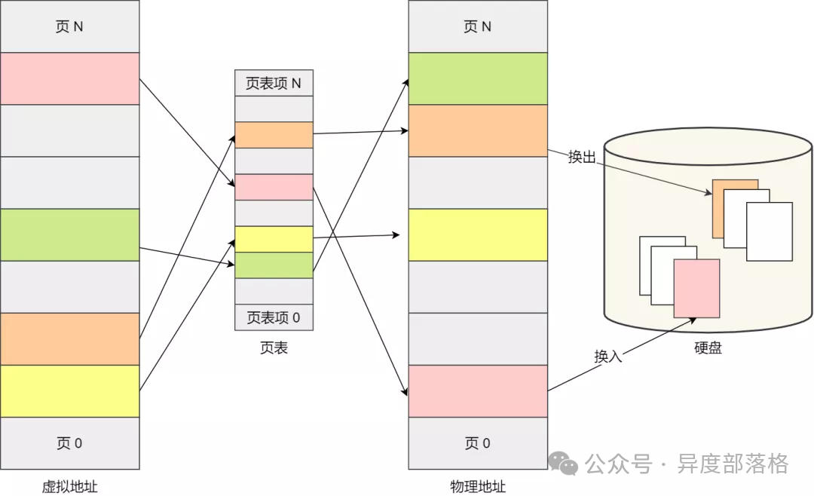
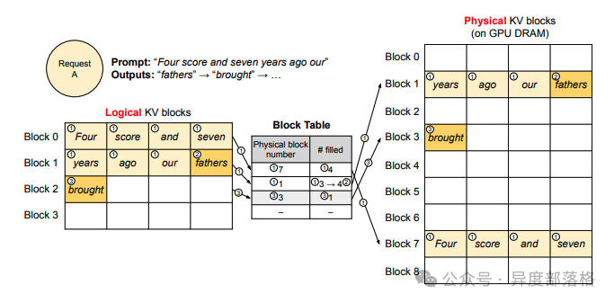
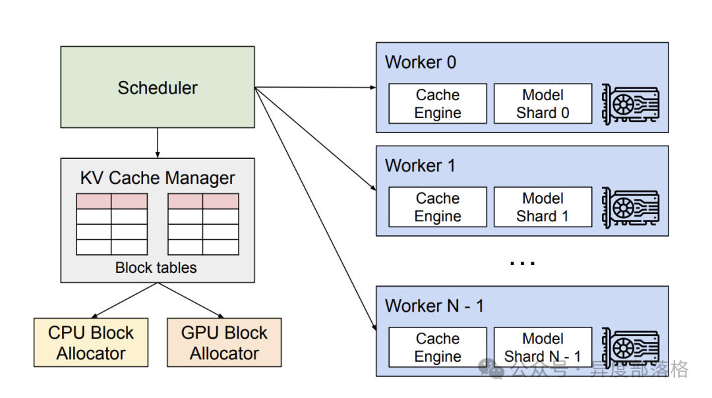

# LLM推理优化&-&PagedAttention
* * *

created: 2025-01-24T00:20 updated: 2025-01-26T01:59
---------------------------------------------------

> 作者: 异族部落格
> 
> 原文: [https://mp.weixin.qq.com/s/KaiFzXzTn4gGe4oWj5POuQ](https://mp.weixin.qq.com/s/KaiFzXzTn4gGe4oWj5POuQ)

前言
--

大模型的推理过程通常分为两个阶段：**Prefill** 和 **Decoding**。

在 Prefill 阶段，推理引擎将整段 prompt 输入模型进行前向计算。如果引入了 KV Cache 技术，prompt 经 Wk 和 Wv 计算得到的结果（即 K 和 V）会被存储到 K Cache 和 V Cache 中。这样，在后续 token 的 Attention 计算中，无需重复计算 K 和 V，从而显著节约计算时间。

进入 Decoding 阶段后，推理引擎会基于 Prefill 阶段的结果，逐步生成响应，每次输出一个 token。如果同样使用了 KV Cache，每生成一个 token，都会将其对应的 K 和 V 值存入缓存，加速后续推理。

常规的 KV Cache 存储分配
-----------------

由于推理所生成的序列长度大小无法事先预知，所以大部分推理框架都会按 batch\_size x max\_seq\_len 这样的固定尺寸来分配。在请求到来时，预先在显存中申请一块连续的区域。然而，这种“静态”显存分配策略，显存利用率是很低的。

PagedAttention 原理
-----------------

为了解决静态显存利用率低的问题，vllm 引入了一种 PagedAttention （《Efficient Memory Management for Large Language Model Serving with PagedAttention》）的技术，动态地为请求分配 KV Cache 显存，提升显存利用率。PagedAttention 的设计灵感来源于操作系统的虚拟内存分页技术。

操作系统的虚拟内存分页
-----------

虚拟内存分页是一种操作系统管理内存的技术，它将物理内存抽象为一个连续的虚拟地址空间，使每个进程都像拥有独立的内存。分页通过将内存划分为固定大小的**页**（虚拟内存）和**页框**（物理内存）进行管理。页表记录虚拟页到物理页框的映射关系。若虚拟页不在物理内存中，会发生**页缺失**（Page Fault），操作系统会从磁盘调入对应页。分页提高了内存利用率，并支持进程隔离与动态内存扩展。

PagedAttention 工作流程
-------------------

假设现在你向推理引擎发送请求，prompt 为`Four score and seven years ago our`，你希望模型进行续写。PagedAttention 的运作流程如下

### Prefill 阶段

**划分逻辑块**：vLLM 在接收到这条 prompt 后，会根据设定的块大小 BB（本例中 B=4B = 4），将 prompt 划分为若干**逻辑块**（Logical KV Blocks）。由于该 prompt 包含 7 个 token，因此 vLLM 使用两个逻辑块（block 0 和 block 1）来存储它们的 KV 值。在逻辑块 1 中，目前仅存储了 "years"、"ago" 和 "hour" 这 3 个 token 的 KV 值，还有 1 个位置为空，称为**保留位**（Reservation）。

**划分物理块**：完成逻辑块的划分后，这些逻辑块会映射到**物理块**，即实际存储 KV 值的空间。映射关系通过一张 **block table**（块表）记录，其主要内容包括：

*   **逻辑块与物理块的映射关系**（Physical Block Number）：例如，逻辑块 0 映射到物理块 7。
*   **物理块已填满的槽位数量**（# Filled）：例如，在 prefill 阶段，物理块 7 的 4 个槽位已填满，而物理块 1 的 4 个槽位中填满了 3 个。

系统正常计算 prompt 的 KV 值后，根据上述划分关系，将这些值填入对应的物理块中。

### Decoding 阶段

在使用 KV cache 计算 attention 并生成第一个词 "fathers" 时，不难发现，计算过程中使用的是**逻辑块**，即从形式上看，这些 token 是连续的。与此同时，vLLM 通过后台的 **block table** 映射关系，从对应的物理块中获取数据以完成实际计算。通过这种方式，每个请求都能认为自己是在一个连续且充足的存储空间上操作，尽管这些数据在物理存储上并不是连续的。

基于新生成的词，系统会对逻辑块、物理块和 block table 进行更新。例如，对于 block table，vLLM 将其 **filled** 字段从 3 更新为 4。

当 "fathers" 被写入后，当前逻辑块已装满，因此 vLLM 会开辟一个新的逻辑块（逻辑块 2），并同步更新 block table 和对应的物理块，以确保后续生成过程能够顺利进行。

调度和抢占
-----

到目前为止，我们已经解答了“vLLM 如何优化 KV cache 的显存分配”这一问题。接下来，我们将探讨另一个关键问题：当采用动态显存分配策略时，虽然表面上可以同时处理更多的 prompt，但由于没有为每个 prompt 预留充足的显存空间，如果某一时刻显存被完全占满，而所有正在运行的 prompt 都尚未完成推理，系统又该如何应对呢？

vllm 的调度和抢占原则：

*   采用“先到先服务”（FCFS）的调度策略来处理所有请求，确保公平性并防止请求饿死。
*   当 vLLM 需要抢占请求时，它会优先服务最早到达的请求，并优先抢占最新到达的请求。暂停它们的执行，同时将与之相关的 KV cache 从 gpu 上释放掉。等 gpu 资源充足时，重新恢复它们的执行。

分布式 KV Cache 管理
---------------

在分布式场景下，vLLM 的整体运作流程如下：

1.  **中央调度器（Scheduler）**：vLLM 配备了一个中央调度器，负责计算并管理每张显卡上 KV cache 从逻辑块到物理块的映射表（block tables）。
2.  **映射表广播**：在进行分布式计算时，Scheduler 会将生成的映射表广播到各显卡。
3.  **缓存引擎管理**：每张显卡上的 Cache Engine 在接收到对应的映射信息后，负责具体管理该显卡上的 KV block。

通过这种方式，vLLM 高效地协调多卡资源，实现分布式计算的灵活调度与高效管理。

参考资料
----

*   kernel\_memory\_management/✍ 文章/一文带你了解，虚拟内存、内存分页、分段、段页式内存管理.md at main · 0voice/kernel\_memory\_management · GitHub
*   图解大模型计算加速系列之：vLLM 核心技术 PagedAttention 原理