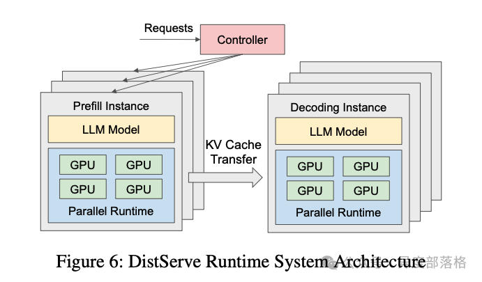
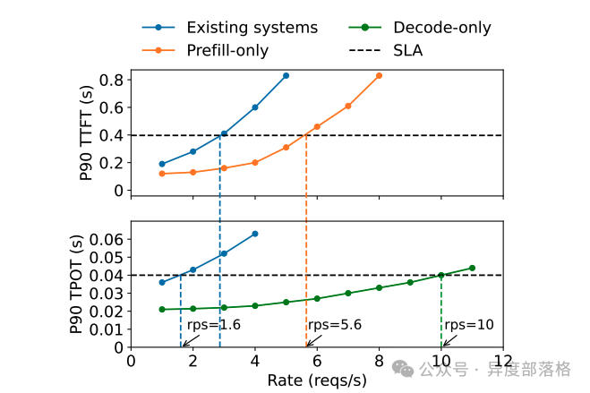
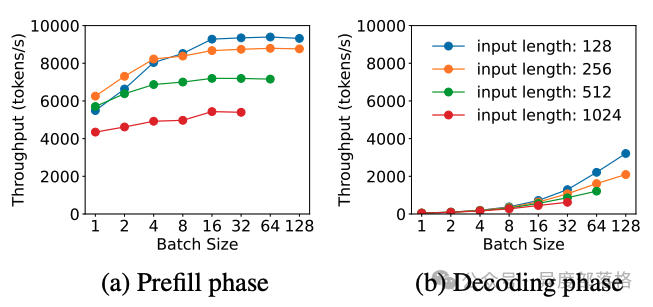
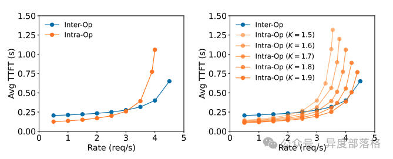
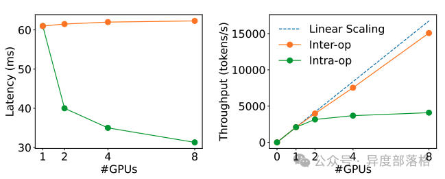

# LLM推理优化&-&Prefill-Decode分离式推理架构
> 作者: 异度部落格
> 
> 原文: [https://mp.weixin.qq.com/s/FwgYf3yHLM6wDHaalj9Saw](https://mp.weixin.qq.com/s/FwgYf3yHLM6wDHaalj9Saw)

什么是 Prefill-Decode 分离？
----------------------

在传统的 LLM 推理框架中，**Prefill** 和 **Decode** 阶段通常由同一块 GPU 执行。推理引擎的调度器会根据显存使用情况及请求队列状态，在 Prefill 和 Decode 之间切换，完成整个推理过程。

而在 **Prefill-Decode 分离式架构**（以下简称 PD 分离式架构）中，这两个阶段被拆分到不同的 GPU 实例上独立运行。如下图所示，这是 DistServe 提供的一张架构图：

在 PD 分离式架构中：

*   **Prefill Instance** 专注于 Prefill 阶段的计算。
*   **Decode Instance** 专注于 Decode 阶段的生成任务。

当 Prefill Instance 完成 KV Cache 的计算后，会将其传输给 Decode Instance，后者接续生成结果。这种架构独立优化了两个阶段的性能，因此又被简称为 PD 分离。

为什么需要 Prefill-Decode 分离？
------------------------

在大模型推理中，常用以下两项指标评估性能：

*   **TTFT**（Time-To-First-Token）：首 token 的生成时间，主要衡量 Prefill 阶段性能。
*   **TPOT**（Time-Per-Output-Token）：生成每个 token 的时间，主要衡量 Decode 阶段性能。

当 Prefill 和 Decode 在同一块 GPU 上运行时，由于两阶段的计算特性差异（Prefill 是计算密集型，而 Decode 是存储密集型），资源争抢会导致 **TTFT** 和 **TPOT** 之间的权衡。例如：

*   若优先处理 Prefill 阶段以降低 TTFT，Decode 阶段的性能（TPOT）可能下降。
*   若尽量提升 TPOT，则会增加 Prefill 请求的等待时间，导致 TTFT 上升。

**PD 分离式架构的提出正是为了打破这一矛盾**。通过将 Prefill 和 Decode 分离运行，可以针对不同阶段的特性独立优化资源分配，从而在降低首 token 延迟的同时提高整体吞吐量。

在 DistServe 的实验中，验证了 PD 分离的优势。实验配置如下：

| GPU | 1 张 A100 80G |
| --- | --- |
| 模型规模 | 13B LLM |
| 输入长度 | 512 tokens |
| 输出长度 | 64 tokens |
| SLA 定义 | P90 TTFT ≤ 0.4s（Prefill 阶段，90% 请求的首 token 生成时间需满足 0.4 秒以下）   P90 TPOT ≤ 0.04s（Decode 阶段，90% 请求的生成时间需满足 0.04 秒以下） |

实验结果表明：

1.  **单张 GPU 专注于 Prefill 或 Decode 的吞吐量，明显高于合并运行的架构**。
2.  **Decode 吞吐量约为 Prefill 吞吐量的两倍**。假设 2 张 GPU 专注于 Prefill，1 张 GPU 专注于 Decode，则三卡架构的总吞吐量为 rps=10，即单卡 rps=3.3，是 PD 合并架构（rps=1.6）的 2.1 倍。

下图展示了实验结果：

分离式推理架构的优化方向
------------

1\. 算力与存储的独立优化
--------------

在 PD 分离架构中，Prefill 和 Decode 阶段的资源需求不同，分别体现为：

*   **Prefill 阶段**：计算密集型（compute-bound）。在流量较大或用户提示长度较长时，Prefill 的计算压力更大。完成 KV Cache 的生成后，Prefill 阶段本身无需继续保留这些缓存。
*   **Decode 阶段**：存储密集型（memory-bound）。由于逐 token 生成的特性，Decode 阶段需频繁访问 KV Cache，因此需要尽可能多地保留缓存数据以保障推理效率。

因此，在 PD 分离架构下，可以分别针对计算和存储瓶颈进行优化。

2\. Batching 策略的独立优化
--------------------

在 DistServe 的实验中，Batching 策略对两阶段的性能影响显著，但趋势相反：

*   **Prefill 阶段**：吞吐量随 batch size 增加逐渐趋于平稳。这是因为 Prefill 的计算受限特性（compute-bound），当 batch 中的总 token 数超过某个阈值时，计算资源成为瓶颈。
*   **Decode 阶段**：吞吐量随 batch size 增加显著提升。由于 Decode 阶段的存储受限特性（memory-bound），增大 batch size 可提高计算效率，从而显著增加吞吐量。

下图展示了两阶段吞吐量随 batch size 变化的趋势：

3\. 并行策略优化
----------

在 PD 合并架构中，Prefill 和 Decode 阶段共享相同的并行策略（如数据并行 DP、张量并行 TP 或流水线并行 PP）。但在 PD 分离架构中，可分别为两个阶段选择最优的并行策略。

DistServe 的实验结果显示：

*   **Prefill 阶段**：
    *   在请求率较小时，更适合张量并行（TP）。
    *   在请求率较大时，更适合流水线并行（PP）。
*   **Decode 阶段**：
    *   GPU 数量增加时，PP 可显著提高吞吐量（因为其处理方式是流水线化的）。
    *   TP 则可降低延迟（减少单个请求的处理时间）。

下图为不同并行策略下的性能对比：

分离式推理架构相关工作
-----------

下面介绍几篇关于分离式推理结构的论文：

**1\. DistServe: Disaggregating Prefill and Decode for Goodput-optimized Large Language Model Serving**

这篇论文提出了 DistServe 系统，通过将大型语言模型（LLM）的预填充（prefill）和解码（decode）阶段分离，以优化服务性能。传统的 LLM 服务通常将这两个阶段合并处理，可能导致资源竞争和性能下降。DistServe 通过将预填充和解码分配到不同的 GPU 上，消除了相互干扰，并针对每个阶段的特定需求进行资源分配和并行策略优化，从而提高了每个 GPU 的有效吞吐量。

**2\. Splitwise: Efficient Generative LLM Inference Using Phase Splitting**

该论文介绍了 Splitwise 技术，通过将 LLM 推理过程中的提示计算（prompt computation）和令牌生成（token generation）阶段分离到不同的机器上，以提高硬件利用率。提示计算阶段计算密集，而令牌生成阶段则受限于内存带宽。通过分离这两个阶段，Splitwise 能够针对每个阶段的特定需求进行资源管理，从而在相同的成本和功耗预算下，实现更高的吞吐量。

**3\. Inference without Interference: Disaggregate LLM Inference for Mixed Downstream Workloads**

这篇论文提出了 TetriInfer 系统，通过将 LLM 推理过程中的预填充和解码阶段分离，以减少不同下游任务之间的干扰。TetriInfer 通过将输入提示分割成固定大小的块、独立运行预填充和解码实例，以及使用智能的两级调度算法，显著降低了首次令牌生成时间（TTFT）和作业完成时间（JCT），并提高了性能与成本的效率。

**4\. MemServe: Context Caching for Disaggregated LLM Serving with Elastic Memory Pool**

MemServe 系统针对分离式 LLM 服务中的上下文缓存管理问题，提出了弹性内存池的解决方案。通过高效的上下文缓存机制，MemServe 能够在不同的计算节点之间共享和管理内存资源，从而提高 LLM 服务的可扩展性和资源利用率。

**5\. Mooncake: A KVCache-centric Disaggregated Architecture for LLM Serving**

Mooncake 提出了一种以键值缓存（KVCache）为中心的分离式 LLM 服务架构。通过优化 KVCache 的管理和传输，Mooncake 在满足服务水平目标（SLO）的前提下，实现了高达 525%的吞吐量提升。在实际工作负载下，Mooncake 使得 Kimi 系统的请求处理能力提高了 75%。

参考资料
----

*   图解大模型计算加速系列：分离式推理架构 1，从 DistServe 谈起
*   图解大模型计算加速系列：分离式推理架构 2，模糊分离与合并边界的 chunked-prefills
*   DistServe: Disaggregating Prefill and Decode for Goodput-optimized Large Language Model Serving
*   Mooncake (1): 在月之暗面做月饼，Kimi 以 KVCache 为中心的分离式推理架构
*   Mooncake 阅读笔记：深入学习以 Cache 为中心的调度思想，谱写 LLM 服务降本增效新篇章
*   大模型推理分离架构五虎上将