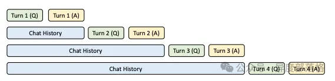
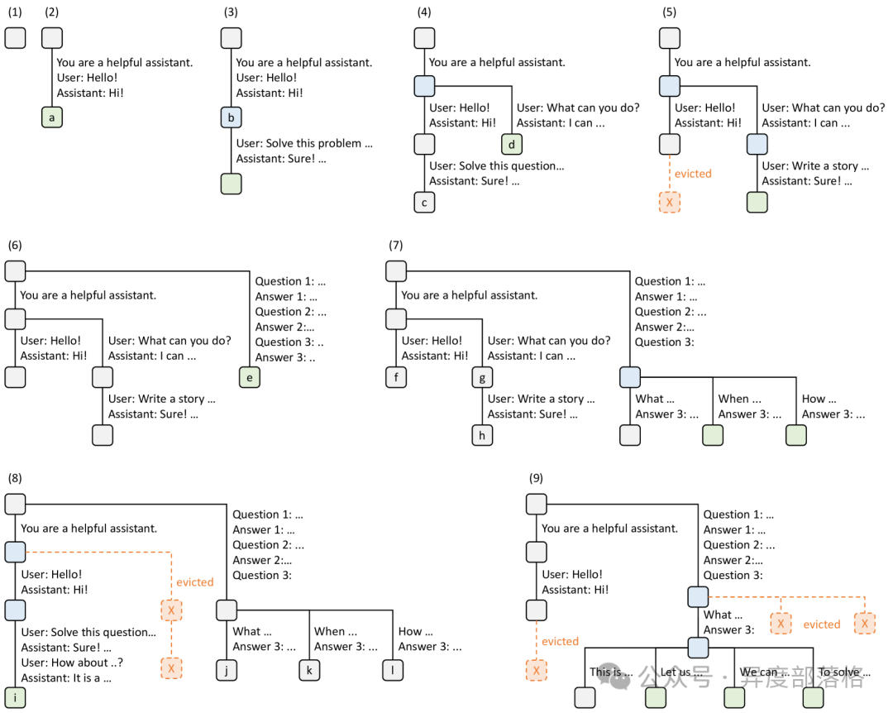
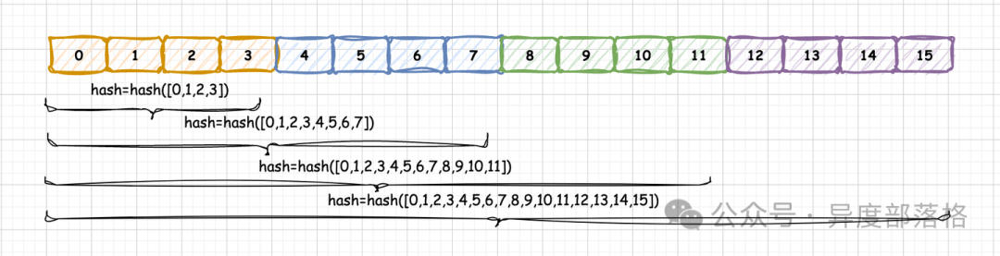
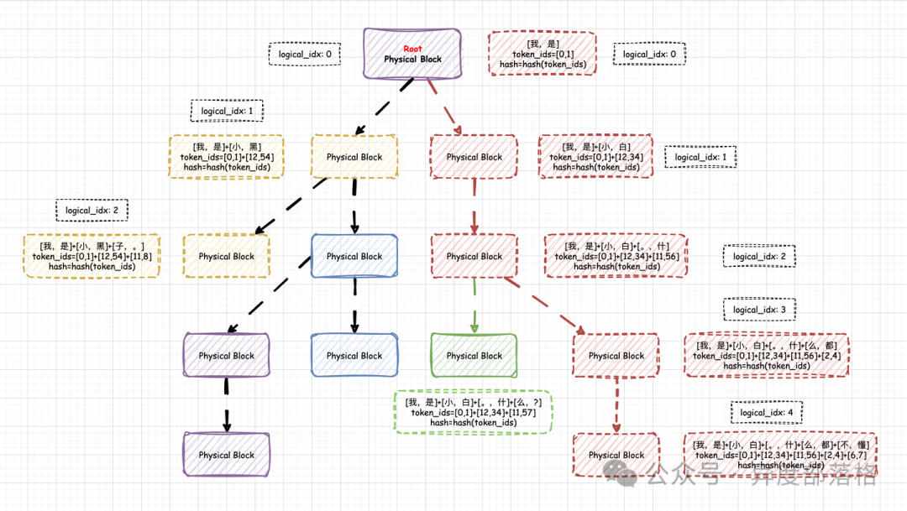
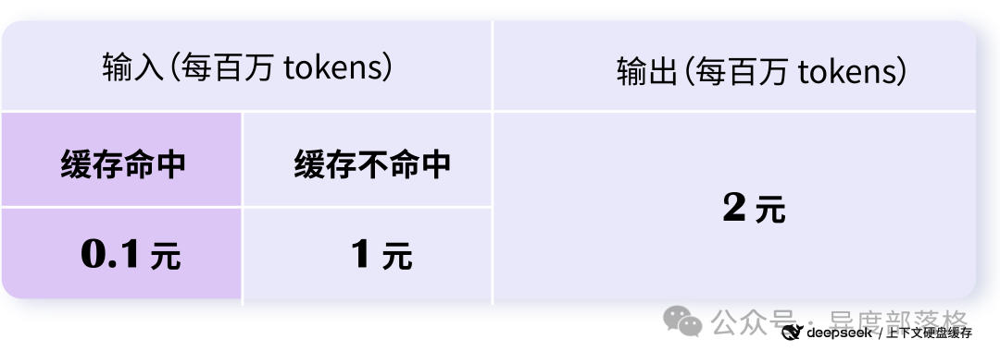

# LLM推理优化&-&Prefix&Caching
> 作者: 异度部落格
> 
> 原文: [https://mp.weixin.qq.com/s/ItU20R5zmgXE-NQBDLDmQw](https://mp.weixin.qq.com/s/ItU20R5zmgXE-NQBDLDmQw)

概述
--

在 PagedAttention 中，KV Cache 仅在单个请求内复用，尚未实现跨请求的 KV Cache 复用。在多轮对话场景下，下一轮的 prompt 实际上可以视作上一轮的 prompt 与 completion 的组合。如果新一轮的 prompt 能够直接复用上一轮计算得到的 KV Cache，就能实现跨请求的 KV Cache 复用，从而显著提升 prefill 的性能，并降低新一轮请求的首次 Token 计算时间（Time To First Token，TTFT）。这种优化方法被称为 **Prefix Caching**，其核心思想是缓存系统提示和历史对话中的 KV Cache，以便在后续请求中复用，从而减少首次 Token 的计算开销。

本文将介绍 Prefix Caching 在一些大型模型推理系统中的实现。

SGLang 中的 Prefix Caching
------------------------

**RadixAttention** 是在 SGLang 的论文《Efficiently Programming Large Language Models using SGLang》中提出的，目的是为了实现 **Automatic KV Cache Reuse**。SGLang 通过 RadixAttention 来实现 Prefix Caching，其实现的关键点如下：

1.  每次请求结束后，当前请求中的 KV Cache 不会立即丢弃，而是通过 RadixAttention 算法将其保留在 GPU 显存中。RadixAttention 算法还将序列 token 与 KV Cache 之间的映射关系保存在 RadixTree 数据结构中。
2.  当新的请求到达时，SGLang 的调度器通过 RadixTree 进行前缀匹配，判断新请求是否能够命中缓存。如果命中缓存，调度器将复用已有的 KV Cache 来处理该请求。
3.  由于 GPU 显存资源有限，缓存中的 KV Cache 不能无限期保留，因此需要设计相应的逐出策略。RadixAttention 采用的逐出策略是 **LRU**（Least Recently Used，最近最少使用），这一策略与操作系统中的 LRU 页面置换算法非常相似。具体的逐出流程可参见 SGLang 的论文，其中有详细描述。

**图例含义**

*   **节点：**
    *   **绿色：新加入的节点**
    *   **蓝色：当前时间点访问的缓存节点**
    *   **红色：被淘汰的节点（LRU 策略）**
*   **边：代表子字符串或一系列 Token。**
*   **树结构：表示对请求的共享和分支操作。**

**逐步演变过程**

1.  **步骤 (1)：**
    *   **初始状态：Radix 树为空。**
2.  **步骤 (2)：**
    *   **用户请求：用户发送消息 "Hello!"。**
    *   **服务器响应："Hi!"。**
    *   **结果：将系统提示词 "You are a helpful assistant."、用户消息 "Hello!" 和助手回复 "Hi!" 作为一个新节点（a）添加到树中。**
3.  **步骤 (3)：**
    *   **新请求：服务器接收到新的输入（如请求解决问题）。**
    *   **共享前缀：服务器找到树中前缀（即第一轮对话）并重用 KV Cache。**
    *   **结果：将新轮次（Solve this problem...）附加到树中新节点 ****b****。**
4.  **步骤 (4)：**
    *   **新会话开始：启动第二个聊天会话。**
    *   **节点拆分：将节点 ****b**** 拆分为两个节点，以便两个会话共享系统提示词。**
    *   **结果：添加新节点 ****c**** 和 ****d****。**
5.  **步骤 (5)：**
    *   **继续第二会话：用户请求 "Write a story"。**
    *   **内存限制触发：由于内存限制，节点 ****c**** 被淘汰（LRU 策略）。**
    *   **结果：新轮次附加在节点 ****d**** 之后。**
6.  **步骤 (6)：**
    *   **少样本学习请求：服务器收到包含多个示例的查询。**
    *   **根节点拆分：因为新请求与现有节点不共享前缀，根节点被拆分。**
    *   **结果：添加新节点 ****e****。**
7.  **步骤 (7)：**
    *   **批量少样本查询：服务器收到更多包含相同少样本示例的查询。**
    *   **节点共享：将节点 ****e**** 拆分以共享少样本示例。**
    *   **结果：添加新节点 ****f****、****g**** 和 ****h****。**
8.  **步骤 (8)：**
    *   **会话恢复：服务器收到第一个聊天会话的新消息。**
    *   **LRU 淘汰：由于第二个聊天会话（节点 ****g**** 和 ****h****）是最近最少使用的，因此被淘汰。**
    *   **结果：添加新节点 ****i****。**
9.  **步骤 (9)：**
    *   **自一致性采样：服务器接收到针对节点 ****j**** 中问题的采样请求（例如生成多个答案）。**
    *   **内存腾出空间：节点 ****i****、****k**** 和 ****l**** 被淘汰。**
    *   **结果：树中新增用于采样的分支。**

vllm 中的 Prefix Caching
----------------------

在 vLLM 中，Prefix Caching 使用的是 RadixAttention 算法，但是采用哈希（hash）码作为物理 KV Block 的唯一标识，这种实现方式较为简洁，且工程上更易操作。我们暂且将这种实现称为 **Hash RadixAttention**。所有当前 KV Block 的哈希码**依赖于此前所有 KV Block 的 token\_ids**，因此，这个唯一的哈希码实际上也**代表着一种唯一的前缀关系**。  
这种哈希编码的实现实际上具备前缀树（Prefix Tree）的功能。并且，这棵前缀树是以 **PhysicalTokenBlock** 为单位的，每个节点代表一个实际的 **PhysicalTokenBlock**，节点内容为该 **PhysicalTokenBlock** 的哈希码，哈希码则代表从树的根节点到当前 **PhysicalTokenBlock** 的唯一路径。

Deepseek 中的 Prefix Caching
--------------------------

Deepseek API 提供的 Prefix Caching 产品名为 **Context Caching**。与 SGLang 和 vLLM 不同，Deepseek 采用的是上下文硬盘缓存技术，将预计未来会重复使用的内容缓存在分布式硬盘阵列中，而非 GPU 显存中。这种方式更适合提供 **MaaS（Model-as-a-Service）** 平台的需求。  
对于缓存命中的部分，Deepseek 收费 0.1 元每百万 Tokens；而对于未命中的部分，收费 1 元每百万 Tokens：

参考资料
----

*   大模型推理加速与 KV Cache（五）：Prefix Caching
*   \[Prefill 优化\]\[万字\]🔥 原理&图解 vLLM Automatic Prefix Cache(RadixAttention): 首 Token 时延优化