# LLM推理加速技术简介
> 知乎 : [https://zhuanlan.zhihu.com/p/691360124](https://zhuanlan.zhihu.com/p/691360124)

文章内容主要参考综述：1. Towards Efficient Generative Large Language Model Serving: ASurvey from Algorithms to Systems. 2. A Survey on Model Compression for Large Language Models.

生成式大型语言模型（LLM）已成为人工智能（AI）取得重大进步的驱动力，并在广泛的与语言相关的任务中表现出卓越的性能。基于Transformer的体系结构的出现，如GPT系列、LLaMA系列、OPT、BLOOM、Mistral、DeciLM、Baichuan和GLM等，彻底改变了自然语言处理（NLP）任务的方式。除了NLP之外，这些模型被应用到了大量其他任务中，包括自动编程、科学发现、个性化助手、艺术创作，显式了其多功能性和对各个行业的深远影响。但是，LLM的巨大成功也带来了一些挑战，特别是其在提供服务时巨大的计算需求。巨大的模型规模和复杂性，加之对大量计算资源和存储资源的需求，已经阻碍了它们在现实应用中的部署，特别是在要求低延迟、高吞吐的场景中。研究人员和从业者在克服LLM有效部署的障碍方面进行了大量研究，本报告首先列举了高效LLM服务面临的挑战，然后梳理了针对这些挑战的具有代表性的解决方案，主要包括解码优化、模型结构优化、模型压缩和量化、需求调度、内存管理、常用框架等方面。因为并行计算适用于LLM的训练和推理，主要包括数据并行、张量并行和流水线并行，以及它们的混合，本部分报告不对其进行详细介绍。

**1\. 高效LLM服务的挑战**
------------------

**延迟和响应时间**：高效的大模型推理要求低延迟和快速响应时间，特别是在实时应用中，如对话机器人、虚拟助手和交互系统。平衡模型复杂性和推理速度是一个关键的挑战，需要优化算法和系统结构，在不损失精度的情况下减小响应时间。

**内存占用和模型规模**：由于大语言模型的规模和包含的大量参数导致其巨大的内存需求。在内存受限的设备上部署大模型是一个挑战，需要发展有效的模型压缩技术和系统优化方法来减少内存占用，而不降低模型性能。

**可拓展性和吞吐量**：在生产环境中，推理系统通常面临变化的请求负载。在保证可扩展性和高吞吐量以同时处理多个需求方面，需要并行计算、需求调度和其它的系统级优化等方式实现在资源之间有效地分配计算工作负载。

**硬件兼容性和加速**：有效的利用硬件资源对于大模型推理十分重要。将LLM适应到多样的硬件平台和架构，如CPU、GPU和专用加速器，需要充分挖掘底层硬件潜力的算法设计和优化方法。

**准确性和效率的平衡**：优化LLM推理的性能有可能需要牺牲模型的准确性。在模型规模、计算复杂度和性能之间保持适当的平衡是一个有挑战的任务，需要仔细考虑和评估各种算法和系统级技术带来的影响。

**2.** **解决方案**
---------------

### **2.1** **解码优化**

影响现有大模型推理效率的一个主要限制是其使用的自回归式解码机制，需要依次逐个生成输出token，具体过程如图1所示。自回归式解码过程分为两个阶段：预填充（prefill）和解码（decoding）阶段。在预填充阶段，主要编码输入查询向量并生成起始token；在解码阶段，每次模型循环以已生成的tokens为输入，预测下一个tokens。自回归式推理导致计算量增加，耗费时间。为了解决自回归式解码存在的问题，研究人员提出了多种解决的方案，如图2所示。

> 图1 自回归解码

**非自回归式解码**：这一类方法首先被用于机器翻译，通过在解码期间打破单次间的依赖关系并假设解码过程具有一定程度的条件独立性。为了减少非自回归式解码带来的性能损失，研究人员探索了建模输出依赖关系、迭代地细化输出tokens等方法。此外，分块并行解码通过在基础LLM插入单个前向层来并行预测多个未来位置输出。尽管非自回归式的解码方式可以通过并行方式加速推理过程，但由于缺乏对输出tokens间的依赖关系的了解，[并行解码](https://zhida.zhihu.com/search?content_id=241766028&content_type=Article&match_order=2&q=%E5%B9%B6%E8%A1%8C%E8%A7%A3%E7%A0%81&zhida_source=entity)会影响输出的质量。

[**投机式推理**](https://zhida.zhihu.com/search?content_id=241766028&content_type=Article&match_order=1&q=%E6%8A%95%E6%9C%BA%E5%BC%8F%E6%8E%A8%E7%90%86&zhida_source=entity)：这是一类通过投机执行解决顺序执行限制，并提高解码并行度的方法。在LLM[自回归推理](https://zhida.zhihu.com/search?content_id=241766028&content_type=Article&match_order=1&q=%E8%87%AA%E5%9B%9E%E5%BD%92%E6%8E%A8%E7%90%86&zhida_source=entity)的过程中，每一步解码可以被视为执行有条件分支的程序，即决定生成的下一个token是哪一个。投机式推理通过使用小模型进行多步解码，然后LLM随时验证小模型的输出结果。然后，将投机推理应用于LLM，仍然存在一些挑战，例如，如何使小模型足够轻量且性能足够好，如何利用LLM进行并行验证。SpecInfer通过引入多个小模型，并配以树形的投机推理结构，以及tokens验证机制来解决相应的挑战，并提供了低延迟LLM服务系统实现。[投机解码](https://zhida.zhihu.com/search?content_id=241766028&content_type=Article&match_order=1&q=%E6%8A%95%E6%9C%BA%E8%A7%A3%E7%A0%81&zhida_source=entity)的最大优势是其在增加并行性的同时没有改变输出，这是因为输出由LLM验证，在出错时会进行改正。

**提前停止**：这一类方法基于现有LLM的深度多层结构，利用早停机制来加速解码过程。直接动机是模型的浅层输出足以推断目标分布，基于内部分类器产生预测，而不是跑完整个LLM。但中间层输出的信息不足可能会影响输出质量。

**级联推理**：受不同复杂度的推理需求的驱使，这一类方法通过使用合适规模的LLM来最小化模型的响应时间。Frugal-GPT通过一种可学习的方式自适应地将queries分配给不同的LLM APIs，以此来优化代价和性能。总体而言，级联推理是提高推理效率的一个有希望的方向，但是，设计一种准确的调度机制以避免降低仍然模型质量是一项挑战。

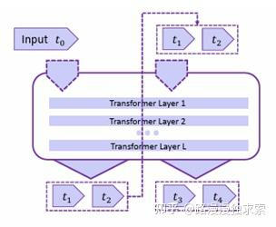

> （a）非自回归式推理

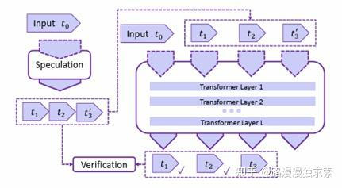

> （b）投机推理

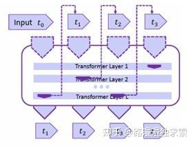

> （c）提前停止

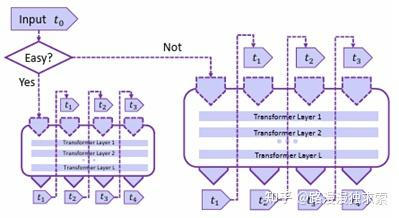

> （d）级联推理

图2 解码优化方法

### **2.2** **模型结构优化**

研究人员提出许多新的模型结构来在模型规模、性能和效率间取得平衡，为快速高效推理提供了新的路径。

**注意力简化**：与自注意力计算密切相关的挑战是其计算复杂度很高，与输出序列长度的平方相关。为了将标准的注意力简化为对长序列更高效的替代方案，研究人员利用一些已有的注意力简化方法，在略微影响解码质量的条件下，减少KV缓存和计算复杂度，主要包括：选择性注意力、滑窗+膨胀注意力、全局token注意力和哈希稀疏注意力，如图3所示。选择性注意力在计算时仅选择对后续解码重要的token进行注意力计算；滑窗+膨胀注意力在计算注意力时设置了窗口，仅计算窗口内部token间的注意力，同时为了增强条件，不断计算窗口扩大；全局token注意力对生成的tokens进行摘要，每一步生成一个全局token进行注意力计算；哈希稀疏注意力为每个Key和Query生成哈希码，注意力计算仅在有相同哈希码的tokens间进行。

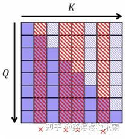

> 选择性注意力

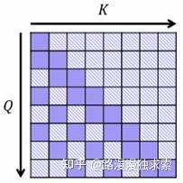

> 滑窗+膨胀注意力

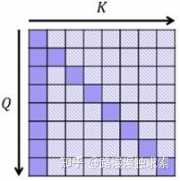

> 全局token注意力

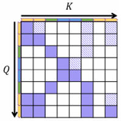

> 哈希稀疏注意力

图3 注意力优化

**激活共享**：共享注意力计算的中间激活状态是另外一种提高注意力计算效率的方法。这一方法的出发点是不同层的[注意力矩阵](https://zhida.zhihu.com/search?content_id=241766028&content_type=Article&match_order=1&q=%E6%B3%A8%E6%84%8F%E5%8A%9B%E7%9F%A9%E9%98%B5&zhida_source=entity)分布存在相似性，通过复用相似的注意力矩阵来减少计算耗时。代表性的工作是Multi-query attention (MQA)和Group-query attention (GQA),相关原理如图4所示。MQA使不同的注意力head共享一组Keys和Values，以减少[增量推理](https://zhida.zhihu.com/search?content_id=241766028&content_type=Article&match_order=1&q=%E5%A2%9E%E9%87%8F%E6%8E%A8%E7%90%86&zhida_source=entity)过程中的内存带宽要求，PaLM和ChatGLM2-6B模型应用了这一技术。GQA将单组Keys和Values的限制放宽到了多组，每组对应对应一组Queries，[LLaMA-2](https://zhida.zhihu.com/search?content_id=241766028&content_type=Article&match_order=1&q=LLaMA-2&zhida_source=entity)和Mistral-7B模型应用了这一技术。激活共享对于推理加速的贡献主要来自于两个方面：一方面降低内存数据读取，减少计算单元等待，提高了计算效率；另一方面，KV缓存变小，推理显存占用减少，对应的可以增大批次大小，提高计算资源利用率。

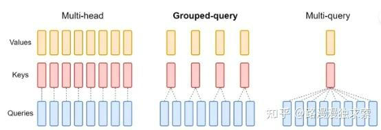

> 多头注意力机制 GQA MQA

图4 激活共享

**条件计算**：稀疏激活的混合专家系统将一个大模型的能力分解到不同的专家小模型上，这些专家小模型的参数规模更小，在不同的数据子集上进行训练，具有解决某个特定问题的能力。混合专家系统可以根据输入路由到不同的专家小模型上，从而产生优于大模型的计算和存储效率，其原理如图5所示。专家模型的推理是由输入条件进行路由决定的，故称条件计算。随着大模型的规模不断增长，混合专家系统是保证未来大模型可扩展性和效率的有效路径。同时，这一系统的动态性能也要求在分布式通信和GPU核等方面进行特定优化，以提高其推理的效率。

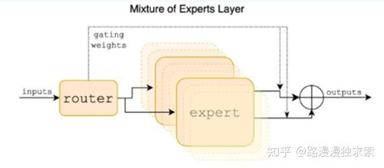

> 图5 混合专家系统

### **2.3** **模型压缩**

模型压缩和量化旨在通过创建高效紧凑的模型来降低LLM的内存和计算资源需求，而不显著降低模型性能，主要涉及网络剪枝、知识蒸馏、参数量化和低秩分解等方面，相关技术如图6所示。

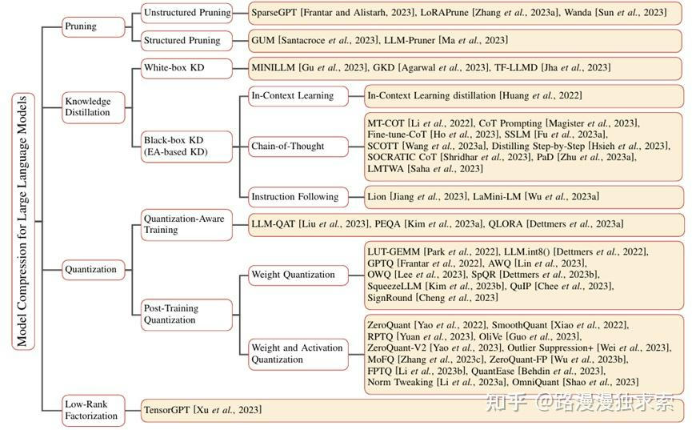

> 图6 LLM的模型压缩方法

**网络剪枝**：是一种通过移除网络非必须或者冗余组件来减小模型规模或复杂度的一种方法。因为很多参数对网络性能的影响很小，剪枝掉这些参数不会使得模型性能显著下降。根据剪枝方式的不同，网络剪枝分为非结构化剪枝和[结构化剪枝](https://zhida.zhihu.com/search?content_id=241766028&content_type=Article&match_order=2&q=%E7%BB%93%E6%9E%84%E5%8C%96%E5%89%AA%E6%9E%9D&zhida_source=entity)，二者最大的不同在于剪枝目标和由此而得的网络结构。非结构化剪枝通过移除特定的参数来简化LLM，而不考虑其中间结构。这一方法的目标是LLM中的单个参数或者神经元，通常通过一个阈值来筛选神经元，低于阈值的输出被置零。但是，非结构化剪枝忽略了LLM的结构，会导致不规则的稀疏结构，研究人员通过额外训练模型来解决这一问题。SparseGPT提出one-hot剪枝策略，无需对模型进行训练，其将剪枝视为一个拓展的稀疏回归问题并利用近似稀疏求解器来解决它。结构化剪枝基于一定的规则移除网络中的局部结构，如通道或层。这种方法同时针对整套权重，提供在保持整个LLM结构完整的同时降低模型复杂性和内存占用的优势。

**知识蒸馏**：旨在将知识从复杂的教师模型迁移到简单的学生模型，从而实现模型简化。在基于LLM的知识蒸馏中，LLM通常被作为教师模型，常用的方法有两大类：白盒知识蒸馏和黑盒知识蒸馏。白盒知识蒸馏中，不仅教师模型的输出可以获得，其参数也是可见的，通常通过小模型来学习和复制大模型的知识和能力。这种方式使得学生LM对教师LLM的中间状态和知识表示有更深的了解，从而产生性能提升。黑盒知识蒸馏中，学生模型只能获得LLM的预测结果，通常是利用LLM APIs生成的提示-回复对来微调小模型。此外，LLM表现出来的能力涌现特性也催生了相应的蒸馏方法，主要由上下文学习（In-Context Learning）、[思维链](https://zhida.zhihu.com/search?content_id=241766028&content_type=Article&match_order=1&q=%E6%80%9D%E7%BB%B4%E9%93%BE&zhida_source=entity)（Chain-of-Thought）和指令遵循（Instruction Following）。上下文学习利用包含任务描述和任务例子的结构化语言提示作为示例输入LLM，通过这些任务样例，LLM就能够在无需梯度更新的情况下掌握和进行新任务的推理。思维链通过将中间推理步骤整合到提示中来作为示例，而不是仅提供输入-输出对。指令遵循通过让LLM阅读任务描述，而不是少样本示例来增强其执行新任务的能力。

**模型量化**：旨在通过改变参数和输出的数据类型来减少内存和计算负载。量化方法可以分为量化训练（QAT）和训练后量化（PTQ），二者的不同在于使用量化压缩模型的阶段，通常有8-bit量化、4-bit量化等。QAT在模型训练或者微调的阶段就对模型进行量化操作，使得模型能够在训练阶段适应低精度表示，从而解决量化带来的精度损失。而PTQ是在训练完成之后进行量化，主要目标是在无需改变模型结构或额外训练的条件下实现LLM存储和计算复杂度的降低。

**低秩分解**：旨在通过对LLM的参数矩阵进行[矩阵分解](https://zhida.zhihu.com/search?content_id=241766028&content_type=Article&match_order=1&q=%E7%9F%A9%E9%98%B5%E5%88%86%E8%A7%A3&zhida_source=entity)来近似它，将原有参数变为两个或者更多维度小的矩阵，以此实现模型存储和计算的简化。

### **2.4** **需求调度**

有效调度传入的推理请求对于优化LLM服务至关重要，其目标是利用请求调度算法最大化资源的利用率，保证响应时间在延迟服务级别目标（SLO）内，并有效地处理不同的请求负载。LLM服务的需求调度和机器学习服务的调度类似，都是为了高效处理输入请求，并优化资源利用。常用的方法包括连续分批、抢占式调度、块状预填充等。

**连续分批**：在LLM服务中，用户的需求是多样的，不同的请求所需生成的回复的文本长度不一，且难以预测。有些需求可以很快完成回复生成，而有些需求往往需要较长的生成时间，如果将这些需求放置在同一个批次中进行处理，传统的批次处理方法需要等所有需求的回复均生成完成才会释放相应的计算和存储资源，这样会导致资源的浪费。连续分批技术基于大模型自回归式推理的特性，动态的处理一个批次中的请求，称为Iteration-level Scheduling。对于Early-finished Requests,将其从Batch中删除，释放相应的内存和计算资源；在GPU推理的不同步之间，评估释放的空间是否允许新请求的处理，如果满足，则将新请求插入到推理批次之中。动态批次使得请求间的等待减少，提高了资源利用率。

**抢占式调度**：请求调度策略一般是先到先服务（First-Come-First-Serve， FCFS），即先输入的请求的服务优先级最高。但在LLM推理的过程包括预填充和解码两个阶段，且预填充阶段生成第一个token用时相对较长，对于短回复来说，预填充阶段的时间处于主导地位。LLM推理的这种特性使得先到先服务的策略会使得用户的平均等待时间变长，一个解决的策略是将剩余执行时间最少的请求的优先级设为最高。由此发展出多种不同的调度策略，相关原理如图7所示，J表示不同的Job，T表示不同的推理阶段。[多级反馈队列](https://zhida.zhihu.com/search?content_id=241766028&content_type=Article&match_order=1&q=%E5%A4%9A%E7%BA%A7%E5%8F%8D%E9%A6%88%E9%98%9F%E5%88%97&zhida_source=entity)（Multi-level Feedback Quence，MLFQ）对所有的需求采用轮转的方式进行调度，即先执行所有任务的预填充阶段，然后再执行解码阶段。Skip-Join MLFQ根据预填充时间对任务设置优先级，然后优先执行预填充时间短的需求。最短剩余时间（Shortest Remaining Processing Time, SRPT）调度策略是最理想的调度方式，即永远优先执行当前剩余时间最少的任务。但通常情况下，任务执行时间难以预估，往往采用与其调度效果最接近的Skip-Join MLFQ进行需求调度。

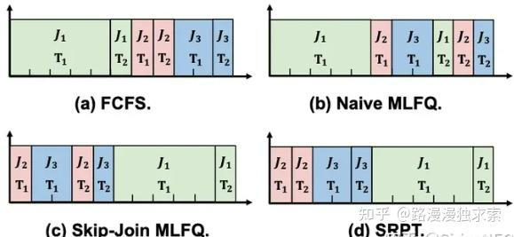

> 图7 需求调度方法

**块状预填充**：当使用流水并行性时，不同的预填充和解码时间也会导致微批量之间的不平衡，从而导致气泡导致的效率进一步降低. 将预填充请求拆分为大小相等的块, 然后使用预填充块构建批次, 用解码器填充剩余的时间。

### **2.5** **内存管理**

高效的内存管理也是LLM服务的一大挑战。随着长序列推理需求的不断增加，相较于模型参数和其它激活所需的存储空间，KV缓存的内存占用需要着重考虑并进行优化。高吞吐的LLM服务需要一次批处理多个请求，为了节省计算时间，往往选择将推理过程中重复计算的Keys和Values存储起来，但因为不同请求的回复长度不同且无法预估，通常的做法是为每个批次预留一个最大可能序列的内存空间占用大小，这样做会造成内存的浪费。同时，不同批次预留的内存空间大小可能不一，如果内存管理效率低下，则会造成内存碎片，即不足以存储一个批次KV缓存的内存空间会被闲置，这也会浪费内存空间，限制批次的大小。为了对KV缓存的内存占用进行高效管理，研究人员提出了不同的内存优化方法，代表性工作是PageAttention和TokenAttention，相应的原理如图8和图9所示。

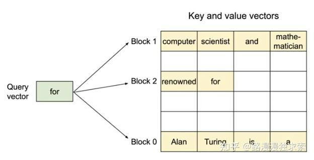

> 图8 PageAttention

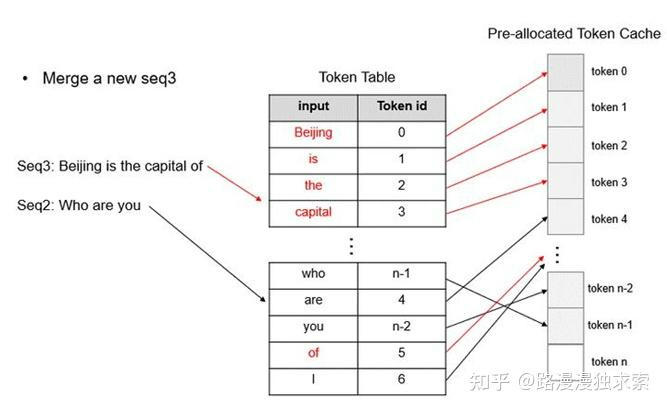

> 图9 TokenAttention

PageAttention是一种受操作系统中经典虚拟内存和分页技术启发的方法，允许同一个批次请求的KV块存储在不连续的物理内存中。TokenAttention更进一步的将KV缓存的内存管理细化到了token级别内存管理，进一步减少了内存碎片，实现了高效的共享内存，允许了更精确和细粒度的内存管理，从而优化了内存利用率。

3\. 结语
------

基于上述LLM推理加速方法，许多研究机构已经开发出了支持部分优化技术的加速框架，后续将会对部分开源的框架进行简介。