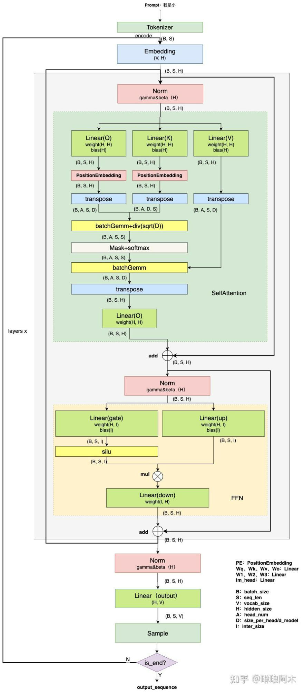

# 图文详解LLM&inference&KV&Cache
> _**作者: 琳琅阿木**_
> 
> _**原文:**_ [_**https://zhuanlan.zhihu.com/p/15949356834**_](https://zhuanlan.zhihu.com/p/15949356834)

截至目前,[KV cache](https://zhida.zhihu.com/search?content_id=252212375&content_type=Article&match_order=1&q=KV+cache&zhida_source=entity) 已成为大语言模型(LLM)推理的核心组件,几乎可以说是推理过程中的基石.尽管各个平台已有大量关于 KV cache 的相关文章,但读完后,很多内容往往缺乏对以下几个关键问题的深入剖析:

1.  为什么可以使用`KV cache`?
2.  `KV Cache`究竟节省了那些计算？
3.  `KV cache`的引入对后续LLM[推理优化](https://zhida.zhihu.com/search?content_id=252212375&content_type=Article&match_order=1&q=%E6%8E%A8%E7%90%86%E4%BC%98%E5%8C%96&zhida_source=entity)有何影响？

因此,基于个人的理解,我写下了这篇文章,旨在从更全面的角度探讨 KV cache 的作用与应用.如果你在阅读过程中有新的见解,欢迎留言交流; 如果发现文中有不准确的地方,也请不吝指正.

1\. 原理
------

这里从LLM的整个端到端推理过程出发,分析其计算优化的思路,进而引出 KV cache 在这一过程中的优化作用,而不是先行介绍 KV cache 的定义.通过对推理流程中的关键环节进行剖析,我们能够更好地理解 KV cache 如何在节省计算、提高效率方面发挥作用.

对LLM基础架构不了解的可以参考我之前写的这篇文章: [琳琅阿木: 图文详解LLM inference: LLM模型架构详解](https://zhuanlan.zhihu.com/p/14413262175)

回顾LLM的推理过程:

输入一个预设的**prompt**,将其传入模型,进行计算,最终得到`shape`为`(batch_size, seq_len, vocab_size)`的`[logits](https://zhida.zhihu.com/search?content_id=252212375&content_type=Article&match_order=1&q=logits&zhida_source=entity)`,选用`sequence`中最后一个`token`的`logit`做采样,得到**首字**.随后进入**自回归**阶段,模型依次利用前一步生成的`token`,计算得到`logit`,采样得到下一个`token`,直至完成整个序列的生成.

> 图1: 推理过程简单版

无论是首字还是后续的 token,在预测下一个 token 时,模型都仅使用当前已知序列中的最后一个 token 的 logit 进行采样.

尽管在生成下一个 token 时,采样仅基于当前已知序列中最后一个 token 的 logit,但实际上,模型在计算 logits 时,会综合考虑整个已知序列的信息,以确保生成的 token 具有连贯性和一致性.而这个过程就是通过`Attention`计算来实现.

> 图2: LLM inference流程(详细版)

再次回到这张详细的流程图,从后往前进行分析.已知在当前步骤下需要预测下一个 token,那么我们所需的是当前 token(即已知序列中的最后一个 token)对应的 logit.这个 logit 用于采样下一个 token.

### 1.1. Linear分析

> 图3: Linear计算过程

上图为`Linear`的计算过程,很容易发现,对于输出的每一行,只和输入的最后一行有关.

### 1.2. Norm分析

这里直接看`RMSNorm`的源码: [https://github.com/meta-llama/llama/blob/main/llama/model.py#L34](https://link.zhihu.com/?target=https%3A//github.com/meta-llama/llama/blob/main/llama/model.py%23L34)

核心计算过程为: `x * torch.rsqrt(x.pow(2).mean(-1, keepdim=True) + self.eps)`

可以看出,Norm 计算对每个 token 对应的向量进行归一化,因此,得到最后一个 token 对应的输出时,不会受到之前 token 的影响,二者互相独立.

### 1.3. FFN分析

FFN计算过程本质就是两个(或3个)`Linear`.因此,可以很容易得出结论: 最后一个 token 对应的输出与其他 token 的输入无关.

### 1.4. Attention分析

> 图5: Attention计算图解

从上图可以看出,要得到最终所需的 Attention output (绿色部分,即最后一个 token 对应的输出),我们需要最后一个 token 对应的 Q 和当前所有token对应 K 和 V .

### 1.5. Embedding分析

Embedding过程本身是根据每一个token,去找token对应的向量,本身各个token之间就是独立的.

### 1.6. 总结

由1.1节~1.5节可知,获取当前token对应的logit,仅`Attention`计算过程中, K 和 V 需要用到之前token的信息,其余计算各个token对应的向量都是独立的.

在推理过程中,当前序列中,除最后一个 token 外,前面所有 token 的 KV cache 在历史迭代中已经计算过.因此,我们可以预先分配一块显存,将这些已计算的 KV cache 缓存起来,供下一个step使用.

2\. 杂谈
------

到这里可以试着回答下下面几个问题:

1.  为什么可以使用KV cache?
2.  KV Cache节省了Self-Attention层中哪部分的计算？
3.  KV Cache对MLP层的计算量有影响吗？
4.  KV Cache对block间的数据传输量有影响吗？

不知道大家在阅读或者在盘整个流程时有没有产生过这样的疑惑,既然计算最后一个token用不到,那计算 Q ,以及FFN这些计算,能否只算最后一个？

答案是不能,因为有多个layer,当前layer计算 K 和 V需要依赖上一层的输出,FFN这些只计算最后一个token,会导致下一层的 K 和 V 不对,进而影响最终结果.

那哪一些计算可以化简呢？

3\. 计算量分析
---------

现在对图2进行修改,将带[kv cache](https://zhida.zhihu.com/search?content_id=252212375&content_type=Article&match_order=1&q=kv+cache&zhida_source=entity)的场景添加进来,LLM推理过程分解为`Prefill`和`Decoding`两个阶段;

**Prefill 阶段**: 发生在计算第一个 token(首字)时,此时 Cache 为空,需要计算所有 token 的 Key 和 Value,并将其缓存.由于涉及大量的 GEMM 计算,推理速度较慢.

**Decoding阶段**: 发生在计算第二个token以及后续所有token,知道结束.这时Cache中有之前token的`key`和`value`值,每轮计算可以从`Cache`中读取历史`token`的`key`和`value`,只需计算当前`token`对应的`key`和`value`,并写入`Cache`.

> 图5: LLM inference流程(KVCache)

假设序列长度为S.

### 3.1. Attention计算量分析

**输入变换和**[**线性投影**](https://zhida.zhihu.com/search?content_id=252212375&content_type=Article&match_order=1&q=%E7%BA%BF%E6%80%A7%E6%8A%95%E5%BD%B1&zhida_source=entity): 从图5易知, Q 的计算由`GEMM`变为`GEMV`, K 和 V 由于`Cache`的存在,也只用计算最后一个token对应 K 和 V,计算由`GEMM`变为`GEMV`,最后的线性投影部分同理,计算量为原来的 1/S .

注意力得分: 从图5可知,由于当前 Q 的长度为1,因此计算 Score 和 Attention Ouput 的过程也由`GEMM`变为`GEMV`,计算量为原来的 1/S .计算复杂度由 O(S2) 降为 O(S) .

softmax: 从图5可知,softmax过程输入数据量是原来的1/S,易知计算量为原来的1/S.

**其他**: 位置[编码过程](https://zhida.zhihu.com/search?content_id=252212375&content_type=Article&match_order=1&q=%E7%BC%96%E7%A0%81%E8%BF%87%E7%A8%8B&zhida_source=entity)和`transpose`过程涉及计算量不多,div过程易知计算量为原来的1/S.

综上,使用`KVCache`后,`Attention`过程计算量整体降低为原来的1/S,在序列比较长时,计算复杂度由O(S2) 降为 O(S) .

### 3.2. Linear和FFN计算量分析

`FFN`过程和最后一个`Linear`都是[线性过程](https://zhida.zhihu.com/search?content_id=252212375&content_type=Article&match_order=1&q=%E7%BA%BF%E6%80%A7%E8%BF%87%E7%A8%8B&zhida_source=entity),计算量和输入数据的量成正比关系.由图5易知,输入数据变为原来的1/S,可得计算量为原来的1/S.

综上所述,使用 KV Cache 能够显著减少非首字阶段的模型计算量.在每一步推理中,仅需要计算新增的 token 与先前序列的关联,而不是重新计算整个序列的所有注意力.这使得模型的整体计算复杂度从 O(S2) 降至 O(S) .随着序列长度的不断增加,这种优化能够有效降低推理的时间和资源消耗,尤其是在处理长序列或高并发场景时表现尤为突出.

4\. 后记
------

KV Cache 的引入将大语言模型的推理过程自然地划分为 **Prefill** 和 **Decoding** 两个阶段.由于 [KV Cache](https://zhida.zhihu.com/search?content_id=252212375&content_type=Article&match_order=7&q=KV+Cache&zhida_source=entity) 的存在,Decoding 阶段的计算量大幅降低,这两个阶段也因此呈现出截然不同的计算特点:

*   **Prefill阶段**: 以[计算密集型](https://zhida.zhihu.com/search?content_id=252212375&content_type=Article&match_order=1&q=%E8%AE%A1%E7%AE%97%E5%AF%86%E9%9B%86%E5%9E%8B&zhida_source=entity)(compute-bound)为主.该阶段需要对整个输入序列执行完整的Transformer计算,涉及大量[矩阵乘法](https://zhida.zhihu.com/search?content_id=252212375&content_type=Article&match_order=1&q=%E7%9F%A9%E9%98%B5%E4%B9%98%E6%B3%95&zhida_source=entity)和注意力操作,计算复杂度较高.
*   **Decoding阶段**: 以内存密集型(memory-bound)为主.由于 KV Cache 的加入,Decoding 阶段只需对新增的 token 与缓存内容进行增量计算,计算量显著降低,但频繁的内存访问和更新使其更加依赖内存带宽.

这些阶段的不同特性催生了针对性优化策略:

Prefill阶段优化: 

*   **Prefix Cache**: 对常用的前缀序列提前缓存其计算结果,避免重复计算,提高效率.
*   **Chunked Prefill**: 将长序列分块处理,优化内存占用和并行计算效率.

**Decoding阶段优化**:

*   **Flash Decoding**: 通过高效的内存布局和缓存管理策略,减少内存访问延迟并提高显存利用率.

总结来看,针对不同阶段优化的设计思路,充分利用了计算和内存之间的权衡,进一步提升了[大模型推理](https://zhida.zhihu.com/search?content_id=252212375&content_type=Article&match_order=1&q=%E5%A4%A7%E6%A8%A1%E5%9E%8B%E6%8E%A8%E7%90%86&zhida_source=entity)的性能和资源利用率.