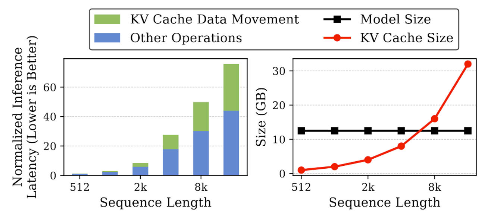
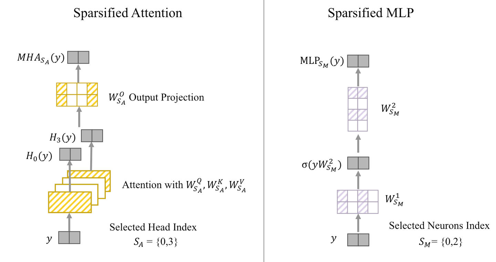

# 大模型推理加速&KV&Cache&Sparsity&稀疏化&方法
> **作者: 歪门正道**
> 
> **原文:** [**https://zhuanlan.zhihu.com/p/701580870**](https://zhuanlan.zhihu.com/p/701580870)

1\. 背景 - 大模型KV Cache
--------------------

大模型推理加速基本绕不开KV Cache。大模型自回归解码的方式，每次解码出一个新token都要放回原序列继续计算出下一个token，为了减少重复计算，**将**[KV 矩阵](https://zhida.zhihu.com/search?content_id=244037298&content_type=Article&match_order=1&q=KV+%E7%9F%A9%E9%98%B5&zhida_source=entity)**暂存起来，需要时拿出来用，典型的空间换时间**。

KV Cache的介绍可参考 [紫气东来：漫谈 KV Cache 优化方法](https://zhuanlan.zhihu.com/p/659770503)。大模型解码可以分为两个阶段：①prefill阶段是将prompt的KV 矩阵计算出来并保存为cache；②解码(decode)阶段是取出KV cache进行计算，并把新增的k, v 也存入cache。

目前的KV Cache至少有**两个问题**：

1.  \*\*解码阶段从计算密集变成[访存密集](https://zhida.zhihu.com/search?content_id=244037298&content_type=Article&match_order=1&q=%E8%AE%BF%E5%AD%98%E5%AF%86%E9%9B%86&zhida_source=entity)\*\*了。这就导致各家GPU在卷的算力，在解码阶段不是瓶颈了，要想加速解码，得从访存方面下手。
2.  KV Cache随着序列长度增加会越来越大，直至不可接受。

KV Cache的维度可视为\[b, nh, s, nd\]，分别是batch size, head num, sequence length, dimension。从下图可以看出，[MPT-7B模型](https://zhida.zhihu.com/search?content_id=244037298&content_type=Article&match_order=1&q=MPT-7B%E6%A8%A1%E5%9E%8B&zhida_source=entity)在上下文长度7k左右的时候，KV cache的显存占用就超过了模型参数的占用。

  
图片来自 Keyformer: KV Cache Reduction through Key Tokens Selection for Efficient Generative Inference

为了解决上述问题有不少的工作，本文主要聚焦在近期KV Cache Sparsity([稀疏化](https://zhida.zhihu.com/search?content_id=244037298&content_type=Article&match_order=1&q=%E7%A8%80%E7%96%8F%E5%8C%96&zhida_source=entity))方面的工作。KV Cache稀疏化就是把KV Cache的矩阵大小压缩，减少显存占用，上述两个问题都能得到改善。

我将以下几种不需要训练的方法都实现在一个框架中了，代码仓库见：[https://github.com/HarryWu99/llm\_kvcache\_sparsity](https://link.zhihu.com/?target=https%3A//github.com/HarryWu99/llm_kvcache_sparsity) 。**欢迎大家star、提出问题、讨论。**

2\. MQA and GQA
---------------

MQA和GQA的思想类似，虽然是多头注意力，但是KV可以共用一些head。KV的维度是\[b, nh, s, nd\]，这两个方法就是减少nh。MQA是KV只有1个head，Q矩阵共用这1个；而GQA认为1个head太少了，增加了一些head但还是小于Q矩阵的head数，Q矩阵按head分组后共用某1个head。用代码来看更直观一些。

```text-plain
# origin
tmp_attn_score = torch.einsum("bhd, bhsd->bhs", q, K)
# MQA
tmp_attn_score = torch.einsum("bhd, bsd->bhs", q, K)
# GQA
K = K.repeat_interleave(q_head // kv_head, dim=1)
tmp_attn_score = torch.einsum("bhd, bhsd->bhs", q, K)
```

注意解码阶段q矩阵只有1行，表示1个token的信息，维度是\[b, h, 1, d\]，可变为\[b, h, d\]。repeat\_interleave表示把K矩阵的head num维度多复制几个，就可以对应上q矩阵的head num维度进行[矩阵乘](https://zhida.zhihu.com/search?content_id=244037298&content_type=Article&match_order=1&q=%E7%9F%A9%E9%98%B5%E4%B9%98&zhida_source=entity)。

MQA 和 GQA都需要模型在训练阶段就这么设定，如果模型已经训练好了，将KV Cache强行换成这俩方法，效果会很差。

3\. Drop Token
--------------

下面介绍一些不需要改变训练阶段就能用的方法。\[b, nh, s, nd\]维度中，减少s维度，语义上看就像把KV Cache当中一些不重要的token丢弃，以此减少KV Cache大小。这里通常是丢弃K矩阵和V矩阵对应的行，比如K矩阵的大小变为\[b, nh, s', nd\]，V矩阵的大小也变为\[b, nh, s', nd\]，不影响attention计算结果的维度。

### StreamingLLM

文章是：[Efficient Streaming Language Models with Attention Sinks](https://link.zhihu.com/?target=http%3A//arxiv.org/abs/2309.17453)，这种Cache方法也叫做SinkCache。

文章的出发点是想让大模型无限输出，达到“Streaming”，如果不用KV cache计算太慢了，但是用了KV cache显存占用随长度增长，也不可能无限。因此需要丢弃一些KV cache。

之前的做法是[window attention](https://zhida.zhihu.com/search?content_id=244037298&content_type=Article&match_order=1&q=window+attention&zhida_source=entity)，即只保留和当前token距离相近的token。直观上好理解，解码下一个token是临近token影响得比较大，距离远的token就影响小。设置[llama2-7B模型](https://zhida.zhihu.com/search?content_id=244037298&content_type=Article&match_order=1&q=llama2-7B%E6%A8%A1%E5%9E%8B&zhida_source=entity)的KV cache size为2048个token，作者发现window attention在长度将要超过cache size时，输出文本的PPL就爆了。


作者进而发现，**window attention只要加上开头的几个token比如就4个，再操作一下**[位置编码](https://zhida.zhihu.com/search?content_id=244037298&content_type=Article&match_order=1&q=%E4%BD%8D%E7%BD%AE%E7%BC%96%E7%A0%81&zhida_source=entity)，模型输出的PPL就不会爆了，输出到20k长度都很平稳。文中将这种现象叫做Attention Sink。就好像文本的注意力被“沉溺”到了开头的位置。

如何操作位置编码呢？假设token的原位置信息是\[0, 1, 2, 3, 4, 5, 6, 7, 8\]，开头留4个token，临近的留4个token，那么4号token应该被丢弃，丢弃后变成\[0, 1, 2, 3, 5, 6, 7, 8\]。不会按照原位置对其进行位置编码，而是按照\[0, 1, 2, 3, 4, 5, 6, 7\]进行位置编码。这样的方式对[相对位置编码](https://zhida.zhihu.com/search?content_id=244037298&content_type=Article&match_order=1&q=%E7%9B%B8%E5%AF%B9%E4%BD%8D%E7%BD%AE%E7%BC%96%E7%A0%81&zhida_source=entity)比如RoPE、[ALiBi](https://zhida.zhihu.com/search?content_id=244037298&content_type=Article&match_order=1&q=ALiBi&zhida_source=entity)应该都有效。具体实现可以看我这篇文章：[歪门正道：魔改KV Cache，让大模型无限输出！](https://zhuanlan.zhihu.com/p/696355658)

我猜（文中应该没有明确指出）这样修改位置编码的用意是模型在训练时没有见过较大位置编码的数据，如果不用[长度外推技术](https://zhida.zhihu.com/search?content_id=244037298&content_type=Article&match_order=1&q=%E9%95%BF%E5%BA%A6%E5%A4%96%E6%8E%A8%E6%8A%80%E6%9C%AF&zhida_source=entity)，解码到超出模型预设长度之后，效果应该会很差。但是这样操作位置编码后，位置编码的大小都控制在cache size以内了，即使解码超出模型预设长度，模型也还是见过这些位置编码的。

文中还尝试解释了Attention Sink现象，并给了实验论证。

不过streamingllm方法看起来还是稍显暴力。按照位置把中间的token都丢掉了，万一中间的token就是重要的怎么办。下面两个方法就在想办法“识别”出重要的token，然后把不重要的drop掉。

### [H2O](https://zhida.zhihu.com/search?content_id=244037298&content_type=Article&match_order=1&q=H2O&zhida_source=entity): Heavy-Hitter Oracle for Efficient Generative Inference of Large Language Models

这篇文章发表在[NeurIPS](https://zhida.zhihu.com/search?content_id=244037298&content_type=Article&match_order=1&q=NeurIPS&zhida_source=entity) 2023。文中给出几个关键洞察：

1.  Sparsity for small cache size. KV Cache其实是很稀疏的，只要5%就可以达到相同效果
2.  Heavy-Hitters for low miss rate. 一小部分token在整段generation中都是重要的
3.  [贪心法](https://zhida.zhihu.com/search?content_id=244037298&content_type=Article&match_order=1&q=%E8%B4%AA%E5%BF%83%E6%B3%95&zhida_source=entity)。仅将前面的attention分数相加，可以预测之后的attention分数

按照Attention的计算方式可以知道，attention分数比较大的token对计算结果的影响比较大。因此，最为理想的drop token方式是：**预知**未来的token对当前token的注意力分数，然后drop掉那些分数低的token。

因为未来的token还不知道呢，所以要预知。但是又不可能预知，只能预测。拿当前的attention分数预测未来的attention分数，这就是第3条关键洞察。

H2O采用了一种贪心法：对于某个token比如A来说，A以及A之后的token都会对A有注意力，把这些注意力加起来，可以得到A的“**重要性分数**”。将每个token的重要性分数都计算出来，然后丢弃分数最低的那些token即可。


算法如上图所示，实现起来是矩阵按列求和再取topk。文中套用dynamic submodular problem的框架，证明了这样的贪心方法是\*\*[near-optimal](https://zhida.zhihu.com/search?content_id=244037298&content_type=Article&match_order=1&q=near-optimal&zhida_source=entity)\*\*。 \\widetilde{S}\_i\\widetilde{S}\_i 是用上述贪心法剩下的没被drop的[token子集](https://zhida.zhihu.com/search?content_id=244037298&content_type=Article&match_order=1&q=token%E5%AD%90%E9%9B%86&zhida_source=entity)， SS 是某个token子集，near-optimal 意即 \\widetilde{S}\_i\\widetilde{S}\_i 的重要性分数是有个下界的：

\\begin{aligned}f(\\widetilde{S}_i)\\geq(1-\\alpha)(1-1/e)\\max_{|S|=k}f(S)-\\beta\\end{aligned} \\tag\*{}\\begin{aligned}f(\\widetilde{S}_i)\\geq(1-\\alpha)(1-1/e)\\max_{|S|=k}f(S)-\\beta\\end{aligned} \\tag\*{}

理论推导过程感觉挺漂亮的，但是这个结论的作用其实有点扯淡。虽然是有个下界，但这里的α和β都不太清楚，不知道实际的下界在哪。贪心法肯定是有不足的。后来的文章也有批判这一点，如下图给了一个反例。贪心法只能得到先前的token关注哪些信息，有可能前面token不关心的信息，是后续的token关心的信息，而贪心法已经drop掉了，就会影响模型性能。

  
来自 QAQ: Quality Adaptive Quantization for LLM KV Cache

虽说有缺陷，不影响H2O方法的表现还是相当亮眼的。而且贪心法简单的计算方式容易实现，计算起来相对不太耗时（其实这点存疑）。


如上图所示，drop了80%的[KV cache](https://zhida.zhihu.com/search?content_id=244037298&content_type=Article&match_order=7&q=KV+cache&zhida_source=entity)，也几乎不影响模型的性能。H2O方法也成为了后续很多KV Cache稀疏化工作的baseline。

### SnapKV

文章链接：[SnapKV: LLM Knows What You are Looking for Before Generation](https://link.zhihu.com/?target=http%3A//arxiv.org/abs/2404.14469)

是发表了Medusa那个组的工作。和H2O方法都是利用了attention分数来评价token的“重要性”，但具体也有不同。

SnapKV的出发点是：大模型应用如对话（特别是RAG）和文档处理通常是输入很长，而输出相对较短。下面这句文章好像没说，但我结合他的代码意会了一下：因为输入长而输出短，**因此可以在**[prefill](https://zhida.zhihu.com/search?content_id=244037298&content_type=Article&match_order=2&q=prefill&zhida_source=entity)**阶段对KV Cache进行处理，drop一些不重要的token，而解码阶段就照常进行**，这样不需要在解码阶段进行额外的计算，整体又省显存又加速了。

文中给出三个关键洞察但我没有全都理解，就说一个：**注意力模式具有高度的上下文敏感性，因此上下文感知的KV压缩方法很可能会带来更好的性能**。感觉这会是这类压缩方法能够超过streamingLLM以及一般量化压缩方法的一个理由。


SnapKV在prefill阶段保留两部分token，上图中橙色和绿色部分，可设为representative token 和 window token。假设window token之前的某个token为A，window token会对A有一个注意力分数，类似H2O，将所有window token对A的注意力分数加起来，就是A的“重要性分数”。重要性分数最高的那些token就是representative token。

实现起来和H2O也类似都是对[attention矩阵](https://zhida.zhihu.com/search?content_id=244037298&content_type=Article&match_order=1&q=attention%E7%9F%A9%E9%98%B5&zhida_source=entity)按列求和，不同的是snapKV求和不是整个矩阵，而是矩阵的末尾若干行，这样节省了很多计算。此外，在选取[topk](https://zhida.zhihu.com/search?content_id=244037298&content_type=Article&match_order=2&q=topk&zhida_source=entity)之前还要对attention矩阵进行一维的pooling操作，文中解释这样可以帮助LLM保留更完整的信息，[消融实验](https://zhida.zhihu.com/search?content_id=244037298&content_type=Article&match_order=1&q=%E6%B6%88%E8%9E%8D%E5%AE%9E%E9%AA%8C&zhida_source=entity)也证明了确实有用，但感觉这里还缺乏一些理论解释。

> Hence, naively selecting the top features results in retaining only portions of details and then losing the completeness of the information. For example, such compression might cause the LLMs to retrieve only the country code of a phone number and hallucinate the rest. Our experiment also revealed that only selecting the features with the highest weights is insufficient

这是篇比较新的工作，可能有些实验还没做完，文中直接贴了代码出来，还是比较好理解的。


实验主要在longbench[数据集](https://zhida.zhihu.com/search?content_id=244037298&content_type=Article&match_order=1&q=%E6%95%B0%E6%8D%AE%E9%9B%86&zhida_source=entity)和[Needle-in-a-Haystack](https://zhida.zhihu.com/search?content_id=244037298&content_type=Article&match_order=1&q=Needle-in-a-Haystack&zhida_source=entity)上跑，在相同cache size大小下效果超过了H2O方法

4\. Attn 和FFN 我都要减：Deja Vu
--------------------------

文章是：[Deja Vu: Contextual Sparsity for Efficient LLMs at Inference Time](https://link.zhihu.com/?target=http%3A//arxiv.org/abs/2310.17157)

和H2O应该是一个组的工作。又是个骚名字，DejaVu应该在别的领域也时有出现，这么起名也不怕重名。这个方法需要训练“预测器”，预测哪些部分是稀疏的不需要参与计算。

这其实都不算是KV Cache的稀疏化，而是类似剪枝的，不过他的观察很有意思，其Sparsified MLP 和 Sparsified Multihead-attention的方法应该也能有一些启发。

### 观察一：上下文稀疏性

> contextual sparsity exists given any input

作者观察到，推理过程中去除高达 85% 的模型参数对结果不产生什么影响，而这个稀疏性和上下文相关。也就是说，要根据输入动态地选择去除哪些参数，不顾输入而选择去除的参数对模型效果影响较大。如下图所示，Non-Contextual 的稀疏化效果下降很快。


作者用一个简单的实验来验证上下文稀疏性。做两次前向推理，第一次是全量参数进行推理，记录下多头注意力中的哪些head和FFN层哪些参数产生了较大的输出；第二次仅用第一次记录下的参数，其他参数置零，而这两次推理产生了几乎一样的效果。

具体稀疏的程度上，多头注意力中超过80%的head不活跃，而 FFN 层上有95%。

### 观察二：Token Clustering in Attention Layers

以下引用自：[刀刀宁：论文笔记：DejaVu、LLM in Flash、PowerInfer](https://zhuanlan.zhihu.com/p/675585887)

> 在注意力层中，有时候某个头的输出是一枝独秀（heavy hitter）的，而某个头输出则是平分秋色（uniform）的，例如下图 head43 相对更加平分秋色一些，head42 则一枝独秀。作者发现，只选择一枝独秀，丢弃了平分秋色，相比全都选是没有啥影响的，反正平分秋色的也没有啥 token 之间的关联信息量。


> 这里作者进行了又一次的假设，他们认为在学习过程中[注意力机制](https://zhida.zhihu.com/search?content_id=244037298&content_type=Article&match_order=1&q=%E6%B3%A8%E6%84%8F%E5%8A%9B%E6%9C%BA%E5%88%B6&zhida_source=entity)是在进行一次 mean shift 聚类。[均值漂移聚类算法](https://link.zhihu.com/?target=https%3A//cloud.tencent.com/developer/article/1459530)的思想是假设不同簇类的数据集符合不同的[概率密度](https://zhida.zhihu.com/search?content_id=244037298&content_type=Article&match_order=1&q=%E6%A6%82%E7%8E%87%E5%AF%86%E5%BA%A6&zhida_source=entity)分布，找到任一样本点密度增大的最快方向（最快方向的含义就是Mean Shift）。  
> 这是一个**假设**，而我觉得则像是一个**比喻**。然后作者认为每一次推理时候通过一次 attention layer，就是发生一步 mean shift 聚类的操作。当多层 block 推理之后，相当于是完成了信息的聚合，每个头是个聚类簇。这个假设或者比喻是作者认为后续预测算法的一个重要基础。

### 观察三：Slowly Changing Embeddings across Layers

以 OPT-175B 为例，从第二层开始，任意两个相邻层的输出之间的相似性约为 0.99，这表明当通过模型传递输入时，层间的计算结果变化的是很缓慢的。

原因可能在残差连接中，每一层的输出可以写作X+F(X)，F()认为是一层Attention或FFN，如果X很大而F(X)很小，那么数据经过每一层的变化就不大。

而如果F(X)都很小，也能说明模型参数是稀疏的，这又印证了观察一。

* * *

由以上三个观察就可以设计预测算法了。作者拿MLP作为预测器，attention的预测器是给定输入，预测该输入下哪些attention head需要参与计算；FFN的预测器是给定输入，预测该输入下矩阵的哪些行、列需要参与计算。如下图所示，图中的Sparsified MLP就是Sparsified FFN。



attention部分其实还有点问题。图中的y只是当前token的embedding信息，仅由当前token的信息不需要先前的KV Cache信息就足以预测attention的sparse了吗？另外，由图中所示，Wk, Wv矩阵的1、2号子矩阵没有参与计算，那么y的这部分kv cache是缺失的，y后续的token拿kv cache出来计算的时候可能会有异常？

这时，前面的均值漂移的观察就有用了，因为这种token-mixing的特性，仅考虑当前的 token embedding （即图中y）就足以进行预测。第二个问题，因为解码过程瓶颈在访存，这时做额外计算几乎是“免费”的，所以可以把y也保存在cache中，y后续的token如果选择了1、2号子矩阵发现缺失，重新计算出这部分kv即可。

**文章很重视实际**，提到现有的矩阵计算方法经过了很多优化，已经很快了，如果在此基础上做一些“不痛不痒”的矩阵稀疏，不仅加速不了多少，**进行稀疏的额外计算反而会拖慢整体速度**。因此为了达到真正的加速还做了一些工作。

由观察三，既然层与层之间的输出差异较小，那么可以拿 ll 层的输出，去预测 l+1 l+1 层的稀疏性，在 ll 层计算的时候，提前把 l+1l+1 层所需要的参数加载出来。这样的稀疏的预测就不会拖慢整体计算了。

此外，作者还将[稀疏矩阵](https://zhida.zhihu.com/search?content_id=244037298&content_type=Article&match_order=1&q=%E7%A8%80%E7%96%8F%E7%9F%A9%E9%98%B5&zhida_source=entity)的索引和乘法操作合并为一个单一的内核，以及采用了其他一些[内存对齐](https://zhida.zhihu.com/search?content_id=244037298&content_type=Article&match_order=1&q=%E5%86%85%E5%AD%98%E5%AF%B9%E9%BD%90&zhida_source=entity)技术以保证高效执行。

5\. 实践
------

Deja Vu的方法提示，KV cache里面不同的head可能差异巨大，那么drop token方法可以采用更细粒度的方式，比如**有些head 多drop一些token，有些head 少drop一些**。这个思路和 [PyramidInfer](https://link.zhihu.com/?target=http%3A//arxiv.org/abs/2405.12532) 有点像了，他是每一层drop 的 token数不一样。而H2O和snapKV方法已经可以实现不同的head drop不一样的token的设定了。

我的仓库参考了snapKV的框架，在prefill阶段就压缩了KV cache的大小，这样实现起来确实方便。这时snapKV相比H2O有个优势，因为H2O需要整个attention矩阵参与计算，计算的softmax数据比较多，这一步通常是转成fp32计算再转回来的，峰值显存就占用很大了。SnapKV说他们的实验在a100上跑，80G的显存，然而我试了下，**数据集有20k长度的prompt，跑起来H2O方法会爆显存了** 。不知道他们具体是咋实现的，如果各位有办法还请不吝赐教

设cache size=2048，用模型LongChat-7b-v1.5-32k，我选取了LongBench中的几个任务，结果如下。H2O只在较小长度的prompt下跑了，因此用这个图案。


这么看SinkCache在triviaqa上表现还可以。而长度没爆显存的qasper中，h2o甚至还超过了snapkv（和论文里报告的不符），考虑到一些随机性，h2o确实是个很强的baseline。

最后再附上仓库链接 [https://github.com/HarryWu99/llm\_kvcache\_sparsity](https://link.zhihu.com/?target=https%3A//github.com/HarryWu99/llm_kvcache_sparsity) ，欢迎关注⭐️！也许后续能把DejaVu结合KV Cache的稀疏也做了。

> 作者：歪门正道  
> 链接：undefined